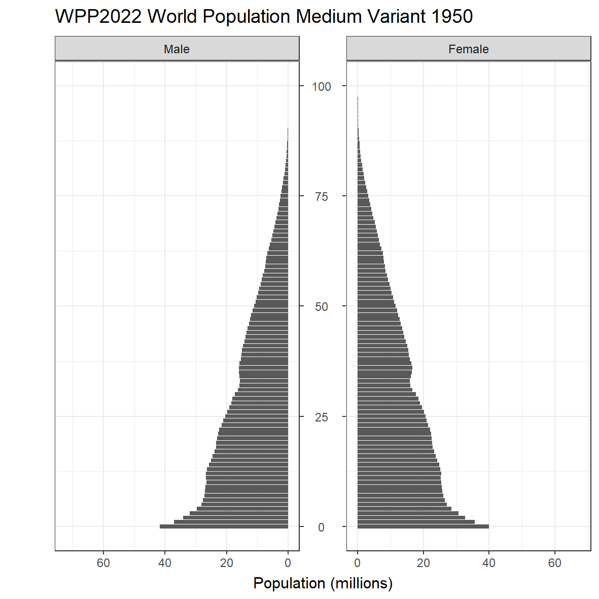

<!-- README.md is generated from README.Rmd. Please edit that file -->

```{r, include = FALSE}
knitr::opts_chunk$set(
  collapse = TRUE,
  comment = "#>",
  fig.path = "man/figures/README-",
  out.width = "100%"
)
```

# tidywpp

<!-- badges: start -->

[](https://CRAN.R-project.org/package=tidywpp) [](https://lifecycle.r-lib.org/articles/stages.html#experimental) [](https://github.com/guyabel/tidywpp/actions)
<!-- badges: end -->

## Installation

<!-- You can install the released version of tidywpp from [CRAN](https://CRAN.R-project.org) with: -->

<!-- ``` r -->

<!-- install.packages("tidywpp") -->

<!-- ``` -->

Install the developmental version with:

```{r eval=FALSE}
library(devtools)
install_github("guyabel/tidywpp", ref = "main")
```

## Examples

Download data based on a `indicator` name. For example, a single indicator from medium variant of latest WPP
```{r cache=TRUE}
library(tidywpp)

get_wpp(indicator = "TFR")
```

A single indicator from multiple variants of WPP2008
```{r, cache=TRUE}
get_wpp(indicator = "TFR", variant_id = c(2, 3, 4), wpp_version = 2008)
```

Multiple population indicators from medium variant of latest WPP
```{r, cache=TRUE}
get_wpp(indicator = c("PopGrowthRate", "IMR"))
```

Some indicators appear in multiple file groups, for example `Births` represents total number of births in the country in the `Demographic_Indicators` file (chosen by default)

```{r, cache=TRUE}
get_wpp(indicator = "Births")
```

Specify indicator_file to get number of births by mothers 5-year age group
```{r, cache=TRUE}
get_wpp(indicator = c("Births", "ASFR"), indicator_file = "Fertility_by_Age5", drop_id_cols = TRUE)
```

### Population data

The `PopTotal`, `PopMale` and `PopFemale` indicators are in many WPP files with a wide range granularity. Set `indicator = "pop"` and use the `pop_sex`, `pop_age`, `pop_freq` and `pop_date` to get desired data from the appropriate indicator_file.

When using `indicator = "pop"` in `get_wpp()`, output defaults to annual total population (summed over age and sex)

```{r, cache=TRUE}
get_wpp(indicator = "pop")
```

Use `pop_sex` to get specific sexes (or both or all)
```{r, cache=TRUE}
get_wpp(indicator = "pop", pop_sex = "male")
```

Use `pop_age` to specify age groups
```{r, cache=TRUE}
get_wpp(indicator = "pop", pop_sex = "both", pop_age = "five")
```

### Full tidy

Tidy sex into a single column and drop id columns
```{r, cache=TRUE}
get_wpp(indicator = "pop", pop_sex = "both", pop_age = "five", tidy_pop_sex = TRUE, drop_id_cols = TRUE)
```

Clean column names with `clean_names = TRUE`

```{r, cache=TRUE}
get_wpp(indicator = c("SRB", "NetMigrations", "PopGrowthRate"), clean_names = TRUE, drop_id_cols = TRUE)
```

## Finding name for `indicator` argument

The `indicator` argument in `get_wpp()` must use a character string corresponding to the `name` column in in the `wpp_indicators` data frame. The `find_indicator()` function can be used to look up the indicator code and availability by variants, for example

```{r, cache = TRUE}
find_indicator(x = "deaths", wpp_version = 2022)
```

## Indicator List

There are 114 different indicators in WPP data (starting from 1998), over four topics

    
### Fertility

|name       |details                                |unit                          |file                   |                                                                                                                                                                                                                                                                                                                 WPP 1998                                                                                                                                                                                                                                                                                                                  |                                                                                                                                                                                                                                                                                                                 WPP 2000                                                                                                                                                                                                                                                                                                                  |                                                                                                                                                                                                                                                                                                                 WPP 2002                                                                                                                                                                                                                                                                                                                  |                                                                                                                                                                                                                                                                                                                 WPP 2004                                                                                                                                                                                                                                                                                                                  |                                                                                                                                                                                                                                                                                                                 WPP 2006                                                                                                                                                                                                                                                                                                                  |                                                                                                                                                                                                                                                                                                                 WPP 2008                                                                                                                                                                                                                                                                                                                  |                                                                                                                                                                                                                                                                                                                 WPP 2010                                                                                                                                                                                                                                                                                                                  |                                                                                                                                                                                                                                                                                                                 WPP 2012                                                                                                                                                                                                                                                                                                                  |                                                                                                                                                                                                                                                                                                                 WPP 2015                                                                                                                                                                                                                                                                                                                  |                                                                                                                                                                                                                                                                                                                 WPP 2017                                                                                                                                                                                                                                                                                                                  |                                                                                                                                                                                                                                                                                                                 WPP 2019                                                                                                                                                                                                                                                                                                                  |                                                                                                                                                                                                                                                                                                                 WPP 2022                                                                                                                                                                                                                                                                                                                  |
|:----------|:--------------------------------------|:-----------------------------|:----------------------|:-----------------------------------------------------------------------------------------------------------------------------------------------------------------------------------------------------------------------------------------------------------------------------------------------------------------------------------------------------------------------------------------------------------------------------------------------------------------------------------------------------------------------------------------------------------------------------------------------------------------------------------------:|:-----------------------------------------------------------------------------------------------------------------------------------------------------------------------------------------------------------------------------------------------------------------------------------------------------------------------------------------------------------------------------------------------------------------------------------------------------------------------------------------------------------------------------------------------------------------------------------------------------------------------------------------:|:-----------------------------------------------------------------------------------------------------------------------------------------------------------------------------------------------------------------------------------------------------------------------------------------------------------------------------------------------------------------------------------------------------------------------------------------------------------------------------------------------------------------------------------------------------------------------------------------------------------------------------------------:|:-----------------------------------------------------------------------------------------------------------------------------------------------------------------------------------------------------------------------------------------------------------------------------------------------------------------------------------------------------------------------------------------------------------------------------------------------------------------------------------------------------------------------------------------------------------------------------------------------------------------------------------------:|:-----------------------------------------------------------------------------------------------------------------------------------------------------------------------------------------------------------------------------------------------------------------------------------------------------------------------------------------------------------------------------------------------------------------------------------------------------------------------------------------------------------------------------------------------------------------------------------------------------------------------------------------:|:-----------------------------------------------------------------------------------------------------------------------------------------------------------------------------------------------------------------------------------------------------------------------------------------------------------------------------------------------------------------------------------------------------------------------------------------------------------------------------------------------------------------------------------------------------------------------------------------------------------------------------------------:|:-----------------------------------------------------------------------------------------------------------------------------------------------------------------------------------------------------------------------------------------------------------------------------------------------------------------------------------------------------------------------------------------------------------------------------------------------------------------------------------------------------------------------------------------------------------------------------------------------------------------------------------------:|:-----------------------------------------------------------------------------------------------------------------------------------------------------------------------------------------------------------------------------------------------------------------------------------------------------------------------------------------------------------------------------------------------------------------------------------------------------------------------------------------------------------------------------------------------------------------------------------------------------------------------------------------:|:-----------------------------------------------------------------------------------------------------------------------------------------------------------------------------------------------------------------------------------------------------------------------------------------------------------------------------------------------------------------------------------------------------------------------------------------------------------------------------------------------------------------------------------------------------------------------------------------------------------------------------------------:|:-----------------------------------------------------------------------------------------------------------------------------------------------------------------------------------------------------------------------------------------------------------------------------------------------------------------------------------------------------------------------------------------------------------------------------------------------------------------------------------------------------------------------------------------------------------------------------------------------------------------------------------------:|:-----------------------------------------------------------------------------------------------------------------------------------------------------------------------------------------------------------------------------------------------------------------------------------------------------------------------------------------------------------------------------------------------------------------------------------------------------------------------------------------------------------------------------------------------------------------------------------------------------------------------------------------:|:-----------------------------------------------------------------------------------------------------------------------------------------------------------------------------------------------------------------------------------------------------------------------------------------------------------------------------------------------------------------------------------------------------------------------------------------------------------------------------------------------------------------------------------------------------------------------------------------------------------------------------------------:|
|ASFR       |Age-specific fertility rate            |births per 1,000 women        |Fertility_by_Age5      | <svg aria-hidden="true" role="img" viewBox="0 0 448 512" style="height:1em;width:0.88em;vertical-align:-0.125em;margin-left:auto;margin-right:auto;font-size:inherit;fill:currentColor;overflow:visible;position:relative;"><path d="M400 480H48c-26.51 0-48-21.49-48-48V80c0-26.51 21.49-48 48-48h352c26.51 0 48 21.49 48 48v352c0 26.51-21.49 48-48 48zm-204.686-98.059l184-184c6.248-6.248 6.248-16.379 0-22.627l-22.627-22.627c-6.248-6.248-16.379-6.249-22.628 0L184 302.745l-70.059-70.059c-6.248-6.248-16.379-6.248-22.628 0l-22.627 22.627c-6.248 6.248-6.248 16.379 0 22.627l104 104c6.249 6.25 16.379 6.25 22.628.001z"/></svg> | <svg aria-hidden="true" role="img" viewBox="0 0 448 512" style="height:1em;width:0.88em;vertical-align:-0.125em;margin-left:auto;margin-right:auto;font-size:inherit;fill:currentColor;overflow:visible;position:relative;"><path d="M400 480H48c-26.51 0-48-21.49-48-48V80c0-26.51 21.49-48 48-48h352c26.51 0 48 21.49 48 48v352c0 26.51-21.49 48-48 48zm-204.686-98.059l184-184c6.248-6.248 6.248-16.379 0-22.627l-22.627-22.627c-6.248-6.248-16.379-6.249-22.628 0L184 302.745l-70.059-70.059c-6.248-6.248-16.379-6.248-22.628 0l-22.627 22.627c-6.248 6.248-6.248 16.379 0 22.627l104 104c6.249 6.25 16.379 6.25 22.628.001z"/></svg> | <svg aria-hidden="true" role="img" viewBox="0 0 448 512" style="height:1em;width:0.88em;vertical-align:-0.125em;margin-left:auto;margin-right:auto;font-size:inherit;fill:currentColor;overflow:visible;position:relative;"><path d="M400 480H48c-26.51 0-48-21.49-48-48V80c0-26.51 21.49-48 48-48h352c26.51 0 48 21.49 48 48v352c0 26.51-21.49 48-48 48zm-204.686-98.059l184-184c6.248-6.248 6.248-16.379 0-22.627l-22.627-22.627c-6.248-6.248-16.379-6.249-22.628 0L184 302.745l-70.059-70.059c-6.248-6.248-16.379-6.248-22.628 0l-22.627 22.627c-6.248 6.248-6.248 16.379 0 22.627l104 104c6.249 6.25 16.379 6.25 22.628.001z"/></svg> | <svg aria-hidden="true" role="img" viewBox="0 0 448 512" style="height:1em;width:0.88em;vertical-align:-0.125em;margin-left:auto;margin-right:auto;font-size:inherit;fill:currentColor;overflow:visible;position:relative;"><path d="M400 480H48c-26.51 0-48-21.49-48-48V80c0-26.51 21.49-48 48-48h352c26.51 0 48 21.49 48 48v352c0 26.51-21.49 48-48 48zm-204.686-98.059l184-184c6.248-6.248 6.248-16.379 0-22.627l-22.627-22.627c-6.248-6.248-16.379-6.249-22.628 0L184 302.745l-70.059-70.059c-6.248-6.248-16.379-6.248-22.628 0l-22.627 22.627c-6.248 6.248-6.248 16.379 0 22.627l104 104c6.249 6.25 16.379 6.25 22.628.001z"/></svg> | <svg aria-hidden="true" role="img" viewBox="0 0 448 512" style="height:1em;width:0.88em;vertical-align:-0.125em;margin-left:auto;margin-right:auto;font-size:inherit;fill:currentColor;overflow:visible;position:relative;"><path d="M400 480H48c-26.51 0-48-21.49-48-48V80c0-26.51 21.49-48 48-48h352c26.51 0 48 21.49 48 48v352c0 26.51-21.49 48-48 48zm-204.686-98.059l184-184c6.248-6.248 6.248-16.379 0-22.627l-22.627-22.627c-6.248-6.248-16.379-6.249-22.628 0L184 302.745l-70.059-70.059c-6.248-6.248-16.379-6.248-22.628 0l-22.627 22.627c-6.248 6.248-6.248 16.379 0 22.627l104 104c6.249 6.25 16.379 6.25 22.628.001z"/></svg> | <svg aria-hidden="true" role="img" viewBox="0 0 448 512" style="height:1em;width:0.88em;vertical-align:-0.125em;margin-left:auto;margin-right:auto;font-size:inherit;fill:currentColor;overflow:visible;position:relative;"><path d="M400 480H48c-26.51 0-48-21.49-48-48V80c0-26.51 21.49-48 48-48h352c26.51 0 48 21.49 48 48v352c0 26.51-21.49 48-48 48zm-204.686-98.059l184-184c6.248-6.248 6.248-16.379 0-22.627l-22.627-22.627c-6.248-6.248-16.379-6.249-22.628 0L184 302.745l-70.059-70.059c-6.248-6.248-16.379-6.248-22.628 0l-22.627 22.627c-6.248 6.248-6.248 16.379 0 22.627l104 104c6.249 6.25 16.379 6.25 22.628.001z"/></svg> | <svg aria-hidden="true" role="img" viewBox="0 0 448 512" style="height:1em;width:0.88em;vertical-align:-0.125em;margin-left:auto;margin-right:auto;font-size:inherit;fill:currentColor;overflow:visible;position:relative;"><path d="M400 480H48c-26.51 0-48-21.49-48-48V80c0-26.51 21.49-48 48-48h352c26.51 0 48 21.49 48 48v352c0 26.51-21.49 48-48 48zm-204.686-98.059l184-184c6.248-6.248 6.248-16.379 0-22.627l-22.627-22.627c-6.248-6.248-16.379-6.249-22.628 0L184 302.745l-70.059-70.059c-6.248-6.248-16.379-6.248-22.628 0l-22.627 22.627c-6.248 6.248-6.248 16.379 0 22.627l104 104c6.249 6.25 16.379 6.25 22.628.001z"/></svg> | <svg aria-hidden="true" role="img" viewBox="0 0 448 512" style="height:1em;width:0.88em;vertical-align:-0.125em;margin-left:auto;margin-right:auto;font-size:inherit;fill:currentColor;overflow:visible;position:relative;"><path d="M400 480H48c-26.51 0-48-21.49-48-48V80c0-26.51 21.49-48 48-48h352c26.51 0 48 21.49 48 48v352c0 26.51-21.49 48-48 48zm-204.686-98.059l184-184c6.248-6.248 6.248-16.379 0-22.627l-22.627-22.627c-6.248-6.248-16.379-6.249-22.628 0L184 302.745l-70.059-70.059c-6.248-6.248-16.379-6.248-22.628 0l-22.627 22.627c-6.248 6.248-6.248 16.379 0 22.627l104 104c6.249 6.25 16.379 6.25 22.628.001z"/></svg> | <svg aria-hidden="true" role="img" viewBox="0 0 448 512" style="height:1em;width:0.88em;vertical-align:-0.125em;margin-left:auto;margin-right:auto;font-size:inherit;fill:currentColor;overflow:visible;position:relative;"><path d="M400 480H48c-26.51 0-48-21.49-48-48V80c0-26.51 21.49-48 48-48h352c26.51 0 48 21.49 48 48v352c0 26.51-21.49 48-48 48zm-204.686-98.059l184-184c6.248-6.248 6.248-16.379 0-22.627l-22.627-22.627c-6.248-6.248-16.379-6.249-22.628 0L184 302.745l-70.059-70.059c-6.248-6.248-16.379-6.248-22.628 0l-22.627 22.627c-6.248 6.248-6.248 16.379 0 22.627l104 104c6.249 6.25 16.379 6.25 22.628.001z"/></svg> | <svg aria-hidden="true" role="img" viewBox="0 0 448 512" style="height:1em;width:0.88em;vertical-align:-0.125em;margin-left:auto;margin-right:auto;font-size:inherit;fill:currentColor;overflow:visible;position:relative;"><path d="M400 480H48c-26.51 0-48-21.49-48-48V80c0-26.51 21.49-48 48-48h352c26.51 0 48 21.49 48 48v352c0 26.51-21.49 48-48 48zm-204.686-98.059l184-184c6.248-6.248 6.248-16.379 0-22.627l-22.627-22.627c-6.248-6.248-16.379-6.249-22.628 0L184 302.745l-70.059-70.059c-6.248-6.248-16.379-6.248-22.628 0l-22.627 22.627c-6.248 6.248-6.248 16.379 0 22.627l104 104c6.249 6.25 16.379 6.25 22.628.001z"/></svg> | <svg aria-hidden="true" role="img" viewBox="0 0 448 512" style="height:1em;width:0.88em;vertical-align:-0.125em;margin-left:auto;margin-right:auto;font-size:inherit;fill:currentColor;overflow:visible;position:relative;"><path d="M400 480H48c-26.51 0-48-21.49-48-48V80c0-26.51 21.49-48 48-48h352c26.51 0 48 21.49 48 48v352c0 26.51-21.49 48-48 48zm-204.686-98.059l184-184c6.248-6.248 6.248-16.379 0-22.627l-22.627-22.627c-6.248-6.248-16.379-6.249-22.628 0L184 302.745l-70.059-70.059c-6.248-6.248-16.379-6.248-22.628 0l-22.627 22.627c-6.248 6.248-6.248 16.379 0 22.627l104 104c6.249 6.25 16.379 6.25 22.628.001z"/></svg> | <svg aria-hidden="true" role="img" viewBox="0 0 448 512" style="height:1em;width:0.88em;vertical-align:-0.125em;margin-left:auto;margin-right:auto;font-size:inherit;fill:currentColor;overflow:visible;position:relative;"><path d="M400 480H48c-26.51 0-48-21.49-48-48V80c0-26.51 21.49-48 48-48h352c26.51 0 48 21.49 48 48v352c0 26.51-21.49 48-48 48zm-204.686-98.059l184-184c6.248-6.248 6.248-16.379 0-22.627l-22.627-22.627c-6.248-6.248-16.379-6.249-22.628 0L184 302.745l-70.059-70.059c-6.248-6.248-16.379-6.248-22.628 0l-22.627 22.627c-6.248 6.248-6.248 16.379 0 22.627l104 104c6.249 6.25 16.379 6.25 22.628.001z"/></svg> |
|ASFR       |Age-specific fertility rate            |births per 1,000 women        |Fertility_by_Age1      |                                                                                                                                          <svg aria-hidden="true" role="img" viewBox="0 0 448 512" style="height:1em;width:0.88em;vertical-align:-0.125em;margin-left:auto;margin-right:auto;font-size:inherit;fill:currentColor;overflow:visible;position:relative;"><path d="M400 32H48C21.5 32 0 53.5 0 80v352c0 26.5 21.5 48 48 48h352c26.5 0 48-21.5 48-48V80c0-26.5-21.5-48-48-48z"/></svg>                                                                                                                                          |                                                                                                                                          <svg aria-hidden="true" role="img" viewBox="0 0 448 512" style="height:1em;width:0.88em;vertical-align:-0.125em;margin-left:auto;margin-right:auto;font-size:inherit;fill:currentColor;overflow:visible;position:relative;"><path d="M400 32H48C21.5 32 0 53.5 0 80v352c0 26.5 21.5 48 48 48h352c26.5 0 48-21.5 48-48V80c0-26.5-21.5-48-48-48z"/></svg>                                                                                                                                          |                                                                                                                                          <svg aria-hidden="true" role="img" viewBox="0 0 448 512" style="height:1em;width:0.88em;vertical-align:-0.125em;margin-left:auto;margin-right:auto;font-size:inherit;fill:currentColor;overflow:visible;position:relative;"><path d="M400 32H48C21.5 32 0 53.5 0 80v352c0 26.5 21.5 48 48 48h352c26.5 0 48-21.5 48-48V80c0-26.5-21.5-48-48-48z"/></svg>                                                                                                                                          |                                                                                                                                          <svg aria-hidden="true" role="img" viewBox="0 0 448 512" style="height:1em;width:0.88em;vertical-align:-0.125em;margin-left:auto;margin-right:auto;font-size:inherit;fill:currentColor;overflow:visible;position:relative;"><path d="M400 32H48C21.5 32 0 53.5 0 80v352c0 26.5 21.5 48 48 48h352c26.5 0 48-21.5 48-48V80c0-26.5-21.5-48-48-48z"/></svg>                                                                                                                                          |                                                                                                                                          <svg aria-hidden="true" role="img" viewBox="0 0 448 512" style="height:1em;width:0.88em;vertical-align:-0.125em;margin-left:auto;margin-right:auto;font-size:inherit;fill:currentColor;overflow:visible;position:relative;"><path d="M400 32H48C21.5 32 0 53.5 0 80v352c0 26.5 21.5 48 48 48h352c26.5 0 48-21.5 48-48V80c0-26.5-21.5-48-48-48z"/></svg>                                                                                                                                          |                                                                                                                                          <svg aria-hidden="true" role="img" viewBox="0 0 448 512" style="height:1em;width:0.88em;vertical-align:-0.125em;margin-left:auto;margin-right:auto;font-size:inherit;fill:currentColor;overflow:visible;position:relative;"><path d="M400 32H48C21.5 32 0 53.5 0 80v352c0 26.5 21.5 48 48 48h352c26.5 0 48-21.5 48-48V80c0-26.5-21.5-48-48-48z"/></svg>                                                                                                                                          |                                                                                                                                          <svg aria-hidden="true" role="img" viewBox="0 0 448 512" style="height:1em;width:0.88em;vertical-align:-0.125em;margin-left:auto;margin-right:auto;font-size:inherit;fill:currentColor;overflow:visible;position:relative;"><path d="M400 32H48C21.5 32 0 53.5 0 80v352c0 26.5 21.5 48 48 48h352c26.5 0 48-21.5 48-48V80c0-26.5-21.5-48-48-48z"/></svg>                                                                                                                                          |                                                                                                                                          <svg aria-hidden="true" role="img" viewBox="0 0 448 512" style="height:1em;width:0.88em;vertical-align:-0.125em;margin-left:auto;margin-right:auto;font-size:inherit;fill:currentColor;overflow:visible;position:relative;"><path d="M400 32H48C21.5 32 0 53.5 0 80v352c0 26.5 21.5 48 48 48h352c26.5 0 48-21.5 48-48V80c0-26.5-21.5-48-48-48z"/></svg>                                                                                                                                          |                                                                                                                                          <svg aria-hidden="true" role="img" viewBox="0 0 448 512" style="height:1em;width:0.88em;vertical-align:-0.125em;margin-left:auto;margin-right:auto;font-size:inherit;fill:currentColor;overflow:visible;position:relative;"><path d="M400 32H48C21.5 32 0 53.5 0 80v352c0 26.5 21.5 48 48 48h352c26.5 0 48-21.5 48-48V80c0-26.5-21.5-48-48-48z"/></svg>                                                                                                                                          |                                                                                                                                          <svg aria-hidden="true" role="img" viewBox="0 0 448 512" style="height:1em;width:0.88em;vertical-align:-0.125em;margin-left:auto;margin-right:auto;font-size:inherit;fill:currentColor;overflow:visible;position:relative;"><path d="M400 32H48C21.5 32 0 53.5 0 80v352c0 26.5 21.5 48 48 48h352c26.5 0 48-21.5 48-48V80c0-26.5-21.5-48-48-48z"/></svg>                                                                                                                                          |                                                                                                                                          <svg aria-hidden="true" role="img" viewBox="0 0 448 512" style="height:1em;width:0.88em;vertical-align:-0.125em;margin-left:auto;margin-right:auto;font-size:inherit;fill:currentColor;overflow:visible;position:relative;"><path d="M400 32H48C21.5 32 0 53.5 0 80v352c0 26.5 21.5 48 48 48h352c26.5 0 48-21.5 48-48V80c0-26.5-21.5-48-48-48z"/></svg>                                                                                                                                          | <svg aria-hidden="true" role="img" viewBox="0 0 448 512" style="height:1em;width:0.88em;vertical-align:-0.125em;margin-left:auto;margin-right:auto;font-size:inherit;fill:currentColor;overflow:visible;position:relative;"><path d="M400 480H48c-26.51 0-48-21.49-48-48V80c0-26.51 21.49-48 48-48h352c26.51 0 48 21.49 48 48v352c0 26.51-21.49 48-48 48zm-204.686-98.059l184-184c6.248-6.248 6.248-16.379 0-22.627l-22.627-22.627c-6.248-6.248-16.379-6.249-22.628 0L184 302.745l-70.059-70.059c-6.248-6.248-16.379-6.248-22.628 0l-22.627 22.627c-6.248 6.248-6.248 16.379 0 22.627l104 104c6.249 6.25 16.379 6.25 22.628.001z"/></svg> |
|Births     |Births                                 |thousands                     |Demographic_Indicators | <svg aria-hidden="true" role="img" viewBox="0 0 448 512" style="height:1em;width:0.88em;vertical-align:-0.125em;margin-left:auto;margin-right:auto;font-size:inherit;fill:currentColor;overflow:visible;position:relative;"><path d="M400 480H48c-26.51 0-48-21.49-48-48V80c0-26.51 21.49-48 48-48h352c26.51 0 48 21.49 48 48v352c0 26.51-21.49 48-48 48zm-204.686-98.059l184-184c6.248-6.248 6.248-16.379 0-22.627l-22.627-22.627c-6.248-6.248-16.379-6.249-22.628 0L184 302.745l-70.059-70.059c-6.248-6.248-16.379-6.248-22.628 0l-22.627 22.627c-6.248 6.248-6.248 16.379 0 22.627l104 104c6.249 6.25 16.379 6.25 22.628.001z"/></svg> | <svg aria-hidden="true" role="img" viewBox="0 0 448 512" style="height:1em;width:0.88em;vertical-align:-0.125em;margin-left:auto;margin-right:auto;font-size:inherit;fill:currentColor;overflow:visible;position:relative;"><path d="M400 480H48c-26.51 0-48-21.49-48-48V80c0-26.51 21.49-48 48-48h352c26.51 0 48 21.49 48 48v352c0 26.51-21.49 48-48 48zm-204.686-98.059l184-184c6.248-6.248 6.248-16.379 0-22.627l-22.627-22.627c-6.248-6.248-16.379-6.249-22.628 0L184 302.745l-70.059-70.059c-6.248-6.248-16.379-6.248-22.628 0l-22.627 22.627c-6.248 6.248-6.248 16.379 0 22.627l104 104c6.249 6.25 16.379 6.25 22.628.001z"/></svg> | <svg aria-hidden="true" role="img" viewBox="0 0 448 512" style="height:1em;width:0.88em;vertical-align:-0.125em;margin-left:auto;margin-right:auto;font-size:inherit;fill:currentColor;overflow:visible;position:relative;"><path d="M400 480H48c-26.51 0-48-21.49-48-48V80c0-26.51 21.49-48 48-48h352c26.51 0 48 21.49 48 48v352c0 26.51-21.49 48-48 48zm-204.686-98.059l184-184c6.248-6.248 6.248-16.379 0-22.627l-22.627-22.627c-6.248-6.248-16.379-6.249-22.628 0L184 302.745l-70.059-70.059c-6.248-6.248-16.379-6.248-22.628 0l-22.627 22.627c-6.248 6.248-6.248 16.379 0 22.627l104 104c6.249 6.25 16.379 6.25 22.628.001z"/></svg> | <svg aria-hidden="true" role="img" viewBox="0 0 448 512" style="height:1em;width:0.88em;vertical-align:-0.125em;margin-left:auto;margin-right:auto;font-size:inherit;fill:currentColor;overflow:visible;position:relative;"><path d="M400 480H48c-26.51 0-48-21.49-48-48V80c0-26.51 21.49-48 48-48h352c26.51 0 48 21.49 48 48v352c0 26.51-21.49 48-48 48zm-204.686-98.059l184-184c6.248-6.248 6.248-16.379 0-22.627l-22.627-22.627c-6.248-6.248-16.379-6.249-22.628 0L184 302.745l-70.059-70.059c-6.248-6.248-16.379-6.248-22.628 0l-22.627 22.627c-6.248 6.248-6.248 16.379 0 22.627l104 104c6.249 6.25 16.379 6.25 22.628.001z"/></svg> | <svg aria-hidden="true" role="img" viewBox="0 0 448 512" style="height:1em;width:0.88em;vertical-align:-0.125em;margin-left:auto;margin-right:auto;font-size:inherit;fill:currentColor;overflow:visible;position:relative;"><path d="M400 480H48c-26.51 0-48-21.49-48-48V80c0-26.51 21.49-48 48-48h352c26.51 0 48 21.49 48 48v352c0 26.51-21.49 48-48 48zm-204.686-98.059l184-184c6.248-6.248 6.248-16.379 0-22.627l-22.627-22.627c-6.248-6.248-16.379-6.249-22.628 0L184 302.745l-70.059-70.059c-6.248-6.248-16.379-6.248-22.628 0l-22.627 22.627c-6.248 6.248-6.248 16.379 0 22.627l104 104c6.249 6.25 16.379 6.25 22.628.001z"/></svg> | <svg aria-hidden="true" role="img" viewBox="0 0 448 512" style="height:1em;width:0.88em;vertical-align:-0.125em;margin-left:auto;margin-right:auto;font-size:inherit;fill:currentColor;overflow:visible;position:relative;"><path d="M400 480H48c-26.51 0-48-21.49-48-48V80c0-26.51 21.49-48 48-48h352c26.51 0 48 21.49 48 48v352c0 26.51-21.49 48-48 48zm-204.686-98.059l184-184c6.248-6.248 6.248-16.379 0-22.627l-22.627-22.627c-6.248-6.248-16.379-6.249-22.628 0L184 302.745l-70.059-70.059c-6.248-6.248-16.379-6.248-22.628 0l-22.627 22.627c-6.248 6.248-6.248 16.379 0 22.627l104 104c6.249 6.25 16.379 6.25 22.628.001z"/></svg> | <svg aria-hidden="true" role="img" viewBox="0 0 448 512" style="height:1em;width:0.88em;vertical-align:-0.125em;margin-left:auto;margin-right:auto;font-size:inherit;fill:currentColor;overflow:visible;position:relative;"><path d="M400 480H48c-26.51 0-48-21.49-48-48V80c0-26.51 21.49-48 48-48h352c26.51 0 48 21.49 48 48v352c0 26.51-21.49 48-48 48zm-204.686-98.059l184-184c6.248-6.248 6.248-16.379 0-22.627l-22.627-22.627c-6.248-6.248-16.379-6.249-22.628 0L184 302.745l-70.059-70.059c-6.248-6.248-16.379-6.248-22.628 0l-22.627 22.627c-6.248 6.248-6.248 16.379 0 22.627l104 104c6.249 6.25 16.379 6.25 22.628.001z"/></svg> | <svg aria-hidden="true" role="img" viewBox="0 0 448 512" style="height:1em;width:0.88em;vertical-align:-0.125em;margin-left:auto;margin-right:auto;font-size:inherit;fill:currentColor;overflow:visible;position:relative;"><path d="M400 480H48c-26.51 0-48-21.49-48-48V80c0-26.51 21.49-48 48-48h352c26.51 0 48 21.49 48 48v352c0 26.51-21.49 48-48 48zm-204.686-98.059l184-184c6.248-6.248 6.248-16.379 0-22.627l-22.627-22.627c-6.248-6.248-16.379-6.249-22.628 0L184 302.745l-70.059-70.059c-6.248-6.248-16.379-6.248-22.628 0l-22.627 22.627c-6.248 6.248-6.248 16.379 0 22.627l104 104c6.249 6.25 16.379 6.25 22.628.001z"/></svg> | <svg aria-hidden="true" role="img" viewBox="0 0 448 512" style="height:1em;width:0.88em;vertical-align:-0.125em;margin-left:auto;margin-right:auto;font-size:inherit;fill:currentColor;overflow:visible;position:relative;"><path d="M400 480H48c-26.51 0-48-21.49-48-48V80c0-26.51 21.49-48 48-48h352c26.51 0 48 21.49 48 48v352c0 26.51-21.49 48-48 48zm-204.686-98.059l184-184c6.248-6.248 6.248-16.379 0-22.627l-22.627-22.627c-6.248-6.248-16.379-6.249-22.628 0L184 302.745l-70.059-70.059c-6.248-6.248-16.379-6.248-22.628 0l-22.627 22.627c-6.248 6.248-6.248 16.379 0 22.627l104 104c6.249 6.25 16.379 6.25 22.628.001z"/></svg> | <svg aria-hidden="true" role="img" viewBox="0 0 448 512" style="height:1em;width:0.88em;vertical-align:-0.125em;margin-left:auto;margin-right:auto;font-size:inherit;fill:currentColor;overflow:visible;position:relative;"><path d="M400 480H48c-26.51 0-48-21.49-48-48V80c0-26.51 21.49-48 48-48h352c26.51 0 48 21.49 48 48v352c0 26.51-21.49 48-48 48zm-204.686-98.059l184-184c6.248-6.248 6.248-16.379 0-22.627l-22.627-22.627c-6.248-6.248-16.379-6.249-22.628 0L184 302.745l-70.059-70.059c-6.248-6.248-16.379-6.248-22.628 0l-22.627 22.627c-6.248 6.248-6.248 16.379 0 22.627l104 104c6.249 6.25 16.379 6.25 22.628.001z"/></svg> | <svg aria-hidden="true" role="img" viewBox="0 0 448 512" style="height:1em;width:0.88em;vertical-align:-0.125em;margin-left:auto;margin-right:auto;font-size:inherit;fill:currentColor;overflow:visible;position:relative;"><path d="M400 480H48c-26.51 0-48-21.49-48-48V80c0-26.51 21.49-48 48-48h352c26.51 0 48 21.49 48 48v352c0 26.51-21.49 48-48 48zm-204.686-98.059l184-184c6.248-6.248 6.248-16.379 0-22.627l-22.627-22.627c-6.248-6.248-16.379-6.249-22.628 0L184 302.745l-70.059-70.059c-6.248-6.248-16.379-6.248-22.628 0l-22.627 22.627c-6.248 6.248-6.248 16.379 0 22.627l104 104c6.249 6.25 16.379 6.25 22.628.001z"/></svg> | <svg aria-hidden="true" role="img" viewBox="0 0 448 512" style="height:1em;width:0.88em;vertical-align:-0.125em;margin-left:auto;margin-right:auto;font-size:inherit;fill:currentColor;overflow:visible;position:relative;"><path d="M400 480H48c-26.51 0-48-21.49-48-48V80c0-26.51 21.49-48 48-48h352c26.51 0 48 21.49 48 48v352c0 26.51-21.49 48-48 48zm-204.686-98.059l184-184c6.248-6.248 6.248-16.379 0-22.627l-22.627-22.627c-6.248-6.248-16.379-6.249-22.628 0L184 302.745l-70.059-70.059c-6.248-6.248-16.379-6.248-22.628 0l-22.627 22.627c-6.248 6.248-6.248 16.379 0 22.627l104 104c6.249 6.25 16.379 6.25 22.628.001z"/></svg> |
|Births     |Births                                 |thousands                     |Fertility_by_Age5      | <svg aria-hidden="true" role="img" viewBox="0 0 448 512" style="height:1em;width:0.88em;vertical-align:-0.125em;margin-left:auto;margin-right:auto;font-size:inherit;fill:currentColor;overflow:visible;position:relative;"><path d="M400 480H48c-26.51 0-48-21.49-48-48V80c0-26.51 21.49-48 48-48h352c26.51 0 48 21.49 48 48v352c0 26.51-21.49 48-48 48zm-204.686-98.059l184-184c6.248-6.248 6.248-16.379 0-22.627l-22.627-22.627c-6.248-6.248-16.379-6.249-22.628 0L184 302.745l-70.059-70.059c-6.248-6.248-16.379-6.248-22.628 0l-22.627 22.627c-6.248 6.248-6.248 16.379 0 22.627l104 104c6.249 6.25 16.379 6.25 22.628.001z"/></svg> | <svg aria-hidden="true" role="img" viewBox="0 0 448 512" style="height:1em;width:0.88em;vertical-align:-0.125em;margin-left:auto;margin-right:auto;font-size:inherit;fill:currentColor;overflow:visible;position:relative;"><path d="M400 480H48c-26.51 0-48-21.49-48-48V80c0-26.51 21.49-48 48-48h352c26.51 0 48 21.49 48 48v352c0 26.51-21.49 48-48 48zm-204.686-98.059l184-184c6.248-6.248 6.248-16.379 0-22.627l-22.627-22.627c-6.248-6.248-16.379-6.249-22.628 0L184 302.745l-70.059-70.059c-6.248-6.248-16.379-6.248-22.628 0l-22.627 22.627c-6.248 6.248-6.248 16.379 0 22.627l104 104c6.249 6.25 16.379 6.25 22.628.001z"/></svg> | <svg aria-hidden="true" role="img" viewBox="0 0 448 512" style="height:1em;width:0.88em;vertical-align:-0.125em;margin-left:auto;margin-right:auto;font-size:inherit;fill:currentColor;overflow:visible;position:relative;"><path d="M400 480H48c-26.51 0-48-21.49-48-48V80c0-26.51 21.49-48 48-48h352c26.51 0 48 21.49 48 48v352c0 26.51-21.49 48-48 48zm-204.686-98.059l184-184c6.248-6.248 6.248-16.379 0-22.627l-22.627-22.627c-6.248-6.248-16.379-6.249-22.628 0L184 302.745l-70.059-70.059c-6.248-6.248-16.379-6.248-22.628 0l-22.627 22.627c-6.248 6.248-6.248 16.379 0 22.627l104 104c6.249 6.25 16.379 6.25 22.628.001z"/></svg> | <svg aria-hidden="true" role="img" viewBox="0 0 448 512" style="height:1em;width:0.88em;vertical-align:-0.125em;margin-left:auto;margin-right:auto;font-size:inherit;fill:currentColor;overflow:visible;position:relative;"><path d="M400 480H48c-26.51 0-48-21.49-48-48V80c0-26.51 21.49-48 48-48h352c26.51 0 48 21.49 48 48v352c0 26.51-21.49 48-48 48zm-204.686-98.059l184-184c6.248-6.248 6.248-16.379 0-22.627l-22.627-22.627c-6.248-6.248-16.379-6.249-22.628 0L184 302.745l-70.059-70.059c-6.248-6.248-16.379-6.248-22.628 0l-22.627 22.627c-6.248 6.248-6.248 16.379 0 22.627l104 104c6.249 6.25 16.379 6.25 22.628.001z"/></svg> | <svg aria-hidden="true" role="img" viewBox="0 0 448 512" style="height:1em;width:0.88em;vertical-align:-0.125em;margin-left:auto;margin-right:auto;font-size:inherit;fill:currentColor;overflow:visible;position:relative;"><path d="M400 480H48c-26.51 0-48-21.49-48-48V80c0-26.51 21.49-48 48-48h352c26.51 0 48 21.49 48 48v352c0 26.51-21.49 48-48 48zm-204.686-98.059l184-184c6.248-6.248 6.248-16.379 0-22.627l-22.627-22.627c-6.248-6.248-16.379-6.249-22.628 0L184 302.745l-70.059-70.059c-6.248-6.248-16.379-6.248-22.628 0l-22.627 22.627c-6.248 6.248-6.248 16.379 0 22.627l104 104c6.249 6.25 16.379 6.25 22.628.001z"/></svg> | <svg aria-hidden="true" role="img" viewBox="0 0 448 512" style="height:1em;width:0.88em;vertical-align:-0.125em;margin-left:auto;margin-right:auto;font-size:inherit;fill:currentColor;overflow:visible;position:relative;"><path d="M400 480H48c-26.51 0-48-21.49-48-48V80c0-26.51 21.49-48 48-48h352c26.51 0 48 21.49 48 48v352c0 26.51-21.49 48-48 48zm-204.686-98.059l184-184c6.248-6.248 6.248-16.379 0-22.627l-22.627-22.627c-6.248-6.248-16.379-6.249-22.628 0L184 302.745l-70.059-70.059c-6.248-6.248-16.379-6.248-22.628 0l-22.627 22.627c-6.248 6.248-6.248 16.379 0 22.627l104 104c6.249 6.25 16.379 6.25 22.628.001z"/></svg> | <svg aria-hidden="true" role="img" viewBox="0 0 448 512" style="height:1em;width:0.88em;vertical-align:-0.125em;margin-left:auto;margin-right:auto;font-size:inherit;fill:currentColor;overflow:visible;position:relative;"><path d="M400 480H48c-26.51 0-48-21.49-48-48V80c0-26.51 21.49-48 48-48h352c26.51 0 48 21.49 48 48v352c0 26.51-21.49 48-48 48zm-204.686-98.059l184-184c6.248-6.248 6.248-16.379 0-22.627l-22.627-22.627c-6.248-6.248-16.379-6.249-22.628 0L184 302.745l-70.059-70.059c-6.248-6.248-16.379-6.248-22.628 0l-22.627 22.627c-6.248 6.248-6.248 16.379 0 22.627l104 104c6.249 6.25 16.379 6.25 22.628.001z"/></svg> | <svg aria-hidden="true" role="img" viewBox="0 0 448 512" style="height:1em;width:0.88em;vertical-align:-0.125em;margin-left:auto;margin-right:auto;font-size:inherit;fill:currentColor;overflow:visible;position:relative;"><path d="M400 480H48c-26.51 0-48-21.49-48-48V80c0-26.51 21.49-48 48-48h352c26.51 0 48 21.49 48 48v352c0 26.51-21.49 48-48 48zm-204.686-98.059l184-184c6.248-6.248 6.248-16.379 0-22.627l-22.627-22.627c-6.248-6.248-16.379-6.249-22.628 0L184 302.745l-70.059-70.059c-6.248-6.248-16.379-6.248-22.628 0l-22.627 22.627c-6.248 6.248-6.248 16.379 0 22.627l104 104c6.249 6.25 16.379 6.25 22.628.001z"/></svg> | <svg aria-hidden="true" role="img" viewBox="0 0 448 512" style="height:1em;width:0.88em;vertical-align:-0.125em;margin-left:auto;margin-right:auto;font-size:inherit;fill:currentColor;overflow:visible;position:relative;"><path d="M400 480H48c-26.51 0-48-21.49-48-48V80c0-26.51 21.49-48 48-48h352c26.51 0 48 21.49 48 48v352c0 26.51-21.49 48-48 48zm-204.686-98.059l184-184c6.248-6.248 6.248-16.379 0-22.627l-22.627-22.627c-6.248-6.248-16.379-6.249-22.628 0L184 302.745l-70.059-70.059c-6.248-6.248-16.379-6.248-22.628 0l-22.627 22.627c-6.248 6.248-6.248 16.379 0 22.627l104 104c6.249 6.25 16.379 6.25 22.628.001z"/></svg> | <svg aria-hidden="true" role="img" viewBox="0 0 448 512" style="height:1em;width:0.88em;vertical-align:-0.125em;margin-left:auto;margin-right:auto;font-size:inherit;fill:currentColor;overflow:visible;position:relative;"><path d="M400 480H48c-26.51 0-48-21.49-48-48V80c0-26.51 21.49-48 48-48h352c26.51 0 48 21.49 48 48v352c0 26.51-21.49 48-48 48zm-204.686-98.059l184-184c6.248-6.248 6.248-16.379 0-22.627l-22.627-22.627c-6.248-6.248-16.379-6.249-22.628 0L184 302.745l-70.059-70.059c-6.248-6.248-16.379-6.248-22.628 0l-22.627 22.627c-6.248 6.248-6.248 16.379 0 22.627l104 104c6.249 6.25 16.379 6.25 22.628.001z"/></svg> | <svg aria-hidden="true" role="img" viewBox="0 0 448 512" style="height:1em;width:0.88em;vertical-align:-0.125em;margin-left:auto;margin-right:auto;font-size:inherit;fill:currentColor;overflow:visible;position:relative;"><path d="M400 480H48c-26.51 0-48-21.49-48-48V80c0-26.51 21.49-48 48-48h352c26.51 0 48 21.49 48 48v352c0 26.51-21.49 48-48 48zm-204.686-98.059l184-184c6.248-6.248 6.248-16.379 0-22.627l-22.627-22.627c-6.248-6.248-16.379-6.249-22.628 0L184 302.745l-70.059-70.059c-6.248-6.248-16.379-6.248-22.628 0l-22.627 22.627c-6.248 6.248-6.248 16.379 0 22.627l104 104c6.249 6.25 16.379 6.25 22.628.001z"/></svg> | <svg aria-hidden="true" role="img" viewBox="0 0 448 512" style="height:1em;width:0.88em;vertical-align:-0.125em;margin-left:auto;margin-right:auto;font-size:inherit;fill:currentColor;overflow:visible;position:relative;"><path d="M400 480H48c-26.51 0-48-21.49-48-48V80c0-26.51 21.49-48 48-48h352c26.51 0 48 21.49 48 48v352c0 26.51-21.49 48-48 48zm-204.686-98.059l184-184c6.248-6.248 6.248-16.379 0-22.627l-22.627-22.627c-6.248-6.248-16.379-6.249-22.628 0L184 302.745l-70.059-70.059c-6.248-6.248-16.379-6.248-22.628 0l-22.627 22.627c-6.248 6.248-6.248 16.379 0 22.627l104 104c6.249 6.25 16.379 6.25 22.628.001z"/></svg> |
|Births     |Births                                 |thousands                     |Fertility_by_Age1      |                                                                                                                                          <svg aria-hidden="true" role="img" viewBox="0 0 448 512" style="height:1em;width:0.88em;vertical-align:-0.125em;margin-left:auto;margin-right:auto;font-size:inherit;fill:currentColor;overflow:visible;position:relative;"><path d="M400 32H48C21.5 32 0 53.5 0 80v352c0 26.5 21.5 48 48 48h352c26.5 0 48-21.5 48-48V80c0-26.5-21.5-48-48-48z"/></svg>                                                                                                                                          |                                                                                                                                          <svg aria-hidden="true" role="img" viewBox="0 0 448 512" style="height:1em;width:0.88em;vertical-align:-0.125em;margin-left:auto;margin-right:auto;font-size:inherit;fill:currentColor;overflow:visible;position:relative;"><path d="M400 32H48C21.5 32 0 53.5 0 80v352c0 26.5 21.5 48 48 48h352c26.5 0 48-21.5 48-48V80c0-26.5-21.5-48-48-48z"/></svg>                                                                                                                                          |                                                                                                                                          <svg aria-hidden="true" role="img" viewBox="0 0 448 512" style="height:1em;width:0.88em;vertical-align:-0.125em;margin-left:auto;margin-right:auto;font-size:inherit;fill:currentColor;overflow:visible;position:relative;"><path d="M400 32H48C21.5 32 0 53.5 0 80v352c0 26.5 21.5 48 48 48h352c26.5 0 48-21.5 48-48V80c0-26.5-21.5-48-48-48z"/></svg>                                                                                                                                          |                                                                                                                                          <svg aria-hidden="true" role="img" viewBox="0 0 448 512" style="height:1em;width:0.88em;vertical-align:-0.125em;margin-left:auto;margin-right:auto;font-size:inherit;fill:currentColor;overflow:visible;position:relative;"><path d="M400 32H48C21.5 32 0 53.5 0 80v352c0 26.5 21.5 48 48 48h352c26.5 0 48-21.5 48-48V80c0-26.5-21.5-48-48-48z"/></svg>                                                                                                                                          |                                                                                                                                          <svg aria-hidden="true" role="img" viewBox="0 0 448 512" style="height:1em;width:0.88em;vertical-align:-0.125em;margin-left:auto;margin-right:auto;font-size:inherit;fill:currentColor;overflow:visible;position:relative;"><path d="M400 32H48C21.5 32 0 53.5 0 80v352c0 26.5 21.5 48 48 48h352c26.5 0 48-21.5 48-48V80c0-26.5-21.5-48-48-48z"/></svg>                                                                                                                                          |                                                                                                                                          <svg aria-hidden="true" role="img" viewBox="0 0 448 512" style="height:1em;width:0.88em;vertical-align:-0.125em;margin-left:auto;margin-right:auto;font-size:inherit;fill:currentColor;overflow:visible;position:relative;"><path d="M400 32H48C21.5 32 0 53.5 0 80v352c0 26.5 21.5 48 48 48h352c26.5 0 48-21.5 48-48V80c0-26.5-21.5-48-48-48z"/></svg>                                                                                                                                          |                                                                                                                                          <svg aria-hidden="true" role="img" viewBox="0 0 448 512" style="height:1em;width:0.88em;vertical-align:-0.125em;margin-left:auto;margin-right:auto;font-size:inherit;fill:currentColor;overflow:visible;position:relative;"><path d="M400 32H48C21.5 32 0 53.5 0 80v352c0 26.5 21.5 48 48 48h352c26.5 0 48-21.5 48-48V80c0-26.5-21.5-48-48-48z"/></svg>                                                                                                                                          |                                                                                                                                          <svg aria-hidden="true" role="img" viewBox="0 0 448 512" style="height:1em;width:0.88em;vertical-align:-0.125em;margin-left:auto;margin-right:auto;font-size:inherit;fill:currentColor;overflow:visible;position:relative;"><path d="M400 32H48C21.5 32 0 53.5 0 80v352c0 26.5 21.5 48 48 48h352c26.5 0 48-21.5 48-48V80c0-26.5-21.5-48-48-48z"/></svg>                                                                                                                                          |                                                                                                                                          <svg aria-hidden="true" role="img" viewBox="0 0 448 512" style="height:1em;width:0.88em;vertical-align:-0.125em;margin-left:auto;margin-right:auto;font-size:inherit;fill:currentColor;overflow:visible;position:relative;"><path d="M400 32H48C21.5 32 0 53.5 0 80v352c0 26.5 21.5 48 48 48h352c26.5 0 48-21.5 48-48V80c0-26.5-21.5-48-48-48z"/></svg>                                                                                                                                          |                                                                                                                                          <svg aria-hidden="true" role="img" viewBox="0 0 448 512" style="height:1em;width:0.88em;vertical-align:-0.125em;margin-left:auto;margin-right:auto;font-size:inherit;fill:currentColor;overflow:visible;position:relative;"><path d="M400 32H48C21.5 32 0 53.5 0 80v352c0 26.5 21.5 48 48 48h352c26.5 0 48-21.5 48-48V80c0-26.5-21.5-48-48-48z"/></svg>                                                                                                                                          |                                                                                                                                          <svg aria-hidden="true" role="img" viewBox="0 0 448 512" style="height:1em;width:0.88em;vertical-align:-0.125em;margin-left:auto;margin-right:auto;font-size:inherit;fill:currentColor;overflow:visible;position:relative;"><path d="M400 32H48C21.5 32 0 53.5 0 80v352c0 26.5 21.5 48 48 48h352c26.5 0 48-21.5 48-48V80c0-26.5-21.5-48-48-48z"/></svg>                                                                                                                                          | <svg aria-hidden="true" role="img" viewBox="0 0 448 512" style="height:1em;width:0.88em;vertical-align:-0.125em;margin-left:auto;margin-right:auto;font-size:inherit;fill:currentColor;overflow:visible;position:relative;"><path d="M400 480H48c-26.51 0-48-21.49-48-48V80c0-26.51 21.49-48 48-48h352c26.51 0 48 21.49 48 48v352c0 26.51-21.49 48-48 48zm-204.686-98.059l184-184c6.248-6.248 6.248-16.379 0-22.627l-22.627-22.627c-6.248-6.248-16.379-6.249-22.628 0L184 302.745l-70.059-70.059c-6.248-6.248-16.379-6.248-22.628 0l-22.627 22.627c-6.248 6.248-6.248 16.379 0 22.627l104 104c6.249 6.25 16.379 6.25 22.628.001z"/></svg> |
|Births1519 |Births by women aged 15 to 19          |thousands                     |Demographic_Indicators |                                                                                                                                          <svg aria-hidden="true" role="img" viewBox="0 0 448 512" style="height:1em;width:0.88em;vertical-align:-0.125em;margin-left:auto;margin-right:auto;font-size:inherit;fill:currentColor;overflow:visible;position:relative;"><path d="M400 32H48C21.5 32 0 53.5 0 80v352c0 26.5 21.5 48 48 48h352c26.5 0 48-21.5 48-48V80c0-26.5-21.5-48-48-48z"/></svg>                                                                                                                                          |                                                                                                                                          <svg aria-hidden="true" role="img" viewBox="0 0 448 512" style="height:1em;width:0.88em;vertical-align:-0.125em;margin-left:auto;margin-right:auto;font-size:inherit;fill:currentColor;overflow:visible;position:relative;"><path d="M400 32H48C21.5 32 0 53.5 0 80v352c0 26.5 21.5 48 48 48h352c26.5 0 48-21.5 48-48V80c0-26.5-21.5-48-48-48z"/></svg>                                                                                                                                          |                                                                                                                                          <svg aria-hidden="true" role="img" viewBox="0 0 448 512" style="height:1em;width:0.88em;vertical-align:-0.125em;margin-left:auto;margin-right:auto;font-size:inherit;fill:currentColor;overflow:visible;position:relative;"><path d="M400 32H48C21.5 32 0 53.5 0 80v352c0 26.5 21.5 48 48 48h352c26.5 0 48-21.5 48-48V80c0-26.5-21.5-48-48-48z"/></svg>                                                                                                                                          |                                                                                                                                          <svg aria-hidden="true" role="img" viewBox="0 0 448 512" style="height:1em;width:0.88em;vertical-align:-0.125em;margin-left:auto;margin-right:auto;font-size:inherit;fill:currentColor;overflow:visible;position:relative;"><path d="M400 32H48C21.5 32 0 53.5 0 80v352c0 26.5 21.5 48 48 48h352c26.5 0 48-21.5 48-48V80c0-26.5-21.5-48-48-48z"/></svg>                                                                                                                                          |                                                                                                                                          <svg aria-hidden="true" role="img" viewBox="0 0 448 512" style="height:1em;width:0.88em;vertical-align:-0.125em;margin-left:auto;margin-right:auto;font-size:inherit;fill:currentColor;overflow:visible;position:relative;"><path d="M400 32H48C21.5 32 0 53.5 0 80v352c0 26.5 21.5 48 48 48h352c26.5 0 48-21.5 48-48V80c0-26.5-21.5-48-48-48z"/></svg>                                                                                                                                          |                                                                                                                                          <svg aria-hidden="true" role="img" viewBox="0 0 448 512" style="height:1em;width:0.88em;vertical-align:-0.125em;margin-left:auto;margin-right:auto;font-size:inherit;fill:currentColor;overflow:visible;position:relative;"><path d="M400 32H48C21.5 32 0 53.5 0 80v352c0 26.5 21.5 48 48 48h352c26.5 0 48-21.5 48-48V80c0-26.5-21.5-48-48-48z"/></svg>                                                                                                                                          |                                                                                                                                          <svg aria-hidden="true" role="img" viewBox="0 0 448 512" style="height:1em;width:0.88em;vertical-align:-0.125em;margin-left:auto;margin-right:auto;font-size:inherit;fill:currentColor;overflow:visible;position:relative;"><path d="M400 32H48C21.5 32 0 53.5 0 80v352c0 26.5 21.5 48 48 48h352c26.5 0 48-21.5 48-48V80c0-26.5-21.5-48-48-48z"/></svg>                                                                                                                                          |                                                                                                                                          <svg aria-hidden="true" role="img" viewBox="0 0 448 512" style="height:1em;width:0.88em;vertical-align:-0.125em;margin-left:auto;margin-right:auto;font-size:inherit;fill:currentColor;overflow:visible;position:relative;"><path d="M400 32H48C21.5 32 0 53.5 0 80v352c0 26.5 21.5 48 48 48h352c26.5 0 48-21.5 48-48V80c0-26.5-21.5-48-48-48z"/></svg>                                                                                                                                          |                                                                                                                                          <svg aria-hidden="true" role="img" viewBox="0 0 448 512" style="height:1em;width:0.88em;vertical-align:-0.125em;margin-left:auto;margin-right:auto;font-size:inherit;fill:currentColor;overflow:visible;position:relative;"><path d="M400 32H48C21.5 32 0 53.5 0 80v352c0 26.5 21.5 48 48 48h352c26.5 0 48-21.5 48-48V80c0-26.5-21.5-48-48-48z"/></svg>                                                                                                                                          |                                                                                                                                          <svg aria-hidden="true" role="img" viewBox="0 0 448 512" style="height:1em;width:0.88em;vertical-align:-0.125em;margin-left:auto;margin-right:auto;font-size:inherit;fill:currentColor;overflow:visible;position:relative;"><path d="M400 32H48C21.5 32 0 53.5 0 80v352c0 26.5 21.5 48 48 48h352c26.5 0 48-21.5 48-48V80c0-26.5-21.5-48-48-48z"/></svg>                                                                                                                                          |                                                                                                                                          <svg aria-hidden="true" role="img" viewBox="0 0 448 512" style="height:1em;width:0.88em;vertical-align:-0.125em;margin-left:auto;margin-right:auto;font-size:inherit;fill:currentColor;overflow:visible;position:relative;"><path d="M400 32H48C21.5 32 0 53.5 0 80v352c0 26.5 21.5 48 48 48h352c26.5 0 48-21.5 48-48V80c0-26.5-21.5-48-48-48z"/></svg>                                                                                                                                          | <svg aria-hidden="true" role="img" viewBox="0 0 448 512" style="height:1em;width:0.88em;vertical-align:-0.125em;margin-left:auto;margin-right:auto;font-size:inherit;fill:currentColor;overflow:visible;position:relative;"><path d="M400 480H48c-26.51 0-48-21.49-48-48V80c0-26.51 21.49-48 48-48h352c26.51 0 48 21.49 48 48v352c0 26.51-21.49 48-48 48zm-204.686-98.059l184-184c6.248-6.248 6.248-16.379 0-22.627l-22.627-22.627c-6.248-6.248-16.379-6.249-22.628 0L184 302.745l-70.059-70.059c-6.248-6.248-16.379-6.248-22.628 0l-22.627 22.627c-6.248 6.248-6.248 16.379 0 22.627l104 104c6.249 6.25 16.379 6.25 22.628.001z"/></svg> |
|CBR        |Crude Birth Rate                       |births per 1,000 population   |Demographic_Indicators | <svg aria-hidden="true" role="img" viewBox="0 0 448 512" style="height:1em;width:0.88em;vertical-align:-0.125em;margin-left:auto;margin-right:auto;font-size:inherit;fill:currentColor;overflow:visible;position:relative;"><path d="M400 480H48c-26.51 0-48-21.49-48-48V80c0-26.51 21.49-48 48-48h352c26.51 0 48 21.49 48 48v352c0 26.51-21.49 48-48 48zm-204.686-98.059l184-184c6.248-6.248 6.248-16.379 0-22.627l-22.627-22.627c-6.248-6.248-16.379-6.249-22.628 0L184 302.745l-70.059-70.059c-6.248-6.248-16.379-6.248-22.628 0l-22.627 22.627c-6.248 6.248-6.248 16.379 0 22.627l104 104c6.249 6.25 16.379 6.25 22.628.001z"/></svg> | <svg aria-hidden="true" role="img" viewBox="0 0 448 512" style="height:1em;width:0.88em;vertical-align:-0.125em;margin-left:auto;margin-right:auto;font-size:inherit;fill:currentColor;overflow:visible;position:relative;"><path d="M400 480H48c-26.51 0-48-21.49-48-48V80c0-26.51 21.49-48 48-48h352c26.51 0 48 21.49 48 48v352c0 26.51-21.49 48-48 48zm-204.686-98.059l184-184c6.248-6.248 6.248-16.379 0-22.627l-22.627-22.627c-6.248-6.248-16.379-6.249-22.628 0L184 302.745l-70.059-70.059c-6.248-6.248-16.379-6.248-22.628 0l-22.627 22.627c-6.248 6.248-6.248 16.379 0 22.627l104 104c6.249 6.25 16.379 6.25 22.628.001z"/></svg> | <svg aria-hidden="true" role="img" viewBox="0 0 448 512" style="height:1em;width:0.88em;vertical-align:-0.125em;margin-left:auto;margin-right:auto;font-size:inherit;fill:currentColor;overflow:visible;position:relative;"><path d="M400 480H48c-26.51 0-48-21.49-48-48V80c0-26.51 21.49-48 48-48h352c26.51 0 48 21.49 48 48v352c0 26.51-21.49 48-48 48zm-204.686-98.059l184-184c6.248-6.248 6.248-16.379 0-22.627l-22.627-22.627c-6.248-6.248-16.379-6.249-22.628 0L184 302.745l-70.059-70.059c-6.248-6.248-16.379-6.248-22.628 0l-22.627 22.627c-6.248 6.248-6.248 16.379 0 22.627l104 104c6.249 6.25 16.379 6.25 22.628.001z"/></svg> | <svg aria-hidden="true" role="img" viewBox="0 0 448 512" style="height:1em;width:0.88em;vertical-align:-0.125em;margin-left:auto;margin-right:auto;font-size:inherit;fill:currentColor;overflow:visible;position:relative;"><path d="M400 480H48c-26.51 0-48-21.49-48-48V80c0-26.51 21.49-48 48-48h352c26.51 0 48 21.49 48 48v352c0 26.51-21.49 48-48 48zm-204.686-98.059l184-184c6.248-6.248 6.248-16.379 0-22.627l-22.627-22.627c-6.248-6.248-16.379-6.249-22.628 0L184 302.745l-70.059-70.059c-6.248-6.248-16.379-6.248-22.628 0l-22.627 22.627c-6.248 6.248-6.248 16.379 0 22.627l104 104c6.249 6.25 16.379 6.25 22.628.001z"/></svg> | <svg aria-hidden="true" role="img" viewBox="0 0 448 512" style="height:1em;width:0.88em;vertical-align:-0.125em;margin-left:auto;margin-right:auto;font-size:inherit;fill:currentColor;overflow:visible;position:relative;"><path d="M400 480H48c-26.51 0-48-21.49-48-48V80c0-26.51 21.49-48 48-48h352c26.51 0 48 21.49 48 48v352c0 26.51-21.49 48-48 48zm-204.686-98.059l184-184c6.248-6.248 6.248-16.379 0-22.627l-22.627-22.627c-6.248-6.248-16.379-6.249-22.628 0L184 302.745l-70.059-70.059c-6.248-6.248-16.379-6.248-22.628 0l-22.627 22.627c-6.248 6.248-6.248 16.379 0 22.627l104 104c6.249 6.25 16.379 6.25 22.628.001z"/></svg> | <svg aria-hidden="true" role="img" viewBox="0 0 448 512" style="height:1em;width:0.88em;vertical-align:-0.125em;margin-left:auto;margin-right:auto;font-size:inherit;fill:currentColor;overflow:visible;position:relative;"><path d="M400 480H48c-26.51 0-48-21.49-48-48V80c0-26.51 21.49-48 48-48h352c26.51 0 48 21.49 48 48v352c0 26.51-21.49 48-48 48zm-204.686-98.059l184-184c6.248-6.248 6.248-16.379 0-22.627l-22.627-22.627c-6.248-6.248-16.379-6.249-22.628 0L184 302.745l-70.059-70.059c-6.248-6.248-16.379-6.248-22.628 0l-22.627 22.627c-6.248 6.248-6.248 16.379 0 22.627l104 104c6.249 6.25 16.379 6.25 22.628.001z"/></svg> | <svg aria-hidden="true" role="img" viewBox="0 0 448 512" style="height:1em;width:0.88em;vertical-align:-0.125em;margin-left:auto;margin-right:auto;font-size:inherit;fill:currentColor;overflow:visible;position:relative;"><path d="M400 480H48c-26.51 0-48-21.49-48-48V80c0-26.51 21.49-48 48-48h352c26.51 0 48 21.49 48 48v352c0 26.51-21.49 48-48 48zm-204.686-98.059l184-184c6.248-6.248 6.248-16.379 0-22.627l-22.627-22.627c-6.248-6.248-16.379-6.249-22.628 0L184 302.745l-70.059-70.059c-6.248-6.248-16.379-6.248-22.628 0l-22.627 22.627c-6.248 6.248-6.248 16.379 0 22.627l104 104c6.249 6.25 16.379 6.25 22.628.001z"/></svg> | <svg aria-hidden="true" role="img" viewBox="0 0 448 512" style="height:1em;width:0.88em;vertical-align:-0.125em;margin-left:auto;margin-right:auto;font-size:inherit;fill:currentColor;overflow:visible;position:relative;"><path d="M400 480H48c-26.51 0-48-21.49-48-48V80c0-26.51 21.49-48 48-48h352c26.51 0 48 21.49 48 48v352c0 26.51-21.49 48-48 48zm-204.686-98.059l184-184c6.248-6.248 6.248-16.379 0-22.627l-22.627-22.627c-6.248-6.248-16.379-6.249-22.628 0L184 302.745l-70.059-70.059c-6.248-6.248-16.379-6.248-22.628 0l-22.627 22.627c-6.248 6.248-6.248 16.379 0 22.627l104 104c6.249 6.25 16.379 6.25 22.628.001z"/></svg> | <svg aria-hidden="true" role="img" viewBox="0 0 448 512" style="height:1em;width:0.88em;vertical-align:-0.125em;margin-left:auto;margin-right:auto;font-size:inherit;fill:currentColor;overflow:visible;position:relative;"><path d="M400 480H48c-26.51 0-48-21.49-48-48V80c0-26.51 21.49-48 48-48h352c26.51 0 48 21.49 48 48v352c0 26.51-21.49 48-48 48zm-204.686-98.059l184-184c6.248-6.248 6.248-16.379 0-22.627l-22.627-22.627c-6.248-6.248-16.379-6.249-22.628 0L184 302.745l-70.059-70.059c-6.248-6.248-16.379-6.248-22.628 0l-22.627 22.627c-6.248 6.248-6.248 16.379 0 22.627l104 104c6.249 6.25 16.379 6.25 22.628.001z"/></svg> | <svg aria-hidden="true" role="img" viewBox="0 0 448 512" style="height:1em;width:0.88em;vertical-align:-0.125em;margin-left:auto;margin-right:auto;font-size:inherit;fill:currentColor;overflow:visible;position:relative;"><path d="M400 480H48c-26.51 0-48-21.49-48-48V80c0-26.51 21.49-48 48-48h352c26.51 0 48 21.49 48 48v352c0 26.51-21.49 48-48 48zm-204.686-98.059l184-184c6.248-6.248 6.248-16.379 0-22.627l-22.627-22.627c-6.248-6.248-16.379-6.249-22.628 0L184 302.745l-70.059-70.059c-6.248-6.248-16.379-6.248-22.628 0l-22.627 22.627c-6.248 6.248-6.248 16.379 0 22.627l104 104c6.249 6.25 16.379 6.25 22.628.001z"/></svg> | <svg aria-hidden="true" role="img" viewBox="0 0 448 512" style="height:1em;width:0.88em;vertical-align:-0.125em;margin-left:auto;margin-right:auto;font-size:inherit;fill:currentColor;overflow:visible;position:relative;"><path d="M400 480H48c-26.51 0-48-21.49-48-48V80c0-26.51 21.49-48 48-48h352c26.51 0 48 21.49 48 48v352c0 26.51-21.49 48-48 48zm-204.686-98.059l184-184c6.248-6.248 6.248-16.379 0-22.627l-22.627-22.627c-6.248-6.248-16.379-6.249-22.628 0L184 302.745l-70.059-70.059c-6.248-6.248-16.379-6.248-22.628 0l-22.627 22.627c-6.248 6.248-6.248 16.379 0 22.627l104 104c6.249 6.25 16.379 6.25 22.628.001z"/></svg> | <svg aria-hidden="true" role="img" viewBox="0 0 448 512" style="height:1em;width:0.88em;vertical-align:-0.125em;margin-left:auto;margin-right:auto;font-size:inherit;fill:currentColor;overflow:visible;position:relative;"><path d="M400 480H48c-26.51 0-48-21.49-48-48V80c0-26.51 21.49-48 48-48h352c26.51 0 48 21.49 48 48v352c0 26.51-21.49 48-48 48zm-204.686-98.059l184-184c6.248-6.248 6.248-16.379 0-22.627l-22.627-22.627c-6.248-6.248-16.379-6.249-22.628 0L184 302.745l-70.059-70.059c-6.248-6.248-16.379-6.248-22.628 0l-22.627 22.627c-6.248 6.248-6.248 16.379 0 22.627l104 104c6.249 6.25 16.379 6.25 22.628.001z"/></svg> |
|MAC        |Mean Age Childbearing                  |years                         |Demographic_Indicators | <svg aria-hidden="true" role="img" viewBox="0 0 448 512" style="height:1em;width:0.88em;vertical-align:-0.125em;margin-left:auto;margin-right:auto;font-size:inherit;fill:currentColor;overflow:visible;position:relative;"><path d="M400 480H48c-26.51 0-48-21.49-48-48V80c0-26.51 21.49-48 48-48h352c26.51 0 48 21.49 48 48v352c0 26.51-21.49 48-48 48zm-204.686-98.059l184-184c6.248-6.248 6.248-16.379 0-22.627l-22.627-22.627c-6.248-6.248-16.379-6.249-22.628 0L184 302.745l-70.059-70.059c-6.248-6.248-16.379-6.248-22.628 0l-22.627 22.627c-6.248 6.248-6.248 16.379 0 22.627l104 104c6.249 6.25 16.379 6.25 22.628.001z"/></svg> | <svg aria-hidden="true" role="img" viewBox="0 0 448 512" style="height:1em;width:0.88em;vertical-align:-0.125em;margin-left:auto;margin-right:auto;font-size:inherit;fill:currentColor;overflow:visible;position:relative;"><path d="M400 480H48c-26.51 0-48-21.49-48-48V80c0-26.51 21.49-48 48-48h352c26.51 0 48 21.49 48 48v352c0 26.51-21.49 48-48 48zm-204.686-98.059l184-184c6.248-6.248 6.248-16.379 0-22.627l-22.627-22.627c-6.248-6.248-16.379-6.249-22.628 0L184 302.745l-70.059-70.059c-6.248-6.248-16.379-6.248-22.628 0l-22.627 22.627c-6.248 6.248-6.248 16.379 0 22.627l104 104c6.249 6.25 16.379 6.25 22.628.001z"/></svg> | <svg aria-hidden="true" role="img" viewBox="0 0 448 512" style="height:1em;width:0.88em;vertical-align:-0.125em;margin-left:auto;margin-right:auto;font-size:inherit;fill:currentColor;overflow:visible;position:relative;"><path d="M400 480H48c-26.51 0-48-21.49-48-48V80c0-26.51 21.49-48 48-48h352c26.51 0 48 21.49 48 48v352c0 26.51-21.49 48-48 48zm-204.686-98.059l184-184c6.248-6.248 6.248-16.379 0-22.627l-22.627-22.627c-6.248-6.248-16.379-6.249-22.628 0L184 302.745l-70.059-70.059c-6.248-6.248-16.379-6.248-22.628 0l-22.627 22.627c-6.248 6.248-6.248 16.379 0 22.627l104 104c6.249 6.25 16.379 6.25 22.628.001z"/></svg> | <svg aria-hidden="true" role="img" viewBox="0 0 448 512" style="height:1em;width:0.88em;vertical-align:-0.125em;margin-left:auto;margin-right:auto;font-size:inherit;fill:currentColor;overflow:visible;position:relative;"><path d="M400 480H48c-26.51 0-48-21.49-48-48V80c0-26.51 21.49-48 48-48h352c26.51 0 48 21.49 48 48v352c0 26.51-21.49 48-48 48zm-204.686-98.059l184-184c6.248-6.248 6.248-16.379 0-22.627l-22.627-22.627c-6.248-6.248-16.379-6.249-22.628 0L184 302.745l-70.059-70.059c-6.248-6.248-16.379-6.248-22.628 0l-22.627 22.627c-6.248 6.248-6.248 16.379 0 22.627l104 104c6.249 6.25 16.379 6.25 22.628.001z"/></svg> | <svg aria-hidden="true" role="img" viewBox="0 0 448 512" style="height:1em;width:0.88em;vertical-align:-0.125em;margin-left:auto;margin-right:auto;font-size:inherit;fill:currentColor;overflow:visible;position:relative;"><path d="M400 480H48c-26.51 0-48-21.49-48-48V80c0-26.51 21.49-48 48-48h352c26.51 0 48 21.49 48 48v352c0 26.51-21.49 48-48 48zm-204.686-98.059l184-184c6.248-6.248 6.248-16.379 0-22.627l-22.627-22.627c-6.248-6.248-16.379-6.249-22.628 0L184 302.745l-70.059-70.059c-6.248-6.248-16.379-6.248-22.628 0l-22.627 22.627c-6.248 6.248-6.248 16.379 0 22.627l104 104c6.249 6.25 16.379 6.25 22.628.001z"/></svg> | <svg aria-hidden="true" role="img" viewBox="0 0 448 512" style="height:1em;width:0.88em;vertical-align:-0.125em;margin-left:auto;margin-right:auto;font-size:inherit;fill:currentColor;overflow:visible;position:relative;"><path d="M400 480H48c-26.51 0-48-21.49-48-48V80c0-26.51 21.49-48 48-48h352c26.51 0 48 21.49 48 48v352c0 26.51-21.49 48-48 48zm-204.686-98.059l184-184c6.248-6.248 6.248-16.379 0-22.627l-22.627-22.627c-6.248-6.248-16.379-6.249-22.628 0L184 302.745l-70.059-70.059c-6.248-6.248-16.379-6.248-22.628 0l-22.627 22.627c-6.248 6.248-6.248 16.379 0 22.627l104 104c6.249 6.25 16.379 6.25 22.628.001z"/></svg> | <svg aria-hidden="true" role="img" viewBox="0 0 448 512" style="height:1em;width:0.88em;vertical-align:-0.125em;margin-left:auto;margin-right:auto;font-size:inherit;fill:currentColor;overflow:visible;position:relative;"><path d="M400 480H48c-26.51 0-48-21.49-48-48V80c0-26.51 21.49-48 48-48h352c26.51 0 48 21.49 48 48v352c0 26.51-21.49 48-48 48zm-204.686-98.059l184-184c6.248-6.248 6.248-16.379 0-22.627l-22.627-22.627c-6.248-6.248-16.379-6.249-22.628 0L184 302.745l-70.059-70.059c-6.248-6.248-16.379-6.248-22.628 0l-22.627 22.627c-6.248 6.248-6.248 16.379 0 22.627l104 104c6.249 6.25 16.379 6.25 22.628.001z"/></svg> | <svg aria-hidden="true" role="img" viewBox="0 0 448 512" style="height:1em;width:0.88em;vertical-align:-0.125em;margin-left:auto;margin-right:auto;font-size:inherit;fill:currentColor;overflow:visible;position:relative;"><path d="M400 480H48c-26.51 0-48-21.49-48-48V80c0-26.51 21.49-48 48-48h352c26.51 0 48 21.49 48 48v352c0 26.51-21.49 48-48 48zm-204.686-98.059l184-184c6.248-6.248 6.248-16.379 0-22.627l-22.627-22.627c-6.248-6.248-16.379-6.249-22.628 0L184 302.745l-70.059-70.059c-6.248-6.248-16.379-6.248-22.628 0l-22.627 22.627c-6.248 6.248-6.248 16.379 0 22.627l104 104c6.249 6.25 16.379 6.25 22.628.001z"/></svg> | <svg aria-hidden="true" role="img" viewBox="0 0 448 512" style="height:1em;width:0.88em;vertical-align:-0.125em;margin-left:auto;margin-right:auto;font-size:inherit;fill:currentColor;overflow:visible;position:relative;"><path d="M400 480H48c-26.51 0-48-21.49-48-48V80c0-26.51 21.49-48 48-48h352c26.51 0 48 21.49 48 48v352c0 26.51-21.49 48-48 48zm-204.686-98.059l184-184c6.248-6.248 6.248-16.379 0-22.627l-22.627-22.627c-6.248-6.248-16.379-6.249-22.628 0L184 302.745l-70.059-70.059c-6.248-6.248-16.379-6.248-22.628 0l-22.627 22.627c-6.248 6.248-6.248 16.379 0 22.627l104 104c6.249 6.25 16.379 6.25 22.628.001z"/></svg> | <svg aria-hidden="true" role="img" viewBox="0 0 448 512" style="height:1em;width:0.88em;vertical-align:-0.125em;margin-left:auto;margin-right:auto;font-size:inherit;fill:currentColor;overflow:visible;position:relative;"><path d="M400 480H48c-26.51 0-48-21.49-48-48V80c0-26.51 21.49-48 48-48h352c26.51 0 48 21.49 48 48v352c0 26.51-21.49 48-48 48zm-204.686-98.059l184-184c6.248-6.248 6.248-16.379 0-22.627l-22.627-22.627c-6.248-6.248-16.379-6.249-22.628 0L184 302.745l-70.059-70.059c-6.248-6.248-16.379-6.248-22.628 0l-22.627 22.627c-6.248 6.248-6.248 16.379 0 22.627l104 104c6.249 6.25 16.379 6.25 22.628.001z"/></svg> | <svg aria-hidden="true" role="img" viewBox="0 0 448 512" style="height:1em;width:0.88em;vertical-align:-0.125em;margin-left:auto;margin-right:auto;font-size:inherit;fill:currentColor;overflow:visible;position:relative;"><path d="M400 480H48c-26.51 0-48-21.49-48-48V80c0-26.51 21.49-48 48-48h352c26.51 0 48 21.49 48 48v352c0 26.51-21.49 48-48 48zm-204.686-98.059l184-184c6.248-6.248 6.248-16.379 0-22.627l-22.627-22.627c-6.248-6.248-16.379-6.249-22.628 0L184 302.745l-70.059-70.059c-6.248-6.248-16.379-6.248-22.628 0l-22.627 22.627c-6.248 6.248-6.248 16.379 0 22.627l104 104c6.249 6.25 16.379 6.25 22.628.001z"/></svg> | <svg aria-hidden="true" role="img" viewBox="0 0 448 512" style="height:1em;width:0.88em;vertical-align:-0.125em;margin-left:auto;margin-right:auto;font-size:inherit;fill:currentColor;overflow:visible;position:relative;"><path d="M400 480H48c-26.51 0-48-21.49-48-48V80c0-26.51 21.49-48 48-48h352c26.51 0 48 21.49 48 48v352c0 26.51-21.49 48-48 48zm-204.686-98.059l184-184c6.248-6.248 6.248-16.379 0-22.627l-22.627-22.627c-6.248-6.248-16.379-6.249-22.628 0L184 302.745l-70.059-70.059c-6.248-6.248-16.379-6.248-22.628 0l-22.627 22.627c-6.248 6.248-6.248 16.379 0 22.627l104 104c6.249 6.25 16.379 6.25 22.628.001z"/></svg> |
|NNR        |Net Reproduction Rate                  |surviving daughters per woman |Demographic_Indicators |                                                                                                                                          <svg aria-hidden="true" role="img" viewBox="0 0 448 512" style="height:1em;width:0.88em;vertical-align:-0.125em;margin-left:auto;margin-right:auto;font-size:inherit;fill:currentColor;overflow:visible;position:relative;"><path d="M400 32H48C21.5 32 0 53.5 0 80v352c0 26.5 21.5 48 48 48h352c26.5 0 48-21.5 48-48V80c0-26.5-21.5-48-48-48z"/></svg>                                                                                                                                          |                                                                                                                                          <svg aria-hidden="true" role="img" viewBox="0 0 448 512" style="height:1em;width:0.88em;vertical-align:-0.125em;margin-left:auto;margin-right:auto;font-size:inherit;fill:currentColor;overflow:visible;position:relative;"><path d="M400 32H48C21.5 32 0 53.5 0 80v352c0 26.5 21.5 48 48 48h352c26.5 0 48-21.5 48-48V80c0-26.5-21.5-48-48-48z"/></svg>                                                                                                                                          |                                                                                                                                          <svg aria-hidden="true" role="img" viewBox="0 0 448 512" style="height:1em;width:0.88em;vertical-align:-0.125em;margin-left:auto;margin-right:auto;font-size:inherit;fill:currentColor;overflow:visible;position:relative;"><path d="M400 32H48C21.5 32 0 53.5 0 80v352c0 26.5 21.5 48 48 48h352c26.5 0 48-21.5 48-48V80c0-26.5-21.5-48-48-48z"/></svg>                                                                                                                                          |                                                                                                                                          <svg aria-hidden="true" role="img" viewBox="0 0 448 512" style="height:1em;width:0.88em;vertical-align:-0.125em;margin-left:auto;margin-right:auto;font-size:inherit;fill:currentColor;overflow:visible;position:relative;"><path d="M400 32H48C21.5 32 0 53.5 0 80v352c0 26.5 21.5 48 48 48h352c26.5 0 48-21.5 48-48V80c0-26.5-21.5-48-48-48z"/></svg>                                                                                                                                          |                                                                                                                                          <svg aria-hidden="true" role="img" viewBox="0 0 448 512" style="height:1em;width:0.88em;vertical-align:-0.125em;margin-left:auto;margin-right:auto;font-size:inherit;fill:currentColor;overflow:visible;position:relative;"><path d="M400 32H48C21.5 32 0 53.5 0 80v352c0 26.5 21.5 48 48 48h352c26.5 0 48-21.5 48-48V80c0-26.5-21.5-48-48-48z"/></svg>                                                                                                                                          |                                                                                                                                          <svg aria-hidden="true" role="img" viewBox="0 0 448 512" style="height:1em;width:0.88em;vertical-align:-0.125em;margin-left:auto;margin-right:auto;font-size:inherit;fill:currentColor;overflow:visible;position:relative;"><path d="M400 32H48C21.5 32 0 53.5 0 80v352c0 26.5 21.5 48 48 48h352c26.5 0 48-21.5 48-48V80c0-26.5-21.5-48-48-48z"/></svg>                                                                                                                                          |                                                                                                                                          <svg aria-hidden="true" role="img" viewBox="0 0 448 512" style="height:1em;width:0.88em;vertical-align:-0.125em;margin-left:auto;margin-right:auto;font-size:inherit;fill:currentColor;overflow:visible;position:relative;"><path d="M400 32H48C21.5 32 0 53.5 0 80v352c0 26.5 21.5 48 48 48h352c26.5 0 48-21.5 48-48V80c0-26.5-21.5-48-48-48z"/></svg>                                                                                                                                          |                                                                                                                                          <svg aria-hidden="true" role="img" viewBox="0 0 448 512" style="height:1em;width:0.88em;vertical-align:-0.125em;margin-left:auto;margin-right:auto;font-size:inherit;fill:currentColor;overflow:visible;position:relative;"><path d="M400 32H48C21.5 32 0 53.5 0 80v352c0 26.5 21.5 48 48 48h352c26.5 0 48-21.5 48-48V80c0-26.5-21.5-48-48-48z"/></svg>                                                                                                                                          |                                                                                                                                          <svg aria-hidden="true" role="img" viewBox="0 0 448 512" style="height:1em;width:0.88em;vertical-align:-0.125em;margin-left:auto;margin-right:auto;font-size:inherit;fill:currentColor;overflow:visible;position:relative;"><path d="M400 32H48C21.5 32 0 53.5 0 80v352c0 26.5 21.5 48 48 48h352c26.5 0 48-21.5 48-48V80c0-26.5-21.5-48-48-48z"/></svg>                                                                                                                                          |                                                                                                                                          <svg aria-hidden="true" role="img" viewBox="0 0 448 512" style="height:1em;width:0.88em;vertical-align:-0.125em;margin-left:auto;margin-right:auto;font-size:inherit;fill:currentColor;overflow:visible;position:relative;"><path d="M400 32H48C21.5 32 0 53.5 0 80v352c0 26.5 21.5 48 48 48h352c26.5 0 48-21.5 48-48V80c0-26.5-21.5-48-48-48z"/></svg>                                                                                                                                          |                                                                                                                                          <svg aria-hidden="true" role="img" viewBox="0 0 448 512" style="height:1em;width:0.88em;vertical-align:-0.125em;margin-left:auto;margin-right:auto;font-size:inherit;fill:currentColor;overflow:visible;position:relative;"><path d="M400 32H48C21.5 32 0 53.5 0 80v352c0 26.5 21.5 48 48 48h352c26.5 0 48-21.5 48-48V80c0-26.5-21.5-48-48-48z"/></svg>                                                                                                                                          | <svg aria-hidden="true" role="img" viewBox="0 0 448 512" style="height:1em;width:0.88em;vertical-align:-0.125em;margin-left:auto;margin-right:auto;font-size:inherit;fill:currentColor;overflow:visible;position:relative;"><path d="M400 480H48c-26.51 0-48-21.49-48-48V80c0-26.51 21.49-48 48-48h352c26.51 0 48 21.49 48 48v352c0 26.51-21.49 48-48 48zm-204.686-98.059l184-184c6.248-6.248 6.248-16.379 0-22.627l-22.627-22.627c-6.248-6.248-16.379-6.249-22.628 0L184 302.745l-70.059-70.059c-6.248-6.248-16.379-6.248-22.628 0l-22.627 22.627c-6.248 6.248-6.248 16.379 0 22.627l104 104c6.249 6.25 16.379 6.25 22.628.001z"/></svg> |
|NRR        |Net reproduction rate                  |surviving daughters per woman |Demographic_Indicators | <svg aria-hidden="true" role="img" viewBox="0 0 448 512" style="height:1em;width:0.88em;vertical-align:-0.125em;margin-left:auto;margin-right:auto;font-size:inherit;fill:currentColor;overflow:visible;position:relative;"><path d="M400 480H48c-26.51 0-48-21.49-48-48V80c0-26.51 21.49-48 48-48h352c26.51 0 48 21.49 48 48v352c0 26.51-21.49 48-48 48zm-204.686-98.059l184-184c6.248-6.248 6.248-16.379 0-22.627l-22.627-22.627c-6.248-6.248-16.379-6.249-22.628 0L184 302.745l-70.059-70.059c-6.248-6.248-16.379-6.248-22.628 0l-22.627 22.627c-6.248 6.248-6.248 16.379 0 22.627l104 104c6.249 6.25 16.379 6.25 22.628.001z"/></svg> | <svg aria-hidden="true" role="img" viewBox="0 0 448 512" style="height:1em;width:0.88em;vertical-align:-0.125em;margin-left:auto;margin-right:auto;font-size:inherit;fill:currentColor;overflow:visible;position:relative;"><path d="M400 480H48c-26.51 0-48-21.49-48-48V80c0-26.51 21.49-48 48-48h352c26.51 0 48 21.49 48 48v352c0 26.51-21.49 48-48 48zm-204.686-98.059l184-184c6.248-6.248 6.248-16.379 0-22.627l-22.627-22.627c-6.248-6.248-16.379-6.249-22.628 0L184 302.745l-70.059-70.059c-6.248-6.248-16.379-6.248-22.628 0l-22.627 22.627c-6.248 6.248-6.248 16.379 0 22.627l104 104c6.249 6.25 16.379 6.25 22.628.001z"/></svg> | <svg aria-hidden="true" role="img" viewBox="0 0 448 512" style="height:1em;width:0.88em;vertical-align:-0.125em;margin-left:auto;margin-right:auto;font-size:inherit;fill:currentColor;overflow:visible;position:relative;"><path d="M400 480H48c-26.51 0-48-21.49-48-48V80c0-26.51 21.49-48 48-48h352c26.51 0 48 21.49 48 48v352c0 26.51-21.49 48-48 48zm-204.686-98.059l184-184c6.248-6.248 6.248-16.379 0-22.627l-22.627-22.627c-6.248-6.248-16.379-6.249-22.628 0L184 302.745l-70.059-70.059c-6.248-6.248-16.379-6.248-22.628 0l-22.627 22.627c-6.248 6.248-6.248 16.379 0 22.627l104 104c6.249 6.25 16.379 6.25 22.628.001z"/></svg> | <svg aria-hidden="true" role="img" viewBox="0 0 448 512" style="height:1em;width:0.88em;vertical-align:-0.125em;margin-left:auto;margin-right:auto;font-size:inherit;fill:currentColor;overflow:visible;position:relative;"><path d="M400 480H48c-26.51 0-48-21.49-48-48V80c0-26.51 21.49-48 48-48h352c26.51 0 48 21.49 48 48v352c0 26.51-21.49 48-48 48zm-204.686-98.059l184-184c6.248-6.248 6.248-16.379 0-22.627l-22.627-22.627c-6.248-6.248-16.379-6.249-22.628 0L184 302.745l-70.059-70.059c-6.248-6.248-16.379-6.248-22.628 0l-22.627 22.627c-6.248 6.248-6.248 16.379 0 22.627l104 104c6.249 6.25 16.379 6.25 22.628.001z"/></svg> | <svg aria-hidden="true" role="img" viewBox="0 0 448 512" style="height:1em;width:0.88em;vertical-align:-0.125em;margin-left:auto;margin-right:auto;font-size:inherit;fill:currentColor;overflow:visible;position:relative;"><path d="M400 480H48c-26.51 0-48-21.49-48-48V80c0-26.51 21.49-48 48-48h352c26.51 0 48 21.49 48 48v352c0 26.51-21.49 48-48 48zm-204.686-98.059l184-184c6.248-6.248 6.248-16.379 0-22.627l-22.627-22.627c-6.248-6.248-16.379-6.249-22.628 0L184 302.745l-70.059-70.059c-6.248-6.248-16.379-6.248-22.628 0l-22.627 22.627c-6.248 6.248-6.248 16.379 0 22.627l104 104c6.249 6.25 16.379 6.25 22.628.001z"/></svg> | <svg aria-hidden="true" role="img" viewBox="0 0 448 512" style="height:1em;width:0.88em;vertical-align:-0.125em;margin-left:auto;margin-right:auto;font-size:inherit;fill:currentColor;overflow:visible;position:relative;"><path d="M400 480H48c-26.51 0-48-21.49-48-48V80c0-26.51 21.49-48 48-48h352c26.51 0 48 21.49 48 48v352c0 26.51-21.49 48-48 48zm-204.686-98.059l184-184c6.248-6.248 6.248-16.379 0-22.627l-22.627-22.627c-6.248-6.248-16.379-6.249-22.628 0L184 302.745l-70.059-70.059c-6.248-6.248-16.379-6.248-22.628 0l-22.627 22.627c-6.248 6.248-6.248 16.379 0 22.627l104 104c6.249 6.25 16.379 6.25 22.628.001z"/></svg> | <svg aria-hidden="true" role="img" viewBox="0 0 448 512" style="height:1em;width:0.88em;vertical-align:-0.125em;margin-left:auto;margin-right:auto;font-size:inherit;fill:currentColor;overflow:visible;position:relative;"><path d="M400 480H48c-26.51 0-48-21.49-48-48V80c0-26.51 21.49-48 48-48h352c26.51 0 48 21.49 48 48v352c0 26.51-21.49 48-48 48zm-204.686-98.059l184-184c6.248-6.248 6.248-16.379 0-22.627l-22.627-22.627c-6.248-6.248-16.379-6.249-22.628 0L184 302.745l-70.059-70.059c-6.248-6.248-16.379-6.248-22.628 0l-22.627 22.627c-6.248 6.248-6.248 16.379 0 22.627l104 104c6.249 6.25 16.379 6.25 22.628.001z"/></svg> | <svg aria-hidden="true" role="img" viewBox="0 0 448 512" style="height:1em;width:0.88em;vertical-align:-0.125em;margin-left:auto;margin-right:auto;font-size:inherit;fill:currentColor;overflow:visible;position:relative;"><path d="M400 480H48c-26.51 0-48-21.49-48-48V80c0-26.51 21.49-48 48-48h352c26.51 0 48 21.49 48 48v352c0 26.51-21.49 48-48 48zm-204.686-98.059l184-184c6.248-6.248 6.248-16.379 0-22.627l-22.627-22.627c-6.248-6.248-16.379-6.249-22.628 0L184 302.745l-70.059-70.059c-6.248-6.248-16.379-6.248-22.628 0l-22.627 22.627c-6.248 6.248-6.248 16.379 0 22.627l104 104c6.249 6.25 16.379 6.25 22.628.001z"/></svg> | <svg aria-hidden="true" role="img" viewBox="0 0 448 512" style="height:1em;width:0.88em;vertical-align:-0.125em;margin-left:auto;margin-right:auto;font-size:inherit;fill:currentColor;overflow:visible;position:relative;"><path d="M400 480H48c-26.51 0-48-21.49-48-48V80c0-26.51 21.49-48 48-48h352c26.51 0 48 21.49 48 48v352c0 26.51-21.49 48-48 48zm-204.686-98.059l184-184c6.248-6.248 6.248-16.379 0-22.627l-22.627-22.627c-6.248-6.248-16.379-6.249-22.628 0L184 302.745l-70.059-70.059c-6.248-6.248-16.379-6.248-22.628 0l-22.627 22.627c-6.248 6.248-6.248 16.379 0 22.627l104 104c6.249 6.25 16.379 6.25 22.628.001z"/></svg> | <svg aria-hidden="true" role="img" viewBox="0 0 448 512" style="height:1em;width:0.88em;vertical-align:-0.125em;margin-left:auto;margin-right:auto;font-size:inherit;fill:currentColor;overflow:visible;position:relative;"><path d="M400 480H48c-26.51 0-48-21.49-48-48V80c0-26.51 21.49-48 48-48h352c26.51 0 48 21.49 48 48v352c0 26.51-21.49 48-48 48zm-204.686-98.059l184-184c6.248-6.248 6.248-16.379 0-22.627l-22.627-22.627c-6.248-6.248-16.379-6.249-22.628 0L184 302.745l-70.059-70.059c-6.248-6.248-16.379-6.248-22.628 0l-22.627 22.627c-6.248 6.248-6.248 16.379 0 22.627l104 104c6.249 6.25 16.379 6.25 22.628.001z"/></svg> | <svg aria-hidden="true" role="img" viewBox="0 0 448 512" style="height:1em;width:0.88em;vertical-align:-0.125em;margin-left:auto;margin-right:auto;font-size:inherit;fill:currentColor;overflow:visible;position:relative;"><path d="M400 480H48c-26.51 0-48-21.49-48-48V80c0-26.51 21.49-48 48-48h352c26.51 0 48 21.49 48 48v352c0 26.51-21.49 48-48 48zm-204.686-98.059l184-184c6.248-6.248 6.248-16.379 0-22.627l-22.627-22.627c-6.248-6.248-16.379-6.249-22.628 0L184 302.745l-70.059-70.059c-6.248-6.248-16.379-6.248-22.628 0l-22.627 22.627c-6.248 6.248-6.248 16.379 0 22.627l104 104c6.249 6.25 16.379 6.25 22.628.001z"/></svg> |                                                                                                                                          <svg aria-hidden="true" role="img" viewBox="0 0 448 512" style="height:1em;width:0.88em;vertical-align:-0.125em;margin-left:auto;margin-right:auto;font-size:inherit;fill:currentColor;overflow:visible;position:relative;"><path d="M400 32H48C21.5 32 0 53.5 0 80v352c0 26.5 21.5 48 48 48h352c26.5 0 48-21.5 48-48V80c0-26.5-21.5-48-48-48z"/></svg>                                                                                                                                          |
|PASFR      |Percentage age-specific fertility rate |percentage                    |Fertility_by_Age5      | <svg aria-hidden="true" role="img" viewBox="0 0 448 512" style="height:1em;width:0.88em;vertical-align:-0.125em;margin-left:auto;margin-right:auto;font-size:inherit;fill:currentColor;overflow:visible;position:relative;"><path d="M400 480H48c-26.51 0-48-21.49-48-48V80c0-26.51 21.49-48 48-48h352c26.51 0 48 21.49 48 48v352c0 26.51-21.49 48-48 48zm-204.686-98.059l184-184c6.248-6.248 6.248-16.379 0-22.627l-22.627-22.627c-6.248-6.248-16.379-6.249-22.628 0L184 302.745l-70.059-70.059c-6.248-6.248-16.379-6.248-22.628 0l-22.627 22.627c-6.248 6.248-6.248 16.379 0 22.627l104 104c6.249 6.25 16.379 6.25 22.628.001z"/></svg> | <svg aria-hidden="true" role="img" viewBox="0 0 448 512" style="height:1em;width:0.88em;vertical-align:-0.125em;margin-left:auto;margin-right:auto;font-size:inherit;fill:currentColor;overflow:visible;position:relative;"><path d="M400 480H48c-26.51 0-48-21.49-48-48V80c0-26.51 21.49-48 48-48h352c26.51 0 48 21.49 48 48v352c0 26.51-21.49 48-48 48zm-204.686-98.059l184-184c6.248-6.248 6.248-16.379 0-22.627l-22.627-22.627c-6.248-6.248-16.379-6.249-22.628 0L184 302.745l-70.059-70.059c-6.248-6.248-16.379-6.248-22.628 0l-22.627 22.627c-6.248 6.248-6.248 16.379 0 22.627l104 104c6.249 6.25 16.379 6.25 22.628.001z"/></svg> | <svg aria-hidden="true" role="img" viewBox="0 0 448 512" style="height:1em;width:0.88em;vertical-align:-0.125em;margin-left:auto;margin-right:auto;font-size:inherit;fill:currentColor;overflow:visible;position:relative;"><path d="M400 480H48c-26.51 0-48-21.49-48-48V80c0-26.51 21.49-48 48-48h352c26.51 0 48 21.49 48 48v352c0 26.51-21.49 48-48 48zm-204.686-98.059l184-184c6.248-6.248 6.248-16.379 0-22.627l-22.627-22.627c-6.248-6.248-16.379-6.249-22.628 0L184 302.745l-70.059-70.059c-6.248-6.248-16.379-6.248-22.628 0l-22.627 22.627c-6.248 6.248-6.248 16.379 0 22.627l104 104c6.249 6.25 16.379 6.25 22.628.001z"/></svg> | <svg aria-hidden="true" role="img" viewBox="0 0 448 512" style="height:1em;width:0.88em;vertical-align:-0.125em;margin-left:auto;margin-right:auto;font-size:inherit;fill:currentColor;overflow:visible;position:relative;"><path d="M400 480H48c-26.51 0-48-21.49-48-48V80c0-26.51 21.49-48 48-48h352c26.51 0 48 21.49 48 48v352c0 26.51-21.49 48-48 48zm-204.686-98.059l184-184c6.248-6.248 6.248-16.379 0-22.627l-22.627-22.627c-6.248-6.248-16.379-6.249-22.628 0L184 302.745l-70.059-70.059c-6.248-6.248-16.379-6.248-22.628 0l-22.627 22.627c-6.248 6.248-6.248 16.379 0 22.627l104 104c6.249 6.25 16.379 6.25 22.628.001z"/></svg> | <svg aria-hidden="true" role="img" viewBox="0 0 448 512" style="height:1em;width:0.88em;vertical-align:-0.125em;margin-left:auto;margin-right:auto;font-size:inherit;fill:currentColor;overflow:visible;position:relative;"><path d="M400 480H48c-26.51 0-48-21.49-48-48V80c0-26.51 21.49-48 48-48h352c26.51 0 48 21.49 48 48v352c0 26.51-21.49 48-48 48zm-204.686-98.059l184-184c6.248-6.248 6.248-16.379 0-22.627l-22.627-22.627c-6.248-6.248-16.379-6.249-22.628 0L184 302.745l-70.059-70.059c-6.248-6.248-16.379-6.248-22.628 0l-22.627 22.627c-6.248 6.248-6.248 16.379 0 22.627l104 104c6.249 6.25 16.379 6.25 22.628.001z"/></svg> | <svg aria-hidden="true" role="img" viewBox="0 0 448 512" style="height:1em;width:0.88em;vertical-align:-0.125em;margin-left:auto;margin-right:auto;font-size:inherit;fill:currentColor;overflow:visible;position:relative;"><path d="M400 480H48c-26.51 0-48-21.49-48-48V80c0-26.51 21.49-48 48-48h352c26.51 0 48 21.49 48 48v352c0 26.51-21.49 48-48 48zm-204.686-98.059l184-184c6.248-6.248 6.248-16.379 0-22.627l-22.627-22.627c-6.248-6.248-16.379-6.249-22.628 0L184 302.745l-70.059-70.059c-6.248-6.248-16.379-6.248-22.628 0l-22.627 22.627c-6.248 6.248-6.248 16.379 0 22.627l104 104c6.249 6.25 16.379 6.25 22.628.001z"/></svg> | <svg aria-hidden="true" role="img" viewBox="0 0 448 512" style="height:1em;width:0.88em;vertical-align:-0.125em;margin-left:auto;margin-right:auto;font-size:inherit;fill:currentColor;overflow:visible;position:relative;"><path d="M400 480H48c-26.51 0-48-21.49-48-48V80c0-26.51 21.49-48 48-48h352c26.51 0 48 21.49 48 48v352c0 26.51-21.49 48-48 48zm-204.686-98.059l184-184c6.248-6.248 6.248-16.379 0-22.627l-22.627-22.627c-6.248-6.248-16.379-6.249-22.628 0L184 302.745l-70.059-70.059c-6.248-6.248-16.379-6.248-22.628 0l-22.627 22.627c-6.248 6.248-6.248 16.379 0 22.627l104 104c6.249 6.25 16.379 6.25 22.628.001z"/></svg> | <svg aria-hidden="true" role="img" viewBox="0 0 448 512" style="height:1em;width:0.88em;vertical-align:-0.125em;margin-left:auto;margin-right:auto;font-size:inherit;fill:currentColor;overflow:visible;position:relative;"><path d="M400 480H48c-26.51 0-48-21.49-48-48V80c0-26.51 21.49-48 48-48h352c26.51 0 48 21.49 48 48v352c0 26.51-21.49 48-48 48zm-204.686-98.059l184-184c6.248-6.248 6.248-16.379 0-22.627l-22.627-22.627c-6.248-6.248-16.379-6.249-22.628 0L184 302.745l-70.059-70.059c-6.248-6.248-16.379-6.248-22.628 0l-22.627 22.627c-6.248 6.248-6.248 16.379 0 22.627l104 104c6.249 6.25 16.379 6.25 22.628.001z"/></svg> | <svg aria-hidden="true" role="img" viewBox="0 0 448 512" style="height:1em;width:0.88em;vertical-align:-0.125em;margin-left:auto;margin-right:auto;font-size:inherit;fill:currentColor;overflow:visible;position:relative;"><path d="M400 480H48c-26.51 0-48-21.49-48-48V80c0-26.51 21.49-48 48-48h352c26.51 0 48 21.49 48 48v352c0 26.51-21.49 48-48 48zm-204.686-98.059l184-184c6.248-6.248 6.248-16.379 0-22.627l-22.627-22.627c-6.248-6.248-16.379-6.249-22.628 0L184 302.745l-70.059-70.059c-6.248-6.248-16.379-6.248-22.628 0l-22.627 22.627c-6.248 6.248-6.248 16.379 0 22.627l104 104c6.249 6.25 16.379 6.25 22.628.001z"/></svg> | <svg aria-hidden="true" role="img" viewBox="0 0 448 512" style="height:1em;width:0.88em;vertical-align:-0.125em;margin-left:auto;margin-right:auto;font-size:inherit;fill:currentColor;overflow:visible;position:relative;"><path d="M400 480H48c-26.51 0-48-21.49-48-48V80c0-26.51 21.49-48 48-48h352c26.51 0 48 21.49 48 48v352c0 26.51-21.49 48-48 48zm-204.686-98.059l184-184c6.248-6.248 6.248-16.379 0-22.627l-22.627-22.627c-6.248-6.248-16.379-6.249-22.628 0L184 302.745l-70.059-70.059c-6.248-6.248-16.379-6.248-22.628 0l-22.627 22.627c-6.248 6.248-6.248 16.379 0 22.627l104 104c6.249 6.25 16.379 6.25 22.628.001z"/></svg> | <svg aria-hidden="true" role="img" viewBox="0 0 448 512" style="height:1em;width:0.88em;vertical-align:-0.125em;margin-left:auto;margin-right:auto;font-size:inherit;fill:currentColor;overflow:visible;position:relative;"><path d="M400 480H48c-26.51 0-48-21.49-48-48V80c0-26.51 21.49-48 48-48h352c26.51 0 48 21.49 48 48v352c0 26.51-21.49 48-48 48zm-204.686-98.059l184-184c6.248-6.248 6.248-16.379 0-22.627l-22.627-22.627c-6.248-6.248-16.379-6.249-22.628 0L184 302.745l-70.059-70.059c-6.248-6.248-16.379-6.248-22.628 0l-22.627 22.627c-6.248 6.248-6.248 16.379 0 22.627l104 104c6.249 6.25 16.379 6.25 22.628.001z"/></svg> | <svg aria-hidden="true" role="img" viewBox="0 0 448 512" style="height:1em;width:0.88em;vertical-align:-0.125em;margin-left:auto;margin-right:auto;font-size:inherit;fill:currentColor;overflow:visible;position:relative;"><path d="M400 480H48c-26.51 0-48-21.49-48-48V80c0-26.51 21.49-48 48-48h352c26.51 0 48 21.49 48 48v352c0 26.51-21.49 48-48 48zm-204.686-98.059l184-184c6.248-6.248 6.248-16.379 0-22.627l-22.627-22.627c-6.248-6.248-16.379-6.249-22.628 0L184 302.745l-70.059-70.059c-6.248-6.248-16.379-6.248-22.628 0l-22.627 22.627c-6.248 6.248-6.248 16.379 0 22.627l104 104c6.249 6.25 16.379 6.25 22.628.001z"/></svg> |
|PASFR      |Percentage age-specific fertility rate |percentage                    |Fertility_by_Age1      |                                                                                                                                          <svg aria-hidden="true" role="img" viewBox="0 0 448 512" style="height:1em;width:0.88em;vertical-align:-0.125em;margin-left:auto;margin-right:auto;font-size:inherit;fill:currentColor;overflow:visible;position:relative;"><path d="M400 32H48C21.5 32 0 53.5 0 80v352c0 26.5 21.5 48 48 48h352c26.5 0 48-21.5 48-48V80c0-26.5-21.5-48-48-48z"/></svg>                                                                                                                                          |                                                                                                                                          <svg aria-hidden="true" role="img" viewBox="0 0 448 512" style="height:1em;width:0.88em;vertical-align:-0.125em;margin-left:auto;margin-right:auto;font-size:inherit;fill:currentColor;overflow:visible;position:relative;"><path d="M400 32H48C21.5 32 0 53.5 0 80v352c0 26.5 21.5 48 48 48h352c26.5 0 48-21.5 48-48V80c0-26.5-21.5-48-48-48z"/></svg>                                                                                                                                          |                                                                                                                                          <svg aria-hidden="true" role="img" viewBox="0 0 448 512" style="height:1em;width:0.88em;vertical-align:-0.125em;margin-left:auto;margin-right:auto;font-size:inherit;fill:currentColor;overflow:visible;position:relative;"><path d="M400 32H48C21.5 32 0 53.5 0 80v352c0 26.5 21.5 48 48 48h352c26.5 0 48-21.5 48-48V80c0-26.5-21.5-48-48-48z"/></svg>                                                                                                                                          |                                                                                                                                          <svg aria-hidden="true" role="img" viewBox="0 0 448 512" style="height:1em;width:0.88em;vertical-align:-0.125em;margin-left:auto;margin-right:auto;font-size:inherit;fill:currentColor;overflow:visible;position:relative;"><path d="M400 32H48C21.5 32 0 53.5 0 80v352c0 26.5 21.5 48 48 48h352c26.5 0 48-21.5 48-48V80c0-26.5-21.5-48-48-48z"/></svg>                                                                                                                                          |                                                                                                                                          <svg aria-hidden="true" role="img" viewBox="0 0 448 512" style="height:1em;width:0.88em;vertical-align:-0.125em;margin-left:auto;margin-right:auto;font-size:inherit;fill:currentColor;overflow:visible;position:relative;"><path d="M400 32H48C21.5 32 0 53.5 0 80v352c0 26.5 21.5 48 48 48h352c26.5 0 48-21.5 48-48V80c0-26.5-21.5-48-48-48z"/></svg>                                                                                                                                          |                                                                                                                                          <svg aria-hidden="true" role="img" viewBox="0 0 448 512" style="height:1em;width:0.88em;vertical-align:-0.125em;margin-left:auto;margin-right:auto;font-size:inherit;fill:currentColor;overflow:visible;position:relative;"><path d="M400 32H48C21.5 32 0 53.5 0 80v352c0 26.5 21.5 48 48 48h352c26.5 0 48-21.5 48-48V80c0-26.5-21.5-48-48-48z"/></svg>                                                                                                                                          |                                                                                                                                          <svg aria-hidden="true" role="img" viewBox="0 0 448 512" style="height:1em;width:0.88em;vertical-align:-0.125em;margin-left:auto;margin-right:auto;font-size:inherit;fill:currentColor;overflow:visible;position:relative;"><path d="M400 32H48C21.5 32 0 53.5 0 80v352c0 26.5 21.5 48 48 48h352c26.5 0 48-21.5 48-48V80c0-26.5-21.5-48-48-48z"/></svg>                                                                                                                                          |                                                                                                                                          <svg aria-hidden="true" role="img" viewBox="0 0 448 512" style="height:1em;width:0.88em;vertical-align:-0.125em;margin-left:auto;margin-right:auto;font-size:inherit;fill:currentColor;overflow:visible;position:relative;"><path d="M400 32H48C21.5 32 0 53.5 0 80v352c0 26.5 21.5 48 48 48h352c26.5 0 48-21.5 48-48V80c0-26.5-21.5-48-48-48z"/></svg>                                                                                                                                          |                                                                                                                                          <svg aria-hidden="true" role="img" viewBox="0 0 448 512" style="height:1em;width:0.88em;vertical-align:-0.125em;margin-left:auto;margin-right:auto;font-size:inherit;fill:currentColor;overflow:visible;position:relative;"><path d="M400 32H48C21.5 32 0 53.5 0 80v352c0 26.5 21.5 48 48 48h352c26.5 0 48-21.5 48-48V80c0-26.5-21.5-48-48-48z"/></svg>                                                                                                                                          |                                                                                                                                          <svg aria-hidden="true" role="img" viewBox="0 0 448 512" style="height:1em;width:0.88em;vertical-align:-0.125em;margin-left:auto;margin-right:auto;font-size:inherit;fill:currentColor;overflow:visible;position:relative;"><path d="M400 32H48C21.5 32 0 53.5 0 80v352c0 26.5 21.5 48 48 48h352c26.5 0 48-21.5 48-48V80c0-26.5-21.5-48-48-48z"/></svg>                                                                                                                                          |                                                                                                                                          <svg aria-hidden="true" role="img" viewBox="0 0 448 512" style="height:1em;width:0.88em;vertical-align:-0.125em;margin-left:auto;margin-right:auto;font-size:inherit;fill:currentColor;overflow:visible;position:relative;"><path d="M400 32H48C21.5 32 0 53.5 0 80v352c0 26.5 21.5 48 48 48h352c26.5 0 48-21.5 48-48V80c0-26.5-21.5-48-48-48z"/></svg>                                                                                                                                          | <svg aria-hidden="true" role="img" viewBox="0 0 448 512" style="height:1em;width:0.88em;vertical-align:-0.125em;margin-left:auto;margin-right:auto;font-size:inherit;fill:currentColor;overflow:visible;position:relative;"><path d="M400 480H48c-26.51 0-48-21.49-48-48V80c0-26.51 21.49-48 48-48h352c26.51 0 48 21.49 48 48v352c0 26.51-21.49 48-48 48zm-204.686-98.059l184-184c6.248-6.248 6.248-16.379 0-22.627l-22.627-22.627c-6.248-6.248-16.379-6.249-22.628 0L184 302.745l-70.059-70.059c-6.248-6.248-16.379-6.248-22.628 0l-22.627 22.627c-6.248 6.248-6.248 16.379 0 22.627l104 104c6.249 6.25 16.379 6.25 22.628.001z"/></svg> |
|SRB        |Sex Ratio at Birth                     |males per 100 female births   |Demographic_Indicators | <svg aria-hidden="true" role="img" viewBox="0 0 448 512" style="height:1em;width:0.88em;vertical-align:-0.125em;margin-left:auto;margin-right:auto;font-size:inherit;fill:currentColor;overflow:visible;position:relative;"><path d="M400 480H48c-26.51 0-48-21.49-48-48V80c0-26.51 21.49-48 48-48h352c26.51 0 48 21.49 48 48v352c0 26.51-21.49 48-48 48zm-204.686-98.059l184-184c6.248-6.248 6.248-16.379 0-22.627l-22.627-22.627c-6.248-6.248-16.379-6.249-22.628 0L184 302.745l-70.059-70.059c-6.248-6.248-16.379-6.248-22.628 0l-22.627 22.627c-6.248 6.248-6.248 16.379 0 22.627l104 104c6.249 6.25 16.379 6.25 22.628.001z"/></svg> | <svg aria-hidden="true" role="img" viewBox="0 0 448 512" style="height:1em;width:0.88em;vertical-align:-0.125em;margin-left:auto;margin-right:auto;font-size:inherit;fill:currentColor;overflow:visible;position:relative;"><path d="M400 480H48c-26.51 0-48-21.49-48-48V80c0-26.51 21.49-48 48-48h352c26.51 0 48 21.49 48 48v352c0 26.51-21.49 48-48 48zm-204.686-98.059l184-184c6.248-6.248 6.248-16.379 0-22.627l-22.627-22.627c-6.248-6.248-16.379-6.249-22.628 0L184 302.745l-70.059-70.059c-6.248-6.248-16.379-6.248-22.628 0l-22.627 22.627c-6.248 6.248-6.248 16.379 0 22.627l104 104c6.249 6.25 16.379 6.25 22.628.001z"/></svg> | <svg aria-hidden="true" role="img" viewBox="0 0 448 512" style="height:1em;width:0.88em;vertical-align:-0.125em;margin-left:auto;margin-right:auto;font-size:inherit;fill:currentColor;overflow:visible;position:relative;"><path d="M400 480H48c-26.51 0-48-21.49-48-48V80c0-26.51 21.49-48 48-48h352c26.51 0 48 21.49 48 48v352c0 26.51-21.49 48-48 48zm-204.686-98.059l184-184c6.248-6.248 6.248-16.379 0-22.627l-22.627-22.627c-6.248-6.248-16.379-6.249-22.628 0L184 302.745l-70.059-70.059c-6.248-6.248-16.379-6.248-22.628 0l-22.627 22.627c-6.248 6.248-6.248 16.379 0 22.627l104 104c6.249 6.25 16.379 6.25 22.628.001z"/></svg> | <svg aria-hidden="true" role="img" viewBox="0 0 448 512" style="height:1em;width:0.88em;vertical-align:-0.125em;margin-left:auto;margin-right:auto;font-size:inherit;fill:currentColor;overflow:visible;position:relative;"><path d="M400 480H48c-26.51 0-48-21.49-48-48V80c0-26.51 21.49-48 48-48h352c26.51 0 48 21.49 48 48v352c0 26.51-21.49 48-48 48zm-204.686-98.059l184-184c6.248-6.248 6.248-16.379 0-22.627l-22.627-22.627c-6.248-6.248-16.379-6.249-22.628 0L184 302.745l-70.059-70.059c-6.248-6.248-16.379-6.248-22.628 0l-22.627 22.627c-6.248 6.248-6.248 16.379 0 22.627l104 104c6.249 6.25 16.379 6.25 22.628.001z"/></svg> | <svg aria-hidden="true" role="img" viewBox="0 0 448 512" style="height:1em;width:0.88em;vertical-align:-0.125em;margin-left:auto;margin-right:auto;font-size:inherit;fill:currentColor;overflow:visible;position:relative;"><path d="M400 480H48c-26.51 0-48-21.49-48-48V80c0-26.51 21.49-48 48-48h352c26.51 0 48 21.49 48 48v352c0 26.51-21.49 48-48 48zm-204.686-98.059l184-184c6.248-6.248 6.248-16.379 0-22.627l-22.627-22.627c-6.248-6.248-16.379-6.249-22.628 0L184 302.745l-70.059-70.059c-6.248-6.248-16.379-6.248-22.628 0l-22.627 22.627c-6.248 6.248-6.248 16.379 0 22.627l104 104c6.249 6.25 16.379 6.25 22.628.001z"/></svg> | <svg aria-hidden="true" role="img" viewBox="0 0 448 512" style="height:1em;width:0.88em;vertical-align:-0.125em;margin-left:auto;margin-right:auto;font-size:inherit;fill:currentColor;overflow:visible;position:relative;"><path d="M400 480H48c-26.51 0-48-21.49-48-48V80c0-26.51 21.49-48 48-48h352c26.51 0 48 21.49 48 48v352c0 26.51-21.49 48-48 48zm-204.686-98.059l184-184c6.248-6.248 6.248-16.379 0-22.627l-22.627-22.627c-6.248-6.248-16.379-6.249-22.628 0L184 302.745l-70.059-70.059c-6.248-6.248-16.379-6.248-22.628 0l-22.627 22.627c-6.248 6.248-6.248 16.379 0 22.627l104 104c6.249 6.25 16.379 6.25 22.628.001z"/></svg> | <svg aria-hidden="true" role="img" viewBox="0 0 448 512" style="height:1em;width:0.88em;vertical-align:-0.125em;margin-left:auto;margin-right:auto;font-size:inherit;fill:currentColor;overflow:visible;position:relative;"><path d="M400 480H48c-26.51 0-48-21.49-48-48V80c0-26.51 21.49-48 48-48h352c26.51 0 48 21.49 48 48v352c0 26.51-21.49 48-48 48zm-204.686-98.059l184-184c6.248-6.248 6.248-16.379 0-22.627l-22.627-22.627c-6.248-6.248-16.379-6.249-22.628 0L184 302.745l-70.059-70.059c-6.248-6.248-16.379-6.248-22.628 0l-22.627 22.627c-6.248 6.248-6.248 16.379 0 22.627l104 104c6.249 6.25 16.379 6.25 22.628.001z"/></svg> | <svg aria-hidden="true" role="img" viewBox="0 0 448 512" style="height:1em;width:0.88em;vertical-align:-0.125em;margin-left:auto;margin-right:auto;font-size:inherit;fill:currentColor;overflow:visible;position:relative;"><path d="M400 480H48c-26.51 0-48-21.49-48-48V80c0-26.51 21.49-48 48-48h352c26.51 0 48 21.49 48 48v352c0 26.51-21.49 48-48 48zm-204.686-98.059l184-184c6.248-6.248 6.248-16.379 0-22.627l-22.627-22.627c-6.248-6.248-16.379-6.249-22.628 0L184 302.745l-70.059-70.059c-6.248-6.248-16.379-6.248-22.628 0l-22.627 22.627c-6.248 6.248-6.248 16.379 0 22.627l104 104c6.249 6.25 16.379 6.25 22.628.001z"/></svg> | <svg aria-hidden="true" role="img" viewBox="0 0 448 512" style="height:1em;width:0.88em;vertical-align:-0.125em;margin-left:auto;margin-right:auto;font-size:inherit;fill:currentColor;overflow:visible;position:relative;"><path d="M400 480H48c-26.51 0-48-21.49-48-48V80c0-26.51 21.49-48 48-48h352c26.51 0 48 21.49 48 48v352c0 26.51-21.49 48-48 48zm-204.686-98.059l184-184c6.248-6.248 6.248-16.379 0-22.627l-22.627-22.627c-6.248-6.248-16.379-6.249-22.628 0L184 302.745l-70.059-70.059c-6.248-6.248-16.379-6.248-22.628 0l-22.627 22.627c-6.248 6.248-6.248 16.379 0 22.627l104 104c6.249 6.25 16.379 6.25 22.628.001z"/></svg> | <svg aria-hidden="true" role="img" viewBox="0 0 448 512" style="height:1em;width:0.88em;vertical-align:-0.125em;margin-left:auto;margin-right:auto;font-size:inherit;fill:currentColor;overflow:visible;position:relative;"><path d="M400 480H48c-26.51 0-48-21.49-48-48V80c0-26.51 21.49-48 48-48h352c26.51 0 48 21.49 48 48v352c0 26.51-21.49 48-48 48zm-204.686-98.059l184-184c6.248-6.248 6.248-16.379 0-22.627l-22.627-22.627c-6.248-6.248-16.379-6.249-22.628 0L184 302.745l-70.059-70.059c-6.248-6.248-16.379-6.248-22.628 0l-22.627 22.627c-6.248 6.248-6.248 16.379 0 22.627l104 104c6.249 6.25 16.379 6.25 22.628.001z"/></svg> | <svg aria-hidden="true" role="img" viewBox="0 0 448 512" style="height:1em;width:0.88em;vertical-align:-0.125em;margin-left:auto;margin-right:auto;font-size:inherit;fill:currentColor;overflow:visible;position:relative;"><path d="M400 480H48c-26.51 0-48-21.49-48-48V80c0-26.51 21.49-48 48-48h352c26.51 0 48 21.49 48 48v352c0 26.51-21.49 48-48 48zm-204.686-98.059l184-184c6.248-6.248 6.248-16.379 0-22.627l-22.627-22.627c-6.248-6.248-16.379-6.249-22.628 0L184 302.745l-70.059-70.059c-6.248-6.248-16.379-6.248-22.628 0l-22.627 22.627c-6.248 6.248-6.248 16.379 0 22.627l104 104c6.249 6.25 16.379 6.25 22.628.001z"/></svg> | <svg aria-hidden="true" role="img" viewBox="0 0 448 512" style="height:1em;width:0.88em;vertical-align:-0.125em;margin-left:auto;margin-right:auto;font-size:inherit;fill:currentColor;overflow:visible;position:relative;"><path d="M400 480H48c-26.51 0-48-21.49-48-48V80c0-26.51 21.49-48 48-48h352c26.51 0 48 21.49 48 48v352c0 26.51-21.49 48-48 48zm-204.686-98.059l184-184c6.248-6.248 6.248-16.379 0-22.627l-22.627-22.627c-6.248-6.248-16.379-6.249-22.628 0L184 302.745l-70.059-70.059c-6.248-6.248-16.379-6.248-22.628 0l-22.627 22.627c-6.248 6.248-6.248 16.379 0 22.627l104 104c6.249 6.25 16.379 6.25 22.628.001z"/></svg> |
|TFR        |Total Fertility Rate                   |live births per woman         |Demographic_Indicators | <svg aria-hidden="true" role="img" viewBox="0 0 448 512" style="height:1em;width:0.88em;vertical-align:-0.125em;margin-left:auto;margin-right:auto;font-size:inherit;fill:currentColor;overflow:visible;position:relative;"><path d="M400 480H48c-26.51 0-48-21.49-48-48V80c0-26.51 21.49-48 48-48h352c26.51 0 48 21.49 48 48v352c0 26.51-21.49 48-48 48zm-204.686-98.059l184-184c6.248-6.248 6.248-16.379 0-22.627l-22.627-22.627c-6.248-6.248-16.379-6.249-22.628 0L184 302.745l-70.059-70.059c-6.248-6.248-16.379-6.248-22.628 0l-22.627 22.627c-6.248 6.248-6.248 16.379 0 22.627l104 104c6.249 6.25 16.379 6.25 22.628.001z"/></svg> | <svg aria-hidden="true" role="img" viewBox="0 0 448 512" style="height:1em;width:0.88em;vertical-align:-0.125em;margin-left:auto;margin-right:auto;font-size:inherit;fill:currentColor;overflow:visible;position:relative;"><path d="M400 480H48c-26.51 0-48-21.49-48-48V80c0-26.51 21.49-48 48-48h352c26.51 0 48 21.49 48 48v352c0 26.51-21.49 48-48 48zm-204.686-98.059l184-184c6.248-6.248 6.248-16.379 0-22.627l-22.627-22.627c-6.248-6.248-16.379-6.249-22.628 0L184 302.745l-70.059-70.059c-6.248-6.248-16.379-6.248-22.628 0l-22.627 22.627c-6.248 6.248-6.248 16.379 0 22.627l104 104c6.249 6.25 16.379 6.25 22.628.001z"/></svg> | <svg aria-hidden="true" role="img" viewBox="0 0 448 512" style="height:1em;width:0.88em;vertical-align:-0.125em;margin-left:auto;margin-right:auto;font-size:inherit;fill:currentColor;overflow:visible;position:relative;"><path d="M400 480H48c-26.51 0-48-21.49-48-48V80c0-26.51 21.49-48 48-48h352c26.51 0 48 21.49 48 48v352c0 26.51-21.49 48-48 48zm-204.686-98.059l184-184c6.248-6.248 6.248-16.379 0-22.627l-22.627-22.627c-6.248-6.248-16.379-6.249-22.628 0L184 302.745l-70.059-70.059c-6.248-6.248-16.379-6.248-22.628 0l-22.627 22.627c-6.248 6.248-6.248 16.379 0 22.627l104 104c6.249 6.25 16.379 6.25 22.628.001z"/></svg> | <svg aria-hidden="true" role="img" viewBox="0 0 448 512" style="height:1em;width:0.88em;vertical-align:-0.125em;margin-left:auto;margin-right:auto;font-size:inherit;fill:currentColor;overflow:visible;position:relative;"><path d="M400 480H48c-26.51 0-48-21.49-48-48V80c0-26.51 21.49-48 48-48h352c26.51 0 48 21.49 48 48v352c0 26.51-21.49 48-48 48zm-204.686-98.059l184-184c6.248-6.248 6.248-16.379 0-22.627l-22.627-22.627c-6.248-6.248-16.379-6.249-22.628 0L184 302.745l-70.059-70.059c-6.248-6.248-16.379-6.248-22.628 0l-22.627 22.627c-6.248 6.248-6.248 16.379 0 22.627l104 104c6.249 6.25 16.379 6.25 22.628.001z"/></svg> | <svg aria-hidden="true" role="img" viewBox="0 0 448 512" style="height:1em;width:0.88em;vertical-align:-0.125em;margin-left:auto;margin-right:auto;font-size:inherit;fill:currentColor;overflow:visible;position:relative;"><path d="M400 480H48c-26.51 0-48-21.49-48-48V80c0-26.51 21.49-48 48-48h352c26.51 0 48 21.49 48 48v352c0 26.51-21.49 48-48 48zm-204.686-98.059l184-184c6.248-6.248 6.248-16.379 0-22.627l-22.627-22.627c-6.248-6.248-16.379-6.249-22.628 0L184 302.745l-70.059-70.059c-6.248-6.248-16.379-6.248-22.628 0l-22.627 22.627c-6.248 6.248-6.248 16.379 0 22.627l104 104c6.249 6.25 16.379 6.25 22.628.001z"/></svg> | <svg aria-hidden="true" role="img" viewBox="0 0 448 512" style="height:1em;width:0.88em;vertical-align:-0.125em;margin-left:auto;margin-right:auto;font-size:inherit;fill:currentColor;overflow:visible;position:relative;"><path d="M400 480H48c-26.51 0-48-21.49-48-48V80c0-26.51 21.49-48 48-48h352c26.51 0 48 21.49 48 48v352c0 26.51-21.49 48-48 48zm-204.686-98.059l184-184c6.248-6.248 6.248-16.379 0-22.627l-22.627-22.627c-6.248-6.248-16.379-6.249-22.628 0L184 302.745l-70.059-70.059c-6.248-6.248-16.379-6.248-22.628 0l-22.627 22.627c-6.248 6.248-6.248 16.379 0 22.627l104 104c6.249 6.25 16.379 6.25 22.628.001z"/></svg> | <svg aria-hidden="true" role="img" viewBox="0 0 448 512" style="height:1em;width:0.88em;vertical-align:-0.125em;margin-left:auto;margin-right:auto;font-size:inherit;fill:currentColor;overflow:visible;position:relative;"><path d="M400 480H48c-26.51 0-48-21.49-48-48V80c0-26.51 21.49-48 48-48h352c26.51 0 48 21.49 48 48v352c0 26.51-21.49 48-48 48zm-204.686-98.059l184-184c6.248-6.248 6.248-16.379 0-22.627l-22.627-22.627c-6.248-6.248-16.379-6.249-22.628 0L184 302.745l-70.059-70.059c-6.248-6.248-16.379-6.248-22.628 0l-22.627 22.627c-6.248 6.248-6.248 16.379 0 22.627l104 104c6.249 6.25 16.379 6.25 22.628.001z"/></svg> | <svg aria-hidden="true" role="img" viewBox="0 0 448 512" style="height:1em;width:0.88em;vertical-align:-0.125em;margin-left:auto;margin-right:auto;font-size:inherit;fill:currentColor;overflow:visible;position:relative;"><path d="M400 480H48c-26.51 0-48-21.49-48-48V80c0-26.51 21.49-48 48-48h352c26.51 0 48 21.49 48 48v352c0 26.51-21.49 48-48 48zm-204.686-98.059l184-184c6.248-6.248 6.248-16.379 0-22.627l-22.627-22.627c-6.248-6.248-16.379-6.249-22.628 0L184 302.745l-70.059-70.059c-6.248-6.248-16.379-6.248-22.628 0l-22.627 22.627c-6.248 6.248-6.248 16.379 0 22.627l104 104c6.249 6.25 16.379 6.25 22.628.001z"/></svg> | <svg aria-hidden="true" role="img" viewBox="0 0 448 512" style="height:1em;width:0.88em;vertical-align:-0.125em;margin-left:auto;margin-right:auto;font-size:inherit;fill:currentColor;overflow:visible;position:relative;"><path d="M400 480H48c-26.51 0-48-21.49-48-48V80c0-26.51 21.49-48 48-48h352c26.51 0 48 21.49 48 48v352c0 26.51-21.49 48-48 48zm-204.686-98.059l184-184c6.248-6.248 6.248-16.379 0-22.627l-22.627-22.627c-6.248-6.248-16.379-6.249-22.628 0L184 302.745l-70.059-70.059c-6.248-6.248-16.379-6.248-22.628 0l-22.627 22.627c-6.248 6.248-6.248 16.379 0 22.627l104 104c6.249 6.25 16.379 6.25 22.628.001z"/></svg> | <svg aria-hidden="true" role="img" viewBox="0 0 448 512" style="height:1em;width:0.88em;vertical-align:-0.125em;margin-left:auto;margin-right:auto;font-size:inherit;fill:currentColor;overflow:visible;position:relative;"><path d="M400 480H48c-26.51 0-48-21.49-48-48V80c0-26.51 21.49-48 48-48h352c26.51 0 48 21.49 48 48v352c0 26.51-21.49 48-48 48zm-204.686-98.059l184-184c6.248-6.248 6.248-16.379 0-22.627l-22.627-22.627c-6.248-6.248-16.379-6.249-22.628 0L184 302.745l-70.059-70.059c-6.248-6.248-16.379-6.248-22.628 0l-22.627 22.627c-6.248 6.248-6.248 16.379 0 22.627l104 104c6.249 6.25 16.379 6.25 22.628.001z"/></svg> | <svg aria-hidden="true" role="img" viewBox="0 0 448 512" style="height:1em;width:0.88em;vertical-align:-0.125em;margin-left:auto;margin-right:auto;font-size:inherit;fill:currentColor;overflow:visible;position:relative;"><path d="M400 480H48c-26.51 0-48-21.49-48-48V80c0-26.51 21.49-48 48-48h352c26.51 0 48 21.49 48 48v352c0 26.51-21.49 48-48 48zm-204.686-98.059l184-184c6.248-6.248 6.248-16.379 0-22.627l-22.627-22.627c-6.248-6.248-16.379-6.249-22.628 0L184 302.745l-70.059-70.059c-6.248-6.248-16.379-6.248-22.628 0l-22.627 22.627c-6.248 6.248-6.248 16.379 0 22.627l104 104c6.249 6.25 16.379 6.25 22.628.001z"/></svg> | <svg aria-hidden="true" role="img" viewBox="0 0 448 512" style="height:1em;width:0.88em;vertical-align:-0.125em;margin-left:auto;margin-right:auto;font-size:inherit;fill:currentColor;overflow:visible;position:relative;"><path d="M400 480H48c-26.51 0-48-21.49-48-48V80c0-26.51 21.49-48 48-48h352c26.51 0 48 21.49 48 48v352c0 26.51-21.49 48-48 48zm-204.686-98.059l184-184c6.248-6.248 6.248-16.379 0-22.627l-22.627-22.627c-6.248-6.248-16.379-6.249-22.628 0L184 302.745l-70.059-70.059c-6.248-6.248-16.379-6.248-22.628 0l-22.627 22.627c-6.248 6.248-6.248 16.379 0 22.627l104 104c6.249 6.25 16.379 6.25 22.628.001z"/></svg> |

### Migration

|name          |details                |unit                 |file                   |                                                                                                                                                                                                                                                                                                                 WPP 1998                                                                                                                                                                                                                                                                                                                  |                                                                                                                                                                                                                                                                                                                 WPP 2000                                                                                                                                                                                                                                                                                                                  |                                                                                                                                                                                                                                                                                                                 WPP 2002                                                                                                                                                                                                                                                                                                                  |                                                                                                                                                                                                                                                                                                                 WPP 2004                                                                                                                                                                                                                                                                                                                  |                                                                                                                                                                                                                                                                                                                 WPP 2006                                                                                                                                                                                                                                                                                                                  |                                                                                                                                                                                                                                                                                                                 WPP 2008                                                                                                                                                                                                                                                                                                                  |                                                                                                                                                                                                                                                                                                                 WPP 2010                                                                                                                                                                                                                                                                                                                  |                                                                                                                                                                                                                                                                                                                 WPP 2012                                                                                                                                                                                                                                                                                                                  |                                                                                                                                                                                                                                                                                                                 WPP 2015                                                                                                                                                                                                                                                                                                                  |                                                                                                                                                                                                                                                                                                                 WPP 2017                                                                                                                                                                                                                                                                                                                  |                                                                                                                                                                                                                                                                                                                 WPP 2019                                                                                                                                                                                                                                                                                                                  |                                                                                                                                                                                                                                                                                                                 WPP 2022                                                                                                                                                                                                                                                                                                                  |
|:-------------|:----------------------|:--------------------|:----------------------|:-----------------------------------------------------------------------------------------------------------------------------------------------------------------------------------------------------------------------------------------------------------------------------------------------------------------------------------------------------------------------------------------------------------------------------------------------------------------------------------------------------------------------------------------------------------------------------------------------------------------------------------------:|:-----------------------------------------------------------------------------------------------------------------------------------------------------------------------------------------------------------------------------------------------------------------------------------------------------------------------------------------------------------------------------------------------------------------------------------------------------------------------------------------------------------------------------------------------------------------------------------------------------------------------------------------:|:-----------------------------------------------------------------------------------------------------------------------------------------------------------------------------------------------------------------------------------------------------------------------------------------------------------------------------------------------------------------------------------------------------------------------------------------------------------------------------------------------------------------------------------------------------------------------------------------------------------------------------------------:|:-----------------------------------------------------------------------------------------------------------------------------------------------------------------------------------------------------------------------------------------------------------------------------------------------------------------------------------------------------------------------------------------------------------------------------------------------------------------------------------------------------------------------------------------------------------------------------------------------------------------------------------------:|:-----------------------------------------------------------------------------------------------------------------------------------------------------------------------------------------------------------------------------------------------------------------------------------------------------------------------------------------------------------------------------------------------------------------------------------------------------------------------------------------------------------------------------------------------------------------------------------------------------------------------------------------:|:-----------------------------------------------------------------------------------------------------------------------------------------------------------------------------------------------------------------------------------------------------------------------------------------------------------------------------------------------------------------------------------------------------------------------------------------------------------------------------------------------------------------------------------------------------------------------------------------------------------------------------------------:|:-----------------------------------------------------------------------------------------------------------------------------------------------------------------------------------------------------------------------------------------------------------------------------------------------------------------------------------------------------------------------------------------------------------------------------------------------------------------------------------------------------------------------------------------------------------------------------------------------------------------------------------------:|:-----------------------------------------------------------------------------------------------------------------------------------------------------------------------------------------------------------------------------------------------------------------------------------------------------------------------------------------------------------------------------------------------------------------------------------------------------------------------------------------------------------------------------------------------------------------------------------------------------------------------------------------:|:-----------------------------------------------------------------------------------------------------------------------------------------------------------------------------------------------------------------------------------------------------------------------------------------------------------------------------------------------------------------------------------------------------------------------------------------------------------------------------------------------------------------------------------------------------------------------------------------------------------------------------------------:|:-----------------------------------------------------------------------------------------------------------------------------------------------------------------------------------------------------------------------------------------------------------------------------------------------------------------------------------------------------------------------------------------------------------------------------------------------------------------------------------------------------------------------------------------------------------------------------------------------------------------------------------------:|:-----------------------------------------------------------------------------------------------------------------------------------------------------------------------------------------------------------------------------------------------------------------------------------------------------------------------------------------------------------------------------------------------------------------------------------------------------------------------------------------------------------------------------------------------------------------------------------------------------------------------------------------:|:-----------------------------------------------------------------------------------------------------------------------------------------------------------------------------------------------------------------------------------------------------------------------------------------------------------------------------------------------------------------------------------------------------------------------------------------------------------------------------------------------------------------------------------------------------------------------------------------------------------------------------------------:|
|CNMR          |Net Migration Rate     |per 1,000 population |Demographic_Indicators | <svg aria-hidden="true" role="img" viewBox="0 0 448 512" style="height:1em;width:0.88em;vertical-align:-0.125em;margin-left:auto;margin-right:auto;font-size:inherit;fill:currentColor;overflow:visible;position:relative;"><path d="M400 480H48c-26.51 0-48-21.49-48-48V80c0-26.51 21.49-48 48-48h352c26.51 0 48 21.49 48 48v352c0 26.51-21.49 48-48 48zm-204.686-98.059l184-184c6.248-6.248 6.248-16.379 0-22.627l-22.627-22.627c-6.248-6.248-16.379-6.249-22.628 0L184 302.745l-70.059-70.059c-6.248-6.248-16.379-6.248-22.628 0l-22.627 22.627c-6.248 6.248-6.248 16.379 0 22.627l104 104c6.249 6.25 16.379 6.25 22.628.001z"/></svg> | <svg aria-hidden="true" role="img" viewBox="0 0 448 512" style="height:1em;width:0.88em;vertical-align:-0.125em;margin-left:auto;margin-right:auto;font-size:inherit;fill:currentColor;overflow:visible;position:relative;"><path d="M400 480H48c-26.51 0-48-21.49-48-48V80c0-26.51 21.49-48 48-48h352c26.51 0 48 21.49 48 48v352c0 26.51-21.49 48-48 48zm-204.686-98.059l184-184c6.248-6.248 6.248-16.379 0-22.627l-22.627-22.627c-6.248-6.248-16.379-6.249-22.628 0L184 302.745l-70.059-70.059c-6.248-6.248-16.379-6.248-22.628 0l-22.627 22.627c-6.248 6.248-6.248 16.379 0 22.627l104 104c6.249 6.25 16.379 6.25 22.628.001z"/></svg> | <svg aria-hidden="true" role="img" viewBox="0 0 448 512" style="height:1em;width:0.88em;vertical-align:-0.125em;margin-left:auto;margin-right:auto;font-size:inherit;fill:currentColor;overflow:visible;position:relative;"><path d="M400 480H48c-26.51 0-48-21.49-48-48V80c0-26.51 21.49-48 48-48h352c26.51 0 48 21.49 48 48v352c0 26.51-21.49 48-48 48zm-204.686-98.059l184-184c6.248-6.248 6.248-16.379 0-22.627l-22.627-22.627c-6.248-6.248-16.379-6.249-22.628 0L184 302.745l-70.059-70.059c-6.248-6.248-16.379-6.248-22.628 0l-22.627 22.627c-6.248 6.248-6.248 16.379 0 22.627l104 104c6.249 6.25 16.379 6.25 22.628.001z"/></svg> | <svg aria-hidden="true" role="img" viewBox="0 0 448 512" style="height:1em;width:0.88em;vertical-align:-0.125em;margin-left:auto;margin-right:auto;font-size:inherit;fill:currentColor;overflow:visible;position:relative;"><path d="M400 480H48c-26.51 0-48-21.49-48-48V80c0-26.51 21.49-48 48-48h352c26.51 0 48 21.49 48 48v352c0 26.51-21.49 48-48 48zm-204.686-98.059l184-184c6.248-6.248 6.248-16.379 0-22.627l-22.627-22.627c-6.248-6.248-16.379-6.249-22.628 0L184 302.745l-70.059-70.059c-6.248-6.248-16.379-6.248-22.628 0l-22.627 22.627c-6.248 6.248-6.248 16.379 0 22.627l104 104c6.249 6.25 16.379 6.25 22.628.001z"/></svg> | <svg aria-hidden="true" role="img" viewBox="0 0 448 512" style="height:1em;width:0.88em;vertical-align:-0.125em;margin-left:auto;margin-right:auto;font-size:inherit;fill:currentColor;overflow:visible;position:relative;"><path d="M400 480H48c-26.51 0-48-21.49-48-48V80c0-26.51 21.49-48 48-48h352c26.51 0 48 21.49 48 48v352c0 26.51-21.49 48-48 48zm-204.686-98.059l184-184c6.248-6.248 6.248-16.379 0-22.627l-22.627-22.627c-6.248-6.248-16.379-6.249-22.628 0L184 302.745l-70.059-70.059c-6.248-6.248-16.379-6.248-22.628 0l-22.627 22.627c-6.248 6.248-6.248 16.379 0 22.627l104 104c6.249 6.25 16.379 6.25 22.628.001z"/></svg> | <svg aria-hidden="true" role="img" viewBox="0 0 448 512" style="height:1em;width:0.88em;vertical-align:-0.125em;margin-left:auto;margin-right:auto;font-size:inherit;fill:currentColor;overflow:visible;position:relative;"><path d="M400 480H48c-26.51 0-48-21.49-48-48V80c0-26.51 21.49-48 48-48h352c26.51 0 48 21.49 48 48v352c0 26.51-21.49 48-48 48zm-204.686-98.059l184-184c6.248-6.248 6.248-16.379 0-22.627l-22.627-22.627c-6.248-6.248-16.379-6.249-22.628 0L184 302.745l-70.059-70.059c-6.248-6.248-16.379-6.248-22.628 0l-22.627 22.627c-6.248 6.248-6.248 16.379 0 22.627l104 104c6.249 6.25 16.379 6.25 22.628.001z"/></svg> | <svg aria-hidden="true" role="img" viewBox="0 0 448 512" style="height:1em;width:0.88em;vertical-align:-0.125em;margin-left:auto;margin-right:auto;font-size:inherit;fill:currentColor;overflow:visible;position:relative;"><path d="M400 480H48c-26.51 0-48-21.49-48-48V80c0-26.51 21.49-48 48-48h352c26.51 0 48 21.49 48 48v352c0 26.51-21.49 48-48 48zm-204.686-98.059l184-184c6.248-6.248 6.248-16.379 0-22.627l-22.627-22.627c-6.248-6.248-16.379-6.249-22.628 0L184 302.745l-70.059-70.059c-6.248-6.248-16.379-6.248-22.628 0l-22.627 22.627c-6.248 6.248-6.248 16.379 0 22.627l104 104c6.249 6.25 16.379 6.25 22.628.001z"/></svg> | <svg aria-hidden="true" role="img" viewBox="0 0 448 512" style="height:1em;width:0.88em;vertical-align:-0.125em;margin-left:auto;margin-right:auto;font-size:inherit;fill:currentColor;overflow:visible;position:relative;"><path d="M400 480H48c-26.51 0-48-21.49-48-48V80c0-26.51 21.49-48 48-48h352c26.51 0 48 21.49 48 48v352c0 26.51-21.49 48-48 48zm-204.686-98.059l184-184c6.248-6.248 6.248-16.379 0-22.627l-22.627-22.627c-6.248-6.248-16.379-6.249-22.628 0L184 302.745l-70.059-70.059c-6.248-6.248-16.379-6.248-22.628 0l-22.627 22.627c-6.248 6.248-6.248 16.379 0 22.627l104 104c6.249 6.25 16.379 6.25 22.628.001z"/></svg> | <svg aria-hidden="true" role="img" viewBox="0 0 448 512" style="height:1em;width:0.88em;vertical-align:-0.125em;margin-left:auto;margin-right:auto;font-size:inherit;fill:currentColor;overflow:visible;position:relative;"><path d="M400 480H48c-26.51 0-48-21.49-48-48V80c0-26.51 21.49-48 48-48h352c26.51 0 48 21.49 48 48v352c0 26.51-21.49 48-48 48zm-204.686-98.059l184-184c6.248-6.248 6.248-16.379 0-22.627l-22.627-22.627c-6.248-6.248-16.379-6.249-22.628 0L184 302.745l-70.059-70.059c-6.248-6.248-16.379-6.248-22.628 0l-22.627 22.627c-6.248 6.248-6.248 16.379 0 22.627l104 104c6.249 6.25 16.379 6.25 22.628.001z"/></svg> | <svg aria-hidden="true" role="img" viewBox="0 0 448 512" style="height:1em;width:0.88em;vertical-align:-0.125em;margin-left:auto;margin-right:auto;font-size:inherit;fill:currentColor;overflow:visible;position:relative;"><path d="M400 480H48c-26.51 0-48-21.49-48-48V80c0-26.51 21.49-48 48-48h352c26.51 0 48 21.49 48 48v352c0 26.51-21.49 48-48 48zm-204.686-98.059l184-184c6.248-6.248 6.248-16.379 0-22.627l-22.627-22.627c-6.248-6.248-16.379-6.249-22.628 0L184 302.745l-70.059-70.059c-6.248-6.248-16.379-6.248-22.628 0l-22.627 22.627c-6.248 6.248-6.248 16.379 0 22.627l104 104c6.249 6.25 16.379 6.25 22.628.001z"/></svg> | <svg aria-hidden="true" role="img" viewBox="0 0 448 512" style="height:1em;width:0.88em;vertical-align:-0.125em;margin-left:auto;margin-right:auto;font-size:inherit;fill:currentColor;overflow:visible;position:relative;"><path d="M400 480H48c-26.51 0-48-21.49-48-48V80c0-26.51 21.49-48 48-48h352c26.51 0 48 21.49 48 48v352c0 26.51-21.49 48-48 48zm-204.686-98.059l184-184c6.248-6.248 6.248-16.379 0-22.627l-22.627-22.627c-6.248-6.248-16.379-6.249-22.628 0L184 302.745l-70.059-70.059c-6.248-6.248-16.379-6.248-22.628 0l-22.627 22.627c-6.248 6.248-6.248 16.379 0 22.627l104 104c6.249 6.25 16.379 6.25 22.628.001z"/></svg> | <svg aria-hidden="true" role="img" viewBox="0 0 448 512" style="height:1em;width:0.88em;vertical-align:-0.125em;margin-left:auto;margin-right:auto;font-size:inherit;fill:currentColor;overflow:visible;position:relative;"><path d="M400 480H48c-26.51 0-48-21.49-48-48V80c0-26.51 21.49-48 48-48h352c26.51 0 48 21.49 48 48v352c0 26.51-21.49 48-48 48zm-204.686-98.059l184-184c6.248-6.248 6.248-16.379 0-22.627l-22.627-22.627c-6.248-6.248-16.379-6.249-22.628 0L184 302.745l-70.059-70.059c-6.248-6.248-16.379-6.248-22.628 0l-22.627 22.627c-6.248 6.248-6.248 16.379 0 22.627l104 104c6.249 6.25 16.379 6.25 22.628.001z"/></svg> |
|NetMigrations |Net Number of Migrants |thousands            |Demographic_Indicators | <svg aria-hidden="true" role="img" viewBox="0 0 448 512" style="height:1em;width:0.88em;vertical-align:-0.125em;margin-left:auto;margin-right:auto;font-size:inherit;fill:currentColor;overflow:visible;position:relative;"><path d="M400 480H48c-26.51 0-48-21.49-48-48V80c0-26.51 21.49-48 48-48h352c26.51 0 48 21.49 48 48v352c0 26.51-21.49 48-48 48zm-204.686-98.059l184-184c6.248-6.248 6.248-16.379 0-22.627l-22.627-22.627c-6.248-6.248-16.379-6.249-22.628 0L184 302.745l-70.059-70.059c-6.248-6.248-16.379-6.248-22.628 0l-22.627 22.627c-6.248 6.248-6.248 16.379 0 22.627l104 104c6.249 6.25 16.379 6.25 22.628.001z"/></svg> | <svg aria-hidden="true" role="img" viewBox="0 0 448 512" style="height:1em;width:0.88em;vertical-align:-0.125em;margin-left:auto;margin-right:auto;font-size:inherit;fill:currentColor;overflow:visible;position:relative;"><path d="M400 480H48c-26.51 0-48-21.49-48-48V80c0-26.51 21.49-48 48-48h352c26.51 0 48 21.49 48 48v352c0 26.51-21.49 48-48 48zm-204.686-98.059l184-184c6.248-6.248 6.248-16.379 0-22.627l-22.627-22.627c-6.248-6.248-16.379-6.249-22.628 0L184 302.745l-70.059-70.059c-6.248-6.248-16.379-6.248-22.628 0l-22.627 22.627c-6.248 6.248-6.248 16.379 0 22.627l104 104c6.249 6.25 16.379 6.25 22.628.001z"/></svg> | <svg aria-hidden="true" role="img" viewBox="0 0 448 512" style="height:1em;width:0.88em;vertical-align:-0.125em;margin-left:auto;margin-right:auto;font-size:inherit;fill:currentColor;overflow:visible;position:relative;"><path d="M400 480H48c-26.51 0-48-21.49-48-48V80c0-26.51 21.49-48 48-48h352c26.51 0 48 21.49 48 48v352c0 26.51-21.49 48-48 48zm-204.686-98.059l184-184c6.248-6.248 6.248-16.379 0-22.627l-22.627-22.627c-6.248-6.248-16.379-6.249-22.628 0L184 302.745l-70.059-70.059c-6.248-6.248-16.379-6.248-22.628 0l-22.627 22.627c-6.248 6.248-6.248 16.379 0 22.627l104 104c6.249 6.25 16.379 6.25 22.628.001z"/></svg> | <svg aria-hidden="true" role="img" viewBox="0 0 448 512" style="height:1em;width:0.88em;vertical-align:-0.125em;margin-left:auto;margin-right:auto;font-size:inherit;fill:currentColor;overflow:visible;position:relative;"><path d="M400 480H48c-26.51 0-48-21.49-48-48V80c0-26.51 21.49-48 48-48h352c26.51 0 48 21.49 48 48v352c0 26.51-21.49 48-48 48zm-204.686-98.059l184-184c6.248-6.248 6.248-16.379 0-22.627l-22.627-22.627c-6.248-6.248-16.379-6.249-22.628 0L184 302.745l-70.059-70.059c-6.248-6.248-16.379-6.248-22.628 0l-22.627 22.627c-6.248 6.248-6.248 16.379 0 22.627l104 104c6.249 6.25 16.379 6.25 22.628.001z"/></svg> | <svg aria-hidden="true" role="img" viewBox="0 0 448 512" style="height:1em;width:0.88em;vertical-align:-0.125em;margin-left:auto;margin-right:auto;font-size:inherit;fill:currentColor;overflow:visible;position:relative;"><path d="M400 480H48c-26.51 0-48-21.49-48-48V80c0-26.51 21.49-48 48-48h352c26.51 0 48 21.49 48 48v352c0 26.51-21.49 48-48 48zm-204.686-98.059l184-184c6.248-6.248 6.248-16.379 0-22.627l-22.627-22.627c-6.248-6.248-16.379-6.249-22.628 0L184 302.745l-70.059-70.059c-6.248-6.248-16.379-6.248-22.628 0l-22.627 22.627c-6.248 6.248-6.248 16.379 0 22.627l104 104c6.249 6.25 16.379 6.25 22.628.001z"/></svg> | <svg aria-hidden="true" role="img" viewBox="0 0 448 512" style="height:1em;width:0.88em;vertical-align:-0.125em;margin-left:auto;margin-right:auto;font-size:inherit;fill:currentColor;overflow:visible;position:relative;"><path d="M400 480H48c-26.51 0-48-21.49-48-48V80c0-26.51 21.49-48 48-48h352c26.51 0 48 21.49 48 48v352c0 26.51-21.49 48-48 48zm-204.686-98.059l184-184c6.248-6.248 6.248-16.379 0-22.627l-22.627-22.627c-6.248-6.248-16.379-6.249-22.628 0L184 302.745l-70.059-70.059c-6.248-6.248-16.379-6.248-22.628 0l-22.627 22.627c-6.248 6.248-6.248 16.379 0 22.627l104 104c6.249 6.25 16.379 6.25 22.628.001z"/></svg> | <svg aria-hidden="true" role="img" viewBox="0 0 448 512" style="height:1em;width:0.88em;vertical-align:-0.125em;margin-left:auto;margin-right:auto;font-size:inherit;fill:currentColor;overflow:visible;position:relative;"><path d="M400 480H48c-26.51 0-48-21.49-48-48V80c0-26.51 21.49-48 48-48h352c26.51 0 48 21.49 48 48v352c0 26.51-21.49 48-48 48zm-204.686-98.059l184-184c6.248-6.248 6.248-16.379 0-22.627l-22.627-22.627c-6.248-6.248-16.379-6.249-22.628 0L184 302.745l-70.059-70.059c-6.248-6.248-16.379-6.248-22.628 0l-22.627 22.627c-6.248 6.248-6.248 16.379 0 22.627l104 104c6.249 6.25 16.379 6.25 22.628.001z"/></svg> | <svg aria-hidden="true" role="img" viewBox="0 0 448 512" style="height:1em;width:0.88em;vertical-align:-0.125em;margin-left:auto;margin-right:auto;font-size:inherit;fill:currentColor;overflow:visible;position:relative;"><path d="M400 480H48c-26.51 0-48-21.49-48-48V80c0-26.51 21.49-48 48-48h352c26.51 0 48 21.49 48 48v352c0 26.51-21.49 48-48 48zm-204.686-98.059l184-184c6.248-6.248 6.248-16.379 0-22.627l-22.627-22.627c-6.248-6.248-16.379-6.249-22.628 0L184 302.745l-70.059-70.059c-6.248-6.248-16.379-6.248-22.628 0l-22.627 22.627c-6.248 6.248-6.248 16.379 0 22.627l104 104c6.249 6.25 16.379 6.25 22.628.001z"/></svg> | <svg aria-hidden="true" role="img" viewBox="0 0 448 512" style="height:1em;width:0.88em;vertical-align:-0.125em;margin-left:auto;margin-right:auto;font-size:inherit;fill:currentColor;overflow:visible;position:relative;"><path d="M400 480H48c-26.51 0-48-21.49-48-48V80c0-26.51 21.49-48 48-48h352c26.51 0 48 21.49 48 48v352c0 26.51-21.49 48-48 48zm-204.686-98.059l184-184c6.248-6.248 6.248-16.379 0-22.627l-22.627-22.627c-6.248-6.248-16.379-6.249-22.628 0L184 302.745l-70.059-70.059c-6.248-6.248-16.379-6.248-22.628 0l-22.627 22.627c-6.248 6.248-6.248 16.379 0 22.627l104 104c6.249 6.25 16.379 6.25 22.628.001z"/></svg> | <svg aria-hidden="true" role="img" viewBox="0 0 448 512" style="height:1em;width:0.88em;vertical-align:-0.125em;margin-left:auto;margin-right:auto;font-size:inherit;fill:currentColor;overflow:visible;position:relative;"><path d="M400 480H48c-26.51 0-48-21.49-48-48V80c0-26.51 21.49-48 48-48h352c26.51 0 48 21.49 48 48v352c0 26.51-21.49 48-48 48zm-204.686-98.059l184-184c6.248-6.248 6.248-16.379 0-22.627l-22.627-22.627c-6.248-6.248-16.379-6.249-22.628 0L184 302.745l-70.059-70.059c-6.248-6.248-16.379-6.248-22.628 0l-22.627 22.627c-6.248 6.248-6.248 16.379 0 22.627l104 104c6.249 6.25 16.379 6.25 22.628.001z"/></svg> | <svg aria-hidden="true" role="img" viewBox="0 0 448 512" style="height:1em;width:0.88em;vertical-align:-0.125em;margin-left:auto;margin-right:auto;font-size:inherit;fill:currentColor;overflow:visible;position:relative;"><path d="M400 480H48c-26.51 0-48-21.49-48-48V80c0-26.51 21.49-48 48-48h352c26.51 0 48 21.49 48 48v352c0 26.51-21.49 48-48 48zm-204.686-98.059l184-184c6.248-6.248 6.248-16.379 0-22.627l-22.627-22.627c-6.248-6.248-16.379-6.249-22.628 0L184 302.745l-70.059-70.059c-6.248-6.248-16.379-6.248-22.628 0l-22.627 22.627c-6.248 6.248-6.248 16.379 0 22.627l104 104c6.249 6.25 16.379 6.25 22.628.001z"/></svg> | <svg aria-hidden="true" role="img" viewBox="0 0 448 512" style="height:1em;width:0.88em;vertical-align:-0.125em;margin-left:auto;margin-right:auto;font-size:inherit;fill:currentColor;overflow:visible;position:relative;"><path d="M400 480H48c-26.51 0-48-21.49-48-48V80c0-26.51 21.49-48 48-48h352c26.51 0 48 21.49 48 48v352c0 26.51-21.49 48-48 48zm-204.686-98.059l184-184c6.248-6.248 6.248-16.379 0-22.627l-22.627-22.627c-6.248-6.248-16.379-6.249-22.628 0L184 302.745l-70.059-70.059c-6.248-6.248-16.379-6.248-22.628 0l-22.627 22.627c-6.248 6.248-6.248 16.379 0 22.627l104 104c6.249 6.25 16.379 6.25 22.628.001z"/></svg> |


### Mortality

|name            |details                                                                                                            |unit                                                  |file                   |                                                                                                                                                                                                                                                                                                                 WPP 1998                                                                                                                                                                                                                                                                                                                  |                                                                                                                                                                                                                                                                                                                 WPP 2000                                                                                                                                                                                                                                                                                                                  |                                                                                                                                                                                                                                                                                                                 WPP 2002                                                                                                                                                                                                                                                                                                                  |                                                                                                                                                                                                                                                                                                                 WPP 2004                                                                                                                                                                                                                                                                                                                  |                                                                                                                                                                                                                                                                                                                 WPP 2006                                                                                                                                                                                                                                                                                                                  |                                                                                                                                                                                                                                                                                                                 WPP 2008                                                                                                                                                                                                                                                                                                                  |                                                                                                                                                                                                                                                                                                                 WPP 2010                                                                                                                                                                                                                                                                                                                  |                                                                                                                                                                                                                                                                                                                 WPP 2012                                                                                                                                                                                                                                                                                                                  |                                                                                                                                                                                                                                                                                                                 WPP 2015                                                                                                                                                                                                                                                                                                                  |                                                                                                                                                                                                                                                                                                                 WPP 2017                                                                                                                                                                                                                                                                                                                  |                                                                                                                                                                                                                                                                                                                 WPP 2019                                                                                                                                                                                                                                                                                                                  |                                                                                                                                                                                                                                                                                                                 WPP 2022                                                                                                                                                                                                                                                                                                                  |
|:---------------|:------------------------------------------------------------------------------------------------------------------|:-----------------------------------------------------|:----------------------|:-----------------------------------------------------------------------------------------------------------------------------------------------------------------------------------------------------------------------------------------------------------------------------------------------------------------------------------------------------------------------------------------------------------------------------------------------------------------------------------------------------------------------------------------------------------------------------------------------------------------------------------------:|:-----------------------------------------------------------------------------------------------------------------------------------------------------------------------------------------------------------------------------------------------------------------------------------------------------------------------------------------------------------------------------------------------------------------------------------------------------------------------------------------------------------------------------------------------------------------------------------------------------------------------------------------:|:-----------------------------------------------------------------------------------------------------------------------------------------------------------------------------------------------------------------------------------------------------------------------------------------------------------------------------------------------------------------------------------------------------------------------------------------------------------------------------------------------------------------------------------------------------------------------------------------------------------------------------------------:|:-----------------------------------------------------------------------------------------------------------------------------------------------------------------------------------------------------------------------------------------------------------------------------------------------------------------------------------------------------------------------------------------------------------------------------------------------------------------------------------------------------------------------------------------------------------------------------------------------------------------------------------------:|:-----------------------------------------------------------------------------------------------------------------------------------------------------------------------------------------------------------------------------------------------------------------------------------------------------------------------------------------------------------------------------------------------------------------------------------------------------------------------------------------------------------------------------------------------------------------------------------------------------------------------------------------:|:-----------------------------------------------------------------------------------------------------------------------------------------------------------------------------------------------------------------------------------------------------------------------------------------------------------------------------------------------------------------------------------------------------------------------------------------------------------------------------------------------------------------------------------------------------------------------------------------------------------------------------------------:|:-----------------------------------------------------------------------------------------------------------------------------------------------------------------------------------------------------------------------------------------------------------------------------------------------------------------------------------------------------------------------------------------------------------------------------------------------------------------------------------------------------------------------------------------------------------------------------------------------------------------------------------------:|:-----------------------------------------------------------------------------------------------------------------------------------------------------------------------------------------------------------------------------------------------------------------------------------------------------------------------------------------------------------------------------------------------------------------------------------------------------------------------------------------------------------------------------------------------------------------------------------------------------------------------------------------:|:-----------------------------------------------------------------------------------------------------------------------------------------------------------------------------------------------------------------------------------------------------------------------------------------------------------------------------------------------------------------------------------------------------------------------------------------------------------------------------------------------------------------------------------------------------------------------------------------------------------------------------------------:|:-----------------------------------------------------------------------------------------------------------------------------------------------------------------------------------------------------------------------------------------------------------------------------------------------------------------------------------------------------------------------------------------------------------------------------------------------------------------------------------------------------------------------------------------------------------------------------------------------------------------------------------------:|:-----------------------------------------------------------------------------------------------------------------------------------------------------------------------------------------------------------------------------------------------------------------------------------------------------------------------------------------------------------------------------------------------------------------------------------------------------------------------------------------------------------------------------------------------------------------------------------------------------------------------------------------:|:-----------------------------------------------------------------------------------------------------------------------------------------------------------------------------------------------------------------------------------------------------------------------------------------------------------------------------------------------------------------------------------------------------------------------------------------------------------------------------------------------------------------------------------------------------------------------------------------------------------------------------------------:|
|ax              |Average number of years lived (nax) between ages x and x+n by those dying in the interval                          |years                                                 |Life_Table_Abridged    |                                                                                                                                          <svg aria-hidden="true" role="img" viewBox="0 0 448 512" style="height:1em;width:0.88em;vertical-align:-0.125em;margin-left:auto;margin-right:auto;font-size:inherit;fill:currentColor;overflow:visible;position:relative;"><path d="M400 32H48C21.5 32 0 53.5 0 80v352c0 26.5 21.5 48 48 48h352c26.5 0 48-21.5 48-48V80c0-26.5-21.5-48-48-48z"/></svg>                                                                                                                                          |                                                                                                                                          <svg aria-hidden="true" role="img" viewBox="0 0 448 512" style="height:1em;width:0.88em;vertical-align:-0.125em;margin-left:auto;margin-right:auto;font-size:inherit;fill:currentColor;overflow:visible;position:relative;"><path d="M400 32H48C21.5 32 0 53.5 0 80v352c0 26.5 21.5 48 48 48h352c26.5 0 48-21.5 48-48V80c0-26.5-21.5-48-48-48z"/></svg>                                                                                                                                          |                                                                                                                                          <svg aria-hidden="true" role="img" viewBox="0 0 448 512" style="height:1em;width:0.88em;vertical-align:-0.125em;margin-left:auto;margin-right:auto;font-size:inherit;fill:currentColor;overflow:visible;position:relative;"><path d="M400 32H48C21.5 32 0 53.5 0 80v352c0 26.5 21.5 48 48 48h352c26.5 0 48-21.5 48-48V80c0-26.5-21.5-48-48-48z"/></svg>                                                                                                                                          | <svg aria-hidden="true" role="img" viewBox="0 0 448 512" style="height:1em;width:0.88em;vertical-align:-0.125em;margin-left:auto;margin-right:auto;font-size:inherit;fill:currentColor;overflow:visible;position:relative;"><path d="M400 480H48c-26.51 0-48-21.49-48-48V80c0-26.51 21.49-48 48-48h352c26.51 0 48 21.49 48 48v352c0 26.51-21.49 48-48 48zm-204.686-98.059l184-184c6.248-6.248 6.248-16.379 0-22.627l-22.627-22.627c-6.248-6.248-16.379-6.249-22.628 0L184 302.745l-70.059-70.059c-6.248-6.248-16.379-6.248-22.628 0l-22.627 22.627c-6.248 6.248-6.248 16.379 0 22.627l104 104c6.249 6.25 16.379 6.25 22.628.001z"/></svg> | <svg aria-hidden="true" role="img" viewBox="0 0 448 512" style="height:1em;width:0.88em;vertical-align:-0.125em;margin-left:auto;margin-right:auto;font-size:inherit;fill:currentColor;overflow:visible;position:relative;"><path d="M400 480H48c-26.51 0-48-21.49-48-48V80c0-26.51 21.49-48 48-48h352c26.51 0 48 21.49 48 48v352c0 26.51-21.49 48-48 48zm-204.686-98.059l184-184c6.248-6.248 6.248-16.379 0-22.627l-22.627-22.627c-6.248-6.248-16.379-6.249-22.628 0L184 302.745l-70.059-70.059c-6.248-6.248-16.379-6.248-22.628 0l-22.627 22.627c-6.248 6.248-6.248 16.379 0 22.627l104 104c6.249 6.25 16.379 6.25 22.628.001z"/></svg> | <svg aria-hidden="true" role="img" viewBox="0 0 448 512" style="height:1em;width:0.88em;vertical-align:-0.125em;margin-left:auto;margin-right:auto;font-size:inherit;fill:currentColor;overflow:visible;position:relative;"><path d="M400 480H48c-26.51 0-48-21.49-48-48V80c0-26.51 21.49-48 48-48h352c26.51 0 48 21.49 48 48v352c0 26.51-21.49 48-48 48zm-204.686-98.059l184-184c6.248-6.248 6.248-16.379 0-22.627l-22.627-22.627c-6.248-6.248-16.379-6.249-22.628 0L184 302.745l-70.059-70.059c-6.248-6.248-16.379-6.248-22.628 0l-22.627 22.627c-6.248 6.248-6.248 16.379 0 22.627l104 104c6.249 6.25 16.379 6.25 22.628.001z"/></svg> | <svg aria-hidden="true" role="img" viewBox="0 0 448 512" style="height:1em;width:0.88em;vertical-align:-0.125em;margin-left:auto;margin-right:auto;font-size:inherit;fill:currentColor;overflow:visible;position:relative;"><path d="M400 480H48c-26.51 0-48-21.49-48-48V80c0-26.51 21.49-48 48-48h352c26.51 0 48 21.49 48 48v352c0 26.51-21.49 48-48 48zm-204.686-98.059l184-184c6.248-6.248 6.248-16.379 0-22.627l-22.627-22.627c-6.248-6.248-16.379-6.249-22.628 0L184 302.745l-70.059-70.059c-6.248-6.248-16.379-6.248-22.628 0l-22.627 22.627c-6.248 6.248-6.248 16.379 0 22.627l104 104c6.249 6.25 16.379 6.25 22.628.001z"/></svg> | <svg aria-hidden="true" role="img" viewBox="0 0 448 512" style="height:1em;width:0.88em;vertical-align:-0.125em;margin-left:auto;margin-right:auto;font-size:inherit;fill:currentColor;overflow:visible;position:relative;"><path d="M400 480H48c-26.51 0-48-21.49-48-48V80c0-26.51 21.49-48 48-48h352c26.51 0 48 21.49 48 48v352c0 26.51-21.49 48-48 48zm-204.686-98.059l184-184c6.248-6.248 6.248-16.379 0-22.627l-22.627-22.627c-6.248-6.248-16.379-6.249-22.628 0L184 302.745l-70.059-70.059c-6.248-6.248-16.379-6.248-22.628 0l-22.627 22.627c-6.248 6.248-6.248 16.379 0 22.627l104 104c6.249 6.25 16.379 6.25 22.628.001z"/></svg> | <svg aria-hidden="true" role="img" viewBox="0 0 448 512" style="height:1em;width:0.88em;vertical-align:-0.125em;margin-left:auto;margin-right:auto;font-size:inherit;fill:currentColor;overflow:visible;position:relative;"><path d="M400 480H48c-26.51 0-48-21.49-48-48V80c0-26.51 21.49-48 48-48h352c26.51 0 48 21.49 48 48v352c0 26.51-21.49 48-48 48zm-204.686-98.059l184-184c6.248-6.248 6.248-16.379 0-22.627l-22.627-22.627c-6.248-6.248-16.379-6.249-22.628 0L184 302.745l-70.059-70.059c-6.248-6.248-16.379-6.248-22.628 0l-22.627 22.627c-6.248 6.248-6.248 16.379 0 22.627l104 104c6.249 6.25 16.379 6.25 22.628.001z"/></svg> | <svg aria-hidden="true" role="img" viewBox="0 0 448 512" style="height:1em;width:0.88em;vertical-align:-0.125em;margin-left:auto;margin-right:auto;font-size:inherit;fill:currentColor;overflow:visible;position:relative;"><path d="M400 480H48c-26.51 0-48-21.49-48-48V80c0-26.51 21.49-48 48-48h352c26.51 0 48 21.49 48 48v352c0 26.51-21.49 48-48 48zm-204.686-98.059l184-184c6.248-6.248 6.248-16.379 0-22.627l-22.627-22.627c-6.248-6.248-16.379-6.249-22.628 0L184 302.745l-70.059-70.059c-6.248-6.248-16.379-6.248-22.628 0l-22.627 22.627c-6.248 6.248-6.248 16.379 0 22.627l104 104c6.249 6.25 16.379 6.25 22.628.001z"/></svg> | <svg aria-hidden="true" role="img" viewBox="0 0 448 512" style="height:1em;width:0.88em;vertical-align:-0.125em;margin-left:auto;margin-right:auto;font-size:inherit;fill:currentColor;overflow:visible;position:relative;"><path d="M400 480H48c-26.51 0-48-21.49-48-48V80c0-26.51 21.49-48 48-48h352c26.51 0 48 21.49 48 48v352c0 26.51-21.49 48-48 48zm-204.686-98.059l184-184c6.248-6.248 6.248-16.379 0-22.627l-22.627-22.627c-6.248-6.248-16.379-6.249-22.628 0L184 302.745l-70.059-70.059c-6.248-6.248-16.379-6.248-22.628 0l-22.627 22.627c-6.248 6.248-6.248 16.379 0 22.627l104 104c6.249 6.25 16.379 6.25 22.628.001z"/></svg> | <svg aria-hidden="true" role="img" viewBox="0 0 448 512" style="height:1em;width:0.88em;vertical-align:-0.125em;margin-left:auto;margin-right:auto;font-size:inherit;fill:currentColor;overflow:visible;position:relative;"><path d="M400 480H48c-26.51 0-48-21.49-48-48V80c0-26.51 21.49-48 48-48h352c26.51 0 48 21.49 48 48v352c0 26.51-21.49 48-48 48zm-204.686-98.059l184-184c6.248-6.248 6.248-16.379 0-22.627l-22.627-22.627c-6.248-6.248-16.379-6.249-22.628 0L184 302.745l-70.059-70.059c-6.248-6.248-16.379-6.248-22.628 0l-22.627 22.627c-6.248 6.248-6.248 16.379 0 22.627l104 104c6.249 6.25 16.379 6.25 22.628.001z"/></svg> |
|ax              |Average number of years lived (nax) between ages x and x+n by those dying in the interval                          |years                                                 |Life_Table_Complete    |                                                                                                                                          <svg aria-hidden="true" role="img" viewBox="0 0 448 512" style="height:1em;width:0.88em;vertical-align:-0.125em;margin-left:auto;margin-right:auto;font-size:inherit;fill:currentColor;overflow:visible;position:relative;"><path d="M400 32H48C21.5 32 0 53.5 0 80v352c0 26.5 21.5 48 48 48h352c26.5 0 48-21.5 48-48V80c0-26.5-21.5-48-48-48z"/></svg>                                                                                                                                          |                                                                                                                                          <svg aria-hidden="true" role="img" viewBox="0 0 448 512" style="height:1em;width:0.88em;vertical-align:-0.125em;margin-left:auto;margin-right:auto;font-size:inherit;fill:currentColor;overflow:visible;position:relative;"><path d="M400 32H48C21.5 32 0 53.5 0 80v352c0 26.5 21.5 48 48 48h352c26.5 0 48-21.5 48-48V80c0-26.5-21.5-48-48-48z"/></svg>                                                                                                                                          |                                                                                                                                          <svg aria-hidden="true" role="img" viewBox="0 0 448 512" style="height:1em;width:0.88em;vertical-align:-0.125em;margin-left:auto;margin-right:auto;font-size:inherit;fill:currentColor;overflow:visible;position:relative;"><path d="M400 32H48C21.5 32 0 53.5 0 80v352c0 26.5 21.5 48 48 48h352c26.5 0 48-21.5 48-48V80c0-26.5-21.5-48-48-48z"/></svg>                                                                                                                                          |                                                                                                                                          <svg aria-hidden="true" role="img" viewBox="0 0 448 512" style="height:1em;width:0.88em;vertical-align:-0.125em;margin-left:auto;margin-right:auto;font-size:inherit;fill:currentColor;overflow:visible;position:relative;"><path d="M400 32H48C21.5 32 0 53.5 0 80v352c0 26.5 21.5 48 48 48h352c26.5 0 48-21.5 48-48V80c0-26.5-21.5-48-48-48z"/></svg>                                                                                                                                          |                                                                                                                                          <svg aria-hidden="true" role="img" viewBox="0 0 448 512" style="height:1em;width:0.88em;vertical-align:-0.125em;margin-left:auto;margin-right:auto;font-size:inherit;fill:currentColor;overflow:visible;position:relative;"><path d="M400 32H48C21.5 32 0 53.5 0 80v352c0 26.5 21.5 48 48 48h352c26.5 0 48-21.5 48-48V80c0-26.5-21.5-48-48-48z"/></svg>                                                                                                                                          |                                                                                                                                          <svg aria-hidden="true" role="img" viewBox="0 0 448 512" style="height:1em;width:0.88em;vertical-align:-0.125em;margin-left:auto;margin-right:auto;font-size:inherit;fill:currentColor;overflow:visible;position:relative;"><path d="M400 32H48C21.5 32 0 53.5 0 80v352c0 26.5 21.5 48 48 48h352c26.5 0 48-21.5 48-48V80c0-26.5-21.5-48-48-48z"/></svg>                                                                                                                                          |                                                                                                                                          <svg aria-hidden="true" role="img" viewBox="0 0 448 512" style="height:1em;width:0.88em;vertical-align:-0.125em;margin-left:auto;margin-right:auto;font-size:inherit;fill:currentColor;overflow:visible;position:relative;"><path d="M400 32H48C21.5 32 0 53.5 0 80v352c0 26.5 21.5 48 48 48h352c26.5 0 48-21.5 48-48V80c0-26.5-21.5-48-48-48z"/></svg>                                                                                                                                          |                                                                                                                                          <svg aria-hidden="true" role="img" viewBox="0 0 448 512" style="height:1em;width:0.88em;vertical-align:-0.125em;margin-left:auto;margin-right:auto;font-size:inherit;fill:currentColor;overflow:visible;position:relative;"><path d="M400 32H48C21.5 32 0 53.5 0 80v352c0 26.5 21.5 48 48 48h352c26.5 0 48-21.5 48-48V80c0-26.5-21.5-48-48-48z"/></svg>                                                                                                                                          |                                                                                                                                          <svg aria-hidden="true" role="img" viewBox="0 0 448 512" style="height:1em;width:0.88em;vertical-align:-0.125em;margin-left:auto;margin-right:auto;font-size:inherit;fill:currentColor;overflow:visible;position:relative;"><path d="M400 32H48C21.5 32 0 53.5 0 80v352c0 26.5 21.5 48 48 48h352c26.5 0 48-21.5 48-48V80c0-26.5-21.5-48-48-48z"/></svg>                                                                                                                                          |                                                                                                                                          <svg aria-hidden="true" role="img" viewBox="0 0 448 512" style="height:1em;width:0.88em;vertical-align:-0.125em;margin-left:auto;margin-right:auto;font-size:inherit;fill:currentColor;overflow:visible;position:relative;"><path d="M400 32H48C21.5 32 0 53.5 0 80v352c0 26.5 21.5 48 48 48h352c26.5 0 48-21.5 48-48V80c0-26.5-21.5-48-48-48z"/></svg>                                                                                                                                          |                                                                                                                                          <svg aria-hidden="true" role="img" viewBox="0 0 448 512" style="height:1em;width:0.88em;vertical-align:-0.125em;margin-left:auto;margin-right:auto;font-size:inherit;fill:currentColor;overflow:visible;position:relative;"><path d="M400 32H48C21.5 32 0 53.5 0 80v352c0 26.5 21.5 48 48 48h352c26.5 0 48-21.5 48-48V80c0-26.5-21.5-48-48-48z"/></svg>                                                                                                                                          | <svg aria-hidden="true" role="img" viewBox="0 0 448 512" style="height:1em;width:0.88em;vertical-align:-0.125em;margin-left:auto;margin-right:auto;font-size:inherit;fill:currentColor;overflow:visible;position:relative;"><path d="M400 480H48c-26.51 0-48-21.49-48-48V80c0-26.51 21.49-48 48-48h352c26.51 0 48 21.49 48 48v352c0 26.51-21.49 48-48 48zm-204.686-98.059l184-184c6.248-6.248 6.248-16.379 0-22.627l-22.627-22.627c-6.248-6.248-16.379-6.249-22.628 0L184 302.745l-70.059-70.059c-6.248-6.248-16.379-6.248-22.628 0l-22.627 22.627c-6.248 6.248-6.248 16.379 0 22.627l104 104c6.249 6.25 16.379 6.25 22.628.001z"/></svg> |
|CDR             |Crude Death Rate                                                                                                   |deaths per 1,000 population                           |Demographic_Indicators | <svg aria-hidden="true" role="img" viewBox="0 0 448 512" style="height:1em;width:0.88em;vertical-align:-0.125em;margin-left:auto;margin-right:auto;font-size:inherit;fill:currentColor;overflow:visible;position:relative;"><path d="M400 480H48c-26.51 0-48-21.49-48-48V80c0-26.51 21.49-48 48-48h352c26.51 0 48 21.49 48 48v352c0 26.51-21.49 48-48 48zm-204.686-98.059l184-184c6.248-6.248 6.248-16.379 0-22.627l-22.627-22.627c-6.248-6.248-16.379-6.249-22.628 0L184 302.745l-70.059-70.059c-6.248-6.248-16.379-6.248-22.628 0l-22.627 22.627c-6.248 6.248-6.248 16.379 0 22.627l104 104c6.249 6.25 16.379 6.25 22.628.001z"/></svg> | <svg aria-hidden="true" role="img" viewBox="0 0 448 512" style="height:1em;width:0.88em;vertical-align:-0.125em;margin-left:auto;margin-right:auto;font-size:inherit;fill:currentColor;overflow:visible;position:relative;"><path d="M400 480H48c-26.51 0-48-21.49-48-48V80c0-26.51 21.49-48 48-48h352c26.51 0 48 21.49 48 48v352c0 26.51-21.49 48-48 48zm-204.686-98.059l184-184c6.248-6.248 6.248-16.379 0-22.627l-22.627-22.627c-6.248-6.248-16.379-6.249-22.628 0L184 302.745l-70.059-70.059c-6.248-6.248-16.379-6.248-22.628 0l-22.627 22.627c-6.248 6.248-6.248 16.379 0 22.627l104 104c6.249 6.25 16.379 6.25 22.628.001z"/></svg> | <svg aria-hidden="true" role="img" viewBox="0 0 448 512" style="height:1em;width:0.88em;vertical-align:-0.125em;margin-left:auto;margin-right:auto;font-size:inherit;fill:currentColor;overflow:visible;position:relative;"><path d="M400 480H48c-26.51 0-48-21.49-48-48V80c0-26.51 21.49-48 48-48h352c26.51 0 48 21.49 48 48v352c0 26.51-21.49 48-48 48zm-204.686-98.059l184-184c6.248-6.248 6.248-16.379 0-22.627l-22.627-22.627c-6.248-6.248-16.379-6.249-22.628 0L184 302.745l-70.059-70.059c-6.248-6.248-16.379-6.248-22.628 0l-22.627 22.627c-6.248 6.248-6.248 16.379 0 22.627l104 104c6.249 6.25 16.379 6.25 22.628.001z"/></svg> | <svg aria-hidden="true" role="img" viewBox="0 0 448 512" style="height:1em;width:0.88em;vertical-align:-0.125em;margin-left:auto;margin-right:auto;font-size:inherit;fill:currentColor;overflow:visible;position:relative;"><path d="M400 480H48c-26.51 0-48-21.49-48-48V80c0-26.51 21.49-48 48-48h352c26.51 0 48 21.49 48 48v352c0 26.51-21.49 48-48 48zm-204.686-98.059l184-184c6.248-6.248 6.248-16.379 0-22.627l-22.627-22.627c-6.248-6.248-16.379-6.249-22.628 0L184 302.745l-70.059-70.059c-6.248-6.248-16.379-6.248-22.628 0l-22.627 22.627c-6.248 6.248-6.248 16.379 0 22.627l104 104c6.249 6.25 16.379 6.25 22.628.001z"/></svg> | <svg aria-hidden="true" role="img" viewBox="0 0 448 512" style="height:1em;width:0.88em;vertical-align:-0.125em;margin-left:auto;margin-right:auto;font-size:inherit;fill:currentColor;overflow:visible;position:relative;"><path d="M400 480H48c-26.51 0-48-21.49-48-48V80c0-26.51 21.49-48 48-48h352c26.51 0 48 21.49 48 48v352c0 26.51-21.49 48-48 48zm-204.686-98.059l184-184c6.248-6.248 6.248-16.379 0-22.627l-22.627-22.627c-6.248-6.248-16.379-6.249-22.628 0L184 302.745l-70.059-70.059c-6.248-6.248-16.379-6.248-22.628 0l-22.627 22.627c-6.248 6.248-6.248 16.379 0 22.627l104 104c6.249 6.25 16.379 6.25 22.628.001z"/></svg> | <svg aria-hidden="true" role="img" viewBox="0 0 448 512" style="height:1em;width:0.88em;vertical-align:-0.125em;margin-left:auto;margin-right:auto;font-size:inherit;fill:currentColor;overflow:visible;position:relative;"><path d="M400 480H48c-26.51 0-48-21.49-48-48V80c0-26.51 21.49-48 48-48h352c26.51 0 48 21.49 48 48v352c0 26.51-21.49 48-48 48zm-204.686-98.059l184-184c6.248-6.248 6.248-16.379 0-22.627l-22.627-22.627c-6.248-6.248-16.379-6.249-22.628 0L184 302.745l-70.059-70.059c-6.248-6.248-16.379-6.248-22.628 0l-22.627 22.627c-6.248 6.248-6.248 16.379 0 22.627l104 104c6.249 6.25 16.379 6.25 22.628.001z"/></svg> | <svg aria-hidden="true" role="img" viewBox="0 0 448 512" style="height:1em;width:0.88em;vertical-align:-0.125em;margin-left:auto;margin-right:auto;font-size:inherit;fill:currentColor;overflow:visible;position:relative;"><path d="M400 480H48c-26.51 0-48-21.49-48-48V80c0-26.51 21.49-48 48-48h352c26.51 0 48 21.49 48 48v352c0 26.51-21.49 48-48 48zm-204.686-98.059l184-184c6.248-6.248 6.248-16.379 0-22.627l-22.627-22.627c-6.248-6.248-16.379-6.249-22.628 0L184 302.745l-70.059-70.059c-6.248-6.248-16.379-6.248-22.628 0l-22.627 22.627c-6.248 6.248-6.248 16.379 0 22.627l104 104c6.249 6.25 16.379 6.25 22.628.001z"/></svg> | <svg aria-hidden="true" role="img" viewBox="0 0 448 512" style="height:1em;width:0.88em;vertical-align:-0.125em;margin-left:auto;margin-right:auto;font-size:inherit;fill:currentColor;overflow:visible;position:relative;"><path d="M400 480H48c-26.51 0-48-21.49-48-48V80c0-26.51 21.49-48 48-48h352c26.51 0 48 21.49 48 48v352c0 26.51-21.49 48-48 48zm-204.686-98.059l184-184c6.248-6.248 6.248-16.379 0-22.627l-22.627-22.627c-6.248-6.248-16.379-6.249-22.628 0L184 302.745l-70.059-70.059c-6.248-6.248-16.379-6.248-22.628 0l-22.627 22.627c-6.248 6.248-6.248 16.379 0 22.627l104 104c6.249 6.25 16.379 6.25 22.628.001z"/></svg> | <svg aria-hidden="true" role="img" viewBox="0 0 448 512" style="height:1em;width:0.88em;vertical-align:-0.125em;margin-left:auto;margin-right:auto;font-size:inherit;fill:currentColor;overflow:visible;position:relative;"><path d="M400 480H48c-26.51 0-48-21.49-48-48V80c0-26.51 21.49-48 48-48h352c26.51 0 48 21.49 48 48v352c0 26.51-21.49 48-48 48zm-204.686-98.059l184-184c6.248-6.248 6.248-16.379 0-22.627l-22.627-22.627c-6.248-6.248-16.379-6.249-22.628 0L184 302.745l-70.059-70.059c-6.248-6.248-16.379-6.248-22.628 0l-22.627 22.627c-6.248 6.248-6.248 16.379 0 22.627l104 104c6.249 6.25 16.379 6.25 22.628.001z"/></svg> | <svg aria-hidden="true" role="img" viewBox="0 0 448 512" style="height:1em;width:0.88em;vertical-align:-0.125em;margin-left:auto;margin-right:auto;font-size:inherit;fill:currentColor;overflow:visible;position:relative;"><path d="M400 480H48c-26.51 0-48-21.49-48-48V80c0-26.51 21.49-48 48-48h352c26.51 0 48 21.49 48 48v352c0 26.51-21.49 48-48 48zm-204.686-98.059l184-184c6.248-6.248 6.248-16.379 0-22.627l-22.627-22.627c-6.248-6.248-16.379-6.249-22.628 0L184 302.745l-70.059-70.059c-6.248-6.248-16.379-6.248-22.628 0l-22.627 22.627c-6.248 6.248-6.248 16.379 0 22.627l104 104c6.249 6.25 16.379 6.25 22.628.001z"/></svg> | <svg aria-hidden="true" role="img" viewBox="0 0 448 512" style="height:1em;width:0.88em;vertical-align:-0.125em;margin-left:auto;margin-right:auto;font-size:inherit;fill:currentColor;overflow:visible;position:relative;"><path d="M400 480H48c-26.51 0-48-21.49-48-48V80c0-26.51 21.49-48 48-48h352c26.51 0 48 21.49 48 48v352c0 26.51-21.49 48-48 48zm-204.686-98.059l184-184c6.248-6.248 6.248-16.379 0-22.627l-22.627-22.627c-6.248-6.248-16.379-6.249-22.628 0L184 302.745l-70.059-70.059c-6.248-6.248-16.379-6.248-22.628 0l-22.627 22.627c-6.248 6.248-6.248 16.379 0 22.627l104 104c6.249 6.25 16.379 6.25 22.628.001z"/></svg> | <svg aria-hidden="true" role="img" viewBox="0 0 448 512" style="height:1em;width:0.88em;vertical-align:-0.125em;margin-left:auto;margin-right:auto;font-size:inherit;fill:currentColor;overflow:visible;position:relative;"><path d="M400 480H48c-26.51 0-48-21.49-48-48V80c0-26.51 21.49-48 48-48h352c26.51 0 48 21.49 48 48v352c0 26.51-21.49 48-48 48zm-204.686-98.059l184-184c6.248-6.248 6.248-16.379 0-22.627l-22.627-22.627c-6.248-6.248-16.379-6.249-22.628 0L184 302.745l-70.059-70.059c-6.248-6.248-16.379-6.248-22.628 0l-22.627 22.627c-6.248 6.248-6.248 16.379 0 22.627l104 104c6.249 6.25 16.379 6.25 22.628.001z"/></svg> |
|Deaths          |Total Deaths                                                                                                       |thousands                                             |Demographic_Indicators | <svg aria-hidden="true" role="img" viewBox="0 0 448 512" style="height:1em;width:0.88em;vertical-align:-0.125em;margin-left:auto;margin-right:auto;font-size:inherit;fill:currentColor;overflow:visible;position:relative;"><path d="M400 480H48c-26.51 0-48-21.49-48-48V80c0-26.51 21.49-48 48-48h352c26.51 0 48 21.49 48 48v352c0 26.51-21.49 48-48 48zm-204.686-98.059l184-184c6.248-6.248 6.248-16.379 0-22.627l-22.627-22.627c-6.248-6.248-16.379-6.249-22.628 0L184 302.745l-70.059-70.059c-6.248-6.248-16.379-6.248-22.628 0l-22.627 22.627c-6.248 6.248-6.248 16.379 0 22.627l104 104c6.249 6.25 16.379 6.25 22.628.001z"/></svg> | <svg aria-hidden="true" role="img" viewBox="0 0 448 512" style="height:1em;width:0.88em;vertical-align:-0.125em;margin-left:auto;margin-right:auto;font-size:inherit;fill:currentColor;overflow:visible;position:relative;"><path d="M400 480H48c-26.51 0-48-21.49-48-48V80c0-26.51 21.49-48 48-48h352c26.51 0 48 21.49 48 48v352c0 26.51-21.49 48-48 48zm-204.686-98.059l184-184c6.248-6.248 6.248-16.379 0-22.627l-22.627-22.627c-6.248-6.248-16.379-6.249-22.628 0L184 302.745l-70.059-70.059c-6.248-6.248-16.379-6.248-22.628 0l-22.627 22.627c-6.248 6.248-6.248 16.379 0 22.627l104 104c6.249 6.25 16.379 6.25 22.628.001z"/></svg> | <svg aria-hidden="true" role="img" viewBox="0 0 448 512" style="height:1em;width:0.88em;vertical-align:-0.125em;margin-left:auto;margin-right:auto;font-size:inherit;fill:currentColor;overflow:visible;position:relative;"><path d="M400 480H48c-26.51 0-48-21.49-48-48V80c0-26.51 21.49-48 48-48h352c26.51 0 48 21.49 48 48v352c0 26.51-21.49 48-48 48zm-204.686-98.059l184-184c6.248-6.248 6.248-16.379 0-22.627l-22.627-22.627c-6.248-6.248-16.379-6.249-22.628 0L184 302.745l-70.059-70.059c-6.248-6.248-16.379-6.248-22.628 0l-22.627 22.627c-6.248 6.248-6.248 16.379 0 22.627l104 104c6.249 6.25 16.379 6.25 22.628.001z"/></svg> | <svg aria-hidden="true" role="img" viewBox="0 0 448 512" style="height:1em;width:0.88em;vertical-align:-0.125em;margin-left:auto;margin-right:auto;font-size:inherit;fill:currentColor;overflow:visible;position:relative;"><path d="M400 480H48c-26.51 0-48-21.49-48-48V80c0-26.51 21.49-48 48-48h352c26.51 0 48 21.49 48 48v352c0 26.51-21.49 48-48 48zm-204.686-98.059l184-184c6.248-6.248 6.248-16.379 0-22.627l-22.627-22.627c-6.248-6.248-16.379-6.249-22.628 0L184 302.745l-70.059-70.059c-6.248-6.248-16.379-6.248-22.628 0l-22.627 22.627c-6.248 6.248-6.248 16.379 0 22.627l104 104c6.249 6.25 16.379 6.25 22.628.001z"/></svg> | <svg aria-hidden="true" role="img" viewBox="0 0 448 512" style="height:1em;width:0.88em;vertical-align:-0.125em;margin-left:auto;margin-right:auto;font-size:inherit;fill:currentColor;overflow:visible;position:relative;"><path d="M400 480H48c-26.51 0-48-21.49-48-48V80c0-26.51 21.49-48 48-48h352c26.51 0 48 21.49 48 48v352c0 26.51-21.49 48-48 48zm-204.686-98.059l184-184c6.248-6.248 6.248-16.379 0-22.627l-22.627-22.627c-6.248-6.248-16.379-6.249-22.628 0L184 302.745l-70.059-70.059c-6.248-6.248-16.379-6.248-22.628 0l-22.627 22.627c-6.248 6.248-6.248 16.379 0 22.627l104 104c6.249 6.25 16.379 6.25 22.628.001z"/></svg> | <svg aria-hidden="true" role="img" viewBox="0 0 448 512" style="height:1em;width:0.88em;vertical-align:-0.125em;margin-left:auto;margin-right:auto;font-size:inherit;fill:currentColor;overflow:visible;position:relative;"><path d="M400 480H48c-26.51 0-48-21.49-48-48V80c0-26.51 21.49-48 48-48h352c26.51 0 48 21.49 48 48v352c0 26.51-21.49 48-48 48zm-204.686-98.059l184-184c6.248-6.248 6.248-16.379 0-22.627l-22.627-22.627c-6.248-6.248-16.379-6.249-22.628 0L184 302.745l-70.059-70.059c-6.248-6.248-16.379-6.248-22.628 0l-22.627 22.627c-6.248 6.248-6.248 16.379 0 22.627l104 104c6.249 6.25 16.379 6.25 22.628.001z"/></svg> | <svg aria-hidden="true" role="img" viewBox="0 0 448 512" style="height:1em;width:0.88em;vertical-align:-0.125em;margin-left:auto;margin-right:auto;font-size:inherit;fill:currentColor;overflow:visible;position:relative;"><path d="M400 480H48c-26.51 0-48-21.49-48-48V80c0-26.51 21.49-48 48-48h352c26.51 0 48 21.49 48 48v352c0 26.51-21.49 48-48 48zm-204.686-98.059l184-184c6.248-6.248 6.248-16.379 0-22.627l-22.627-22.627c-6.248-6.248-16.379-6.249-22.628 0L184 302.745l-70.059-70.059c-6.248-6.248-16.379-6.248-22.628 0l-22.627 22.627c-6.248 6.248-6.248 16.379 0 22.627l104 104c6.249 6.25 16.379 6.25 22.628.001z"/></svg> | <svg aria-hidden="true" role="img" viewBox="0 0 448 512" style="height:1em;width:0.88em;vertical-align:-0.125em;margin-left:auto;margin-right:auto;font-size:inherit;fill:currentColor;overflow:visible;position:relative;"><path d="M400 480H48c-26.51 0-48-21.49-48-48V80c0-26.51 21.49-48 48-48h352c26.51 0 48 21.49 48 48v352c0 26.51-21.49 48-48 48zm-204.686-98.059l184-184c6.248-6.248 6.248-16.379 0-22.627l-22.627-22.627c-6.248-6.248-16.379-6.249-22.628 0L184 302.745l-70.059-70.059c-6.248-6.248-16.379-6.248-22.628 0l-22.627 22.627c-6.248 6.248-6.248 16.379 0 22.627l104 104c6.249 6.25 16.379 6.25 22.628.001z"/></svg> | <svg aria-hidden="true" role="img" viewBox="0 0 448 512" style="height:1em;width:0.88em;vertical-align:-0.125em;margin-left:auto;margin-right:auto;font-size:inherit;fill:currentColor;overflow:visible;position:relative;"><path d="M400 480H48c-26.51 0-48-21.49-48-48V80c0-26.51 21.49-48 48-48h352c26.51 0 48 21.49 48 48v352c0 26.51-21.49 48-48 48zm-204.686-98.059l184-184c6.248-6.248 6.248-16.379 0-22.627l-22.627-22.627c-6.248-6.248-16.379-6.249-22.628 0L184 302.745l-70.059-70.059c-6.248-6.248-16.379-6.248-22.628 0l-22.627 22.627c-6.248 6.248-6.248 16.379 0 22.627l104 104c6.249 6.25 16.379 6.25 22.628.001z"/></svg> | <svg aria-hidden="true" role="img" viewBox="0 0 448 512" style="height:1em;width:0.88em;vertical-align:-0.125em;margin-left:auto;margin-right:auto;font-size:inherit;fill:currentColor;overflow:visible;position:relative;"><path d="M400 480H48c-26.51 0-48-21.49-48-48V80c0-26.51 21.49-48 48-48h352c26.51 0 48 21.49 48 48v352c0 26.51-21.49 48-48 48zm-204.686-98.059l184-184c6.248-6.248 6.248-16.379 0-22.627l-22.627-22.627c-6.248-6.248-16.379-6.249-22.628 0L184 302.745l-70.059-70.059c-6.248-6.248-16.379-6.248-22.628 0l-22.627 22.627c-6.248 6.248-6.248 16.379 0 22.627l104 104c6.249 6.25 16.379 6.25 22.628.001z"/></svg> | <svg aria-hidden="true" role="img" viewBox="0 0 448 512" style="height:1em;width:0.88em;vertical-align:-0.125em;margin-left:auto;margin-right:auto;font-size:inherit;fill:currentColor;overflow:visible;position:relative;"><path d="M400 480H48c-26.51 0-48-21.49-48-48V80c0-26.51 21.49-48 48-48h352c26.51 0 48 21.49 48 48v352c0 26.51-21.49 48-48 48zm-204.686-98.059l184-184c6.248-6.248 6.248-16.379 0-22.627l-22.627-22.627c-6.248-6.248-16.379-6.249-22.628 0L184 302.745l-70.059-70.059c-6.248-6.248-16.379-6.248-22.628 0l-22.627 22.627c-6.248 6.248-6.248 16.379 0 22.627l104 104c6.249 6.25 16.379 6.25 22.628.001z"/></svg> | <svg aria-hidden="true" role="img" viewBox="0 0 448 512" style="height:1em;width:0.88em;vertical-align:-0.125em;margin-left:auto;margin-right:auto;font-size:inherit;fill:currentColor;overflow:visible;position:relative;"><path d="M400 480H48c-26.51 0-48-21.49-48-48V80c0-26.51 21.49-48 48-48h352c26.51 0 48 21.49 48 48v352c0 26.51-21.49 48-48 48zm-204.686-98.059l184-184c6.248-6.248 6.248-16.379 0-22.627l-22.627-22.627c-6.248-6.248-16.379-6.249-22.628 0L184 302.745l-70.059-70.059c-6.248-6.248-16.379-6.248-22.628 0l-22.627 22.627c-6.248 6.248-6.248 16.379 0 22.627l104 104c6.249 6.25 16.379 6.25 22.628.001z"/></svg> |
|DeathsFemale    |Female Deaths                                                                                                      |thousands                                             |Demographic_Indicators | <svg aria-hidden="true" role="img" viewBox="0 0 448 512" style="height:1em;width:0.88em;vertical-align:-0.125em;margin-left:auto;margin-right:auto;font-size:inherit;fill:currentColor;overflow:visible;position:relative;"><path d="M400 480H48c-26.51 0-48-21.49-48-48V80c0-26.51 21.49-48 48-48h352c26.51 0 48 21.49 48 48v352c0 26.51-21.49 48-48 48zm-204.686-98.059l184-184c6.248-6.248 6.248-16.379 0-22.627l-22.627-22.627c-6.248-6.248-16.379-6.249-22.628 0L184 302.745l-70.059-70.059c-6.248-6.248-16.379-6.248-22.628 0l-22.627 22.627c-6.248 6.248-6.248 16.379 0 22.627l104 104c6.249 6.25 16.379 6.25 22.628.001z"/></svg> | <svg aria-hidden="true" role="img" viewBox="0 0 448 512" style="height:1em;width:0.88em;vertical-align:-0.125em;margin-left:auto;margin-right:auto;font-size:inherit;fill:currentColor;overflow:visible;position:relative;"><path d="M400 480H48c-26.51 0-48-21.49-48-48V80c0-26.51 21.49-48 48-48h352c26.51 0 48 21.49 48 48v352c0 26.51-21.49 48-48 48zm-204.686-98.059l184-184c6.248-6.248 6.248-16.379 0-22.627l-22.627-22.627c-6.248-6.248-16.379-6.249-22.628 0L184 302.745l-70.059-70.059c-6.248-6.248-16.379-6.248-22.628 0l-22.627 22.627c-6.248 6.248-6.248 16.379 0 22.627l104 104c6.249 6.25 16.379 6.25 22.628.001z"/></svg> | <svg aria-hidden="true" role="img" viewBox="0 0 448 512" style="height:1em;width:0.88em;vertical-align:-0.125em;margin-left:auto;margin-right:auto;font-size:inherit;fill:currentColor;overflow:visible;position:relative;"><path d="M400 480H48c-26.51 0-48-21.49-48-48V80c0-26.51 21.49-48 48-48h352c26.51 0 48 21.49 48 48v352c0 26.51-21.49 48-48 48zm-204.686-98.059l184-184c6.248-6.248 6.248-16.379 0-22.627l-22.627-22.627c-6.248-6.248-16.379-6.249-22.628 0L184 302.745l-70.059-70.059c-6.248-6.248-16.379-6.248-22.628 0l-22.627 22.627c-6.248 6.248-6.248 16.379 0 22.627l104 104c6.249 6.25 16.379 6.25 22.628.001z"/></svg> | <svg aria-hidden="true" role="img" viewBox="0 0 448 512" style="height:1em;width:0.88em;vertical-align:-0.125em;margin-left:auto;margin-right:auto;font-size:inherit;fill:currentColor;overflow:visible;position:relative;"><path d="M400 480H48c-26.51 0-48-21.49-48-48V80c0-26.51 21.49-48 48-48h352c26.51 0 48 21.49 48 48v352c0 26.51-21.49 48-48 48zm-204.686-98.059l184-184c6.248-6.248 6.248-16.379 0-22.627l-22.627-22.627c-6.248-6.248-16.379-6.249-22.628 0L184 302.745l-70.059-70.059c-6.248-6.248-16.379-6.248-22.628 0l-22.627 22.627c-6.248 6.248-6.248 16.379 0 22.627l104 104c6.249 6.25 16.379 6.25 22.628.001z"/></svg> | <svg aria-hidden="true" role="img" viewBox="0 0 448 512" style="height:1em;width:0.88em;vertical-align:-0.125em;margin-left:auto;margin-right:auto;font-size:inherit;fill:currentColor;overflow:visible;position:relative;"><path d="M400 480H48c-26.51 0-48-21.49-48-48V80c0-26.51 21.49-48 48-48h352c26.51 0 48 21.49 48 48v352c0 26.51-21.49 48-48 48zm-204.686-98.059l184-184c6.248-6.248 6.248-16.379 0-22.627l-22.627-22.627c-6.248-6.248-16.379-6.249-22.628 0L184 302.745l-70.059-70.059c-6.248-6.248-16.379-6.248-22.628 0l-22.627 22.627c-6.248 6.248-6.248 16.379 0 22.627l104 104c6.249 6.25 16.379 6.25 22.628.001z"/></svg> | <svg aria-hidden="true" role="img" viewBox="0 0 448 512" style="height:1em;width:0.88em;vertical-align:-0.125em;margin-left:auto;margin-right:auto;font-size:inherit;fill:currentColor;overflow:visible;position:relative;"><path d="M400 480H48c-26.51 0-48-21.49-48-48V80c0-26.51 21.49-48 48-48h352c26.51 0 48 21.49 48 48v352c0 26.51-21.49 48-48 48zm-204.686-98.059l184-184c6.248-6.248 6.248-16.379 0-22.627l-22.627-22.627c-6.248-6.248-16.379-6.249-22.628 0L184 302.745l-70.059-70.059c-6.248-6.248-16.379-6.248-22.628 0l-22.627 22.627c-6.248 6.248-6.248 16.379 0 22.627l104 104c6.249 6.25 16.379 6.25 22.628.001z"/></svg> | <svg aria-hidden="true" role="img" viewBox="0 0 448 512" style="height:1em;width:0.88em;vertical-align:-0.125em;margin-left:auto;margin-right:auto;font-size:inherit;fill:currentColor;overflow:visible;position:relative;"><path d="M400 480H48c-26.51 0-48-21.49-48-48V80c0-26.51 21.49-48 48-48h352c26.51 0 48 21.49 48 48v352c0 26.51-21.49 48-48 48zm-204.686-98.059l184-184c6.248-6.248 6.248-16.379 0-22.627l-22.627-22.627c-6.248-6.248-16.379-6.249-22.628 0L184 302.745l-70.059-70.059c-6.248-6.248-16.379-6.248-22.628 0l-22.627 22.627c-6.248 6.248-6.248 16.379 0 22.627l104 104c6.249 6.25 16.379 6.25 22.628.001z"/></svg> | <svg aria-hidden="true" role="img" viewBox="0 0 448 512" style="height:1em;width:0.88em;vertical-align:-0.125em;margin-left:auto;margin-right:auto;font-size:inherit;fill:currentColor;overflow:visible;position:relative;"><path d="M400 480H48c-26.51 0-48-21.49-48-48V80c0-26.51 21.49-48 48-48h352c26.51 0 48 21.49 48 48v352c0 26.51-21.49 48-48 48zm-204.686-98.059l184-184c6.248-6.248 6.248-16.379 0-22.627l-22.627-22.627c-6.248-6.248-16.379-6.249-22.628 0L184 302.745l-70.059-70.059c-6.248-6.248-16.379-6.248-22.628 0l-22.627 22.627c-6.248 6.248-6.248 16.379 0 22.627l104 104c6.249 6.25 16.379 6.25 22.628.001z"/></svg> | <svg aria-hidden="true" role="img" viewBox="0 0 448 512" style="height:1em;width:0.88em;vertical-align:-0.125em;margin-left:auto;margin-right:auto;font-size:inherit;fill:currentColor;overflow:visible;position:relative;"><path d="M400 480H48c-26.51 0-48-21.49-48-48V80c0-26.51 21.49-48 48-48h352c26.51 0 48 21.49 48 48v352c0 26.51-21.49 48-48 48zm-204.686-98.059l184-184c6.248-6.248 6.248-16.379 0-22.627l-22.627-22.627c-6.248-6.248-16.379-6.249-22.628 0L184 302.745l-70.059-70.059c-6.248-6.248-16.379-6.248-22.628 0l-22.627 22.627c-6.248 6.248-6.248 16.379 0 22.627l104 104c6.249 6.25 16.379 6.25 22.628.001z"/></svg> | <svg aria-hidden="true" role="img" viewBox="0 0 448 512" style="height:1em;width:0.88em;vertical-align:-0.125em;margin-left:auto;margin-right:auto;font-size:inherit;fill:currentColor;overflow:visible;position:relative;"><path d="M400 480H48c-26.51 0-48-21.49-48-48V80c0-26.51 21.49-48 48-48h352c26.51 0 48 21.49 48 48v352c0 26.51-21.49 48-48 48zm-204.686-98.059l184-184c6.248-6.248 6.248-16.379 0-22.627l-22.627-22.627c-6.248-6.248-16.379-6.249-22.628 0L184 302.745l-70.059-70.059c-6.248-6.248-16.379-6.248-22.628 0l-22.627 22.627c-6.248 6.248-6.248 16.379 0 22.627l104 104c6.249 6.25 16.379 6.25 22.628.001z"/></svg> | <svg aria-hidden="true" role="img" viewBox="0 0 448 512" style="height:1em;width:0.88em;vertical-align:-0.125em;margin-left:auto;margin-right:auto;font-size:inherit;fill:currentColor;overflow:visible;position:relative;"><path d="M400 480H48c-26.51 0-48-21.49-48-48V80c0-26.51 21.49-48 48-48h352c26.51 0 48 21.49 48 48v352c0 26.51-21.49 48-48 48zm-204.686-98.059l184-184c6.248-6.248 6.248-16.379 0-22.627l-22.627-22.627c-6.248-6.248-16.379-6.249-22.628 0L184 302.745l-70.059-70.059c-6.248-6.248-16.379-6.248-22.628 0l-22.627 22.627c-6.248 6.248-6.248 16.379 0 22.627l104 104c6.249 6.25 16.379 6.25 22.628.001z"/></svg> | <svg aria-hidden="true" role="img" viewBox="0 0 448 512" style="height:1em;width:0.88em;vertical-align:-0.125em;margin-left:auto;margin-right:auto;font-size:inherit;fill:currentColor;overflow:visible;position:relative;"><path d="M400 480H48c-26.51 0-48-21.49-48-48V80c0-26.51 21.49-48 48-48h352c26.51 0 48 21.49 48 48v352c0 26.51-21.49 48-48 48zm-204.686-98.059l184-184c6.248-6.248 6.248-16.379 0-22.627l-22.627-22.627c-6.248-6.248-16.379-6.249-22.628 0L184 302.745l-70.059-70.059c-6.248-6.248-16.379-6.248-22.628 0l-22.627 22.627c-6.248 6.248-6.248 16.379 0 22.627l104 104c6.249 6.25 16.379 6.25 22.628.001z"/></svg> |
|DeathsMale      |Male Deaths                                                                                                        |thousands                                             |Demographic_Indicators | <svg aria-hidden="true" role="img" viewBox="0 0 448 512" style="height:1em;width:0.88em;vertical-align:-0.125em;margin-left:auto;margin-right:auto;font-size:inherit;fill:currentColor;overflow:visible;position:relative;"><path d="M400 480H48c-26.51 0-48-21.49-48-48V80c0-26.51 21.49-48 48-48h352c26.51 0 48 21.49 48 48v352c0 26.51-21.49 48-48 48zm-204.686-98.059l184-184c6.248-6.248 6.248-16.379 0-22.627l-22.627-22.627c-6.248-6.248-16.379-6.249-22.628 0L184 302.745l-70.059-70.059c-6.248-6.248-16.379-6.248-22.628 0l-22.627 22.627c-6.248 6.248-6.248 16.379 0 22.627l104 104c6.249 6.25 16.379 6.25 22.628.001z"/></svg> | <svg aria-hidden="true" role="img" viewBox="0 0 448 512" style="height:1em;width:0.88em;vertical-align:-0.125em;margin-left:auto;margin-right:auto;font-size:inherit;fill:currentColor;overflow:visible;position:relative;"><path d="M400 480H48c-26.51 0-48-21.49-48-48V80c0-26.51 21.49-48 48-48h352c26.51 0 48 21.49 48 48v352c0 26.51-21.49 48-48 48zm-204.686-98.059l184-184c6.248-6.248 6.248-16.379 0-22.627l-22.627-22.627c-6.248-6.248-16.379-6.249-22.628 0L184 302.745l-70.059-70.059c-6.248-6.248-16.379-6.248-22.628 0l-22.627 22.627c-6.248 6.248-6.248 16.379 0 22.627l104 104c6.249 6.25 16.379 6.25 22.628.001z"/></svg> | <svg aria-hidden="true" role="img" viewBox="0 0 448 512" style="height:1em;width:0.88em;vertical-align:-0.125em;margin-left:auto;margin-right:auto;font-size:inherit;fill:currentColor;overflow:visible;position:relative;"><path d="M400 480H48c-26.51 0-48-21.49-48-48V80c0-26.51 21.49-48 48-48h352c26.51 0 48 21.49 48 48v352c0 26.51-21.49 48-48 48zm-204.686-98.059l184-184c6.248-6.248 6.248-16.379 0-22.627l-22.627-22.627c-6.248-6.248-16.379-6.249-22.628 0L184 302.745l-70.059-70.059c-6.248-6.248-16.379-6.248-22.628 0l-22.627 22.627c-6.248 6.248-6.248 16.379 0 22.627l104 104c6.249 6.25 16.379 6.25 22.628.001z"/></svg> | <svg aria-hidden="true" role="img" viewBox="0 0 448 512" style="height:1em;width:0.88em;vertical-align:-0.125em;margin-left:auto;margin-right:auto;font-size:inherit;fill:currentColor;overflow:visible;position:relative;"><path d="M400 480H48c-26.51 0-48-21.49-48-48V80c0-26.51 21.49-48 48-48h352c26.51 0 48 21.49 48 48v352c0 26.51-21.49 48-48 48zm-204.686-98.059l184-184c6.248-6.248 6.248-16.379 0-22.627l-22.627-22.627c-6.248-6.248-16.379-6.249-22.628 0L184 302.745l-70.059-70.059c-6.248-6.248-16.379-6.248-22.628 0l-22.627 22.627c-6.248 6.248-6.248 16.379 0 22.627l104 104c6.249 6.25 16.379 6.25 22.628.001z"/></svg> | <svg aria-hidden="true" role="img" viewBox="0 0 448 512" style="height:1em;width:0.88em;vertical-align:-0.125em;margin-left:auto;margin-right:auto;font-size:inherit;fill:currentColor;overflow:visible;position:relative;"><path d="M400 480H48c-26.51 0-48-21.49-48-48V80c0-26.51 21.49-48 48-48h352c26.51 0 48 21.49 48 48v352c0 26.51-21.49 48-48 48zm-204.686-98.059l184-184c6.248-6.248 6.248-16.379 0-22.627l-22.627-22.627c-6.248-6.248-16.379-6.249-22.628 0L184 302.745l-70.059-70.059c-6.248-6.248-16.379-6.248-22.628 0l-22.627 22.627c-6.248 6.248-6.248 16.379 0 22.627l104 104c6.249 6.25 16.379 6.25 22.628.001z"/></svg> | <svg aria-hidden="true" role="img" viewBox="0 0 448 512" style="height:1em;width:0.88em;vertical-align:-0.125em;margin-left:auto;margin-right:auto;font-size:inherit;fill:currentColor;overflow:visible;position:relative;"><path d="M400 480H48c-26.51 0-48-21.49-48-48V80c0-26.51 21.49-48 48-48h352c26.51 0 48 21.49 48 48v352c0 26.51-21.49 48-48 48zm-204.686-98.059l184-184c6.248-6.248 6.248-16.379 0-22.627l-22.627-22.627c-6.248-6.248-16.379-6.249-22.628 0L184 302.745l-70.059-70.059c-6.248-6.248-16.379-6.248-22.628 0l-22.627 22.627c-6.248 6.248-6.248 16.379 0 22.627l104 104c6.249 6.25 16.379 6.25 22.628.001z"/></svg> | <svg aria-hidden="true" role="img" viewBox="0 0 448 512" style="height:1em;width:0.88em;vertical-align:-0.125em;margin-left:auto;margin-right:auto;font-size:inherit;fill:currentColor;overflow:visible;position:relative;"><path d="M400 480H48c-26.51 0-48-21.49-48-48V80c0-26.51 21.49-48 48-48h352c26.51 0 48 21.49 48 48v352c0 26.51-21.49 48-48 48zm-204.686-98.059l184-184c6.248-6.248 6.248-16.379 0-22.627l-22.627-22.627c-6.248-6.248-16.379-6.249-22.628 0L184 302.745l-70.059-70.059c-6.248-6.248-16.379-6.248-22.628 0l-22.627 22.627c-6.248 6.248-6.248 16.379 0 22.627l104 104c6.249 6.25 16.379 6.25 22.628.001z"/></svg> | <svg aria-hidden="true" role="img" viewBox="0 0 448 512" style="height:1em;width:0.88em;vertical-align:-0.125em;margin-left:auto;margin-right:auto;font-size:inherit;fill:currentColor;overflow:visible;position:relative;"><path d="M400 480H48c-26.51 0-48-21.49-48-48V80c0-26.51 21.49-48 48-48h352c26.51 0 48 21.49 48 48v352c0 26.51-21.49 48-48 48zm-204.686-98.059l184-184c6.248-6.248 6.248-16.379 0-22.627l-22.627-22.627c-6.248-6.248-16.379-6.249-22.628 0L184 302.745l-70.059-70.059c-6.248-6.248-16.379-6.248-22.628 0l-22.627 22.627c-6.248 6.248-6.248 16.379 0 22.627l104 104c6.249 6.25 16.379 6.25 22.628.001z"/></svg> | <svg aria-hidden="true" role="img" viewBox="0 0 448 512" style="height:1em;width:0.88em;vertical-align:-0.125em;margin-left:auto;margin-right:auto;font-size:inherit;fill:currentColor;overflow:visible;position:relative;"><path d="M400 480H48c-26.51 0-48-21.49-48-48V80c0-26.51 21.49-48 48-48h352c26.51 0 48 21.49 48 48v352c0 26.51-21.49 48-48 48zm-204.686-98.059l184-184c6.248-6.248 6.248-16.379 0-22.627l-22.627-22.627c-6.248-6.248-16.379-6.249-22.628 0L184 302.745l-70.059-70.059c-6.248-6.248-16.379-6.248-22.628 0l-22.627 22.627c-6.248 6.248-6.248 16.379 0 22.627l104 104c6.249 6.25 16.379 6.25 22.628.001z"/></svg> | <svg aria-hidden="true" role="img" viewBox="0 0 448 512" style="height:1em;width:0.88em;vertical-align:-0.125em;margin-left:auto;margin-right:auto;font-size:inherit;fill:currentColor;overflow:visible;position:relative;"><path d="M400 480H48c-26.51 0-48-21.49-48-48V80c0-26.51 21.49-48 48-48h352c26.51 0 48 21.49 48 48v352c0 26.51-21.49 48-48 48zm-204.686-98.059l184-184c6.248-6.248 6.248-16.379 0-22.627l-22.627-22.627c-6.248-6.248-16.379-6.249-22.628 0L184 302.745l-70.059-70.059c-6.248-6.248-16.379-6.248-22.628 0l-22.627 22.627c-6.248 6.248-6.248 16.379 0 22.627l104 104c6.249 6.25 16.379 6.25 22.628.001z"/></svg> | <svg aria-hidden="true" role="img" viewBox="0 0 448 512" style="height:1em;width:0.88em;vertical-align:-0.125em;margin-left:auto;margin-right:auto;font-size:inherit;fill:currentColor;overflow:visible;position:relative;"><path d="M400 480H48c-26.51 0-48-21.49-48-48V80c0-26.51 21.49-48 48-48h352c26.51 0 48 21.49 48 48v352c0 26.51-21.49 48-48 48zm-204.686-98.059l184-184c6.248-6.248 6.248-16.379 0-22.627l-22.627-22.627c-6.248-6.248-16.379-6.249-22.628 0L184 302.745l-70.059-70.059c-6.248-6.248-16.379-6.248-22.628 0l-22.627 22.627c-6.248 6.248-6.248 16.379 0 22.627l104 104c6.249 6.25 16.379 6.25 22.628.001z"/></svg> | <svg aria-hidden="true" role="img" viewBox="0 0 448 512" style="height:1em;width:0.88em;vertical-align:-0.125em;margin-left:auto;margin-right:auto;font-size:inherit;fill:currentColor;overflow:visible;position:relative;"><path d="M400 480H48c-26.51 0-48-21.49-48-48V80c0-26.51 21.49-48 48-48h352c26.51 0 48 21.49 48 48v352c0 26.51-21.49 48-48 48zm-204.686-98.059l184-184c6.248-6.248 6.248-16.379 0-22.627l-22.627-22.627c-6.248-6.248-16.379-6.249-22.628 0L184 302.745l-70.059-70.059c-6.248-6.248-16.379-6.248-22.628 0l-22.627 22.627c-6.248 6.248-6.248 16.379 0 22.627l104 104c6.249 6.25 16.379 6.25 22.628.001z"/></svg> |
|dx              |Number of deaths, (ndx), between ages x and x+n                                                                    |hypothetical cohort persons                           |Life_Table_Abridged    |                                                                                                                                          <svg aria-hidden="true" role="img" viewBox="0 0 448 512" style="height:1em;width:0.88em;vertical-align:-0.125em;margin-left:auto;margin-right:auto;font-size:inherit;fill:currentColor;overflow:visible;position:relative;"><path d="M400 32H48C21.5 32 0 53.5 0 80v352c0 26.5 21.5 48 48 48h352c26.5 0 48-21.5 48-48V80c0-26.5-21.5-48-48-48z"/></svg>                                                                                                                                          |                                                                                                                                          <svg aria-hidden="true" role="img" viewBox="0 0 448 512" style="height:1em;width:0.88em;vertical-align:-0.125em;margin-left:auto;margin-right:auto;font-size:inherit;fill:currentColor;overflow:visible;position:relative;"><path d="M400 32H48C21.5 32 0 53.5 0 80v352c0 26.5 21.5 48 48 48h352c26.5 0 48-21.5 48-48V80c0-26.5-21.5-48-48-48z"/></svg>                                                                                                                                          |                                                                                                                                          <svg aria-hidden="true" role="img" viewBox="0 0 448 512" style="height:1em;width:0.88em;vertical-align:-0.125em;margin-left:auto;margin-right:auto;font-size:inherit;fill:currentColor;overflow:visible;position:relative;"><path d="M400 32H48C21.5 32 0 53.5 0 80v352c0 26.5 21.5 48 48 48h352c26.5 0 48-21.5 48-48V80c0-26.5-21.5-48-48-48z"/></svg>                                                                                                                                          | <svg aria-hidden="true" role="img" viewBox="0 0 448 512" style="height:1em;width:0.88em;vertical-align:-0.125em;margin-left:auto;margin-right:auto;font-size:inherit;fill:currentColor;overflow:visible;position:relative;"><path d="M400 480H48c-26.51 0-48-21.49-48-48V80c0-26.51 21.49-48 48-48h352c26.51 0 48 21.49 48 48v352c0 26.51-21.49 48-48 48zm-204.686-98.059l184-184c6.248-6.248 6.248-16.379 0-22.627l-22.627-22.627c-6.248-6.248-16.379-6.249-22.628 0L184 302.745l-70.059-70.059c-6.248-6.248-16.379-6.248-22.628 0l-22.627 22.627c-6.248 6.248-6.248 16.379 0 22.627l104 104c6.249 6.25 16.379 6.25 22.628.001z"/></svg> | <svg aria-hidden="true" role="img" viewBox="0 0 448 512" style="height:1em;width:0.88em;vertical-align:-0.125em;margin-left:auto;margin-right:auto;font-size:inherit;fill:currentColor;overflow:visible;position:relative;"><path d="M400 480H48c-26.51 0-48-21.49-48-48V80c0-26.51 21.49-48 48-48h352c26.51 0 48 21.49 48 48v352c0 26.51-21.49 48-48 48zm-204.686-98.059l184-184c6.248-6.248 6.248-16.379 0-22.627l-22.627-22.627c-6.248-6.248-16.379-6.249-22.628 0L184 302.745l-70.059-70.059c-6.248-6.248-16.379-6.248-22.628 0l-22.627 22.627c-6.248 6.248-6.248 16.379 0 22.627l104 104c6.249 6.25 16.379 6.25 22.628.001z"/></svg> | <svg aria-hidden="true" role="img" viewBox="0 0 448 512" style="height:1em;width:0.88em;vertical-align:-0.125em;margin-left:auto;margin-right:auto;font-size:inherit;fill:currentColor;overflow:visible;position:relative;"><path d="M400 480H48c-26.51 0-48-21.49-48-48V80c0-26.51 21.49-48 48-48h352c26.51 0 48 21.49 48 48v352c0 26.51-21.49 48-48 48zm-204.686-98.059l184-184c6.248-6.248 6.248-16.379 0-22.627l-22.627-22.627c-6.248-6.248-16.379-6.249-22.628 0L184 302.745l-70.059-70.059c-6.248-6.248-16.379-6.248-22.628 0l-22.627 22.627c-6.248 6.248-6.248 16.379 0 22.627l104 104c6.249 6.25 16.379 6.25 22.628.001z"/></svg> | <svg aria-hidden="true" role="img" viewBox="0 0 448 512" style="height:1em;width:0.88em;vertical-align:-0.125em;margin-left:auto;margin-right:auto;font-size:inherit;fill:currentColor;overflow:visible;position:relative;"><path d="M400 480H48c-26.51 0-48-21.49-48-48V80c0-26.51 21.49-48 48-48h352c26.51 0 48 21.49 48 48v352c0 26.51-21.49 48-48 48zm-204.686-98.059l184-184c6.248-6.248 6.248-16.379 0-22.627l-22.627-22.627c-6.248-6.248-16.379-6.249-22.628 0L184 302.745l-70.059-70.059c-6.248-6.248-16.379-6.248-22.628 0l-22.627 22.627c-6.248 6.248-6.248 16.379 0 22.627l104 104c6.249 6.25 16.379 6.25 22.628.001z"/></svg> | <svg aria-hidden="true" role="img" viewBox="0 0 448 512" style="height:1em;width:0.88em;vertical-align:-0.125em;margin-left:auto;margin-right:auto;font-size:inherit;fill:currentColor;overflow:visible;position:relative;"><path d="M400 480H48c-26.51 0-48-21.49-48-48V80c0-26.51 21.49-48 48-48h352c26.51 0 48 21.49 48 48v352c0 26.51-21.49 48-48 48zm-204.686-98.059l184-184c6.248-6.248 6.248-16.379 0-22.627l-22.627-22.627c-6.248-6.248-16.379-6.249-22.628 0L184 302.745l-70.059-70.059c-6.248-6.248-16.379-6.248-22.628 0l-22.627 22.627c-6.248 6.248-6.248 16.379 0 22.627l104 104c6.249 6.25 16.379 6.25 22.628.001z"/></svg> | <svg aria-hidden="true" role="img" viewBox="0 0 448 512" style="height:1em;width:0.88em;vertical-align:-0.125em;margin-left:auto;margin-right:auto;font-size:inherit;fill:currentColor;overflow:visible;position:relative;"><path d="M400 480H48c-26.51 0-48-21.49-48-48V80c0-26.51 21.49-48 48-48h352c26.51 0 48 21.49 48 48v352c0 26.51-21.49 48-48 48zm-204.686-98.059l184-184c6.248-6.248 6.248-16.379 0-22.627l-22.627-22.627c-6.248-6.248-16.379-6.249-22.628 0L184 302.745l-70.059-70.059c-6.248-6.248-16.379-6.248-22.628 0l-22.627 22.627c-6.248 6.248-6.248 16.379 0 22.627l104 104c6.249 6.25 16.379 6.25 22.628.001z"/></svg> | <svg aria-hidden="true" role="img" viewBox="0 0 448 512" style="height:1em;width:0.88em;vertical-align:-0.125em;margin-left:auto;margin-right:auto;font-size:inherit;fill:currentColor;overflow:visible;position:relative;"><path d="M400 480H48c-26.51 0-48-21.49-48-48V80c0-26.51 21.49-48 48-48h352c26.51 0 48 21.49 48 48v352c0 26.51-21.49 48-48 48zm-204.686-98.059l184-184c6.248-6.248 6.248-16.379 0-22.627l-22.627-22.627c-6.248-6.248-16.379-6.249-22.628 0L184 302.745l-70.059-70.059c-6.248-6.248-16.379-6.248-22.628 0l-22.627 22.627c-6.248 6.248-6.248 16.379 0 22.627l104 104c6.249 6.25 16.379 6.25 22.628.001z"/></svg> | <svg aria-hidden="true" role="img" viewBox="0 0 448 512" style="height:1em;width:0.88em;vertical-align:-0.125em;margin-left:auto;margin-right:auto;font-size:inherit;fill:currentColor;overflow:visible;position:relative;"><path d="M400 480H48c-26.51 0-48-21.49-48-48V80c0-26.51 21.49-48 48-48h352c26.51 0 48 21.49 48 48v352c0 26.51-21.49 48-48 48zm-204.686-98.059l184-184c6.248-6.248 6.248-16.379 0-22.627l-22.627-22.627c-6.248-6.248-16.379-6.249-22.628 0L184 302.745l-70.059-70.059c-6.248-6.248-16.379-6.248-22.628 0l-22.627 22.627c-6.248 6.248-6.248 16.379 0 22.627l104 104c6.249 6.25 16.379 6.25 22.628.001z"/></svg> | <svg aria-hidden="true" role="img" viewBox="0 0 448 512" style="height:1em;width:0.88em;vertical-align:-0.125em;margin-left:auto;margin-right:auto;font-size:inherit;fill:currentColor;overflow:visible;position:relative;"><path d="M400 480H48c-26.51 0-48-21.49-48-48V80c0-26.51 21.49-48 48-48h352c26.51 0 48 21.49 48 48v352c0 26.51-21.49 48-48 48zm-204.686-98.059l184-184c6.248-6.248 6.248-16.379 0-22.627l-22.627-22.627c-6.248-6.248-16.379-6.249-22.628 0L184 302.745l-70.059-70.059c-6.248-6.248-16.379-6.248-22.628 0l-22.627 22.627c-6.248 6.248-6.248 16.379 0 22.627l104 104c6.249 6.25 16.379 6.25 22.628.001z"/></svg> |
|dx              |Number of deaths, (ndx), between ages x and x+n                                                                    |hypothetical cohort persons                           |Life_Table_Complete    |                                                                                                                                          <svg aria-hidden="true" role="img" viewBox="0 0 448 512" style="height:1em;width:0.88em;vertical-align:-0.125em;margin-left:auto;margin-right:auto;font-size:inherit;fill:currentColor;overflow:visible;position:relative;"><path d="M400 32H48C21.5 32 0 53.5 0 80v352c0 26.5 21.5 48 48 48h352c26.5 0 48-21.5 48-48V80c0-26.5-21.5-48-48-48z"/></svg>                                                                                                                                          |                                                                                                                                          <svg aria-hidden="true" role="img" viewBox="0 0 448 512" style="height:1em;width:0.88em;vertical-align:-0.125em;margin-left:auto;margin-right:auto;font-size:inherit;fill:currentColor;overflow:visible;position:relative;"><path d="M400 32H48C21.5 32 0 53.5 0 80v352c0 26.5 21.5 48 48 48h352c26.5 0 48-21.5 48-48V80c0-26.5-21.5-48-48-48z"/></svg>                                                                                                                                          |                                                                                                                                          <svg aria-hidden="true" role="img" viewBox="0 0 448 512" style="height:1em;width:0.88em;vertical-align:-0.125em;margin-left:auto;margin-right:auto;font-size:inherit;fill:currentColor;overflow:visible;position:relative;"><path d="M400 32H48C21.5 32 0 53.5 0 80v352c0 26.5 21.5 48 48 48h352c26.5 0 48-21.5 48-48V80c0-26.5-21.5-48-48-48z"/></svg>                                                                                                                                          |                                                                                                                                          <svg aria-hidden="true" role="img" viewBox="0 0 448 512" style="height:1em;width:0.88em;vertical-align:-0.125em;margin-left:auto;margin-right:auto;font-size:inherit;fill:currentColor;overflow:visible;position:relative;"><path d="M400 32H48C21.5 32 0 53.5 0 80v352c0 26.5 21.5 48 48 48h352c26.5 0 48-21.5 48-48V80c0-26.5-21.5-48-48-48z"/></svg>                                                                                                                                          |                                                                                                                                          <svg aria-hidden="true" role="img" viewBox="0 0 448 512" style="height:1em;width:0.88em;vertical-align:-0.125em;margin-left:auto;margin-right:auto;font-size:inherit;fill:currentColor;overflow:visible;position:relative;"><path d="M400 32H48C21.5 32 0 53.5 0 80v352c0 26.5 21.5 48 48 48h352c26.5 0 48-21.5 48-48V80c0-26.5-21.5-48-48-48z"/></svg>                                                                                                                                          |                                                                                                                                          <svg aria-hidden="true" role="img" viewBox="0 0 448 512" style="height:1em;width:0.88em;vertical-align:-0.125em;margin-left:auto;margin-right:auto;font-size:inherit;fill:currentColor;overflow:visible;position:relative;"><path d="M400 32H48C21.5 32 0 53.5 0 80v352c0 26.5 21.5 48 48 48h352c26.5 0 48-21.5 48-48V80c0-26.5-21.5-48-48-48z"/></svg>                                                                                                                                          |                                                                                                                                          <svg aria-hidden="true" role="img" viewBox="0 0 448 512" style="height:1em;width:0.88em;vertical-align:-0.125em;margin-left:auto;margin-right:auto;font-size:inherit;fill:currentColor;overflow:visible;position:relative;"><path d="M400 32H48C21.5 32 0 53.5 0 80v352c0 26.5 21.5 48 48 48h352c26.5 0 48-21.5 48-48V80c0-26.5-21.5-48-48-48z"/></svg>                                                                                                                                          |                                                                                                                                          <svg aria-hidden="true" role="img" viewBox="0 0 448 512" style="height:1em;width:0.88em;vertical-align:-0.125em;margin-left:auto;margin-right:auto;font-size:inherit;fill:currentColor;overflow:visible;position:relative;"><path d="M400 32H48C21.5 32 0 53.5 0 80v352c0 26.5 21.5 48 48 48h352c26.5 0 48-21.5 48-48V80c0-26.5-21.5-48-48-48z"/></svg>                                                                                                                                          |                                                                                                                                          <svg aria-hidden="true" role="img" viewBox="0 0 448 512" style="height:1em;width:0.88em;vertical-align:-0.125em;margin-left:auto;margin-right:auto;font-size:inherit;fill:currentColor;overflow:visible;position:relative;"><path d="M400 32H48C21.5 32 0 53.5 0 80v352c0 26.5 21.5 48 48 48h352c26.5 0 48-21.5 48-48V80c0-26.5-21.5-48-48-48z"/></svg>                                                                                                                                          |                                                                                                                                          <svg aria-hidden="true" role="img" viewBox="0 0 448 512" style="height:1em;width:0.88em;vertical-align:-0.125em;margin-left:auto;margin-right:auto;font-size:inherit;fill:currentColor;overflow:visible;position:relative;"><path d="M400 32H48C21.5 32 0 53.5 0 80v352c0 26.5 21.5 48 48 48h352c26.5 0 48-21.5 48-48V80c0-26.5-21.5-48-48-48z"/></svg>                                                                                                                                          |                                                                                                                                          <svg aria-hidden="true" role="img" viewBox="0 0 448 512" style="height:1em;width:0.88em;vertical-align:-0.125em;margin-left:auto;margin-right:auto;font-size:inherit;fill:currentColor;overflow:visible;position:relative;"><path d="M400 32H48C21.5 32 0 53.5 0 80v352c0 26.5 21.5 48 48 48h352c26.5 0 48-21.5 48-48V80c0-26.5-21.5-48-48-48z"/></svg>                                                                                                                                          | <svg aria-hidden="true" role="img" viewBox="0 0 448 512" style="height:1em;width:0.88em;vertical-align:-0.125em;margin-left:auto;margin-right:auto;font-size:inherit;fill:currentColor;overflow:visible;position:relative;"><path d="M400 480H48c-26.51 0-48-21.49-48-48V80c0-26.51 21.49-48 48-48h352c26.51 0 48 21.49 48 48v352c0 26.51-21.49 48-48 48zm-204.686-98.059l184-184c6.248-6.248 6.248-16.379 0-22.627l-22.627-22.627c-6.248-6.248-16.379-6.249-22.628 0L184 302.745l-70.059-70.059c-6.248-6.248-16.379-6.248-22.628 0l-22.627 22.627c-6.248 6.248-6.248 16.379 0 22.627l104 104c6.249 6.25 16.379 6.25 22.628.001z"/></svg> |
|ex              |Expectation of life (ex) at age x, i.e., average number of years lived subsequent to age x by those reaching age x |years                                                 |Life_Table_Abridged    |                                                                                                                                          <svg aria-hidden="true" role="img" viewBox="0 0 448 512" style="height:1em;width:0.88em;vertical-align:-0.125em;margin-left:auto;margin-right:auto;font-size:inherit;fill:currentColor;overflow:visible;position:relative;"><path d="M400 32H48C21.5 32 0 53.5 0 80v352c0 26.5 21.5 48 48 48h352c26.5 0 48-21.5 48-48V80c0-26.5-21.5-48-48-48z"/></svg>                                                                                                                                          |                                                                                                                                          <svg aria-hidden="true" role="img" viewBox="0 0 448 512" style="height:1em;width:0.88em;vertical-align:-0.125em;margin-left:auto;margin-right:auto;font-size:inherit;fill:currentColor;overflow:visible;position:relative;"><path d="M400 32H48C21.5 32 0 53.5 0 80v352c0 26.5 21.5 48 48 48h352c26.5 0 48-21.5 48-48V80c0-26.5-21.5-48-48-48z"/></svg>                                                                                                                                          |                                                                                                                                          <svg aria-hidden="true" role="img" viewBox="0 0 448 512" style="height:1em;width:0.88em;vertical-align:-0.125em;margin-left:auto;margin-right:auto;font-size:inherit;fill:currentColor;overflow:visible;position:relative;"><path d="M400 32H48C21.5 32 0 53.5 0 80v352c0 26.5 21.5 48 48 48h352c26.5 0 48-21.5 48-48V80c0-26.5-21.5-48-48-48z"/></svg>                                                                                                                                          | <svg aria-hidden="true" role="img" viewBox="0 0 448 512" style="height:1em;width:0.88em;vertical-align:-0.125em;margin-left:auto;margin-right:auto;font-size:inherit;fill:currentColor;overflow:visible;position:relative;"><path d="M400 480H48c-26.51 0-48-21.49-48-48V80c0-26.51 21.49-48 48-48h352c26.51 0 48 21.49 48 48v352c0 26.51-21.49 48-48 48zm-204.686-98.059l184-184c6.248-6.248 6.248-16.379 0-22.627l-22.627-22.627c-6.248-6.248-16.379-6.249-22.628 0L184 302.745l-70.059-70.059c-6.248-6.248-16.379-6.248-22.628 0l-22.627 22.627c-6.248 6.248-6.248 16.379 0 22.627l104 104c6.249 6.25 16.379 6.25 22.628.001z"/></svg> | <svg aria-hidden="true" role="img" viewBox="0 0 448 512" style="height:1em;width:0.88em;vertical-align:-0.125em;margin-left:auto;margin-right:auto;font-size:inherit;fill:currentColor;overflow:visible;position:relative;"><path d="M400 480H48c-26.51 0-48-21.49-48-48V80c0-26.51 21.49-48 48-48h352c26.51 0 48 21.49 48 48v352c0 26.51-21.49 48-48 48zm-204.686-98.059l184-184c6.248-6.248 6.248-16.379 0-22.627l-22.627-22.627c-6.248-6.248-16.379-6.249-22.628 0L184 302.745l-70.059-70.059c-6.248-6.248-16.379-6.248-22.628 0l-22.627 22.627c-6.248 6.248-6.248 16.379 0 22.627l104 104c6.249 6.25 16.379 6.25 22.628.001z"/></svg> | <svg aria-hidden="true" role="img" viewBox="0 0 448 512" style="height:1em;width:0.88em;vertical-align:-0.125em;margin-left:auto;margin-right:auto;font-size:inherit;fill:currentColor;overflow:visible;position:relative;"><path d="M400 480H48c-26.51 0-48-21.49-48-48V80c0-26.51 21.49-48 48-48h352c26.51 0 48 21.49 48 48v352c0 26.51-21.49 48-48 48zm-204.686-98.059l184-184c6.248-6.248 6.248-16.379 0-22.627l-22.627-22.627c-6.248-6.248-16.379-6.249-22.628 0L184 302.745l-70.059-70.059c-6.248-6.248-16.379-6.248-22.628 0l-22.627 22.627c-6.248 6.248-6.248 16.379 0 22.627l104 104c6.249 6.25 16.379 6.25 22.628.001z"/></svg> | <svg aria-hidden="true" role="img" viewBox="0 0 448 512" style="height:1em;width:0.88em;vertical-align:-0.125em;margin-left:auto;margin-right:auto;font-size:inherit;fill:currentColor;overflow:visible;position:relative;"><path d="M400 480H48c-26.51 0-48-21.49-48-48V80c0-26.51 21.49-48 48-48h352c26.51 0 48 21.49 48 48v352c0 26.51-21.49 48-48 48zm-204.686-98.059l184-184c6.248-6.248 6.248-16.379 0-22.627l-22.627-22.627c-6.248-6.248-16.379-6.249-22.628 0L184 302.745l-70.059-70.059c-6.248-6.248-16.379-6.248-22.628 0l-22.627 22.627c-6.248 6.248-6.248 16.379 0 22.627l104 104c6.249 6.25 16.379 6.25 22.628.001z"/></svg> | <svg aria-hidden="true" role="img" viewBox="0 0 448 512" style="height:1em;width:0.88em;vertical-align:-0.125em;margin-left:auto;margin-right:auto;font-size:inherit;fill:currentColor;overflow:visible;position:relative;"><path d="M400 480H48c-26.51 0-48-21.49-48-48V80c0-26.51 21.49-48 48-48h352c26.51 0 48 21.49 48 48v352c0 26.51-21.49 48-48 48zm-204.686-98.059l184-184c6.248-6.248 6.248-16.379 0-22.627l-22.627-22.627c-6.248-6.248-16.379-6.249-22.628 0L184 302.745l-70.059-70.059c-6.248-6.248-16.379-6.248-22.628 0l-22.627 22.627c-6.248 6.248-6.248 16.379 0 22.627l104 104c6.249 6.25 16.379 6.25 22.628.001z"/></svg> | <svg aria-hidden="true" role="img" viewBox="0 0 448 512" style="height:1em;width:0.88em;vertical-align:-0.125em;margin-left:auto;margin-right:auto;font-size:inherit;fill:currentColor;overflow:visible;position:relative;"><path d="M400 480H48c-26.51 0-48-21.49-48-48V80c0-26.51 21.49-48 48-48h352c26.51 0 48 21.49 48 48v352c0 26.51-21.49 48-48 48zm-204.686-98.059l184-184c6.248-6.248 6.248-16.379 0-22.627l-22.627-22.627c-6.248-6.248-16.379-6.249-22.628 0L184 302.745l-70.059-70.059c-6.248-6.248-16.379-6.248-22.628 0l-22.627 22.627c-6.248 6.248-6.248 16.379 0 22.627l104 104c6.249 6.25 16.379 6.25 22.628.001z"/></svg> | <svg aria-hidden="true" role="img" viewBox="0 0 448 512" style="height:1em;width:0.88em;vertical-align:-0.125em;margin-left:auto;margin-right:auto;font-size:inherit;fill:currentColor;overflow:visible;position:relative;"><path d="M400 480H48c-26.51 0-48-21.49-48-48V80c0-26.51 21.49-48 48-48h352c26.51 0 48 21.49 48 48v352c0 26.51-21.49 48-48 48zm-204.686-98.059l184-184c6.248-6.248 6.248-16.379 0-22.627l-22.627-22.627c-6.248-6.248-16.379-6.249-22.628 0L184 302.745l-70.059-70.059c-6.248-6.248-16.379-6.248-22.628 0l-22.627 22.627c-6.248 6.248-6.248 16.379 0 22.627l104 104c6.249 6.25 16.379 6.25 22.628.001z"/></svg> | <svg aria-hidden="true" role="img" viewBox="0 0 448 512" style="height:1em;width:0.88em;vertical-align:-0.125em;margin-left:auto;margin-right:auto;font-size:inherit;fill:currentColor;overflow:visible;position:relative;"><path d="M400 480H48c-26.51 0-48-21.49-48-48V80c0-26.51 21.49-48 48-48h352c26.51 0 48 21.49 48 48v352c0 26.51-21.49 48-48 48zm-204.686-98.059l184-184c6.248-6.248 6.248-16.379 0-22.627l-22.627-22.627c-6.248-6.248-16.379-6.249-22.628 0L184 302.745l-70.059-70.059c-6.248-6.248-16.379-6.248-22.628 0l-22.627 22.627c-6.248 6.248-6.248 16.379 0 22.627l104 104c6.249 6.25 16.379 6.25 22.628.001z"/></svg> | <svg aria-hidden="true" role="img" viewBox="0 0 448 512" style="height:1em;width:0.88em;vertical-align:-0.125em;margin-left:auto;margin-right:auto;font-size:inherit;fill:currentColor;overflow:visible;position:relative;"><path d="M400 480H48c-26.51 0-48-21.49-48-48V80c0-26.51 21.49-48 48-48h352c26.51 0 48 21.49 48 48v352c0 26.51-21.49 48-48 48zm-204.686-98.059l184-184c6.248-6.248 6.248-16.379 0-22.627l-22.627-22.627c-6.248-6.248-16.379-6.249-22.628 0L184 302.745l-70.059-70.059c-6.248-6.248-16.379-6.248-22.628 0l-22.627 22.627c-6.248 6.248-6.248 16.379 0 22.627l104 104c6.249 6.25 16.379 6.25 22.628.001z"/></svg> |
|ex              |Expectation of life (ex) at age x, i.e., average number of years lived subsequent to age x by those reaching age x |years                                                 |Life_Table_Complete    |                                                                                                                                          <svg aria-hidden="true" role="img" viewBox="0 0 448 512" style="height:1em;width:0.88em;vertical-align:-0.125em;margin-left:auto;margin-right:auto;font-size:inherit;fill:currentColor;overflow:visible;position:relative;"><path d="M400 32H48C21.5 32 0 53.5 0 80v352c0 26.5 21.5 48 48 48h352c26.5 0 48-21.5 48-48V80c0-26.5-21.5-48-48-48z"/></svg>                                                                                                                                          |                                                                                                                                          <svg aria-hidden="true" role="img" viewBox="0 0 448 512" style="height:1em;width:0.88em;vertical-align:-0.125em;margin-left:auto;margin-right:auto;font-size:inherit;fill:currentColor;overflow:visible;position:relative;"><path d="M400 32H48C21.5 32 0 53.5 0 80v352c0 26.5 21.5 48 48 48h352c26.5 0 48-21.5 48-48V80c0-26.5-21.5-48-48-48z"/></svg>                                                                                                                                          |                                                                                                                                          <svg aria-hidden="true" role="img" viewBox="0 0 448 512" style="height:1em;width:0.88em;vertical-align:-0.125em;margin-left:auto;margin-right:auto;font-size:inherit;fill:currentColor;overflow:visible;position:relative;"><path d="M400 32H48C21.5 32 0 53.5 0 80v352c0 26.5 21.5 48 48 48h352c26.5 0 48-21.5 48-48V80c0-26.5-21.5-48-48-48z"/></svg>                                                                                                                                          |                                                                                                                                          <svg aria-hidden="true" role="img" viewBox="0 0 448 512" style="height:1em;width:0.88em;vertical-align:-0.125em;margin-left:auto;margin-right:auto;font-size:inherit;fill:currentColor;overflow:visible;position:relative;"><path d="M400 32H48C21.5 32 0 53.5 0 80v352c0 26.5 21.5 48 48 48h352c26.5 0 48-21.5 48-48V80c0-26.5-21.5-48-48-48z"/></svg>                                                                                                                                          |                                                                                                                                          <svg aria-hidden="true" role="img" viewBox="0 0 448 512" style="height:1em;width:0.88em;vertical-align:-0.125em;margin-left:auto;margin-right:auto;font-size:inherit;fill:currentColor;overflow:visible;position:relative;"><path d="M400 32H48C21.5 32 0 53.5 0 80v352c0 26.5 21.5 48 48 48h352c26.5 0 48-21.5 48-48V80c0-26.5-21.5-48-48-48z"/></svg>                                                                                                                                          |                                                                                                                                          <svg aria-hidden="true" role="img" viewBox="0 0 448 512" style="height:1em;width:0.88em;vertical-align:-0.125em;margin-left:auto;margin-right:auto;font-size:inherit;fill:currentColor;overflow:visible;position:relative;"><path d="M400 32H48C21.5 32 0 53.5 0 80v352c0 26.5 21.5 48 48 48h352c26.5 0 48-21.5 48-48V80c0-26.5-21.5-48-48-48z"/></svg>                                                                                                                                          |                                                                                                                                          <svg aria-hidden="true" role="img" viewBox="0 0 448 512" style="height:1em;width:0.88em;vertical-align:-0.125em;margin-left:auto;margin-right:auto;font-size:inherit;fill:currentColor;overflow:visible;position:relative;"><path d="M400 32H48C21.5 32 0 53.5 0 80v352c0 26.5 21.5 48 48 48h352c26.5 0 48-21.5 48-48V80c0-26.5-21.5-48-48-48z"/></svg>                                                                                                                                          |                                                                                                                                          <svg aria-hidden="true" role="img" viewBox="0 0 448 512" style="height:1em;width:0.88em;vertical-align:-0.125em;margin-left:auto;margin-right:auto;font-size:inherit;fill:currentColor;overflow:visible;position:relative;"><path d="M400 32H48C21.5 32 0 53.5 0 80v352c0 26.5 21.5 48 48 48h352c26.5 0 48-21.5 48-48V80c0-26.5-21.5-48-48-48z"/></svg>                                                                                                                                          |                                                                                                                                          <svg aria-hidden="true" role="img" viewBox="0 0 448 512" style="height:1em;width:0.88em;vertical-align:-0.125em;margin-left:auto;margin-right:auto;font-size:inherit;fill:currentColor;overflow:visible;position:relative;"><path d="M400 32H48C21.5 32 0 53.5 0 80v352c0 26.5 21.5 48 48 48h352c26.5 0 48-21.5 48-48V80c0-26.5-21.5-48-48-48z"/></svg>                                                                                                                                          |                                                                                                                                          <svg aria-hidden="true" role="img" viewBox="0 0 448 512" style="height:1em;width:0.88em;vertical-align:-0.125em;margin-left:auto;margin-right:auto;font-size:inherit;fill:currentColor;overflow:visible;position:relative;"><path d="M400 32H48C21.5 32 0 53.5 0 80v352c0 26.5 21.5 48 48 48h352c26.5 0 48-21.5 48-48V80c0-26.5-21.5-48-48-48z"/></svg>                                                                                                                                          |                                                                                                                                          <svg aria-hidden="true" role="img" viewBox="0 0 448 512" style="height:1em;width:0.88em;vertical-align:-0.125em;margin-left:auto;margin-right:auto;font-size:inherit;fill:currentColor;overflow:visible;position:relative;"><path d="M400 32H48C21.5 32 0 53.5 0 80v352c0 26.5 21.5 48 48 48h352c26.5 0 48-21.5 48-48V80c0-26.5-21.5-48-48-48z"/></svg>                                                                                                                                          | <svg aria-hidden="true" role="img" viewBox="0 0 448 512" style="height:1em;width:0.88em;vertical-align:-0.125em;margin-left:auto;margin-right:auto;font-size:inherit;fill:currentColor;overflow:visible;position:relative;"><path d="M400 480H48c-26.51 0-48-21.49-48-48V80c0-26.51 21.49-48 48-48h352c26.51 0 48 21.49 48 48v352c0 26.51-21.49 48-48 48zm-204.686-98.059l184-184c6.248-6.248 6.248-16.379 0-22.627l-22.627-22.627c-6.248-6.248-16.379-6.249-22.628 0L184 302.745l-70.059-70.059c-6.248-6.248-16.379-6.248-22.628 0l-22.627 22.627c-6.248 6.248-6.248 16.379 0 22.627l104 104c6.249 6.25 16.379 6.25 22.628.001z"/></svg> |
|IMR             |Infant Mortality Rate                                                                                              |infant deaths per 1,000 live births                   |Demographic_Indicators | <svg aria-hidden="true" role="img" viewBox="0 0 448 512" style="height:1em;width:0.88em;vertical-align:-0.125em;margin-left:auto;margin-right:auto;font-size:inherit;fill:currentColor;overflow:visible;position:relative;"><path d="M400 480H48c-26.51 0-48-21.49-48-48V80c0-26.51 21.49-48 48-48h352c26.51 0 48 21.49 48 48v352c0 26.51-21.49 48-48 48zm-204.686-98.059l184-184c6.248-6.248 6.248-16.379 0-22.627l-22.627-22.627c-6.248-6.248-16.379-6.249-22.628 0L184 302.745l-70.059-70.059c-6.248-6.248-16.379-6.248-22.628 0l-22.627 22.627c-6.248 6.248-6.248 16.379 0 22.627l104 104c6.249 6.25 16.379 6.25 22.628.001z"/></svg> | <svg aria-hidden="true" role="img" viewBox="0 0 448 512" style="height:1em;width:0.88em;vertical-align:-0.125em;margin-left:auto;margin-right:auto;font-size:inherit;fill:currentColor;overflow:visible;position:relative;"><path d="M400 480H48c-26.51 0-48-21.49-48-48V80c0-26.51 21.49-48 48-48h352c26.51 0 48 21.49 48 48v352c0 26.51-21.49 48-48 48zm-204.686-98.059l184-184c6.248-6.248 6.248-16.379 0-22.627l-22.627-22.627c-6.248-6.248-16.379-6.249-22.628 0L184 302.745l-70.059-70.059c-6.248-6.248-16.379-6.248-22.628 0l-22.627 22.627c-6.248 6.248-6.248 16.379 0 22.627l104 104c6.249 6.25 16.379 6.25 22.628.001z"/></svg> | <svg aria-hidden="true" role="img" viewBox="0 0 448 512" style="height:1em;width:0.88em;vertical-align:-0.125em;margin-left:auto;margin-right:auto;font-size:inherit;fill:currentColor;overflow:visible;position:relative;"><path d="M400 480H48c-26.51 0-48-21.49-48-48V80c0-26.51 21.49-48 48-48h352c26.51 0 48 21.49 48 48v352c0 26.51-21.49 48-48 48zm-204.686-98.059l184-184c6.248-6.248 6.248-16.379 0-22.627l-22.627-22.627c-6.248-6.248-16.379-6.249-22.628 0L184 302.745l-70.059-70.059c-6.248-6.248-16.379-6.248-22.628 0l-22.627 22.627c-6.248 6.248-6.248 16.379 0 22.627l104 104c6.249 6.25 16.379 6.25 22.628.001z"/></svg> | <svg aria-hidden="true" role="img" viewBox="0 0 448 512" style="height:1em;width:0.88em;vertical-align:-0.125em;margin-left:auto;margin-right:auto;font-size:inherit;fill:currentColor;overflow:visible;position:relative;"><path d="M400 480H48c-26.51 0-48-21.49-48-48V80c0-26.51 21.49-48 48-48h352c26.51 0 48 21.49 48 48v352c0 26.51-21.49 48-48 48zm-204.686-98.059l184-184c6.248-6.248 6.248-16.379 0-22.627l-22.627-22.627c-6.248-6.248-16.379-6.249-22.628 0L184 302.745l-70.059-70.059c-6.248-6.248-16.379-6.248-22.628 0l-22.627 22.627c-6.248 6.248-6.248 16.379 0 22.627l104 104c6.249 6.25 16.379 6.25 22.628.001z"/></svg> | <svg aria-hidden="true" role="img" viewBox="0 0 448 512" style="height:1em;width:0.88em;vertical-align:-0.125em;margin-left:auto;margin-right:auto;font-size:inherit;fill:currentColor;overflow:visible;position:relative;"><path d="M400 480H48c-26.51 0-48-21.49-48-48V80c0-26.51 21.49-48 48-48h352c26.51 0 48 21.49 48 48v352c0 26.51-21.49 48-48 48zm-204.686-98.059l184-184c6.248-6.248 6.248-16.379 0-22.627l-22.627-22.627c-6.248-6.248-16.379-6.249-22.628 0L184 302.745l-70.059-70.059c-6.248-6.248-16.379-6.248-22.628 0l-22.627 22.627c-6.248 6.248-6.248 16.379 0 22.627l104 104c6.249 6.25 16.379 6.25 22.628.001z"/></svg> | <svg aria-hidden="true" role="img" viewBox="0 0 448 512" style="height:1em;width:0.88em;vertical-align:-0.125em;margin-left:auto;margin-right:auto;font-size:inherit;fill:currentColor;overflow:visible;position:relative;"><path d="M400 480H48c-26.51 0-48-21.49-48-48V80c0-26.51 21.49-48 48-48h352c26.51 0 48 21.49 48 48v352c0 26.51-21.49 48-48 48zm-204.686-98.059l184-184c6.248-6.248 6.248-16.379 0-22.627l-22.627-22.627c-6.248-6.248-16.379-6.249-22.628 0L184 302.745l-70.059-70.059c-6.248-6.248-16.379-6.248-22.628 0l-22.627 22.627c-6.248 6.248-6.248 16.379 0 22.627l104 104c6.249 6.25 16.379 6.25 22.628.001z"/></svg> | <svg aria-hidden="true" role="img" viewBox="0 0 448 512" style="height:1em;width:0.88em;vertical-align:-0.125em;margin-left:auto;margin-right:auto;font-size:inherit;fill:currentColor;overflow:visible;position:relative;"><path d="M400 480H48c-26.51 0-48-21.49-48-48V80c0-26.51 21.49-48 48-48h352c26.51 0 48 21.49 48 48v352c0 26.51-21.49 48-48 48zm-204.686-98.059l184-184c6.248-6.248 6.248-16.379 0-22.627l-22.627-22.627c-6.248-6.248-16.379-6.249-22.628 0L184 302.745l-70.059-70.059c-6.248-6.248-16.379-6.248-22.628 0l-22.627 22.627c-6.248 6.248-6.248 16.379 0 22.627l104 104c6.249 6.25 16.379 6.25 22.628.001z"/></svg> | <svg aria-hidden="true" role="img" viewBox="0 0 448 512" style="height:1em;width:0.88em;vertical-align:-0.125em;margin-left:auto;margin-right:auto;font-size:inherit;fill:currentColor;overflow:visible;position:relative;"><path d="M400 480H48c-26.51 0-48-21.49-48-48V80c0-26.51 21.49-48 48-48h352c26.51 0 48 21.49 48 48v352c0 26.51-21.49 48-48 48zm-204.686-98.059l184-184c6.248-6.248 6.248-16.379 0-22.627l-22.627-22.627c-6.248-6.248-16.379-6.249-22.628 0L184 302.745l-70.059-70.059c-6.248-6.248-16.379-6.248-22.628 0l-22.627 22.627c-6.248 6.248-6.248 16.379 0 22.627l104 104c6.249 6.25 16.379 6.25 22.628.001z"/></svg> | <svg aria-hidden="true" role="img" viewBox="0 0 448 512" style="height:1em;width:0.88em;vertical-align:-0.125em;margin-left:auto;margin-right:auto;font-size:inherit;fill:currentColor;overflow:visible;position:relative;"><path d="M400 480H48c-26.51 0-48-21.49-48-48V80c0-26.51 21.49-48 48-48h352c26.51 0 48 21.49 48 48v352c0 26.51-21.49 48-48 48zm-204.686-98.059l184-184c6.248-6.248 6.248-16.379 0-22.627l-22.627-22.627c-6.248-6.248-16.379-6.249-22.628 0L184 302.745l-70.059-70.059c-6.248-6.248-16.379-6.248-22.628 0l-22.627 22.627c-6.248 6.248-6.248 16.379 0 22.627l104 104c6.249 6.25 16.379 6.25 22.628.001z"/></svg> | <svg aria-hidden="true" role="img" viewBox="0 0 448 512" style="height:1em;width:0.88em;vertical-align:-0.125em;margin-left:auto;margin-right:auto;font-size:inherit;fill:currentColor;overflow:visible;position:relative;"><path d="M400 480H48c-26.51 0-48-21.49-48-48V80c0-26.51 21.49-48 48-48h352c26.51 0 48 21.49 48 48v352c0 26.51-21.49 48-48 48zm-204.686-98.059l184-184c6.248-6.248 6.248-16.379 0-22.627l-22.627-22.627c-6.248-6.248-16.379-6.249-22.628 0L184 302.745l-70.059-70.059c-6.248-6.248-16.379-6.248-22.628 0l-22.627 22.627c-6.248 6.248-6.248 16.379 0 22.627l104 104c6.249 6.25 16.379 6.25 22.628.001z"/></svg> | <svg aria-hidden="true" role="img" viewBox="0 0 448 512" style="height:1em;width:0.88em;vertical-align:-0.125em;margin-left:auto;margin-right:auto;font-size:inherit;fill:currentColor;overflow:visible;position:relative;"><path d="M400 480H48c-26.51 0-48-21.49-48-48V80c0-26.51 21.49-48 48-48h352c26.51 0 48 21.49 48 48v352c0 26.51-21.49 48-48 48zm-204.686-98.059l184-184c6.248-6.248 6.248-16.379 0-22.627l-22.627-22.627c-6.248-6.248-16.379-6.249-22.628 0L184 302.745l-70.059-70.059c-6.248-6.248-16.379-6.248-22.628 0l-22.627 22.627c-6.248 6.248-6.248 16.379 0 22.627l104 104c6.249 6.25 16.379 6.25 22.628.001z"/></svg> | <svg aria-hidden="true" role="img" viewBox="0 0 448 512" style="height:1em;width:0.88em;vertical-align:-0.125em;margin-left:auto;margin-right:auto;font-size:inherit;fill:currentColor;overflow:visible;position:relative;"><path d="M400 480H48c-26.51 0-48-21.49-48-48V80c0-26.51 21.49-48 48-48h352c26.51 0 48 21.49 48 48v352c0 26.51-21.49 48-48 48zm-204.686-98.059l184-184c6.248-6.248 6.248-16.379 0-22.627l-22.627-22.627c-6.248-6.248-16.379-6.249-22.628 0L184 302.745l-70.059-70.059c-6.248-6.248-16.379-6.248-22.628 0l-22.627 22.627c-6.248 6.248-6.248 16.379 0 22.627l104 104c6.249 6.25 16.379 6.25 22.628.001z"/></svg> |
|InfantDeaths    |Infant Deaths, under age 1                                                                                         |thousands                                             |Demographic_Indicators |                                                                                                                                          <svg aria-hidden="true" role="img" viewBox="0 0 448 512" style="height:1em;width:0.88em;vertical-align:-0.125em;margin-left:auto;margin-right:auto;font-size:inherit;fill:currentColor;overflow:visible;position:relative;"><path d="M400 32H48C21.5 32 0 53.5 0 80v352c0 26.5 21.5 48 48 48h352c26.5 0 48-21.5 48-48V80c0-26.5-21.5-48-48-48z"/></svg>                                                                                                                                          |                                                                                                                                          <svg aria-hidden="true" role="img" viewBox="0 0 448 512" style="height:1em;width:0.88em;vertical-align:-0.125em;margin-left:auto;margin-right:auto;font-size:inherit;fill:currentColor;overflow:visible;position:relative;"><path d="M400 32H48C21.5 32 0 53.5 0 80v352c0 26.5 21.5 48 48 48h352c26.5 0 48-21.5 48-48V80c0-26.5-21.5-48-48-48z"/></svg>                                                                                                                                          |                                                                                                                                          <svg aria-hidden="true" role="img" viewBox="0 0 448 512" style="height:1em;width:0.88em;vertical-align:-0.125em;margin-left:auto;margin-right:auto;font-size:inherit;fill:currentColor;overflow:visible;position:relative;"><path d="M400 32H48C21.5 32 0 53.5 0 80v352c0 26.5 21.5 48 48 48h352c26.5 0 48-21.5 48-48V80c0-26.5-21.5-48-48-48z"/></svg>                                                                                                                                          |                                                                                                                                          <svg aria-hidden="true" role="img" viewBox="0 0 448 512" style="height:1em;width:0.88em;vertical-align:-0.125em;margin-left:auto;margin-right:auto;font-size:inherit;fill:currentColor;overflow:visible;position:relative;"><path d="M400 32H48C21.5 32 0 53.5 0 80v352c0 26.5 21.5 48 48 48h352c26.5 0 48-21.5 48-48V80c0-26.5-21.5-48-48-48z"/></svg>                                                                                                                                          |                                                                                                                                          <svg aria-hidden="true" role="img" viewBox="0 0 448 512" style="height:1em;width:0.88em;vertical-align:-0.125em;margin-left:auto;margin-right:auto;font-size:inherit;fill:currentColor;overflow:visible;position:relative;"><path d="M400 32H48C21.5 32 0 53.5 0 80v352c0 26.5 21.5 48 48 48h352c26.5 0 48-21.5 48-48V80c0-26.5-21.5-48-48-48z"/></svg>                                                                                                                                          |                                                                                                                                          <svg aria-hidden="true" role="img" viewBox="0 0 448 512" style="height:1em;width:0.88em;vertical-align:-0.125em;margin-left:auto;margin-right:auto;font-size:inherit;fill:currentColor;overflow:visible;position:relative;"><path d="M400 32H48C21.5 32 0 53.5 0 80v352c0 26.5 21.5 48 48 48h352c26.5 0 48-21.5 48-48V80c0-26.5-21.5-48-48-48z"/></svg>                                                                                                                                          |                                                                                                                                          <svg aria-hidden="true" role="img" viewBox="0 0 448 512" style="height:1em;width:0.88em;vertical-align:-0.125em;margin-left:auto;margin-right:auto;font-size:inherit;fill:currentColor;overflow:visible;position:relative;"><path d="M400 32H48C21.5 32 0 53.5 0 80v352c0 26.5 21.5 48 48 48h352c26.5 0 48-21.5 48-48V80c0-26.5-21.5-48-48-48z"/></svg>                                                                                                                                          |                                                                                                                                          <svg aria-hidden="true" role="img" viewBox="0 0 448 512" style="height:1em;width:0.88em;vertical-align:-0.125em;margin-left:auto;margin-right:auto;font-size:inherit;fill:currentColor;overflow:visible;position:relative;"><path d="M400 32H48C21.5 32 0 53.5 0 80v352c0 26.5 21.5 48 48 48h352c26.5 0 48-21.5 48-48V80c0-26.5-21.5-48-48-48z"/></svg>                                                                                                                                          |                                                                                                                                          <svg aria-hidden="true" role="img" viewBox="0 0 448 512" style="height:1em;width:0.88em;vertical-align:-0.125em;margin-left:auto;margin-right:auto;font-size:inherit;fill:currentColor;overflow:visible;position:relative;"><path d="M400 32H48C21.5 32 0 53.5 0 80v352c0 26.5 21.5 48 48 48h352c26.5 0 48-21.5 48-48V80c0-26.5-21.5-48-48-48z"/></svg>                                                                                                                                          |                                                                                                                                          <svg aria-hidden="true" role="img" viewBox="0 0 448 512" style="height:1em;width:0.88em;vertical-align:-0.125em;margin-left:auto;margin-right:auto;font-size:inherit;fill:currentColor;overflow:visible;position:relative;"><path d="M400 32H48C21.5 32 0 53.5 0 80v352c0 26.5 21.5 48 48 48h352c26.5 0 48-21.5 48-48V80c0-26.5-21.5-48-48-48z"/></svg>                                                                                                                                          |                                                                                                                                          <svg aria-hidden="true" role="img" viewBox="0 0 448 512" style="height:1em;width:0.88em;vertical-align:-0.125em;margin-left:auto;margin-right:auto;font-size:inherit;fill:currentColor;overflow:visible;position:relative;"><path d="M400 32H48C21.5 32 0 53.5 0 80v352c0 26.5 21.5 48 48 48h352c26.5 0 48-21.5 48-48V80c0-26.5-21.5-48-48-48z"/></svg>                                                                                                                                          | <svg aria-hidden="true" role="img" viewBox="0 0 448 512" style="height:1em;width:0.88em;vertical-align:-0.125em;margin-left:auto;margin-right:auto;font-size:inherit;fill:currentColor;overflow:visible;position:relative;"><path d="M400 480H48c-26.51 0-48-21.49-48-48V80c0-26.51 21.49-48 48-48h352c26.51 0 48 21.49 48 48v352c0 26.51-21.49 48-48 48zm-204.686-98.059l184-184c6.248-6.248 6.248-16.379 0-22.627l-22.627-22.627c-6.248-6.248-16.379-6.249-22.628 0L184 302.745l-70.059-70.059c-6.248-6.248-16.379-6.248-22.628 0l-22.627 22.627c-6.248 6.248-6.248 16.379 0 22.627l104 104c6.249 6.25 16.379 6.25 22.628.001z"/></svg> |
|LBsurvivingAge1 |Live births Surviving to Age 1                                                                                     |thousands                                             |Demographic_Indicators |                                                                                                                                          <svg aria-hidden="true" role="img" viewBox="0 0 448 512" style="height:1em;width:0.88em;vertical-align:-0.125em;margin-left:auto;margin-right:auto;font-size:inherit;fill:currentColor;overflow:visible;position:relative;"><path d="M400 32H48C21.5 32 0 53.5 0 80v352c0 26.5 21.5 48 48 48h352c26.5 0 48-21.5 48-48V80c0-26.5-21.5-48-48-48z"/></svg>                                                                                                                                          |                                                                                                                                          <svg aria-hidden="true" role="img" viewBox="0 0 448 512" style="height:1em;width:0.88em;vertical-align:-0.125em;margin-left:auto;margin-right:auto;font-size:inherit;fill:currentColor;overflow:visible;position:relative;"><path d="M400 32H48C21.5 32 0 53.5 0 80v352c0 26.5 21.5 48 48 48h352c26.5 0 48-21.5 48-48V80c0-26.5-21.5-48-48-48z"/></svg>                                                                                                                                          |                                                                                                                                          <svg aria-hidden="true" role="img" viewBox="0 0 448 512" style="height:1em;width:0.88em;vertical-align:-0.125em;margin-left:auto;margin-right:auto;font-size:inherit;fill:currentColor;overflow:visible;position:relative;"><path d="M400 32H48C21.5 32 0 53.5 0 80v352c0 26.5 21.5 48 48 48h352c26.5 0 48-21.5 48-48V80c0-26.5-21.5-48-48-48z"/></svg>                                                                                                                                          |                                                                                                                                          <svg aria-hidden="true" role="img" viewBox="0 0 448 512" style="height:1em;width:0.88em;vertical-align:-0.125em;margin-left:auto;margin-right:auto;font-size:inherit;fill:currentColor;overflow:visible;position:relative;"><path d="M400 32H48C21.5 32 0 53.5 0 80v352c0 26.5 21.5 48 48 48h352c26.5 0 48-21.5 48-48V80c0-26.5-21.5-48-48-48z"/></svg>                                                                                                                                          |                                                                                                                                          <svg aria-hidden="true" role="img" viewBox="0 0 448 512" style="height:1em;width:0.88em;vertical-align:-0.125em;margin-left:auto;margin-right:auto;font-size:inherit;fill:currentColor;overflow:visible;position:relative;"><path d="M400 32H48C21.5 32 0 53.5 0 80v352c0 26.5 21.5 48 48 48h352c26.5 0 48-21.5 48-48V80c0-26.5-21.5-48-48-48z"/></svg>                                                                                                                                          |                                                                                                                                          <svg aria-hidden="true" role="img" viewBox="0 0 448 512" style="height:1em;width:0.88em;vertical-align:-0.125em;margin-left:auto;margin-right:auto;font-size:inherit;fill:currentColor;overflow:visible;position:relative;"><path d="M400 32H48C21.5 32 0 53.5 0 80v352c0 26.5 21.5 48 48 48h352c26.5 0 48-21.5 48-48V80c0-26.5-21.5-48-48-48z"/></svg>                                                                                                                                          |                                                                                                                                          <svg aria-hidden="true" role="img" viewBox="0 0 448 512" style="height:1em;width:0.88em;vertical-align:-0.125em;margin-left:auto;margin-right:auto;font-size:inherit;fill:currentColor;overflow:visible;position:relative;"><path d="M400 32H48C21.5 32 0 53.5 0 80v352c0 26.5 21.5 48 48 48h352c26.5 0 48-21.5 48-48V80c0-26.5-21.5-48-48-48z"/></svg>                                                                                                                                          |                                                                                                                                          <svg aria-hidden="true" role="img" viewBox="0 0 448 512" style="height:1em;width:0.88em;vertical-align:-0.125em;margin-left:auto;margin-right:auto;font-size:inherit;fill:currentColor;overflow:visible;position:relative;"><path d="M400 32H48C21.5 32 0 53.5 0 80v352c0 26.5 21.5 48 48 48h352c26.5 0 48-21.5 48-48V80c0-26.5-21.5-48-48-48z"/></svg>                                                                                                                                          |                                                                                                                                          <svg aria-hidden="true" role="img" viewBox="0 0 448 512" style="height:1em;width:0.88em;vertical-align:-0.125em;margin-left:auto;margin-right:auto;font-size:inherit;fill:currentColor;overflow:visible;position:relative;"><path d="M400 32H48C21.5 32 0 53.5 0 80v352c0 26.5 21.5 48 48 48h352c26.5 0 48-21.5 48-48V80c0-26.5-21.5-48-48-48z"/></svg>                                                                                                                                          |                                                                                                                                          <svg aria-hidden="true" role="img" viewBox="0 0 448 512" style="height:1em;width:0.88em;vertical-align:-0.125em;margin-left:auto;margin-right:auto;font-size:inherit;fill:currentColor;overflow:visible;position:relative;"><path d="M400 32H48C21.5 32 0 53.5 0 80v352c0 26.5 21.5 48 48 48h352c26.5 0 48-21.5 48-48V80c0-26.5-21.5-48-48-48z"/></svg>                                                                                                                                          |                                                                                                                                          <svg aria-hidden="true" role="img" viewBox="0 0 448 512" style="height:1em;width:0.88em;vertical-align:-0.125em;margin-left:auto;margin-right:auto;font-size:inherit;fill:currentColor;overflow:visible;position:relative;"><path d="M400 32H48C21.5 32 0 53.5 0 80v352c0 26.5 21.5 48 48 48h352c26.5 0 48-21.5 48-48V80c0-26.5-21.5-48-48-48z"/></svg>                                                                                                                                          | <svg aria-hidden="true" role="img" viewBox="0 0 448 512" style="height:1em;width:0.88em;vertical-align:-0.125em;margin-left:auto;margin-right:auto;font-size:inherit;fill:currentColor;overflow:visible;position:relative;"><path d="M400 480H48c-26.51 0-48-21.49-48-48V80c0-26.51 21.49-48 48-48h352c26.51 0 48 21.49 48 48v352c0 26.51-21.49 48-48 48zm-204.686-98.059l184-184c6.248-6.248 6.248-16.379 0-22.627l-22.627-22.627c-6.248-6.248-16.379-6.249-22.628 0L184 302.745l-70.059-70.059c-6.248-6.248-16.379-6.248-22.628 0l-22.627 22.627c-6.248 6.248-6.248 16.379 0 22.627l104 104c6.249 6.25 16.379 6.25 22.628.001z"/></svg> |
|LE15            |Life Expectancy at Age 15, both sexes                                                                              |years                                                 |Demographic_Indicators |                                                                                                                                          <svg aria-hidden="true" role="img" viewBox="0 0 448 512" style="height:1em;width:0.88em;vertical-align:-0.125em;margin-left:auto;margin-right:auto;font-size:inherit;fill:currentColor;overflow:visible;position:relative;"><path d="M400 32H48C21.5 32 0 53.5 0 80v352c0 26.5 21.5 48 48 48h352c26.5 0 48-21.5 48-48V80c0-26.5-21.5-48-48-48z"/></svg>                                                                                                                                          |                                                                                                                                          <svg aria-hidden="true" role="img" viewBox="0 0 448 512" style="height:1em;width:0.88em;vertical-align:-0.125em;margin-left:auto;margin-right:auto;font-size:inherit;fill:currentColor;overflow:visible;position:relative;"><path d="M400 32H48C21.5 32 0 53.5 0 80v352c0 26.5 21.5 48 48 48h352c26.5 0 48-21.5 48-48V80c0-26.5-21.5-48-48-48z"/></svg>                                                                                                                                          |                                                                                                                                          <svg aria-hidden="true" role="img" viewBox="0 0 448 512" style="height:1em;width:0.88em;vertical-align:-0.125em;margin-left:auto;margin-right:auto;font-size:inherit;fill:currentColor;overflow:visible;position:relative;"><path d="M400 32H48C21.5 32 0 53.5 0 80v352c0 26.5 21.5 48 48 48h352c26.5 0 48-21.5 48-48V80c0-26.5-21.5-48-48-48z"/></svg>                                                                                                                                          |                                                                                                                                          <svg aria-hidden="true" role="img" viewBox="0 0 448 512" style="height:1em;width:0.88em;vertical-align:-0.125em;margin-left:auto;margin-right:auto;font-size:inherit;fill:currentColor;overflow:visible;position:relative;"><path d="M400 32H48C21.5 32 0 53.5 0 80v352c0 26.5 21.5 48 48 48h352c26.5 0 48-21.5 48-48V80c0-26.5-21.5-48-48-48z"/></svg>                                                                                                                                          |                                                                                                                                          <svg aria-hidden="true" role="img" viewBox="0 0 448 512" style="height:1em;width:0.88em;vertical-align:-0.125em;margin-left:auto;margin-right:auto;font-size:inherit;fill:currentColor;overflow:visible;position:relative;"><path d="M400 32H48C21.5 32 0 53.5 0 80v352c0 26.5 21.5 48 48 48h352c26.5 0 48-21.5 48-48V80c0-26.5-21.5-48-48-48z"/></svg>                                                                                                                                          |                                                                                                                                          <svg aria-hidden="true" role="img" viewBox="0 0 448 512" style="height:1em;width:0.88em;vertical-align:-0.125em;margin-left:auto;margin-right:auto;font-size:inherit;fill:currentColor;overflow:visible;position:relative;"><path d="M400 32H48C21.5 32 0 53.5 0 80v352c0 26.5 21.5 48 48 48h352c26.5 0 48-21.5 48-48V80c0-26.5-21.5-48-48-48z"/></svg>                                                                                                                                          |                                                                                                                                          <svg aria-hidden="true" role="img" viewBox="0 0 448 512" style="height:1em;width:0.88em;vertical-align:-0.125em;margin-left:auto;margin-right:auto;font-size:inherit;fill:currentColor;overflow:visible;position:relative;"><path d="M400 32H48C21.5 32 0 53.5 0 80v352c0 26.5 21.5 48 48 48h352c26.5 0 48-21.5 48-48V80c0-26.5-21.5-48-48-48z"/></svg>                                                                                                                                          |                                                                                                                                          <svg aria-hidden="true" role="img" viewBox="0 0 448 512" style="height:1em;width:0.88em;vertical-align:-0.125em;margin-left:auto;margin-right:auto;font-size:inherit;fill:currentColor;overflow:visible;position:relative;"><path d="M400 32H48C21.5 32 0 53.5 0 80v352c0 26.5 21.5 48 48 48h352c26.5 0 48-21.5 48-48V80c0-26.5-21.5-48-48-48z"/></svg>                                                                                                                                          |                                                                                                                                          <svg aria-hidden="true" role="img" viewBox="0 0 448 512" style="height:1em;width:0.88em;vertical-align:-0.125em;margin-left:auto;margin-right:auto;font-size:inherit;fill:currentColor;overflow:visible;position:relative;"><path d="M400 32H48C21.5 32 0 53.5 0 80v352c0 26.5 21.5 48 48 48h352c26.5 0 48-21.5 48-48V80c0-26.5-21.5-48-48-48z"/></svg>                                                                                                                                          |                                                                                                                                          <svg aria-hidden="true" role="img" viewBox="0 0 448 512" style="height:1em;width:0.88em;vertical-align:-0.125em;margin-left:auto;margin-right:auto;font-size:inherit;fill:currentColor;overflow:visible;position:relative;"><path d="M400 32H48C21.5 32 0 53.5 0 80v352c0 26.5 21.5 48 48 48h352c26.5 0 48-21.5 48-48V80c0-26.5-21.5-48-48-48z"/></svg>                                                                                                                                          |                                                                                                                                          <svg aria-hidden="true" role="img" viewBox="0 0 448 512" style="height:1em;width:0.88em;vertical-align:-0.125em;margin-left:auto;margin-right:auto;font-size:inherit;fill:currentColor;overflow:visible;position:relative;"><path d="M400 32H48C21.5 32 0 53.5 0 80v352c0 26.5 21.5 48 48 48h352c26.5 0 48-21.5 48-48V80c0-26.5-21.5-48-48-48z"/></svg>                                                                                                                                          | <svg aria-hidden="true" role="img" viewBox="0 0 448 512" style="height:1em;width:0.88em;vertical-align:-0.125em;margin-left:auto;margin-right:auto;font-size:inherit;fill:currentColor;overflow:visible;position:relative;"><path d="M400 480H48c-26.51 0-48-21.49-48-48V80c0-26.51 21.49-48 48-48h352c26.51 0 48 21.49 48 48v352c0 26.51-21.49 48-48 48zm-204.686-98.059l184-184c6.248-6.248 6.248-16.379 0-22.627l-22.627-22.627c-6.248-6.248-16.379-6.249-22.628 0L184 302.745l-70.059-70.059c-6.248-6.248-16.379-6.248-22.628 0l-22.627 22.627c-6.248 6.248-6.248 16.379 0 22.627l104 104c6.249 6.25 16.379 6.25 22.628.001z"/></svg> |
|LE15Female      |Female Life Expectancy at Age 15                                                                                   |years                                                 |Demographic_Indicators |                                                                                                                                          <svg aria-hidden="true" role="img" viewBox="0 0 448 512" style="height:1em;width:0.88em;vertical-align:-0.125em;margin-left:auto;margin-right:auto;font-size:inherit;fill:currentColor;overflow:visible;position:relative;"><path d="M400 32H48C21.5 32 0 53.5 0 80v352c0 26.5 21.5 48 48 48h352c26.5 0 48-21.5 48-48V80c0-26.5-21.5-48-48-48z"/></svg>                                                                                                                                          |                                                                                                                                          <svg aria-hidden="true" role="img" viewBox="0 0 448 512" style="height:1em;width:0.88em;vertical-align:-0.125em;margin-left:auto;margin-right:auto;font-size:inherit;fill:currentColor;overflow:visible;position:relative;"><path d="M400 32H48C21.5 32 0 53.5 0 80v352c0 26.5 21.5 48 48 48h352c26.5 0 48-21.5 48-48V80c0-26.5-21.5-48-48-48z"/></svg>                                                                                                                                          |                                                                                                                                          <svg aria-hidden="true" role="img" viewBox="0 0 448 512" style="height:1em;width:0.88em;vertical-align:-0.125em;margin-left:auto;margin-right:auto;font-size:inherit;fill:currentColor;overflow:visible;position:relative;"><path d="M400 32H48C21.5 32 0 53.5 0 80v352c0 26.5 21.5 48 48 48h352c26.5 0 48-21.5 48-48V80c0-26.5-21.5-48-48-48z"/></svg>                                                                                                                                          |                                                                                                                                          <svg aria-hidden="true" role="img" viewBox="0 0 448 512" style="height:1em;width:0.88em;vertical-align:-0.125em;margin-left:auto;margin-right:auto;font-size:inherit;fill:currentColor;overflow:visible;position:relative;"><path d="M400 32H48C21.5 32 0 53.5 0 80v352c0 26.5 21.5 48 48 48h352c26.5 0 48-21.5 48-48V80c0-26.5-21.5-48-48-48z"/></svg>                                                                                                                                          |                                                                                                                                          <svg aria-hidden="true" role="img" viewBox="0 0 448 512" style="height:1em;width:0.88em;vertical-align:-0.125em;margin-left:auto;margin-right:auto;font-size:inherit;fill:currentColor;overflow:visible;position:relative;"><path d="M400 32H48C21.5 32 0 53.5 0 80v352c0 26.5 21.5 48 48 48h352c26.5 0 48-21.5 48-48V80c0-26.5-21.5-48-48-48z"/></svg>                                                                                                                                          |                                                                                                                                          <svg aria-hidden="true" role="img" viewBox="0 0 448 512" style="height:1em;width:0.88em;vertical-align:-0.125em;margin-left:auto;margin-right:auto;font-size:inherit;fill:currentColor;overflow:visible;position:relative;"><path d="M400 32H48C21.5 32 0 53.5 0 80v352c0 26.5 21.5 48 48 48h352c26.5 0 48-21.5 48-48V80c0-26.5-21.5-48-48-48z"/></svg>                                                                                                                                          |                                                                                                                                          <svg aria-hidden="true" role="img" viewBox="0 0 448 512" style="height:1em;width:0.88em;vertical-align:-0.125em;margin-left:auto;margin-right:auto;font-size:inherit;fill:currentColor;overflow:visible;position:relative;"><path d="M400 32H48C21.5 32 0 53.5 0 80v352c0 26.5 21.5 48 48 48h352c26.5 0 48-21.5 48-48V80c0-26.5-21.5-48-48-48z"/></svg>                                                                                                                                          |                                                                                                                                          <svg aria-hidden="true" role="img" viewBox="0 0 448 512" style="height:1em;width:0.88em;vertical-align:-0.125em;margin-left:auto;margin-right:auto;font-size:inherit;fill:currentColor;overflow:visible;position:relative;"><path d="M400 32H48C21.5 32 0 53.5 0 80v352c0 26.5 21.5 48 48 48h352c26.5 0 48-21.5 48-48V80c0-26.5-21.5-48-48-48z"/></svg>                                                                                                                                          |                                                                                                                                          <svg aria-hidden="true" role="img" viewBox="0 0 448 512" style="height:1em;width:0.88em;vertical-align:-0.125em;margin-left:auto;margin-right:auto;font-size:inherit;fill:currentColor;overflow:visible;position:relative;"><path d="M400 32H48C21.5 32 0 53.5 0 80v352c0 26.5 21.5 48 48 48h352c26.5 0 48-21.5 48-48V80c0-26.5-21.5-48-48-48z"/></svg>                                                                                                                                          |                                                                                                                                          <svg aria-hidden="true" role="img" viewBox="0 0 448 512" style="height:1em;width:0.88em;vertical-align:-0.125em;margin-left:auto;margin-right:auto;font-size:inherit;fill:currentColor;overflow:visible;position:relative;"><path d="M400 32H48C21.5 32 0 53.5 0 80v352c0 26.5 21.5 48 48 48h352c26.5 0 48-21.5 48-48V80c0-26.5-21.5-48-48-48z"/></svg>                                                                                                                                          |                                                                                                                                          <svg aria-hidden="true" role="img" viewBox="0 0 448 512" style="height:1em;width:0.88em;vertical-align:-0.125em;margin-left:auto;margin-right:auto;font-size:inherit;fill:currentColor;overflow:visible;position:relative;"><path d="M400 32H48C21.5 32 0 53.5 0 80v352c0 26.5 21.5 48 48 48h352c26.5 0 48-21.5 48-48V80c0-26.5-21.5-48-48-48z"/></svg>                                                                                                                                          | <svg aria-hidden="true" role="img" viewBox="0 0 448 512" style="height:1em;width:0.88em;vertical-align:-0.125em;margin-left:auto;margin-right:auto;font-size:inherit;fill:currentColor;overflow:visible;position:relative;"><path d="M400 480H48c-26.51 0-48-21.49-48-48V80c0-26.51 21.49-48 48-48h352c26.51 0 48 21.49 48 48v352c0 26.51-21.49 48-48 48zm-204.686-98.059l184-184c6.248-6.248 6.248-16.379 0-22.627l-22.627-22.627c-6.248-6.248-16.379-6.249-22.628 0L184 302.745l-70.059-70.059c-6.248-6.248-16.379-6.248-22.628 0l-22.627 22.627c-6.248 6.248-6.248 16.379 0 22.627l104 104c6.249 6.25 16.379 6.25 22.628.001z"/></svg> |
|LE15Male        |Male Life Expectancy at Age 15                                                                                     |years                                                 |Demographic_Indicators |                                                                                                                                          <svg aria-hidden="true" role="img" viewBox="0 0 448 512" style="height:1em;width:0.88em;vertical-align:-0.125em;margin-left:auto;margin-right:auto;font-size:inherit;fill:currentColor;overflow:visible;position:relative;"><path d="M400 32H48C21.5 32 0 53.5 0 80v352c0 26.5 21.5 48 48 48h352c26.5 0 48-21.5 48-48V80c0-26.5-21.5-48-48-48z"/></svg>                                                                                                                                          |                                                                                                                                          <svg aria-hidden="true" role="img" viewBox="0 0 448 512" style="height:1em;width:0.88em;vertical-align:-0.125em;margin-left:auto;margin-right:auto;font-size:inherit;fill:currentColor;overflow:visible;position:relative;"><path d="M400 32H48C21.5 32 0 53.5 0 80v352c0 26.5 21.5 48 48 48h352c26.5 0 48-21.5 48-48V80c0-26.5-21.5-48-48-48z"/></svg>                                                                                                                                          |                                                                                                                                          <svg aria-hidden="true" role="img" viewBox="0 0 448 512" style="height:1em;width:0.88em;vertical-align:-0.125em;margin-left:auto;margin-right:auto;font-size:inherit;fill:currentColor;overflow:visible;position:relative;"><path d="M400 32H48C21.5 32 0 53.5 0 80v352c0 26.5 21.5 48 48 48h352c26.5 0 48-21.5 48-48V80c0-26.5-21.5-48-48-48z"/></svg>                                                                                                                                          |                                                                                                                                          <svg aria-hidden="true" role="img" viewBox="0 0 448 512" style="height:1em;width:0.88em;vertical-align:-0.125em;margin-left:auto;margin-right:auto;font-size:inherit;fill:currentColor;overflow:visible;position:relative;"><path d="M400 32H48C21.5 32 0 53.5 0 80v352c0 26.5 21.5 48 48 48h352c26.5 0 48-21.5 48-48V80c0-26.5-21.5-48-48-48z"/></svg>                                                                                                                                          |                                                                                                                                          <svg aria-hidden="true" role="img" viewBox="0 0 448 512" style="height:1em;width:0.88em;vertical-align:-0.125em;margin-left:auto;margin-right:auto;font-size:inherit;fill:currentColor;overflow:visible;position:relative;"><path d="M400 32H48C21.5 32 0 53.5 0 80v352c0 26.5 21.5 48 48 48h352c26.5 0 48-21.5 48-48V80c0-26.5-21.5-48-48-48z"/></svg>                                                                                                                                          |                                                                                                                                          <svg aria-hidden="true" role="img" viewBox="0 0 448 512" style="height:1em;width:0.88em;vertical-align:-0.125em;margin-left:auto;margin-right:auto;font-size:inherit;fill:currentColor;overflow:visible;position:relative;"><path d="M400 32H48C21.5 32 0 53.5 0 80v352c0 26.5 21.5 48 48 48h352c26.5 0 48-21.5 48-48V80c0-26.5-21.5-48-48-48z"/></svg>                                                                                                                                          |                                                                                                                                          <svg aria-hidden="true" role="img" viewBox="0 0 448 512" style="height:1em;width:0.88em;vertical-align:-0.125em;margin-left:auto;margin-right:auto;font-size:inherit;fill:currentColor;overflow:visible;position:relative;"><path d="M400 32H48C21.5 32 0 53.5 0 80v352c0 26.5 21.5 48 48 48h352c26.5 0 48-21.5 48-48V80c0-26.5-21.5-48-48-48z"/></svg>                                                                                                                                          |                                                                                                                                          <svg aria-hidden="true" role="img" viewBox="0 0 448 512" style="height:1em;width:0.88em;vertical-align:-0.125em;margin-left:auto;margin-right:auto;font-size:inherit;fill:currentColor;overflow:visible;position:relative;"><path d="M400 32H48C21.5 32 0 53.5 0 80v352c0 26.5 21.5 48 48 48h352c26.5 0 48-21.5 48-48V80c0-26.5-21.5-48-48-48z"/></svg>                                                                                                                                          |                                                                                                                                          <svg aria-hidden="true" role="img" viewBox="0 0 448 512" style="height:1em;width:0.88em;vertical-align:-0.125em;margin-left:auto;margin-right:auto;font-size:inherit;fill:currentColor;overflow:visible;position:relative;"><path d="M400 32H48C21.5 32 0 53.5 0 80v352c0 26.5 21.5 48 48 48h352c26.5 0 48-21.5 48-48V80c0-26.5-21.5-48-48-48z"/></svg>                                                                                                                                          |                                                                                                                                          <svg aria-hidden="true" role="img" viewBox="0 0 448 512" style="height:1em;width:0.88em;vertical-align:-0.125em;margin-left:auto;margin-right:auto;font-size:inherit;fill:currentColor;overflow:visible;position:relative;"><path d="M400 32H48C21.5 32 0 53.5 0 80v352c0 26.5 21.5 48 48 48h352c26.5 0 48-21.5 48-48V80c0-26.5-21.5-48-48-48z"/></svg>                                                                                                                                          |                                                                                                                                          <svg aria-hidden="true" role="img" viewBox="0 0 448 512" style="height:1em;width:0.88em;vertical-align:-0.125em;margin-left:auto;margin-right:auto;font-size:inherit;fill:currentColor;overflow:visible;position:relative;"><path d="M400 32H48C21.5 32 0 53.5 0 80v352c0 26.5 21.5 48 48 48h352c26.5 0 48-21.5 48-48V80c0-26.5-21.5-48-48-48z"/></svg>                                                                                                                                          | <svg aria-hidden="true" role="img" viewBox="0 0 448 512" style="height:1em;width:0.88em;vertical-align:-0.125em;margin-left:auto;margin-right:auto;font-size:inherit;fill:currentColor;overflow:visible;position:relative;"><path d="M400 480H48c-26.51 0-48-21.49-48-48V80c0-26.51 21.49-48 48-48h352c26.51 0 48 21.49 48 48v352c0 26.51-21.49 48-48 48zm-204.686-98.059l184-184c6.248-6.248 6.248-16.379 0-22.627l-22.627-22.627c-6.248-6.248-16.379-6.249-22.628 0L184 302.745l-70.059-70.059c-6.248-6.248-16.379-6.248-22.628 0l-22.627 22.627c-6.248 6.248-6.248 16.379 0 22.627l104 104c6.249 6.25 16.379 6.25 22.628.001z"/></svg> |
|LE65            |Life Expectancy at Age 65, both sexes                                                                              |years                                                 |Demographic_Indicators |                                                                                                                                          <svg aria-hidden="true" role="img" viewBox="0 0 448 512" style="height:1em;width:0.88em;vertical-align:-0.125em;margin-left:auto;margin-right:auto;font-size:inherit;fill:currentColor;overflow:visible;position:relative;"><path d="M400 32H48C21.5 32 0 53.5 0 80v352c0 26.5 21.5 48 48 48h352c26.5 0 48-21.5 48-48V80c0-26.5-21.5-48-48-48z"/></svg>                                                                                                                                          |                                                                                                                                          <svg aria-hidden="true" role="img" viewBox="0 0 448 512" style="height:1em;width:0.88em;vertical-align:-0.125em;margin-left:auto;margin-right:auto;font-size:inherit;fill:currentColor;overflow:visible;position:relative;"><path d="M400 32H48C21.5 32 0 53.5 0 80v352c0 26.5 21.5 48 48 48h352c26.5 0 48-21.5 48-48V80c0-26.5-21.5-48-48-48z"/></svg>                                                                                                                                          |                                                                                                                                          <svg aria-hidden="true" role="img" viewBox="0 0 448 512" style="height:1em;width:0.88em;vertical-align:-0.125em;margin-left:auto;margin-right:auto;font-size:inherit;fill:currentColor;overflow:visible;position:relative;"><path d="M400 32H48C21.5 32 0 53.5 0 80v352c0 26.5 21.5 48 48 48h352c26.5 0 48-21.5 48-48V80c0-26.5-21.5-48-48-48z"/></svg>                                                                                                                                          |                                                                                                                                          <svg aria-hidden="true" role="img" viewBox="0 0 448 512" style="height:1em;width:0.88em;vertical-align:-0.125em;margin-left:auto;margin-right:auto;font-size:inherit;fill:currentColor;overflow:visible;position:relative;"><path d="M400 32H48C21.5 32 0 53.5 0 80v352c0 26.5 21.5 48 48 48h352c26.5 0 48-21.5 48-48V80c0-26.5-21.5-48-48-48z"/></svg>                                                                                                                                          |                                                                                                                                          <svg aria-hidden="true" role="img" viewBox="0 0 448 512" style="height:1em;width:0.88em;vertical-align:-0.125em;margin-left:auto;margin-right:auto;font-size:inherit;fill:currentColor;overflow:visible;position:relative;"><path d="M400 32H48C21.5 32 0 53.5 0 80v352c0 26.5 21.5 48 48 48h352c26.5 0 48-21.5 48-48V80c0-26.5-21.5-48-48-48z"/></svg>                                                                                                                                          |                                                                                                                                          <svg aria-hidden="true" role="img" viewBox="0 0 448 512" style="height:1em;width:0.88em;vertical-align:-0.125em;margin-left:auto;margin-right:auto;font-size:inherit;fill:currentColor;overflow:visible;position:relative;"><path d="M400 32H48C21.5 32 0 53.5 0 80v352c0 26.5 21.5 48 48 48h352c26.5 0 48-21.5 48-48V80c0-26.5-21.5-48-48-48z"/></svg>                                                                                                                                          |                                                                                                                                          <svg aria-hidden="true" role="img" viewBox="0 0 448 512" style="height:1em;width:0.88em;vertical-align:-0.125em;margin-left:auto;margin-right:auto;font-size:inherit;fill:currentColor;overflow:visible;position:relative;"><path d="M400 32H48C21.5 32 0 53.5 0 80v352c0 26.5 21.5 48 48 48h352c26.5 0 48-21.5 48-48V80c0-26.5-21.5-48-48-48z"/></svg>                                                                                                                                          |                                                                                                                                          <svg aria-hidden="true" role="img" viewBox="0 0 448 512" style="height:1em;width:0.88em;vertical-align:-0.125em;margin-left:auto;margin-right:auto;font-size:inherit;fill:currentColor;overflow:visible;position:relative;"><path d="M400 32H48C21.5 32 0 53.5 0 80v352c0 26.5 21.5 48 48 48h352c26.5 0 48-21.5 48-48V80c0-26.5-21.5-48-48-48z"/></svg>                                                                                                                                          |                                                                                                                                          <svg aria-hidden="true" role="img" viewBox="0 0 448 512" style="height:1em;width:0.88em;vertical-align:-0.125em;margin-left:auto;margin-right:auto;font-size:inherit;fill:currentColor;overflow:visible;position:relative;"><path d="M400 32H48C21.5 32 0 53.5 0 80v352c0 26.5 21.5 48 48 48h352c26.5 0 48-21.5 48-48V80c0-26.5-21.5-48-48-48z"/></svg>                                                                                                                                          |                                                                                                                                          <svg aria-hidden="true" role="img" viewBox="0 0 448 512" style="height:1em;width:0.88em;vertical-align:-0.125em;margin-left:auto;margin-right:auto;font-size:inherit;fill:currentColor;overflow:visible;position:relative;"><path d="M400 32H48C21.5 32 0 53.5 0 80v352c0 26.5 21.5 48 48 48h352c26.5 0 48-21.5 48-48V80c0-26.5-21.5-48-48-48z"/></svg>                                                                                                                                          |                                                                                                                                          <svg aria-hidden="true" role="img" viewBox="0 0 448 512" style="height:1em;width:0.88em;vertical-align:-0.125em;margin-left:auto;margin-right:auto;font-size:inherit;fill:currentColor;overflow:visible;position:relative;"><path d="M400 32H48C21.5 32 0 53.5 0 80v352c0 26.5 21.5 48 48 48h352c26.5 0 48-21.5 48-48V80c0-26.5-21.5-48-48-48z"/></svg>                                                                                                                                          | <svg aria-hidden="true" role="img" viewBox="0 0 448 512" style="height:1em;width:0.88em;vertical-align:-0.125em;margin-left:auto;margin-right:auto;font-size:inherit;fill:currentColor;overflow:visible;position:relative;"><path d="M400 480H48c-26.51 0-48-21.49-48-48V80c0-26.51 21.49-48 48-48h352c26.51 0 48 21.49 48 48v352c0 26.51-21.49 48-48 48zm-204.686-98.059l184-184c6.248-6.248 6.248-16.379 0-22.627l-22.627-22.627c-6.248-6.248-16.379-6.249-22.628 0L184 302.745l-70.059-70.059c-6.248-6.248-16.379-6.248-22.628 0l-22.627 22.627c-6.248 6.248-6.248 16.379 0 22.627l104 104c6.249 6.25 16.379 6.25 22.628.001z"/></svg> |
|LE65Female      |Female Life Expectancy at Age 65                                                                                   |years                                                 |Demographic_Indicators |                                                                                                                                          <svg aria-hidden="true" role="img" viewBox="0 0 448 512" style="height:1em;width:0.88em;vertical-align:-0.125em;margin-left:auto;margin-right:auto;font-size:inherit;fill:currentColor;overflow:visible;position:relative;"><path d="M400 32H48C21.5 32 0 53.5 0 80v352c0 26.5 21.5 48 48 48h352c26.5 0 48-21.5 48-48V80c0-26.5-21.5-48-48-48z"/></svg>                                                                                                                                          |                                                                                                                                          <svg aria-hidden="true" role="img" viewBox="0 0 448 512" style="height:1em;width:0.88em;vertical-align:-0.125em;margin-left:auto;margin-right:auto;font-size:inherit;fill:currentColor;overflow:visible;position:relative;"><path d="M400 32H48C21.5 32 0 53.5 0 80v352c0 26.5 21.5 48 48 48h352c26.5 0 48-21.5 48-48V80c0-26.5-21.5-48-48-48z"/></svg>                                                                                                                                          |                                                                                                                                          <svg aria-hidden="true" role="img" viewBox="0 0 448 512" style="height:1em;width:0.88em;vertical-align:-0.125em;margin-left:auto;margin-right:auto;font-size:inherit;fill:currentColor;overflow:visible;position:relative;"><path d="M400 32H48C21.5 32 0 53.5 0 80v352c0 26.5 21.5 48 48 48h352c26.5 0 48-21.5 48-48V80c0-26.5-21.5-48-48-48z"/></svg>                                                                                                                                          |                                                                                                                                          <svg aria-hidden="true" role="img" viewBox="0 0 448 512" style="height:1em;width:0.88em;vertical-align:-0.125em;margin-left:auto;margin-right:auto;font-size:inherit;fill:currentColor;overflow:visible;position:relative;"><path d="M400 32H48C21.5 32 0 53.5 0 80v352c0 26.5 21.5 48 48 48h352c26.5 0 48-21.5 48-48V80c0-26.5-21.5-48-48-48z"/></svg>                                                                                                                                          |                                                                                                                                          <svg aria-hidden="true" role="img" viewBox="0 0 448 512" style="height:1em;width:0.88em;vertical-align:-0.125em;margin-left:auto;margin-right:auto;font-size:inherit;fill:currentColor;overflow:visible;position:relative;"><path d="M400 32H48C21.5 32 0 53.5 0 80v352c0 26.5 21.5 48 48 48h352c26.5 0 48-21.5 48-48V80c0-26.5-21.5-48-48-48z"/></svg>                                                                                                                                          |                                                                                                                                          <svg aria-hidden="true" role="img" viewBox="0 0 448 512" style="height:1em;width:0.88em;vertical-align:-0.125em;margin-left:auto;margin-right:auto;font-size:inherit;fill:currentColor;overflow:visible;position:relative;"><path d="M400 32H48C21.5 32 0 53.5 0 80v352c0 26.5 21.5 48 48 48h352c26.5 0 48-21.5 48-48V80c0-26.5-21.5-48-48-48z"/></svg>                                                                                                                                          |                                                                                                                                          <svg aria-hidden="true" role="img" viewBox="0 0 448 512" style="height:1em;width:0.88em;vertical-align:-0.125em;margin-left:auto;margin-right:auto;font-size:inherit;fill:currentColor;overflow:visible;position:relative;"><path d="M400 32H48C21.5 32 0 53.5 0 80v352c0 26.5 21.5 48 48 48h352c26.5 0 48-21.5 48-48V80c0-26.5-21.5-48-48-48z"/></svg>                                                                                                                                          |                                                                                                                                          <svg aria-hidden="true" role="img" viewBox="0 0 448 512" style="height:1em;width:0.88em;vertical-align:-0.125em;margin-left:auto;margin-right:auto;font-size:inherit;fill:currentColor;overflow:visible;position:relative;"><path d="M400 32H48C21.5 32 0 53.5 0 80v352c0 26.5 21.5 48 48 48h352c26.5 0 48-21.5 48-48V80c0-26.5-21.5-48-48-48z"/></svg>                                                                                                                                          |                                                                                                                                          <svg aria-hidden="true" role="img" viewBox="0 0 448 512" style="height:1em;width:0.88em;vertical-align:-0.125em;margin-left:auto;margin-right:auto;font-size:inherit;fill:currentColor;overflow:visible;position:relative;"><path d="M400 32H48C21.5 32 0 53.5 0 80v352c0 26.5 21.5 48 48 48h352c26.5 0 48-21.5 48-48V80c0-26.5-21.5-48-48-48z"/></svg>                                                                                                                                          |                                                                                                                                          <svg aria-hidden="true" role="img" viewBox="0 0 448 512" style="height:1em;width:0.88em;vertical-align:-0.125em;margin-left:auto;margin-right:auto;font-size:inherit;fill:currentColor;overflow:visible;position:relative;"><path d="M400 32H48C21.5 32 0 53.5 0 80v352c0 26.5 21.5 48 48 48h352c26.5 0 48-21.5 48-48V80c0-26.5-21.5-48-48-48z"/></svg>                                                                                                                                          |                                                                                                                                          <svg aria-hidden="true" role="img" viewBox="0 0 448 512" style="height:1em;width:0.88em;vertical-align:-0.125em;margin-left:auto;margin-right:auto;font-size:inherit;fill:currentColor;overflow:visible;position:relative;"><path d="M400 32H48C21.5 32 0 53.5 0 80v352c0 26.5 21.5 48 48 48h352c26.5 0 48-21.5 48-48V80c0-26.5-21.5-48-48-48z"/></svg>                                                                                                                                          | <svg aria-hidden="true" role="img" viewBox="0 0 448 512" style="height:1em;width:0.88em;vertical-align:-0.125em;margin-left:auto;margin-right:auto;font-size:inherit;fill:currentColor;overflow:visible;position:relative;"><path d="M400 480H48c-26.51 0-48-21.49-48-48V80c0-26.51 21.49-48 48-48h352c26.51 0 48 21.49 48 48v352c0 26.51-21.49 48-48 48zm-204.686-98.059l184-184c6.248-6.248 6.248-16.379 0-22.627l-22.627-22.627c-6.248-6.248-16.379-6.249-22.628 0L184 302.745l-70.059-70.059c-6.248-6.248-16.379-6.248-22.628 0l-22.627 22.627c-6.248 6.248-6.248 16.379 0 22.627l104 104c6.249 6.25 16.379 6.25 22.628.001z"/></svg> |
|LE65Male        |Male Life Expectancy at Age 65                                                                                     |years                                                 |Demographic_Indicators |                                                                                                                                          <svg aria-hidden="true" role="img" viewBox="0 0 448 512" style="height:1em;width:0.88em;vertical-align:-0.125em;margin-left:auto;margin-right:auto;font-size:inherit;fill:currentColor;overflow:visible;position:relative;"><path d="M400 32H48C21.5 32 0 53.5 0 80v352c0 26.5 21.5 48 48 48h352c26.5 0 48-21.5 48-48V80c0-26.5-21.5-48-48-48z"/></svg>                                                                                                                                          |                                                                                                                                          <svg aria-hidden="true" role="img" viewBox="0 0 448 512" style="height:1em;width:0.88em;vertical-align:-0.125em;margin-left:auto;margin-right:auto;font-size:inherit;fill:currentColor;overflow:visible;position:relative;"><path d="M400 32H48C21.5 32 0 53.5 0 80v352c0 26.5 21.5 48 48 48h352c26.5 0 48-21.5 48-48V80c0-26.5-21.5-48-48-48z"/></svg>                                                                                                                                          |                                                                                                                                          <svg aria-hidden="true" role="img" viewBox="0 0 448 512" style="height:1em;width:0.88em;vertical-align:-0.125em;margin-left:auto;margin-right:auto;font-size:inherit;fill:currentColor;overflow:visible;position:relative;"><path d="M400 32H48C21.5 32 0 53.5 0 80v352c0 26.5 21.5 48 48 48h352c26.5 0 48-21.5 48-48V80c0-26.5-21.5-48-48-48z"/></svg>                                                                                                                                          |                                                                                                                                          <svg aria-hidden="true" role="img" viewBox="0 0 448 512" style="height:1em;width:0.88em;vertical-align:-0.125em;margin-left:auto;margin-right:auto;font-size:inherit;fill:currentColor;overflow:visible;position:relative;"><path d="M400 32H48C21.5 32 0 53.5 0 80v352c0 26.5 21.5 48 48 48h352c26.5 0 48-21.5 48-48V80c0-26.5-21.5-48-48-48z"/></svg>                                                                                                                                          |                                                                                                                                          <svg aria-hidden="true" role="img" viewBox="0 0 448 512" style="height:1em;width:0.88em;vertical-align:-0.125em;margin-left:auto;margin-right:auto;font-size:inherit;fill:currentColor;overflow:visible;position:relative;"><path d="M400 32H48C21.5 32 0 53.5 0 80v352c0 26.5 21.5 48 48 48h352c26.5 0 48-21.5 48-48V80c0-26.5-21.5-48-48-48z"/></svg>                                                                                                                                          |                                                                                                                                          <svg aria-hidden="true" role="img" viewBox="0 0 448 512" style="height:1em;width:0.88em;vertical-align:-0.125em;margin-left:auto;margin-right:auto;font-size:inherit;fill:currentColor;overflow:visible;position:relative;"><path d="M400 32H48C21.5 32 0 53.5 0 80v352c0 26.5 21.5 48 48 48h352c26.5 0 48-21.5 48-48V80c0-26.5-21.5-48-48-48z"/></svg>                                                                                                                                          |                                                                                                                                          <svg aria-hidden="true" role="img" viewBox="0 0 448 512" style="height:1em;width:0.88em;vertical-align:-0.125em;margin-left:auto;margin-right:auto;font-size:inherit;fill:currentColor;overflow:visible;position:relative;"><path d="M400 32H48C21.5 32 0 53.5 0 80v352c0 26.5 21.5 48 48 48h352c26.5 0 48-21.5 48-48V80c0-26.5-21.5-48-48-48z"/></svg>                                                                                                                                          |                                                                                                                                          <svg aria-hidden="true" role="img" viewBox="0 0 448 512" style="height:1em;width:0.88em;vertical-align:-0.125em;margin-left:auto;margin-right:auto;font-size:inherit;fill:currentColor;overflow:visible;position:relative;"><path d="M400 32H48C21.5 32 0 53.5 0 80v352c0 26.5 21.5 48 48 48h352c26.5 0 48-21.5 48-48V80c0-26.5-21.5-48-48-48z"/></svg>                                                                                                                                          |                                                                                                                                          <svg aria-hidden="true" role="img" viewBox="0 0 448 512" style="height:1em;width:0.88em;vertical-align:-0.125em;margin-left:auto;margin-right:auto;font-size:inherit;fill:currentColor;overflow:visible;position:relative;"><path d="M400 32H48C21.5 32 0 53.5 0 80v352c0 26.5 21.5 48 48 48h352c26.5 0 48-21.5 48-48V80c0-26.5-21.5-48-48-48z"/></svg>                                                                                                                                          |                                                                                                                                          <svg aria-hidden="true" role="img" viewBox="0 0 448 512" style="height:1em;width:0.88em;vertical-align:-0.125em;margin-left:auto;margin-right:auto;font-size:inherit;fill:currentColor;overflow:visible;position:relative;"><path d="M400 32H48C21.5 32 0 53.5 0 80v352c0 26.5 21.5 48 48 48h352c26.5 0 48-21.5 48-48V80c0-26.5-21.5-48-48-48z"/></svg>                                                                                                                                          |                                                                                                                                          <svg aria-hidden="true" role="img" viewBox="0 0 448 512" style="height:1em;width:0.88em;vertical-align:-0.125em;margin-left:auto;margin-right:auto;font-size:inherit;fill:currentColor;overflow:visible;position:relative;"><path d="M400 32H48C21.5 32 0 53.5 0 80v352c0 26.5 21.5 48 48 48h352c26.5 0 48-21.5 48-48V80c0-26.5-21.5-48-48-48z"/></svg>                                                                                                                                          | <svg aria-hidden="true" role="img" viewBox="0 0 448 512" style="height:1em;width:0.88em;vertical-align:-0.125em;margin-left:auto;margin-right:auto;font-size:inherit;fill:currentColor;overflow:visible;position:relative;"><path d="M400 480H48c-26.51 0-48-21.49-48-48V80c0-26.51 21.49-48 48-48h352c26.51 0 48 21.49 48 48v352c0 26.51-21.49 48-48 48zm-204.686-98.059l184-184c6.248-6.248 6.248-16.379 0-22.627l-22.627-22.627c-6.248-6.248-16.379-6.249-22.628 0L184 302.745l-70.059-70.059c-6.248-6.248-16.379-6.248-22.628 0l-22.627 22.627c-6.248 6.248-6.248 16.379 0 22.627l104 104c6.249 6.25 16.379 6.25 22.628.001z"/></svg> |
|LE80            |Life Expectancy at Age 80, both sexes                                                                              |years                                                 |Demographic_Indicators |                                                                                                                                          <svg aria-hidden="true" role="img" viewBox="0 0 448 512" style="height:1em;width:0.88em;vertical-align:-0.125em;margin-left:auto;margin-right:auto;font-size:inherit;fill:currentColor;overflow:visible;position:relative;"><path d="M400 32H48C21.5 32 0 53.5 0 80v352c0 26.5 21.5 48 48 48h352c26.5 0 48-21.5 48-48V80c0-26.5-21.5-48-48-48z"/></svg>                                                                                                                                          |                                                                                                                                          <svg aria-hidden="true" role="img" viewBox="0 0 448 512" style="height:1em;width:0.88em;vertical-align:-0.125em;margin-left:auto;margin-right:auto;font-size:inherit;fill:currentColor;overflow:visible;position:relative;"><path d="M400 32H48C21.5 32 0 53.5 0 80v352c0 26.5 21.5 48 48 48h352c26.5 0 48-21.5 48-48V80c0-26.5-21.5-48-48-48z"/></svg>                                                                                                                                          |                                                                                                                                          <svg aria-hidden="true" role="img" viewBox="0 0 448 512" style="height:1em;width:0.88em;vertical-align:-0.125em;margin-left:auto;margin-right:auto;font-size:inherit;fill:currentColor;overflow:visible;position:relative;"><path d="M400 32H48C21.5 32 0 53.5 0 80v352c0 26.5 21.5 48 48 48h352c26.5 0 48-21.5 48-48V80c0-26.5-21.5-48-48-48z"/></svg>                                                                                                                                          |                                                                                                                                          <svg aria-hidden="true" role="img" viewBox="0 0 448 512" style="height:1em;width:0.88em;vertical-align:-0.125em;margin-left:auto;margin-right:auto;font-size:inherit;fill:currentColor;overflow:visible;position:relative;"><path d="M400 32H48C21.5 32 0 53.5 0 80v352c0 26.5 21.5 48 48 48h352c26.5 0 48-21.5 48-48V80c0-26.5-21.5-48-48-48z"/></svg>                                                                                                                                          |                                                                                                                                          <svg aria-hidden="true" role="img" viewBox="0 0 448 512" style="height:1em;width:0.88em;vertical-align:-0.125em;margin-left:auto;margin-right:auto;font-size:inherit;fill:currentColor;overflow:visible;position:relative;"><path d="M400 32H48C21.5 32 0 53.5 0 80v352c0 26.5 21.5 48 48 48h352c26.5 0 48-21.5 48-48V80c0-26.5-21.5-48-48-48z"/></svg>                                                                                                                                          |                                                                                                                                          <svg aria-hidden="true" role="img" viewBox="0 0 448 512" style="height:1em;width:0.88em;vertical-align:-0.125em;margin-left:auto;margin-right:auto;font-size:inherit;fill:currentColor;overflow:visible;position:relative;"><path d="M400 32H48C21.5 32 0 53.5 0 80v352c0 26.5 21.5 48 48 48h352c26.5 0 48-21.5 48-48V80c0-26.5-21.5-48-48-48z"/></svg>                                                                                                                                          |                                                                                                                                          <svg aria-hidden="true" role="img" viewBox="0 0 448 512" style="height:1em;width:0.88em;vertical-align:-0.125em;margin-left:auto;margin-right:auto;font-size:inherit;fill:currentColor;overflow:visible;position:relative;"><path d="M400 32H48C21.5 32 0 53.5 0 80v352c0 26.5 21.5 48 48 48h352c26.5 0 48-21.5 48-48V80c0-26.5-21.5-48-48-48z"/></svg>                                                                                                                                          |                                                                                                                                          <svg aria-hidden="true" role="img" viewBox="0 0 448 512" style="height:1em;width:0.88em;vertical-align:-0.125em;margin-left:auto;margin-right:auto;font-size:inherit;fill:currentColor;overflow:visible;position:relative;"><path d="M400 32H48C21.5 32 0 53.5 0 80v352c0 26.5 21.5 48 48 48h352c26.5 0 48-21.5 48-48V80c0-26.5-21.5-48-48-48z"/></svg>                                                                                                                                          |                                                                                                                                          <svg aria-hidden="true" role="img" viewBox="0 0 448 512" style="height:1em;width:0.88em;vertical-align:-0.125em;margin-left:auto;margin-right:auto;font-size:inherit;fill:currentColor;overflow:visible;position:relative;"><path d="M400 32H48C21.5 32 0 53.5 0 80v352c0 26.5 21.5 48 48 48h352c26.5 0 48-21.5 48-48V80c0-26.5-21.5-48-48-48z"/></svg>                                                                                                                                          |                                                                                                                                          <svg aria-hidden="true" role="img" viewBox="0 0 448 512" style="height:1em;width:0.88em;vertical-align:-0.125em;margin-left:auto;margin-right:auto;font-size:inherit;fill:currentColor;overflow:visible;position:relative;"><path d="M400 32H48C21.5 32 0 53.5 0 80v352c0 26.5 21.5 48 48 48h352c26.5 0 48-21.5 48-48V80c0-26.5-21.5-48-48-48z"/></svg>                                                                                                                                          |                                                                                                                                          <svg aria-hidden="true" role="img" viewBox="0 0 448 512" style="height:1em;width:0.88em;vertical-align:-0.125em;margin-left:auto;margin-right:auto;font-size:inherit;fill:currentColor;overflow:visible;position:relative;"><path d="M400 32H48C21.5 32 0 53.5 0 80v352c0 26.5 21.5 48 48 48h352c26.5 0 48-21.5 48-48V80c0-26.5-21.5-48-48-48z"/></svg>                                                                                                                                          | <svg aria-hidden="true" role="img" viewBox="0 0 448 512" style="height:1em;width:0.88em;vertical-align:-0.125em;margin-left:auto;margin-right:auto;font-size:inherit;fill:currentColor;overflow:visible;position:relative;"><path d="M400 480H48c-26.51 0-48-21.49-48-48V80c0-26.51 21.49-48 48-48h352c26.51 0 48 21.49 48 48v352c0 26.51-21.49 48-48 48zm-204.686-98.059l184-184c6.248-6.248 6.248-16.379 0-22.627l-22.627-22.627c-6.248-6.248-16.379-6.249-22.628 0L184 302.745l-70.059-70.059c-6.248-6.248-16.379-6.248-22.628 0l-22.627 22.627c-6.248 6.248-6.248 16.379 0 22.627l104 104c6.249 6.25 16.379 6.25 22.628.001z"/></svg> |
|LE80Female      |Female Life Expectancy at Age 80                                                                                   |years                                                 |Demographic_Indicators |                                                                                                                                          <svg aria-hidden="true" role="img" viewBox="0 0 448 512" style="height:1em;width:0.88em;vertical-align:-0.125em;margin-left:auto;margin-right:auto;font-size:inherit;fill:currentColor;overflow:visible;position:relative;"><path d="M400 32H48C21.5 32 0 53.5 0 80v352c0 26.5 21.5 48 48 48h352c26.5 0 48-21.5 48-48V80c0-26.5-21.5-48-48-48z"/></svg>                                                                                                                                          |                                                                                                                                          <svg aria-hidden="true" role="img" viewBox="0 0 448 512" style="height:1em;width:0.88em;vertical-align:-0.125em;margin-left:auto;margin-right:auto;font-size:inherit;fill:currentColor;overflow:visible;position:relative;"><path d="M400 32H48C21.5 32 0 53.5 0 80v352c0 26.5 21.5 48 48 48h352c26.5 0 48-21.5 48-48V80c0-26.5-21.5-48-48-48z"/></svg>                                                                                                                                          |                                                                                                                                          <svg aria-hidden="true" role="img" viewBox="0 0 448 512" style="height:1em;width:0.88em;vertical-align:-0.125em;margin-left:auto;margin-right:auto;font-size:inherit;fill:currentColor;overflow:visible;position:relative;"><path d="M400 32H48C21.5 32 0 53.5 0 80v352c0 26.5 21.5 48 48 48h352c26.5 0 48-21.5 48-48V80c0-26.5-21.5-48-48-48z"/></svg>                                                                                                                                          |                                                                                                                                          <svg aria-hidden="true" role="img" viewBox="0 0 448 512" style="height:1em;width:0.88em;vertical-align:-0.125em;margin-left:auto;margin-right:auto;font-size:inherit;fill:currentColor;overflow:visible;position:relative;"><path d="M400 32H48C21.5 32 0 53.5 0 80v352c0 26.5 21.5 48 48 48h352c26.5 0 48-21.5 48-48V80c0-26.5-21.5-48-48-48z"/></svg>                                                                                                                                          |                                                                                                                                          <svg aria-hidden="true" role="img" viewBox="0 0 448 512" style="height:1em;width:0.88em;vertical-align:-0.125em;margin-left:auto;margin-right:auto;font-size:inherit;fill:currentColor;overflow:visible;position:relative;"><path d="M400 32H48C21.5 32 0 53.5 0 80v352c0 26.5 21.5 48 48 48h352c26.5 0 48-21.5 48-48V80c0-26.5-21.5-48-48-48z"/></svg>                                                                                                                                          |                                                                                                                                          <svg aria-hidden="true" role="img" viewBox="0 0 448 512" style="height:1em;width:0.88em;vertical-align:-0.125em;margin-left:auto;margin-right:auto;font-size:inherit;fill:currentColor;overflow:visible;position:relative;"><path d="M400 32H48C21.5 32 0 53.5 0 80v352c0 26.5 21.5 48 48 48h352c26.5 0 48-21.5 48-48V80c0-26.5-21.5-48-48-48z"/></svg>                                                                                                                                          |                                                                                                                                          <svg aria-hidden="true" role="img" viewBox="0 0 448 512" style="height:1em;width:0.88em;vertical-align:-0.125em;margin-left:auto;margin-right:auto;font-size:inherit;fill:currentColor;overflow:visible;position:relative;"><path d="M400 32H48C21.5 32 0 53.5 0 80v352c0 26.5 21.5 48 48 48h352c26.5 0 48-21.5 48-48V80c0-26.5-21.5-48-48-48z"/></svg>                                                                                                                                          |                                                                                                                                          <svg aria-hidden="true" role="img" viewBox="0 0 448 512" style="height:1em;width:0.88em;vertical-align:-0.125em;margin-left:auto;margin-right:auto;font-size:inherit;fill:currentColor;overflow:visible;position:relative;"><path d="M400 32H48C21.5 32 0 53.5 0 80v352c0 26.5 21.5 48 48 48h352c26.5 0 48-21.5 48-48V80c0-26.5-21.5-48-48-48z"/></svg>                                                                                                                                          |                                                                                                                                          <svg aria-hidden="true" role="img" viewBox="0 0 448 512" style="height:1em;width:0.88em;vertical-align:-0.125em;margin-left:auto;margin-right:auto;font-size:inherit;fill:currentColor;overflow:visible;position:relative;"><path d="M400 32H48C21.5 32 0 53.5 0 80v352c0 26.5 21.5 48 48 48h352c26.5 0 48-21.5 48-48V80c0-26.5-21.5-48-48-48z"/></svg>                                                                                                                                          |                                                                                                                                          <svg aria-hidden="true" role="img" viewBox="0 0 448 512" style="height:1em;width:0.88em;vertical-align:-0.125em;margin-left:auto;margin-right:auto;font-size:inherit;fill:currentColor;overflow:visible;position:relative;"><path d="M400 32H48C21.5 32 0 53.5 0 80v352c0 26.5 21.5 48 48 48h352c26.5 0 48-21.5 48-48V80c0-26.5-21.5-48-48-48z"/></svg>                                                                                                                                          |                                                                                                                                          <svg aria-hidden="true" role="img" viewBox="0 0 448 512" style="height:1em;width:0.88em;vertical-align:-0.125em;margin-left:auto;margin-right:auto;font-size:inherit;fill:currentColor;overflow:visible;position:relative;"><path d="M400 32H48C21.5 32 0 53.5 0 80v352c0 26.5 21.5 48 48 48h352c26.5 0 48-21.5 48-48V80c0-26.5-21.5-48-48-48z"/></svg>                                                                                                                                          | <svg aria-hidden="true" role="img" viewBox="0 0 448 512" style="height:1em;width:0.88em;vertical-align:-0.125em;margin-left:auto;margin-right:auto;font-size:inherit;fill:currentColor;overflow:visible;position:relative;"><path d="M400 480H48c-26.51 0-48-21.49-48-48V80c0-26.51 21.49-48 48-48h352c26.51 0 48 21.49 48 48v352c0 26.51-21.49 48-48 48zm-204.686-98.059l184-184c6.248-6.248 6.248-16.379 0-22.627l-22.627-22.627c-6.248-6.248-16.379-6.249-22.628 0L184 302.745l-70.059-70.059c-6.248-6.248-16.379-6.248-22.628 0l-22.627 22.627c-6.248 6.248-6.248 16.379 0 22.627l104 104c6.249 6.25 16.379 6.25 22.628.001z"/></svg> |
|LE80Male        |Male Life Expectancy at Age 80                                                                                     |years                                                 |Demographic_Indicators |                                                                                                                                          <svg aria-hidden="true" role="img" viewBox="0 0 448 512" style="height:1em;width:0.88em;vertical-align:-0.125em;margin-left:auto;margin-right:auto;font-size:inherit;fill:currentColor;overflow:visible;position:relative;"><path d="M400 32H48C21.5 32 0 53.5 0 80v352c0 26.5 21.5 48 48 48h352c26.5 0 48-21.5 48-48V80c0-26.5-21.5-48-48-48z"/></svg>                                                                                                                                          |                                                                                                                                          <svg aria-hidden="true" role="img" viewBox="0 0 448 512" style="height:1em;width:0.88em;vertical-align:-0.125em;margin-left:auto;margin-right:auto;font-size:inherit;fill:currentColor;overflow:visible;position:relative;"><path d="M400 32H48C21.5 32 0 53.5 0 80v352c0 26.5 21.5 48 48 48h352c26.5 0 48-21.5 48-48V80c0-26.5-21.5-48-48-48z"/></svg>                                                                                                                                          |                                                                                                                                          <svg aria-hidden="true" role="img" viewBox="0 0 448 512" style="height:1em;width:0.88em;vertical-align:-0.125em;margin-left:auto;margin-right:auto;font-size:inherit;fill:currentColor;overflow:visible;position:relative;"><path d="M400 32H48C21.5 32 0 53.5 0 80v352c0 26.5 21.5 48 48 48h352c26.5 0 48-21.5 48-48V80c0-26.5-21.5-48-48-48z"/></svg>                                                                                                                                          |                                                                                                                                          <svg aria-hidden="true" role="img" viewBox="0 0 448 512" style="height:1em;width:0.88em;vertical-align:-0.125em;margin-left:auto;margin-right:auto;font-size:inherit;fill:currentColor;overflow:visible;position:relative;"><path d="M400 32H48C21.5 32 0 53.5 0 80v352c0 26.5 21.5 48 48 48h352c26.5 0 48-21.5 48-48V80c0-26.5-21.5-48-48-48z"/></svg>                                                                                                                                          |                                                                                                                                          <svg aria-hidden="true" role="img" viewBox="0 0 448 512" style="height:1em;width:0.88em;vertical-align:-0.125em;margin-left:auto;margin-right:auto;font-size:inherit;fill:currentColor;overflow:visible;position:relative;"><path d="M400 32H48C21.5 32 0 53.5 0 80v352c0 26.5 21.5 48 48 48h352c26.5 0 48-21.5 48-48V80c0-26.5-21.5-48-48-48z"/></svg>                                                                                                                                          |                                                                                                                                          <svg aria-hidden="true" role="img" viewBox="0 0 448 512" style="height:1em;width:0.88em;vertical-align:-0.125em;margin-left:auto;margin-right:auto;font-size:inherit;fill:currentColor;overflow:visible;position:relative;"><path d="M400 32H48C21.5 32 0 53.5 0 80v352c0 26.5 21.5 48 48 48h352c26.5 0 48-21.5 48-48V80c0-26.5-21.5-48-48-48z"/></svg>                                                                                                                                          |                                                                                                                                          <svg aria-hidden="true" role="img" viewBox="0 0 448 512" style="height:1em;width:0.88em;vertical-align:-0.125em;margin-left:auto;margin-right:auto;font-size:inherit;fill:currentColor;overflow:visible;position:relative;"><path d="M400 32H48C21.5 32 0 53.5 0 80v352c0 26.5 21.5 48 48 48h352c26.5 0 48-21.5 48-48V80c0-26.5-21.5-48-48-48z"/></svg>                                                                                                                                          |                                                                                                                                          <svg aria-hidden="true" role="img" viewBox="0 0 448 512" style="height:1em;width:0.88em;vertical-align:-0.125em;margin-left:auto;margin-right:auto;font-size:inherit;fill:currentColor;overflow:visible;position:relative;"><path d="M400 32H48C21.5 32 0 53.5 0 80v352c0 26.5 21.5 48 48 48h352c26.5 0 48-21.5 48-48V80c0-26.5-21.5-48-48-48z"/></svg>                                                                                                                                          |                                                                                                                                          <svg aria-hidden="true" role="img" viewBox="0 0 448 512" style="height:1em;width:0.88em;vertical-align:-0.125em;margin-left:auto;margin-right:auto;font-size:inherit;fill:currentColor;overflow:visible;position:relative;"><path d="M400 32H48C21.5 32 0 53.5 0 80v352c0 26.5 21.5 48 48 48h352c26.5 0 48-21.5 48-48V80c0-26.5-21.5-48-48-48z"/></svg>                                                                                                                                          |                                                                                                                                          <svg aria-hidden="true" role="img" viewBox="0 0 448 512" style="height:1em;width:0.88em;vertical-align:-0.125em;margin-left:auto;margin-right:auto;font-size:inherit;fill:currentColor;overflow:visible;position:relative;"><path d="M400 32H48C21.5 32 0 53.5 0 80v352c0 26.5 21.5 48 48 48h352c26.5 0 48-21.5 48-48V80c0-26.5-21.5-48-48-48z"/></svg>                                                                                                                                          |                                                                                                                                          <svg aria-hidden="true" role="img" viewBox="0 0 448 512" style="height:1em;width:0.88em;vertical-align:-0.125em;margin-left:auto;margin-right:auto;font-size:inherit;fill:currentColor;overflow:visible;position:relative;"><path d="M400 32H48C21.5 32 0 53.5 0 80v352c0 26.5 21.5 48 48 48h352c26.5 0 48-21.5 48-48V80c0-26.5-21.5-48-48-48z"/></svg>                                                                                                                                          | <svg aria-hidden="true" role="img" viewBox="0 0 448 512" style="height:1em;width:0.88em;vertical-align:-0.125em;margin-left:auto;margin-right:auto;font-size:inherit;fill:currentColor;overflow:visible;position:relative;"><path d="M400 480H48c-26.51 0-48-21.49-48-48V80c0-26.51 21.49-48 48-48h352c26.51 0 48 21.49 48 48v352c0 26.51-21.49 48-48 48zm-204.686-98.059l184-184c6.248-6.248 6.248-16.379 0-22.627l-22.627-22.627c-6.248-6.248-16.379-6.249-22.628 0L184 302.745l-70.059-70.059c-6.248-6.248-16.379-6.248-22.628 0l-22.627 22.627c-6.248 6.248-6.248 16.379 0 22.627l104 104c6.249 6.25 16.379 6.25 22.628.001z"/></svg> |
|LEx             |Life Expectancy at Birth, both sexes                                                                               |years                                                 |Demographic_Indicators | <svg aria-hidden="true" role="img" viewBox="0 0 448 512" style="height:1em;width:0.88em;vertical-align:-0.125em;margin-left:auto;margin-right:auto;font-size:inherit;fill:currentColor;overflow:visible;position:relative;"><path d="M400 480H48c-26.51 0-48-21.49-48-48V80c0-26.51 21.49-48 48-48h352c26.51 0 48 21.49 48 48v352c0 26.51-21.49 48-48 48zm-204.686-98.059l184-184c6.248-6.248 6.248-16.379 0-22.627l-22.627-22.627c-6.248-6.248-16.379-6.249-22.628 0L184 302.745l-70.059-70.059c-6.248-6.248-16.379-6.248-22.628 0l-22.627 22.627c-6.248 6.248-6.248 16.379 0 22.627l104 104c6.249 6.25 16.379 6.25 22.628.001z"/></svg> | <svg aria-hidden="true" role="img" viewBox="0 0 448 512" style="height:1em;width:0.88em;vertical-align:-0.125em;margin-left:auto;margin-right:auto;font-size:inherit;fill:currentColor;overflow:visible;position:relative;"><path d="M400 480H48c-26.51 0-48-21.49-48-48V80c0-26.51 21.49-48 48-48h352c26.51 0 48 21.49 48 48v352c0 26.51-21.49 48-48 48zm-204.686-98.059l184-184c6.248-6.248 6.248-16.379 0-22.627l-22.627-22.627c-6.248-6.248-16.379-6.249-22.628 0L184 302.745l-70.059-70.059c-6.248-6.248-16.379-6.248-22.628 0l-22.627 22.627c-6.248 6.248-6.248 16.379 0 22.627l104 104c6.249 6.25 16.379 6.25 22.628.001z"/></svg> | <svg aria-hidden="true" role="img" viewBox="0 0 448 512" style="height:1em;width:0.88em;vertical-align:-0.125em;margin-left:auto;margin-right:auto;font-size:inherit;fill:currentColor;overflow:visible;position:relative;"><path d="M400 480H48c-26.51 0-48-21.49-48-48V80c0-26.51 21.49-48 48-48h352c26.51 0 48 21.49 48 48v352c0 26.51-21.49 48-48 48zm-204.686-98.059l184-184c6.248-6.248 6.248-16.379 0-22.627l-22.627-22.627c-6.248-6.248-16.379-6.249-22.628 0L184 302.745l-70.059-70.059c-6.248-6.248-16.379-6.248-22.628 0l-22.627 22.627c-6.248 6.248-6.248 16.379 0 22.627l104 104c6.249 6.25 16.379 6.25 22.628.001z"/></svg> | <svg aria-hidden="true" role="img" viewBox="0 0 448 512" style="height:1em;width:0.88em;vertical-align:-0.125em;margin-left:auto;margin-right:auto;font-size:inherit;fill:currentColor;overflow:visible;position:relative;"><path d="M400 480H48c-26.51 0-48-21.49-48-48V80c0-26.51 21.49-48 48-48h352c26.51 0 48 21.49 48 48v352c0 26.51-21.49 48-48 48zm-204.686-98.059l184-184c6.248-6.248 6.248-16.379 0-22.627l-22.627-22.627c-6.248-6.248-16.379-6.249-22.628 0L184 302.745l-70.059-70.059c-6.248-6.248-16.379-6.248-22.628 0l-22.627 22.627c-6.248 6.248-6.248 16.379 0 22.627l104 104c6.249 6.25 16.379 6.25 22.628.001z"/></svg> | <svg aria-hidden="true" role="img" viewBox="0 0 448 512" style="height:1em;width:0.88em;vertical-align:-0.125em;margin-left:auto;margin-right:auto;font-size:inherit;fill:currentColor;overflow:visible;position:relative;"><path d="M400 480H48c-26.51 0-48-21.49-48-48V80c0-26.51 21.49-48 48-48h352c26.51 0 48 21.49 48 48v352c0 26.51-21.49 48-48 48zm-204.686-98.059l184-184c6.248-6.248 6.248-16.379 0-22.627l-22.627-22.627c-6.248-6.248-16.379-6.249-22.628 0L184 302.745l-70.059-70.059c-6.248-6.248-16.379-6.248-22.628 0l-22.627 22.627c-6.248 6.248-6.248 16.379 0 22.627l104 104c6.249 6.25 16.379 6.25 22.628.001z"/></svg> | <svg aria-hidden="true" role="img" viewBox="0 0 448 512" style="height:1em;width:0.88em;vertical-align:-0.125em;margin-left:auto;margin-right:auto;font-size:inherit;fill:currentColor;overflow:visible;position:relative;"><path d="M400 480H48c-26.51 0-48-21.49-48-48V80c0-26.51 21.49-48 48-48h352c26.51 0 48 21.49 48 48v352c0 26.51-21.49 48-48 48zm-204.686-98.059l184-184c6.248-6.248 6.248-16.379 0-22.627l-22.627-22.627c-6.248-6.248-16.379-6.249-22.628 0L184 302.745l-70.059-70.059c-6.248-6.248-16.379-6.248-22.628 0l-22.627 22.627c-6.248 6.248-6.248 16.379 0 22.627l104 104c6.249 6.25 16.379 6.25 22.628.001z"/></svg> | <svg aria-hidden="true" role="img" viewBox="0 0 448 512" style="height:1em;width:0.88em;vertical-align:-0.125em;margin-left:auto;margin-right:auto;font-size:inherit;fill:currentColor;overflow:visible;position:relative;"><path d="M400 480H48c-26.51 0-48-21.49-48-48V80c0-26.51 21.49-48 48-48h352c26.51 0 48 21.49 48 48v352c0 26.51-21.49 48-48 48zm-204.686-98.059l184-184c6.248-6.248 6.248-16.379 0-22.627l-22.627-22.627c-6.248-6.248-16.379-6.249-22.628 0L184 302.745l-70.059-70.059c-6.248-6.248-16.379-6.248-22.628 0l-22.627 22.627c-6.248 6.248-6.248 16.379 0 22.627l104 104c6.249 6.25 16.379 6.25 22.628.001z"/></svg> | <svg aria-hidden="true" role="img" viewBox="0 0 448 512" style="height:1em;width:0.88em;vertical-align:-0.125em;margin-left:auto;margin-right:auto;font-size:inherit;fill:currentColor;overflow:visible;position:relative;"><path d="M400 480H48c-26.51 0-48-21.49-48-48V80c0-26.51 21.49-48 48-48h352c26.51 0 48 21.49 48 48v352c0 26.51-21.49 48-48 48zm-204.686-98.059l184-184c6.248-6.248 6.248-16.379 0-22.627l-22.627-22.627c-6.248-6.248-16.379-6.249-22.628 0L184 302.745l-70.059-70.059c-6.248-6.248-16.379-6.248-22.628 0l-22.627 22.627c-6.248 6.248-6.248 16.379 0 22.627l104 104c6.249 6.25 16.379 6.25 22.628.001z"/></svg> | <svg aria-hidden="true" role="img" viewBox="0 0 448 512" style="height:1em;width:0.88em;vertical-align:-0.125em;margin-left:auto;margin-right:auto;font-size:inherit;fill:currentColor;overflow:visible;position:relative;"><path d="M400 480H48c-26.51 0-48-21.49-48-48V80c0-26.51 21.49-48 48-48h352c26.51 0 48 21.49 48 48v352c0 26.51-21.49 48-48 48zm-204.686-98.059l184-184c6.248-6.248 6.248-16.379 0-22.627l-22.627-22.627c-6.248-6.248-16.379-6.249-22.628 0L184 302.745l-70.059-70.059c-6.248-6.248-16.379-6.248-22.628 0l-22.627 22.627c-6.248 6.248-6.248 16.379 0 22.627l104 104c6.249 6.25 16.379 6.25 22.628.001z"/></svg> | <svg aria-hidden="true" role="img" viewBox="0 0 448 512" style="height:1em;width:0.88em;vertical-align:-0.125em;margin-left:auto;margin-right:auto;font-size:inherit;fill:currentColor;overflow:visible;position:relative;"><path d="M400 480H48c-26.51 0-48-21.49-48-48V80c0-26.51 21.49-48 48-48h352c26.51 0 48 21.49 48 48v352c0 26.51-21.49 48-48 48zm-204.686-98.059l184-184c6.248-6.248 6.248-16.379 0-22.627l-22.627-22.627c-6.248-6.248-16.379-6.249-22.628 0L184 302.745l-70.059-70.059c-6.248-6.248-16.379-6.248-22.628 0l-22.627 22.627c-6.248 6.248-6.248 16.379 0 22.627l104 104c6.249 6.25 16.379 6.25 22.628.001z"/></svg> | <svg aria-hidden="true" role="img" viewBox="0 0 448 512" style="height:1em;width:0.88em;vertical-align:-0.125em;margin-left:auto;margin-right:auto;font-size:inherit;fill:currentColor;overflow:visible;position:relative;"><path d="M400 480H48c-26.51 0-48-21.49-48-48V80c0-26.51 21.49-48 48-48h352c26.51 0 48 21.49 48 48v352c0 26.51-21.49 48-48 48zm-204.686-98.059l184-184c6.248-6.248 6.248-16.379 0-22.627l-22.627-22.627c-6.248-6.248-16.379-6.249-22.628 0L184 302.745l-70.059-70.059c-6.248-6.248-16.379-6.248-22.628 0l-22.627 22.627c-6.248 6.248-6.248 16.379 0 22.627l104 104c6.249 6.25 16.379 6.25 22.628.001z"/></svg> | <svg aria-hidden="true" role="img" viewBox="0 0 448 512" style="height:1em;width:0.88em;vertical-align:-0.125em;margin-left:auto;margin-right:auto;font-size:inherit;fill:currentColor;overflow:visible;position:relative;"><path d="M400 480H48c-26.51 0-48-21.49-48-48V80c0-26.51 21.49-48 48-48h352c26.51 0 48 21.49 48 48v352c0 26.51-21.49 48-48 48zm-204.686-98.059l184-184c6.248-6.248 6.248-16.379 0-22.627l-22.627-22.627c-6.248-6.248-16.379-6.249-22.628 0L184 302.745l-70.059-70.059c-6.248-6.248-16.379-6.248-22.628 0l-22.627 22.627c-6.248 6.248-6.248 16.379 0 22.627l104 104c6.249 6.25 16.379 6.25 22.628.001z"/></svg> |
|LExFemale       |Female Life Expectancy at Birth                                                                                    |years                                                 |Demographic_Indicators | <svg aria-hidden="true" role="img" viewBox="0 0 448 512" style="height:1em;width:0.88em;vertical-align:-0.125em;margin-left:auto;margin-right:auto;font-size:inherit;fill:currentColor;overflow:visible;position:relative;"><path d="M400 480H48c-26.51 0-48-21.49-48-48V80c0-26.51 21.49-48 48-48h352c26.51 0 48 21.49 48 48v352c0 26.51-21.49 48-48 48zm-204.686-98.059l184-184c6.248-6.248 6.248-16.379 0-22.627l-22.627-22.627c-6.248-6.248-16.379-6.249-22.628 0L184 302.745l-70.059-70.059c-6.248-6.248-16.379-6.248-22.628 0l-22.627 22.627c-6.248 6.248-6.248 16.379 0 22.627l104 104c6.249 6.25 16.379 6.25 22.628.001z"/></svg> | <svg aria-hidden="true" role="img" viewBox="0 0 448 512" style="height:1em;width:0.88em;vertical-align:-0.125em;margin-left:auto;margin-right:auto;font-size:inherit;fill:currentColor;overflow:visible;position:relative;"><path d="M400 480H48c-26.51 0-48-21.49-48-48V80c0-26.51 21.49-48 48-48h352c26.51 0 48 21.49 48 48v352c0 26.51-21.49 48-48 48zm-204.686-98.059l184-184c6.248-6.248 6.248-16.379 0-22.627l-22.627-22.627c-6.248-6.248-16.379-6.249-22.628 0L184 302.745l-70.059-70.059c-6.248-6.248-16.379-6.248-22.628 0l-22.627 22.627c-6.248 6.248-6.248 16.379 0 22.627l104 104c6.249 6.25 16.379 6.25 22.628.001z"/></svg> | <svg aria-hidden="true" role="img" viewBox="0 0 448 512" style="height:1em;width:0.88em;vertical-align:-0.125em;margin-left:auto;margin-right:auto;font-size:inherit;fill:currentColor;overflow:visible;position:relative;"><path d="M400 480H48c-26.51 0-48-21.49-48-48V80c0-26.51 21.49-48 48-48h352c26.51 0 48 21.49 48 48v352c0 26.51-21.49 48-48 48zm-204.686-98.059l184-184c6.248-6.248 6.248-16.379 0-22.627l-22.627-22.627c-6.248-6.248-16.379-6.249-22.628 0L184 302.745l-70.059-70.059c-6.248-6.248-16.379-6.248-22.628 0l-22.627 22.627c-6.248 6.248-6.248 16.379 0 22.627l104 104c6.249 6.25 16.379 6.25 22.628.001z"/></svg> | <svg aria-hidden="true" role="img" viewBox="0 0 448 512" style="height:1em;width:0.88em;vertical-align:-0.125em;margin-left:auto;margin-right:auto;font-size:inherit;fill:currentColor;overflow:visible;position:relative;"><path d="M400 480H48c-26.51 0-48-21.49-48-48V80c0-26.51 21.49-48 48-48h352c26.51 0 48 21.49 48 48v352c0 26.51-21.49 48-48 48zm-204.686-98.059l184-184c6.248-6.248 6.248-16.379 0-22.627l-22.627-22.627c-6.248-6.248-16.379-6.249-22.628 0L184 302.745l-70.059-70.059c-6.248-6.248-16.379-6.248-22.628 0l-22.627 22.627c-6.248 6.248-6.248 16.379 0 22.627l104 104c6.249 6.25 16.379 6.25 22.628.001z"/></svg> | <svg aria-hidden="true" role="img" viewBox="0 0 448 512" style="height:1em;width:0.88em;vertical-align:-0.125em;margin-left:auto;margin-right:auto;font-size:inherit;fill:currentColor;overflow:visible;position:relative;"><path d="M400 480H48c-26.51 0-48-21.49-48-48V80c0-26.51 21.49-48 48-48h352c26.51 0 48 21.49 48 48v352c0 26.51-21.49 48-48 48zm-204.686-98.059l184-184c6.248-6.248 6.248-16.379 0-22.627l-22.627-22.627c-6.248-6.248-16.379-6.249-22.628 0L184 302.745l-70.059-70.059c-6.248-6.248-16.379-6.248-22.628 0l-22.627 22.627c-6.248 6.248-6.248 16.379 0 22.627l104 104c6.249 6.25 16.379 6.25 22.628.001z"/></svg> | <svg aria-hidden="true" role="img" viewBox="0 0 448 512" style="height:1em;width:0.88em;vertical-align:-0.125em;margin-left:auto;margin-right:auto;font-size:inherit;fill:currentColor;overflow:visible;position:relative;"><path d="M400 480H48c-26.51 0-48-21.49-48-48V80c0-26.51 21.49-48 48-48h352c26.51 0 48 21.49 48 48v352c0 26.51-21.49 48-48 48zm-204.686-98.059l184-184c6.248-6.248 6.248-16.379 0-22.627l-22.627-22.627c-6.248-6.248-16.379-6.249-22.628 0L184 302.745l-70.059-70.059c-6.248-6.248-16.379-6.248-22.628 0l-22.627 22.627c-6.248 6.248-6.248 16.379 0 22.627l104 104c6.249 6.25 16.379 6.25 22.628.001z"/></svg> | <svg aria-hidden="true" role="img" viewBox="0 0 448 512" style="height:1em;width:0.88em;vertical-align:-0.125em;margin-left:auto;margin-right:auto;font-size:inherit;fill:currentColor;overflow:visible;position:relative;"><path d="M400 480H48c-26.51 0-48-21.49-48-48V80c0-26.51 21.49-48 48-48h352c26.51 0 48 21.49 48 48v352c0 26.51-21.49 48-48 48zm-204.686-98.059l184-184c6.248-6.248 6.248-16.379 0-22.627l-22.627-22.627c-6.248-6.248-16.379-6.249-22.628 0L184 302.745l-70.059-70.059c-6.248-6.248-16.379-6.248-22.628 0l-22.627 22.627c-6.248 6.248-6.248 16.379 0 22.627l104 104c6.249 6.25 16.379 6.25 22.628.001z"/></svg> | <svg aria-hidden="true" role="img" viewBox="0 0 448 512" style="height:1em;width:0.88em;vertical-align:-0.125em;margin-left:auto;margin-right:auto;font-size:inherit;fill:currentColor;overflow:visible;position:relative;"><path d="M400 480H48c-26.51 0-48-21.49-48-48V80c0-26.51 21.49-48 48-48h352c26.51 0 48 21.49 48 48v352c0 26.51-21.49 48-48 48zm-204.686-98.059l184-184c6.248-6.248 6.248-16.379 0-22.627l-22.627-22.627c-6.248-6.248-16.379-6.249-22.628 0L184 302.745l-70.059-70.059c-6.248-6.248-16.379-6.248-22.628 0l-22.627 22.627c-6.248 6.248-6.248 16.379 0 22.627l104 104c6.249 6.25 16.379 6.25 22.628.001z"/></svg> | <svg aria-hidden="true" role="img" viewBox="0 0 448 512" style="height:1em;width:0.88em;vertical-align:-0.125em;margin-left:auto;margin-right:auto;font-size:inherit;fill:currentColor;overflow:visible;position:relative;"><path d="M400 480H48c-26.51 0-48-21.49-48-48V80c0-26.51 21.49-48 48-48h352c26.51 0 48 21.49 48 48v352c0 26.51-21.49 48-48 48zm-204.686-98.059l184-184c6.248-6.248 6.248-16.379 0-22.627l-22.627-22.627c-6.248-6.248-16.379-6.249-22.628 0L184 302.745l-70.059-70.059c-6.248-6.248-16.379-6.248-22.628 0l-22.627 22.627c-6.248 6.248-6.248 16.379 0 22.627l104 104c6.249 6.25 16.379 6.25 22.628.001z"/></svg> | <svg aria-hidden="true" role="img" viewBox="0 0 448 512" style="height:1em;width:0.88em;vertical-align:-0.125em;margin-left:auto;margin-right:auto;font-size:inherit;fill:currentColor;overflow:visible;position:relative;"><path d="M400 480H48c-26.51 0-48-21.49-48-48V80c0-26.51 21.49-48 48-48h352c26.51 0 48 21.49 48 48v352c0 26.51-21.49 48-48 48zm-204.686-98.059l184-184c6.248-6.248 6.248-16.379 0-22.627l-22.627-22.627c-6.248-6.248-16.379-6.249-22.628 0L184 302.745l-70.059-70.059c-6.248-6.248-16.379-6.248-22.628 0l-22.627 22.627c-6.248 6.248-6.248 16.379 0 22.627l104 104c6.249 6.25 16.379 6.25 22.628.001z"/></svg> | <svg aria-hidden="true" role="img" viewBox="0 0 448 512" style="height:1em;width:0.88em;vertical-align:-0.125em;margin-left:auto;margin-right:auto;font-size:inherit;fill:currentColor;overflow:visible;position:relative;"><path d="M400 480H48c-26.51 0-48-21.49-48-48V80c0-26.51 21.49-48 48-48h352c26.51 0 48 21.49 48 48v352c0 26.51-21.49 48-48 48zm-204.686-98.059l184-184c6.248-6.248 6.248-16.379 0-22.627l-22.627-22.627c-6.248-6.248-16.379-6.249-22.628 0L184 302.745l-70.059-70.059c-6.248-6.248-16.379-6.248-22.628 0l-22.627 22.627c-6.248 6.248-6.248 16.379 0 22.627l104 104c6.249 6.25 16.379 6.25 22.628.001z"/></svg> | <svg aria-hidden="true" role="img" viewBox="0 0 448 512" style="height:1em;width:0.88em;vertical-align:-0.125em;margin-left:auto;margin-right:auto;font-size:inherit;fill:currentColor;overflow:visible;position:relative;"><path d="M400 480H48c-26.51 0-48-21.49-48-48V80c0-26.51 21.49-48 48-48h352c26.51 0 48 21.49 48 48v352c0 26.51-21.49 48-48 48zm-204.686-98.059l184-184c6.248-6.248 6.248-16.379 0-22.627l-22.627-22.627c-6.248-6.248-16.379-6.249-22.628 0L184 302.745l-70.059-70.059c-6.248-6.248-16.379-6.248-22.628 0l-22.627 22.627c-6.248 6.248-6.248 16.379 0 22.627l104 104c6.249 6.25 16.379 6.25 22.628.001z"/></svg> |
|LExMale         |Male Life Expectancy at Birth                                                                                      |years                                                 |Demographic_Indicators | <svg aria-hidden="true" role="img" viewBox="0 0 448 512" style="height:1em;width:0.88em;vertical-align:-0.125em;margin-left:auto;margin-right:auto;font-size:inherit;fill:currentColor;overflow:visible;position:relative;"><path d="M400 480H48c-26.51 0-48-21.49-48-48V80c0-26.51 21.49-48 48-48h352c26.51 0 48 21.49 48 48v352c0 26.51-21.49 48-48 48zm-204.686-98.059l184-184c6.248-6.248 6.248-16.379 0-22.627l-22.627-22.627c-6.248-6.248-16.379-6.249-22.628 0L184 302.745l-70.059-70.059c-6.248-6.248-16.379-6.248-22.628 0l-22.627 22.627c-6.248 6.248-6.248 16.379 0 22.627l104 104c6.249 6.25 16.379 6.25 22.628.001z"/></svg> | <svg aria-hidden="true" role="img" viewBox="0 0 448 512" style="height:1em;width:0.88em;vertical-align:-0.125em;margin-left:auto;margin-right:auto;font-size:inherit;fill:currentColor;overflow:visible;position:relative;"><path d="M400 480H48c-26.51 0-48-21.49-48-48V80c0-26.51 21.49-48 48-48h352c26.51 0 48 21.49 48 48v352c0 26.51-21.49 48-48 48zm-204.686-98.059l184-184c6.248-6.248 6.248-16.379 0-22.627l-22.627-22.627c-6.248-6.248-16.379-6.249-22.628 0L184 302.745l-70.059-70.059c-6.248-6.248-16.379-6.248-22.628 0l-22.627 22.627c-6.248 6.248-6.248 16.379 0 22.627l104 104c6.249 6.25 16.379 6.25 22.628.001z"/></svg> | <svg aria-hidden="true" role="img" viewBox="0 0 448 512" style="height:1em;width:0.88em;vertical-align:-0.125em;margin-left:auto;margin-right:auto;font-size:inherit;fill:currentColor;overflow:visible;position:relative;"><path d="M400 480H48c-26.51 0-48-21.49-48-48V80c0-26.51 21.49-48 48-48h352c26.51 0 48 21.49 48 48v352c0 26.51-21.49 48-48 48zm-204.686-98.059l184-184c6.248-6.248 6.248-16.379 0-22.627l-22.627-22.627c-6.248-6.248-16.379-6.249-22.628 0L184 302.745l-70.059-70.059c-6.248-6.248-16.379-6.248-22.628 0l-22.627 22.627c-6.248 6.248-6.248 16.379 0 22.627l104 104c6.249 6.25 16.379 6.25 22.628.001z"/></svg> | <svg aria-hidden="true" role="img" viewBox="0 0 448 512" style="height:1em;width:0.88em;vertical-align:-0.125em;margin-left:auto;margin-right:auto;font-size:inherit;fill:currentColor;overflow:visible;position:relative;"><path d="M400 480H48c-26.51 0-48-21.49-48-48V80c0-26.51 21.49-48 48-48h352c26.51 0 48 21.49 48 48v352c0 26.51-21.49 48-48 48zm-204.686-98.059l184-184c6.248-6.248 6.248-16.379 0-22.627l-22.627-22.627c-6.248-6.248-16.379-6.249-22.628 0L184 302.745l-70.059-70.059c-6.248-6.248-16.379-6.248-22.628 0l-22.627 22.627c-6.248 6.248-6.248 16.379 0 22.627l104 104c6.249 6.25 16.379 6.25 22.628.001z"/></svg> | <svg aria-hidden="true" role="img" viewBox="0 0 448 512" style="height:1em;width:0.88em;vertical-align:-0.125em;margin-left:auto;margin-right:auto;font-size:inherit;fill:currentColor;overflow:visible;position:relative;"><path d="M400 480H48c-26.51 0-48-21.49-48-48V80c0-26.51 21.49-48 48-48h352c26.51 0 48 21.49 48 48v352c0 26.51-21.49 48-48 48zm-204.686-98.059l184-184c6.248-6.248 6.248-16.379 0-22.627l-22.627-22.627c-6.248-6.248-16.379-6.249-22.628 0L184 302.745l-70.059-70.059c-6.248-6.248-16.379-6.248-22.628 0l-22.627 22.627c-6.248 6.248-6.248 16.379 0 22.627l104 104c6.249 6.25 16.379 6.25 22.628.001z"/></svg> | <svg aria-hidden="true" role="img" viewBox="0 0 448 512" style="height:1em;width:0.88em;vertical-align:-0.125em;margin-left:auto;margin-right:auto;font-size:inherit;fill:currentColor;overflow:visible;position:relative;"><path d="M400 480H48c-26.51 0-48-21.49-48-48V80c0-26.51 21.49-48 48-48h352c26.51 0 48 21.49 48 48v352c0 26.51-21.49 48-48 48zm-204.686-98.059l184-184c6.248-6.248 6.248-16.379 0-22.627l-22.627-22.627c-6.248-6.248-16.379-6.249-22.628 0L184 302.745l-70.059-70.059c-6.248-6.248-16.379-6.248-22.628 0l-22.627 22.627c-6.248 6.248-6.248 16.379 0 22.627l104 104c6.249 6.25 16.379 6.25 22.628.001z"/></svg> | <svg aria-hidden="true" role="img" viewBox="0 0 448 512" style="height:1em;width:0.88em;vertical-align:-0.125em;margin-left:auto;margin-right:auto;font-size:inherit;fill:currentColor;overflow:visible;position:relative;"><path d="M400 480H48c-26.51 0-48-21.49-48-48V80c0-26.51 21.49-48 48-48h352c26.51 0 48 21.49 48 48v352c0 26.51-21.49 48-48 48zm-204.686-98.059l184-184c6.248-6.248 6.248-16.379 0-22.627l-22.627-22.627c-6.248-6.248-16.379-6.249-22.628 0L184 302.745l-70.059-70.059c-6.248-6.248-16.379-6.248-22.628 0l-22.627 22.627c-6.248 6.248-6.248 16.379 0 22.627l104 104c6.249 6.25 16.379 6.25 22.628.001z"/></svg> | <svg aria-hidden="true" role="img" viewBox="0 0 448 512" style="height:1em;width:0.88em;vertical-align:-0.125em;margin-left:auto;margin-right:auto;font-size:inherit;fill:currentColor;overflow:visible;position:relative;"><path d="M400 480H48c-26.51 0-48-21.49-48-48V80c0-26.51 21.49-48 48-48h352c26.51 0 48 21.49 48 48v352c0 26.51-21.49 48-48 48zm-204.686-98.059l184-184c6.248-6.248 6.248-16.379 0-22.627l-22.627-22.627c-6.248-6.248-16.379-6.249-22.628 0L184 302.745l-70.059-70.059c-6.248-6.248-16.379-6.248-22.628 0l-22.627 22.627c-6.248 6.248-6.248 16.379 0 22.627l104 104c6.249 6.25 16.379 6.25 22.628.001z"/></svg> | <svg aria-hidden="true" role="img" viewBox="0 0 448 512" style="height:1em;width:0.88em;vertical-align:-0.125em;margin-left:auto;margin-right:auto;font-size:inherit;fill:currentColor;overflow:visible;position:relative;"><path d="M400 480H48c-26.51 0-48-21.49-48-48V80c0-26.51 21.49-48 48-48h352c26.51 0 48 21.49 48 48v352c0 26.51-21.49 48-48 48zm-204.686-98.059l184-184c6.248-6.248 6.248-16.379 0-22.627l-22.627-22.627c-6.248-6.248-16.379-6.249-22.628 0L184 302.745l-70.059-70.059c-6.248-6.248-16.379-6.248-22.628 0l-22.627 22.627c-6.248 6.248-6.248 16.379 0 22.627l104 104c6.249 6.25 16.379 6.25 22.628.001z"/></svg> | <svg aria-hidden="true" role="img" viewBox="0 0 448 512" style="height:1em;width:0.88em;vertical-align:-0.125em;margin-left:auto;margin-right:auto;font-size:inherit;fill:currentColor;overflow:visible;position:relative;"><path d="M400 480H48c-26.51 0-48-21.49-48-48V80c0-26.51 21.49-48 48-48h352c26.51 0 48 21.49 48 48v352c0 26.51-21.49 48-48 48zm-204.686-98.059l184-184c6.248-6.248 6.248-16.379 0-22.627l-22.627-22.627c-6.248-6.248-16.379-6.249-22.628 0L184 302.745l-70.059-70.059c-6.248-6.248-16.379-6.248-22.628 0l-22.627 22.627c-6.248 6.248-6.248 16.379 0 22.627l104 104c6.249 6.25 16.379 6.25 22.628.001z"/></svg> | <svg aria-hidden="true" role="img" viewBox="0 0 448 512" style="height:1em;width:0.88em;vertical-align:-0.125em;margin-left:auto;margin-right:auto;font-size:inherit;fill:currentColor;overflow:visible;position:relative;"><path d="M400 480H48c-26.51 0-48-21.49-48-48V80c0-26.51 21.49-48 48-48h352c26.51 0 48 21.49 48 48v352c0 26.51-21.49 48-48 48zm-204.686-98.059l184-184c6.248-6.248 6.248-16.379 0-22.627l-22.627-22.627c-6.248-6.248-16.379-6.249-22.628 0L184 302.745l-70.059-70.059c-6.248-6.248-16.379-6.248-22.628 0l-22.627 22.627c-6.248 6.248-6.248 16.379 0 22.627l104 104c6.249 6.25 16.379 6.25 22.628.001z"/></svg> | <svg aria-hidden="true" role="img" viewBox="0 0 448 512" style="height:1em;width:0.88em;vertical-align:-0.125em;margin-left:auto;margin-right:auto;font-size:inherit;fill:currentColor;overflow:visible;position:relative;"><path d="M400 480H48c-26.51 0-48-21.49-48-48V80c0-26.51 21.49-48 48-48h352c26.51 0 48 21.49 48 48v352c0 26.51-21.49 48-48 48zm-204.686-98.059l184-184c6.248-6.248 6.248-16.379 0-22.627l-22.627-22.627c-6.248-6.248-16.379-6.249-22.628 0L184 302.745l-70.059-70.059c-6.248-6.248-16.379-6.248-22.628 0l-22.627 22.627c-6.248 6.248-6.248 16.379 0 22.627l104 104c6.249 6.25 16.379 6.25 22.628.001z"/></svg> |
|lx              |Number of survivors, (lx), at age                                                                                  |hypothetical cohort persons                           |Life_Table_Abridged    |                                                                                                                                          <svg aria-hidden="true" role="img" viewBox="0 0 448 512" style="height:1em;width:0.88em;vertical-align:-0.125em;margin-left:auto;margin-right:auto;font-size:inherit;fill:currentColor;overflow:visible;position:relative;"><path d="M400 32H48C21.5 32 0 53.5 0 80v352c0 26.5 21.5 48 48 48h352c26.5 0 48-21.5 48-48V80c0-26.5-21.5-48-48-48z"/></svg>                                                                                                                                          |                                                                                                                                          <svg aria-hidden="true" role="img" viewBox="0 0 448 512" style="height:1em;width:0.88em;vertical-align:-0.125em;margin-left:auto;margin-right:auto;font-size:inherit;fill:currentColor;overflow:visible;position:relative;"><path d="M400 32H48C21.5 32 0 53.5 0 80v352c0 26.5 21.5 48 48 48h352c26.5 0 48-21.5 48-48V80c0-26.5-21.5-48-48-48z"/></svg>                                                                                                                                          |                                                                                                                                          <svg aria-hidden="true" role="img" viewBox="0 0 448 512" style="height:1em;width:0.88em;vertical-align:-0.125em;margin-left:auto;margin-right:auto;font-size:inherit;fill:currentColor;overflow:visible;position:relative;"><path d="M400 32H48C21.5 32 0 53.5 0 80v352c0 26.5 21.5 48 48 48h352c26.5 0 48-21.5 48-48V80c0-26.5-21.5-48-48-48z"/></svg>                                                                                                                                          | <svg aria-hidden="true" role="img" viewBox="0 0 448 512" style="height:1em;width:0.88em;vertical-align:-0.125em;margin-left:auto;margin-right:auto;font-size:inherit;fill:currentColor;overflow:visible;position:relative;"><path d="M400 480H48c-26.51 0-48-21.49-48-48V80c0-26.51 21.49-48 48-48h352c26.51 0 48 21.49 48 48v352c0 26.51-21.49 48-48 48zm-204.686-98.059l184-184c6.248-6.248 6.248-16.379 0-22.627l-22.627-22.627c-6.248-6.248-16.379-6.249-22.628 0L184 302.745l-70.059-70.059c-6.248-6.248-16.379-6.248-22.628 0l-22.627 22.627c-6.248 6.248-6.248 16.379 0 22.627l104 104c6.249 6.25 16.379 6.25 22.628.001z"/></svg> | <svg aria-hidden="true" role="img" viewBox="0 0 448 512" style="height:1em;width:0.88em;vertical-align:-0.125em;margin-left:auto;margin-right:auto;font-size:inherit;fill:currentColor;overflow:visible;position:relative;"><path d="M400 480H48c-26.51 0-48-21.49-48-48V80c0-26.51 21.49-48 48-48h352c26.51 0 48 21.49 48 48v352c0 26.51-21.49 48-48 48zm-204.686-98.059l184-184c6.248-6.248 6.248-16.379 0-22.627l-22.627-22.627c-6.248-6.248-16.379-6.249-22.628 0L184 302.745l-70.059-70.059c-6.248-6.248-16.379-6.248-22.628 0l-22.627 22.627c-6.248 6.248-6.248 16.379 0 22.627l104 104c6.249 6.25 16.379 6.25 22.628.001z"/></svg> | <svg aria-hidden="true" role="img" viewBox="0 0 448 512" style="height:1em;width:0.88em;vertical-align:-0.125em;margin-left:auto;margin-right:auto;font-size:inherit;fill:currentColor;overflow:visible;position:relative;"><path d="M400 480H48c-26.51 0-48-21.49-48-48V80c0-26.51 21.49-48 48-48h352c26.51 0 48 21.49 48 48v352c0 26.51-21.49 48-48 48zm-204.686-98.059l184-184c6.248-6.248 6.248-16.379 0-22.627l-22.627-22.627c-6.248-6.248-16.379-6.249-22.628 0L184 302.745l-70.059-70.059c-6.248-6.248-16.379-6.248-22.628 0l-22.627 22.627c-6.248 6.248-6.248 16.379 0 22.627l104 104c6.249 6.25 16.379 6.25 22.628.001z"/></svg> | <svg aria-hidden="true" role="img" viewBox="0 0 448 512" style="height:1em;width:0.88em;vertical-align:-0.125em;margin-left:auto;margin-right:auto;font-size:inherit;fill:currentColor;overflow:visible;position:relative;"><path d="M400 480H48c-26.51 0-48-21.49-48-48V80c0-26.51 21.49-48 48-48h352c26.51 0 48 21.49 48 48v352c0 26.51-21.49 48-48 48zm-204.686-98.059l184-184c6.248-6.248 6.248-16.379 0-22.627l-22.627-22.627c-6.248-6.248-16.379-6.249-22.628 0L184 302.745l-70.059-70.059c-6.248-6.248-16.379-6.248-22.628 0l-22.627 22.627c-6.248 6.248-6.248 16.379 0 22.627l104 104c6.249 6.25 16.379 6.25 22.628.001z"/></svg> | <svg aria-hidden="true" role="img" viewBox="0 0 448 512" style="height:1em;width:0.88em;vertical-align:-0.125em;margin-left:auto;margin-right:auto;font-size:inherit;fill:currentColor;overflow:visible;position:relative;"><path d="M400 480H48c-26.51 0-48-21.49-48-48V80c0-26.51 21.49-48 48-48h352c26.51 0 48 21.49 48 48v352c0 26.51-21.49 48-48 48zm-204.686-98.059l184-184c6.248-6.248 6.248-16.379 0-22.627l-22.627-22.627c-6.248-6.248-16.379-6.249-22.628 0L184 302.745l-70.059-70.059c-6.248-6.248-16.379-6.248-22.628 0l-22.627 22.627c-6.248 6.248-6.248 16.379 0 22.627l104 104c6.249 6.25 16.379 6.25 22.628.001z"/></svg> | <svg aria-hidden="true" role="img" viewBox="0 0 448 512" style="height:1em;width:0.88em;vertical-align:-0.125em;margin-left:auto;margin-right:auto;font-size:inherit;fill:currentColor;overflow:visible;position:relative;"><path d="M400 480H48c-26.51 0-48-21.49-48-48V80c0-26.51 21.49-48 48-48h352c26.51 0 48 21.49 48 48v352c0 26.51-21.49 48-48 48zm-204.686-98.059l184-184c6.248-6.248 6.248-16.379 0-22.627l-22.627-22.627c-6.248-6.248-16.379-6.249-22.628 0L184 302.745l-70.059-70.059c-6.248-6.248-16.379-6.248-22.628 0l-22.627 22.627c-6.248 6.248-6.248 16.379 0 22.627l104 104c6.249 6.25 16.379 6.25 22.628.001z"/></svg> | <svg aria-hidden="true" role="img" viewBox="0 0 448 512" style="height:1em;width:0.88em;vertical-align:-0.125em;margin-left:auto;margin-right:auto;font-size:inherit;fill:currentColor;overflow:visible;position:relative;"><path d="M400 480H48c-26.51 0-48-21.49-48-48V80c0-26.51 21.49-48 48-48h352c26.51 0 48 21.49 48 48v352c0 26.51-21.49 48-48 48zm-204.686-98.059l184-184c6.248-6.248 6.248-16.379 0-22.627l-22.627-22.627c-6.248-6.248-16.379-6.249-22.628 0L184 302.745l-70.059-70.059c-6.248-6.248-16.379-6.248-22.628 0l-22.627 22.627c-6.248 6.248-6.248 16.379 0 22.627l104 104c6.249 6.25 16.379 6.25 22.628.001z"/></svg> | <svg aria-hidden="true" role="img" viewBox="0 0 448 512" style="height:1em;width:0.88em;vertical-align:-0.125em;margin-left:auto;margin-right:auto;font-size:inherit;fill:currentColor;overflow:visible;position:relative;"><path d="M400 480H48c-26.51 0-48-21.49-48-48V80c0-26.51 21.49-48 48-48h352c26.51 0 48 21.49 48 48v352c0 26.51-21.49 48-48 48zm-204.686-98.059l184-184c6.248-6.248 6.248-16.379 0-22.627l-22.627-22.627c-6.248-6.248-16.379-6.249-22.628 0L184 302.745l-70.059-70.059c-6.248-6.248-16.379-6.248-22.628 0l-22.627 22.627c-6.248 6.248-6.248 16.379 0 22.627l104 104c6.249 6.25 16.379 6.25 22.628.001z"/></svg> | <svg aria-hidden="true" role="img" viewBox="0 0 448 512" style="height:1em;width:0.88em;vertical-align:-0.125em;margin-left:auto;margin-right:auto;font-size:inherit;fill:currentColor;overflow:visible;position:relative;"><path d="M400 480H48c-26.51 0-48-21.49-48-48V80c0-26.51 21.49-48 48-48h352c26.51 0 48 21.49 48 48v352c0 26.51-21.49 48-48 48zm-204.686-98.059l184-184c6.248-6.248 6.248-16.379 0-22.627l-22.627-22.627c-6.248-6.248-16.379-6.249-22.628 0L184 302.745l-70.059-70.059c-6.248-6.248-16.379-6.248-22.628 0l-22.627 22.627c-6.248 6.248-6.248 16.379 0 22.627l104 104c6.249 6.25 16.379 6.25 22.628.001z"/></svg> |
|lx              |Number of survivors, (lx), at age                                                                                  |hypothetical cohort persons                           |Life_Table_Complete    |                                                                                                                                          <svg aria-hidden="true" role="img" viewBox="0 0 448 512" style="height:1em;width:0.88em;vertical-align:-0.125em;margin-left:auto;margin-right:auto;font-size:inherit;fill:currentColor;overflow:visible;position:relative;"><path d="M400 32H48C21.5 32 0 53.5 0 80v352c0 26.5 21.5 48 48 48h352c26.5 0 48-21.5 48-48V80c0-26.5-21.5-48-48-48z"/></svg>                                                                                                                                          |                                                                                                                                          <svg aria-hidden="true" role="img" viewBox="0 0 448 512" style="height:1em;width:0.88em;vertical-align:-0.125em;margin-left:auto;margin-right:auto;font-size:inherit;fill:currentColor;overflow:visible;position:relative;"><path d="M400 32H48C21.5 32 0 53.5 0 80v352c0 26.5 21.5 48 48 48h352c26.5 0 48-21.5 48-48V80c0-26.5-21.5-48-48-48z"/></svg>                                                                                                                                          |                                                                                                                                          <svg aria-hidden="true" role="img" viewBox="0 0 448 512" style="height:1em;width:0.88em;vertical-align:-0.125em;margin-left:auto;margin-right:auto;font-size:inherit;fill:currentColor;overflow:visible;position:relative;"><path d="M400 32H48C21.5 32 0 53.5 0 80v352c0 26.5 21.5 48 48 48h352c26.5 0 48-21.5 48-48V80c0-26.5-21.5-48-48-48z"/></svg>                                                                                                                                          |                                                                                                                                          <svg aria-hidden="true" role="img" viewBox="0 0 448 512" style="height:1em;width:0.88em;vertical-align:-0.125em;margin-left:auto;margin-right:auto;font-size:inherit;fill:currentColor;overflow:visible;position:relative;"><path d="M400 32H48C21.5 32 0 53.5 0 80v352c0 26.5 21.5 48 48 48h352c26.5 0 48-21.5 48-48V80c0-26.5-21.5-48-48-48z"/></svg>                                                                                                                                          |                                                                                                                                          <svg aria-hidden="true" role="img" viewBox="0 0 448 512" style="height:1em;width:0.88em;vertical-align:-0.125em;margin-left:auto;margin-right:auto;font-size:inherit;fill:currentColor;overflow:visible;position:relative;"><path d="M400 32H48C21.5 32 0 53.5 0 80v352c0 26.5 21.5 48 48 48h352c26.5 0 48-21.5 48-48V80c0-26.5-21.5-48-48-48z"/></svg>                                                                                                                                          |                                                                                                                                          <svg aria-hidden="true" role="img" viewBox="0 0 448 512" style="height:1em;width:0.88em;vertical-align:-0.125em;margin-left:auto;margin-right:auto;font-size:inherit;fill:currentColor;overflow:visible;position:relative;"><path d="M400 32H48C21.5 32 0 53.5 0 80v352c0 26.5 21.5 48 48 48h352c26.5 0 48-21.5 48-48V80c0-26.5-21.5-48-48-48z"/></svg>                                                                                                                                          |                                                                                                                                          <svg aria-hidden="true" role="img" viewBox="0 0 448 512" style="height:1em;width:0.88em;vertical-align:-0.125em;margin-left:auto;margin-right:auto;font-size:inherit;fill:currentColor;overflow:visible;position:relative;"><path d="M400 32H48C21.5 32 0 53.5 0 80v352c0 26.5 21.5 48 48 48h352c26.5 0 48-21.5 48-48V80c0-26.5-21.5-48-48-48z"/></svg>                                                                                                                                          |                                                                                                                                          <svg aria-hidden="true" role="img" viewBox="0 0 448 512" style="height:1em;width:0.88em;vertical-align:-0.125em;margin-left:auto;margin-right:auto;font-size:inherit;fill:currentColor;overflow:visible;position:relative;"><path d="M400 32H48C21.5 32 0 53.5 0 80v352c0 26.5 21.5 48 48 48h352c26.5 0 48-21.5 48-48V80c0-26.5-21.5-48-48-48z"/></svg>                                                                                                                                          |                                                                                                                                          <svg aria-hidden="true" role="img" viewBox="0 0 448 512" style="height:1em;width:0.88em;vertical-align:-0.125em;margin-left:auto;margin-right:auto;font-size:inherit;fill:currentColor;overflow:visible;position:relative;"><path d="M400 32H48C21.5 32 0 53.5 0 80v352c0 26.5 21.5 48 48 48h352c26.5 0 48-21.5 48-48V80c0-26.5-21.5-48-48-48z"/></svg>                                                                                                                                          |                                                                                                                                          <svg aria-hidden="true" role="img" viewBox="0 0 448 512" style="height:1em;width:0.88em;vertical-align:-0.125em;margin-left:auto;margin-right:auto;font-size:inherit;fill:currentColor;overflow:visible;position:relative;"><path d="M400 32H48C21.5 32 0 53.5 0 80v352c0 26.5 21.5 48 48 48h352c26.5 0 48-21.5 48-48V80c0-26.5-21.5-48-48-48z"/></svg>                                                                                                                                          |                                                                                                                                          <svg aria-hidden="true" role="img" viewBox="0 0 448 512" style="height:1em;width:0.88em;vertical-align:-0.125em;margin-left:auto;margin-right:auto;font-size:inherit;fill:currentColor;overflow:visible;position:relative;"><path d="M400 32H48C21.5 32 0 53.5 0 80v352c0 26.5 21.5 48 48 48h352c26.5 0 48-21.5 48-48V80c0-26.5-21.5-48-48-48z"/></svg>                                                                                                                                          | <svg aria-hidden="true" role="img" viewBox="0 0 448 512" style="height:1em;width:0.88em;vertical-align:-0.125em;margin-left:auto;margin-right:auto;font-size:inherit;fill:currentColor;overflow:visible;position:relative;"><path d="M400 480H48c-26.51 0-48-21.49-48-48V80c0-26.51 21.49-48 48-48h352c26.51 0 48 21.49 48 48v352c0 26.51-21.49 48-48 48zm-204.686-98.059l184-184c6.248-6.248 6.248-16.379 0-22.627l-22.627-22.627c-6.248-6.248-16.379-6.249-22.628 0L184 302.745l-70.059-70.059c-6.248-6.248-16.379-6.248-22.628 0l-22.627 22.627c-6.248 6.248-6.248 16.379 0 22.627l104 104c6.249 6.25 16.379 6.25 22.628.001z"/></svg> |
|Lx              |Number of person-years lived, (nLx), between ages x and x+n                                                        |years                                                 |Life_Table_Abridged    |                                                                                                                                          <svg aria-hidden="true" role="img" viewBox="0 0 448 512" style="height:1em;width:0.88em;vertical-align:-0.125em;margin-left:auto;margin-right:auto;font-size:inherit;fill:currentColor;overflow:visible;position:relative;"><path d="M400 32H48C21.5 32 0 53.5 0 80v352c0 26.5 21.5 48 48 48h352c26.5 0 48-21.5 48-48V80c0-26.5-21.5-48-48-48z"/></svg>                                                                                                                                          |                                                                                                                                          <svg aria-hidden="true" role="img" viewBox="0 0 448 512" style="height:1em;width:0.88em;vertical-align:-0.125em;margin-left:auto;margin-right:auto;font-size:inherit;fill:currentColor;overflow:visible;position:relative;"><path d="M400 32H48C21.5 32 0 53.5 0 80v352c0 26.5 21.5 48 48 48h352c26.5 0 48-21.5 48-48V80c0-26.5-21.5-48-48-48z"/></svg>                                                                                                                                          |                                                                                                                                          <svg aria-hidden="true" role="img" viewBox="0 0 448 512" style="height:1em;width:0.88em;vertical-align:-0.125em;margin-left:auto;margin-right:auto;font-size:inherit;fill:currentColor;overflow:visible;position:relative;"><path d="M400 32H48C21.5 32 0 53.5 0 80v352c0 26.5 21.5 48 48 48h352c26.5 0 48-21.5 48-48V80c0-26.5-21.5-48-48-48z"/></svg>                                                                                                                                          | <svg aria-hidden="true" role="img" viewBox="0 0 448 512" style="height:1em;width:0.88em;vertical-align:-0.125em;margin-left:auto;margin-right:auto;font-size:inherit;fill:currentColor;overflow:visible;position:relative;"><path d="M400 480H48c-26.51 0-48-21.49-48-48V80c0-26.51 21.49-48 48-48h352c26.51 0 48 21.49 48 48v352c0 26.51-21.49 48-48 48zm-204.686-98.059l184-184c6.248-6.248 6.248-16.379 0-22.627l-22.627-22.627c-6.248-6.248-16.379-6.249-22.628 0L184 302.745l-70.059-70.059c-6.248-6.248-16.379-6.248-22.628 0l-22.627 22.627c-6.248 6.248-6.248 16.379 0 22.627l104 104c6.249 6.25 16.379 6.25 22.628.001z"/></svg> | <svg aria-hidden="true" role="img" viewBox="0 0 448 512" style="height:1em;width:0.88em;vertical-align:-0.125em;margin-left:auto;margin-right:auto;font-size:inherit;fill:currentColor;overflow:visible;position:relative;"><path d="M400 480H48c-26.51 0-48-21.49-48-48V80c0-26.51 21.49-48 48-48h352c26.51 0 48 21.49 48 48v352c0 26.51-21.49 48-48 48zm-204.686-98.059l184-184c6.248-6.248 6.248-16.379 0-22.627l-22.627-22.627c-6.248-6.248-16.379-6.249-22.628 0L184 302.745l-70.059-70.059c-6.248-6.248-16.379-6.248-22.628 0l-22.627 22.627c-6.248 6.248-6.248 16.379 0 22.627l104 104c6.249 6.25 16.379 6.25 22.628.001z"/></svg> | <svg aria-hidden="true" role="img" viewBox="0 0 448 512" style="height:1em;width:0.88em;vertical-align:-0.125em;margin-left:auto;margin-right:auto;font-size:inherit;fill:currentColor;overflow:visible;position:relative;"><path d="M400 480H48c-26.51 0-48-21.49-48-48V80c0-26.51 21.49-48 48-48h352c26.51 0 48 21.49 48 48v352c0 26.51-21.49 48-48 48zm-204.686-98.059l184-184c6.248-6.248 6.248-16.379 0-22.627l-22.627-22.627c-6.248-6.248-16.379-6.249-22.628 0L184 302.745l-70.059-70.059c-6.248-6.248-16.379-6.248-22.628 0l-22.627 22.627c-6.248 6.248-6.248 16.379 0 22.627l104 104c6.249 6.25 16.379 6.25 22.628.001z"/></svg> | <svg aria-hidden="true" role="img" viewBox="0 0 448 512" style="height:1em;width:0.88em;vertical-align:-0.125em;margin-left:auto;margin-right:auto;font-size:inherit;fill:currentColor;overflow:visible;position:relative;"><path d="M400 480H48c-26.51 0-48-21.49-48-48V80c0-26.51 21.49-48 48-48h352c26.51 0 48 21.49 48 48v352c0 26.51-21.49 48-48 48zm-204.686-98.059l184-184c6.248-6.248 6.248-16.379 0-22.627l-22.627-22.627c-6.248-6.248-16.379-6.249-22.628 0L184 302.745l-70.059-70.059c-6.248-6.248-16.379-6.248-22.628 0l-22.627 22.627c-6.248 6.248-6.248 16.379 0 22.627l104 104c6.249 6.25 16.379 6.25 22.628.001z"/></svg> | <svg aria-hidden="true" role="img" viewBox="0 0 448 512" style="height:1em;width:0.88em;vertical-align:-0.125em;margin-left:auto;margin-right:auto;font-size:inherit;fill:currentColor;overflow:visible;position:relative;"><path d="M400 480H48c-26.51 0-48-21.49-48-48V80c0-26.51 21.49-48 48-48h352c26.51 0 48 21.49 48 48v352c0 26.51-21.49 48-48 48zm-204.686-98.059l184-184c6.248-6.248 6.248-16.379 0-22.627l-22.627-22.627c-6.248-6.248-16.379-6.249-22.628 0L184 302.745l-70.059-70.059c-6.248-6.248-16.379-6.248-22.628 0l-22.627 22.627c-6.248 6.248-6.248 16.379 0 22.627l104 104c6.249 6.25 16.379 6.25 22.628.001z"/></svg> | <svg aria-hidden="true" role="img" viewBox="0 0 448 512" style="height:1em;width:0.88em;vertical-align:-0.125em;margin-left:auto;margin-right:auto;font-size:inherit;fill:currentColor;overflow:visible;position:relative;"><path d="M400 480H48c-26.51 0-48-21.49-48-48V80c0-26.51 21.49-48 48-48h352c26.51 0 48 21.49 48 48v352c0 26.51-21.49 48-48 48zm-204.686-98.059l184-184c6.248-6.248 6.248-16.379 0-22.627l-22.627-22.627c-6.248-6.248-16.379-6.249-22.628 0L184 302.745l-70.059-70.059c-6.248-6.248-16.379-6.248-22.628 0l-22.627 22.627c-6.248 6.248-6.248 16.379 0 22.627l104 104c6.249 6.25 16.379 6.25 22.628.001z"/></svg> | <svg aria-hidden="true" role="img" viewBox="0 0 448 512" style="height:1em;width:0.88em;vertical-align:-0.125em;margin-left:auto;margin-right:auto;font-size:inherit;fill:currentColor;overflow:visible;position:relative;"><path d="M400 480H48c-26.51 0-48-21.49-48-48V80c0-26.51 21.49-48 48-48h352c26.51 0 48 21.49 48 48v352c0 26.51-21.49 48-48 48zm-204.686-98.059l184-184c6.248-6.248 6.248-16.379 0-22.627l-22.627-22.627c-6.248-6.248-16.379-6.249-22.628 0L184 302.745l-70.059-70.059c-6.248-6.248-16.379-6.248-22.628 0l-22.627 22.627c-6.248 6.248-6.248 16.379 0 22.627l104 104c6.249 6.25 16.379 6.25 22.628.001z"/></svg> | <svg aria-hidden="true" role="img" viewBox="0 0 448 512" style="height:1em;width:0.88em;vertical-align:-0.125em;margin-left:auto;margin-right:auto;font-size:inherit;fill:currentColor;overflow:visible;position:relative;"><path d="M400 480H48c-26.51 0-48-21.49-48-48V80c0-26.51 21.49-48 48-48h352c26.51 0 48 21.49 48 48v352c0 26.51-21.49 48-48 48zm-204.686-98.059l184-184c6.248-6.248 6.248-16.379 0-22.627l-22.627-22.627c-6.248-6.248-16.379-6.249-22.628 0L184 302.745l-70.059-70.059c-6.248-6.248-16.379-6.248-22.628 0l-22.627 22.627c-6.248 6.248-6.248 16.379 0 22.627l104 104c6.249 6.25 16.379 6.25 22.628.001z"/></svg> | <svg aria-hidden="true" role="img" viewBox="0 0 448 512" style="height:1em;width:0.88em;vertical-align:-0.125em;margin-left:auto;margin-right:auto;font-size:inherit;fill:currentColor;overflow:visible;position:relative;"><path d="M400 480H48c-26.51 0-48-21.49-48-48V80c0-26.51 21.49-48 48-48h352c26.51 0 48 21.49 48 48v352c0 26.51-21.49 48-48 48zm-204.686-98.059l184-184c6.248-6.248 6.248-16.379 0-22.627l-22.627-22.627c-6.248-6.248-16.379-6.249-22.628 0L184 302.745l-70.059-70.059c-6.248-6.248-16.379-6.248-22.628 0l-22.627 22.627c-6.248 6.248-6.248 16.379 0 22.627l104 104c6.249 6.25 16.379 6.25 22.628.001z"/></svg> |
|Lx              |Number of person-years lived, (nLx), between ages x and x+n                                                        |years                                                 |Life_Table_Complete    |                                                                                                                                          <svg aria-hidden="true" role="img" viewBox="0 0 448 512" style="height:1em;width:0.88em;vertical-align:-0.125em;margin-left:auto;margin-right:auto;font-size:inherit;fill:currentColor;overflow:visible;position:relative;"><path d="M400 32H48C21.5 32 0 53.5 0 80v352c0 26.5 21.5 48 48 48h352c26.5 0 48-21.5 48-48V80c0-26.5-21.5-48-48-48z"/></svg>                                                                                                                                          |                                                                                                                                          <svg aria-hidden="true" role="img" viewBox="0 0 448 512" style="height:1em;width:0.88em;vertical-align:-0.125em;margin-left:auto;margin-right:auto;font-size:inherit;fill:currentColor;overflow:visible;position:relative;"><path d="M400 32H48C21.5 32 0 53.5 0 80v352c0 26.5 21.5 48 48 48h352c26.5 0 48-21.5 48-48V80c0-26.5-21.5-48-48-48z"/></svg>                                                                                                                                          |                                                                                                                                          <svg aria-hidden="true" role="img" viewBox="0 0 448 512" style="height:1em;width:0.88em;vertical-align:-0.125em;margin-left:auto;margin-right:auto;font-size:inherit;fill:currentColor;overflow:visible;position:relative;"><path d="M400 32H48C21.5 32 0 53.5 0 80v352c0 26.5 21.5 48 48 48h352c26.5 0 48-21.5 48-48V80c0-26.5-21.5-48-48-48z"/></svg>                                                                                                                                          |                                                                                                                                          <svg aria-hidden="true" role="img" viewBox="0 0 448 512" style="height:1em;width:0.88em;vertical-align:-0.125em;margin-left:auto;margin-right:auto;font-size:inherit;fill:currentColor;overflow:visible;position:relative;"><path d="M400 32H48C21.5 32 0 53.5 0 80v352c0 26.5 21.5 48 48 48h352c26.5 0 48-21.5 48-48V80c0-26.5-21.5-48-48-48z"/></svg>                                                                                                                                          |                                                                                                                                          <svg aria-hidden="true" role="img" viewBox="0 0 448 512" style="height:1em;width:0.88em;vertical-align:-0.125em;margin-left:auto;margin-right:auto;font-size:inherit;fill:currentColor;overflow:visible;position:relative;"><path d="M400 32H48C21.5 32 0 53.5 0 80v352c0 26.5 21.5 48 48 48h352c26.5 0 48-21.5 48-48V80c0-26.5-21.5-48-48-48z"/></svg>                                                                                                                                          |                                                                                                                                          <svg aria-hidden="true" role="img" viewBox="0 0 448 512" style="height:1em;width:0.88em;vertical-align:-0.125em;margin-left:auto;margin-right:auto;font-size:inherit;fill:currentColor;overflow:visible;position:relative;"><path d="M400 32H48C21.5 32 0 53.5 0 80v352c0 26.5 21.5 48 48 48h352c26.5 0 48-21.5 48-48V80c0-26.5-21.5-48-48-48z"/></svg>                                                                                                                                          |                                                                                                                                          <svg aria-hidden="true" role="img" viewBox="0 0 448 512" style="height:1em;width:0.88em;vertical-align:-0.125em;margin-left:auto;margin-right:auto;font-size:inherit;fill:currentColor;overflow:visible;position:relative;"><path d="M400 32H48C21.5 32 0 53.5 0 80v352c0 26.5 21.5 48 48 48h352c26.5 0 48-21.5 48-48V80c0-26.5-21.5-48-48-48z"/></svg>                                                                                                                                          |                                                                                                                                          <svg aria-hidden="true" role="img" viewBox="0 0 448 512" style="height:1em;width:0.88em;vertical-align:-0.125em;margin-left:auto;margin-right:auto;font-size:inherit;fill:currentColor;overflow:visible;position:relative;"><path d="M400 32H48C21.5 32 0 53.5 0 80v352c0 26.5 21.5 48 48 48h352c26.5 0 48-21.5 48-48V80c0-26.5-21.5-48-48-48z"/></svg>                                                                                                                                          |                                                                                                                                          <svg aria-hidden="true" role="img" viewBox="0 0 448 512" style="height:1em;width:0.88em;vertical-align:-0.125em;margin-left:auto;margin-right:auto;font-size:inherit;fill:currentColor;overflow:visible;position:relative;"><path d="M400 32H48C21.5 32 0 53.5 0 80v352c0 26.5 21.5 48 48 48h352c26.5 0 48-21.5 48-48V80c0-26.5-21.5-48-48-48z"/></svg>                                                                                                                                          |                                                                                                                                          <svg aria-hidden="true" role="img" viewBox="0 0 448 512" style="height:1em;width:0.88em;vertical-align:-0.125em;margin-left:auto;margin-right:auto;font-size:inherit;fill:currentColor;overflow:visible;position:relative;"><path d="M400 32H48C21.5 32 0 53.5 0 80v352c0 26.5 21.5 48 48 48h352c26.5 0 48-21.5 48-48V80c0-26.5-21.5-48-48-48z"/></svg>                                                                                                                                          |                                                                                                                                          <svg aria-hidden="true" role="img" viewBox="0 0 448 512" style="height:1em;width:0.88em;vertical-align:-0.125em;margin-left:auto;margin-right:auto;font-size:inherit;fill:currentColor;overflow:visible;position:relative;"><path d="M400 32H48C21.5 32 0 53.5 0 80v352c0 26.5 21.5 48 48 48h352c26.5 0 48-21.5 48-48V80c0-26.5-21.5-48-48-48z"/></svg>                                                                                                                                          | <svg aria-hidden="true" role="img" viewBox="0 0 448 512" style="height:1em;width:0.88em;vertical-align:-0.125em;margin-left:auto;margin-right:auto;font-size:inherit;fill:currentColor;overflow:visible;position:relative;"><path d="M400 480H48c-26.51 0-48-21.49-48-48V80c0-26.51 21.49-48 48-48h352c26.51 0 48 21.49 48 48v352c0 26.51-21.49 48-48 48zm-204.686-98.059l184-184c6.248-6.248 6.248-16.379 0-22.627l-22.627-22.627c-6.248-6.248-16.379-6.249-22.628 0L184 302.745l-70.059-70.059c-6.248-6.248-16.379-6.248-22.628 0l-22.627 22.627c-6.248 6.248-6.248 16.379 0 22.627l104 104c6.249 6.25 16.379 6.25 22.628.001z"/></svg> |
|mx              |Central death rate, nmx, for the age interval (x, x+n)                                                             |rate                                                  |Life_Table_Abridged    |                                                                                                                                          <svg aria-hidden="true" role="img" viewBox="0 0 448 512" style="height:1em;width:0.88em;vertical-align:-0.125em;margin-left:auto;margin-right:auto;font-size:inherit;fill:currentColor;overflow:visible;position:relative;"><path d="M400 32H48C21.5 32 0 53.5 0 80v352c0 26.5 21.5 48 48 48h352c26.5 0 48-21.5 48-48V80c0-26.5-21.5-48-48-48z"/></svg>                                                                                                                                          |                                                                                                                                          <svg aria-hidden="true" role="img" viewBox="0 0 448 512" style="height:1em;width:0.88em;vertical-align:-0.125em;margin-left:auto;margin-right:auto;font-size:inherit;fill:currentColor;overflow:visible;position:relative;"><path d="M400 32H48C21.5 32 0 53.5 0 80v352c0 26.5 21.5 48 48 48h352c26.5 0 48-21.5 48-48V80c0-26.5-21.5-48-48-48z"/></svg>                                                                                                                                          |                                                                                                                                          <svg aria-hidden="true" role="img" viewBox="0 0 448 512" style="height:1em;width:0.88em;vertical-align:-0.125em;margin-left:auto;margin-right:auto;font-size:inherit;fill:currentColor;overflow:visible;position:relative;"><path d="M400 32H48C21.5 32 0 53.5 0 80v352c0 26.5 21.5 48 48 48h352c26.5 0 48-21.5 48-48V80c0-26.5-21.5-48-48-48z"/></svg>                                                                                                                                          | <svg aria-hidden="true" role="img" viewBox="0 0 448 512" style="height:1em;width:0.88em;vertical-align:-0.125em;margin-left:auto;margin-right:auto;font-size:inherit;fill:currentColor;overflow:visible;position:relative;"><path d="M400 480H48c-26.51 0-48-21.49-48-48V80c0-26.51 21.49-48 48-48h352c26.51 0 48 21.49 48 48v352c0 26.51-21.49 48-48 48zm-204.686-98.059l184-184c6.248-6.248 6.248-16.379 0-22.627l-22.627-22.627c-6.248-6.248-16.379-6.249-22.628 0L184 302.745l-70.059-70.059c-6.248-6.248-16.379-6.248-22.628 0l-22.627 22.627c-6.248 6.248-6.248 16.379 0 22.627l104 104c6.249 6.25 16.379 6.25 22.628.001z"/></svg> | <svg aria-hidden="true" role="img" viewBox="0 0 448 512" style="height:1em;width:0.88em;vertical-align:-0.125em;margin-left:auto;margin-right:auto;font-size:inherit;fill:currentColor;overflow:visible;position:relative;"><path d="M400 480H48c-26.51 0-48-21.49-48-48V80c0-26.51 21.49-48 48-48h352c26.51 0 48 21.49 48 48v352c0 26.51-21.49 48-48 48zm-204.686-98.059l184-184c6.248-6.248 6.248-16.379 0-22.627l-22.627-22.627c-6.248-6.248-16.379-6.249-22.628 0L184 302.745l-70.059-70.059c-6.248-6.248-16.379-6.248-22.628 0l-22.627 22.627c-6.248 6.248-6.248 16.379 0 22.627l104 104c6.249 6.25 16.379 6.25 22.628.001z"/></svg> | <svg aria-hidden="true" role="img" viewBox="0 0 448 512" style="height:1em;width:0.88em;vertical-align:-0.125em;margin-left:auto;margin-right:auto;font-size:inherit;fill:currentColor;overflow:visible;position:relative;"><path d="M400 480H48c-26.51 0-48-21.49-48-48V80c0-26.51 21.49-48 48-48h352c26.51 0 48 21.49 48 48v352c0 26.51-21.49 48-48 48zm-204.686-98.059l184-184c6.248-6.248 6.248-16.379 0-22.627l-22.627-22.627c-6.248-6.248-16.379-6.249-22.628 0L184 302.745l-70.059-70.059c-6.248-6.248-16.379-6.248-22.628 0l-22.627 22.627c-6.248 6.248-6.248 16.379 0 22.627l104 104c6.249 6.25 16.379 6.25 22.628.001z"/></svg> | <svg aria-hidden="true" role="img" viewBox="0 0 448 512" style="height:1em;width:0.88em;vertical-align:-0.125em;margin-left:auto;margin-right:auto;font-size:inherit;fill:currentColor;overflow:visible;position:relative;"><path d="M400 480H48c-26.51 0-48-21.49-48-48V80c0-26.51 21.49-48 48-48h352c26.51 0 48 21.49 48 48v352c0 26.51-21.49 48-48 48zm-204.686-98.059l184-184c6.248-6.248 6.248-16.379 0-22.627l-22.627-22.627c-6.248-6.248-16.379-6.249-22.628 0L184 302.745l-70.059-70.059c-6.248-6.248-16.379-6.248-22.628 0l-22.627 22.627c-6.248 6.248-6.248 16.379 0 22.627l104 104c6.249 6.25 16.379 6.25 22.628.001z"/></svg> | <svg aria-hidden="true" role="img" viewBox="0 0 448 512" style="height:1em;width:0.88em;vertical-align:-0.125em;margin-left:auto;margin-right:auto;font-size:inherit;fill:currentColor;overflow:visible;position:relative;"><path d="M400 480H48c-26.51 0-48-21.49-48-48V80c0-26.51 21.49-48 48-48h352c26.51 0 48 21.49 48 48v352c0 26.51-21.49 48-48 48zm-204.686-98.059l184-184c6.248-6.248 6.248-16.379 0-22.627l-22.627-22.627c-6.248-6.248-16.379-6.249-22.628 0L184 302.745l-70.059-70.059c-6.248-6.248-16.379-6.248-22.628 0l-22.627 22.627c-6.248 6.248-6.248 16.379 0 22.627l104 104c6.249 6.25 16.379 6.25 22.628.001z"/></svg> | <svg aria-hidden="true" role="img" viewBox="0 0 448 512" style="height:1em;width:0.88em;vertical-align:-0.125em;margin-left:auto;margin-right:auto;font-size:inherit;fill:currentColor;overflow:visible;position:relative;"><path d="M400 480H48c-26.51 0-48-21.49-48-48V80c0-26.51 21.49-48 48-48h352c26.51 0 48 21.49 48 48v352c0 26.51-21.49 48-48 48zm-204.686-98.059l184-184c6.248-6.248 6.248-16.379 0-22.627l-22.627-22.627c-6.248-6.248-16.379-6.249-22.628 0L184 302.745l-70.059-70.059c-6.248-6.248-16.379-6.248-22.628 0l-22.627 22.627c-6.248 6.248-6.248 16.379 0 22.627l104 104c6.249 6.25 16.379 6.25 22.628.001z"/></svg> | <svg aria-hidden="true" role="img" viewBox="0 0 448 512" style="height:1em;width:0.88em;vertical-align:-0.125em;margin-left:auto;margin-right:auto;font-size:inherit;fill:currentColor;overflow:visible;position:relative;"><path d="M400 480H48c-26.51 0-48-21.49-48-48V80c0-26.51 21.49-48 48-48h352c26.51 0 48 21.49 48 48v352c0 26.51-21.49 48-48 48zm-204.686-98.059l184-184c6.248-6.248 6.248-16.379 0-22.627l-22.627-22.627c-6.248-6.248-16.379-6.249-22.628 0L184 302.745l-70.059-70.059c-6.248-6.248-16.379-6.248-22.628 0l-22.627 22.627c-6.248 6.248-6.248 16.379 0 22.627l104 104c6.249 6.25 16.379 6.25 22.628.001z"/></svg> | <svg aria-hidden="true" role="img" viewBox="0 0 448 512" style="height:1em;width:0.88em;vertical-align:-0.125em;margin-left:auto;margin-right:auto;font-size:inherit;fill:currentColor;overflow:visible;position:relative;"><path d="M400 480H48c-26.51 0-48-21.49-48-48V80c0-26.51 21.49-48 48-48h352c26.51 0 48 21.49 48 48v352c0 26.51-21.49 48-48 48zm-204.686-98.059l184-184c6.248-6.248 6.248-16.379 0-22.627l-22.627-22.627c-6.248-6.248-16.379-6.249-22.628 0L184 302.745l-70.059-70.059c-6.248-6.248-16.379-6.248-22.628 0l-22.627 22.627c-6.248 6.248-6.248 16.379 0 22.627l104 104c6.249 6.25 16.379 6.25 22.628.001z"/></svg> | <svg aria-hidden="true" role="img" viewBox="0 0 448 512" style="height:1em;width:0.88em;vertical-align:-0.125em;margin-left:auto;margin-right:auto;font-size:inherit;fill:currentColor;overflow:visible;position:relative;"><path d="M400 480H48c-26.51 0-48-21.49-48-48V80c0-26.51 21.49-48 48-48h352c26.51 0 48 21.49 48 48v352c0 26.51-21.49 48-48 48zm-204.686-98.059l184-184c6.248-6.248 6.248-16.379 0-22.627l-22.627-22.627c-6.248-6.248-16.379-6.249-22.628 0L184 302.745l-70.059-70.059c-6.248-6.248-16.379-6.248-22.628 0l-22.627 22.627c-6.248 6.248-6.248 16.379 0 22.627l104 104c6.249 6.25 16.379 6.25 22.628.001z"/></svg> |
|mx              |Central death rate, nmx, for the age interval (x, x+n)                                                             |rate                                                  |Life_Table_Complete    |                                                                                                                                          <svg aria-hidden="true" role="img" viewBox="0 0 448 512" style="height:1em;width:0.88em;vertical-align:-0.125em;margin-left:auto;margin-right:auto;font-size:inherit;fill:currentColor;overflow:visible;position:relative;"><path d="M400 32H48C21.5 32 0 53.5 0 80v352c0 26.5 21.5 48 48 48h352c26.5 0 48-21.5 48-48V80c0-26.5-21.5-48-48-48z"/></svg>                                                                                                                                          |                                                                                                                                          <svg aria-hidden="true" role="img" viewBox="0 0 448 512" style="height:1em;width:0.88em;vertical-align:-0.125em;margin-left:auto;margin-right:auto;font-size:inherit;fill:currentColor;overflow:visible;position:relative;"><path d="M400 32H48C21.5 32 0 53.5 0 80v352c0 26.5 21.5 48 48 48h352c26.5 0 48-21.5 48-48V80c0-26.5-21.5-48-48-48z"/></svg>                                                                                                                                          |                                                                                                                                          <svg aria-hidden="true" role="img" viewBox="0 0 448 512" style="height:1em;width:0.88em;vertical-align:-0.125em;margin-left:auto;margin-right:auto;font-size:inherit;fill:currentColor;overflow:visible;position:relative;"><path d="M400 32H48C21.5 32 0 53.5 0 80v352c0 26.5 21.5 48 48 48h352c26.5 0 48-21.5 48-48V80c0-26.5-21.5-48-48-48z"/></svg>                                                                                                                                          |                                                                                                                                          <svg aria-hidden="true" role="img" viewBox="0 0 448 512" style="height:1em;width:0.88em;vertical-align:-0.125em;margin-left:auto;margin-right:auto;font-size:inherit;fill:currentColor;overflow:visible;position:relative;"><path d="M400 32H48C21.5 32 0 53.5 0 80v352c0 26.5 21.5 48 48 48h352c26.5 0 48-21.5 48-48V80c0-26.5-21.5-48-48-48z"/></svg>                                                                                                                                          |                                                                                                                                          <svg aria-hidden="true" role="img" viewBox="0 0 448 512" style="height:1em;width:0.88em;vertical-align:-0.125em;margin-left:auto;margin-right:auto;font-size:inherit;fill:currentColor;overflow:visible;position:relative;"><path d="M400 32H48C21.5 32 0 53.5 0 80v352c0 26.5 21.5 48 48 48h352c26.5 0 48-21.5 48-48V80c0-26.5-21.5-48-48-48z"/></svg>                                                                                                                                          |                                                                                                                                          <svg aria-hidden="true" role="img" viewBox="0 0 448 512" style="height:1em;width:0.88em;vertical-align:-0.125em;margin-left:auto;margin-right:auto;font-size:inherit;fill:currentColor;overflow:visible;position:relative;"><path d="M400 32H48C21.5 32 0 53.5 0 80v352c0 26.5 21.5 48 48 48h352c26.5 0 48-21.5 48-48V80c0-26.5-21.5-48-48-48z"/></svg>                                                                                                                                          |                                                                                                                                          <svg aria-hidden="true" role="img" viewBox="0 0 448 512" style="height:1em;width:0.88em;vertical-align:-0.125em;margin-left:auto;margin-right:auto;font-size:inherit;fill:currentColor;overflow:visible;position:relative;"><path d="M400 32H48C21.5 32 0 53.5 0 80v352c0 26.5 21.5 48 48 48h352c26.5 0 48-21.5 48-48V80c0-26.5-21.5-48-48-48z"/></svg>                                                                                                                                          |                                                                                                                                          <svg aria-hidden="true" role="img" viewBox="0 0 448 512" style="height:1em;width:0.88em;vertical-align:-0.125em;margin-left:auto;margin-right:auto;font-size:inherit;fill:currentColor;overflow:visible;position:relative;"><path d="M400 32H48C21.5 32 0 53.5 0 80v352c0 26.5 21.5 48 48 48h352c26.5 0 48-21.5 48-48V80c0-26.5-21.5-48-48-48z"/></svg>                                                                                                                                          |                                                                                                                                          <svg aria-hidden="true" role="img" viewBox="0 0 448 512" style="height:1em;width:0.88em;vertical-align:-0.125em;margin-left:auto;margin-right:auto;font-size:inherit;fill:currentColor;overflow:visible;position:relative;"><path d="M400 32H48C21.5 32 0 53.5 0 80v352c0 26.5 21.5 48 48 48h352c26.5 0 48-21.5 48-48V80c0-26.5-21.5-48-48-48z"/></svg>                                                                                                                                          |                                                                                                                                          <svg aria-hidden="true" role="img" viewBox="0 0 448 512" style="height:1em;width:0.88em;vertical-align:-0.125em;margin-left:auto;margin-right:auto;font-size:inherit;fill:currentColor;overflow:visible;position:relative;"><path d="M400 32H48C21.5 32 0 53.5 0 80v352c0 26.5 21.5 48 48 48h352c26.5 0 48-21.5 48-48V80c0-26.5-21.5-48-48-48z"/></svg>                                                                                                                                          |                                                                                                                                          <svg aria-hidden="true" role="img" viewBox="0 0 448 512" style="height:1em;width:0.88em;vertical-align:-0.125em;margin-left:auto;margin-right:auto;font-size:inherit;fill:currentColor;overflow:visible;position:relative;"><path d="M400 32H48C21.5 32 0 53.5 0 80v352c0 26.5 21.5 48 48 48h352c26.5 0 48-21.5 48-48V80c0-26.5-21.5-48-48-48z"/></svg>                                                                                                                                          | <svg aria-hidden="true" role="img" viewBox="0 0 448 512" style="height:1em;width:0.88em;vertical-align:-0.125em;margin-left:auto;margin-right:auto;font-size:inherit;fill:currentColor;overflow:visible;position:relative;"><path d="M400 480H48c-26.51 0-48-21.49-48-48V80c0-26.51 21.49-48 48-48h352c26.51 0 48 21.49 48 48v352c0 26.51-21.49 48-48 48zm-204.686-98.059l184-184c6.248-6.248 6.248-16.379 0-22.627l-22.627-22.627c-6.248-6.248-16.379-6.249-22.628 0L184 302.745l-70.059-70.059c-6.248-6.248-16.379-6.248-22.628 0l-22.627 22.627c-6.248 6.248-6.248 16.379 0 22.627l104 104c6.249 6.25 16.379 6.25 22.628.001z"/></svg> |
|px              |Probability of surviving, (npx), for an individual of age x to age x+n                                             |probability                                           |Life_Table_Abridged    |                                                                                                                                          <svg aria-hidden="true" role="img" viewBox="0 0 448 512" style="height:1em;width:0.88em;vertical-align:-0.125em;margin-left:auto;margin-right:auto;font-size:inherit;fill:currentColor;overflow:visible;position:relative;"><path d="M400 32H48C21.5 32 0 53.5 0 80v352c0 26.5 21.5 48 48 48h352c26.5 0 48-21.5 48-48V80c0-26.5-21.5-48-48-48z"/></svg>                                                                                                                                          |                                                                                                                                          <svg aria-hidden="true" role="img" viewBox="0 0 448 512" style="height:1em;width:0.88em;vertical-align:-0.125em;margin-left:auto;margin-right:auto;font-size:inherit;fill:currentColor;overflow:visible;position:relative;"><path d="M400 32H48C21.5 32 0 53.5 0 80v352c0 26.5 21.5 48 48 48h352c26.5 0 48-21.5 48-48V80c0-26.5-21.5-48-48-48z"/></svg>                                                                                                                                          |                                                                                                                                          <svg aria-hidden="true" role="img" viewBox="0 0 448 512" style="height:1em;width:0.88em;vertical-align:-0.125em;margin-left:auto;margin-right:auto;font-size:inherit;fill:currentColor;overflow:visible;position:relative;"><path d="M400 32H48C21.5 32 0 53.5 0 80v352c0 26.5 21.5 48 48 48h352c26.5 0 48-21.5 48-48V80c0-26.5-21.5-48-48-48z"/></svg>                                                                                                                                          | <svg aria-hidden="true" role="img" viewBox="0 0 448 512" style="height:1em;width:0.88em;vertical-align:-0.125em;margin-left:auto;margin-right:auto;font-size:inherit;fill:currentColor;overflow:visible;position:relative;"><path d="M400 480H48c-26.51 0-48-21.49-48-48V80c0-26.51 21.49-48 48-48h352c26.51 0 48 21.49 48 48v352c0 26.51-21.49 48-48 48zm-204.686-98.059l184-184c6.248-6.248 6.248-16.379 0-22.627l-22.627-22.627c-6.248-6.248-16.379-6.249-22.628 0L184 302.745l-70.059-70.059c-6.248-6.248-16.379-6.248-22.628 0l-22.627 22.627c-6.248 6.248-6.248 16.379 0 22.627l104 104c6.249 6.25 16.379 6.25 22.628.001z"/></svg> | <svg aria-hidden="true" role="img" viewBox="0 0 448 512" style="height:1em;width:0.88em;vertical-align:-0.125em;margin-left:auto;margin-right:auto;font-size:inherit;fill:currentColor;overflow:visible;position:relative;"><path d="M400 480H48c-26.51 0-48-21.49-48-48V80c0-26.51 21.49-48 48-48h352c26.51 0 48 21.49 48 48v352c0 26.51-21.49 48-48 48zm-204.686-98.059l184-184c6.248-6.248 6.248-16.379 0-22.627l-22.627-22.627c-6.248-6.248-16.379-6.249-22.628 0L184 302.745l-70.059-70.059c-6.248-6.248-16.379-6.248-22.628 0l-22.627 22.627c-6.248 6.248-6.248 16.379 0 22.627l104 104c6.249 6.25 16.379 6.25 22.628.001z"/></svg> | <svg aria-hidden="true" role="img" viewBox="0 0 448 512" style="height:1em;width:0.88em;vertical-align:-0.125em;margin-left:auto;margin-right:auto;font-size:inherit;fill:currentColor;overflow:visible;position:relative;"><path d="M400 480H48c-26.51 0-48-21.49-48-48V80c0-26.51 21.49-48 48-48h352c26.51 0 48 21.49 48 48v352c0 26.51-21.49 48-48 48zm-204.686-98.059l184-184c6.248-6.248 6.248-16.379 0-22.627l-22.627-22.627c-6.248-6.248-16.379-6.249-22.628 0L184 302.745l-70.059-70.059c-6.248-6.248-16.379-6.248-22.628 0l-22.627 22.627c-6.248 6.248-6.248 16.379 0 22.627l104 104c6.249 6.25 16.379 6.25 22.628.001z"/></svg> | <svg aria-hidden="true" role="img" viewBox="0 0 448 512" style="height:1em;width:0.88em;vertical-align:-0.125em;margin-left:auto;margin-right:auto;font-size:inherit;fill:currentColor;overflow:visible;position:relative;"><path d="M400 480H48c-26.51 0-48-21.49-48-48V80c0-26.51 21.49-48 48-48h352c26.51 0 48 21.49 48 48v352c0 26.51-21.49 48-48 48zm-204.686-98.059l184-184c6.248-6.248 6.248-16.379 0-22.627l-22.627-22.627c-6.248-6.248-16.379-6.249-22.628 0L184 302.745l-70.059-70.059c-6.248-6.248-16.379-6.248-22.628 0l-22.627 22.627c-6.248 6.248-6.248 16.379 0 22.627l104 104c6.249 6.25 16.379 6.25 22.628.001z"/></svg> | <svg aria-hidden="true" role="img" viewBox="0 0 448 512" style="height:1em;width:0.88em;vertical-align:-0.125em;margin-left:auto;margin-right:auto;font-size:inherit;fill:currentColor;overflow:visible;position:relative;"><path d="M400 480H48c-26.51 0-48-21.49-48-48V80c0-26.51 21.49-48 48-48h352c26.51 0 48 21.49 48 48v352c0 26.51-21.49 48-48 48zm-204.686-98.059l184-184c6.248-6.248 6.248-16.379 0-22.627l-22.627-22.627c-6.248-6.248-16.379-6.249-22.628 0L184 302.745l-70.059-70.059c-6.248-6.248-16.379-6.248-22.628 0l-22.627 22.627c-6.248 6.248-6.248 16.379 0 22.627l104 104c6.249 6.25 16.379 6.25 22.628.001z"/></svg> | <svg aria-hidden="true" role="img" viewBox="0 0 448 512" style="height:1em;width:0.88em;vertical-align:-0.125em;margin-left:auto;margin-right:auto;font-size:inherit;fill:currentColor;overflow:visible;position:relative;"><path d="M400 480H48c-26.51 0-48-21.49-48-48V80c0-26.51 21.49-48 48-48h352c26.51 0 48 21.49 48 48v352c0 26.51-21.49 48-48 48zm-204.686-98.059l184-184c6.248-6.248 6.248-16.379 0-22.627l-22.627-22.627c-6.248-6.248-16.379-6.249-22.628 0L184 302.745l-70.059-70.059c-6.248-6.248-16.379-6.248-22.628 0l-22.627 22.627c-6.248 6.248-6.248 16.379 0 22.627l104 104c6.249 6.25 16.379 6.25 22.628.001z"/></svg> | <svg aria-hidden="true" role="img" viewBox="0 0 448 512" style="height:1em;width:0.88em;vertical-align:-0.125em;margin-left:auto;margin-right:auto;font-size:inherit;fill:currentColor;overflow:visible;position:relative;"><path d="M400 480H48c-26.51 0-48-21.49-48-48V80c0-26.51 21.49-48 48-48h352c26.51 0 48 21.49 48 48v352c0 26.51-21.49 48-48 48zm-204.686-98.059l184-184c6.248-6.248 6.248-16.379 0-22.627l-22.627-22.627c-6.248-6.248-16.379-6.249-22.628 0L184 302.745l-70.059-70.059c-6.248-6.248-16.379-6.248-22.628 0l-22.627 22.627c-6.248 6.248-6.248 16.379 0 22.627l104 104c6.249 6.25 16.379 6.25 22.628.001z"/></svg> | <svg aria-hidden="true" role="img" viewBox="0 0 448 512" style="height:1em;width:0.88em;vertical-align:-0.125em;margin-left:auto;margin-right:auto;font-size:inherit;fill:currentColor;overflow:visible;position:relative;"><path d="M400 480H48c-26.51 0-48-21.49-48-48V80c0-26.51 21.49-48 48-48h352c26.51 0 48 21.49 48 48v352c0 26.51-21.49 48-48 48zm-204.686-98.059l184-184c6.248-6.248 6.248-16.379 0-22.627l-22.627-22.627c-6.248-6.248-16.379-6.249-22.628 0L184 302.745l-70.059-70.059c-6.248-6.248-16.379-6.248-22.628 0l-22.627 22.627c-6.248 6.248-6.248 16.379 0 22.627l104 104c6.249 6.25 16.379 6.25 22.628.001z"/></svg> | <svg aria-hidden="true" role="img" viewBox="0 0 448 512" style="height:1em;width:0.88em;vertical-align:-0.125em;margin-left:auto;margin-right:auto;font-size:inherit;fill:currentColor;overflow:visible;position:relative;"><path d="M400 480H48c-26.51 0-48-21.49-48-48V80c0-26.51 21.49-48 48-48h352c26.51 0 48 21.49 48 48v352c0 26.51-21.49 48-48 48zm-204.686-98.059l184-184c6.248-6.248 6.248-16.379 0-22.627l-22.627-22.627c-6.248-6.248-16.379-6.249-22.628 0L184 302.745l-70.059-70.059c-6.248-6.248-16.379-6.248-22.628 0l-22.627 22.627c-6.248 6.248-6.248 16.379 0 22.627l104 104c6.249 6.25 16.379 6.25 22.628.001z"/></svg> |
|px              |Probability of surviving, (npx), for an individual of age x to age x+n                                             |probability                                           |Life_Table_Complete    |                                                                                                                                          <svg aria-hidden="true" role="img" viewBox="0 0 448 512" style="height:1em;width:0.88em;vertical-align:-0.125em;margin-left:auto;margin-right:auto;font-size:inherit;fill:currentColor;overflow:visible;position:relative;"><path d="M400 32H48C21.5 32 0 53.5 0 80v352c0 26.5 21.5 48 48 48h352c26.5 0 48-21.5 48-48V80c0-26.5-21.5-48-48-48z"/></svg>                                                                                                                                          |                                                                                                                                          <svg aria-hidden="true" role="img" viewBox="0 0 448 512" style="height:1em;width:0.88em;vertical-align:-0.125em;margin-left:auto;margin-right:auto;font-size:inherit;fill:currentColor;overflow:visible;position:relative;"><path d="M400 32H48C21.5 32 0 53.5 0 80v352c0 26.5 21.5 48 48 48h352c26.5 0 48-21.5 48-48V80c0-26.5-21.5-48-48-48z"/></svg>                                                                                                                                          |                                                                                                                                          <svg aria-hidden="true" role="img" viewBox="0 0 448 512" style="height:1em;width:0.88em;vertical-align:-0.125em;margin-left:auto;margin-right:auto;font-size:inherit;fill:currentColor;overflow:visible;position:relative;"><path d="M400 32H48C21.5 32 0 53.5 0 80v352c0 26.5 21.5 48 48 48h352c26.5 0 48-21.5 48-48V80c0-26.5-21.5-48-48-48z"/></svg>                                                                                                                                          |                                                                                                                                          <svg aria-hidden="true" role="img" viewBox="0 0 448 512" style="height:1em;width:0.88em;vertical-align:-0.125em;margin-left:auto;margin-right:auto;font-size:inherit;fill:currentColor;overflow:visible;position:relative;"><path d="M400 32H48C21.5 32 0 53.5 0 80v352c0 26.5 21.5 48 48 48h352c26.5 0 48-21.5 48-48V80c0-26.5-21.5-48-48-48z"/></svg>                                                                                                                                          |                                                                                                                                          <svg aria-hidden="true" role="img" viewBox="0 0 448 512" style="height:1em;width:0.88em;vertical-align:-0.125em;margin-left:auto;margin-right:auto;font-size:inherit;fill:currentColor;overflow:visible;position:relative;"><path d="M400 32H48C21.5 32 0 53.5 0 80v352c0 26.5 21.5 48 48 48h352c26.5 0 48-21.5 48-48V80c0-26.5-21.5-48-48-48z"/></svg>                                                                                                                                          |                                                                                                                                          <svg aria-hidden="true" role="img" viewBox="0 0 448 512" style="height:1em;width:0.88em;vertical-align:-0.125em;margin-left:auto;margin-right:auto;font-size:inherit;fill:currentColor;overflow:visible;position:relative;"><path d="M400 32H48C21.5 32 0 53.5 0 80v352c0 26.5 21.5 48 48 48h352c26.5 0 48-21.5 48-48V80c0-26.5-21.5-48-48-48z"/></svg>                                                                                                                                          |                                                                                                                                          <svg aria-hidden="true" role="img" viewBox="0 0 448 512" style="height:1em;width:0.88em;vertical-align:-0.125em;margin-left:auto;margin-right:auto;font-size:inherit;fill:currentColor;overflow:visible;position:relative;"><path d="M400 32H48C21.5 32 0 53.5 0 80v352c0 26.5 21.5 48 48 48h352c26.5 0 48-21.5 48-48V80c0-26.5-21.5-48-48-48z"/></svg>                                                                                                                                          |                                                                                                                                          <svg aria-hidden="true" role="img" viewBox="0 0 448 512" style="height:1em;width:0.88em;vertical-align:-0.125em;margin-left:auto;margin-right:auto;font-size:inherit;fill:currentColor;overflow:visible;position:relative;"><path d="M400 32H48C21.5 32 0 53.5 0 80v352c0 26.5 21.5 48 48 48h352c26.5 0 48-21.5 48-48V80c0-26.5-21.5-48-48-48z"/></svg>                                                                                                                                          |                                                                                                                                          <svg aria-hidden="true" role="img" viewBox="0 0 448 512" style="height:1em;width:0.88em;vertical-align:-0.125em;margin-left:auto;margin-right:auto;font-size:inherit;fill:currentColor;overflow:visible;position:relative;"><path d="M400 32H48C21.5 32 0 53.5 0 80v352c0 26.5 21.5 48 48 48h352c26.5 0 48-21.5 48-48V80c0-26.5-21.5-48-48-48z"/></svg>                                                                                                                                          |                                                                                                                                          <svg aria-hidden="true" role="img" viewBox="0 0 448 512" style="height:1em;width:0.88em;vertical-align:-0.125em;margin-left:auto;margin-right:auto;font-size:inherit;fill:currentColor;overflow:visible;position:relative;"><path d="M400 32H48C21.5 32 0 53.5 0 80v352c0 26.5 21.5 48 48 48h352c26.5 0 48-21.5 48-48V80c0-26.5-21.5-48-48-48z"/></svg>                                                                                                                                          |                                                                                                                                          <svg aria-hidden="true" role="img" viewBox="0 0 448 512" style="height:1em;width:0.88em;vertical-align:-0.125em;margin-left:auto;margin-right:auto;font-size:inherit;fill:currentColor;overflow:visible;position:relative;"><path d="M400 32H48C21.5 32 0 53.5 0 80v352c0 26.5 21.5 48 48 48h352c26.5 0 48-21.5 48-48V80c0-26.5-21.5-48-48-48z"/></svg>                                                                                                                                          | <svg aria-hidden="true" role="img" viewBox="0 0 448 512" style="height:1em;width:0.88em;vertical-align:-0.125em;margin-left:auto;margin-right:auto;font-size:inherit;fill:currentColor;overflow:visible;position:relative;"><path d="M400 480H48c-26.51 0-48-21.49-48-48V80c0-26.51 21.49-48 48-48h352c26.51 0 48 21.49 48 48v352c0 26.51-21.49 48-48 48zm-204.686-98.059l184-184c6.248-6.248 6.248-16.379 0-22.627l-22.627-22.627c-6.248-6.248-16.379-6.249-22.628 0L184 302.745l-70.059-70.059c-6.248-6.248-16.379-6.248-22.628 0l-22.627 22.627c-6.248 6.248-6.248 16.379 0 22.627l104 104c6.249 6.25 16.379 6.25 22.628.001z"/></svg> |
|Q0040           |Mortality before Age 40, both sexes                                                                                |deaths under age 40 per 1,000 live births             |Demographic_Indicators |                                                                                                                                          <svg aria-hidden="true" role="img" viewBox="0 0 448 512" style="height:1em;width:0.88em;vertical-align:-0.125em;margin-left:auto;margin-right:auto;font-size:inherit;fill:currentColor;overflow:visible;position:relative;"><path d="M400 32H48C21.5 32 0 53.5 0 80v352c0 26.5 21.5 48 48 48h352c26.5 0 48-21.5 48-48V80c0-26.5-21.5-48-48-48z"/></svg>                                                                                                                                          |                                                                                                                                          <svg aria-hidden="true" role="img" viewBox="0 0 448 512" style="height:1em;width:0.88em;vertical-align:-0.125em;margin-left:auto;margin-right:auto;font-size:inherit;fill:currentColor;overflow:visible;position:relative;"><path d="M400 32H48C21.5 32 0 53.5 0 80v352c0 26.5 21.5 48 48 48h352c26.5 0 48-21.5 48-48V80c0-26.5-21.5-48-48-48z"/></svg>                                                                                                                                          |                                                                                                                                          <svg aria-hidden="true" role="img" viewBox="0 0 448 512" style="height:1em;width:0.88em;vertical-align:-0.125em;margin-left:auto;margin-right:auto;font-size:inherit;fill:currentColor;overflow:visible;position:relative;"><path d="M400 32H48C21.5 32 0 53.5 0 80v352c0 26.5 21.5 48 48 48h352c26.5 0 48-21.5 48-48V80c0-26.5-21.5-48-48-48z"/></svg>                                                                                                                                          |                                                                                                                                          <svg aria-hidden="true" role="img" viewBox="0 0 448 512" style="height:1em;width:0.88em;vertical-align:-0.125em;margin-left:auto;margin-right:auto;font-size:inherit;fill:currentColor;overflow:visible;position:relative;"><path d="M400 32H48C21.5 32 0 53.5 0 80v352c0 26.5 21.5 48 48 48h352c26.5 0 48-21.5 48-48V80c0-26.5-21.5-48-48-48z"/></svg>                                                                                                                                          |                                                                                                                                          <svg aria-hidden="true" role="img" viewBox="0 0 448 512" style="height:1em;width:0.88em;vertical-align:-0.125em;margin-left:auto;margin-right:auto;font-size:inherit;fill:currentColor;overflow:visible;position:relative;"><path d="M400 32H48C21.5 32 0 53.5 0 80v352c0 26.5 21.5 48 48 48h352c26.5 0 48-21.5 48-48V80c0-26.5-21.5-48-48-48z"/></svg>                                                                                                                                          |                                                                                                                                          <svg aria-hidden="true" role="img" viewBox="0 0 448 512" style="height:1em;width:0.88em;vertical-align:-0.125em;margin-left:auto;margin-right:auto;font-size:inherit;fill:currentColor;overflow:visible;position:relative;"><path d="M400 32H48C21.5 32 0 53.5 0 80v352c0 26.5 21.5 48 48 48h352c26.5 0 48-21.5 48-48V80c0-26.5-21.5-48-48-48z"/></svg>                                                                                                                                          |                                                                                                                                          <svg aria-hidden="true" role="img" viewBox="0 0 448 512" style="height:1em;width:0.88em;vertical-align:-0.125em;margin-left:auto;margin-right:auto;font-size:inherit;fill:currentColor;overflow:visible;position:relative;"><path d="M400 32H48C21.5 32 0 53.5 0 80v352c0 26.5 21.5 48 48 48h352c26.5 0 48-21.5 48-48V80c0-26.5-21.5-48-48-48z"/></svg>                                                                                                                                          |                                                                                                                                          <svg aria-hidden="true" role="img" viewBox="0 0 448 512" style="height:1em;width:0.88em;vertical-align:-0.125em;margin-left:auto;margin-right:auto;font-size:inherit;fill:currentColor;overflow:visible;position:relative;"><path d="M400 32H48C21.5 32 0 53.5 0 80v352c0 26.5 21.5 48 48 48h352c26.5 0 48-21.5 48-48V80c0-26.5-21.5-48-48-48z"/></svg>                                                                                                                                          |                                                                                                                                          <svg aria-hidden="true" role="img" viewBox="0 0 448 512" style="height:1em;width:0.88em;vertical-align:-0.125em;margin-left:auto;margin-right:auto;font-size:inherit;fill:currentColor;overflow:visible;position:relative;"><path d="M400 32H48C21.5 32 0 53.5 0 80v352c0 26.5 21.5 48 48 48h352c26.5 0 48-21.5 48-48V80c0-26.5-21.5-48-48-48z"/></svg>                                                                                                                                          |                                                                                                                                          <svg aria-hidden="true" role="img" viewBox="0 0 448 512" style="height:1em;width:0.88em;vertical-align:-0.125em;margin-left:auto;margin-right:auto;font-size:inherit;fill:currentColor;overflow:visible;position:relative;"><path d="M400 32H48C21.5 32 0 53.5 0 80v352c0 26.5 21.5 48 48 48h352c26.5 0 48-21.5 48-48V80c0-26.5-21.5-48-48-48z"/></svg>                                                                                                                                          |                                                                                                                                          <svg aria-hidden="true" role="img" viewBox="0 0 448 512" style="height:1em;width:0.88em;vertical-align:-0.125em;margin-left:auto;margin-right:auto;font-size:inherit;fill:currentColor;overflow:visible;position:relative;"><path d="M400 32H48C21.5 32 0 53.5 0 80v352c0 26.5 21.5 48 48 48h352c26.5 0 48-21.5 48-48V80c0-26.5-21.5-48-48-48z"/></svg>                                                                                                                                          | <svg aria-hidden="true" role="img" viewBox="0 0 448 512" style="height:1em;width:0.88em;vertical-align:-0.125em;margin-left:auto;margin-right:auto;font-size:inherit;fill:currentColor;overflow:visible;position:relative;"><path d="M400 480H48c-26.51 0-48-21.49-48-48V80c0-26.51 21.49-48 48-48h352c26.51 0 48 21.49 48 48v352c0 26.51-21.49 48-48 48zm-204.686-98.059l184-184c6.248-6.248 6.248-16.379 0-22.627l-22.627-22.627c-6.248-6.248-16.379-6.249-22.628 0L184 302.745l-70.059-70.059c-6.248-6.248-16.379-6.248-22.628 0l-22.627 22.627c-6.248 6.248-6.248 16.379 0 22.627l104 104c6.249 6.25 16.379 6.25 22.628.001z"/></svg> |
|Q0040Female     |Female mortality before Age 40                                                                                     |deaths under age 40 per 1,000 female live births      |Demographic_Indicators |                                                                                                                                          <svg aria-hidden="true" role="img" viewBox="0 0 448 512" style="height:1em;width:0.88em;vertical-align:-0.125em;margin-left:auto;margin-right:auto;font-size:inherit;fill:currentColor;overflow:visible;position:relative;"><path d="M400 32H48C21.5 32 0 53.5 0 80v352c0 26.5 21.5 48 48 48h352c26.5 0 48-21.5 48-48V80c0-26.5-21.5-48-48-48z"/></svg>                                                                                                                                          |                                                                                                                                          <svg aria-hidden="true" role="img" viewBox="0 0 448 512" style="height:1em;width:0.88em;vertical-align:-0.125em;margin-left:auto;margin-right:auto;font-size:inherit;fill:currentColor;overflow:visible;position:relative;"><path d="M400 32H48C21.5 32 0 53.5 0 80v352c0 26.5 21.5 48 48 48h352c26.5 0 48-21.5 48-48V80c0-26.5-21.5-48-48-48z"/></svg>                                                                                                                                          |                                                                                                                                          <svg aria-hidden="true" role="img" viewBox="0 0 448 512" style="height:1em;width:0.88em;vertical-align:-0.125em;margin-left:auto;margin-right:auto;font-size:inherit;fill:currentColor;overflow:visible;position:relative;"><path d="M400 32H48C21.5 32 0 53.5 0 80v352c0 26.5 21.5 48 48 48h352c26.5 0 48-21.5 48-48V80c0-26.5-21.5-48-48-48z"/></svg>                                                                                                                                          |                                                                                                                                          <svg aria-hidden="true" role="img" viewBox="0 0 448 512" style="height:1em;width:0.88em;vertical-align:-0.125em;margin-left:auto;margin-right:auto;font-size:inherit;fill:currentColor;overflow:visible;position:relative;"><path d="M400 32H48C21.5 32 0 53.5 0 80v352c0 26.5 21.5 48 48 48h352c26.5 0 48-21.5 48-48V80c0-26.5-21.5-48-48-48z"/></svg>                                                                                                                                          |                                                                                                                                          <svg aria-hidden="true" role="img" viewBox="0 0 448 512" style="height:1em;width:0.88em;vertical-align:-0.125em;margin-left:auto;margin-right:auto;font-size:inherit;fill:currentColor;overflow:visible;position:relative;"><path d="M400 32H48C21.5 32 0 53.5 0 80v352c0 26.5 21.5 48 48 48h352c26.5 0 48-21.5 48-48V80c0-26.5-21.5-48-48-48z"/></svg>                                                                                                                                          |                                                                                                                                          <svg aria-hidden="true" role="img" viewBox="0 0 448 512" style="height:1em;width:0.88em;vertical-align:-0.125em;margin-left:auto;margin-right:auto;font-size:inherit;fill:currentColor;overflow:visible;position:relative;"><path d="M400 32H48C21.5 32 0 53.5 0 80v352c0 26.5 21.5 48 48 48h352c26.5 0 48-21.5 48-48V80c0-26.5-21.5-48-48-48z"/></svg>                                                                                                                                          |                                                                                                                                          <svg aria-hidden="true" role="img" viewBox="0 0 448 512" style="height:1em;width:0.88em;vertical-align:-0.125em;margin-left:auto;margin-right:auto;font-size:inherit;fill:currentColor;overflow:visible;position:relative;"><path d="M400 32H48C21.5 32 0 53.5 0 80v352c0 26.5 21.5 48 48 48h352c26.5 0 48-21.5 48-48V80c0-26.5-21.5-48-48-48z"/></svg>                                                                                                                                          |                                                                                                                                          <svg aria-hidden="true" role="img" viewBox="0 0 448 512" style="height:1em;width:0.88em;vertical-align:-0.125em;margin-left:auto;margin-right:auto;font-size:inherit;fill:currentColor;overflow:visible;position:relative;"><path d="M400 32H48C21.5 32 0 53.5 0 80v352c0 26.5 21.5 48 48 48h352c26.5 0 48-21.5 48-48V80c0-26.5-21.5-48-48-48z"/></svg>                                                                                                                                          |                                                                                                                                          <svg aria-hidden="true" role="img" viewBox="0 0 448 512" style="height:1em;width:0.88em;vertical-align:-0.125em;margin-left:auto;margin-right:auto;font-size:inherit;fill:currentColor;overflow:visible;position:relative;"><path d="M400 32H48C21.5 32 0 53.5 0 80v352c0 26.5 21.5 48 48 48h352c26.5 0 48-21.5 48-48V80c0-26.5-21.5-48-48-48z"/></svg>                                                                                                                                          |                                                                                                                                          <svg aria-hidden="true" role="img" viewBox="0 0 448 512" style="height:1em;width:0.88em;vertical-align:-0.125em;margin-left:auto;margin-right:auto;font-size:inherit;fill:currentColor;overflow:visible;position:relative;"><path d="M400 32H48C21.5 32 0 53.5 0 80v352c0 26.5 21.5 48 48 48h352c26.5 0 48-21.5 48-48V80c0-26.5-21.5-48-48-48z"/></svg>                                                                                                                                          |                                                                                                                                          <svg aria-hidden="true" role="img" viewBox="0 0 448 512" style="height:1em;width:0.88em;vertical-align:-0.125em;margin-left:auto;margin-right:auto;font-size:inherit;fill:currentColor;overflow:visible;position:relative;"><path d="M400 32H48C21.5 32 0 53.5 0 80v352c0 26.5 21.5 48 48 48h352c26.5 0 48-21.5 48-48V80c0-26.5-21.5-48-48-48z"/></svg>                                                                                                                                          | <svg aria-hidden="true" role="img" viewBox="0 0 448 512" style="height:1em;width:0.88em;vertical-align:-0.125em;margin-left:auto;margin-right:auto;font-size:inherit;fill:currentColor;overflow:visible;position:relative;"><path d="M400 480H48c-26.51 0-48-21.49-48-48V80c0-26.51 21.49-48 48-48h352c26.51 0 48 21.49 48 48v352c0 26.51-21.49 48-48 48zm-204.686-98.059l184-184c6.248-6.248 6.248-16.379 0-22.627l-22.627-22.627c-6.248-6.248-16.379-6.249-22.628 0L184 302.745l-70.059-70.059c-6.248-6.248-16.379-6.248-22.628 0l-22.627 22.627c-6.248 6.248-6.248 16.379 0 22.627l104 104c6.249 6.25 16.379 6.25 22.628.001z"/></svg> |
|Q0040Male       |Male mortality before Age 40                                                                                       |deaths under age 40 per 1,000 male live births        |Demographic_Indicators |                                                                                                                                          <svg aria-hidden="true" role="img" viewBox="0 0 448 512" style="height:1em;width:0.88em;vertical-align:-0.125em;margin-left:auto;margin-right:auto;font-size:inherit;fill:currentColor;overflow:visible;position:relative;"><path d="M400 32H48C21.5 32 0 53.5 0 80v352c0 26.5 21.5 48 48 48h352c26.5 0 48-21.5 48-48V80c0-26.5-21.5-48-48-48z"/></svg>                                                                                                                                          |                                                                                                                                          <svg aria-hidden="true" role="img" viewBox="0 0 448 512" style="height:1em;width:0.88em;vertical-align:-0.125em;margin-left:auto;margin-right:auto;font-size:inherit;fill:currentColor;overflow:visible;position:relative;"><path d="M400 32H48C21.5 32 0 53.5 0 80v352c0 26.5 21.5 48 48 48h352c26.5 0 48-21.5 48-48V80c0-26.5-21.5-48-48-48z"/></svg>                                                                                                                                          |                                                                                                                                          <svg aria-hidden="true" role="img" viewBox="0 0 448 512" style="height:1em;width:0.88em;vertical-align:-0.125em;margin-left:auto;margin-right:auto;font-size:inherit;fill:currentColor;overflow:visible;position:relative;"><path d="M400 32H48C21.5 32 0 53.5 0 80v352c0 26.5 21.5 48 48 48h352c26.5 0 48-21.5 48-48V80c0-26.5-21.5-48-48-48z"/></svg>                                                                                                                                          |                                                                                                                                          <svg aria-hidden="true" role="img" viewBox="0 0 448 512" style="height:1em;width:0.88em;vertical-align:-0.125em;margin-left:auto;margin-right:auto;font-size:inherit;fill:currentColor;overflow:visible;position:relative;"><path d="M400 32H48C21.5 32 0 53.5 0 80v352c0 26.5 21.5 48 48 48h352c26.5 0 48-21.5 48-48V80c0-26.5-21.5-48-48-48z"/></svg>                                                                                                                                          |                                                                                                                                          <svg aria-hidden="true" role="img" viewBox="0 0 448 512" style="height:1em;width:0.88em;vertical-align:-0.125em;margin-left:auto;margin-right:auto;font-size:inherit;fill:currentColor;overflow:visible;position:relative;"><path d="M400 32H48C21.5 32 0 53.5 0 80v352c0 26.5 21.5 48 48 48h352c26.5 0 48-21.5 48-48V80c0-26.5-21.5-48-48-48z"/></svg>                                                                                                                                          |                                                                                                                                          <svg aria-hidden="true" role="img" viewBox="0 0 448 512" style="height:1em;width:0.88em;vertical-align:-0.125em;margin-left:auto;margin-right:auto;font-size:inherit;fill:currentColor;overflow:visible;position:relative;"><path d="M400 32H48C21.5 32 0 53.5 0 80v352c0 26.5 21.5 48 48 48h352c26.5 0 48-21.5 48-48V80c0-26.5-21.5-48-48-48z"/></svg>                                                                                                                                          |                                                                                                                                          <svg aria-hidden="true" role="img" viewBox="0 0 448 512" style="height:1em;width:0.88em;vertical-align:-0.125em;margin-left:auto;margin-right:auto;font-size:inherit;fill:currentColor;overflow:visible;position:relative;"><path d="M400 32H48C21.5 32 0 53.5 0 80v352c0 26.5 21.5 48 48 48h352c26.5 0 48-21.5 48-48V80c0-26.5-21.5-48-48-48z"/></svg>                                                                                                                                          |                                                                                                                                          <svg aria-hidden="true" role="img" viewBox="0 0 448 512" style="height:1em;width:0.88em;vertical-align:-0.125em;margin-left:auto;margin-right:auto;font-size:inherit;fill:currentColor;overflow:visible;position:relative;"><path d="M400 32H48C21.5 32 0 53.5 0 80v352c0 26.5 21.5 48 48 48h352c26.5 0 48-21.5 48-48V80c0-26.5-21.5-48-48-48z"/></svg>                                                                                                                                          |                                                                                                                                          <svg aria-hidden="true" role="img" viewBox="0 0 448 512" style="height:1em;width:0.88em;vertical-align:-0.125em;margin-left:auto;margin-right:auto;font-size:inherit;fill:currentColor;overflow:visible;position:relative;"><path d="M400 32H48C21.5 32 0 53.5 0 80v352c0 26.5 21.5 48 48 48h352c26.5 0 48-21.5 48-48V80c0-26.5-21.5-48-48-48z"/></svg>                                                                                                                                          |                                                                                                                                          <svg aria-hidden="true" role="img" viewBox="0 0 448 512" style="height:1em;width:0.88em;vertical-align:-0.125em;margin-left:auto;margin-right:auto;font-size:inherit;fill:currentColor;overflow:visible;position:relative;"><path d="M400 32H48C21.5 32 0 53.5 0 80v352c0 26.5 21.5 48 48 48h352c26.5 0 48-21.5 48-48V80c0-26.5-21.5-48-48-48z"/></svg>                                                                                                                                          |                                                                                                                                          <svg aria-hidden="true" role="img" viewBox="0 0 448 512" style="height:1em;width:0.88em;vertical-align:-0.125em;margin-left:auto;margin-right:auto;font-size:inherit;fill:currentColor;overflow:visible;position:relative;"><path d="M400 32H48C21.5 32 0 53.5 0 80v352c0 26.5 21.5 48 48 48h352c26.5 0 48-21.5 48-48V80c0-26.5-21.5-48-48-48z"/></svg>                                                                                                                                          | <svg aria-hidden="true" role="img" viewBox="0 0 448 512" style="height:1em;width:0.88em;vertical-align:-0.125em;margin-left:auto;margin-right:auto;font-size:inherit;fill:currentColor;overflow:visible;position:relative;"><path d="M400 480H48c-26.51 0-48-21.49-48-48V80c0-26.51 21.49-48 48-48h352c26.51 0 48 21.49 48 48v352c0 26.51-21.49 48-48 48zm-204.686-98.059l184-184c6.248-6.248 6.248-16.379 0-22.627l-22.627-22.627c-6.248-6.248-16.379-6.249-22.628 0L184 302.745l-70.059-70.059c-6.248-6.248-16.379-6.248-22.628 0l-22.627 22.627c-6.248 6.248-6.248 16.379 0 22.627l104 104c6.249 6.25 16.379 6.25 22.628.001z"/></svg> |
|Q0060           |Mortality before Age 60, both sexes                                                                                |deaths under age 60 per 1,000 live births             |Demographic_Indicators |                                                                                                                                          <svg aria-hidden="true" role="img" viewBox="0 0 448 512" style="height:1em;width:0.88em;vertical-align:-0.125em;margin-left:auto;margin-right:auto;font-size:inherit;fill:currentColor;overflow:visible;position:relative;"><path d="M400 32H48C21.5 32 0 53.5 0 80v352c0 26.5 21.5 48 48 48h352c26.5 0 48-21.5 48-48V80c0-26.5-21.5-48-48-48z"/></svg>                                                                                                                                          |                                                                                                                                          <svg aria-hidden="true" role="img" viewBox="0 0 448 512" style="height:1em;width:0.88em;vertical-align:-0.125em;margin-left:auto;margin-right:auto;font-size:inherit;fill:currentColor;overflow:visible;position:relative;"><path d="M400 32H48C21.5 32 0 53.5 0 80v352c0 26.5 21.5 48 48 48h352c26.5 0 48-21.5 48-48V80c0-26.5-21.5-48-48-48z"/></svg>                                                                                                                                          |                                                                                                                                          <svg aria-hidden="true" role="img" viewBox="0 0 448 512" style="height:1em;width:0.88em;vertical-align:-0.125em;margin-left:auto;margin-right:auto;font-size:inherit;fill:currentColor;overflow:visible;position:relative;"><path d="M400 32H48C21.5 32 0 53.5 0 80v352c0 26.5 21.5 48 48 48h352c26.5 0 48-21.5 48-48V80c0-26.5-21.5-48-48-48z"/></svg>                                                                                                                                          |                                                                                                                                          <svg aria-hidden="true" role="img" viewBox="0 0 448 512" style="height:1em;width:0.88em;vertical-align:-0.125em;margin-left:auto;margin-right:auto;font-size:inherit;fill:currentColor;overflow:visible;position:relative;"><path d="M400 32H48C21.5 32 0 53.5 0 80v352c0 26.5 21.5 48 48 48h352c26.5 0 48-21.5 48-48V80c0-26.5-21.5-48-48-48z"/></svg>                                                                                                                                          |                                                                                                                                          <svg aria-hidden="true" role="img" viewBox="0 0 448 512" style="height:1em;width:0.88em;vertical-align:-0.125em;margin-left:auto;margin-right:auto;font-size:inherit;fill:currentColor;overflow:visible;position:relative;"><path d="M400 32H48C21.5 32 0 53.5 0 80v352c0 26.5 21.5 48 48 48h352c26.5 0 48-21.5 48-48V80c0-26.5-21.5-48-48-48z"/></svg>                                                                                                                                          |                                                                                                                                          <svg aria-hidden="true" role="img" viewBox="0 0 448 512" style="height:1em;width:0.88em;vertical-align:-0.125em;margin-left:auto;margin-right:auto;font-size:inherit;fill:currentColor;overflow:visible;position:relative;"><path d="M400 32H48C21.5 32 0 53.5 0 80v352c0 26.5 21.5 48 48 48h352c26.5 0 48-21.5 48-48V80c0-26.5-21.5-48-48-48z"/></svg>                                                                                                                                          |                                                                                                                                          <svg aria-hidden="true" role="img" viewBox="0 0 448 512" style="height:1em;width:0.88em;vertical-align:-0.125em;margin-left:auto;margin-right:auto;font-size:inherit;fill:currentColor;overflow:visible;position:relative;"><path d="M400 32H48C21.5 32 0 53.5 0 80v352c0 26.5 21.5 48 48 48h352c26.5 0 48-21.5 48-48V80c0-26.5-21.5-48-48-48z"/></svg>                                                                                                                                          |                                                                                                                                          <svg aria-hidden="true" role="img" viewBox="0 0 448 512" style="height:1em;width:0.88em;vertical-align:-0.125em;margin-left:auto;margin-right:auto;font-size:inherit;fill:currentColor;overflow:visible;position:relative;"><path d="M400 32H48C21.5 32 0 53.5 0 80v352c0 26.5 21.5 48 48 48h352c26.5 0 48-21.5 48-48V80c0-26.5-21.5-48-48-48z"/></svg>                                                                                                                                          |                                                                                                                                          <svg aria-hidden="true" role="img" viewBox="0 0 448 512" style="height:1em;width:0.88em;vertical-align:-0.125em;margin-left:auto;margin-right:auto;font-size:inherit;fill:currentColor;overflow:visible;position:relative;"><path d="M400 32H48C21.5 32 0 53.5 0 80v352c0 26.5 21.5 48 48 48h352c26.5 0 48-21.5 48-48V80c0-26.5-21.5-48-48-48z"/></svg>                                                                                                                                          |                                                                                                                                          <svg aria-hidden="true" role="img" viewBox="0 0 448 512" style="height:1em;width:0.88em;vertical-align:-0.125em;margin-left:auto;margin-right:auto;font-size:inherit;fill:currentColor;overflow:visible;position:relative;"><path d="M400 32H48C21.5 32 0 53.5 0 80v352c0 26.5 21.5 48 48 48h352c26.5 0 48-21.5 48-48V80c0-26.5-21.5-48-48-48z"/></svg>                                                                                                                                          |                                                                                                                                          <svg aria-hidden="true" role="img" viewBox="0 0 448 512" style="height:1em;width:0.88em;vertical-align:-0.125em;margin-left:auto;margin-right:auto;font-size:inherit;fill:currentColor;overflow:visible;position:relative;"><path d="M400 32H48C21.5 32 0 53.5 0 80v352c0 26.5 21.5 48 48 48h352c26.5 0 48-21.5 48-48V80c0-26.5-21.5-48-48-48z"/></svg>                                                                                                                                          | <svg aria-hidden="true" role="img" viewBox="0 0 448 512" style="height:1em;width:0.88em;vertical-align:-0.125em;margin-left:auto;margin-right:auto;font-size:inherit;fill:currentColor;overflow:visible;position:relative;"><path d="M400 480H48c-26.51 0-48-21.49-48-48V80c0-26.51 21.49-48 48-48h352c26.51 0 48 21.49 48 48v352c0 26.51-21.49 48-48 48zm-204.686-98.059l184-184c6.248-6.248 6.248-16.379 0-22.627l-22.627-22.627c-6.248-6.248-16.379-6.249-22.628 0L184 302.745l-70.059-70.059c-6.248-6.248-16.379-6.248-22.628 0l-22.627 22.627c-6.248 6.248-6.248 16.379 0 22.627l104 104c6.249 6.25 16.379 6.25 22.628.001z"/></svg> |
|Q0060Female     |Female mortality before Age 60                                                                                     |deaths under age 60 per 1,000 female live births      |Demographic_Indicators |                                                                                                                                          <svg aria-hidden="true" role="img" viewBox="0 0 448 512" style="height:1em;width:0.88em;vertical-align:-0.125em;margin-left:auto;margin-right:auto;font-size:inherit;fill:currentColor;overflow:visible;position:relative;"><path d="M400 32H48C21.5 32 0 53.5 0 80v352c0 26.5 21.5 48 48 48h352c26.5 0 48-21.5 48-48V80c0-26.5-21.5-48-48-48z"/></svg>                                                                                                                                          |                                                                                                                                          <svg aria-hidden="true" role="img" viewBox="0 0 448 512" style="height:1em;width:0.88em;vertical-align:-0.125em;margin-left:auto;margin-right:auto;font-size:inherit;fill:currentColor;overflow:visible;position:relative;"><path d="M400 32H48C21.5 32 0 53.5 0 80v352c0 26.5 21.5 48 48 48h352c26.5 0 48-21.5 48-48V80c0-26.5-21.5-48-48-48z"/></svg>                                                                                                                                          |                                                                                                                                          <svg aria-hidden="true" role="img" viewBox="0 0 448 512" style="height:1em;width:0.88em;vertical-align:-0.125em;margin-left:auto;margin-right:auto;font-size:inherit;fill:currentColor;overflow:visible;position:relative;"><path d="M400 32H48C21.5 32 0 53.5 0 80v352c0 26.5 21.5 48 48 48h352c26.5 0 48-21.5 48-48V80c0-26.5-21.5-48-48-48z"/></svg>                                                                                                                                          |                                                                                                                                          <svg aria-hidden="true" role="img" viewBox="0 0 448 512" style="height:1em;width:0.88em;vertical-align:-0.125em;margin-left:auto;margin-right:auto;font-size:inherit;fill:currentColor;overflow:visible;position:relative;"><path d="M400 32H48C21.5 32 0 53.5 0 80v352c0 26.5 21.5 48 48 48h352c26.5 0 48-21.5 48-48V80c0-26.5-21.5-48-48-48z"/></svg>                                                                                                                                          |                                                                                                                                          <svg aria-hidden="true" role="img" viewBox="0 0 448 512" style="height:1em;width:0.88em;vertical-align:-0.125em;margin-left:auto;margin-right:auto;font-size:inherit;fill:currentColor;overflow:visible;position:relative;"><path d="M400 32H48C21.5 32 0 53.5 0 80v352c0 26.5 21.5 48 48 48h352c26.5 0 48-21.5 48-48V80c0-26.5-21.5-48-48-48z"/></svg>                                                                                                                                          |                                                                                                                                          <svg aria-hidden="true" role="img" viewBox="0 0 448 512" style="height:1em;width:0.88em;vertical-align:-0.125em;margin-left:auto;margin-right:auto;font-size:inherit;fill:currentColor;overflow:visible;position:relative;"><path d="M400 32H48C21.5 32 0 53.5 0 80v352c0 26.5 21.5 48 48 48h352c26.5 0 48-21.5 48-48V80c0-26.5-21.5-48-48-48z"/></svg>                                                                                                                                          |                                                                                                                                          <svg aria-hidden="true" role="img" viewBox="0 0 448 512" style="height:1em;width:0.88em;vertical-align:-0.125em;margin-left:auto;margin-right:auto;font-size:inherit;fill:currentColor;overflow:visible;position:relative;"><path d="M400 32H48C21.5 32 0 53.5 0 80v352c0 26.5 21.5 48 48 48h352c26.5 0 48-21.5 48-48V80c0-26.5-21.5-48-48-48z"/></svg>                                                                                                                                          |                                                                                                                                          <svg aria-hidden="true" role="img" viewBox="0 0 448 512" style="height:1em;width:0.88em;vertical-align:-0.125em;margin-left:auto;margin-right:auto;font-size:inherit;fill:currentColor;overflow:visible;position:relative;"><path d="M400 32H48C21.5 32 0 53.5 0 80v352c0 26.5 21.5 48 48 48h352c26.5 0 48-21.5 48-48V80c0-26.5-21.5-48-48-48z"/></svg>                                                                                                                                          |                                                                                                                                          <svg aria-hidden="true" role="img" viewBox="0 0 448 512" style="height:1em;width:0.88em;vertical-align:-0.125em;margin-left:auto;margin-right:auto;font-size:inherit;fill:currentColor;overflow:visible;position:relative;"><path d="M400 32H48C21.5 32 0 53.5 0 80v352c0 26.5 21.5 48 48 48h352c26.5 0 48-21.5 48-48V80c0-26.5-21.5-48-48-48z"/></svg>                                                                                                                                          |                                                                                                                                          <svg aria-hidden="true" role="img" viewBox="0 0 448 512" style="height:1em;width:0.88em;vertical-align:-0.125em;margin-left:auto;margin-right:auto;font-size:inherit;fill:currentColor;overflow:visible;position:relative;"><path d="M400 32H48C21.5 32 0 53.5 0 80v352c0 26.5 21.5 48 48 48h352c26.5 0 48-21.5 48-48V80c0-26.5-21.5-48-48-48z"/></svg>                                                                                                                                          |                                                                                                                                          <svg aria-hidden="true" role="img" viewBox="0 0 448 512" style="height:1em;width:0.88em;vertical-align:-0.125em;margin-left:auto;margin-right:auto;font-size:inherit;fill:currentColor;overflow:visible;position:relative;"><path d="M400 32H48C21.5 32 0 53.5 0 80v352c0 26.5 21.5 48 48 48h352c26.5 0 48-21.5 48-48V80c0-26.5-21.5-48-48-48z"/></svg>                                                                                                                                          | <svg aria-hidden="true" role="img" viewBox="0 0 448 512" style="height:1em;width:0.88em;vertical-align:-0.125em;margin-left:auto;margin-right:auto;font-size:inherit;fill:currentColor;overflow:visible;position:relative;"><path d="M400 480H48c-26.51 0-48-21.49-48-48V80c0-26.51 21.49-48 48-48h352c26.51 0 48 21.49 48 48v352c0 26.51-21.49 48-48 48zm-204.686-98.059l184-184c6.248-6.248 6.248-16.379 0-22.627l-22.627-22.627c-6.248-6.248-16.379-6.249-22.628 0L184 302.745l-70.059-70.059c-6.248-6.248-16.379-6.248-22.628 0l-22.627 22.627c-6.248 6.248-6.248 16.379 0 22.627l104 104c6.249 6.25 16.379 6.25 22.628.001z"/></svg> |
|Q0060Male       |Male mortality before Age 60                                                                                       |deaths under age 60 per 1,000 male live births        |Demographic_Indicators |                                                                                                                                          <svg aria-hidden="true" role="img" viewBox="0 0 448 512" style="height:1em;width:0.88em;vertical-align:-0.125em;margin-left:auto;margin-right:auto;font-size:inherit;fill:currentColor;overflow:visible;position:relative;"><path d="M400 32H48C21.5 32 0 53.5 0 80v352c0 26.5 21.5 48 48 48h352c26.5 0 48-21.5 48-48V80c0-26.5-21.5-48-48-48z"/></svg>                                                                                                                                          |                                                                                                                                          <svg aria-hidden="true" role="img" viewBox="0 0 448 512" style="height:1em;width:0.88em;vertical-align:-0.125em;margin-left:auto;margin-right:auto;font-size:inherit;fill:currentColor;overflow:visible;position:relative;"><path d="M400 32H48C21.5 32 0 53.5 0 80v352c0 26.5 21.5 48 48 48h352c26.5 0 48-21.5 48-48V80c0-26.5-21.5-48-48-48z"/></svg>                                                                                                                                          |                                                                                                                                          <svg aria-hidden="true" role="img" viewBox="0 0 448 512" style="height:1em;width:0.88em;vertical-align:-0.125em;margin-left:auto;margin-right:auto;font-size:inherit;fill:currentColor;overflow:visible;position:relative;"><path d="M400 32H48C21.5 32 0 53.5 0 80v352c0 26.5 21.5 48 48 48h352c26.5 0 48-21.5 48-48V80c0-26.5-21.5-48-48-48z"/></svg>                                                                                                                                          |                                                                                                                                          <svg aria-hidden="true" role="img" viewBox="0 0 448 512" style="height:1em;width:0.88em;vertical-align:-0.125em;margin-left:auto;margin-right:auto;font-size:inherit;fill:currentColor;overflow:visible;position:relative;"><path d="M400 32H48C21.5 32 0 53.5 0 80v352c0 26.5 21.5 48 48 48h352c26.5 0 48-21.5 48-48V80c0-26.5-21.5-48-48-48z"/></svg>                                                                                                                                          |                                                                                                                                          <svg aria-hidden="true" role="img" viewBox="0 0 448 512" style="height:1em;width:0.88em;vertical-align:-0.125em;margin-left:auto;margin-right:auto;font-size:inherit;fill:currentColor;overflow:visible;position:relative;"><path d="M400 32H48C21.5 32 0 53.5 0 80v352c0 26.5 21.5 48 48 48h352c26.5 0 48-21.5 48-48V80c0-26.5-21.5-48-48-48z"/></svg>                                                                                                                                          |                                                                                                                                          <svg aria-hidden="true" role="img" viewBox="0 0 448 512" style="height:1em;width:0.88em;vertical-align:-0.125em;margin-left:auto;margin-right:auto;font-size:inherit;fill:currentColor;overflow:visible;position:relative;"><path d="M400 32H48C21.5 32 0 53.5 0 80v352c0 26.5 21.5 48 48 48h352c26.5 0 48-21.5 48-48V80c0-26.5-21.5-48-48-48z"/></svg>                                                                                                                                          |                                                                                                                                          <svg aria-hidden="true" role="img" viewBox="0 0 448 512" style="height:1em;width:0.88em;vertical-align:-0.125em;margin-left:auto;margin-right:auto;font-size:inherit;fill:currentColor;overflow:visible;position:relative;"><path d="M400 32H48C21.5 32 0 53.5 0 80v352c0 26.5 21.5 48 48 48h352c26.5 0 48-21.5 48-48V80c0-26.5-21.5-48-48-48z"/></svg>                                                                                                                                          |                                                                                                                                          <svg aria-hidden="true" role="img" viewBox="0 0 448 512" style="height:1em;width:0.88em;vertical-align:-0.125em;margin-left:auto;margin-right:auto;font-size:inherit;fill:currentColor;overflow:visible;position:relative;"><path d="M400 32H48C21.5 32 0 53.5 0 80v352c0 26.5 21.5 48 48 48h352c26.5 0 48-21.5 48-48V80c0-26.5-21.5-48-48-48z"/></svg>                                                                                                                                          |                                                                                                                                          <svg aria-hidden="true" role="img" viewBox="0 0 448 512" style="height:1em;width:0.88em;vertical-align:-0.125em;margin-left:auto;margin-right:auto;font-size:inherit;fill:currentColor;overflow:visible;position:relative;"><path d="M400 32H48C21.5 32 0 53.5 0 80v352c0 26.5 21.5 48 48 48h352c26.5 0 48-21.5 48-48V80c0-26.5-21.5-48-48-48z"/></svg>                                                                                                                                          |                                                                                                                                          <svg aria-hidden="true" role="img" viewBox="0 0 448 512" style="height:1em;width:0.88em;vertical-align:-0.125em;margin-left:auto;margin-right:auto;font-size:inherit;fill:currentColor;overflow:visible;position:relative;"><path d="M400 32H48C21.5 32 0 53.5 0 80v352c0 26.5 21.5 48 48 48h352c26.5 0 48-21.5 48-48V80c0-26.5-21.5-48-48-48z"/></svg>                                                                                                                                          |                                                                                                                                          <svg aria-hidden="true" role="img" viewBox="0 0 448 512" style="height:1em;width:0.88em;vertical-align:-0.125em;margin-left:auto;margin-right:auto;font-size:inherit;fill:currentColor;overflow:visible;position:relative;"><path d="M400 32H48C21.5 32 0 53.5 0 80v352c0 26.5 21.5 48 48 48h352c26.5 0 48-21.5 48-48V80c0-26.5-21.5-48-48-48z"/></svg>                                                                                                                                          | <svg aria-hidden="true" role="img" viewBox="0 0 448 512" style="height:1em;width:0.88em;vertical-align:-0.125em;margin-left:auto;margin-right:auto;font-size:inherit;fill:currentColor;overflow:visible;position:relative;"><path d="M400 480H48c-26.51 0-48-21.49-48-48V80c0-26.51 21.49-48 48-48h352c26.51 0 48 21.49 48 48v352c0 26.51-21.49 48-48 48zm-204.686-98.059l184-184c6.248-6.248 6.248-16.379 0-22.627l-22.627-22.627c-6.248-6.248-16.379-6.249-22.628 0L184 302.745l-70.059-70.059c-6.248-6.248-16.379-6.248-22.628 0l-22.627 22.627c-6.248 6.248-6.248 16.379 0 22.627l104 104c6.249 6.25 16.379 6.25 22.628.001z"/></svg> |
|Q1550           |Mortality between Age 15 and 50, both sexes                                                                        |deaths under age 50 per 1,000 alive at age 15         |Demographic_Indicators |                                                                                                                                          <svg aria-hidden="true" role="img" viewBox="0 0 448 512" style="height:1em;width:0.88em;vertical-align:-0.125em;margin-left:auto;margin-right:auto;font-size:inherit;fill:currentColor;overflow:visible;position:relative;"><path d="M400 32H48C21.5 32 0 53.5 0 80v352c0 26.5 21.5 48 48 48h352c26.5 0 48-21.5 48-48V80c0-26.5-21.5-48-48-48z"/></svg>                                                                                                                                          |                                                                                                                                          <svg aria-hidden="true" role="img" viewBox="0 0 448 512" style="height:1em;width:0.88em;vertical-align:-0.125em;margin-left:auto;margin-right:auto;font-size:inherit;fill:currentColor;overflow:visible;position:relative;"><path d="M400 32H48C21.5 32 0 53.5 0 80v352c0 26.5 21.5 48 48 48h352c26.5 0 48-21.5 48-48V80c0-26.5-21.5-48-48-48z"/></svg>                                                                                                                                          |                                                                                                                                          <svg aria-hidden="true" role="img" viewBox="0 0 448 512" style="height:1em;width:0.88em;vertical-align:-0.125em;margin-left:auto;margin-right:auto;font-size:inherit;fill:currentColor;overflow:visible;position:relative;"><path d="M400 32H48C21.5 32 0 53.5 0 80v352c0 26.5 21.5 48 48 48h352c26.5 0 48-21.5 48-48V80c0-26.5-21.5-48-48-48z"/></svg>                                                                                                                                          |                                                                                                                                          <svg aria-hidden="true" role="img" viewBox="0 0 448 512" style="height:1em;width:0.88em;vertical-align:-0.125em;margin-left:auto;margin-right:auto;font-size:inherit;fill:currentColor;overflow:visible;position:relative;"><path d="M400 32H48C21.5 32 0 53.5 0 80v352c0 26.5 21.5 48 48 48h352c26.5 0 48-21.5 48-48V80c0-26.5-21.5-48-48-48z"/></svg>                                                                                                                                          |                                                                                                                                          <svg aria-hidden="true" role="img" viewBox="0 0 448 512" style="height:1em;width:0.88em;vertical-align:-0.125em;margin-left:auto;margin-right:auto;font-size:inherit;fill:currentColor;overflow:visible;position:relative;"><path d="M400 32H48C21.5 32 0 53.5 0 80v352c0 26.5 21.5 48 48 48h352c26.5 0 48-21.5 48-48V80c0-26.5-21.5-48-48-48z"/></svg>                                                                                                                                          |                                                                                                                                          <svg aria-hidden="true" role="img" viewBox="0 0 448 512" style="height:1em;width:0.88em;vertical-align:-0.125em;margin-left:auto;margin-right:auto;font-size:inherit;fill:currentColor;overflow:visible;position:relative;"><path d="M400 32H48C21.5 32 0 53.5 0 80v352c0 26.5 21.5 48 48 48h352c26.5 0 48-21.5 48-48V80c0-26.5-21.5-48-48-48z"/></svg>                                                                                                                                          |                                                                                                                                          <svg aria-hidden="true" role="img" viewBox="0 0 448 512" style="height:1em;width:0.88em;vertical-align:-0.125em;margin-left:auto;margin-right:auto;font-size:inherit;fill:currentColor;overflow:visible;position:relative;"><path d="M400 32H48C21.5 32 0 53.5 0 80v352c0 26.5 21.5 48 48 48h352c26.5 0 48-21.5 48-48V80c0-26.5-21.5-48-48-48z"/></svg>                                                                                                                                          |                                                                                                                                          <svg aria-hidden="true" role="img" viewBox="0 0 448 512" style="height:1em;width:0.88em;vertical-align:-0.125em;margin-left:auto;margin-right:auto;font-size:inherit;fill:currentColor;overflow:visible;position:relative;"><path d="M400 32H48C21.5 32 0 53.5 0 80v352c0 26.5 21.5 48 48 48h352c26.5 0 48-21.5 48-48V80c0-26.5-21.5-48-48-48z"/></svg>                                                                                                                                          |                                                                                                                                          <svg aria-hidden="true" role="img" viewBox="0 0 448 512" style="height:1em;width:0.88em;vertical-align:-0.125em;margin-left:auto;margin-right:auto;font-size:inherit;fill:currentColor;overflow:visible;position:relative;"><path d="M400 32H48C21.5 32 0 53.5 0 80v352c0 26.5 21.5 48 48 48h352c26.5 0 48-21.5 48-48V80c0-26.5-21.5-48-48-48z"/></svg>                                                                                                                                          |                                                                                                                                          <svg aria-hidden="true" role="img" viewBox="0 0 448 512" style="height:1em;width:0.88em;vertical-align:-0.125em;margin-left:auto;margin-right:auto;font-size:inherit;fill:currentColor;overflow:visible;position:relative;"><path d="M400 32H48C21.5 32 0 53.5 0 80v352c0 26.5 21.5 48 48 48h352c26.5 0 48-21.5 48-48V80c0-26.5-21.5-48-48-48z"/></svg>                                                                                                                                          |                                                                                                                                          <svg aria-hidden="true" role="img" viewBox="0 0 448 512" style="height:1em;width:0.88em;vertical-align:-0.125em;margin-left:auto;margin-right:auto;font-size:inherit;fill:currentColor;overflow:visible;position:relative;"><path d="M400 32H48C21.5 32 0 53.5 0 80v352c0 26.5 21.5 48 48 48h352c26.5 0 48-21.5 48-48V80c0-26.5-21.5-48-48-48z"/></svg>                                                                                                                                          | <svg aria-hidden="true" role="img" viewBox="0 0 448 512" style="height:1em;width:0.88em;vertical-align:-0.125em;margin-left:auto;margin-right:auto;font-size:inherit;fill:currentColor;overflow:visible;position:relative;"><path d="M400 480H48c-26.51 0-48-21.49-48-48V80c0-26.51 21.49-48 48-48h352c26.51 0 48 21.49 48 48v352c0 26.51-21.49 48-48 48zm-204.686-98.059l184-184c6.248-6.248 6.248-16.379 0-22.627l-22.627-22.627c-6.248-6.248-16.379-6.249-22.628 0L184 302.745l-70.059-70.059c-6.248-6.248-16.379-6.248-22.628 0l-22.627 22.627c-6.248 6.248-6.248 16.379 0 22.627l104 104c6.249 6.25 16.379 6.25 22.628.001z"/></svg> |
|Q1550Female     |Female mortality between Age 15 and 50                                                                             |deaths under age 50 per 1,000 females alive at age 15 |Demographic_Indicators |                                                                                                                                          <svg aria-hidden="true" role="img" viewBox="0 0 448 512" style="height:1em;width:0.88em;vertical-align:-0.125em;margin-left:auto;margin-right:auto;font-size:inherit;fill:currentColor;overflow:visible;position:relative;"><path d="M400 32H48C21.5 32 0 53.5 0 80v352c0 26.5 21.5 48 48 48h352c26.5 0 48-21.5 48-48V80c0-26.5-21.5-48-48-48z"/></svg>                                                                                                                                          |                                                                                                                                          <svg aria-hidden="true" role="img" viewBox="0 0 448 512" style="height:1em;width:0.88em;vertical-align:-0.125em;margin-left:auto;margin-right:auto;font-size:inherit;fill:currentColor;overflow:visible;position:relative;"><path d="M400 32H48C21.5 32 0 53.5 0 80v352c0 26.5 21.5 48 48 48h352c26.5 0 48-21.5 48-48V80c0-26.5-21.5-48-48-48z"/></svg>                                                                                                                                          |                                                                                                                                          <svg aria-hidden="true" role="img" viewBox="0 0 448 512" style="height:1em;width:0.88em;vertical-align:-0.125em;margin-left:auto;margin-right:auto;font-size:inherit;fill:currentColor;overflow:visible;position:relative;"><path d="M400 32H48C21.5 32 0 53.5 0 80v352c0 26.5 21.5 48 48 48h352c26.5 0 48-21.5 48-48V80c0-26.5-21.5-48-48-48z"/></svg>                                                                                                                                          |                                                                                                                                          <svg aria-hidden="true" role="img" viewBox="0 0 448 512" style="height:1em;width:0.88em;vertical-align:-0.125em;margin-left:auto;margin-right:auto;font-size:inherit;fill:currentColor;overflow:visible;position:relative;"><path d="M400 32H48C21.5 32 0 53.5 0 80v352c0 26.5 21.5 48 48 48h352c26.5 0 48-21.5 48-48V80c0-26.5-21.5-48-48-48z"/></svg>                                                                                                                                          |                                                                                                                                          <svg aria-hidden="true" role="img" viewBox="0 0 448 512" style="height:1em;width:0.88em;vertical-align:-0.125em;margin-left:auto;margin-right:auto;font-size:inherit;fill:currentColor;overflow:visible;position:relative;"><path d="M400 32H48C21.5 32 0 53.5 0 80v352c0 26.5 21.5 48 48 48h352c26.5 0 48-21.5 48-48V80c0-26.5-21.5-48-48-48z"/></svg>                                                                                                                                          |                                                                                                                                          <svg aria-hidden="true" role="img" viewBox="0 0 448 512" style="height:1em;width:0.88em;vertical-align:-0.125em;margin-left:auto;margin-right:auto;font-size:inherit;fill:currentColor;overflow:visible;position:relative;"><path d="M400 32H48C21.5 32 0 53.5 0 80v352c0 26.5 21.5 48 48 48h352c26.5 0 48-21.5 48-48V80c0-26.5-21.5-48-48-48z"/></svg>                                                                                                                                          |                                                                                                                                          <svg aria-hidden="true" role="img" viewBox="0 0 448 512" style="height:1em;width:0.88em;vertical-align:-0.125em;margin-left:auto;margin-right:auto;font-size:inherit;fill:currentColor;overflow:visible;position:relative;"><path d="M400 32H48C21.5 32 0 53.5 0 80v352c0 26.5 21.5 48 48 48h352c26.5 0 48-21.5 48-48V80c0-26.5-21.5-48-48-48z"/></svg>                                                                                                                                          |                                                                                                                                          <svg aria-hidden="true" role="img" viewBox="0 0 448 512" style="height:1em;width:0.88em;vertical-align:-0.125em;margin-left:auto;margin-right:auto;font-size:inherit;fill:currentColor;overflow:visible;position:relative;"><path d="M400 32H48C21.5 32 0 53.5 0 80v352c0 26.5 21.5 48 48 48h352c26.5 0 48-21.5 48-48V80c0-26.5-21.5-48-48-48z"/></svg>                                                                                                                                          |                                                                                                                                          <svg aria-hidden="true" role="img" viewBox="0 0 448 512" style="height:1em;width:0.88em;vertical-align:-0.125em;margin-left:auto;margin-right:auto;font-size:inherit;fill:currentColor;overflow:visible;position:relative;"><path d="M400 32H48C21.5 32 0 53.5 0 80v352c0 26.5 21.5 48 48 48h352c26.5 0 48-21.5 48-48V80c0-26.5-21.5-48-48-48z"/></svg>                                                                                                                                          |                                                                                                                                          <svg aria-hidden="true" role="img" viewBox="0 0 448 512" style="height:1em;width:0.88em;vertical-align:-0.125em;margin-left:auto;margin-right:auto;font-size:inherit;fill:currentColor;overflow:visible;position:relative;"><path d="M400 32H48C21.5 32 0 53.5 0 80v352c0 26.5 21.5 48 48 48h352c26.5 0 48-21.5 48-48V80c0-26.5-21.5-48-48-48z"/></svg>                                                                                                                                          |                                                                                                                                          <svg aria-hidden="true" role="img" viewBox="0 0 448 512" style="height:1em;width:0.88em;vertical-align:-0.125em;margin-left:auto;margin-right:auto;font-size:inherit;fill:currentColor;overflow:visible;position:relative;"><path d="M400 32H48C21.5 32 0 53.5 0 80v352c0 26.5 21.5 48 48 48h352c26.5 0 48-21.5 48-48V80c0-26.5-21.5-48-48-48z"/></svg>                                                                                                                                          | <svg aria-hidden="true" role="img" viewBox="0 0 448 512" style="height:1em;width:0.88em;vertical-align:-0.125em;margin-left:auto;margin-right:auto;font-size:inherit;fill:currentColor;overflow:visible;position:relative;"><path d="M400 480H48c-26.51 0-48-21.49-48-48V80c0-26.51 21.49-48 48-48h352c26.51 0 48 21.49 48 48v352c0 26.51-21.49 48-48 48zm-204.686-98.059l184-184c6.248-6.248 6.248-16.379 0-22.627l-22.627-22.627c-6.248-6.248-16.379-6.249-22.628 0L184 302.745l-70.059-70.059c-6.248-6.248-16.379-6.248-22.628 0l-22.627 22.627c-6.248 6.248-6.248 16.379 0 22.627l104 104c6.249 6.25 16.379 6.25 22.628.001z"/></svg> |
|Q1550Male       |Male mortality between Age 15 and 50                                                                               |deaths under age 50 per 1,000 males alive at age 15   |Demographic_Indicators |                                                                                                                                          <svg aria-hidden="true" role="img" viewBox="0 0 448 512" style="height:1em;width:0.88em;vertical-align:-0.125em;margin-left:auto;margin-right:auto;font-size:inherit;fill:currentColor;overflow:visible;position:relative;"><path d="M400 32H48C21.5 32 0 53.5 0 80v352c0 26.5 21.5 48 48 48h352c26.5 0 48-21.5 48-48V80c0-26.5-21.5-48-48-48z"/></svg>                                                                                                                                          |                                                                                                                                          <svg aria-hidden="true" role="img" viewBox="0 0 448 512" style="height:1em;width:0.88em;vertical-align:-0.125em;margin-left:auto;margin-right:auto;font-size:inherit;fill:currentColor;overflow:visible;position:relative;"><path d="M400 32H48C21.5 32 0 53.5 0 80v352c0 26.5 21.5 48 48 48h352c26.5 0 48-21.5 48-48V80c0-26.5-21.5-48-48-48z"/></svg>                                                                                                                                          |                                                                                                                                          <svg aria-hidden="true" role="img" viewBox="0 0 448 512" style="height:1em;width:0.88em;vertical-align:-0.125em;margin-left:auto;margin-right:auto;font-size:inherit;fill:currentColor;overflow:visible;position:relative;"><path d="M400 32H48C21.5 32 0 53.5 0 80v352c0 26.5 21.5 48 48 48h352c26.5 0 48-21.5 48-48V80c0-26.5-21.5-48-48-48z"/></svg>                                                                                                                                          |                                                                                                                                          <svg aria-hidden="true" role="img" viewBox="0 0 448 512" style="height:1em;width:0.88em;vertical-align:-0.125em;margin-left:auto;margin-right:auto;font-size:inherit;fill:currentColor;overflow:visible;position:relative;"><path d="M400 32H48C21.5 32 0 53.5 0 80v352c0 26.5 21.5 48 48 48h352c26.5 0 48-21.5 48-48V80c0-26.5-21.5-48-48-48z"/></svg>                                                                                                                                          |                                                                                                                                          <svg aria-hidden="true" role="img" viewBox="0 0 448 512" style="height:1em;width:0.88em;vertical-align:-0.125em;margin-left:auto;margin-right:auto;font-size:inherit;fill:currentColor;overflow:visible;position:relative;"><path d="M400 32H48C21.5 32 0 53.5 0 80v352c0 26.5 21.5 48 48 48h352c26.5 0 48-21.5 48-48V80c0-26.5-21.5-48-48-48z"/></svg>                                                                                                                                          |                                                                                                                                          <svg aria-hidden="true" role="img" viewBox="0 0 448 512" style="height:1em;width:0.88em;vertical-align:-0.125em;margin-left:auto;margin-right:auto;font-size:inherit;fill:currentColor;overflow:visible;position:relative;"><path d="M400 32H48C21.5 32 0 53.5 0 80v352c0 26.5 21.5 48 48 48h352c26.5 0 48-21.5 48-48V80c0-26.5-21.5-48-48-48z"/></svg>                                                                                                                                          |                                                                                                                                          <svg aria-hidden="true" role="img" viewBox="0 0 448 512" style="height:1em;width:0.88em;vertical-align:-0.125em;margin-left:auto;margin-right:auto;font-size:inherit;fill:currentColor;overflow:visible;position:relative;"><path d="M400 32H48C21.5 32 0 53.5 0 80v352c0 26.5 21.5 48 48 48h352c26.5 0 48-21.5 48-48V80c0-26.5-21.5-48-48-48z"/></svg>                                                                                                                                          |                                                                                                                                          <svg aria-hidden="true" role="img" viewBox="0 0 448 512" style="height:1em;width:0.88em;vertical-align:-0.125em;margin-left:auto;margin-right:auto;font-size:inherit;fill:currentColor;overflow:visible;position:relative;"><path d="M400 32H48C21.5 32 0 53.5 0 80v352c0 26.5 21.5 48 48 48h352c26.5 0 48-21.5 48-48V80c0-26.5-21.5-48-48-48z"/></svg>                                                                                                                                          |                                                                                                                                          <svg aria-hidden="true" role="img" viewBox="0 0 448 512" style="height:1em;width:0.88em;vertical-align:-0.125em;margin-left:auto;margin-right:auto;font-size:inherit;fill:currentColor;overflow:visible;position:relative;"><path d="M400 32H48C21.5 32 0 53.5 0 80v352c0 26.5 21.5 48 48 48h352c26.5 0 48-21.5 48-48V80c0-26.5-21.5-48-48-48z"/></svg>                                                                                                                                          |                                                                                                                                          <svg aria-hidden="true" role="img" viewBox="0 0 448 512" style="height:1em;width:0.88em;vertical-align:-0.125em;margin-left:auto;margin-right:auto;font-size:inherit;fill:currentColor;overflow:visible;position:relative;"><path d="M400 32H48C21.5 32 0 53.5 0 80v352c0 26.5 21.5 48 48 48h352c26.5 0 48-21.5 48-48V80c0-26.5-21.5-48-48-48z"/></svg>                                                                                                                                          |                                                                                                                                          <svg aria-hidden="true" role="img" viewBox="0 0 448 512" style="height:1em;width:0.88em;vertical-align:-0.125em;margin-left:auto;margin-right:auto;font-size:inherit;fill:currentColor;overflow:visible;position:relative;"><path d="M400 32H48C21.5 32 0 53.5 0 80v352c0 26.5 21.5 48 48 48h352c26.5 0 48-21.5 48-48V80c0-26.5-21.5-48-48-48z"/></svg>                                                                                                                                          | <svg aria-hidden="true" role="img" viewBox="0 0 448 512" style="height:1em;width:0.88em;vertical-align:-0.125em;margin-left:auto;margin-right:auto;font-size:inherit;fill:currentColor;overflow:visible;position:relative;"><path d="M400 480H48c-26.51 0-48-21.49-48-48V80c0-26.51 21.49-48 48-48h352c26.51 0 48 21.49 48 48v352c0 26.51-21.49 48-48 48zm-204.686-98.059l184-184c6.248-6.248 6.248-16.379 0-22.627l-22.627-22.627c-6.248-6.248-16.379-6.249-22.628 0L184 302.745l-70.059-70.059c-6.248-6.248-16.379-6.248-22.628 0l-22.627 22.627c-6.248 6.248-6.248 16.379 0 22.627l104 104c6.249 6.25 16.379 6.25 22.628.001z"/></svg> |
|Q1560           |Mortality between Age 15 and 60, both sexes                                                                        |deaths under age 60 per 1,000 alive at age 15         |Demographic_Indicators |                                                                                                                                          <svg aria-hidden="true" role="img" viewBox="0 0 448 512" style="height:1em;width:0.88em;vertical-align:-0.125em;margin-left:auto;margin-right:auto;font-size:inherit;fill:currentColor;overflow:visible;position:relative;"><path d="M400 32H48C21.5 32 0 53.5 0 80v352c0 26.5 21.5 48 48 48h352c26.5 0 48-21.5 48-48V80c0-26.5-21.5-48-48-48z"/></svg>                                                                                                                                          |                                                                                                                                          <svg aria-hidden="true" role="img" viewBox="0 0 448 512" style="height:1em;width:0.88em;vertical-align:-0.125em;margin-left:auto;margin-right:auto;font-size:inherit;fill:currentColor;overflow:visible;position:relative;"><path d="M400 32H48C21.5 32 0 53.5 0 80v352c0 26.5 21.5 48 48 48h352c26.5 0 48-21.5 48-48V80c0-26.5-21.5-48-48-48z"/></svg>                                                                                                                                          |                                                                                                                                          <svg aria-hidden="true" role="img" viewBox="0 0 448 512" style="height:1em;width:0.88em;vertical-align:-0.125em;margin-left:auto;margin-right:auto;font-size:inherit;fill:currentColor;overflow:visible;position:relative;"><path d="M400 32H48C21.5 32 0 53.5 0 80v352c0 26.5 21.5 48 48 48h352c26.5 0 48-21.5 48-48V80c0-26.5-21.5-48-48-48z"/></svg>                                                                                                                                          |                                                                                                                                          <svg aria-hidden="true" role="img" viewBox="0 0 448 512" style="height:1em;width:0.88em;vertical-align:-0.125em;margin-left:auto;margin-right:auto;font-size:inherit;fill:currentColor;overflow:visible;position:relative;"><path d="M400 32H48C21.5 32 0 53.5 0 80v352c0 26.5 21.5 48 48 48h352c26.5 0 48-21.5 48-48V80c0-26.5-21.5-48-48-48z"/></svg>                                                                                                                                          |                                                                                                                                          <svg aria-hidden="true" role="img" viewBox="0 0 448 512" style="height:1em;width:0.88em;vertical-align:-0.125em;margin-left:auto;margin-right:auto;font-size:inherit;fill:currentColor;overflow:visible;position:relative;"><path d="M400 32H48C21.5 32 0 53.5 0 80v352c0 26.5 21.5 48 48 48h352c26.5 0 48-21.5 48-48V80c0-26.5-21.5-48-48-48z"/></svg>                                                                                                                                          |                                                                                                                                          <svg aria-hidden="true" role="img" viewBox="0 0 448 512" style="height:1em;width:0.88em;vertical-align:-0.125em;margin-left:auto;margin-right:auto;font-size:inherit;fill:currentColor;overflow:visible;position:relative;"><path d="M400 32H48C21.5 32 0 53.5 0 80v352c0 26.5 21.5 48 48 48h352c26.5 0 48-21.5 48-48V80c0-26.5-21.5-48-48-48z"/></svg>                                                                                                                                          |                                                                                                                                          <svg aria-hidden="true" role="img" viewBox="0 0 448 512" style="height:1em;width:0.88em;vertical-align:-0.125em;margin-left:auto;margin-right:auto;font-size:inherit;fill:currentColor;overflow:visible;position:relative;"><path d="M400 32H48C21.5 32 0 53.5 0 80v352c0 26.5 21.5 48 48 48h352c26.5 0 48-21.5 48-48V80c0-26.5-21.5-48-48-48z"/></svg>                                                                                                                                          |                                                                                                                                          <svg aria-hidden="true" role="img" viewBox="0 0 448 512" style="height:1em;width:0.88em;vertical-align:-0.125em;margin-left:auto;margin-right:auto;font-size:inherit;fill:currentColor;overflow:visible;position:relative;"><path d="M400 32H48C21.5 32 0 53.5 0 80v352c0 26.5 21.5 48 48 48h352c26.5 0 48-21.5 48-48V80c0-26.5-21.5-48-48-48z"/></svg>                                                                                                                                          |                                                                                                                                          <svg aria-hidden="true" role="img" viewBox="0 0 448 512" style="height:1em;width:0.88em;vertical-align:-0.125em;margin-left:auto;margin-right:auto;font-size:inherit;fill:currentColor;overflow:visible;position:relative;"><path d="M400 32H48C21.5 32 0 53.5 0 80v352c0 26.5 21.5 48 48 48h352c26.5 0 48-21.5 48-48V80c0-26.5-21.5-48-48-48z"/></svg>                                                                                                                                          |                                                                                                                                          <svg aria-hidden="true" role="img" viewBox="0 0 448 512" style="height:1em;width:0.88em;vertical-align:-0.125em;margin-left:auto;margin-right:auto;font-size:inherit;fill:currentColor;overflow:visible;position:relative;"><path d="M400 32H48C21.5 32 0 53.5 0 80v352c0 26.5 21.5 48 48 48h352c26.5 0 48-21.5 48-48V80c0-26.5-21.5-48-48-48z"/></svg>                                                                                                                                          |                                                                                                                                          <svg aria-hidden="true" role="img" viewBox="0 0 448 512" style="height:1em;width:0.88em;vertical-align:-0.125em;margin-left:auto;margin-right:auto;font-size:inherit;fill:currentColor;overflow:visible;position:relative;"><path d="M400 32H48C21.5 32 0 53.5 0 80v352c0 26.5 21.5 48 48 48h352c26.5 0 48-21.5 48-48V80c0-26.5-21.5-48-48-48z"/></svg>                                                                                                                                          | <svg aria-hidden="true" role="img" viewBox="0 0 448 512" style="height:1em;width:0.88em;vertical-align:-0.125em;margin-left:auto;margin-right:auto;font-size:inherit;fill:currentColor;overflow:visible;position:relative;"><path d="M400 480H48c-26.51 0-48-21.49-48-48V80c0-26.51 21.49-48 48-48h352c26.51 0 48 21.49 48 48v352c0 26.51-21.49 48-48 48zm-204.686-98.059l184-184c6.248-6.248 6.248-16.379 0-22.627l-22.627-22.627c-6.248-6.248-16.379-6.249-22.628 0L184 302.745l-70.059-70.059c-6.248-6.248-16.379-6.248-22.628 0l-22.627 22.627c-6.248 6.248-6.248 16.379 0 22.627l104 104c6.249 6.25 16.379 6.25 22.628.001z"/></svg> |
|Q1560Female     |Female mortality between Age 15 and 60                                                                             |deaths under age 60 per 1,000 females alive at age 15 |Demographic_Indicators |                                                                                                                                          <svg aria-hidden="true" role="img" viewBox="0 0 448 512" style="height:1em;width:0.88em;vertical-align:-0.125em;margin-left:auto;margin-right:auto;font-size:inherit;fill:currentColor;overflow:visible;position:relative;"><path d="M400 32H48C21.5 32 0 53.5 0 80v352c0 26.5 21.5 48 48 48h352c26.5 0 48-21.5 48-48V80c0-26.5-21.5-48-48-48z"/></svg>                                                                                                                                          |                                                                                                                                          <svg aria-hidden="true" role="img" viewBox="0 0 448 512" style="height:1em;width:0.88em;vertical-align:-0.125em;margin-left:auto;margin-right:auto;font-size:inherit;fill:currentColor;overflow:visible;position:relative;"><path d="M400 32H48C21.5 32 0 53.5 0 80v352c0 26.5 21.5 48 48 48h352c26.5 0 48-21.5 48-48V80c0-26.5-21.5-48-48-48z"/></svg>                                                                                                                                          |                                                                                                                                          <svg aria-hidden="true" role="img" viewBox="0 0 448 512" style="height:1em;width:0.88em;vertical-align:-0.125em;margin-left:auto;margin-right:auto;font-size:inherit;fill:currentColor;overflow:visible;position:relative;"><path d="M400 32H48C21.5 32 0 53.5 0 80v352c0 26.5 21.5 48 48 48h352c26.5 0 48-21.5 48-48V80c0-26.5-21.5-48-48-48z"/></svg>                                                                                                                                          |                                                                                                                                          <svg aria-hidden="true" role="img" viewBox="0 0 448 512" style="height:1em;width:0.88em;vertical-align:-0.125em;margin-left:auto;margin-right:auto;font-size:inherit;fill:currentColor;overflow:visible;position:relative;"><path d="M400 32H48C21.5 32 0 53.5 0 80v352c0 26.5 21.5 48 48 48h352c26.5 0 48-21.5 48-48V80c0-26.5-21.5-48-48-48z"/></svg>                                                                                                                                          |                                                                                                                                          <svg aria-hidden="true" role="img" viewBox="0 0 448 512" style="height:1em;width:0.88em;vertical-align:-0.125em;margin-left:auto;margin-right:auto;font-size:inherit;fill:currentColor;overflow:visible;position:relative;"><path d="M400 32H48C21.5 32 0 53.5 0 80v352c0 26.5 21.5 48 48 48h352c26.5 0 48-21.5 48-48V80c0-26.5-21.5-48-48-48z"/></svg>                                                                                                                                          |                                                                                                                                          <svg aria-hidden="true" role="img" viewBox="0 0 448 512" style="height:1em;width:0.88em;vertical-align:-0.125em;margin-left:auto;margin-right:auto;font-size:inherit;fill:currentColor;overflow:visible;position:relative;"><path d="M400 32H48C21.5 32 0 53.5 0 80v352c0 26.5 21.5 48 48 48h352c26.5 0 48-21.5 48-48V80c0-26.5-21.5-48-48-48z"/></svg>                                                                                                                                          |                                                                                                                                          <svg aria-hidden="true" role="img" viewBox="0 0 448 512" style="height:1em;width:0.88em;vertical-align:-0.125em;margin-left:auto;margin-right:auto;font-size:inherit;fill:currentColor;overflow:visible;position:relative;"><path d="M400 32H48C21.5 32 0 53.5 0 80v352c0 26.5 21.5 48 48 48h352c26.5 0 48-21.5 48-48V80c0-26.5-21.5-48-48-48z"/></svg>                                                                                                                                          |                                                                                                                                          <svg aria-hidden="true" role="img" viewBox="0 0 448 512" style="height:1em;width:0.88em;vertical-align:-0.125em;margin-left:auto;margin-right:auto;font-size:inherit;fill:currentColor;overflow:visible;position:relative;"><path d="M400 32H48C21.5 32 0 53.5 0 80v352c0 26.5 21.5 48 48 48h352c26.5 0 48-21.5 48-48V80c0-26.5-21.5-48-48-48z"/></svg>                                                                                                                                          |                                                                                                                                          <svg aria-hidden="true" role="img" viewBox="0 0 448 512" style="height:1em;width:0.88em;vertical-align:-0.125em;margin-left:auto;margin-right:auto;font-size:inherit;fill:currentColor;overflow:visible;position:relative;"><path d="M400 32H48C21.5 32 0 53.5 0 80v352c0 26.5 21.5 48 48 48h352c26.5 0 48-21.5 48-48V80c0-26.5-21.5-48-48-48z"/></svg>                                                                                                                                          |                                                                                                                                          <svg aria-hidden="true" role="img" viewBox="0 0 448 512" style="height:1em;width:0.88em;vertical-align:-0.125em;margin-left:auto;margin-right:auto;font-size:inherit;fill:currentColor;overflow:visible;position:relative;"><path d="M400 32H48C21.5 32 0 53.5 0 80v352c0 26.5 21.5 48 48 48h352c26.5 0 48-21.5 48-48V80c0-26.5-21.5-48-48-48z"/></svg>                                                                                                                                          |                                                                                                                                          <svg aria-hidden="true" role="img" viewBox="0 0 448 512" style="height:1em;width:0.88em;vertical-align:-0.125em;margin-left:auto;margin-right:auto;font-size:inherit;fill:currentColor;overflow:visible;position:relative;"><path d="M400 32H48C21.5 32 0 53.5 0 80v352c0 26.5 21.5 48 48 48h352c26.5 0 48-21.5 48-48V80c0-26.5-21.5-48-48-48z"/></svg>                                                                                                                                          | <svg aria-hidden="true" role="img" viewBox="0 0 448 512" style="height:1em;width:0.88em;vertical-align:-0.125em;margin-left:auto;margin-right:auto;font-size:inherit;fill:currentColor;overflow:visible;position:relative;"><path d="M400 480H48c-26.51 0-48-21.49-48-48V80c0-26.51 21.49-48 48-48h352c26.51 0 48 21.49 48 48v352c0 26.51-21.49 48-48 48zm-204.686-98.059l184-184c6.248-6.248 6.248-16.379 0-22.627l-22.627-22.627c-6.248-6.248-16.379-6.249-22.628 0L184 302.745l-70.059-70.059c-6.248-6.248-16.379-6.248-22.628 0l-22.627 22.627c-6.248 6.248-6.248 16.379 0 22.627l104 104c6.249 6.25 16.379 6.25 22.628.001z"/></svg> |
|Q1560Male       |Male mortality between Age 15 and 60                                                                               |deaths under age 60 per 1,000 males alive at age 15   |Demographic_Indicators |                                                                                                                                          <svg aria-hidden="true" role="img" viewBox="0 0 448 512" style="height:1em;width:0.88em;vertical-align:-0.125em;margin-left:auto;margin-right:auto;font-size:inherit;fill:currentColor;overflow:visible;position:relative;"><path d="M400 32H48C21.5 32 0 53.5 0 80v352c0 26.5 21.5 48 48 48h352c26.5 0 48-21.5 48-48V80c0-26.5-21.5-48-48-48z"/></svg>                                                                                                                                          |                                                                                                                                          <svg aria-hidden="true" role="img" viewBox="0 0 448 512" style="height:1em;width:0.88em;vertical-align:-0.125em;margin-left:auto;margin-right:auto;font-size:inherit;fill:currentColor;overflow:visible;position:relative;"><path d="M400 32H48C21.5 32 0 53.5 0 80v352c0 26.5 21.5 48 48 48h352c26.5 0 48-21.5 48-48V80c0-26.5-21.5-48-48-48z"/></svg>                                                                                                                                          |                                                                                                                                          <svg aria-hidden="true" role="img" viewBox="0 0 448 512" style="height:1em;width:0.88em;vertical-align:-0.125em;margin-left:auto;margin-right:auto;font-size:inherit;fill:currentColor;overflow:visible;position:relative;"><path d="M400 32H48C21.5 32 0 53.5 0 80v352c0 26.5 21.5 48 48 48h352c26.5 0 48-21.5 48-48V80c0-26.5-21.5-48-48-48z"/></svg>                                                                                                                                          |                                                                                                                                          <svg aria-hidden="true" role="img" viewBox="0 0 448 512" style="height:1em;width:0.88em;vertical-align:-0.125em;margin-left:auto;margin-right:auto;font-size:inherit;fill:currentColor;overflow:visible;position:relative;"><path d="M400 32H48C21.5 32 0 53.5 0 80v352c0 26.5 21.5 48 48 48h352c26.5 0 48-21.5 48-48V80c0-26.5-21.5-48-48-48z"/></svg>                                                                                                                                          |                                                                                                                                          <svg aria-hidden="true" role="img" viewBox="0 0 448 512" style="height:1em;width:0.88em;vertical-align:-0.125em;margin-left:auto;margin-right:auto;font-size:inherit;fill:currentColor;overflow:visible;position:relative;"><path d="M400 32H48C21.5 32 0 53.5 0 80v352c0 26.5 21.5 48 48 48h352c26.5 0 48-21.5 48-48V80c0-26.5-21.5-48-48-48z"/></svg>                                                                                                                                          |                                                                                                                                          <svg aria-hidden="true" role="img" viewBox="0 0 448 512" style="height:1em;width:0.88em;vertical-align:-0.125em;margin-left:auto;margin-right:auto;font-size:inherit;fill:currentColor;overflow:visible;position:relative;"><path d="M400 32H48C21.5 32 0 53.5 0 80v352c0 26.5 21.5 48 48 48h352c26.5 0 48-21.5 48-48V80c0-26.5-21.5-48-48-48z"/></svg>                                                                                                                                          |                                                                                                                                          <svg aria-hidden="true" role="img" viewBox="0 0 448 512" style="height:1em;width:0.88em;vertical-align:-0.125em;margin-left:auto;margin-right:auto;font-size:inherit;fill:currentColor;overflow:visible;position:relative;"><path d="M400 32H48C21.5 32 0 53.5 0 80v352c0 26.5 21.5 48 48 48h352c26.5 0 48-21.5 48-48V80c0-26.5-21.5-48-48-48z"/></svg>                                                                                                                                          |                                                                                                                                          <svg aria-hidden="true" role="img" viewBox="0 0 448 512" style="height:1em;width:0.88em;vertical-align:-0.125em;margin-left:auto;margin-right:auto;font-size:inherit;fill:currentColor;overflow:visible;position:relative;"><path d="M400 32H48C21.5 32 0 53.5 0 80v352c0 26.5 21.5 48 48 48h352c26.5 0 48-21.5 48-48V80c0-26.5-21.5-48-48-48z"/></svg>                                                                                                                                          |                                                                                                                                          <svg aria-hidden="true" role="img" viewBox="0 0 448 512" style="height:1em;width:0.88em;vertical-align:-0.125em;margin-left:auto;margin-right:auto;font-size:inherit;fill:currentColor;overflow:visible;position:relative;"><path d="M400 32H48C21.5 32 0 53.5 0 80v352c0 26.5 21.5 48 48 48h352c26.5 0 48-21.5 48-48V80c0-26.5-21.5-48-48-48z"/></svg>                                                                                                                                          |                                                                                                                                          <svg aria-hidden="true" role="img" viewBox="0 0 448 512" style="height:1em;width:0.88em;vertical-align:-0.125em;margin-left:auto;margin-right:auto;font-size:inherit;fill:currentColor;overflow:visible;position:relative;"><path d="M400 32H48C21.5 32 0 53.5 0 80v352c0 26.5 21.5 48 48 48h352c26.5 0 48-21.5 48-48V80c0-26.5-21.5-48-48-48z"/></svg>                                                                                                                                          |                                                                                                                                          <svg aria-hidden="true" role="img" viewBox="0 0 448 512" style="height:1em;width:0.88em;vertical-align:-0.125em;margin-left:auto;margin-right:auto;font-size:inherit;fill:currentColor;overflow:visible;position:relative;"><path d="M400 32H48C21.5 32 0 53.5 0 80v352c0 26.5 21.5 48 48 48h352c26.5 0 48-21.5 48-48V80c0-26.5-21.5-48-48-48z"/></svg>                                                                                                                                          | <svg aria-hidden="true" role="img" viewBox="0 0 448 512" style="height:1em;width:0.88em;vertical-align:-0.125em;margin-left:auto;margin-right:auto;font-size:inherit;fill:currentColor;overflow:visible;position:relative;"><path d="M400 480H48c-26.51 0-48-21.49-48-48V80c0-26.51 21.49-48 48-48h352c26.51 0 48 21.49 48 48v352c0 26.51-21.49 48-48 48zm-204.686-98.059l184-184c6.248-6.248 6.248-16.379 0-22.627l-22.627-22.627c-6.248-6.248-16.379-6.249-22.628 0L184 302.745l-70.059-70.059c-6.248-6.248-16.379-6.248-22.628 0l-22.627 22.627c-6.248 6.248-6.248 16.379 0 22.627l104 104c6.249 6.25 16.379 6.25 22.628.001z"/></svg> |
|Q5              |Under-five Mortality Rate                                                                                          |deaths under age 5 per 1,000 live births              |Demographic_Indicators | <svg aria-hidden="true" role="img" viewBox="0 0 448 512" style="height:1em;width:0.88em;vertical-align:-0.125em;margin-left:auto;margin-right:auto;font-size:inherit;fill:currentColor;overflow:visible;position:relative;"><path d="M400 480H48c-26.51 0-48-21.49-48-48V80c0-26.51 21.49-48 48-48h352c26.51 0 48 21.49 48 48v352c0 26.51-21.49 48-48 48zm-204.686-98.059l184-184c6.248-6.248 6.248-16.379 0-22.627l-22.627-22.627c-6.248-6.248-16.379-6.249-22.628 0L184 302.745l-70.059-70.059c-6.248-6.248-16.379-6.248-22.628 0l-22.627 22.627c-6.248 6.248-6.248 16.379 0 22.627l104 104c6.249 6.25 16.379 6.25 22.628.001z"/></svg> | <svg aria-hidden="true" role="img" viewBox="0 0 448 512" style="height:1em;width:0.88em;vertical-align:-0.125em;margin-left:auto;margin-right:auto;font-size:inherit;fill:currentColor;overflow:visible;position:relative;"><path d="M400 480H48c-26.51 0-48-21.49-48-48V80c0-26.51 21.49-48 48-48h352c26.51 0 48 21.49 48 48v352c0 26.51-21.49 48-48 48zm-204.686-98.059l184-184c6.248-6.248 6.248-16.379 0-22.627l-22.627-22.627c-6.248-6.248-16.379-6.249-22.628 0L184 302.745l-70.059-70.059c-6.248-6.248-16.379-6.248-22.628 0l-22.627 22.627c-6.248 6.248-6.248 16.379 0 22.627l104 104c6.249 6.25 16.379 6.25 22.628.001z"/></svg> | <svg aria-hidden="true" role="img" viewBox="0 0 448 512" style="height:1em;width:0.88em;vertical-align:-0.125em;margin-left:auto;margin-right:auto;font-size:inherit;fill:currentColor;overflow:visible;position:relative;"><path d="M400 480H48c-26.51 0-48-21.49-48-48V80c0-26.51 21.49-48 48-48h352c26.51 0 48 21.49 48 48v352c0 26.51-21.49 48-48 48zm-204.686-98.059l184-184c6.248-6.248 6.248-16.379 0-22.627l-22.627-22.627c-6.248-6.248-16.379-6.249-22.628 0L184 302.745l-70.059-70.059c-6.248-6.248-16.379-6.248-22.628 0l-22.627 22.627c-6.248 6.248-6.248 16.379 0 22.627l104 104c6.249 6.25 16.379 6.25 22.628.001z"/></svg> | <svg aria-hidden="true" role="img" viewBox="0 0 448 512" style="height:1em;width:0.88em;vertical-align:-0.125em;margin-left:auto;margin-right:auto;font-size:inherit;fill:currentColor;overflow:visible;position:relative;"><path d="M400 480H48c-26.51 0-48-21.49-48-48V80c0-26.51 21.49-48 48-48h352c26.51 0 48 21.49 48 48v352c0 26.51-21.49 48-48 48zm-204.686-98.059l184-184c6.248-6.248 6.248-16.379 0-22.627l-22.627-22.627c-6.248-6.248-16.379-6.249-22.628 0L184 302.745l-70.059-70.059c-6.248-6.248-16.379-6.248-22.628 0l-22.627 22.627c-6.248 6.248-6.248 16.379 0 22.627l104 104c6.249 6.25 16.379 6.25 22.628.001z"/></svg> | <svg aria-hidden="true" role="img" viewBox="0 0 448 512" style="height:1em;width:0.88em;vertical-align:-0.125em;margin-left:auto;margin-right:auto;font-size:inherit;fill:currentColor;overflow:visible;position:relative;"><path d="M400 480H48c-26.51 0-48-21.49-48-48V80c0-26.51 21.49-48 48-48h352c26.51 0 48 21.49 48 48v352c0 26.51-21.49 48-48 48zm-204.686-98.059l184-184c6.248-6.248 6.248-16.379 0-22.627l-22.627-22.627c-6.248-6.248-16.379-6.249-22.628 0L184 302.745l-70.059-70.059c-6.248-6.248-16.379-6.248-22.628 0l-22.627 22.627c-6.248 6.248-6.248 16.379 0 22.627l104 104c6.249 6.25 16.379 6.25 22.628.001z"/></svg> | <svg aria-hidden="true" role="img" viewBox="0 0 448 512" style="height:1em;width:0.88em;vertical-align:-0.125em;margin-left:auto;margin-right:auto;font-size:inherit;fill:currentColor;overflow:visible;position:relative;"><path d="M400 480H48c-26.51 0-48-21.49-48-48V80c0-26.51 21.49-48 48-48h352c26.51 0 48 21.49 48 48v352c0 26.51-21.49 48-48 48zm-204.686-98.059l184-184c6.248-6.248 6.248-16.379 0-22.627l-22.627-22.627c-6.248-6.248-16.379-6.249-22.628 0L184 302.745l-70.059-70.059c-6.248-6.248-16.379-6.248-22.628 0l-22.627 22.627c-6.248 6.248-6.248 16.379 0 22.627l104 104c6.249 6.25 16.379 6.25 22.628.001z"/></svg> | <svg aria-hidden="true" role="img" viewBox="0 0 448 512" style="height:1em;width:0.88em;vertical-align:-0.125em;margin-left:auto;margin-right:auto;font-size:inherit;fill:currentColor;overflow:visible;position:relative;"><path d="M400 480H48c-26.51 0-48-21.49-48-48V80c0-26.51 21.49-48 48-48h352c26.51 0 48 21.49 48 48v352c0 26.51-21.49 48-48 48zm-204.686-98.059l184-184c6.248-6.248 6.248-16.379 0-22.627l-22.627-22.627c-6.248-6.248-16.379-6.249-22.628 0L184 302.745l-70.059-70.059c-6.248-6.248-16.379-6.248-22.628 0l-22.627 22.627c-6.248 6.248-6.248 16.379 0 22.627l104 104c6.249 6.25 16.379 6.25 22.628.001z"/></svg> | <svg aria-hidden="true" role="img" viewBox="0 0 448 512" style="height:1em;width:0.88em;vertical-align:-0.125em;margin-left:auto;margin-right:auto;font-size:inherit;fill:currentColor;overflow:visible;position:relative;"><path d="M400 480H48c-26.51 0-48-21.49-48-48V80c0-26.51 21.49-48 48-48h352c26.51 0 48 21.49 48 48v352c0 26.51-21.49 48-48 48zm-204.686-98.059l184-184c6.248-6.248 6.248-16.379 0-22.627l-22.627-22.627c-6.248-6.248-16.379-6.249-22.628 0L184 302.745l-70.059-70.059c-6.248-6.248-16.379-6.248-22.628 0l-22.627 22.627c-6.248 6.248-6.248 16.379 0 22.627l104 104c6.249 6.25 16.379 6.25 22.628.001z"/></svg> | <svg aria-hidden="true" role="img" viewBox="0 0 448 512" style="height:1em;width:0.88em;vertical-align:-0.125em;margin-left:auto;margin-right:auto;font-size:inherit;fill:currentColor;overflow:visible;position:relative;"><path d="M400 480H48c-26.51 0-48-21.49-48-48V80c0-26.51 21.49-48 48-48h352c26.51 0 48 21.49 48 48v352c0 26.51-21.49 48-48 48zm-204.686-98.059l184-184c6.248-6.248 6.248-16.379 0-22.627l-22.627-22.627c-6.248-6.248-16.379-6.249-22.628 0L184 302.745l-70.059-70.059c-6.248-6.248-16.379-6.248-22.628 0l-22.627 22.627c-6.248 6.248-6.248 16.379 0 22.627l104 104c6.249 6.25 16.379 6.25 22.628.001z"/></svg> | <svg aria-hidden="true" role="img" viewBox="0 0 448 512" style="height:1em;width:0.88em;vertical-align:-0.125em;margin-left:auto;margin-right:auto;font-size:inherit;fill:currentColor;overflow:visible;position:relative;"><path d="M400 480H48c-26.51 0-48-21.49-48-48V80c0-26.51 21.49-48 48-48h352c26.51 0 48 21.49 48 48v352c0 26.51-21.49 48-48 48zm-204.686-98.059l184-184c6.248-6.248 6.248-16.379 0-22.627l-22.627-22.627c-6.248-6.248-16.379-6.249-22.628 0L184 302.745l-70.059-70.059c-6.248-6.248-16.379-6.248-22.628 0l-22.627 22.627c-6.248 6.248-6.248 16.379 0 22.627l104 104c6.249 6.25 16.379 6.25 22.628.001z"/></svg> | <svg aria-hidden="true" role="img" viewBox="0 0 448 512" style="height:1em;width:0.88em;vertical-align:-0.125em;margin-left:auto;margin-right:auto;font-size:inherit;fill:currentColor;overflow:visible;position:relative;"><path d="M400 480H48c-26.51 0-48-21.49-48-48V80c0-26.51 21.49-48 48-48h352c26.51 0 48 21.49 48 48v352c0 26.51-21.49 48-48 48zm-204.686-98.059l184-184c6.248-6.248 6.248-16.379 0-22.627l-22.627-22.627c-6.248-6.248-16.379-6.249-22.628 0L184 302.745l-70.059-70.059c-6.248-6.248-16.379-6.248-22.628 0l-22.627 22.627c-6.248 6.248-6.248 16.379 0 22.627l104 104c6.249 6.25 16.379 6.25 22.628.001z"/></svg> | <svg aria-hidden="true" role="img" viewBox="0 0 448 512" style="height:1em;width:0.88em;vertical-align:-0.125em;margin-left:auto;margin-right:auto;font-size:inherit;fill:currentColor;overflow:visible;position:relative;"><path d="M400 480H48c-26.51 0-48-21.49-48-48V80c0-26.51 21.49-48 48-48h352c26.51 0 48 21.49 48 48v352c0 26.51-21.49 48-48 48zm-204.686-98.059l184-184c6.248-6.248 6.248-16.379 0-22.627l-22.627-22.627c-6.248-6.248-16.379-6.249-22.628 0L184 302.745l-70.059-70.059c-6.248-6.248-16.379-6.248-22.628 0l-22.627 22.627c-6.248 6.248-6.248 16.379 0 22.627l104 104c6.249 6.25 16.379 6.25 22.628.001z"/></svg> |
|qx              |Probability of dying (nqx), for an individual between age x and x+n                                                |probability                                           |Life_Table_Abridged    |                                                                                                                                          <svg aria-hidden="true" role="img" viewBox="0 0 448 512" style="height:1em;width:0.88em;vertical-align:-0.125em;margin-left:auto;margin-right:auto;font-size:inherit;fill:currentColor;overflow:visible;position:relative;"><path d="M400 32H48C21.5 32 0 53.5 0 80v352c0 26.5 21.5 48 48 48h352c26.5 0 48-21.5 48-48V80c0-26.5-21.5-48-48-48z"/></svg>                                                                                                                                          |                                                                                                                                          <svg aria-hidden="true" role="img" viewBox="0 0 448 512" style="height:1em;width:0.88em;vertical-align:-0.125em;margin-left:auto;margin-right:auto;font-size:inherit;fill:currentColor;overflow:visible;position:relative;"><path d="M400 32H48C21.5 32 0 53.5 0 80v352c0 26.5 21.5 48 48 48h352c26.5 0 48-21.5 48-48V80c0-26.5-21.5-48-48-48z"/></svg>                                                                                                                                          |                                                                                                                                          <svg aria-hidden="true" role="img" viewBox="0 0 448 512" style="height:1em;width:0.88em;vertical-align:-0.125em;margin-left:auto;margin-right:auto;font-size:inherit;fill:currentColor;overflow:visible;position:relative;"><path d="M400 32H48C21.5 32 0 53.5 0 80v352c0 26.5 21.5 48 48 48h352c26.5 0 48-21.5 48-48V80c0-26.5-21.5-48-48-48z"/></svg>                                                                                                                                          | <svg aria-hidden="true" role="img" viewBox="0 0 448 512" style="height:1em;width:0.88em;vertical-align:-0.125em;margin-left:auto;margin-right:auto;font-size:inherit;fill:currentColor;overflow:visible;position:relative;"><path d="M400 480H48c-26.51 0-48-21.49-48-48V80c0-26.51 21.49-48 48-48h352c26.51 0 48 21.49 48 48v352c0 26.51-21.49 48-48 48zm-204.686-98.059l184-184c6.248-6.248 6.248-16.379 0-22.627l-22.627-22.627c-6.248-6.248-16.379-6.249-22.628 0L184 302.745l-70.059-70.059c-6.248-6.248-16.379-6.248-22.628 0l-22.627 22.627c-6.248 6.248-6.248 16.379 0 22.627l104 104c6.249 6.25 16.379 6.25 22.628.001z"/></svg> | <svg aria-hidden="true" role="img" viewBox="0 0 448 512" style="height:1em;width:0.88em;vertical-align:-0.125em;margin-left:auto;margin-right:auto;font-size:inherit;fill:currentColor;overflow:visible;position:relative;"><path d="M400 480H48c-26.51 0-48-21.49-48-48V80c0-26.51 21.49-48 48-48h352c26.51 0 48 21.49 48 48v352c0 26.51-21.49 48-48 48zm-204.686-98.059l184-184c6.248-6.248 6.248-16.379 0-22.627l-22.627-22.627c-6.248-6.248-16.379-6.249-22.628 0L184 302.745l-70.059-70.059c-6.248-6.248-16.379-6.248-22.628 0l-22.627 22.627c-6.248 6.248-6.248 16.379 0 22.627l104 104c6.249 6.25 16.379 6.25 22.628.001z"/></svg> | <svg aria-hidden="true" role="img" viewBox="0 0 448 512" style="height:1em;width:0.88em;vertical-align:-0.125em;margin-left:auto;margin-right:auto;font-size:inherit;fill:currentColor;overflow:visible;position:relative;"><path d="M400 480H48c-26.51 0-48-21.49-48-48V80c0-26.51 21.49-48 48-48h352c26.51 0 48 21.49 48 48v352c0 26.51-21.49 48-48 48zm-204.686-98.059l184-184c6.248-6.248 6.248-16.379 0-22.627l-22.627-22.627c-6.248-6.248-16.379-6.249-22.628 0L184 302.745l-70.059-70.059c-6.248-6.248-16.379-6.248-22.628 0l-22.627 22.627c-6.248 6.248-6.248 16.379 0 22.627l104 104c6.249 6.25 16.379 6.25 22.628.001z"/></svg> | <svg aria-hidden="true" role="img" viewBox="0 0 448 512" style="height:1em;width:0.88em;vertical-align:-0.125em;margin-left:auto;margin-right:auto;font-size:inherit;fill:currentColor;overflow:visible;position:relative;"><path d="M400 480H48c-26.51 0-48-21.49-48-48V80c0-26.51 21.49-48 48-48h352c26.51 0 48 21.49 48 48v352c0 26.51-21.49 48-48 48zm-204.686-98.059l184-184c6.248-6.248 6.248-16.379 0-22.627l-22.627-22.627c-6.248-6.248-16.379-6.249-22.628 0L184 302.745l-70.059-70.059c-6.248-6.248-16.379-6.248-22.628 0l-22.627 22.627c-6.248 6.248-6.248 16.379 0 22.627l104 104c6.249 6.25 16.379 6.25 22.628.001z"/></svg> | <svg aria-hidden="true" role="img" viewBox="0 0 448 512" style="height:1em;width:0.88em;vertical-align:-0.125em;margin-left:auto;margin-right:auto;font-size:inherit;fill:currentColor;overflow:visible;position:relative;"><path d="M400 480H48c-26.51 0-48-21.49-48-48V80c0-26.51 21.49-48 48-48h352c26.51 0 48 21.49 48 48v352c0 26.51-21.49 48-48 48zm-204.686-98.059l184-184c6.248-6.248 6.248-16.379 0-22.627l-22.627-22.627c-6.248-6.248-16.379-6.249-22.628 0L184 302.745l-70.059-70.059c-6.248-6.248-16.379-6.248-22.628 0l-22.627 22.627c-6.248 6.248-6.248 16.379 0 22.627l104 104c6.249 6.25 16.379 6.25 22.628.001z"/></svg> | <svg aria-hidden="true" role="img" viewBox="0 0 448 512" style="height:1em;width:0.88em;vertical-align:-0.125em;margin-left:auto;margin-right:auto;font-size:inherit;fill:currentColor;overflow:visible;position:relative;"><path d="M400 480H48c-26.51 0-48-21.49-48-48V80c0-26.51 21.49-48 48-48h352c26.51 0 48 21.49 48 48v352c0 26.51-21.49 48-48 48zm-204.686-98.059l184-184c6.248-6.248 6.248-16.379 0-22.627l-22.627-22.627c-6.248-6.248-16.379-6.249-22.628 0L184 302.745l-70.059-70.059c-6.248-6.248-16.379-6.248-22.628 0l-22.627 22.627c-6.248 6.248-6.248 16.379 0 22.627l104 104c6.249 6.25 16.379 6.25 22.628.001z"/></svg> | <svg aria-hidden="true" role="img" viewBox="0 0 448 512" style="height:1em;width:0.88em;vertical-align:-0.125em;margin-left:auto;margin-right:auto;font-size:inherit;fill:currentColor;overflow:visible;position:relative;"><path d="M400 480H48c-26.51 0-48-21.49-48-48V80c0-26.51 21.49-48 48-48h352c26.51 0 48 21.49 48 48v352c0 26.51-21.49 48-48 48zm-204.686-98.059l184-184c6.248-6.248 6.248-16.379 0-22.627l-22.627-22.627c-6.248-6.248-16.379-6.249-22.628 0L184 302.745l-70.059-70.059c-6.248-6.248-16.379-6.248-22.628 0l-22.627 22.627c-6.248 6.248-6.248 16.379 0 22.627l104 104c6.249 6.25 16.379 6.25 22.628.001z"/></svg> | <svg aria-hidden="true" role="img" viewBox="0 0 448 512" style="height:1em;width:0.88em;vertical-align:-0.125em;margin-left:auto;margin-right:auto;font-size:inherit;fill:currentColor;overflow:visible;position:relative;"><path d="M400 480H48c-26.51 0-48-21.49-48-48V80c0-26.51 21.49-48 48-48h352c26.51 0 48 21.49 48 48v352c0 26.51-21.49 48-48 48zm-204.686-98.059l184-184c6.248-6.248 6.248-16.379 0-22.627l-22.627-22.627c-6.248-6.248-16.379-6.249-22.628 0L184 302.745l-70.059-70.059c-6.248-6.248-16.379-6.248-22.628 0l-22.627 22.627c-6.248 6.248-6.248 16.379 0 22.627l104 104c6.249 6.25 16.379 6.25 22.628.001z"/></svg> | <svg aria-hidden="true" role="img" viewBox="0 0 448 512" style="height:1em;width:0.88em;vertical-align:-0.125em;margin-left:auto;margin-right:auto;font-size:inherit;fill:currentColor;overflow:visible;position:relative;"><path d="M400 480H48c-26.51 0-48-21.49-48-48V80c0-26.51 21.49-48 48-48h352c26.51 0 48 21.49 48 48v352c0 26.51-21.49 48-48 48zm-204.686-98.059l184-184c6.248-6.248 6.248-16.379 0-22.627l-22.627-22.627c-6.248-6.248-16.379-6.249-22.628 0L184 302.745l-70.059-70.059c-6.248-6.248-16.379-6.248-22.628 0l-22.627 22.627c-6.248 6.248-6.248 16.379 0 22.627l104 104c6.249 6.25 16.379 6.25 22.628.001z"/></svg> |
|qx              |Probability of dying (nqx), for an individual between age x and x+n                                                |probability                                           |Life_Table_Complete    |                                                                                                                                          <svg aria-hidden="true" role="img" viewBox="0 0 448 512" style="height:1em;width:0.88em;vertical-align:-0.125em;margin-left:auto;margin-right:auto;font-size:inherit;fill:currentColor;overflow:visible;position:relative;"><path d="M400 32H48C21.5 32 0 53.5 0 80v352c0 26.5 21.5 48 48 48h352c26.5 0 48-21.5 48-48V80c0-26.5-21.5-48-48-48z"/></svg>                                                                                                                                          |                                                                                                                                          <svg aria-hidden="true" role="img" viewBox="0 0 448 512" style="height:1em;width:0.88em;vertical-align:-0.125em;margin-left:auto;margin-right:auto;font-size:inherit;fill:currentColor;overflow:visible;position:relative;"><path d="M400 32H48C21.5 32 0 53.5 0 80v352c0 26.5 21.5 48 48 48h352c26.5 0 48-21.5 48-48V80c0-26.5-21.5-48-48-48z"/></svg>                                                                                                                                          |                                                                                                                                          <svg aria-hidden="true" role="img" viewBox="0 0 448 512" style="height:1em;width:0.88em;vertical-align:-0.125em;margin-left:auto;margin-right:auto;font-size:inherit;fill:currentColor;overflow:visible;position:relative;"><path d="M400 32H48C21.5 32 0 53.5 0 80v352c0 26.5 21.5 48 48 48h352c26.5 0 48-21.5 48-48V80c0-26.5-21.5-48-48-48z"/></svg>                                                                                                                                          |                                                                                                                                          <svg aria-hidden="true" role="img" viewBox="0 0 448 512" style="height:1em;width:0.88em;vertical-align:-0.125em;margin-left:auto;margin-right:auto;font-size:inherit;fill:currentColor;overflow:visible;position:relative;"><path d="M400 32H48C21.5 32 0 53.5 0 80v352c0 26.5 21.5 48 48 48h352c26.5 0 48-21.5 48-48V80c0-26.5-21.5-48-48-48z"/></svg>                                                                                                                                          |                                                                                                                                          <svg aria-hidden="true" role="img" viewBox="0 0 448 512" style="height:1em;width:0.88em;vertical-align:-0.125em;margin-left:auto;margin-right:auto;font-size:inherit;fill:currentColor;overflow:visible;position:relative;"><path d="M400 32H48C21.5 32 0 53.5 0 80v352c0 26.5 21.5 48 48 48h352c26.5 0 48-21.5 48-48V80c0-26.5-21.5-48-48-48z"/></svg>                                                                                                                                          |                                                                                                                                          <svg aria-hidden="true" role="img" viewBox="0 0 448 512" style="height:1em;width:0.88em;vertical-align:-0.125em;margin-left:auto;margin-right:auto;font-size:inherit;fill:currentColor;overflow:visible;position:relative;"><path d="M400 32H48C21.5 32 0 53.5 0 80v352c0 26.5 21.5 48 48 48h352c26.5 0 48-21.5 48-48V80c0-26.5-21.5-48-48-48z"/></svg>                                                                                                                                          |                                                                                                                                          <svg aria-hidden="true" role="img" viewBox="0 0 448 512" style="height:1em;width:0.88em;vertical-align:-0.125em;margin-left:auto;margin-right:auto;font-size:inherit;fill:currentColor;overflow:visible;position:relative;"><path d="M400 32H48C21.5 32 0 53.5 0 80v352c0 26.5 21.5 48 48 48h352c26.5 0 48-21.5 48-48V80c0-26.5-21.5-48-48-48z"/></svg>                                                                                                                                          |                                                                                                                                          <svg aria-hidden="true" role="img" viewBox="0 0 448 512" style="height:1em;width:0.88em;vertical-align:-0.125em;margin-left:auto;margin-right:auto;font-size:inherit;fill:currentColor;overflow:visible;position:relative;"><path d="M400 32H48C21.5 32 0 53.5 0 80v352c0 26.5 21.5 48 48 48h352c26.5 0 48-21.5 48-48V80c0-26.5-21.5-48-48-48z"/></svg>                                                                                                                                          |                                                                                                                                          <svg aria-hidden="true" role="img" viewBox="0 0 448 512" style="height:1em;width:0.88em;vertical-align:-0.125em;margin-left:auto;margin-right:auto;font-size:inherit;fill:currentColor;overflow:visible;position:relative;"><path d="M400 32H48C21.5 32 0 53.5 0 80v352c0 26.5 21.5 48 48 48h352c26.5 0 48-21.5 48-48V80c0-26.5-21.5-48-48-48z"/></svg>                                                                                                                                          |                                                                                                                                          <svg aria-hidden="true" role="img" viewBox="0 0 448 512" style="height:1em;width:0.88em;vertical-align:-0.125em;margin-left:auto;margin-right:auto;font-size:inherit;fill:currentColor;overflow:visible;position:relative;"><path d="M400 32H48C21.5 32 0 53.5 0 80v352c0 26.5 21.5 48 48 48h352c26.5 0 48-21.5 48-48V80c0-26.5-21.5-48-48-48z"/></svg>                                                                                                                                          |                                                                                                                                          <svg aria-hidden="true" role="img" viewBox="0 0 448 512" style="height:1em;width:0.88em;vertical-align:-0.125em;margin-left:auto;margin-right:auto;font-size:inherit;fill:currentColor;overflow:visible;position:relative;"><path d="M400 32H48C21.5 32 0 53.5 0 80v352c0 26.5 21.5 48 48 48h352c26.5 0 48-21.5 48-48V80c0-26.5-21.5-48-48-48z"/></svg>                                                                                                                                          | <svg aria-hidden="true" role="img" viewBox="0 0 448 512" style="height:1em;width:0.88em;vertical-align:-0.125em;margin-left:auto;margin-right:auto;font-size:inherit;fill:currentColor;overflow:visible;position:relative;"><path d="M400 480H48c-26.51 0-48-21.49-48-48V80c0-26.51 21.49-48 48-48h352c26.51 0 48 21.49 48 48v352c0 26.51-21.49 48-48 48zm-204.686-98.059l184-184c6.248-6.248 6.248-16.379 0-22.627l-22.627-22.627c-6.248-6.248-16.379-6.249-22.628 0L184 302.745l-70.059-70.059c-6.248-6.248-16.379-6.248-22.628 0l-22.627 22.627c-6.248 6.248-6.248 16.379 0 22.627l104 104c6.249 6.25 16.379 6.25 22.628.001z"/></svg> |
|Sx              |Survival ratio (nSx) corresponding to proportion of the life table population in age group                         |proportion                                            |Life_Table_Abridged    |                                                                                                                                          <svg aria-hidden="true" role="img" viewBox="0 0 448 512" style="height:1em;width:0.88em;vertical-align:-0.125em;margin-left:auto;margin-right:auto;font-size:inherit;fill:currentColor;overflow:visible;position:relative;"><path d="M400 32H48C21.5 32 0 53.5 0 80v352c0 26.5 21.5 48 48 48h352c26.5 0 48-21.5 48-48V80c0-26.5-21.5-48-48-48z"/></svg>                                                                                                                                          |                                                                                                                                          <svg aria-hidden="true" role="img" viewBox="0 0 448 512" style="height:1em;width:0.88em;vertical-align:-0.125em;margin-left:auto;margin-right:auto;font-size:inherit;fill:currentColor;overflow:visible;position:relative;"><path d="M400 32H48C21.5 32 0 53.5 0 80v352c0 26.5 21.5 48 48 48h352c26.5 0 48-21.5 48-48V80c0-26.5-21.5-48-48-48z"/></svg>                                                                                                                                          |                                                                                                                                          <svg aria-hidden="true" role="img" viewBox="0 0 448 512" style="height:1em;width:0.88em;vertical-align:-0.125em;margin-left:auto;margin-right:auto;font-size:inherit;fill:currentColor;overflow:visible;position:relative;"><path d="M400 32H48C21.5 32 0 53.5 0 80v352c0 26.5 21.5 48 48 48h352c26.5 0 48-21.5 48-48V80c0-26.5-21.5-48-48-48z"/></svg>                                                                                                                                          | <svg aria-hidden="true" role="img" viewBox="0 0 448 512" style="height:1em;width:0.88em;vertical-align:-0.125em;margin-left:auto;margin-right:auto;font-size:inherit;fill:currentColor;overflow:visible;position:relative;"><path d="M400 480H48c-26.51 0-48-21.49-48-48V80c0-26.51 21.49-48 48-48h352c26.51 0 48 21.49 48 48v352c0 26.51-21.49 48-48 48zm-204.686-98.059l184-184c6.248-6.248 6.248-16.379 0-22.627l-22.627-22.627c-6.248-6.248-16.379-6.249-22.628 0L184 302.745l-70.059-70.059c-6.248-6.248-16.379-6.248-22.628 0l-22.627 22.627c-6.248 6.248-6.248 16.379 0 22.627l104 104c6.249 6.25 16.379 6.25 22.628.001z"/></svg> | <svg aria-hidden="true" role="img" viewBox="0 0 448 512" style="height:1em;width:0.88em;vertical-align:-0.125em;margin-left:auto;margin-right:auto;font-size:inherit;fill:currentColor;overflow:visible;position:relative;"><path d="M400 480H48c-26.51 0-48-21.49-48-48V80c0-26.51 21.49-48 48-48h352c26.51 0 48 21.49 48 48v352c0 26.51-21.49 48-48 48zm-204.686-98.059l184-184c6.248-6.248 6.248-16.379 0-22.627l-22.627-22.627c-6.248-6.248-16.379-6.249-22.628 0L184 302.745l-70.059-70.059c-6.248-6.248-16.379-6.248-22.628 0l-22.627 22.627c-6.248 6.248-6.248 16.379 0 22.627l104 104c6.249 6.25 16.379 6.25 22.628.001z"/></svg> | <svg aria-hidden="true" role="img" viewBox="0 0 448 512" style="height:1em;width:0.88em;vertical-align:-0.125em;margin-left:auto;margin-right:auto;font-size:inherit;fill:currentColor;overflow:visible;position:relative;"><path d="M400 480H48c-26.51 0-48-21.49-48-48V80c0-26.51 21.49-48 48-48h352c26.51 0 48 21.49 48 48v352c0 26.51-21.49 48-48 48zm-204.686-98.059l184-184c6.248-6.248 6.248-16.379 0-22.627l-22.627-22.627c-6.248-6.248-16.379-6.249-22.628 0L184 302.745l-70.059-70.059c-6.248-6.248-16.379-6.248-22.628 0l-22.627 22.627c-6.248 6.248-6.248 16.379 0 22.627l104 104c6.249 6.25 16.379 6.25 22.628.001z"/></svg> | <svg aria-hidden="true" role="img" viewBox="0 0 448 512" style="height:1em;width:0.88em;vertical-align:-0.125em;margin-left:auto;margin-right:auto;font-size:inherit;fill:currentColor;overflow:visible;position:relative;"><path d="M400 480H48c-26.51 0-48-21.49-48-48V80c0-26.51 21.49-48 48-48h352c26.51 0 48 21.49 48 48v352c0 26.51-21.49 48-48 48zm-204.686-98.059l184-184c6.248-6.248 6.248-16.379 0-22.627l-22.627-22.627c-6.248-6.248-16.379-6.249-22.628 0L184 302.745l-70.059-70.059c-6.248-6.248-16.379-6.248-22.628 0l-22.627 22.627c-6.248 6.248-6.248 16.379 0 22.627l104 104c6.249 6.25 16.379 6.25 22.628.001z"/></svg> | <svg aria-hidden="true" role="img" viewBox="0 0 448 512" style="height:1em;width:0.88em;vertical-align:-0.125em;margin-left:auto;margin-right:auto;font-size:inherit;fill:currentColor;overflow:visible;position:relative;"><path d="M400 480H48c-26.51 0-48-21.49-48-48V80c0-26.51 21.49-48 48-48h352c26.51 0 48 21.49 48 48v352c0 26.51-21.49 48-48 48zm-204.686-98.059l184-184c6.248-6.248 6.248-16.379 0-22.627l-22.627-22.627c-6.248-6.248-16.379-6.249-22.628 0L184 302.745l-70.059-70.059c-6.248-6.248-16.379-6.248-22.628 0l-22.627 22.627c-6.248 6.248-6.248 16.379 0 22.627l104 104c6.249 6.25 16.379 6.25 22.628.001z"/></svg> | <svg aria-hidden="true" role="img" viewBox="0 0 448 512" style="height:1em;width:0.88em;vertical-align:-0.125em;margin-left:auto;margin-right:auto;font-size:inherit;fill:currentColor;overflow:visible;position:relative;"><path d="M400 480H48c-26.51 0-48-21.49-48-48V80c0-26.51 21.49-48 48-48h352c26.51 0 48 21.49 48 48v352c0 26.51-21.49 48-48 48zm-204.686-98.059l184-184c6.248-6.248 6.248-16.379 0-22.627l-22.627-22.627c-6.248-6.248-16.379-6.249-22.628 0L184 302.745l-70.059-70.059c-6.248-6.248-16.379-6.248-22.628 0l-22.627 22.627c-6.248 6.248-6.248 16.379 0 22.627l104 104c6.249 6.25 16.379 6.25 22.628.001z"/></svg> | <svg aria-hidden="true" role="img" viewBox="0 0 448 512" style="height:1em;width:0.88em;vertical-align:-0.125em;margin-left:auto;margin-right:auto;font-size:inherit;fill:currentColor;overflow:visible;position:relative;"><path d="M400 480H48c-26.51 0-48-21.49-48-48V80c0-26.51 21.49-48 48-48h352c26.51 0 48 21.49 48 48v352c0 26.51-21.49 48-48 48zm-204.686-98.059l184-184c6.248-6.248 6.248-16.379 0-22.627l-22.627-22.627c-6.248-6.248-16.379-6.249-22.628 0L184 302.745l-70.059-70.059c-6.248-6.248-16.379-6.248-22.628 0l-22.627 22.627c-6.248 6.248-6.248 16.379 0 22.627l104 104c6.249 6.25 16.379 6.25 22.628.001z"/></svg> | <svg aria-hidden="true" role="img" viewBox="0 0 448 512" style="height:1em;width:0.88em;vertical-align:-0.125em;margin-left:auto;margin-right:auto;font-size:inherit;fill:currentColor;overflow:visible;position:relative;"><path d="M400 480H48c-26.51 0-48-21.49-48-48V80c0-26.51 21.49-48 48-48h352c26.51 0 48 21.49 48 48v352c0 26.51-21.49 48-48 48zm-204.686-98.059l184-184c6.248-6.248 6.248-16.379 0-22.627l-22.627-22.627c-6.248-6.248-16.379-6.249-22.628 0L184 302.745l-70.059-70.059c-6.248-6.248-16.379-6.248-22.628 0l-22.627 22.627c-6.248 6.248-6.248 16.379 0 22.627l104 104c6.249 6.25 16.379 6.25 22.628.001z"/></svg> | <svg aria-hidden="true" role="img" viewBox="0 0 448 512" style="height:1em;width:0.88em;vertical-align:-0.125em;margin-left:auto;margin-right:auto;font-size:inherit;fill:currentColor;overflow:visible;position:relative;"><path d="M400 480H48c-26.51 0-48-21.49-48-48V80c0-26.51 21.49-48 48-48h352c26.51 0 48 21.49 48 48v352c0 26.51-21.49 48-48 48zm-204.686-98.059l184-184c6.248-6.248 6.248-16.379 0-22.627l-22.627-22.627c-6.248-6.248-16.379-6.249-22.628 0L184 302.745l-70.059-70.059c-6.248-6.248-16.379-6.248-22.628 0l-22.627 22.627c-6.248 6.248-6.248 16.379 0 22.627l104 104c6.249 6.25 16.379 6.25 22.628.001z"/></svg> |
|Sx              |Survival ratio (nSx) corresponding to proportion of the life table population in age group                         |proportion                                            |Life_Table_Complete    |                                                                                                                                          <svg aria-hidden="true" role="img" viewBox="0 0 448 512" style="height:1em;width:0.88em;vertical-align:-0.125em;margin-left:auto;margin-right:auto;font-size:inherit;fill:currentColor;overflow:visible;position:relative;"><path d="M400 32H48C21.5 32 0 53.5 0 80v352c0 26.5 21.5 48 48 48h352c26.5 0 48-21.5 48-48V80c0-26.5-21.5-48-48-48z"/></svg>                                                                                                                                          |                                                                                                                                          <svg aria-hidden="true" role="img" viewBox="0 0 448 512" style="height:1em;width:0.88em;vertical-align:-0.125em;margin-left:auto;margin-right:auto;font-size:inherit;fill:currentColor;overflow:visible;position:relative;"><path d="M400 32H48C21.5 32 0 53.5 0 80v352c0 26.5 21.5 48 48 48h352c26.5 0 48-21.5 48-48V80c0-26.5-21.5-48-48-48z"/></svg>                                                                                                                                          |                                                                                                                                          <svg aria-hidden="true" role="img" viewBox="0 0 448 512" style="height:1em;width:0.88em;vertical-align:-0.125em;margin-left:auto;margin-right:auto;font-size:inherit;fill:currentColor;overflow:visible;position:relative;"><path d="M400 32H48C21.5 32 0 53.5 0 80v352c0 26.5 21.5 48 48 48h352c26.5 0 48-21.5 48-48V80c0-26.5-21.5-48-48-48z"/></svg>                                                                                                                                          |                                                                                                                                          <svg aria-hidden="true" role="img" viewBox="0 0 448 512" style="height:1em;width:0.88em;vertical-align:-0.125em;margin-left:auto;margin-right:auto;font-size:inherit;fill:currentColor;overflow:visible;position:relative;"><path d="M400 32H48C21.5 32 0 53.5 0 80v352c0 26.5 21.5 48 48 48h352c26.5 0 48-21.5 48-48V80c0-26.5-21.5-48-48-48z"/></svg>                                                                                                                                          |                                                                                                                                          <svg aria-hidden="true" role="img" viewBox="0 0 448 512" style="height:1em;width:0.88em;vertical-align:-0.125em;margin-left:auto;margin-right:auto;font-size:inherit;fill:currentColor;overflow:visible;position:relative;"><path d="M400 32H48C21.5 32 0 53.5 0 80v352c0 26.5 21.5 48 48 48h352c26.5 0 48-21.5 48-48V80c0-26.5-21.5-48-48-48z"/></svg>                                                                                                                                          |                                                                                                                                          <svg aria-hidden="true" role="img" viewBox="0 0 448 512" style="height:1em;width:0.88em;vertical-align:-0.125em;margin-left:auto;margin-right:auto;font-size:inherit;fill:currentColor;overflow:visible;position:relative;"><path d="M400 32H48C21.5 32 0 53.5 0 80v352c0 26.5 21.5 48 48 48h352c26.5 0 48-21.5 48-48V80c0-26.5-21.5-48-48-48z"/></svg>                                                                                                                                          |                                                                                                                                          <svg aria-hidden="true" role="img" viewBox="0 0 448 512" style="height:1em;width:0.88em;vertical-align:-0.125em;margin-left:auto;margin-right:auto;font-size:inherit;fill:currentColor;overflow:visible;position:relative;"><path d="M400 32H48C21.5 32 0 53.5 0 80v352c0 26.5 21.5 48 48 48h352c26.5 0 48-21.5 48-48V80c0-26.5-21.5-48-48-48z"/></svg>                                                                                                                                          |                                                                                                                                          <svg aria-hidden="true" role="img" viewBox="0 0 448 512" style="height:1em;width:0.88em;vertical-align:-0.125em;margin-left:auto;margin-right:auto;font-size:inherit;fill:currentColor;overflow:visible;position:relative;"><path d="M400 32H48C21.5 32 0 53.5 0 80v352c0 26.5 21.5 48 48 48h352c26.5 0 48-21.5 48-48V80c0-26.5-21.5-48-48-48z"/></svg>                                                                                                                                          |                                                                                                                                          <svg aria-hidden="true" role="img" viewBox="0 0 448 512" style="height:1em;width:0.88em;vertical-align:-0.125em;margin-left:auto;margin-right:auto;font-size:inherit;fill:currentColor;overflow:visible;position:relative;"><path d="M400 32H48C21.5 32 0 53.5 0 80v352c0 26.5 21.5 48 48 48h352c26.5 0 48-21.5 48-48V80c0-26.5-21.5-48-48-48z"/></svg>                                                                                                                                          |                                                                                                                                          <svg aria-hidden="true" role="img" viewBox="0 0 448 512" style="height:1em;width:0.88em;vertical-align:-0.125em;margin-left:auto;margin-right:auto;font-size:inherit;fill:currentColor;overflow:visible;position:relative;"><path d="M400 32H48C21.5 32 0 53.5 0 80v352c0 26.5 21.5 48 48 48h352c26.5 0 48-21.5 48-48V80c0-26.5-21.5-48-48-48z"/></svg>                                                                                                                                          |                                                                                                                                          <svg aria-hidden="true" role="img" viewBox="0 0 448 512" style="height:1em;width:0.88em;vertical-align:-0.125em;margin-left:auto;margin-right:auto;font-size:inherit;fill:currentColor;overflow:visible;position:relative;"><path d="M400 32H48C21.5 32 0 53.5 0 80v352c0 26.5 21.5 48 48 48h352c26.5 0 48-21.5 48-48V80c0-26.5-21.5-48-48-48z"/></svg>                                                                                                                                          | <svg aria-hidden="true" role="img" viewBox="0 0 448 512" style="height:1em;width:0.88em;vertical-align:-0.125em;margin-left:auto;margin-right:auto;font-size:inherit;fill:currentColor;overflow:visible;position:relative;"><path d="M400 480H48c-26.51 0-48-21.49-48-48V80c0-26.51 21.49-48 48-48h352c26.51 0 48 21.49 48 48v352c0 26.51-21.49 48-48 48zm-204.686-98.059l184-184c6.248-6.248 6.248-16.379 0-22.627l-22.627-22.627c-6.248-6.248-16.379-6.249-22.628 0L184 302.745l-70.059-70.059c-6.248-6.248-16.379-6.248-22.628 0l-22.627 22.627c-6.248 6.248-6.248 16.379 0 22.627l104 104c6.249 6.25 16.379 6.25 22.628.001z"/></svg> |
|Tx              |Person-years lived, (Tx), above age x                                                                              |years                                                 |Life_Table_Abridged    |                                                                                                                                          <svg aria-hidden="true" role="img" viewBox="0 0 448 512" style="height:1em;width:0.88em;vertical-align:-0.125em;margin-left:auto;margin-right:auto;font-size:inherit;fill:currentColor;overflow:visible;position:relative;"><path d="M400 32H48C21.5 32 0 53.5 0 80v352c0 26.5 21.5 48 48 48h352c26.5 0 48-21.5 48-48V80c0-26.5-21.5-48-48-48z"/></svg>                                                                                                                                          |                                                                                                                                          <svg aria-hidden="true" role="img" viewBox="0 0 448 512" style="height:1em;width:0.88em;vertical-align:-0.125em;margin-left:auto;margin-right:auto;font-size:inherit;fill:currentColor;overflow:visible;position:relative;"><path d="M400 32H48C21.5 32 0 53.5 0 80v352c0 26.5 21.5 48 48 48h352c26.5 0 48-21.5 48-48V80c0-26.5-21.5-48-48-48z"/></svg>                                                                                                                                          |                                                                                                                                          <svg aria-hidden="true" role="img" viewBox="0 0 448 512" style="height:1em;width:0.88em;vertical-align:-0.125em;margin-left:auto;margin-right:auto;font-size:inherit;fill:currentColor;overflow:visible;position:relative;"><path d="M400 32H48C21.5 32 0 53.5 0 80v352c0 26.5 21.5 48 48 48h352c26.5 0 48-21.5 48-48V80c0-26.5-21.5-48-48-48z"/></svg>                                                                                                                                          | <svg aria-hidden="true" role="img" viewBox="0 0 448 512" style="height:1em;width:0.88em;vertical-align:-0.125em;margin-left:auto;margin-right:auto;font-size:inherit;fill:currentColor;overflow:visible;position:relative;"><path d="M400 480H48c-26.51 0-48-21.49-48-48V80c0-26.51 21.49-48 48-48h352c26.51 0 48 21.49 48 48v352c0 26.51-21.49 48-48 48zm-204.686-98.059l184-184c6.248-6.248 6.248-16.379 0-22.627l-22.627-22.627c-6.248-6.248-16.379-6.249-22.628 0L184 302.745l-70.059-70.059c-6.248-6.248-16.379-6.248-22.628 0l-22.627 22.627c-6.248 6.248-6.248 16.379 0 22.627l104 104c6.249 6.25 16.379 6.25 22.628.001z"/></svg> | <svg aria-hidden="true" role="img" viewBox="0 0 448 512" style="height:1em;width:0.88em;vertical-align:-0.125em;margin-left:auto;margin-right:auto;font-size:inherit;fill:currentColor;overflow:visible;position:relative;"><path d="M400 480H48c-26.51 0-48-21.49-48-48V80c0-26.51 21.49-48 48-48h352c26.51 0 48 21.49 48 48v352c0 26.51-21.49 48-48 48zm-204.686-98.059l184-184c6.248-6.248 6.248-16.379 0-22.627l-22.627-22.627c-6.248-6.248-16.379-6.249-22.628 0L184 302.745l-70.059-70.059c-6.248-6.248-16.379-6.248-22.628 0l-22.627 22.627c-6.248 6.248-6.248 16.379 0 22.627l104 104c6.249 6.25 16.379 6.25 22.628.001z"/></svg> | <svg aria-hidden="true" role="img" viewBox="0 0 448 512" style="height:1em;width:0.88em;vertical-align:-0.125em;margin-left:auto;margin-right:auto;font-size:inherit;fill:currentColor;overflow:visible;position:relative;"><path d="M400 480H48c-26.51 0-48-21.49-48-48V80c0-26.51 21.49-48 48-48h352c26.51 0 48 21.49 48 48v352c0 26.51-21.49 48-48 48zm-204.686-98.059l184-184c6.248-6.248 6.248-16.379 0-22.627l-22.627-22.627c-6.248-6.248-16.379-6.249-22.628 0L184 302.745l-70.059-70.059c-6.248-6.248-16.379-6.248-22.628 0l-22.627 22.627c-6.248 6.248-6.248 16.379 0 22.627l104 104c6.249 6.25 16.379 6.25 22.628.001z"/></svg> | <svg aria-hidden="true" role="img" viewBox="0 0 448 512" style="height:1em;width:0.88em;vertical-align:-0.125em;margin-left:auto;margin-right:auto;font-size:inherit;fill:currentColor;overflow:visible;position:relative;"><path d="M400 480H48c-26.51 0-48-21.49-48-48V80c0-26.51 21.49-48 48-48h352c26.51 0 48 21.49 48 48v352c0 26.51-21.49 48-48 48zm-204.686-98.059l184-184c6.248-6.248 6.248-16.379 0-22.627l-22.627-22.627c-6.248-6.248-16.379-6.249-22.628 0L184 302.745l-70.059-70.059c-6.248-6.248-16.379-6.248-22.628 0l-22.627 22.627c-6.248 6.248-6.248 16.379 0 22.627l104 104c6.249 6.25 16.379 6.25 22.628.001z"/></svg> | <svg aria-hidden="true" role="img" viewBox="0 0 448 512" style="height:1em;width:0.88em;vertical-align:-0.125em;margin-left:auto;margin-right:auto;font-size:inherit;fill:currentColor;overflow:visible;position:relative;"><path d="M400 480H48c-26.51 0-48-21.49-48-48V80c0-26.51 21.49-48 48-48h352c26.51 0 48 21.49 48 48v352c0 26.51-21.49 48-48 48zm-204.686-98.059l184-184c6.248-6.248 6.248-16.379 0-22.627l-22.627-22.627c-6.248-6.248-16.379-6.249-22.628 0L184 302.745l-70.059-70.059c-6.248-6.248-16.379-6.248-22.628 0l-22.627 22.627c-6.248 6.248-6.248 16.379 0 22.627l104 104c6.249 6.25 16.379 6.25 22.628.001z"/></svg> | <svg aria-hidden="true" role="img" viewBox="0 0 448 512" style="height:1em;width:0.88em;vertical-align:-0.125em;margin-left:auto;margin-right:auto;font-size:inherit;fill:currentColor;overflow:visible;position:relative;"><path d="M400 480H48c-26.51 0-48-21.49-48-48V80c0-26.51 21.49-48 48-48h352c26.51 0 48 21.49 48 48v352c0 26.51-21.49 48-48 48zm-204.686-98.059l184-184c6.248-6.248 6.248-16.379 0-22.627l-22.627-22.627c-6.248-6.248-16.379-6.249-22.628 0L184 302.745l-70.059-70.059c-6.248-6.248-16.379-6.248-22.628 0l-22.627 22.627c-6.248 6.248-6.248 16.379 0 22.627l104 104c6.249 6.25 16.379 6.25 22.628.001z"/></svg> | <svg aria-hidden="true" role="img" viewBox="0 0 448 512" style="height:1em;width:0.88em;vertical-align:-0.125em;margin-left:auto;margin-right:auto;font-size:inherit;fill:currentColor;overflow:visible;position:relative;"><path d="M400 480H48c-26.51 0-48-21.49-48-48V80c0-26.51 21.49-48 48-48h352c26.51 0 48 21.49 48 48v352c0 26.51-21.49 48-48 48zm-204.686-98.059l184-184c6.248-6.248 6.248-16.379 0-22.627l-22.627-22.627c-6.248-6.248-16.379-6.249-22.628 0L184 302.745l-70.059-70.059c-6.248-6.248-16.379-6.248-22.628 0l-22.627 22.627c-6.248 6.248-6.248 16.379 0 22.627l104 104c6.249 6.25 16.379 6.25 22.628.001z"/></svg> | <svg aria-hidden="true" role="img" viewBox="0 0 448 512" style="height:1em;width:0.88em;vertical-align:-0.125em;margin-left:auto;margin-right:auto;font-size:inherit;fill:currentColor;overflow:visible;position:relative;"><path d="M400 480H48c-26.51 0-48-21.49-48-48V80c0-26.51 21.49-48 48-48h352c26.51 0 48 21.49 48 48v352c0 26.51-21.49 48-48 48zm-204.686-98.059l184-184c6.248-6.248 6.248-16.379 0-22.627l-22.627-22.627c-6.248-6.248-16.379-6.249-22.628 0L184 302.745l-70.059-70.059c-6.248-6.248-16.379-6.248-22.628 0l-22.627 22.627c-6.248 6.248-6.248 16.379 0 22.627l104 104c6.249 6.25 16.379 6.25 22.628.001z"/></svg> | <svg aria-hidden="true" role="img" viewBox="0 0 448 512" style="height:1em;width:0.88em;vertical-align:-0.125em;margin-left:auto;margin-right:auto;font-size:inherit;fill:currentColor;overflow:visible;position:relative;"><path d="M400 480H48c-26.51 0-48-21.49-48-48V80c0-26.51 21.49-48 48-48h352c26.51 0 48 21.49 48 48v352c0 26.51-21.49 48-48 48zm-204.686-98.059l184-184c6.248-6.248 6.248-16.379 0-22.627l-22.627-22.627c-6.248-6.248-16.379-6.249-22.628 0L184 302.745l-70.059-70.059c-6.248-6.248-16.379-6.248-22.628 0l-22.627 22.627c-6.248 6.248-6.248 16.379 0 22.627l104 104c6.249 6.25 16.379 6.25 22.628.001z"/></svg> |
|Tx              |Person-years lived, (Tx), above age x                                                                              |years                                                 |Life_Table_Complete    |                                                                                                                                          <svg aria-hidden="true" role="img" viewBox="0 0 448 512" style="height:1em;width:0.88em;vertical-align:-0.125em;margin-left:auto;margin-right:auto;font-size:inherit;fill:currentColor;overflow:visible;position:relative;"><path d="M400 32H48C21.5 32 0 53.5 0 80v352c0 26.5 21.5 48 48 48h352c26.5 0 48-21.5 48-48V80c0-26.5-21.5-48-48-48z"/></svg>                                                                                                                                          |                                                                                                                                          <svg aria-hidden="true" role="img" viewBox="0 0 448 512" style="height:1em;width:0.88em;vertical-align:-0.125em;margin-left:auto;margin-right:auto;font-size:inherit;fill:currentColor;overflow:visible;position:relative;"><path d="M400 32H48C21.5 32 0 53.5 0 80v352c0 26.5 21.5 48 48 48h352c26.5 0 48-21.5 48-48V80c0-26.5-21.5-48-48-48z"/></svg>                                                                                                                                          |                                                                                                                                          <svg aria-hidden="true" role="img" viewBox="0 0 448 512" style="height:1em;width:0.88em;vertical-align:-0.125em;margin-left:auto;margin-right:auto;font-size:inherit;fill:currentColor;overflow:visible;position:relative;"><path d="M400 32H48C21.5 32 0 53.5 0 80v352c0 26.5 21.5 48 48 48h352c26.5 0 48-21.5 48-48V80c0-26.5-21.5-48-48-48z"/></svg>                                                                                                                                          |                                                                                                                                          <svg aria-hidden="true" role="img" viewBox="0 0 448 512" style="height:1em;width:0.88em;vertical-align:-0.125em;margin-left:auto;margin-right:auto;font-size:inherit;fill:currentColor;overflow:visible;position:relative;"><path d="M400 32H48C21.5 32 0 53.5 0 80v352c0 26.5 21.5 48 48 48h352c26.5 0 48-21.5 48-48V80c0-26.5-21.5-48-48-48z"/></svg>                                                                                                                                          |                                                                                                                                          <svg aria-hidden="true" role="img" viewBox="0 0 448 512" style="height:1em;width:0.88em;vertical-align:-0.125em;margin-left:auto;margin-right:auto;font-size:inherit;fill:currentColor;overflow:visible;position:relative;"><path d="M400 32H48C21.5 32 0 53.5 0 80v352c0 26.5 21.5 48 48 48h352c26.5 0 48-21.5 48-48V80c0-26.5-21.5-48-48-48z"/></svg>                                                                                                                                          |                                                                                                                                          <svg aria-hidden="true" role="img" viewBox="0 0 448 512" style="height:1em;width:0.88em;vertical-align:-0.125em;margin-left:auto;margin-right:auto;font-size:inherit;fill:currentColor;overflow:visible;position:relative;"><path d="M400 32H48C21.5 32 0 53.5 0 80v352c0 26.5 21.5 48 48 48h352c26.5 0 48-21.5 48-48V80c0-26.5-21.5-48-48-48z"/></svg>                                                                                                                                          |                                                                                                                                          <svg aria-hidden="true" role="img" viewBox="0 0 448 512" style="height:1em;width:0.88em;vertical-align:-0.125em;margin-left:auto;margin-right:auto;font-size:inherit;fill:currentColor;overflow:visible;position:relative;"><path d="M400 32H48C21.5 32 0 53.5 0 80v352c0 26.5 21.5 48 48 48h352c26.5 0 48-21.5 48-48V80c0-26.5-21.5-48-48-48z"/></svg>                                                                                                                                          |                                                                                                                                          <svg aria-hidden="true" role="img" viewBox="0 0 448 512" style="height:1em;width:0.88em;vertical-align:-0.125em;margin-left:auto;margin-right:auto;font-size:inherit;fill:currentColor;overflow:visible;position:relative;"><path d="M400 32H48C21.5 32 0 53.5 0 80v352c0 26.5 21.5 48 48 48h352c26.5 0 48-21.5 48-48V80c0-26.5-21.5-48-48-48z"/></svg>                                                                                                                                          |                                                                                                                                          <svg aria-hidden="true" role="img" viewBox="0 0 448 512" style="height:1em;width:0.88em;vertical-align:-0.125em;margin-left:auto;margin-right:auto;font-size:inherit;fill:currentColor;overflow:visible;position:relative;"><path d="M400 32H48C21.5 32 0 53.5 0 80v352c0 26.5 21.5 48 48 48h352c26.5 0 48-21.5 48-48V80c0-26.5-21.5-48-48-48z"/></svg>                                                                                                                                          |                                                                                                                                          <svg aria-hidden="true" role="img" viewBox="0 0 448 512" style="height:1em;width:0.88em;vertical-align:-0.125em;margin-left:auto;margin-right:auto;font-size:inherit;fill:currentColor;overflow:visible;position:relative;"><path d="M400 32H48C21.5 32 0 53.5 0 80v352c0 26.5 21.5 48 48 48h352c26.5 0 48-21.5 48-48V80c0-26.5-21.5-48-48-48z"/></svg>                                                                                                                                          |                                                                                                                                          <svg aria-hidden="true" role="img" viewBox="0 0 448 512" style="height:1em;width:0.88em;vertical-align:-0.125em;margin-left:auto;margin-right:auto;font-size:inherit;fill:currentColor;overflow:visible;position:relative;"><path d="M400 32H48C21.5 32 0 53.5 0 80v352c0 26.5 21.5 48 48 48h352c26.5 0 48-21.5 48-48V80c0-26.5-21.5-48-48-48z"/></svg>                                                                                                                                          | <svg aria-hidden="true" role="img" viewBox="0 0 448 512" style="height:1em;width:0.88em;vertical-align:-0.125em;margin-left:auto;margin-right:auto;font-size:inherit;fill:currentColor;overflow:visible;position:relative;"><path d="M400 480H48c-26.51 0-48-21.49-48-48V80c0-26.51 21.49-48 48-48h352c26.51 0 48 21.49 48 48v352c0 26.51-21.49 48-48 48zm-204.686-98.059l184-184c6.248-6.248 6.248-16.379 0-22.627l-22.627-22.627c-6.248-6.248-16.379-6.249-22.628 0L184 302.745l-70.059-70.059c-6.248-6.248-16.379-6.248-22.628 0l-22.627 22.627c-6.248 6.248-6.248 16.379 0 22.627l104 104c6.249 6.25 16.379 6.25 22.628.001z"/></svg> |
|Under5Deaths    |Deaths under age 5                                                                                                 |thousands                                             |Demographic_Indicators |                                                                                                                                          <svg aria-hidden="true" role="img" viewBox="0 0 448 512" style="height:1em;width:0.88em;vertical-align:-0.125em;margin-left:auto;margin-right:auto;font-size:inherit;fill:currentColor;overflow:visible;position:relative;"><path d="M400 32H48C21.5 32 0 53.5 0 80v352c0 26.5 21.5 48 48 48h352c26.5 0 48-21.5 48-48V80c0-26.5-21.5-48-48-48z"/></svg>                                                                                                                                          |                                                                                                                                          <svg aria-hidden="true" role="img" viewBox="0 0 448 512" style="height:1em;width:0.88em;vertical-align:-0.125em;margin-left:auto;margin-right:auto;font-size:inherit;fill:currentColor;overflow:visible;position:relative;"><path d="M400 32H48C21.5 32 0 53.5 0 80v352c0 26.5 21.5 48 48 48h352c26.5 0 48-21.5 48-48V80c0-26.5-21.5-48-48-48z"/></svg>                                                                                                                                          |                                                                                                                                          <svg aria-hidden="true" role="img" viewBox="0 0 448 512" style="height:1em;width:0.88em;vertical-align:-0.125em;margin-left:auto;margin-right:auto;font-size:inherit;fill:currentColor;overflow:visible;position:relative;"><path d="M400 32H48C21.5 32 0 53.5 0 80v352c0 26.5 21.5 48 48 48h352c26.5 0 48-21.5 48-48V80c0-26.5-21.5-48-48-48z"/></svg>                                                                                                                                          |                                                                                                                                          <svg aria-hidden="true" role="img" viewBox="0 0 448 512" style="height:1em;width:0.88em;vertical-align:-0.125em;margin-left:auto;margin-right:auto;font-size:inherit;fill:currentColor;overflow:visible;position:relative;"><path d="M400 32H48C21.5 32 0 53.5 0 80v352c0 26.5 21.5 48 48 48h352c26.5 0 48-21.5 48-48V80c0-26.5-21.5-48-48-48z"/></svg>                                                                                                                                          |                                                                                                                                          <svg aria-hidden="true" role="img" viewBox="0 0 448 512" style="height:1em;width:0.88em;vertical-align:-0.125em;margin-left:auto;margin-right:auto;font-size:inherit;fill:currentColor;overflow:visible;position:relative;"><path d="M400 32H48C21.5 32 0 53.5 0 80v352c0 26.5 21.5 48 48 48h352c26.5 0 48-21.5 48-48V80c0-26.5-21.5-48-48-48z"/></svg>                                                                                                                                          |                                                                                                                                          <svg aria-hidden="true" role="img" viewBox="0 0 448 512" style="height:1em;width:0.88em;vertical-align:-0.125em;margin-left:auto;margin-right:auto;font-size:inherit;fill:currentColor;overflow:visible;position:relative;"><path d="M400 32H48C21.5 32 0 53.5 0 80v352c0 26.5 21.5 48 48 48h352c26.5 0 48-21.5 48-48V80c0-26.5-21.5-48-48-48z"/></svg>                                                                                                                                          |                                                                                                                                          <svg aria-hidden="true" role="img" viewBox="0 0 448 512" style="height:1em;width:0.88em;vertical-align:-0.125em;margin-left:auto;margin-right:auto;font-size:inherit;fill:currentColor;overflow:visible;position:relative;"><path d="M400 32H48C21.5 32 0 53.5 0 80v352c0 26.5 21.5 48 48 48h352c26.5 0 48-21.5 48-48V80c0-26.5-21.5-48-48-48z"/></svg>                                                                                                                                          |                                                                                                                                          <svg aria-hidden="true" role="img" viewBox="0 0 448 512" style="height:1em;width:0.88em;vertical-align:-0.125em;margin-left:auto;margin-right:auto;font-size:inherit;fill:currentColor;overflow:visible;position:relative;"><path d="M400 32H48C21.5 32 0 53.5 0 80v352c0 26.5 21.5 48 48 48h352c26.5 0 48-21.5 48-48V80c0-26.5-21.5-48-48-48z"/></svg>                                                                                                                                          |                                                                                                                                          <svg aria-hidden="true" role="img" viewBox="0 0 448 512" style="height:1em;width:0.88em;vertical-align:-0.125em;margin-left:auto;margin-right:auto;font-size:inherit;fill:currentColor;overflow:visible;position:relative;"><path d="M400 32H48C21.5 32 0 53.5 0 80v352c0 26.5 21.5 48 48 48h352c26.5 0 48-21.5 48-48V80c0-26.5-21.5-48-48-48z"/></svg>                                                                                                                                          |                                                                                                                                          <svg aria-hidden="true" role="img" viewBox="0 0 448 512" style="height:1em;width:0.88em;vertical-align:-0.125em;margin-left:auto;margin-right:auto;font-size:inherit;fill:currentColor;overflow:visible;position:relative;"><path d="M400 32H48C21.5 32 0 53.5 0 80v352c0 26.5 21.5 48 48 48h352c26.5 0 48-21.5 48-48V80c0-26.5-21.5-48-48-48z"/></svg>                                                                                                                                          |                                                                                                                                          <svg aria-hidden="true" role="img" viewBox="0 0 448 512" style="height:1em;width:0.88em;vertical-align:-0.125em;margin-left:auto;margin-right:auto;font-size:inherit;fill:currentColor;overflow:visible;position:relative;"><path d="M400 32H48C21.5 32 0 53.5 0 80v352c0 26.5 21.5 48 48 48h352c26.5 0 48-21.5 48-48V80c0-26.5-21.5-48-48-48z"/></svg>                                                                                                                                          | <svg aria-hidden="true" role="img" viewBox="0 0 448 512" style="height:1em;width:0.88em;vertical-align:-0.125em;margin-left:auto;margin-right:auto;font-size:inherit;fill:currentColor;overflow:visible;position:relative;"><path d="M400 480H48c-26.51 0-48-21.49-48-48V80c0-26.51 21.49-48 48-48h352c26.51 0 48 21.49 48 48v352c0 26.51-21.49 48-48 48zm-204.686-98.059l184-184c6.248-6.248 6.248-16.379 0-22.627l-22.627-22.627c-6.248-6.248-16.379-6.249-22.628 0L184 302.745l-70.059-70.059c-6.248-6.248-16.379-6.248-22.628 0l-22.627 22.627c-6.248 6.248-6.248 16.379 0 22.627l104 104c6.249 6.25 16.379 6.25 22.628.001z"/></svg> |


### Population

|name                   |details                                  |unit                  |file                                |                                                                                                                                                                                                                                                                                                                 WPP 1998                                                                                                                                                                                                                                                                                                                  |                                                                                                                                                                                                                                                                                                                 WPP 2000                                                                                                                                                                                                                                                                                                                  |                                                                                                                                                                                                                                                                                                                 WPP 2002                                                                                                                                                                                                                                                                                                                  |                                                                                                                                                                                                                                                                                                                 WPP 2004                                                                                                                                                                                                                                                                                                                  |                                                                                                                                                                                                                                                                                                                 WPP 2006                                                                                                                                                                                                                                                                                                                  |                                                                                                                                                                                                                                                                                                                 WPP 2008                                                                                                                                                                                                                                                                                                                  |                                                                                                                                                                                                                                                                                                                 WPP 2010                                                                                                                                                                                                                                                                                                                  |                                                                                                                                                                                                                                                                                                                 WPP 2012                                                                                                                                                                                                                                                                                                                  |                                                                                                                                                                                                                                                                                                                 WPP 2015                                                                                                                                                                                                                                                                                                                  |                                                                                                                                                                                                                                                                                                                 WPP 2017                                                                                                                                                                                                                                                                                                                  |                                                                                                                                                                                                                                                                                                                 WPP 2019                                                                                                                                                                                                                                                                                                                  |                                                                                                                                                                                                                                                                                                                 WPP 2022                                                                                                                                                                                                                                                                                                                  |
|:----------------------|:----------------------------------------|:---------------------|:-----------------------------------|:-----------------------------------------------------------------------------------------------------------------------------------------------------------------------------------------------------------------------------------------------------------------------------------------------------------------------------------------------------------------------------------------------------------------------------------------------------------------------------------------------------------------------------------------------------------------------------------------------------------------------------------------:|:-----------------------------------------------------------------------------------------------------------------------------------------------------------------------------------------------------------------------------------------------------------------------------------------------------------------------------------------------------------------------------------------------------------------------------------------------------------------------------------------------------------------------------------------------------------------------------------------------------------------------------------------:|:-----------------------------------------------------------------------------------------------------------------------------------------------------------------------------------------------------------------------------------------------------------------------------------------------------------------------------------------------------------------------------------------------------------------------------------------------------------------------------------------------------------------------------------------------------------------------------------------------------------------------------------------:|:-----------------------------------------------------------------------------------------------------------------------------------------------------------------------------------------------------------------------------------------------------------------------------------------------------------------------------------------------------------------------------------------------------------------------------------------------------------------------------------------------------------------------------------------------------------------------------------------------------------------------------------------:|:-----------------------------------------------------------------------------------------------------------------------------------------------------------------------------------------------------------------------------------------------------------------------------------------------------------------------------------------------------------------------------------------------------------------------------------------------------------------------------------------------------------------------------------------------------------------------------------------------------------------------------------------:|:-----------------------------------------------------------------------------------------------------------------------------------------------------------------------------------------------------------------------------------------------------------------------------------------------------------------------------------------------------------------------------------------------------------------------------------------------------------------------------------------------------------------------------------------------------------------------------------------------------------------------------------------:|:-----------------------------------------------------------------------------------------------------------------------------------------------------------------------------------------------------------------------------------------------------------------------------------------------------------------------------------------------------------------------------------------------------------------------------------------------------------------------------------------------------------------------------------------------------------------------------------------------------------------------------------------:|:-----------------------------------------------------------------------------------------------------------------------------------------------------------------------------------------------------------------------------------------------------------------------------------------------------------------------------------------------------------------------------------------------------------------------------------------------------------------------------------------------------------------------------------------------------------------------------------------------------------------------------------------:|:-----------------------------------------------------------------------------------------------------------------------------------------------------------------------------------------------------------------------------------------------------------------------------------------------------------------------------------------------------------------------------------------------------------------------------------------------------------------------------------------------------------------------------------------------------------------------------------------------------------------------------------------:|:-----------------------------------------------------------------------------------------------------------------------------------------------------------------------------------------------------------------------------------------------------------------------------------------------------------------------------------------------------------------------------------------------------------------------------------------------------------------------------------------------------------------------------------------------------------------------------------------------------------------------------------------:|:-----------------------------------------------------------------------------------------------------------------------------------------------------------------------------------------------------------------------------------------------------------------------------------------------------------------------------------------------------------------------------------------------------------------------------------------------------------------------------------------------------------------------------------------------------------------------------------------------------------------------------------------:|:-----------------------------------------------------------------------------------------------------------------------------------------------------------------------------------------------------------------------------------------------------------------------------------------------------------------------------------------------------------------------------------------------------------------------------------------------------------------------------------------------------------------------------------------------------------------------------------------------------------------------------------------:|
|DoublingTime           |Population Annual Doubling Time          |years                 |Demographic_Indicators              |                                                                                                                                          <svg aria-hidden="true" role="img" viewBox="0 0 448 512" style="height:1em;width:0.88em;vertical-align:-0.125em;margin-left:auto;margin-right:auto;font-size:inherit;fill:currentColor;overflow:visible;position:relative;"><path d="M400 32H48C21.5 32 0 53.5 0 80v352c0 26.5 21.5 48 48 48h352c26.5 0 48-21.5 48-48V80c0-26.5-21.5-48-48-48z"/></svg>                                                                                                                                          |                                                                                                                                          <svg aria-hidden="true" role="img" viewBox="0 0 448 512" style="height:1em;width:0.88em;vertical-align:-0.125em;margin-left:auto;margin-right:auto;font-size:inherit;fill:currentColor;overflow:visible;position:relative;"><path d="M400 32H48C21.5 32 0 53.5 0 80v352c0 26.5 21.5 48 48 48h352c26.5 0 48-21.5 48-48V80c0-26.5-21.5-48-48-48z"/></svg>                                                                                                                                          |                                                                                                                                          <svg aria-hidden="true" role="img" viewBox="0 0 448 512" style="height:1em;width:0.88em;vertical-align:-0.125em;margin-left:auto;margin-right:auto;font-size:inherit;fill:currentColor;overflow:visible;position:relative;"><path d="M400 32H48C21.5 32 0 53.5 0 80v352c0 26.5 21.5 48 48 48h352c26.5 0 48-21.5 48-48V80c0-26.5-21.5-48-48-48z"/></svg>                                                                                                                                          |                                                                                                                                          <svg aria-hidden="true" role="img" viewBox="0 0 448 512" style="height:1em;width:0.88em;vertical-align:-0.125em;margin-left:auto;margin-right:auto;font-size:inherit;fill:currentColor;overflow:visible;position:relative;"><path d="M400 32H48C21.5 32 0 53.5 0 80v352c0 26.5 21.5 48 48 48h352c26.5 0 48-21.5 48-48V80c0-26.5-21.5-48-48-48z"/></svg>                                                                                                                                          |                                                                                                                                          <svg aria-hidden="true" role="img" viewBox="0 0 448 512" style="height:1em;width:0.88em;vertical-align:-0.125em;margin-left:auto;margin-right:auto;font-size:inherit;fill:currentColor;overflow:visible;position:relative;"><path d="M400 32H48C21.5 32 0 53.5 0 80v352c0 26.5 21.5 48 48 48h352c26.5 0 48-21.5 48-48V80c0-26.5-21.5-48-48-48z"/></svg>                                                                                                                                          |                                                                                                                                          <svg aria-hidden="true" role="img" viewBox="0 0 448 512" style="height:1em;width:0.88em;vertical-align:-0.125em;margin-left:auto;margin-right:auto;font-size:inherit;fill:currentColor;overflow:visible;position:relative;"><path d="M400 32H48C21.5 32 0 53.5 0 80v352c0 26.5 21.5 48 48 48h352c26.5 0 48-21.5 48-48V80c0-26.5-21.5-48-48-48z"/></svg>                                                                                                                                          |                                                                                                                                          <svg aria-hidden="true" role="img" viewBox="0 0 448 512" style="height:1em;width:0.88em;vertical-align:-0.125em;margin-left:auto;margin-right:auto;font-size:inherit;fill:currentColor;overflow:visible;position:relative;"><path d="M400 32H48C21.5 32 0 53.5 0 80v352c0 26.5 21.5 48 48 48h352c26.5 0 48-21.5 48-48V80c0-26.5-21.5-48-48-48z"/></svg>                                                                                                                                          |                                                                                                                                          <svg aria-hidden="true" role="img" viewBox="0 0 448 512" style="height:1em;width:0.88em;vertical-align:-0.125em;margin-left:auto;margin-right:auto;font-size:inherit;fill:currentColor;overflow:visible;position:relative;"><path d="M400 32H48C21.5 32 0 53.5 0 80v352c0 26.5 21.5 48 48 48h352c26.5 0 48-21.5 48-48V80c0-26.5-21.5-48-48-48z"/></svg>                                                                                                                                          |                                                                                                                                          <svg aria-hidden="true" role="img" viewBox="0 0 448 512" style="height:1em;width:0.88em;vertical-align:-0.125em;margin-left:auto;margin-right:auto;font-size:inherit;fill:currentColor;overflow:visible;position:relative;"><path d="M400 32H48C21.5 32 0 53.5 0 80v352c0 26.5 21.5 48 48 48h352c26.5 0 48-21.5 48-48V80c0-26.5-21.5-48-48-48z"/></svg>                                                                                                                                          |                                                                                                                                          <svg aria-hidden="true" role="img" viewBox="0 0 448 512" style="height:1em;width:0.88em;vertical-align:-0.125em;margin-left:auto;margin-right:auto;font-size:inherit;fill:currentColor;overflow:visible;position:relative;"><path d="M400 32H48C21.5 32 0 53.5 0 80v352c0 26.5 21.5 48 48 48h352c26.5 0 48-21.5 48-48V80c0-26.5-21.5-48-48-48z"/></svg>                                                                                                                                          |                                                                                                                                          <svg aria-hidden="true" role="img" viewBox="0 0 448 512" style="height:1em;width:0.88em;vertical-align:-0.125em;margin-left:auto;margin-right:auto;font-size:inherit;fill:currentColor;overflow:visible;position:relative;"><path d="M400 32H48C21.5 32 0 53.5 0 80v352c0 26.5 21.5 48 48 48h352c26.5 0 48-21.5 48-48V80c0-26.5-21.5-48-48-48z"/></svg>                                                                                                                                          | <svg aria-hidden="true" role="img" viewBox="0 0 448 512" style="height:1em;width:0.88em;vertical-align:-0.125em;margin-left:auto;margin-right:auto;font-size:inherit;fill:currentColor;overflow:visible;position:relative;"><path d="M400 480H48c-26.51 0-48-21.49-48-48V80c0-26.51 21.49-48 48-48h352c26.51 0 48 21.49 48 48v352c0 26.51-21.49 48-48 48zm-204.686-98.059l184-184c6.248-6.248 6.248-16.379 0-22.627l-22.627-22.627c-6.248-6.248-16.379-6.249-22.628 0L184 302.745l-70.059-70.059c-6.248-6.248-16.379-6.248-22.628 0l-22.627 22.627c-6.248 6.248-6.248 16.379 0 22.627l104 104c6.249 6.25 16.379 6.25 22.628.001z"/></svg> |
|GrowthRate             |Average annual rate of population change |percentage            |Demographic_Indicators              | <svg aria-hidden="true" role="img" viewBox="0 0 448 512" style="height:1em;width:0.88em;vertical-align:-0.125em;margin-left:auto;margin-right:auto;font-size:inherit;fill:currentColor;overflow:visible;position:relative;"><path d="M400 480H48c-26.51 0-48-21.49-48-48V80c0-26.51 21.49-48 48-48h352c26.51 0 48 21.49 48 48v352c0 26.51-21.49 48-48 48zm-204.686-98.059l184-184c6.248-6.248 6.248-16.379 0-22.627l-22.627-22.627c-6.248-6.248-16.379-6.249-22.628 0L184 302.745l-70.059-70.059c-6.248-6.248-16.379-6.248-22.628 0l-22.627 22.627c-6.248 6.248-6.248 16.379 0 22.627l104 104c6.249 6.25 16.379 6.25 22.628.001z"/></svg> | <svg aria-hidden="true" role="img" viewBox="0 0 448 512" style="height:1em;width:0.88em;vertical-align:-0.125em;margin-left:auto;margin-right:auto;font-size:inherit;fill:currentColor;overflow:visible;position:relative;"><path d="M400 480H48c-26.51 0-48-21.49-48-48V80c0-26.51 21.49-48 48-48h352c26.51 0 48 21.49 48 48v352c0 26.51-21.49 48-48 48zm-204.686-98.059l184-184c6.248-6.248 6.248-16.379 0-22.627l-22.627-22.627c-6.248-6.248-16.379-6.249-22.628 0L184 302.745l-70.059-70.059c-6.248-6.248-16.379-6.248-22.628 0l-22.627 22.627c-6.248 6.248-6.248 16.379 0 22.627l104 104c6.249 6.25 16.379 6.25 22.628.001z"/></svg> | <svg aria-hidden="true" role="img" viewBox="0 0 448 512" style="height:1em;width:0.88em;vertical-align:-0.125em;margin-left:auto;margin-right:auto;font-size:inherit;fill:currentColor;overflow:visible;position:relative;"><path d="M400 480H48c-26.51 0-48-21.49-48-48V80c0-26.51 21.49-48 48-48h352c26.51 0 48 21.49 48 48v352c0 26.51-21.49 48-48 48zm-204.686-98.059l184-184c6.248-6.248 6.248-16.379 0-22.627l-22.627-22.627c-6.248-6.248-16.379-6.249-22.628 0L184 302.745l-70.059-70.059c-6.248-6.248-16.379-6.248-22.628 0l-22.627 22.627c-6.248 6.248-6.248 16.379 0 22.627l104 104c6.249 6.25 16.379 6.25 22.628.001z"/></svg> | <svg aria-hidden="true" role="img" viewBox="0 0 448 512" style="height:1em;width:0.88em;vertical-align:-0.125em;margin-left:auto;margin-right:auto;font-size:inherit;fill:currentColor;overflow:visible;position:relative;"><path d="M400 480H48c-26.51 0-48-21.49-48-48V80c0-26.51 21.49-48 48-48h352c26.51 0 48 21.49 48 48v352c0 26.51-21.49 48-48 48zm-204.686-98.059l184-184c6.248-6.248 6.248-16.379 0-22.627l-22.627-22.627c-6.248-6.248-16.379-6.249-22.628 0L184 302.745l-70.059-70.059c-6.248-6.248-16.379-6.248-22.628 0l-22.627 22.627c-6.248 6.248-6.248 16.379 0 22.627l104 104c6.249 6.25 16.379 6.25 22.628.001z"/></svg> | <svg aria-hidden="true" role="img" viewBox="0 0 448 512" style="height:1em;width:0.88em;vertical-align:-0.125em;margin-left:auto;margin-right:auto;font-size:inherit;fill:currentColor;overflow:visible;position:relative;"><path d="M400 480H48c-26.51 0-48-21.49-48-48V80c0-26.51 21.49-48 48-48h352c26.51 0 48 21.49 48 48v352c0 26.51-21.49 48-48 48zm-204.686-98.059l184-184c6.248-6.248 6.248-16.379 0-22.627l-22.627-22.627c-6.248-6.248-16.379-6.249-22.628 0L184 302.745l-70.059-70.059c-6.248-6.248-16.379-6.248-22.628 0l-22.627 22.627c-6.248 6.248-6.248 16.379 0 22.627l104 104c6.249 6.25 16.379 6.25 22.628.001z"/></svg> | <svg aria-hidden="true" role="img" viewBox="0 0 448 512" style="height:1em;width:0.88em;vertical-align:-0.125em;margin-left:auto;margin-right:auto;font-size:inherit;fill:currentColor;overflow:visible;position:relative;"><path d="M400 480H48c-26.51 0-48-21.49-48-48V80c0-26.51 21.49-48 48-48h352c26.51 0 48 21.49 48 48v352c0 26.51-21.49 48-48 48zm-204.686-98.059l184-184c6.248-6.248 6.248-16.379 0-22.627l-22.627-22.627c-6.248-6.248-16.379-6.249-22.628 0L184 302.745l-70.059-70.059c-6.248-6.248-16.379-6.248-22.628 0l-22.627 22.627c-6.248 6.248-6.248 16.379 0 22.627l104 104c6.249 6.25 16.379 6.25 22.628.001z"/></svg> | <svg aria-hidden="true" role="img" viewBox="0 0 448 512" style="height:1em;width:0.88em;vertical-align:-0.125em;margin-left:auto;margin-right:auto;font-size:inherit;fill:currentColor;overflow:visible;position:relative;"><path d="M400 480H48c-26.51 0-48-21.49-48-48V80c0-26.51 21.49-48 48-48h352c26.51 0 48 21.49 48 48v352c0 26.51-21.49 48-48 48zm-204.686-98.059l184-184c6.248-6.248 6.248-16.379 0-22.627l-22.627-22.627c-6.248-6.248-16.379-6.249-22.628 0L184 302.745l-70.059-70.059c-6.248-6.248-16.379-6.248-22.628 0l-22.627 22.627c-6.248 6.248-6.248 16.379 0 22.627l104 104c6.249 6.25 16.379 6.25 22.628.001z"/></svg> | <svg aria-hidden="true" role="img" viewBox="0 0 448 512" style="height:1em;width:0.88em;vertical-align:-0.125em;margin-left:auto;margin-right:auto;font-size:inherit;fill:currentColor;overflow:visible;position:relative;"><path d="M400 480H48c-26.51 0-48-21.49-48-48V80c0-26.51 21.49-48 48-48h352c26.51 0 48 21.49 48 48v352c0 26.51-21.49 48-48 48zm-204.686-98.059l184-184c6.248-6.248 6.248-16.379 0-22.627l-22.627-22.627c-6.248-6.248-16.379-6.249-22.628 0L184 302.745l-70.059-70.059c-6.248-6.248-16.379-6.248-22.628 0l-22.627 22.627c-6.248 6.248-6.248 16.379 0 22.627l104 104c6.249 6.25 16.379 6.25 22.628.001z"/></svg> | <svg aria-hidden="true" role="img" viewBox="0 0 448 512" style="height:1em;width:0.88em;vertical-align:-0.125em;margin-left:auto;margin-right:auto;font-size:inherit;fill:currentColor;overflow:visible;position:relative;"><path d="M400 480H48c-26.51 0-48-21.49-48-48V80c0-26.51 21.49-48 48-48h352c26.51 0 48 21.49 48 48v352c0 26.51-21.49 48-48 48zm-204.686-98.059l184-184c6.248-6.248 6.248-16.379 0-22.627l-22.627-22.627c-6.248-6.248-16.379-6.249-22.628 0L184 302.745l-70.059-70.059c-6.248-6.248-16.379-6.248-22.628 0l-22.627 22.627c-6.248 6.248-6.248 16.379 0 22.627l104 104c6.249 6.25 16.379 6.25 22.628.001z"/></svg> | <svg aria-hidden="true" role="img" viewBox="0 0 448 512" style="height:1em;width:0.88em;vertical-align:-0.125em;margin-left:auto;margin-right:auto;font-size:inherit;fill:currentColor;overflow:visible;position:relative;"><path d="M400 480H48c-26.51 0-48-21.49-48-48V80c0-26.51 21.49-48 48-48h352c26.51 0 48 21.49 48 48v352c0 26.51-21.49 48-48 48zm-204.686-98.059l184-184c6.248-6.248 6.248-16.379 0-22.627l-22.627-22.627c-6.248-6.248-16.379-6.249-22.628 0L184 302.745l-70.059-70.059c-6.248-6.248-16.379-6.248-22.628 0l-22.627 22.627c-6.248 6.248-6.248 16.379 0 22.627l104 104c6.249 6.25 16.379 6.25 22.628.001z"/></svg> | <svg aria-hidden="true" role="img" viewBox="0 0 448 512" style="height:1em;width:0.88em;vertical-align:-0.125em;margin-left:auto;margin-right:auto;font-size:inherit;fill:currentColor;overflow:visible;position:relative;"><path d="M400 480H48c-26.51 0-48-21.49-48-48V80c0-26.51 21.49-48 48-48h352c26.51 0 48 21.49 48 48v352c0 26.51-21.49 48-48 48zm-204.686-98.059l184-184c6.248-6.248 6.248-16.379 0-22.627l-22.627-22.627c-6.248-6.248-16.379-6.249-22.628 0L184 302.745l-70.059-70.059c-6.248-6.248-16.379-6.248-22.628 0l-22.627 22.627c-6.248 6.248-6.248 16.379 0 22.627l104 104c6.249 6.25 16.379 6.25 22.628.001z"/></svg> |                                                                                                                                          <svg aria-hidden="true" role="img" viewBox="0 0 448 512" style="height:1em;width:0.88em;vertical-align:-0.125em;margin-left:auto;margin-right:auto;font-size:inherit;fill:currentColor;overflow:visible;position:relative;"><path d="M400 32H48C21.5 32 0 53.5 0 80v352c0 26.5 21.5 48 48 48h352c26.5 0 48-21.5 48-48V80c0-26.5-21.5-48-48-48z"/></svg>                                                                                                                                          |
|MedianAgePop           |Median Age, as of 1 July                 |years                 |Demographic_Indicators              |                                                                                                                                          <svg aria-hidden="true" role="img" viewBox="0 0 448 512" style="height:1em;width:0.88em;vertical-align:-0.125em;margin-left:auto;margin-right:auto;font-size:inherit;fill:currentColor;overflow:visible;position:relative;"><path d="M400 32H48C21.5 32 0 53.5 0 80v352c0 26.5 21.5 48 48 48h352c26.5 0 48-21.5 48-48V80c0-26.5-21.5-48-48-48z"/></svg>                                                                                                                                          |                                                                                                                                          <svg aria-hidden="true" role="img" viewBox="0 0 448 512" style="height:1em;width:0.88em;vertical-align:-0.125em;margin-left:auto;margin-right:auto;font-size:inherit;fill:currentColor;overflow:visible;position:relative;"><path d="M400 32H48C21.5 32 0 53.5 0 80v352c0 26.5 21.5 48 48 48h352c26.5 0 48-21.5 48-48V80c0-26.5-21.5-48-48-48z"/></svg>                                                                                                                                          |                                                                                                                                          <svg aria-hidden="true" role="img" viewBox="0 0 448 512" style="height:1em;width:0.88em;vertical-align:-0.125em;margin-left:auto;margin-right:auto;font-size:inherit;fill:currentColor;overflow:visible;position:relative;"><path d="M400 32H48C21.5 32 0 53.5 0 80v352c0 26.5 21.5 48 48 48h352c26.5 0 48-21.5 48-48V80c0-26.5-21.5-48-48-48z"/></svg>                                                                                                                                          |                                                                                                                                          <svg aria-hidden="true" role="img" viewBox="0 0 448 512" style="height:1em;width:0.88em;vertical-align:-0.125em;margin-left:auto;margin-right:auto;font-size:inherit;fill:currentColor;overflow:visible;position:relative;"><path d="M400 32H48C21.5 32 0 53.5 0 80v352c0 26.5 21.5 48 48 48h352c26.5 0 48-21.5 48-48V80c0-26.5-21.5-48-48-48z"/></svg>                                                                                                                                          |                                                                                                                                          <svg aria-hidden="true" role="img" viewBox="0 0 448 512" style="height:1em;width:0.88em;vertical-align:-0.125em;margin-left:auto;margin-right:auto;font-size:inherit;fill:currentColor;overflow:visible;position:relative;"><path d="M400 32H48C21.5 32 0 53.5 0 80v352c0 26.5 21.5 48 48 48h352c26.5 0 48-21.5 48-48V80c0-26.5-21.5-48-48-48z"/></svg>                                                                                                                                          |                                                                                                                                          <svg aria-hidden="true" role="img" viewBox="0 0 448 512" style="height:1em;width:0.88em;vertical-align:-0.125em;margin-left:auto;margin-right:auto;font-size:inherit;fill:currentColor;overflow:visible;position:relative;"><path d="M400 32H48C21.5 32 0 53.5 0 80v352c0 26.5 21.5 48 48 48h352c26.5 0 48-21.5 48-48V80c0-26.5-21.5-48-48-48z"/></svg>                                                                                                                                          |                                                                                                                                          <svg aria-hidden="true" role="img" viewBox="0 0 448 512" style="height:1em;width:0.88em;vertical-align:-0.125em;margin-left:auto;margin-right:auto;font-size:inherit;fill:currentColor;overflow:visible;position:relative;"><path d="M400 32H48C21.5 32 0 53.5 0 80v352c0 26.5 21.5 48 48 48h352c26.5 0 48-21.5 48-48V80c0-26.5-21.5-48-48-48z"/></svg>                                                                                                                                          |                                                                                                                                          <svg aria-hidden="true" role="img" viewBox="0 0 448 512" style="height:1em;width:0.88em;vertical-align:-0.125em;margin-left:auto;margin-right:auto;font-size:inherit;fill:currentColor;overflow:visible;position:relative;"><path d="M400 32H48C21.5 32 0 53.5 0 80v352c0 26.5 21.5 48 48 48h352c26.5 0 48-21.5 48-48V80c0-26.5-21.5-48-48-48z"/></svg>                                                                                                                                          |                                                                                                                                          <svg aria-hidden="true" role="img" viewBox="0 0 448 512" style="height:1em;width:0.88em;vertical-align:-0.125em;margin-left:auto;margin-right:auto;font-size:inherit;fill:currentColor;overflow:visible;position:relative;"><path d="M400 32H48C21.5 32 0 53.5 0 80v352c0 26.5 21.5 48 48 48h352c26.5 0 48-21.5 48-48V80c0-26.5-21.5-48-48-48z"/></svg>                                                                                                                                          |                                                                                                                                          <svg aria-hidden="true" role="img" viewBox="0 0 448 512" style="height:1em;width:0.88em;vertical-align:-0.125em;margin-left:auto;margin-right:auto;font-size:inherit;fill:currentColor;overflow:visible;position:relative;"><path d="M400 32H48C21.5 32 0 53.5 0 80v352c0 26.5 21.5 48 48 48h352c26.5 0 48-21.5 48-48V80c0-26.5-21.5-48-48-48z"/></svg>                                                                                                                                          |                                                                                                                                          <svg aria-hidden="true" role="img" viewBox="0 0 448 512" style="height:1em;width:0.88em;vertical-align:-0.125em;margin-left:auto;margin-right:auto;font-size:inherit;fill:currentColor;overflow:visible;position:relative;"><path d="M400 32H48C21.5 32 0 53.5 0 80v352c0 26.5 21.5 48 48 48h352c26.5 0 48-21.5 48-48V80c0-26.5-21.5-48-48-48z"/></svg>                                                                                                                                          | <svg aria-hidden="true" role="img" viewBox="0 0 448 512" style="height:1em;width:0.88em;vertical-align:-0.125em;margin-left:auto;margin-right:auto;font-size:inherit;fill:currentColor;overflow:visible;position:relative;"><path d="M400 480H48c-26.51 0-48-21.49-48-48V80c0-26.51 21.49-48 48-48h352c26.51 0 48 21.49 48 48v352c0 26.51-21.49 48-48 48zm-204.686-98.059l184-184c6.248-6.248 6.248-16.379 0-22.627l-22.627-22.627c-6.248-6.248-16.379-6.249-22.628 0L184 302.745l-70.059-70.059c-6.248-6.248-16.379-6.248-22.628 0l-22.627 22.627c-6.248 6.248-6.248 16.379 0 22.627l104 104c6.249 6.25 16.379 6.25 22.628.001z"/></svg> |
|NatChange              |Natural Change, Births minus Deaths      |thousands             |Demographic_Indicators              |                                                                                                                                          <svg aria-hidden="true" role="img" viewBox="0 0 448 512" style="height:1em;width:0.88em;vertical-align:-0.125em;margin-left:auto;margin-right:auto;font-size:inherit;fill:currentColor;overflow:visible;position:relative;"><path d="M400 32H48C21.5 32 0 53.5 0 80v352c0 26.5 21.5 48 48 48h352c26.5 0 48-21.5 48-48V80c0-26.5-21.5-48-48-48z"/></svg>                                                                                                                                          |                                                                                                                                          <svg aria-hidden="true" role="img" viewBox="0 0 448 512" style="height:1em;width:0.88em;vertical-align:-0.125em;margin-left:auto;margin-right:auto;font-size:inherit;fill:currentColor;overflow:visible;position:relative;"><path d="M400 32H48C21.5 32 0 53.5 0 80v352c0 26.5 21.5 48 48 48h352c26.5 0 48-21.5 48-48V80c0-26.5-21.5-48-48-48z"/></svg>                                                                                                                                          |                                                                                                                                          <svg aria-hidden="true" role="img" viewBox="0 0 448 512" style="height:1em;width:0.88em;vertical-align:-0.125em;margin-left:auto;margin-right:auto;font-size:inherit;fill:currentColor;overflow:visible;position:relative;"><path d="M400 32H48C21.5 32 0 53.5 0 80v352c0 26.5 21.5 48 48 48h352c26.5 0 48-21.5 48-48V80c0-26.5-21.5-48-48-48z"/></svg>                                                                                                                                          |                                                                                                                                          <svg aria-hidden="true" role="img" viewBox="0 0 448 512" style="height:1em;width:0.88em;vertical-align:-0.125em;margin-left:auto;margin-right:auto;font-size:inherit;fill:currentColor;overflow:visible;position:relative;"><path d="M400 32H48C21.5 32 0 53.5 0 80v352c0 26.5 21.5 48 48 48h352c26.5 0 48-21.5 48-48V80c0-26.5-21.5-48-48-48z"/></svg>                                                                                                                                          |                                                                                                                                          <svg aria-hidden="true" role="img" viewBox="0 0 448 512" style="height:1em;width:0.88em;vertical-align:-0.125em;margin-left:auto;margin-right:auto;font-size:inherit;fill:currentColor;overflow:visible;position:relative;"><path d="M400 32H48C21.5 32 0 53.5 0 80v352c0 26.5 21.5 48 48 48h352c26.5 0 48-21.5 48-48V80c0-26.5-21.5-48-48-48z"/></svg>                                                                                                                                          |                                                                                                                                          <svg aria-hidden="true" role="img" viewBox="0 0 448 512" style="height:1em;width:0.88em;vertical-align:-0.125em;margin-left:auto;margin-right:auto;font-size:inherit;fill:currentColor;overflow:visible;position:relative;"><path d="M400 32H48C21.5 32 0 53.5 0 80v352c0 26.5 21.5 48 48 48h352c26.5 0 48-21.5 48-48V80c0-26.5-21.5-48-48-48z"/></svg>                                                                                                                                          |                                                                                                                                          <svg aria-hidden="true" role="img" viewBox="0 0 448 512" style="height:1em;width:0.88em;vertical-align:-0.125em;margin-left:auto;margin-right:auto;font-size:inherit;fill:currentColor;overflow:visible;position:relative;"><path d="M400 32H48C21.5 32 0 53.5 0 80v352c0 26.5 21.5 48 48 48h352c26.5 0 48-21.5 48-48V80c0-26.5-21.5-48-48-48z"/></svg>                                                                                                                                          |                                                                                                                                          <svg aria-hidden="true" role="img" viewBox="0 0 448 512" style="height:1em;width:0.88em;vertical-align:-0.125em;margin-left:auto;margin-right:auto;font-size:inherit;fill:currentColor;overflow:visible;position:relative;"><path d="M400 32H48C21.5 32 0 53.5 0 80v352c0 26.5 21.5 48 48 48h352c26.5 0 48-21.5 48-48V80c0-26.5-21.5-48-48-48z"/></svg>                                                                                                                                          |                                                                                                                                          <svg aria-hidden="true" role="img" viewBox="0 0 448 512" style="height:1em;width:0.88em;vertical-align:-0.125em;margin-left:auto;margin-right:auto;font-size:inherit;fill:currentColor;overflow:visible;position:relative;"><path d="M400 32H48C21.5 32 0 53.5 0 80v352c0 26.5 21.5 48 48 48h352c26.5 0 48-21.5 48-48V80c0-26.5-21.5-48-48-48z"/></svg>                                                                                                                                          |                                                                                                                                          <svg aria-hidden="true" role="img" viewBox="0 0 448 512" style="height:1em;width:0.88em;vertical-align:-0.125em;margin-left:auto;margin-right:auto;font-size:inherit;fill:currentColor;overflow:visible;position:relative;"><path d="M400 32H48C21.5 32 0 53.5 0 80v352c0 26.5 21.5 48 48 48h352c26.5 0 48-21.5 48-48V80c0-26.5-21.5-48-48-48z"/></svg>                                                                                                                                          |                                                                                                                                          <svg aria-hidden="true" role="img" viewBox="0 0 448 512" style="height:1em;width:0.88em;vertical-align:-0.125em;margin-left:auto;margin-right:auto;font-size:inherit;fill:currentColor;overflow:visible;position:relative;"><path d="M400 32H48C21.5 32 0 53.5 0 80v352c0 26.5 21.5 48 48 48h352c26.5 0 48-21.5 48-48V80c0-26.5-21.5-48-48-48z"/></svg>                                                                                                                                          | <svg aria-hidden="true" role="img" viewBox="0 0 448 512" style="height:1em;width:0.88em;vertical-align:-0.125em;margin-left:auto;margin-right:auto;font-size:inherit;fill:currentColor;overflow:visible;position:relative;"><path d="M400 480H48c-26.51 0-48-21.49-48-48V80c0-26.51 21.49-48 48-48h352c26.51 0 48 21.49 48 48v352c0 26.51-21.49 48-48 48zm-204.686-98.059l184-184c6.248-6.248 6.248-16.379 0-22.627l-22.627-22.627c-6.248-6.248-16.379-6.249-22.628 0L184 302.745l-70.059-70.059c-6.248-6.248-16.379-6.248-22.628 0l-22.627 22.627c-6.248 6.248-6.248 16.379 0 22.627l104 104c6.249 6.25 16.379 6.25 22.628.001z"/></svg> |
|NatChangeRT            |Rate of Natural Change                   |per 1,000 population  |Demographic_Indicators              |                                                                                                                                          <svg aria-hidden="true" role="img" viewBox="0 0 448 512" style="height:1em;width:0.88em;vertical-align:-0.125em;margin-left:auto;margin-right:auto;font-size:inherit;fill:currentColor;overflow:visible;position:relative;"><path d="M400 32H48C21.5 32 0 53.5 0 80v352c0 26.5 21.5 48 48 48h352c26.5 0 48-21.5 48-48V80c0-26.5-21.5-48-48-48z"/></svg>                                                                                                                                          |                                                                                                                                          <svg aria-hidden="true" role="img" viewBox="0 0 448 512" style="height:1em;width:0.88em;vertical-align:-0.125em;margin-left:auto;margin-right:auto;font-size:inherit;fill:currentColor;overflow:visible;position:relative;"><path d="M400 32H48C21.5 32 0 53.5 0 80v352c0 26.5 21.5 48 48 48h352c26.5 0 48-21.5 48-48V80c0-26.5-21.5-48-48-48z"/></svg>                                                                                                                                          |                                                                                                                                          <svg aria-hidden="true" role="img" viewBox="0 0 448 512" style="height:1em;width:0.88em;vertical-align:-0.125em;margin-left:auto;margin-right:auto;font-size:inherit;fill:currentColor;overflow:visible;position:relative;"><path d="M400 32H48C21.5 32 0 53.5 0 80v352c0 26.5 21.5 48 48 48h352c26.5 0 48-21.5 48-48V80c0-26.5-21.5-48-48-48z"/></svg>                                                                                                                                          |                                                                                                                                          <svg aria-hidden="true" role="img" viewBox="0 0 448 512" style="height:1em;width:0.88em;vertical-align:-0.125em;margin-left:auto;margin-right:auto;font-size:inherit;fill:currentColor;overflow:visible;position:relative;"><path d="M400 32H48C21.5 32 0 53.5 0 80v352c0 26.5 21.5 48 48 48h352c26.5 0 48-21.5 48-48V80c0-26.5-21.5-48-48-48z"/></svg>                                                                                                                                          |                                                                                                                                          <svg aria-hidden="true" role="img" viewBox="0 0 448 512" style="height:1em;width:0.88em;vertical-align:-0.125em;margin-left:auto;margin-right:auto;font-size:inherit;fill:currentColor;overflow:visible;position:relative;"><path d="M400 32H48C21.5 32 0 53.5 0 80v352c0 26.5 21.5 48 48 48h352c26.5 0 48-21.5 48-48V80c0-26.5-21.5-48-48-48z"/></svg>                                                                                                                                          |                                                                                                                                          <svg aria-hidden="true" role="img" viewBox="0 0 448 512" style="height:1em;width:0.88em;vertical-align:-0.125em;margin-left:auto;margin-right:auto;font-size:inherit;fill:currentColor;overflow:visible;position:relative;"><path d="M400 32H48C21.5 32 0 53.5 0 80v352c0 26.5 21.5 48 48 48h352c26.5 0 48-21.5 48-48V80c0-26.5-21.5-48-48-48z"/></svg>                                                                                                                                          |                                                                                                                                          <svg aria-hidden="true" role="img" viewBox="0 0 448 512" style="height:1em;width:0.88em;vertical-align:-0.125em;margin-left:auto;margin-right:auto;font-size:inherit;fill:currentColor;overflow:visible;position:relative;"><path d="M400 32H48C21.5 32 0 53.5 0 80v352c0 26.5 21.5 48 48 48h352c26.5 0 48-21.5 48-48V80c0-26.5-21.5-48-48-48z"/></svg>                                                                                                                                          |                                                                                                                                          <svg aria-hidden="true" role="img" viewBox="0 0 448 512" style="height:1em;width:0.88em;vertical-align:-0.125em;margin-left:auto;margin-right:auto;font-size:inherit;fill:currentColor;overflow:visible;position:relative;"><path d="M400 32H48C21.5 32 0 53.5 0 80v352c0 26.5 21.5 48 48 48h352c26.5 0 48-21.5 48-48V80c0-26.5-21.5-48-48-48z"/></svg>                                                                                                                                          |                                                                                                                                          <svg aria-hidden="true" role="img" viewBox="0 0 448 512" style="height:1em;width:0.88em;vertical-align:-0.125em;margin-left:auto;margin-right:auto;font-size:inherit;fill:currentColor;overflow:visible;position:relative;"><path d="M400 32H48C21.5 32 0 53.5 0 80v352c0 26.5 21.5 48 48 48h352c26.5 0 48-21.5 48-48V80c0-26.5-21.5-48-48-48z"/></svg>                                                                                                                                          |                                                                                                                                          <svg aria-hidden="true" role="img" viewBox="0 0 448 512" style="height:1em;width:0.88em;vertical-align:-0.125em;margin-left:auto;margin-right:auto;font-size:inherit;fill:currentColor;overflow:visible;position:relative;"><path d="M400 32H48C21.5 32 0 53.5 0 80v352c0 26.5 21.5 48 48 48h352c26.5 0 48-21.5 48-48V80c0-26.5-21.5-48-48-48z"/></svg>                                                                                                                                          |                                                                                                                                          <svg aria-hidden="true" role="img" viewBox="0 0 448 512" style="height:1em;width:0.88em;vertical-align:-0.125em;margin-left:auto;margin-right:auto;font-size:inherit;fill:currentColor;overflow:visible;position:relative;"><path d="M400 32H48C21.5 32 0 53.5 0 80v352c0 26.5 21.5 48 48 48h352c26.5 0 48-21.5 48-48V80c0-26.5-21.5-48-48-48z"/></svg>                                                                                                                                          | <svg aria-hidden="true" role="img" viewBox="0 0 448 512" style="height:1em;width:0.88em;vertical-align:-0.125em;margin-left:auto;margin-right:auto;font-size:inherit;fill:currentColor;overflow:visible;position:relative;"><path d="M400 480H48c-26.51 0-48-21.49-48-48V80c0-26.51 21.49-48 48-48h352c26.51 0 48 21.49 48 48v352c0 26.51-21.49 48-48 48zm-204.686-98.059l184-184c6.248-6.248 6.248-16.379 0-22.627l-22.627-22.627c-6.248-6.248-16.379-6.249-22.628 0L184 302.745l-70.059-70.059c-6.248-6.248-16.379-6.248-22.628 0l-22.627 22.627c-6.248 6.248-6.248 16.379 0 22.627l104 104c6.249 6.25 16.379 6.25 22.628.001z"/></svg> |
|NatIncr                |Rate of natural increase                 |per 1,000 population  |Demographic_Indicators              | <svg aria-hidden="true" role="img" viewBox="0 0 448 512" style="height:1em;width:0.88em;vertical-align:-0.125em;margin-left:auto;margin-right:auto;font-size:inherit;fill:currentColor;overflow:visible;position:relative;"><path d="M400 480H48c-26.51 0-48-21.49-48-48V80c0-26.51 21.49-48 48-48h352c26.51 0 48 21.49 48 48v352c0 26.51-21.49 48-48 48zm-204.686-98.059l184-184c6.248-6.248 6.248-16.379 0-22.627l-22.627-22.627c-6.248-6.248-16.379-6.249-22.628 0L184 302.745l-70.059-70.059c-6.248-6.248-16.379-6.248-22.628 0l-22.627 22.627c-6.248 6.248-6.248 16.379 0 22.627l104 104c6.249 6.25 16.379 6.25 22.628.001z"/></svg> | <svg aria-hidden="true" role="img" viewBox="0 0 448 512" style="height:1em;width:0.88em;vertical-align:-0.125em;margin-left:auto;margin-right:auto;font-size:inherit;fill:currentColor;overflow:visible;position:relative;"><path d="M400 480H48c-26.51 0-48-21.49-48-48V80c0-26.51 21.49-48 48-48h352c26.51 0 48 21.49 48 48v352c0 26.51-21.49 48-48 48zm-204.686-98.059l184-184c6.248-6.248 6.248-16.379 0-22.627l-22.627-22.627c-6.248-6.248-16.379-6.249-22.628 0L184 302.745l-70.059-70.059c-6.248-6.248-16.379-6.248-22.628 0l-22.627 22.627c-6.248 6.248-6.248 16.379 0 22.627l104 104c6.249 6.25 16.379 6.25 22.628.001z"/></svg> | <svg aria-hidden="true" role="img" viewBox="0 0 448 512" style="height:1em;width:0.88em;vertical-align:-0.125em;margin-left:auto;margin-right:auto;font-size:inherit;fill:currentColor;overflow:visible;position:relative;"><path d="M400 480H48c-26.51 0-48-21.49-48-48V80c0-26.51 21.49-48 48-48h352c26.51 0 48 21.49 48 48v352c0 26.51-21.49 48-48 48zm-204.686-98.059l184-184c6.248-6.248 6.248-16.379 0-22.627l-22.627-22.627c-6.248-6.248-16.379-6.249-22.628 0L184 302.745l-70.059-70.059c-6.248-6.248-16.379-6.248-22.628 0l-22.627 22.627c-6.248 6.248-6.248 16.379 0 22.627l104 104c6.249 6.25 16.379 6.25 22.628.001z"/></svg> | <svg aria-hidden="true" role="img" viewBox="0 0 448 512" style="height:1em;width:0.88em;vertical-align:-0.125em;margin-left:auto;margin-right:auto;font-size:inherit;fill:currentColor;overflow:visible;position:relative;"><path d="M400 480H48c-26.51 0-48-21.49-48-48V80c0-26.51 21.49-48 48-48h352c26.51 0 48 21.49 48 48v352c0 26.51-21.49 48-48 48zm-204.686-98.059l184-184c6.248-6.248 6.248-16.379 0-22.627l-22.627-22.627c-6.248-6.248-16.379-6.249-22.628 0L184 302.745l-70.059-70.059c-6.248-6.248-16.379-6.248-22.628 0l-22.627 22.627c-6.248 6.248-6.248 16.379 0 22.627l104 104c6.249 6.25 16.379 6.25 22.628.001z"/></svg> | <svg aria-hidden="true" role="img" viewBox="0 0 448 512" style="height:1em;width:0.88em;vertical-align:-0.125em;margin-left:auto;margin-right:auto;font-size:inherit;fill:currentColor;overflow:visible;position:relative;"><path d="M400 480H48c-26.51 0-48-21.49-48-48V80c0-26.51 21.49-48 48-48h352c26.51 0 48 21.49 48 48v352c0 26.51-21.49 48-48 48zm-204.686-98.059l184-184c6.248-6.248 6.248-16.379 0-22.627l-22.627-22.627c-6.248-6.248-16.379-6.249-22.628 0L184 302.745l-70.059-70.059c-6.248-6.248-16.379-6.248-22.628 0l-22.627 22.627c-6.248 6.248-6.248 16.379 0 22.627l104 104c6.249 6.25 16.379 6.25 22.628.001z"/></svg> | <svg aria-hidden="true" role="img" viewBox="0 0 448 512" style="height:1em;width:0.88em;vertical-align:-0.125em;margin-left:auto;margin-right:auto;font-size:inherit;fill:currentColor;overflow:visible;position:relative;"><path d="M400 480H48c-26.51 0-48-21.49-48-48V80c0-26.51 21.49-48 48-48h352c26.51 0 48 21.49 48 48v352c0 26.51-21.49 48-48 48zm-204.686-98.059l184-184c6.248-6.248 6.248-16.379 0-22.627l-22.627-22.627c-6.248-6.248-16.379-6.249-22.628 0L184 302.745l-70.059-70.059c-6.248-6.248-16.379-6.248-22.628 0l-22.627 22.627c-6.248 6.248-6.248 16.379 0 22.627l104 104c6.249 6.25 16.379 6.25 22.628.001z"/></svg> | <svg aria-hidden="true" role="img" viewBox="0 0 448 512" style="height:1em;width:0.88em;vertical-align:-0.125em;margin-left:auto;margin-right:auto;font-size:inherit;fill:currentColor;overflow:visible;position:relative;"><path d="M400 480H48c-26.51 0-48-21.49-48-48V80c0-26.51 21.49-48 48-48h352c26.51 0 48 21.49 48 48v352c0 26.51-21.49 48-48 48zm-204.686-98.059l184-184c6.248-6.248 6.248-16.379 0-22.627l-22.627-22.627c-6.248-6.248-16.379-6.249-22.628 0L184 302.745l-70.059-70.059c-6.248-6.248-16.379-6.248-22.628 0l-22.627 22.627c-6.248 6.248-6.248 16.379 0 22.627l104 104c6.249 6.25 16.379 6.25 22.628.001z"/></svg> | <svg aria-hidden="true" role="img" viewBox="0 0 448 512" style="height:1em;width:0.88em;vertical-align:-0.125em;margin-left:auto;margin-right:auto;font-size:inherit;fill:currentColor;overflow:visible;position:relative;"><path d="M400 480H48c-26.51 0-48-21.49-48-48V80c0-26.51 21.49-48 48-48h352c26.51 0 48 21.49 48 48v352c0 26.51-21.49 48-48 48zm-204.686-98.059l184-184c6.248-6.248 6.248-16.379 0-22.627l-22.627-22.627c-6.248-6.248-16.379-6.249-22.628 0L184 302.745l-70.059-70.059c-6.248-6.248-16.379-6.248-22.628 0l-22.627 22.627c-6.248 6.248-6.248 16.379 0 22.627l104 104c6.249 6.25 16.379 6.25 22.628.001z"/></svg> | <svg aria-hidden="true" role="img" viewBox="0 0 448 512" style="height:1em;width:0.88em;vertical-align:-0.125em;margin-left:auto;margin-right:auto;font-size:inherit;fill:currentColor;overflow:visible;position:relative;"><path d="M400 480H48c-26.51 0-48-21.49-48-48V80c0-26.51 21.49-48 48-48h352c26.51 0 48 21.49 48 48v352c0 26.51-21.49 48-48 48zm-204.686-98.059l184-184c6.248-6.248 6.248-16.379 0-22.627l-22.627-22.627c-6.248-6.248-16.379-6.249-22.628 0L184 302.745l-70.059-70.059c-6.248-6.248-16.379-6.248-22.628 0l-22.627 22.627c-6.248 6.248-6.248 16.379 0 22.627l104 104c6.249 6.25 16.379 6.25 22.628.001z"/></svg> | <svg aria-hidden="true" role="img" viewBox="0 0 448 512" style="height:1em;width:0.88em;vertical-align:-0.125em;margin-left:auto;margin-right:auto;font-size:inherit;fill:currentColor;overflow:visible;position:relative;"><path d="M400 480H48c-26.51 0-48-21.49-48-48V80c0-26.51 21.49-48 48-48h352c26.51 0 48 21.49 48 48v352c0 26.51-21.49 48-48 48zm-204.686-98.059l184-184c6.248-6.248 6.248-16.379 0-22.627l-22.627-22.627c-6.248-6.248-16.379-6.249-22.628 0L184 302.745l-70.059-70.059c-6.248-6.248-16.379-6.248-22.628 0l-22.627 22.627c-6.248 6.248-6.248 16.379 0 22.627l104 104c6.249 6.25 16.379 6.25 22.628.001z"/></svg> | <svg aria-hidden="true" role="img" viewBox="0 0 448 512" style="height:1em;width:0.88em;vertical-align:-0.125em;margin-left:auto;margin-right:auto;font-size:inherit;fill:currentColor;overflow:visible;position:relative;"><path d="M400 480H48c-26.51 0-48-21.49-48-48V80c0-26.51 21.49-48 48-48h352c26.51 0 48 21.49 48 48v352c0 26.51-21.49 48-48 48zm-204.686-98.059l184-184c6.248-6.248 6.248-16.379 0-22.627l-22.627-22.627c-6.248-6.248-16.379-6.249-22.628 0L184 302.745l-70.059-70.059c-6.248-6.248-16.379-6.248-22.628 0l-22.627 22.627c-6.248 6.248-6.248 16.379 0 22.627l104 104c6.249 6.25 16.379 6.25 22.628.001z"/></svg> |                                                                                                                                          <svg aria-hidden="true" role="img" viewBox="0 0 448 512" style="height:1em;width:0.88em;vertical-align:-0.125em;margin-left:auto;margin-right:auto;font-size:inherit;fill:currentColor;overflow:visible;position:relative;"><path d="M400 32H48C21.5 32 0 53.5 0 80v352c0 26.5 21.5 48 48 48h352c26.5 0 48-21.5 48-48V80c0-26.5-21.5-48-48-48z"/></svg>                                                                                                                                          |
|PopChange              |Population Change                        |thousands             |Demographic_Indicators              |                                                                                                                                          <svg aria-hidden="true" role="img" viewBox="0 0 448 512" style="height:1em;width:0.88em;vertical-align:-0.125em;margin-left:auto;margin-right:auto;font-size:inherit;fill:currentColor;overflow:visible;position:relative;"><path d="M400 32H48C21.5 32 0 53.5 0 80v352c0 26.5 21.5 48 48 48h352c26.5 0 48-21.5 48-48V80c0-26.5-21.5-48-48-48z"/></svg>                                                                                                                                          |                                                                                                                                          <svg aria-hidden="true" role="img" viewBox="0 0 448 512" style="height:1em;width:0.88em;vertical-align:-0.125em;margin-left:auto;margin-right:auto;font-size:inherit;fill:currentColor;overflow:visible;position:relative;"><path d="M400 32H48C21.5 32 0 53.5 0 80v352c0 26.5 21.5 48 48 48h352c26.5 0 48-21.5 48-48V80c0-26.5-21.5-48-48-48z"/></svg>                                                                                                                                          |                                                                                                                                          <svg aria-hidden="true" role="img" viewBox="0 0 448 512" style="height:1em;width:0.88em;vertical-align:-0.125em;margin-left:auto;margin-right:auto;font-size:inherit;fill:currentColor;overflow:visible;position:relative;"><path d="M400 32H48C21.5 32 0 53.5 0 80v352c0 26.5 21.5 48 48 48h352c26.5 0 48-21.5 48-48V80c0-26.5-21.5-48-48-48z"/></svg>                                                                                                                                          |                                                                                                                                          <svg aria-hidden="true" role="img" viewBox="0 0 448 512" style="height:1em;width:0.88em;vertical-align:-0.125em;margin-left:auto;margin-right:auto;font-size:inherit;fill:currentColor;overflow:visible;position:relative;"><path d="M400 32H48C21.5 32 0 53.5 0 80v352c0 26.5 21.5 48 48 48h352c26.5 0 48-21.5 48-48V80c0-26.5-21.5-48-48-48z"/></svg>                                                                                                                                          |                                                                                                                                          <svg aria-hidden="true" role="img" viewBox="0 0 448 512" style="height:1em;width:0.88em;vertical-align:-0.125em;margin-left:auto;margin-right:auto;font-size:inherit;fill:currentColor;overflow:visible;position:relative;"><path d="M400 32H48C21.5 32 0 53.5 0 80v352c0 26.5 21.5 48 48 48h352c26.5 0 48-21.5 48-48V80c0-26.5-21.5-48-48-48z"/></svg>                                                                                                                                          |                                                                                                                                          <svg aria-hidden="true" role="img" viewBox="0 0 448 512" style="height:1em;width:0.88em;vertical-align:-0.125em;margin-left:auto;margin-right:auto;font-size:inherit;fill:currentColor;overflow:visible;position:relative;"><path d="M400 32H48C21.5 32 0 53.5 0 80v352c0 26.5 21.5 48 48 48h352c26.5 0 48-21.5 48-48V80c0-26.5-21.5-48-48-48z"/></svg>                                                                                                                                          |                                                                                                                                          <svg aria-hidden="true" role="img" viewBox="0 0 448 512" style="height:1em;width:0.88em;vertical-align:-0.125em;margin-left:auto;margin-right:auto;font-size:inherit;fill:currentColor;overflow:visible;position:relative;"><path d="M400 32H48C21.5 32 0 53.5 0 80v352c0 26.5 21.5 48 48 48h352c26.5 0 48-21.5 48-48V80c0-26.5-21.5-48-48-48z"/></svg>                                                                                                                                          |                                                                                                                                          <svg aria-hidden="true" role="img" viewBox="0 0 448 512" style="height:1em;width:0.88em;vertical-align:-0.125em;margin-left:auto;margin-right:auto;font-size:inherit;fill:currentColor;overflow:visible;position:relative;"><path d="M400 32H48C21.5 32 0 53.5 0 80v352c0 26.5 21.5 48 48 48h352c26.5 0 48-21.5 48-48V80c0-26.5-21.5-48-48-48z"/></svg>                                                                                                                                          |                                                                                                                                          <svg aria-hidden="true" role="img" viewBox="0 0 448 512" style="height:1em;width:0.88em;vertical-align:-0.125em;margin-left:auto;margin-right:auto;font-size:inherit;fill:currentColor;overflow:visible;position:relative;"><path d="M400 32H48C21.5 32 0 53.5 0 80v352c0 26.5 21.5 48 48 48h352c26.5 0 48-21.5 48-48V80c0-26.5-21.5-48-48-48z"/></svg>                                                                                                                                          |                                                                                                                                          <svg aria-hidden="true" role="img" viewBox="0 0 448 512" style="height:1em;width:0.88em;vertical-align:-0.125em;margin-left:auto;margin-right:auto;font-size:inherit;fill:currentColor;overflow:visible;position:relative;"><path d="M400 32H48C21.5 32 0 53.5 0 80v352c0 26.5 21.5 48 48 48h352c26.5 0 48-21.5 48-48V80c0-26.5-21.5-48-48-48z"/></svg>                                                                                                                                          |                                                                                                                                          <svg aria-hidden="true" role="img" viewBox="0 0 448 512" style="height:1em;width:0.88em;vertical-align:-0.125em;margin-left:auto;margin-right:auto;font-size:inherit;fill:currentColor;overflow:visible;position:relative;"><path d="M400 32H48C21.5 32 0 53.5 0 80v352c0 26.5 21.5 48 48 48h352c26.5 0 48-21.5 48-48V80c0-26.5-21.5-48-48-48z"/></svg>                                                                                                                                          | <svg aria-hidden="true" role="img" viewBox="0 0 448 512" style="height:1em;width:0.88em;vertical-align:-0.125em;margin-left:auto;margin-right:auto;font-size:inherit;fill:currentColor;overflow:visible;position:relative;"><path d="M400 480H48c-26.51 0-48-21.49-48-48V80c0-26.51 21.49-48 48-48h352c26.51 0 48 21.49 48 48v352c0 26.51-21.49 48-48 48zm-204.686-98.059l184-184c6.248-6.248 6.248-16.379 0-22.627l-22.627-22.627c-6.248-6.248-16.379-6.249-22.628 0L184 302.745l-70.059-70.059c-6.248-6.248-16.379-6.248-22.628 0l-22.627 22.627c-6.248 6.248-6.248 16.379 0 22.627l104 104c6.249 6.25 16.379 6.25 22.628.001z"/></svg> |
|PopDensity             |Population Density, as of 1 July         |persons per square km |Demographic_Indicators              |                                                                                                                                          <svg aria-hidden="true" role="img" viewBox="0 0 448 512" style="height:1em;width:0.88em;vertical-align:-0.125em;margin-left:auto;margin-right:auto;font-size:inherit;fill:currentColor;overflow:visible;position:relative;"><path d="M400 32H48C21.5 32 0 53.5 0 80v352c0 26.5 21.5 48 48 48h352c26.5 0 48-21.5 48-48V80c0-26.5-21.5-48-48-48z"/></svg>                                                                                                                                          |                                                                                                                                          <svg aria-hidden="true" role="img" viewBox="0 0 448 512" style="height:1em;width:0.88em;vertical-align:-0.125em;margin-left:auto;margin-right:auto;font-size:inherit;fill:currentColor;overflow:visible;position:relative;"><path d="M400 32H48C21.5 32 0 53.5 0 80v352c0 26.5 21.5 48 48 48h352c26.5 0 48-21.5 48-48V80c0-26.5-21.5-48-48-48z"/></svg>                                                                                                                                          |                                                                                                                                          <svg aria-hidden="true" role="img" viewBox="0 0 448 512" style="height:1em;width:0.88em;vertical-align:-0.125em;margin-left:auto;margin-right:auto;font-size:inherit;fill:currentColor;overflow:visible;position:relative;"><path d="M400 32H48C21.5 32 0 53.5 0 80v352c0 26.5 21.5 48 48 48h352c26.5 0 48-21.5 48-48V80c0-26.5-21.5-48-48-48z"/></svg>                                                                                                                                          |                                                                                                                                          <svg aria-hidden="true" role="img" viewBox="0 0 448 512" style="height:1em;width:0.88em;vertical-align:-0.125em;margin-left:auto;margin-right:auto;font-size:inherit;fill:currentColor;overflow:visible;position:relative;"><path d="M400 32H48C21.5 32 0 53.5 0 80v352c0 26.5 21.5 48 48 48h352c26.5 0 48-21.5 48-48V80c0-26.5-21.5-48-48-48z"/></svg>                                                                                                                                          |                                                                                                                                          <svg aria-hidden="true" role="img" viewBox="0 0 448 512" style="height:1em;width:0.88em;vertical-align:-0.125em;margin-left:auto;margin-right:auto;font-size:inherit;fill:currentColor;overflow:visible;position:relative;"><path d="M400 32H48C21.5 32 0 53.5 0 80v352c0 26.5 21.5 48 48 48h352c26.5 0 48-21.5 48-48V80c0-26.5-21.5-48-48-48z"/></svg>                                                                                                                                          |                                                                                                                                          <svg aria-hidden="true" role="img" viewBox="0 0 448 512" style="height:1em;width:0.88em;vertical-align:-0.125em;margin-left:auto;margin-right:auto;font-size:inherit;fill:currentColor;overflow:visible;position:relative;"><path d="M400 32H48C21.5 32 0 53.5 0 80v352c0 26.5 21.5 48 48 48h352c26.5 0 48-21.5 48-48V80c0-26.5-21.5-48-48-48z"/></svg>                                                                                                                                          |                                                                                                                                          <svg aria-hidden="true" role="img" viewBox="0 0 448 512" style="height:1em;width:0.88em;vertical-align:-0.125em;margin-left:auto;margin-right:auto;font-size:inherit;fill:currentColor;overflow:visible;position:relative;"><path d="M400 32H48C21.5 32 0 53.5 0 80v352c0 26.5 21.5 48 48 48h352c26.5 0 48-21.5 48-48V80c0-26.5-21.5-48-48-48z"/></svg>                                                                                                                                          |                                                                                                                                          <svg aria-hidden="true" role="img" viewBox="0 0 448 512" style="height:1em;width:0.88em;vertical-align:-0.125em;margin-left:auto;margin-right:auto;font-size:inherit;fill:currentColor;overflow:visible;position:relative;"><path d="M400 32H48C21.5 32 0 53.5 0 80v352c0 26.5 21.5 48 48 48h352c26.5 0 48-21.5 48-48V80c0-26.5-21.5-48-48-48z"/></svg>                                                                                                                                          |                                                                                                                                          <svg aria-hidden="true" role="img" viewBox="0 0 448 512" style="height:1em;width:0.88em;vertical-align:-0.125em;margin-left:auto;margin-right:auto;font-size:inherit;fill:currentColor;overflow:visible;position:relative;"><path d="M400 32H48C21.5 32 0 53.5 0 80v352c0 26.5 21.5 48 48 48h352c26.5 0 48-21.5 48-48V80c0-26.5-21.5-48-48-48z"/></svg>                                                                                                                                          |                                                                                                                                          <svg aria-hidden="true" role="img" viewBox="0 0 448 512" style="height:1em;width:0.88em;vertical-align:-0.125em;margin-left:auto;margin-right:auto;font-size:inherit;fill:currentColor;overflow:visible;position:relative;"><path d="M400 32H48C21.5 32 0 53.5 0 80v352c0 26.5 21.5 48 48 48h352c26.5 0 48-21.5 48-48V80c0-26.5-21.5-48-48-48z"/></svg>                                                                                                                                          |                                                                                                                                          <svg aria-hidden="true" role="img" viewBox="0 0 448 512" style="height:1em;width:0.88em;vertical-align:-0.125em;margin-left:auto;margin-right:auto;font-size:inherit;fill:currentColor;overflow:visible;position:relative;"><path d="M400 32H48C21.5 32 0 53.5 0 80v352c0 26.5 21.5 48 48 48h352c26.5 0 48-21.5 48-48V80c0-26.5-21.5-48-48-48z"/></svg>                                                                                                                                          | <svg aria-hidden="true" role="img" viewBox="0 0 448 512" style="height:1em;width:0.88em;vertical-align:-0.125em;margin-left:auto;margin-right:auto;font-size:inherit;fill:currentColor;overflow:visible;position:relative;"><path d="M400 480H48c-26.51 0-48-21.49-48-48V80c0-26.51 21.49-48 48-48h352c26.51 0 48 21.49 48 48v352c0 26.51-21.49 48-48 48zm-204.686-98.059l184-184c6.248-6.248 6.248-16.379 0-22.627l-22.627-22.627c-6.248-6.248-16.379-6.249-22.628 0L184 302.745l-70.059-70.059c-6.248-6.248-16.379-6.248-22.628 0l-22.627 22.627c-6.248 6.248-6.248 16.379 0 22.627l104 104c6.249 6.25 16.379 6.25 22.628.001z"/></svg> |
|PopDensity             |Population Density, as of 1 July         |persons per square km |TotalPopulationBySex                |                                                                                                                                          <svg aria-hidden="true" role="img" viewBox="0 0 448 512" style="height:1em;width:0.88em;vertical-align:-0.125em;margin-left:auto;margin-right:auto;font-size:inherit;fill:currentColor;overflow:visible;position:relative;"><path d="M400 32H48C21.5 32 0 53.5 0 80v352c0 26.5 21.5 48 48 48h352c26.5 0 48-21.5 48-48V80c0-26.5-21.5-48-48-48z"/></svg>                                                                                                                                          |                                                                                                                                          <svg aria-hidden="true" role="img" viewBox="0 0 448 512" style="height:1em;width:0.88em;vertical-align:-0.125em;margin-left:auto;margin-right:auto;font-size:inherit;fill:currentColor;overflow:visible;position:relative;"><path d="M400 32H48C21.5 32 0 53.5 0 80v352c0 26.5 21.5 48 48 48h352c26.5 0 48-21.5 48-48V80c0-26.5-21.5-48-48-48z"/></svg>                                                                                                                                          |                                                                                                                                          <svg aria-hidden="true" role="img" viewBox="0 0 448 512" style="height:1em;width:0.88em;vertical-align:-0.125em;margin-left:auto;margin-right:auto;font-size:inherit;fill:currentColor;overflow:visible;position:relative;"><path d="M400 32H48C21.5 32 0 53.5 0 80v352c0 26.5 21.5 48 48 48h352c26.5 0 48-21.5 48-48V80c0-26.5-21.5-48-48-48z"/></svg>                                                                                                                                          |                                                                                                                                          <svg aria-hidden="true" role="img" viewBox="0 0 448 512" style="height:1em;width:0.88em;vertical-align:-0.125em;margin-left:auto;margin-right:auto;font-size:inherit;fill:currentColor;overflow:visible;position:relative;"><path d="M400 32H48C21.5 32 0 53.5 0 80v352c0 26.5 21.5 48 48 48h352c26.5 0 48-21.5 48-48V80c0-26.5-21.5-48-48-48z"/></svg>                                                                                                                                          |                                                                                                                                          <svg aria-hidden="true" role="img" viewBox="0 0 448 512" style="height:1em;width:0.88em;vertical-align:-0.125em;margin-left:auto;margin-right:auto;font-size:inherit;fill:currentColor;overflow:visible;position:relative;"><path d="M400 32H48C21.5 32 0 53.5 0 80v352c0 26.5 21.5 48 48 48h352c26.5 0 48-21.5 48-48V80c0-26.5-21.5-48-48-48z"/></svg>                                                                                                                                          |                                                                                                                                          <svg aria-hidden="true" role="img" viewBox="0 0 448 512" style="height:1em;width:0.88em;vertical-align:-0.125em;margin-left:auto;margin-right:auto;font-size:inherit;fill:currentColor;overflow:visible;position:relative;"><path d="M400 32H48C21.5 32 0 53.5 0 80v352c0 26.5 21.5 48 48 48h352c26.5 0 48-21.5 48-48V80c0-26.5-21.5-48-48-48z"/></svg>                                                                                                                                          |                                                                                                                                          <svg aria-hidden="true" role="img" viewBox="0 0 448 512" style="height:1em;width:0.88em;vertical-align:-0.125em;margin-left:auto;margin-right:auto;font-size:inherit;fill:currentColor;overflow:visible;position:relative;"><path d="M400 32H48C21.5 32 0 53.5 0 80v352c0 26.5 21.5 48 48 48h352c26.5 0 48-21.5 48-48V80c0-26.5-21.5-48-48-48z"/></svg>                                                                                                                                          |                                                                                                                                          <svg aria-hidden="true" role="img" viewBox="0 0 448 512" style="height:1em;width:0.88em;vertical-align:-0.125em;margin-left:auto;margin-right:auto;font-size:inherit;fill:currentColor;overflow:visible;position:relative;"><path d="M400 32H48C21.5 32 0 53.5 0 80v352c0 26.5 21.5 48 48 48h352c26.5 0 48-21.5 48-48V80c0-26.5-21.5-48-48-48z"/></svg>                                                                                                                                          |                                                                                                                                          <svg aria-hidden="true" role="img" viewBox="0 0 448 512" style="height:1em;width:0.88em;vertical-align:-0.125em;margin-left:auto;margin-right:auto;font-size:inherit;fill:currentColor;overflow:visible;position:relative;"><path d="M400 32H48C21.5 32 0 53.5 0 80v352c0 26.5 21.5 48 48 48h352c26.5 0 48-21.5 48-48V80c0-26.5-21.5-48-48-48z"/></svg>                                                                                                                                          |                                                                                                                                          <svg aria-hidden="true" role="img" viewBox="0 0 448 512" style="height:1em;width:0.88em;vertical-align:-0.125em;margin-left:auto;margin-right:auto;font-size:inherit;fill:currentColor;overflow:visible;position:relative;"><path d="M400 32H48C21.5 32 0 53.5 0 80v352c0 26.5 21.5 48 48 48h352c26.5 0 48-21.5 48-48V80c0-26.5-21.5-48-48-48z"/></svg>                                                                                                                                          | <svg aria-hidden="true" role="img" viewBox="0 0 448 512" style="height:1em;width:0.88em;vertical-align:-0.125em;margin-left:auto;margin-right:auto;font-size:inherit;fill:currentColor;overflow:visible;position:relative;"><path d="M400 480H48c-26.51 0-48-21.49-48-48V80c0-26.51 21.49-48 48-48h352c26.51 0 48 21.49 48 48v352c0 26.51-21.49 48-48 48zm-204.686-98.059l184-184c6.248-6.248 6.248-16.379 0-22.627l-22.627-22.627c-6.248-6.248-16.379-6.249-22.628 0L184 302.745l-70.059-70.059c-6.248-6.248-16.379-6.248-22.628 0l-22.627 22.627c-6.248 6.248-6.248 16.379 0 22.627l104 104c6.249 6.25 16.379 6.25 22.628.001z"/></svg> | <svg aria-hidden="true" role="img" viewBox="0 0 448 512" style="height:1em;width:0.88em;vertical-align:-0.125em;margin-left:auto;margin-right:auto;font-size:inherit;fill:currentColor;overflow:visible;position:relative;"><path d="M400 480H48c-26.51 0-48-21.49-48-48V80c0-26.51 21.49-48 48-48h352c26.51 0 48 21.49 48 48v352c0 26.51-21.49 48-48 48zm-204.686-98.059l184-184c6.248-6.248 6.248-16.379 0-22.627l-22.627-22.627c-6.248-6.248-16.379-6.249-22.628 0L184 302.745l-70.059-70.059c-6.248-6.248-16.379-6.248-22.628 0l-22.627 22.627c-6.248 6.248-6.248 16.379 0 22.627l104 104c6.249 6.25 16.379 6.25 22.628.001z"/></svg> |
|PopFemale              |Total female population                  |thousands             |TotalPopulationBySex                |                                                                                                                                          <svg aria-hidden="true" role="img" viewBox="0 0 448 512" style="height:1em;width:0.88em;vertical-align:-0.125em;margin-left:auto;margin-right:auto;font-size:inherit;fill:currentColor;overflow:visible;position:relative;"><path d="M400 32H48C21.5 32 0 53.5 0 80v352c0 26.5 21.5 48 48 48h352c26.5 0 48-21.5 48-48V80c0-26.5-21.5-48-48-48z"/></svg>                                                                                                                                          | <svg aria-hidden="true" role="img" viewBox="0 0 448 512" style="height:1em;width:0.88em;vertical-align:-0.125em;margin-left:auto;margin-right:auto;font-size:inherit;fill:currentColor;overflow:visible;position:relative;"><path d="M400 480H48c-26.51 0-48-21.49-48-48V80c0-26.51 21.49-48 48-48h352c26.51 0 48 21.49 48 48v352c0 26.51-21.49 48-48 48zm-204.686-98.059l184-184c6.248-6.248 6.248-16.379 0-22.627l-22.627-22.627c-6.248-6.248-16.379-6.249-22.628 0L184 302.745l-70.059-70.059c-6.248-6.248-16.379-6.248-22.628 0l-22.627 22.627c-6.248 6.248-6.248 16.379 0 22.627l104 104c6.249 6.25 16.379 6.25 22.628.001z"/></svg> | <svg aria-hidden="true" role="img" viewBox="0 0 448 512" style="height:1em;width:0.88em;vertical-align:-0.125em;margin-left:auto;margin-right:auto;font-size:inherit;fill:currentColor;overflow:visible;position:relative;"><path d="M400 480H48c-26.51 0-48-21.49-48-48V80c0-26.51 21.49-48 48-48h352c26.51 0 48 21.49 48 48v352c0 26.51-21.49 48-48 48zm-204.686-98.059l184-184c6.248-6.248 6.248-16.379 0-22.627l-22.627-22.627c-6.248-6.248-16.379-6.249-22.628 0L184 302.745l-70.059-70.059c-6.248-6.248-16.379-6.248-22.628 0l-22.627 22.627c-6.248 6.248-6.248 16.379 0 22.627l104 104c6.249 6.25 16.379 6.25 22.628.001z"/></svg> | <svg aria-hidden="true" role="img" viewBox="0 0 448 512" style="height:1em;width:0.88em;vertical-align:-0.125em;margin-left:auto;margin-right:auto;font-size:inherit;fill:currentColor;overflow:visible;position:relative;"><path d="M400 480H48c-26.51 0-48-21.49-48-48V80c0-26.51 21.49-48 48-48h352c26.51 0 48 21.49 48 48v352c0 26.51-21.49 48-48 48zm-204.686-98.059l184-184c6.248-6.248 6.248-16.379 0-22.627l-22.627-22.627c-6.248-6.248-16.379-6.249-22.628 0L184 302.745l-70.059-70.059c-6.248-6.248-16.379-6.248-22.628 0l-22.627 22.627c-6.248 6.248-6.248 16.379 0 22.627l104 104c6.249 6.25 16.379 6.25 22.628.001z"/></svg> | <svg aria-hidden="true" role="img" viewBox="0 0 448 512" style="height:1em;width:0.88em;vertical-align:-0.125em;margin-left:auto;margin-right:auto;font-size:inherit;fill:currentColor;overflow:visible;position:relative;"><path d="M400 480H48c-26.51 0-48-21.49-48-48V80c0-26.51 21.49-48 48-48h352c26.51 0 48 21.49 48 48v352c0 26.51-21.49 48-48 48zm-204.686-98.059l184-184c6.248-6.248 6.248-16.379 0-22.627l-22.627-22.627c-6.248-6.248-16.379-6.249-22.628 0L184 302.745l-70.059-70.059c-6.248-6.248-16.379-6.248-22.628 0l-22.627 22.627c-6.248 6.248-6.248 16.379 0 22.627l104 104c6.249 6.25 16.379 6.25 22.628.001z"/></svg> | <svg aria-hidden="true" role="img" viewBox="0 0 448 512" style="height:1em;width:0.88em;vertical-align:-0.125em;margin-left:auto;margin-right:auto;font-size:inherit;fill:currentColor;overflow:visible;position:relative;"><path d="M400 480H48c-26.51 0-48-21.49-48-48V80c0-26.51 21.49-48 48-48h352c26.51 0 48 21.49 48 48v352c0 26.51-21.49 48-48 48zm-204.686-98.059l184-184c6.248-6.248 6.248-16.379 0-22.627l-22.627-22.627c-6.248-6.248-16.379-6.249-22.628 0L184 302.745l-70.059-70.059c-6.248-6.248-16.379-6.248-22.628 0l-22.627 22.627c-6.248 6.248-6.248 16.379 0 22.627l104 104c6.249 6.25 16.379 6.25 22.628.001z"/></svg> | <svg aria-hidden="true" role="img" viewBox="0 0 448 512" style="height:1em;width:0.88em;vertical-align:-0.125em;margin-left:auto;margin-right:auto;font-size:inherit;fill:currentColor;overflow:visible;position:relative;"><path d="M400 480H48c-26.51 0-48-21.49-48-48V80c0-26.51 21.49-48 48-48h352c26.51 0 48 21.49 48 48v352c0 26.51-21.49 48-48 48zm-204.686-98.059l184-184c6.248-6.248 6.248-16.379 0-22.627l-22.627-22.627c-6.248-6.248-16.379-6.249-22.628 0L184 302.745l-70.059-70.059c-6.248-6.248-16.379-6.248-22.628 0l-22.627 22.627c-6.248 6.248-6.248 16.379 0 22.627l104 104c6.249 6.25 16.379 6.25 22.628.001z"/></svg> | <svg aria-hidden="true" role="img" viewBox="0 0 448 512" style="height:1em;width:0.88em;vertical-align:-0.125em;margin-left:auto;margin-right:auto;font-size:inherit;fill:currentColor;overflow:visible;position:relative;"><path d="M400 480H48c-26.51 0-48-21.49-48-48V80c0-26.51 21.49-48 48-48h352c26.51 0 48 21.49 48 48v352c0 26.51-21.49 48-48 48zm-204.686-98.059l184-184c6.248-6.248 6.248-16.379 0-22.627l-22.627-22.627c-6.248-6.248-16.379-6.249-22.628 0L184 302.745l-70.059-70.059c-6.248-6.248-16.379-6.248-22.628 0l-22.627 22.627c-6.248 6.248-6.248 16.379 0 22.627l104 104c6.249 6.25 16.379 6.25 22.628.001z"/></svg> | <svg aria-hidden="true" role="img" viewBox="0 0 448 512" style="height:1em;width:0.88em;vertical-align:-0.125em;margin-left:auto;margin-right:auto;font-size:inherit;fill:currentColor;overflow:visible;position:relative;"><path d="M400 480H48c-26.51 0-48-21.49-48-48V80c0-26.51 21.49-48 48-48h352c26.51 0 48 21.49 48 48v352c0 26.51-21.49 48-48 48zm-204.686-98.059l184-184c6.248-6.248 6.248-16.379 0-22.627l-22.627-22.627c-6.248-6.248-16.379-6.249-22.628 0L184 302.745l-70.059-70.059c-6.248-6.248-16.379-6.248-22.628 0l-22.627 22.627c-6.248 6.248-6.248 16.379 0 22.627l104 104c6.249 6.25 16.379 6.25 22.628.001z"/></svg> | <svg aria-hidden="true" role="img" viewBox="0 0 448 512" style="height:1em;width:0.88em;vertical-align:-0.125em;margin-left:auto;margin-right:auto;font-size:inherit;fill:currentColor;overflow:visible;position:relative;"><path d="M400 480H48c-26.51 0-48-21.49-48-48V80c0-26.51 21.49-48 48-48h352c26.51 0 48 21.49 48 48v352c0 26.51-21.49 48-48 48zm-204.686-98.059l184-184c6.248-6.248 6.248-16.379 0-22.627l-22.627-22.627c-6.248-6.248-16.379-6.249-22.628 0L184 302.745l-70.059-70.059c-6.248-6.248-16.379-6.248-22.628 0l-22.627 22.627c-6.248 6.248-6.248 16.379 0 22.627l104 104c6.249 6.25 16.379 6.25 22.628.001z"/></svg> | <svg aria-hidden="true" role="img" viewBox="0 0 448 512" style="height:1em;width:0.88em;vertical-align:-0.125em;margin-left:auto;margin-right:auto;font-size:inherit;fill:currentColor;overflow:visible;position:relative;"><path d="M400 480H48c-26.51 0-48-21.49-48-48V80c0-26.51 21.49-48 48-48h352c26.51 0 48 21.49 48 48v352c0 26.51-21.49 48-48 48zm-204.686-98.059l184-184c6.248-6.248 6.248-16.379 0-22.627l-22.627-22.627c-6.248-6.248-16.379-6.249-22.628 0L184 302.745l-70.059-70.059c-6.248-6.248-16.379-6.248-22.628 0l-22.627 22.627c-6.248 6.248-6.248 16.379 0 22.627l104 104c6.249 6.25 16.379 6.25 22.628.001z"/></svg> | <svg aria-hidden="true" role="img" viewBox="0 0 448 512" style="height:1em;width:0.88em;vertical-align:-0.125em;margin-left:auto;margin-right:auto;font-size:inherit;fill:currentColor;overflow:visible;position:relative;"><path d="M400 480H48c-26.51 0-48-21.49-48-48V80c0-26.51 21.49-48 48-48h352c26.51 0 48 21.49 48 48v352c0 26.51-21.49 48-48 48zm-204.686-98.059l184-184c6.248-6.248 6.248-16.379 0-22.627l-22.627-22.627c-6.248-6.248-16.379-6.249-22.628 0L184 302.745l-70.059-70.059c-6.248-6.248-16.379-6.248-22.628 0l-22.627 22.627c-6.248 6.248-6.248 16.379 0 22.627l104 104c6.249 6.25 16.379 6.25 22.628.001z"/></svg> |
|PopFemale              |Female population in the age group       |thousands             |PopulationByAgeSex_5x5              | <svg aria-hidden="true" role="img" viewBox="0 0 448 512" style="height:1em;width:0.88em;vertical-align:-0.125em;margin-left:auto;margin-right:auto;font-size:inherit;fill:currentColor;overflow:visible;position:relative;"><path d="M400 480H48c-26.51 0-48-21.49-48-48V80c0-26.51 21.49-48 48-48h352c26.51 0 48 21.49 48 48v352c0 26.51-21.49 48-48 48zm-204.686-98.059l184-184c6.248-6.248 6.248-16.379 0-22.627l-22.627-22.627c-6.248-6.248-16.379-6.249-22.628 0L184 302.745l-70.059-70.059c-6.248-6.248-16.379-6.248-22.628 0l-22.627 22.627c-6.248 6.248-6.248 16.379 0 22.627l104 104c6.249 6.25 16.379 6.25 22.628.001z"/></svg> | <svg aria-hidden="true" role="img" viewBox="0 0 448 512" style="height:1em;width:0.88em;vertical-align:-0.125em;margin-left:auto;margin-right:auto;font-size:inherit;fill:currentColor;overflow:visible;position:relative;"><path d="M400 480H48c-26.51 0-48-21.49-48-48V80c0-26.51 21.49-48 48-48h352c26.51 0 48 21.49 48 48v352c0 26.51-21.49 48-48 48zm-204.686-98.059l184-184c6.248-6.248 6.248-16.379 0-22.627l-22.627-22.627c-6.248-6.248-16.379-6.249-22.628 0L184 302.745l-70.059-70.059c-6.248-6.248-16.379-6.248-22.628 0l-22.627 22.627c-6.248 6.248-6.248 16.379 0 22.627l104 104c6.249 6.25 16.379 6.25 22.628.001z"/></svg> | <svg aria-hidden="true" role="img" viewBox="0 0 448 512" style="height:1em;width:0.88em;vertical-align:-0.125em;margin-left:auto;margin-right:auto;font-size:inherit;fill:currentColor;overflow:visible;position:relative;"><path d="M400 480H48c-26.51 0-48-21.49-48-48V80c0-26.51 21.49-48 48-48h352c26.51 0 48 21.49 48 48v352c0 26.51-21.49 48-48 48zm-204.686-98.059l184-184c6.248-6.248 6.248-16.379 0-22.627l-22.627-22.627c-6.248-6.248-16.379-6.249-22.628 0L184 302.745l-70.059-70.059c-6.248-6.248-16.379-6.248-22.628 0l-22.627 22.627c-6.248 6.248-6.248 16.379 0 22.627l104 104c6.249 6.25 16.379 6.25 22.628.001z"/></svg> | <svg aria-hidden="true" role="img" viewBox="0 0 448 512" style="height:1em;width:0.88em;vertical-align:-0.125em;margin-left:auto;margin-right:auto;font-size:inherit;fill:currentColor;overflow:visible;position:relative;"><path d="M400 480H48c-26.51 0-48-21.49-48-48V80c0-26.51 21.49-48 48-48h352c26.51 0 48 21.49 48 48v352c0 26.51-21.49 48-48 48zm-204.686-98.059l184-184c6.248-6.248 6.248-16.379 0-22.627l-22.627-22.627c-6.248-6.248-16.379-6.249-22.628 0L184 302.745l-70.059-70.059c-6.248-6.248-16.379-6.248-22.628 0l-22.627 22.627c-6.248 6.248-6.248 16.379 0 22.627l104 104c6.249 6.25 16.379 6.25 22.628.001z"/></svg> | <svg aria-hidden="true" role="img" viewBox="0 0 448 512" style="height:1em;width:0.88em;vertical-align:-0.125em;margin-left:auto;margin-right:auto;font-size:inherit;fill:currentColor;overflow:visible;position:relative;"><path d="M400 480H48c-26.51 0-48-21.49-48-48V80c0-26.51 21.49-48 48-48h352c26.51 0 48 21.49 48 48v352c0 26.51-21.49 48-48 48zm-204.686-98.059l184-184c6.248-6.248 6.248-16.379 0-22.627l-22.627-22.627c-6.248-6.248-16.379-6.249-22.628 0L184 302.745l-70.059-70.059c-6.248-6.248-16.379-6.248-22.628 0l-22.627 22.627c-6.248 6.248-6.248 16.379 0 22.627l104 104c6.249 6.25 16.379 6.25 22.628.001z"/></svg> | <svg aria-hidden="true" role="img" viewBox="0 0 448 512" style="height:1em;width:0.88em;vertical-align:-0.125em;margin-left:auto;margin-right:auto;font-size:inherit;fill:currentColor;overflow:visible;position:relative;"><path d="M400 480H48c-26.51 0-48-21.49-48-48V80c0-26.51 21.49-48 48-48h352c26.51 0 48 21.49 48 48v352c0 26.51-21.49 48-48 48zm-204.686-98.059l184-184c6.248-6.248 6.248-16.379 0-22.627l-22.627-22.627c-6.248-6.248-16.379-6.249-22.628 0L184 302.745l-70.059-70.059c-6.248-6.248-16.379-6.248-22.628 0l-22.627 22.627c-6.248 6.248-6.248 16.379 0 22.627l104 104c6.249 6.25 16.379 6.25 22.628.001z"/></svg> | <svg aria-hidden="true" role="img" viewBox="0 0 448 512" style="height:1em;width:0.88em;vertical-align:-0.125em;margin-left:auto;margin-right:auto;font-size:inherit;fill:currentColor;overflow:visible;position:relative;"><path d="M400 480H48c-26.51 0-48-21.49-48-48V80c0-26.51 21.49-48 48-48h352c26.51 0 48 21.49 48 48v352c0 26.51-21.49 48-48 48zm-204.686-98.059l184-184c6.248-6.248 6.248-16.379 0-22.627l-22.627-22.627c-6.248-6.248-16.379-6.249-22.628 0L184 302.745l-70.059-70.059c-6.248-6.248-16.379-6.248-22.628 0l-22.627 22.627c-6.248 6.248-6.248 16.379 0 22.627l104 104c6.249 6.25 16.379 6.25 22.628.001z"/></svg> | <svg aria-hidden="true" role="img" viewBox="0 0 448 512" style="height:1em;width:0.88em;vertical-align:-0.125em;margin-left:auto;margin-right:auto;font-size:inherit;fill:currentColor;overflow:visible;position:relative;"><path d="M400 480H48c-26.51 0-48-21.49-48-48V80c0-26.51 21.49-48 48-48h352c26.51 0 48 21.49 48 48v352c0 26.51-21.49 48-48 48zm-204.686-98.059l184-184c6.248-6.248 6.248-16.379 0-22.627l-22.627-22.627c-6.248-6.248-16.379-6.249-22.628 0L184 302.745l-70.059-70.059c-6.248-6.248-16.379-6.248-22.628 0l-22.627 22.627c-6.248 6.248-6.248 16.379 0 22.627l104 104c6.249 6.25 16.379 6.25 22.628.001z"/></svg> | <svg aria-hidden="true" role="img" viewBox="0 0 448 512" style="height:1em;width:0.88em;vertical-align:-0.125em;margin-left:auto;margin-right:auto;font-size:inherit;fill:currentColor;overflow:visible;position:relative;"><path d="M400 480H48c-26.51 0-48-21.49-48-48V80c0-26.51 21.49-48 48-48h352c26.51 0 48 21.49 48 48v352c0 26.51-21.49 48-48 48zm-204.686-98.059l184-184c6.248-6.248 6.248-16.379 0-22.627l-22.627-22.627c-6.248-6.248-16.379-6.249-22.628 0L184 302.745l-70.059-70.059c-6.248-6.248-16.379-6.248-22.628 0l-22.627 22.627c-6.248 6.248-6.248 16.379 0 22.627l104 104c6.249 6.25 16.379 6.25 22.628.001z"/></svg> | <svg aria-hidden="true" role="img" viewBox="0 0 448 512" style="height:1em;width:0.88em;vertical-align:-0.125em;margin-left:auto;margin-right:auto;font-size:inherit;fill:currentColor;overflow:visible;position:relative;"><path d="M400 480H48c-26.51 0-48-21.49-48-48V80c0-26.51 21.49-48 48-48h352c26.51 0 48 21.49 48 48v352c0 26.51-21.49 48-48 48zm-204.686-98.059l184-184c6.248-6.248 6.248-16.379 0-22.627l-22.627-22.627c-6.248-6.248-16.379-6.249-22.628 0L184 302.745l-70.059-70.059c-6.248-6.248-16.379-6.248-22.628 0l-22.627 22.627c-6.248 6.248-6.248 16.379 0 22.627l104 104c6.249 6.25 16.379 6.25 22.628.001z"/></svg> |                                                                                                                                          <svg aria-hidden="true" role="img" viewBox="0 0 448 512" style="height:1em;width:0.88em;vertical-align:-0.125em;margin-left:auto;margin-right:auto;font-size:inherit;fill:currentColor;overflow:visible;position:relative;"><path d="M400 32H48C21.5 32 0 53.5 0 80v352c0 26.5 21.5 48 48 48h352c26.5 0 48-21.5 48-48V80c0-26.5-21.5-48-48-48z"/></svg>                                                                                                                                          |                                                                                                                                          <svg aria-hidden="true" role="img" viewBox="0 0 448 512" style="height:1em;width:0.88em;vertical-align:-0.125em;margin-left:auto;margin-right:auto;font-size:inherit;fill:currentColor;overflow:visible;position:relative;"><path d="M400 32H48C21.5 32 0 53.5 0 80v352c0 26.5 21.5 48 48 48h352c26.5 0 48-21.5 48-48V80c0-26.5-21.5-48-48-48z"/></svg>                                                                                                                                          |
|PopFemale              |Female population in the age group       |thousands             |PopulationByAge5GroupSex            | <svg aria-hidden="true" role="img" viewBox="0 0 448 512" style="height:1em;width:0.88em;vertical-align:-0.125em;margin-left:auto;margin-right:auto;font-size:inherit;fill:currentColor;overflow:visible;position:relative;"><path d="M400 480H48c-26.51 0-48-21.49-48-48V80c0-26.51 21.49-48 48-48h352c26.51 0 48 21.49 48 48v352c0 26.51-21.49 48-48 48zm-204.686-98.059l184-184c6.248-6.248 6.248-16.379 0-22.627l-22.627-22.627c-6.248-6.248-16.379-6.249-22.628 0L184 302.745l-70.059-70.059c-6.248-6.248-16.379-6.248-22.628 0l-22.627 22.627c-6.248 6.248-6.248 16.379 0 22.627l104 104c6.249 6.25 16.379 6.25 22.628.001z"/></svg> | <svg aria-hidden="true" role="img" viewBox="0 0 448 512" style="height:1em;width:0.88em;vertical-align:-0.125em;margin-left:auto;margin-right:auto;font-size:inherit;fill:currentColor;overflow:visible;position:relative;"><path d="M400 480H48c-26.51 0-48-21.49-48-48V80c0-26.51 21.49-48 48-48h352c26.51 0 48 21.49 48 48v352c0 26.51-21.49 48-48 48zm-204.686-98.059l184-184c6.248-6.248 6.248-16.379 0-22.627l-22.627-22.627c-6.248-6.248-16.379-6.249-22.628 0L184 302.745l-70.059-70.059c-6.248-6.248-16.379-6.248-22.628 0l-22.627 22.627c-6.248 6.248-6.248 16.379 0 22.627l104 104c6.249 6.25 16.379 6.25 22.628.001z"/></svg> | <svg aria-hidden="true" role="img" viewBox="0 0 448 512" style="height:1em;width:0.88em;vertical-align:-0.125em;margin-left:auto;margin-right:auto;font-size:inherit;fill:currentColor;overflow:visible;position:relative;"><path d="M400 480H48c-26.51 0-48-21.49-48-48V80c0-26.51 21.49-48 48-48h352c26.51 0 48 21.49 48 48v352c0 26.51-21.49 48-48 48zm-204.686-98.059l184-184c6.248-6.248 6.248-16.379 0-22.627l-22.627-22.627c-6.248-6.248-16.379-6.249-22.628 0L184 302.745l-70.059-70.059c-6.248-6.248-16.379-6.248-22.628 0l-22.627 22.627c-6.248 6.248-6.248 16.379 0 22.627l104 104c6.249 6.25 16.379 6.25 22.628.001z"/></svg> | <svg aria-hidden="true" role="img" viewBox="0 0 448 512" style="height:1em;width:0.88em;vertical-align:-0.125em;margin-left:auto;margin-right:auto;font-size:inherit;fill:currentColor;overflow:visible;position:relative;"><path d="M400 480H48c-26.51 0-48-21.49-48-48V80c0-26.51 21.49-48 48-48h352c26.51 0 48 21.49 48 48v352c0 26.51-21.49 48-48 48zm-204.686-98.059l184-184c6.248-6.248 6.248-16.379 0-22.627l-22.627-22.627c-6.248-6.248-16.379-6.249-22.628 0L184 302.745l-70.059-70.059c-6.248-6.248-16.379-6.248-22.628 0l-22.627 22.627c-6.248 6.248-6.248 16.379 0 22.627l104 104c6.249 6.25 16.379 6.25 22.628.001z"/></svg> | <svg aria-hidden="true" role="img" viewBox="0 0 448 512" style="height:1em;width:0.88em;vertical-align:-0.125em;margin-left:auto;margin-right:auto;font-size:inherit;fill:currentColor;overflow:visible;position:relative;"><path d="M400 480H48c-26.51 0-48-21.49-48-48V80c0-26.51 21.49-48 48-48h352c26.51 0 48 21.49 48 48v352c0 26.51-21.49 48-48 48zm-204.686-98.059l184-184c6.248-6.248 6.248-16.379 0-22.627l-22.627-22.627c-6.248-6.248-16.379-6.249-22.628 0L184 302.745l-70.059-70.059c-6.248-6.248-16.379-6.248-22.628 0l-22.627 22.627c-6.248 6.248-6.248 16.379 0 22.627l104 104c6.249 6.25 16.379 6.25 22.628.001z"/></svg> | <svg aria-hidden="true" role="img" viewBox="0 0 448 512" style="height:1em;width:0.88em;vertical-align:-0.125em;margin-left:auto;margin-right:auto;font-size:inherit;fill:currentColor;overflow:visible;position:relative;"><path d="M400 480H48c-26.51 0-48-21.49-48-48V80c0-26.51 21.49-48 48-48h352c26.51 0 48 21.49 48 48v352c0 26.51-21.49 48-48 48zm-204.686-98.059l184-184c6.248-6.248 6.248-16.379 0-22.627l-22.627-22.627c-6.248-6.248-16.379-6.249-22.628 0L184 302.745l-70.059-70.059c-6.248-6.248-16.379-6.248-22.628 0l-22.627 22.627c-6.248 6.248-6.248 16.379 0 22.627l104 104c6.249 6.25 16.379 6.25 22.628.001z"/></svg> | <svg aria-hidden="true" role="img" viewBox="0 0 448 512" style="height:1em;width:0.88em;vertical-align:-0.125em;margin-left:auto;margin-right:auto;font-size:inherit;fill:currentColor;overflow:visible;position:relative;"><path d="M400 480H48c-26.51 0-48-21.49-48-48V80c0-26.51 21.49-48 48-48h352c26.51 0 48 21.49 48 48v352c0 26.51-21.49 48-48 48zm-204.686-98.059l184-184c6.248-6.248 6.248-16.379 0-22.627l-22.627-22.627c-6.248-6.248-16.379-6.249-22.628 0L184 302.745l-70.059-70.059c-6.248-6.248-16.379-6.248-22.628 0l-22.627 22.627c-6.248 6.248-6.248 16.379 0 22.627l104 104c6.249 6.25 16.379 6.25 22.628.001z"/></svg> | <svg aria-hidden="true" role="img" viewBox="0 0 448 512" style="height:1em;width:0.88em;vertical-align:-0.125em;margin-left:auto;margin-right:auto;font-size:inherit;fill:currentColor;overflow:visible;position:relative;"><path d="M400 480H48c-26.51 0-48-21.49-48-48V80c0-26.51 21.49-48 48-48h352c26.51 0 48 21.49 48 48v352c0 26.51-21.49 48-48 48zm-204.686-98.059l184-184c6.248-6.248 6.248-16.379 0-22.627l-22.627-22.627c-6.248-6.248-16.379-6.249-22.628 0L184 302.745l-70.059-70.059c-6.248-6.248-16.379-6.248-22.628 0l-22.627 22.627c-6.248 6.248-6.248 16.379 0 22.627l104 104c6.249 6.25 16.379 6.25 22.628.001z"/></svg> | <svg aria-hidden="true" role="img" viewBox="0 0 448 512" style="height:1em;width:0.88em;vertical-align:-0.125em;margin-left:auto;margin-right:auto;font-size:inherit;fill:currentColor;overflow:visible;position:relative;"><path d="M400 480H48c-26.51 0-48-21.49-48-48V80c0-26.51 21.49-48 48-48h352c26.51 0 48 21.49 48 48v352c0 26.51-21.49 48-48 48zm-204.686-98.059l184-184c6.248-6.248 6.248-16.379 0-22.627l-22.627-22.627c-6.248-6.248-16.379-6.249-22.628 0L184 302.745l-70.059-70.059c-6.248-6.248-16.379-6.248-22.628 0l-22.627 22.627c-6.248 6.248-6.248 16.379 0 22.627l104 104c6.249 6.25 16.379 6.25 22.628.001z"/></svg> | <svg aria-hidden="true" role="img" viewBox="0 0 448 512" style="height:1em;width:0.88em;vertical-align:-0.125em;margin-left:auto;margin-right:auto;font-size:inherit;fill:currentColor;overflow:visible;position:relative;"><path d="M400 480H48c-26.51 0-48-21.49-48-48V80c0-26.51 21.49-48 48-48h352c26.51 0 48 21.49 48 48v352c0 26.51-21.49 48-48 48zm-204.686-98.059l184-184c6.248-6.248 6.248-16.379 0-22.627l-22.627-22.627c-6.248-6.248-16.379-6.249-22.628 0L184 302.745l-70.059-70.059c-6.248-6.248-16.379-6.248-22.628 0l-22.627 22.627c-6.248 6.248-6.248 16.379 0 22.627l104 104c6.249 6.25 16.379 6.25 22.628.001z"/></svg> | <svg aria-hidden="true" role="img" viewBox="0 0 448 512" style="height:1em;width:0.88em;vertical-align:-0.125em;margin-left:auto;margin-right:auto;font-size:inherit;fill:currentColor;overflow:visible;position:relative;"><path d="M400 480H48c-26.51 0-48-21.49-48-48V80c0-26.51 21.49-48 48-48h352c26.51 0 48 21.49 48 48v352c0 26.51-21.49 48-48 48zm-204.686-98.059l184-184c6.248-6.248 6.248-16.379 0-22.627l-22.627-22.627c-6.248-6.248-16.379-6.249-22.628 0L184 302.745l-70.059-70.059c-6.248-6.248-16.379-6.248-22.628 0l-22.627 22.627c-6.248 6.248-6.248 16.379 0 22.627l104 104c6.249 6.25 16.379 6.25 22.628.001z"/></svg> | <svg aria-hidden="true" role="img" viewBox="0 0 448 512" style="height:1em;width:0.88em;vertical-align:-0.125em;margin-left:auto;margin-right:auto;font-size:inherit;fill:currentColor;overflow:visible;position:relative;"><path d="M400 480H48c-26.51 0-48-21.49-48-48V80c0-26.51 21.49-48 48-48h352c26.51 0 48 21.49 48 48v352c0 26.51-21.49 48-48 48zm-204.686-98.059l184-184c6.248-6.248 6.248-16.379 0-22.627l-22.627-22.627c-6.248-6.248-16.379-6.249-22.628 0L184 302.745l-70.059-70.059c-6.248-6.248-16.379-6.248-22.628 0l-22.627 22.627c-6.248 6.248-6.248 16.379 0 22.627l104 104c6.249 6.25 16.379 6.25 22.628.001z"/></svg> |
|PopFemale              |Female population for the individual age |thousands             |PopulationBySingleAgeSex            |                                                                                                                                          <svg aria-hidden="true" role="img" viewBox="0 0 448 512" style="height:1em;width:0.88em;vertical-align:-0.125em;margin-left:auto;margin-right:auto;font-size:inherit;fill:currentColor;overflow:visible;position:relative;"><path d="M400 32H48C21.5 32 0 53.5 0 80v352c0 26.5 21.5 48 48 48h352c26.5 0 48-21.5 48-48V80c0-26.5-21.5-48-48-48z"/></svg>                                                                                                                                          |                                                                                                                                          <svg aria-hidden="true" role="img" viewBox="0 0 448 512" style="height:1em;width:0.88em;vertical-align:-0.125em;margin-left:auto;margin-right:auto;font-size:inherit;fill:currentColor;overflow:visible;position:relative;"><path d="M400 32H48C21.5 32 0 53.5 0 80v352c0 26.5 21.5 48 48 48h352c26.5 0 48-21.5 48-48V80c0-26.5-21.5-48-48-48z"/></svg>                                                                                                                                          |                                                                                                                                          <svg aria-hidden="true" role="img" viewBox="0 0 448 512" style="height:1em;width:0.88em;vertical-align:-0.125em;margin-left:auto;margin-right:auto;font-size:inherit;fill:currentColor;overflow:visible;position:relative;"><path d="M400 32H48C21.5 32 0 53.5 0 80v352c0 26.5 21.5 48 48 48h352c26.5 0 48-21.5 48-48V80c0-26.5-21.5-48-48-48z"/></svg>                                                                                                                                          | <svg aria-hidden="true" role="img" viewBox="0 0 448 512" style="height:1em;width:0.88em;vertical-align:-0.125em;margin-left:auto;margin-right:auto;font-size:inherit;fill:currentColor;overflow:visible;position:relative;"><path d="M400 480H48c-26.51 0-48-21.49-48-48V80c0-26.51 21.49-48 48-48h352c26.51 0 48 21.49 48 48v352c0 26.51-21.49 48-48 48zm-204.686-98.059l184-184c6.248-6.248 6.248-16.379 0-22.627l-22.627-22.627c-6.248-6.248-16.379-6.249-22.628 0L184 302.745l-70.059-70.059c-6.248-6.248-16.379-6.248-22.628 0l-22.627 22.627c-6.248 6.248-6.248 16.379 0 22.627l104 104c6.249 6.25 16.379 6.25 22.628.001z"/></svg> | <svg aria-hidden="true" role="img" viewBox="0 0 448 512" style="height:1em;width:0.88em;vertical-align:-0.125em;margin-left:auto;margin-right:auto;font-size:inherit;fill:currentColor;overflow:visible;position:relative;"><path d="M400 480H48c-26.51 0-48-21.49-48-48V80c0-26.51 21.49-48 48-48h352c26.51 0 48 21.49 48 48v352c0 26.51-21.49 48-48 48zm-204.686-98.059l184-184c6.248-6.248 6.248-16.379 0-22.627l-22.627-22.627c-6.248-6.248-16.379-6.249-22.628 0L184 302.745l-70.059-70.059c-6.248-6.248-16.379-6.248-22.628 0l-22.627 22.627c-6.248 6.248-6.248 16.379 0 22.627l104 104c6.249 6.25 16.379 6.25 22.628.001z"/></svg> | <svg aria-hidden="true" role="img" viewBox="0 0 448 512" style="height:1em;width:0.88em;vertical-align:-0.125em;margin-left:auto;margin-right:auto;font-size:inherit;fill:currentColor;overflow:visible;position:relative;"><path d="M400 480H48c-26.51 0-48-21.49-48-48V80c0-26.51 21.49-48 48-48h352c26.51 0 48 21.49 48 48v352c0 26.51-21.49 48-48 48zm-204.686-98.059l184-184c6.248-6.248 6.248-16.379 0-22.627l-22.627-22.627c-6.248-6.248-16.379-6.249-22.628 0L184 302.745l-70.059-70.059c-6.248-6.248-16.379-6.248-22.628 0l-22.627 22.627c-6.248 6.248-6.248 16.379 0 22.627l104 104c6.249 6.25 16.379 6.25 22.628.001z"/></svg> | <svg aria-hidden="true" role="img" viewBox="0 0 448 512" style="height:1em;width:0.88em;vertical-align:-0.125em;margin-left:auto;margin-right:auto;font-size:inherit;fill:currentColor;overflow:visible;position:relative;"><path d="M400 480H48c-26.51 0-48-21.49-48-48V80c0-26.51 21.49-48 48-48h352c26.51 0 48 21.49 48 48v352c0 26.51-21.49 48-48 48zm-204.686-98.059l184-184c6.248-6.248 6.248-16.379 0-22.627l-22.627-22.627c-6.248-6.248-16.379-6.249-22.628 0L184 302.745l-70.059-70.059c-6.248-6.248-16.379-6.248-22.628 0l-22.627 22.627c-6.248 6.248-6.248 16.379 0 22.627l104 104c6.249 6.25 16.379 6.25 22.628.001z"/></svg> | <svg aria-hidden="true" role="img" viewBox="0 0 448 512" style="height:1em;width:0.88em;vertical-align:-0.125em;margin-left:auto;margin-right:auto;font-size:inherit;fill:currentColor;overflow:visible;position:relative;"><path d="M400 480H48c-26.51 0-48-21.49-48-48V80c0-26.51 21.49-48 48-48h352c26.51 0 48 21.49 48 48v352c0 26.51-21.49 48-48 48zm-204.686-98.059l184-184c6.248-6.248 6.248-16.379 0-22.627l-22.627-22.627c-6.248-6.248-16.379-6.249-22.628 0L184 302.745l-70.059-70.059c-6.248-6.248-16.379-6.248-22.628 0l-22.627 22.627c-6.248 6.248-6.248 16.379 0 22.627l104 104c6.249 6.25 16.379 6.25 22.628.001z"/></svg> | <svg aria-hidden="true" role="img" viewBox="0 0 448 512" style="height:1em;width:0.88em;vertical-align:-0.125em;margin-left:auto;margin-right:auto;font-size:inherit;fill:currentColor;overflow:visible;position:relative;"><path d="M400 480H48c-26.51 0-48-21.49-48-48V80c0-26.51 21.49-48 48-48h352c26.51 0 48 21.49 48 48v352c0 26.51-21.49 48-48 48zm-204.686-98.059l184-184c6.248-6.248 6.248-16.379 0-22.627l-22.627-22.627c-6.248-6.248-16.379-6.249-22.628 0L184 302.745l-70.059-70.059c-6.248-6.248-16.379-6.248-22.628 0l-22.627 22.627c-6.248 6.248-6.248 16.379 0 22.627l104 104c6.249 6.25 16.379 6.25 22.628.001z"/></svg> | <svg aria-hidden="true" role="img" viewBox="0 0 448 512" style="height:1em;width:0.88em;vertical-align:-0.125em;margin-left:auto;margin-right:auto;font-size:inherit;fill:currentColor;overflow:visible;position:relative;"><path d="M400 480H48c-26.51 0-48-21.49-48-48V80c0-26.51 21.49-48 48-48h352c26.51 0 48 21.49 48 48v352c0 26.51-21.49 48-48 48zm-204.686-98.059l184-184c6.248-6.248 6.248-16.379 0-22.627l-22.627-22.627c-6.248-6.248-16.379-6.249-22.628 0L184 302.745l-70.059-70.059c-6.248-6.248-16.379-6.248-22.628 0l-22.627 22.627c-6.248 6.248-6.248 16.379 0 22.627l104 104c6.249 6.25 16.379 6.25 22.628.001z"/></svg> | <svg aria-hidden="true" role="img" viewBox="0 0 448 512" style="height:1em;width:0.88em;vertical-align:-0.125em;margin-left:auto;margin-right:auto;font-size:inherit;fill:currentColor;overflow:visible;position:relative;"><path d="M400 480H48c-26.51 0-48-21.49-48-48V80c0-26.51 21.49-48 48-48h352c26.51 0 48 21.49 48 48v352c0 26.51-21.49 48-48 48zm-204.686-98.059l184-184c6.248-6.248 6.248-16.379 0-22.627l-22.627-22.627c-6.248-6.248-16.379-6.249-22.628 0L184 302.745l-70.059-70.059c-6.248-6.248-16.379-6.248-22.628 0l-22.627 22.627c-6.248 6.248-6.248 16.379 0 22.627l104 104c6.249 6.25 16.379 6.25 22.628.001z"/></svg> | <svg aria-hidden="true" role="img" viewBox="0 0 448 512" style="height:1em;width:0.88em;vertical-align:-0.125em;margin-left:auto;margin-right:auto;font-size:inherit;fill:currentColor;overflow:visible;position:relative;"><path d="M400 480H48c-26.51 0-48-21.49-48-48V80c0-26.51 21.49-48 48-48h352c26.51 0 48 21.49 48 48v352c0 26.51-21.49 48-48 48zm-204.686-98.059l184-184c6.248-6.248 6.248-16.379 0-22.627l-22.627-22.627c-6.248-6.248-16.379-6.249-22.628 0L184 302.745l-70.059-70.059c-6.248-6.248-16.379-6.248-22.628 0l-22.627 22.627c-6.248 6.248-6.248 16.379 0 22.627l104 104c6.249 6.25 16.379 6.25 22.628.001z"/></svg> |
|PopFemale              |Female population in the age group       |thousands             |Population1JanuaryByAge5GroupSex    |                                                                                                                                          <svg aria-hidden="true" role="img" viewBox="0 0 448 512" style="height:1em;width:0.88em;vertical-align:-0.125em;margin-left:auto;margin-right:auto;font-size:inherit;fill:currentColor;overflow:visible;position:relative;"><path d="M400 32H48C21.5 32 0 53.5 0 80v352c0 26.5 21.5 48 48 48h352c26.5 0 48-21.5 48-48V80c0-26.5-21.5-48-48-48z"/></svg>                                                                                                                                          |                                                                                                                                          <svg aria-hidden="true" role="img" viewBox="0 0 448 512" style="height:1em;width:0.88em;vertical-align:-0.125em;margin-left:auto;margin-right:auto;font-size:inherit;fill:currentColor;overflow:visible;position:relative;"><path d="M400 32H48C21.5 32 0 53.5 0 80v352c0 26.5 21.5 48 48 48h352c26.5 0 48-21.5 48-48V80c0-26.5-21.5-48-48-48z"/></svg>                                                                                                                                          |                                                                                                                                          <svg aria-hidden="true" role="img" viewBox="0 0 448 512" style="height:1em;width:0.88em;vertical-align:-0.125em;margin-left:auto;margin-right:auto;font-size:inherit;fill:currentColor;overflow:visible;position:relative;"><path d="M400 32H48C21.5 32 0 53.5 0 80v352c0 26.5 21.5 48 48 48h352c26.5 0 48-21.5 48-48V80c0-26.5-21.5-48-48-48z"/></svg>                                                                                                                                          |                                                                                                                                          <svg aria-hidden="true" role="img" viewBox="0 0 448 512" style="height:1em;width:0.88em;vertical-align:-0.125em;margin-left:auto;margin-right:auto;font-size:inherit;fill:currentColor;overflow:visible;position:relative;"><path d="M400 32H48C21.5 32 0 53.5 0 80v352c0 26.5 21.5 48 48 48h352c26.5 0 48-21.5 48-48V80c0-26.5-21.5-48-48-48z"/></svg>                                                                                                                                          |                                                                                                                                          <svg aria-hidden="true" role="img" viewBox="0 0 448 512" style="height:1em;width:0.88em;vertical-align:-0.125em;margin-left:auto;margin-right:auto;font-size:inherit;fill:currentColor;overflow:visible;position:relative;"><path d="M400 32H48C21.5 32 0 53.5 0 80v352c0 26.5 21.5 48 48 48h352c26.5 0 48-21.5 48-48V80c0-26.5-21.5-48-48-48z"/></svg>                                                                                                                                          |                                                                                                                                          <svg aria-hidden="true" role="img" viewBox="0 0 448 512" style="height:1em;width:0.88em;vertical-align:-0.125em;margin-left:auto;margin-right:auto;font-size:inherit;fill:currentColor;overflow:visible;position:relative;"><path d="M400 32H48C21.5 32 0 53.5 0 80v352c0 26.5 21.5 48 48 48h352c26.5 0 48-21.5 48-48V80c0-26.5-21.5-48-48-48z"/></svg>                                                                                                                                          |                                                                                                                                          <svg aria-hidden="true" role="img" viewBox="0 0 448 512" style="height:1em;width:0.88em;vertical-align:-0.125em;margin-left:auto;margin-right:auto;font-size:inherit;fill:currentColor;overflow:visible;position:relative;"><path d="M400 32H48C21.5 32 0 53.5 0 80v352c0 26.5 21.5 48 48 48h352c26.5 0 48-21.5 48-48V80c0-26.5-21.5-48-48-48z"/></svg>                                                                                                                                          |                                                                                                                                          <svg aria-hidden="true" role="img" viewBox="0 0 448 512" style="height:1em;width:0.88em;vertical-align:-0.125em;margin-left:auto;margin-right:auto;font-size:inherit;fill:currentColor;overflow:visible;position:relative;"><path d="M400 32H48C21.5 32 0 53.5 0 80v352c0 26.5 21.5 48 48 48h352c26.5 0 48-21.5 48-48V80c0-26.5-21.5-48-48-48z"/></svg>                                                                                                                                          |                                                                                                                                          <svg aria-hidden="true" role="img" viewBox="0 0 448 512" style="height:1em;width:0.88em;vertical-align:-0.125em;margin-left:auto;margin-right:auto;font-size:inherit;fill:currentColor;overflow:visible;position:relative;"><path d="M400 32H48C21.5 32 0 53.5 0 80v352c0 26.5 21.5 48 48 48h352c26.5 0 48-21.5 48-48V80c0-26.5-21.5-48-48-48z"/></svg>                                                                                                                                          |                                                                                                                                          <svg aria-hidden="true" role="img" viewBox="0 0 448 512" style="height:1em;width:0.88em;vertical-align:-0.125em;margin-left:auto;margin-right:auto;font-size:inherit;fill:currentColor;overflow:visible;position:relative;"><path d="M400 32H48C21.5 32 0 53.5 0 80v352c0 26.5 21.5 48 48 48h352c26.5 0 48-21.5 48-48V80c0-26.5-21.5-48-48-48z"/></svg>                                                                                                                                          |                                                                                                                                          <svg aria-hidden="true" role="img" viewBox="0 0 448 512" style="height:1em;width:0.88em;vertical-align:-0.125em;margin-left:auto;margin-right:auto;font-size:inherit;fill:currentColor;overflow:visible;position:relative;"><path d="M400 32H48C21.5 32 0 53.5 0 80v352c0 26.5 21.5 48 48 48h352c26.5 0 48-21.5 48-48V80c0-26.5-21.5-48-48-48z"/></svg>                                                                                                                                          | <svg aria-hidden="true" role="img" viewBox="0 0 448 512" style="height:1em;width:0.88em;vertical-align:-0.125em;margin-left:auto;margin-right:auto;font-size:inherit;fill:currentColor;overflow:visible;position:relative;"><path d="M400 480H48c-26.51 0-48-21.49-48-48V80c0-26.51 21.49-48 48-48h352c26.51 0 48 21.49 48 48v352c0 26.51-21.49 48-48 48zm-204.686-98.059l184-184c6.248-6.248 6.248-16.379 0-22.627l-22.627-22.627c-6.248-6.248-16.379-6.249-22.628 0L184 302.745l-70.059-70.059c-6.248-6.248-16.379-6.248-22.628 0l-22.627 22.627c-6.248 6.248-6.248 16.379 0 22.627l104 104c6.249 6.25 16.379 6.25 22.628.001z"/></svg> |
|PopFemale              |Female population for the individual age |thousands             |Population1JanuaryBySingleAgeSex    |                                                                                                                                          <svg aria-hidden="true" role="img" viewBox="0 0 448 512" style="height:1em;width:0.88em;vertical-align:-0.125em;margin-left:auto;margin-right:auto;font-size:inherit;fill:currentColor;overflow:visible;position:relative;"><path d="M400 32H48C21.5 32 0 53.5 0 80v352c0 26.5 21.5 48 48 48h352c26.5 0 48-21.5 48-48V80c0-26.5-21.5-48-48-48z"/></svg>                                                                                                                                          |                                                                                                                                          <svg aria-hidden="true" role="img" viewBox="0 0 448 512" style="height:1em;width:0.88em;vertical-align:-0.125em;margin-left:auto;margin-right:auto;font-size:inherit;fill:currentColor;overflow:visible;position:relative;"><path d="M400 32H48C21.5 32 0 53.5 0 80v352c0 26.5 21.5 48 48 48h352c26.5 0 48-21.5 48-48V80c0-26.5-21.5-48-48-48z"/></svg>                                                                                                                                          |                                                                                                                                          <svg aria-hidden="true" role="img" viewBox="0 0 448 512" style="height:1em;width:0.88em;vertical-align:-0.125em;margin-left:auto;margin-right:auto;font-size:inherit;fill:currentColor;overflow:visible;position:relative;"><path d="M400 32H48C21.5 32 0 53.5 0 80v352c0 26.5 21.5 48 48 48h352c26.5 0 48-21.5 48-48V80c0-26.5-21.5-48-48-48z"/></svg>                                                                                                                                          |                                                                                                                                          <svg aria-hidden="true" role="img" viewBox="0 0 448 512" style="height:1em;width:0.88em;vertical-align:-0.125em;margin-left:auto;margin-right:auto;font-size:inherit;fill:currentColor;overflow:visible;position:relative;"><path d="M400 32H48C21.5 32 0 53.5 0 80v352c0 26.5 21.5 48 48 48h352c26.5 0 48-21.5 48-48V80c0-26.5-21.5-48-48-48z"/></svg>                                                                                                                                          |                                                                                                                                          <svg aria-hidden="true" role="img" viewBox="0 0 448 512" style="height:1em;width:0.88em;vertical-align:-0.125em;margin-left:auto;margin-right:auto;font-size:inherit;fill:currentColor;overflow:visible;position:relative;"><path d="M400 32H48C21.5 32 0 53.5 0 80v352c0 26.5 21.5 48 48 48h352c26.5 0 48-21.5 48-48V80c0-26.5-21.5-48-48-48z"/></svg>                                                                                                                                          |                                                                                                                                          <svg aria-hidden="true" role="img" viewBox="0 0 448 512" style="height:1em;width:0.88em;vertical-align:-0.125em;margin-left:auto;margin-right:auto;font-size:inherit;fill:currentColor;overflow:visible;position:relative;"><path d="M400 32H48C21.5 32 0 53.5 0 80v352c0 26.5 21.5 48 48 48h352c26.5 0 48-21.5 48-48V80c0-26.5-21.5-48-48-48z"/></svg>                                                                                                                                          |                                                                                                                                          <svg aria-hidden="true" role="img" viewBox="0 0 448 512" style="height:1em;width:0.88em;vertical-align:-0.125em;margin-left:auto;margin-right:auto;font-size:inherit;fill:currentColor;overflow:visible;position:relative;"><path d="M400 32H48C21.5 32 0 53.5 0 80v352c0 26.5 21.5 48 48 48h352c26.5 0 48-21.5 48-48V80c0-26.5-21.5-48-48-48z"/></svg>                                                                                                                                          |                                                                                                                                          <svg aria-hidden="true" role="img" viewBox="0 0 448 512" style="height:1em;width:0.88em;vertical-align:-0.125em;margin-left:auto;margin-right:auto;font-size:inherit;fill:currentColor;overflow:visible;position:relative;"><path d="M400 32H48C21.5 32 0 53.5 0 80v352c0 26.5 21.5 48 48 48h352c26.5 0 48-21.5 48-48V80c0-26.5-21.5-48-48-48z"/></svg>                                                                                                                                          |                                                                                                                                          <svg aria-hidden="true" role="img" viewBox="0 0 448 512" style="height:1em;width:0.88em;vertical-align:-0.125em;margin-left:auto;margin-right:auto;font-size:inherit;fill:currentColor;overflow:visible;position:relative;"><path d="M400 32H48C21.5 32 0 53.5 0 80v352c0 26.5 21.5 48 48 48h352c26.5 0 48-21.5 48-48V80c0-26.5-21.5-48-48-48z"/></svg>                                                                                                                                          |                                                                                                                                          <svg aria-hidden="true" role="img" viewBox="0 0 448 512" style="height:1em;width:0.88em;vertical-align:-0.125em;margin-left:auto;margin-right:auto;font-size:inherit;fill:currentColor;overflow:visible;position:relative;"><path d="M400 32H48C21.5 32 0 53.5 0 80v352c0 26.5 21.5 48 48 48h352c26.5 0 48-21.5 48-48V80c0-26.5-21.5-48-48-48z"/></svg>                                                                                                                                          |                                                                                                                                          <svg aria-hidden="true" role="img" viewBox="0 0 448 512" style="height:1em;width:0.88em;vertical-align:-0.125em;margin-left:auto;margin-right:auto;font-size:inherit;fill:currentColor;overflow:visible;position:relative;"><path d="M400 32H48C21.5 32 0 53.5 0 80v352c0 26.5 21.5 48 48 48h352c26.5 0 48-21.5 48-48V80c0-26.5-21.5-48-48-48z"/></svg>                                                                                                                                          | <svg aria-hidden="true" role="img" viewBox="0 0 448 512" style="height:1em;width:0.88em;vertical-align:-0.125em;margin-left:auto;margin-right:auto;font-size:inherit;fill:currentColor;overflow:visible;position:relative;"><path d="M400 480H48c-26.51 0-48-21.49-48-48V80c0-26.51 21.49-48 48-48h352c26.51 0 48 21.49 48 48v352c0 26.51-21.49 48-48 48zm-204.686-98.059l184-184c6.248-6.248 6.248-16.379 0-22.627l-22.627-22.627c-6.248-6.248-16.379-6.249-22.628 0L184 302.745l-70.059-70.059c-6.248-6.248-16.379-6.248-22.628 0l-22.627 22.627c-6.248 6.248-6.248 16.379 0 22.627l104 104c6.249 6.25 16.379 6.25 22.628.001z"/></svg> |
|PopFemale              |Female population in the age group       |thousands             |PopulationExposureByAge5GroupSex    |                                                                                                                                          <svg aria-hidden="true" role="img" viewBox="0 0 448 512" style="height:1em;width:0.88em;vertical-align:-0.125em;margin-left:auto;margin-right:auto;font-size:inherit;fill:currentColor;overflow:visible;position:relative;"><path d="M400 32H48C21.5 32 0 53.5 0 80v352c0 26.5 21.5 48 48 48h352c26.5 0 48-21.5 48-48V80c0-26.5-21.5-48-48-48z"/></svg>                                                                                                                                          |                                                                                                                                          <svg aria-hidden="true" role="img" viewBox="0 0 448 512" style="height:1em;width:0.88em;vertical-align:-0.125em;margin-left:auto;margin-right:auto;font-size:inherit;fill:currentColor;overflow:visible;position:relative;"><path d="M400 32H48C21.5 32 0 53.5 0 80v352c0 26.5 21.5 48 48 48h352c26.5 0 48-21.5 48-48V80c0-26.5-21.5-48-48-48z"/></svg>                                                                                                                                          |                                                                                                                                          <svg aria-hidden="true" role="img" viewBox="0 0 448 512" style="height:1em;width:0.88em;vertical-align:-0.125em;margin-left:auto;margin-right:auto;font-size:inherit;fill:currentColor;overflow:visible;position:relative;"><path d="M400 32H48C21.5 32 0 53.5 0 80v352c0 26.5 21.5 48 48 48h352c26.5 0 48-21.5 48-48V80c0-26.5-21.5-48-48-48z"/></svg>                                                                                                                                          |                                                                                                                                          <svg aria-hidden="true" role="img" viewBox="0 0 448 512" style="height:1em;width:0.88em;vertical-align:-0.125em;margin-left:auto;margin-right:auto;font-size:inherit;fill:currentColor;overflow:visible;position:relative;"><path d="M400 32H48C21.5 32 0 53.5 0 80v352c0 26.5 21.5 48 48 48h352c26.5 0 48-21.5 48-48V80c0-26.5-21.5-48-48-48z"/></svg>                                                                                                                                          |                                                                                                                                          <svg aria-hidden="true" role="img" viewBox="0 0 448 512" style="height:1em;width:0.88em;vertical-align:-0.125em;margin-left:auto;margin-right:auto;font-size:inherit;fill:currentColor;overflow:visible;position:relative;"><path d="M400 32H48C21.5 32 0 53.5 0 80v352c0 26.5 21.5 48 48 48h352c26.5 0 48-21.5 48-48V80c0-26.5-21.5-48-48-48z"/></svg>                                                                                                                                          |                                                                                                                                          <svg aria-hidden="true" role="img" viewBox="0 0 448 512" style="height:1em;width:0.88em;vertical-align:-0.125em;margin-left:auto;margin-right:auto;font-size:inherit;fill:currentColor;overflow:visible;position:relative;"><path d="M400 32H48C21.5 32 0 53.5 0 80v352c0 26.5 21.5 48 48 48h352c26.5 0 48-21.5 48-48V80c0-26.5-21.5-48-48-48z"/></svg>                                                                                                                                          |                                                                                                                                          <svg aria-hidden="true" role="img" viewBox="0 0 448 512" style="height:1em;width:0.88em;vertical-align:-0.125em;margin-left:auto;margin-right:auto;font-size:inherit;fill:currentColor;overflow:visible;position:relative;"><path d="M400 32H48C21.5 32 0 53.5 0 80v352c0 26.5 21.5 48 48 48h352c26.5 0 48-21.5 48-48V80c0-26.5-21.5-48-48-48z"/></svg>                                                                                                                                          |                                                                                                                                          <svg aria-hidden="true" role="img" viewBox="0 0 448 512" style="height:1em;width:0.88em;vertical-align:-0.125em;margin-left:auto;margin-right:auto;font-size:inherit;fill:currentColor;overflow:visible;position:relative;"><path d="M400 32H48C21.5 32 0 53.5 0 80v352c0 26.5 21.5 48 48 48h352c26.5 0 48-21.5 48-48V80c0-26.5-21.5-48-48-48z"/></svg>                                                                                                                                          |                                                                                                                                          <svg aria-hidden="true" role="img" viewBox="0 0 448 512" style="height:1em;width:0.88em;vertical-align:-0.125em;margin-left:auto;margin-right:auto;font-size:inherit;fill:currentColor;overflow:visible;position:relative;"><path d="M400 32H48C21.5 32 0 53.5 0 80v352c0 26.5 21.5 48 48 48h352c26.5 0 48-21.5 48-48V80c0-26.5-21.5-48-48-48z"/></svg>                                                                                                                                          |                                                                                                                                          <svg aria-hidden="true" role="img" viewBox="0 0 448 512" style="height:1em;width:0.88em;vertical-align:-0.125em;margin-left:auto;margin-right:auto;font-size:inherit;fill:currentColor;overflow:visible;position:relative;"><path d="M400 32H48C21.5 32 0 53.5 0 80v352c0 26.5 21.5 48 48 48h352c26.5 0 48-21.5 48-48V80c0-26.5-21.5-48-48-48z"/></svg>                                                                                                                                          |                                                                                                                                          <svg aria-hidden="true" role="img" viewBox="0 0 448 512" style="height:1em;width:0.88em;vertical-align:-0.125em;margin-left:auto;margin-right:auto;font-size:inherit;fill:currentColor;overflow:visible;position:relative;"><path d="M400 32H48C21.5 32 0 53.5 0 80v352c0 26.5 21.5 48 48 48h352c26.5 0 48-21.5 48-48V80c0-26.5-21.5-48-48-48z"/></svg>                                                                                                                                          | <svg aria-hidden="true" role="img" viewBox="0 0 448 512" style="height:1em;width:0.88em;vertical-align:-0.125em;margin-left:auto;margin-right:auto;font-size:inherit;fill:currentColor;overflow:visible;position:relative;"><path d="M400 480H48c-26.51 0-48-21.49-48-48V80c0-26.51 21.49-48 48-48h352c26.51 0 48 21.49 48 48v352c0 26.51-21.49 48-48 48zm-204.686-98.059l184-184c6.248-6.248 6.248-16.379 0-22.627l-22.627-22.627c-6.248-6.248-16.379-6.249-22.628 0L184 302.745l-70.059-70.059c-6.248-6.248-16.379-6.248-22.628 0l-22.627 22.627c-6.248 6.248-6.248 16.379 0 22.627l104 104c6.249 6.25 16.379 6.25 22.628.001z"/></svg> |
|PopFemale              |Female population for the individual age |thousands             |PopulationExposureBySingleAgeSex    |                                                                                                                                          <svg aria-hidden="true" role="img" viewBox="0 0 448 512" style="height:1em;width:0.88em;vertical-align:-0.125em;margin-left:auto;margin-right:auto;font-size:inherit;fill:currentColor;overflow:visible;position:relative;"><path d="M400 32H48C21.5 32 0 53.5 0 80v352c0 26.5 21.5 48 48 48h352c26.5 0 48-21.5 48-48V80c0-26.5-21.5-48-48-48z"/></svg>                                                                                                                                          |                                                                                                                                          <svg aria-hidden="true" role="img" viewBox="0 0 448 512" style="height:1em;width:0.88em;vertical-align:-0.125em;margin-left:auto;margin-right:auto;font-size:inherit;fill:currentColor;overflow:visible;position:relative;"><path d="M400 32H48C21.5 32 0 53.5 0 80v352c0 26.5 21.5 48 48 48h352c26.5 0 48-21.5 48-48V80c0-26.5-21.5-48-48-48z"/></svg>                                                                                                                                          |                                                                                                                                          <svg aria-hidden="true" role="img" viewBox="0 0 448 512" style="height:1em;width:0.88em;vertical-align:-0.125em;margin-left:auto;margin-right:auto;font-size:inherit;fill:currentColor;overflow:visible;position:relative;"><path d="M400 32H48C21.5 32 0 53.5 0 80v352c0 26.5 21.5 48 48 48h352c26.5 0 48-21.5 48-48V80c0-26.5-21.5-48-48-48z"/></svg>                                                                                                                                          |                                                                                                                                          <svg aria-hidden="true" role="img" viewBox="0 0 448 512" style="height:1em;width:0.88em;vertical-align:-0.125em;margin-left:auto;margin-right:auto;font-size:inherit;fill:currentColor;overflow:visible;position:relative;"><path d="M400 32H48C21.5 32 0 53.5 0 80v352c0 26.5 21.5 48 48 48h352c26.5 0 48-21.5 48-48V80c0-26.5-21.5-48-48-48z"/></svg>                                                                                                                                          |                                                                                                                                          <svg aria-hidden="true" role="img" viewBox="0 0 448 512" style="height:1em;width:0.88em;vertical-align:-0.125em;margin-left:auto;margin-right:auto;font-size:inherit;fill:currentColor;overflow:visible;position:relative;"><path d="M400 32H48C21.5 32 0 53.5 0 80v352c0 26.5 21.5 48 48 48h352c26.5 0 48-21.5 48-48V80c0-26.5-21.5-48-48-48z"/></svg>                                                                                                                                          |                                                                                                                                          <svg aria-hidden="true" role="img" viewBox="0 0 448 512" style="height:1em;width:0.88em;vertical-align:-0.125em;margin-left:auto;margin-right:auto;font-size:inherit;fill:currentColor;overflow:visible;position:relative;"><path d="M400 32H48C21.5 32 0 53.5 0 80v352c0 26.5 21.5 48 48 48h352c26.5 0 48-21.5 48-48V80c0-26.5-21.5-48-48-48z"/></svg>                                                                                                                                          |                                                                                                                                          <svg aria-hidden="true" role="img" viewBox="0 0 448 512" style="height:1em;width:0.88em;vertical-align:-0.125em;margin-left:auto;margin-right:auto;font-size:inherit;fill:currentColor;overflow:visible;position:relative;"><path d="M400 32H48C21.5 32 0 53.5 0 80v352c0 26.5 21.5 48 48 48h352c26.5 0 48-21.5 48-48V80c0-26.5-21.5-48-48-48z"/></svg>                                                                                                                                          |                                                                                                                                          <svg aria-hidden="true" role="img" viewBox="0 0 448 512" style="height:1em;width:0.88em;vertical-align:-0.125em;margin-left:auto;margin-right:auto;font-size:inherit;fill:currentColor;overflow:visible;position:relative;"><path d="M400 32H48C21.5 32 0 53.5 0 80v352c0 26.5 21.5 48 48 48h352c26.5 0 48-21.5 48-48V80c0-26.5-21.5-48-48-48z"/></svg>                                                                                                                                          |                                                                                                                                          <svg aria-hidden="true" role="img" viewBox="0 0 448 512" style="height:1em;width:0.88em;vertical-align:-0.125em;margin-left:auto;margin-right:auto;font-size:inherit;fill:currentColor;overflow:visible;position:relative;"><path d="M400 32H48C21.5 32 0 53.5 0 80v352c0 26.5 21.5 48 48 48h352c26.5 0 48-21.5 48-48V80c0-26.5-21.5-48-48-48z"/></svg>                                                                                                                                          |                                                                                                                                          <svg aria-hidden="true" role="img" viewBox="0 0 448 512" style="height:1em;width:0.88em;vertical-align:-0.125em;margin-left:auto;margin-right:auto;font-size:inherit;fill:currentColor;overflow:visible;position:relative;"><path d="M400 32H48C21.5 32 0 53.5 0 80v352c0 26.5 21.5 48 48 48h352c26.5 0 48-21.5 48-48V80c0-26.5-21.5-48-48-48z"/></svg>                                                                                                                                          |                                                                                                                                          <svg aria-hidden="true" role="img" viewBox="0 0 448 512" style="height:1em;width:0.88em;vertical-align:-0.125em;margin-left:auto;margin-right:auto;font-size:inherit;fill:currentColor;overflow:visible;position:relative;"><path d="M400 32H48C21.5 32 0 53.5 0 80v352c0 26.5 21.5 48 48 48h352c26.5 0 48-21.5 48-48V80c0-26.5-21.5-48-48-48z"/></svg>                                                                                                                                          | <svg aria-hidden="true" role="img" viewBox="0 0 448 512" style="height:1em;width:0.88em;vertical-align:-0.125em;margin-left:auto;margin-right:auto;font-size:inherit;fill:currentColor;overflow:visible;position:relative;"><path d="M400 480H48c-26.51 0-48-21.49-48-48V80c0-26.51 21.49-48 48-48h352c26.51 0 48 21.49 48 48v352c0 26.51-21.49 48-48 48zm-204.686-98.059l184-184c6.248-6.248 6.248-16.379 0-22.627l-22.627-22.627c-6.248-6.248-16.379-6.249-22.628 0L184 302.745l-70.059-70.059c-6.248-6.248-16.379-6.248-22.628 0l-22.627 22.627c-6.248 6.248-6.248 16.379 0 22.627l104 104c6.249 6.25 16.379 6.25 22.628.001z"/></svg> |
|PopFemale              |Female population in the age group       |percentage            |PopulationByAge5GroupSex_Percentage |                                                                                                                                          <svg aria-hidden="true" role="img" viewBox="0 0 448 512" style="height:1em;width:0.88em;vertical-align:-0.125em;margin-left:auto;margin-right:auto;font-size:inherit;fill:currentColor;overflow:visible;position:relative;"><path d="M400 32H48C21.5 32 0 53.5 0 80v352c0 26.5 21.5 48 48 48h352c26.5 0 48-21.5 48-48V80c0-26.5-21.5-48-48-48z"/></svg>                                                                                                                                          |                                                                                                                                          <svg aria-hidden="true" role="img" viewBox="0 0 448 512" style="height:1em;width:0.88em;vertical-align:-0.125em;margin-left:auto;margin-right:auto;font-size:inherit;fill:currentColor;overflow:visible;position:relative;"><path d="M400 32H48C21.5 32 0 53.5 0 80v352c0 26.5 21.5 48 48 48h352c26.5 0 48-21.5 48-48V80c0-26.5-21.5-48-48-48z"/></svg>                                                                                                                                          |                                                                                                                                          <svg aria-hidden="true" role="img" viewBox="0 0 448 512" style="height:1em;width:0.88em;vertical-align:-0.125em;margin-left:auto;margin-right:auto;font-size:inherit;fill:currentColor;overflow:visible;position:relative;"><path d="M400 32H48C21.5 32 0 53.5 0 80v352c0 26.5 21.5 48 48 48h352c26.5 0 48-21.5 48-48V80c0-26.5-21.5-48-48-48z"/></svg>                                                                                                                                          |                                                                                                                                          <svg aria-hidden="true" role="img" viewBox="0 0 448 512" style="height:1em;width:0.88em;vertical-align:-0.125em;margin-left:auto;margin-right:auto;font-size:inherit;fill:currentColor;overflow:visible;position:relative;"><path d="M400 32H48C21.5 32 0 53.5 0 80v352c0 26.5 21.5 48 48 48h352c26.5 0 48-21.5 48-48V80c0-26.5-21.5-48-48-48z"/></svg>                                                                                                                                          |                                                                                                                                          <svg aria-hidden="true" role="img" viewBox="0 0 448 512" style="height:1em;width:0.88em;vertical-align:-0.125em;margin-left:auto;margin-right:auto;font-size:inherit;fill:currentColor;overflow:visible;position:relative;"><path d="M400 32H48C21.5 32 0 53.5 0 80v352c0 26.5 21.5 48 48 48h352c26.5 0 48-21.5 48-48V80c0-26.5-21.5-48-48-48z"/></svg>                                                                                                                                          |                                                                                                                                          <svg aria-hidden="true" role="img" viewBox="0 0 448 512" style="height:1em;width:0.88em;vertical-align:-0.125em;margin-left:auto;margin-right:auto;font-size:inherit;fill:currentColor;overflow:visible;position:relative;"><path d="M400 32H48C21.5 32 0 53.5 0 80v352c0 26.5 21.5 48 48 48h352c26.5 0 48-21.5 48-48V80c0-26.5-21.5-48-48-48z"/></svg>                                                                                                                                          |                                                                                                                                          <svg aria-hidden="true" role="img" viewBox="0 0 448 512" style="height:1em;width:0.88em;vertical-align:-0.125em;margin-left:auto;margin-right:auto;font-size:inherit;fill:currentColor;overflow:visible;position:relative;"><path d="M400 32H48C21.5 32 0 53.5 0 80v352c0 26.5 21.5 48 48 48h352c26.5 0 48-21.5 48-48V80c0-26.5-21.5-48-48-48z"/></svg>                                                                                                                                          |                                                                                                                                          <svg aria-hidden="true" role="img" viewBox="0 0 448 512" style="height:1em;width:0.88em;vertical-align:-0.125em;margin-left:auto;margin-right:auto;font-size:inherit;fill:currentColor;overflow:visible;position:relative;"><path d="M400 32H48C21.5 32 0 53.5 0 80v352c0 26.5 21.5 48 48 48h352c26.5 0 48-21.5 48-48V80c0-26.5-21.5-48-48-48z"/></svg>                                                                                                                                          |                                                                                                                                          <svg aria-hidden="true" role="img" viewBox="0 0 448 512" style="height:1em;width:0.88em;vertical-align:-0.125em;margin-left:auto;margin-right:auto;font-size:inherit;fill:currentColor;overflow:visible;position:relative;"><path d="M400 32H48C21.5 32 0 53.5 0 80v352c0 26.5 21.5 48 48 48h352c26.5 0 48-21.5 48-48V80c0-26.5-21.5-48-48-48z"/></svg>                                                                                                                                          |                                                                                                                                          <svg aria-hidden="true" role="img" viewBox="0 0 448 512" style="height:1em;width:0.88em;vertical-align:-0.125em;margin-left:auto;margin-right:auto;font-size:inherit;fill:currentColor;overflow:visible;position:relative;"><path d="M400 32H48C21.5 32 0 53.5 0 80v352c0 26.5 21.5 48 48 48h352c26.5 0 48-21.5 48-48V80c0-26.5-21.5-48-48-48z"/></svg>                                                                                                                                          |                                                                                                                                          <svg aria-hidden="true" role="img" viewBox="0 0 448 512" style="height:1em;width:0.88em;vertical-align:-0.125em;margin-left:auto;margin-right:auto;font-size:inherit;fill:currentColor;overflow:visible;position:relative;"><path d="M400 32H48C21.5 32 0 53.5 0 80v352c0 26.5 21.5 48 48 48h352c26.5 0 48-21.5 48-48V80c0-26.5-21.5-48-48-48z"/></svg>                                                                                                                                          | <svg aria-hidden="true" role="img" viewBox="0 0 448 512" style="height:1em;width:0.88em;vertical-align:-0.125em;margin-left:auto;margin-right:auto;font-size:inherit;fill:currentColor;overflow:visible;position:relative;"><path d="M400 480H48c-26.51 0-48-21.49-48-48V80c0-26.51 21.49-48 48-48h352c26.51 0 48 21.49 48 48v352c0 26.51-21.49 48-48 48zm-204.686-98.059l184-184c6.248-6.248 6.248-16.379 0-22.627l-22.627-22.627c-6.248-6.248-16.379-6.249-22.628 0L184 302.745l-70.059-70.059c-6.248-6.248-16.379-6.248-22.628 0l-22.627 22.627c-6.248 6.248-6.248 16.379 0 22.627l104 104c6.249 6.25 16.379 6.25 22.628.001z"/></svg> |
|PopFemale              |Female population for the individual age |percentage            |PopulationBySingleAgeSex_Percentage |                                                                                                                                          <svg aria-hidden="true" role="img" viewBox="0 0 448 512" style="height:1em;width:0.88em;vertical-align:-0.125em;margin-left:auto;margin-right:auto;font-size:inherit;fill:currentColor;overflow:visible;position:relative;"><path d="M400 32H48C21.5 32 0 53.5 0 80v352c0 26.5 21.5 48 48 48h352c26.5 0 48-21.5 48-48V80c0-26.5-21.5-48-48-48z"/></svg>                                                                                                                                          |                                                                                                                                          <svg aria-hidden="true" role="img" viewBox="0 0 448 512" style="height:1em;width:0.88em;vertical-align:-0.125em;margin-left:auto;margin-right:auto;font-size:inherit;fill:currentColor;overflow:visible;position:relative;"><path d="M400 32H48C21.5 32 0 53.5 0 80v352c0 26.5 21.5 48 48 48h352c26.5 0 48-21.5 48-48V80c0-26.5-21.5-48-48-48z"/></svg>                                                                                                                                          |                                                                                                                                          <svg aria-hidden="true" role="img" viewBox="0 0 448 512" style="height:1em;width:0.88em;vertical-align:-0.125em;margin-left:auto;margin-right:auto;font-size:inherit;fill:currentColor;overflow:visible;position:relative;"><path d="M400 32H48C21.5 32 0 53.5 0 80v352c0 26.5 21.5 48 48 48h352c26.5 0 48-21.5 48-48V80c0-26.5-21.5-48-48-48z"/></svg>                                                                                                                                          |                                                                                                                                          <svg aria-hidden="true" role="img" viewBox="0 0 448 512" style="height:1em;width:0.88em;vertical-align:-0.125em;margin-left:auto;margin-right:auto;font-size:inherit;fill:currentColor;overflow:visible;position:relative;"><path d="M400 32H48C21.5 32 0 53.5 0 80v352c0 26.5 21.5 48 48 48h352c26.5 0 48-21.5 48-48V80c0-26.5-21.5-48-48-48z"/></svg>                                                                                                                                          |                                                                                                                                          <svg aria-hidden="true" role="img" viewBox="0 0 448 512" style="height:1em;width:0.88em;vertical-align:-0.125em;margin-left:auto;margin-right:auto;font-size:inherit;fill:currentColor;overflow:visible;position:relative;"><path d="M400 32H48C21.5 32 0 53.5 0 80v352c0 26.5 21.5 48 48 48h352c26.5 0 48-21.5 48-48V80c0-26.5-21.5-48-48-48z"/></svg>                                                                                                                                          |                                                                                                                                          <svg aria-hidden="true" role="img" viewBox="0 0 448 512" style="height:1em;width:0.88em;vertical-align:-0.125em;margin-left:auto;margin-right:auto;font-size:inherit;fill:currentColor;overflow:visible;position:relative;"><path d="M400 32H48C21.5 32 0 53.5 0 80v352c0 26.5 21.5 48 48 48h352c26.5 0 48-21.5 48-48V80c0-26.5-21.5-48-48-48z"/></svg>                                                                                                                                          |                                                                                                                                          <svg aria-hidden="true" role="img" viewBox="0 0 448 512" style="height:1em;width:0.88em;vertical-align:-0.125em;margin-left:auto;margin-right:auto;font-size:inherit;fill:currentColor;overflow:visible;position:relative;"><path d="M400 32H48C21.5 32 0 53.5 0 80v352c0 26.5 21.5 48 48 48h352c26.5 0 48-21.5 48-48V80c0-26.5-21.5-48-48-48z"/></svg>                                                                                                                                          |                                                                                                                                          <svg aria-hidden="true" role="img" viewBox="0 0 448 512" style="height:1em;width:0.88em;vertical-align:-0.125em;margin-left:auto;margin-right:auto;font-size:inherit;fill:currentColor;overflow:visible;position:relative;"><path d="M400 32H48C21.5 32 0 53.5 0 80v352c0 26.5 21.5 48 48 48h352c26.5 0 48-21.5 48-48V80c0-26.5-21.5-48-48-48z"/></svg>                                                                                                                                          |                                                                                                                                          <svg aria-hidden="true" role="img" viewBox="0 0 448 512" style="height:1em;width:0.88em;vertical-align:-0.125em;margin-left:auto;margin-right:auto;font-size:inherit;fill:currentColor;overflow:visible;position:relative;"><path d="M400 32H48C21.5 32 0 53.5 0 80v352c0 26.5 21.5 48 48 48h352c26.5 0 48-21.5 48-48V80c0-26.5-21.5-48-48-48z"/></svg>                                                                                                                                          |                                                                                                                                          <svg aria-hidden="true" role="img" viewBox="0 0 448 512" style="height:1em;width:0.88em;vertical-align:-0.125em;margin-left:auto;margin-right:auto;font-size:inherit;fill:currentColor;overflow:visible;position:relative;"><path d="M400 32H48C21.5 32 0 53.5 0 80v352c0 26.5 21.5 48 48 48h352c26.5 0 48-21.5 48-48V80c0-26.5-21.5-48-48-48z"/></svg>                                                                                                                                          |                                                                                                                                          <svg aria-hidden="true" role="img" viewBox="0 0 448 512" style="height:1em;width:0.88em;vertical-align:-0.125em;margin-left:auto;margin-right:auto;font-size:inherit;fill:currentColor;overflow:visible;position:relative;"><path d="M400 32H48C21.5 32 0 53.5 0 80v352c0 26.5 21.5 48 48 48h352c26.5 0 48-21.5 48-48V80c0-26.5-21.5-48-48-48z"/></svg>                                                                                                                                          | <svg aria-hidden="true" role="img" viewBox="0 0 448 512" style="height:1em;width:0.88em;vertical-align:-0.125em;margin-left:auto;margin-right:auto;font-size:inherit;fill:currentColor;overflow:visible;position:relative;"><path d="M400 480H48c-26.51 0-48-21.49-48-48V80c0-26.51 21.49-48 48-48h352c26.51 0 48 21.49 48 48v352c0 26.51-21.49 48-48 48zm-204.686-98.059l184-184c6.248-6.248 6.248-16.379 0-22.627l-22.627-22.627c-6.248-6.248-16.379-6.249-22.628 0L184 302.745l-70.059-70.059c-6.248-6.248-16.379-6.248-22.628 0l-22.627 22.627c-6.248 6.248-6.248 16.379 0 22.627l104 104c6.249 6.25 16.379 6.25 22.628.001z"/></svg> |
|PopGrowthRate          |Population Growth Rate                   |percentage            |Demographic_Indicators              |                                                                                                                                          <svg aria-hidden="true" role="img" viewBox="0 0 448 512" style="height:1em;width:0.88em;vertical-align:-0.125em;margin-left:auto;margin-right:auto;font-size:inherit;fill:currentColor;overflow:visible;position:relative;"><path d="M400 32H48C21.5 32 0 53.5 0 80v352c0 26.5 21.5 48 48 48h352c26.5 0 48-21.5 48-48V80c0-26.5-21.5-48-48-48z"/></svg>                                                                                                                                          |                                                                                                                                          <svg aria-hidden="true" role="img" viewBox="0 0 448 512" style="height:1em;width:0.88em;vertical-align:-0.125em;margin-left:auto;margin-right:auto;font-size:inherit;fill:currentColor;overflow:visible;position:relative;"><path d="M400 32H48C21.5 32 0 53.5 0 80v352c0 26.5 21.5 48 48 48h352c26.5 0 48-21.5 48-48V80c0-26.5-21.5-48-48-48z"/></svg>                                                                                                                                          |                                                                                                                                          <svg aria-hidden="true" role="img" viewBox="0 0 448 512" style="height:1em;width:0.88em;vertical-align:-0.125em;margin-left:auto;margin-right:auto;font-size:inherit;fill:currentColor;overflow:visible;position:relative;"><path d="M400 32H48C21.5 32 0 53.5 0 80v352c0 26.5 21.5 48 48 48h352c26.5 0 48-21.5 48-48V80c0-26.5-21.5-48-48-48z"/></svg>                                                                                                                                          |                                                                                                                                          <svg aria-hidden="true" role="img" viewBox="0 0 448 512" style="height:1em;width:0.88em;vertical-align:-0.125em;margin-left:auto;margin-right:auto;font-size:inherit;fill:currentColor;overflow:visible;position:relative;"><path d="M400 32H48C21.5 32 0 53.5 0 80v352c0 26.5 21.5 48 48 48h352c26.5 0 48-21.5 48-48V80c0-26.5-21.5-48-48-48z"/></svg>                                                                                                                                          |                                                                                                                                          <svg aria-hidden="true" role="img" viewBox="0 0 448 512" style="height:1em;width:0.88em;vertical-align:-0.125em;margin-left:auto;margin-right:auto;font-size:inherit;fill:currentColor;overflow:visible;position:relative;"><path d="M400 32H48C21.5 32 0 53.5 0 80v352c0 26.5 21.5 48 48 48h352c26.5 0 48-21.5 48-48V80c0-26.5-21.5-48-48-48z"/></svg>                                                                                                                                          |                                                                                                                                          <svg aria-hidden="true" role="img" viewBox="0 0 448 512" style="height:1em;width:0.88em;vertical-align:-0.125em;margin-left:auto;margin-right:auto;font-size:inherit;fill:currentColor;overflow:visible;position:relative;"><path d="M400 32H48C21.5 32 0 53.5 0 80v352c0 26.5 21.5 48 48 48h352c26.5 0 48-21.5 48-48V80c0-26.5-21.5-48-48-48z"/></svg>                                                                                                                                          |                                                                                                                                          <svg aria-hidden="true" role="img" viewBox="0 0 448 512" style="height:1em;width:0.88em;vertical-align:-0.125em;margin-left:auto;margin-right:auto;font-size:inherit;fill:currentColor;overflow:visible;position:relative;"><path d="M400 32H48C21.5 32 0 53.5 0 80v352c0 26.5 21.5 48 48 48h352c26.5 0 48-21.5 48-48V80c0-26.5-21.5-48-48-48z"/></svg>                                                                                                                                          |                                                                                                                                          <svg aria-hidden="true" role="img" viewBox="0 0 448 512" style="height:1em;width:0.88em;vertical-align:-0.125em;margin-left:auto;margin-right:auto;font-size:inherit;fill:currentColor;overflow:visible;position:relative;"><path d="M400 32H48C21.5 32 0 53.5 0 80v352c0 26.5 21.5 48 48 48h352c26.5 0 48-21.5 48-48V80c0-26.5-21.5-48-48-48z"/></svg>                                                                                                                                          |                                                                                                                                          <svg aria-hidden="true" role="img" viewBox="0 0 448 512" style="height:1em;width:0.88em;vertical-align:-0.125em;margin-left:auto;margin-right:auto;font-size:inherit;fill:currentColor;overflow:visible;position:relative;"><path d="M400 32H48C21.5 32 0 53.5 0 80v352c0 26.5 21.5 48 48 48h352c26.5 0 48-21.5 48-48V80c0-26.5-21.5-48-48-48z"/></svg>                                                                                                                                          |                                                                                                                                          <svg aria-hidden="true" role="img" viewBox="0 0 448 512" style="height:1em;width:0.88em;vertical-align:-0.125em;margin-left:auto;margin-right:auto;font-size:inherit;fill:currentColor;overflow:visible;position:relative;"><path d="M400 32H48C21.5 32 0 53.5 0 80v352c0 26.5 21.5 48 48 48h352c26.5 0 48-21.5 48-48V80c0-26.5-21.5-48-48-48z"/></svg>                                                                                                                                          |                                                                                                                                          <svg aria-hidden="true" role="img" viewBox="0 0 448 512" style="height:1em;width:0.88em;vertical-align:-0.125em;margin-left:auto;margin-right:auto;font-size:inherit;fill:currentColor;overflow:visible;position:relative;"><path d="M400 32H48C21.5 32 0 53.5 0 80v352c0 26.5 21.5 48 48 48h352c26.5 0 48-21.5 48-48V80c0-26.5-21.5-48-48-48z"/></svg>                                                                                                                                          | <svg aria-hidden="true" role="img" viewBox="0 0 448 512" style="height:1em;width:0.88em;vertical-align:-0.125em;margin-left:auto;margin-right:auto;font-size:inherit;fill:currentColor;overflow:visible;position:relative;"><path d="M400 480H48c-26.51 0-48-21.49-48-48V80c0-26.51 21.49-48 48-48h352c26.51 0 48 21.49 48 48v352c0 26.51-21.49 48-48 48zm-204.686-98.059l184-184c6.248-6.248 6.248-16.379 0-22.627l-22.627-22.627c-6.248-6.248-16.379-6.249-22.628 0L184 302.745l-70.059-70.059c-6.248-6.248-16.379-6.248-22.628 0l-22.627 22.627c-6.248 6.248-6.248 16.379 0 22.627l104 104c6.249 6.25 16.379 6.25 22.628.001z"/></svg> |
|PopMale                |Total male population                    |thousands             |TotalPopulationBySex                |                                                                                                                                          <svg aria-hidden="true" role="img" viewBox="0 0 448 512" style="height:1em;width:0.88em;vertical-align:-0.125em;margin-left:auto;margin-right:auto;font-size:inherit;fill:currentColor;overflow:visible;position:relative;"><path d="M400 32H48C21.5 32 0 53.5 0 80v352c0 26.5 21.5 48 48 48h352c26.5 0 48-21.5 48-48V80c0-26.5-21.5-48-48-48z"/></svg>                                                                                                                                          | <svg aria-hidden="true" role="img" viewBox="0 0 448 512" style="height:1em;width:0.88em;vertical-align:-0.125em;margin-left:auto;margin-right:auto;font-size:inherit;fill:currentColor;overflow:visible;position:relative;"><path d="M400 480H48c-26.51 0-48-21.49-48-48V80c0-26.51 21.49-48 48-48h352c26.51 0 48 21.49 48 48v352c0 26.51-21.49 48-48 48zm-204.686-98.059l184-184c6.248-6.248 6.248-16.379 0-22.627l-22.627-22.627c-6.248-6.248-16.379-6.249-22.628 0L184 302.745l-70.059-70.059c-6.248-6.248-16.379-6.248-22.628 0l-22.627 22.627c-6.248 6.248-6.248 16.379 0 22.627l104 104c6.249 6.25 16.379 6.25 22.628.001z"/></svg> | <svg aria-hidden="true" role="img" viewBox="0 0 448 512" style="height:1em;width:0.88em;vertical-align:-0.125em;margin-left:auto;margin-right:auto;font-size:inherit;fill:currentColor;overflow:visible;position:relative;"><path d="M400 480H48c-26.51 0-48-21.49-48-48V80c0-26.51 21.49-48 48-48h352c26.51 0 48 21.49 48 48v352c0 26.51-21.49 48-48 48zm-204.686-98.059l184-184c6.248-6.248 6.248-16.379 0-22.627l-22.627-22.627c-6.248-6.248-16.379-6.249-22.628 0L184 302.745l-70.059-70.059c-6.248-6.248-16.379-6.248-22.628 0l-22.627 22.627c-6.248 6.248-6.248 16.379 0 22.627l104 104c6.249 6.25 16.379 6.25 22.628.001z"/></svg> | <svg aria-hidden="true" role="img" viewBox="0 0 448 512" style="height:1em;width:0.88em;vertical-align:-0.125em;margin-left:auto;margin-right:auto;font-size:inherit;fill:currentColor;overflow:visible;position:relative;"><path d="M400 480H48c-26.51 0-48-21.49-48-48V80c0-26.51 21.49-48 48-48h352c26.51 0 48 21.49 48 48v352c0 26.51-21.49 48-48 48zm-204.686-98.059l184-184c6.248-6.248 6.248-16.379 0-22.627l-22.627-22.627c-6.248-6.248-16.379-6.249-22.628 0L184 302.745l-70.059-70.059c-6.248-6.248-16.379-6.248-22.628 0l-22.627 22.627c-6.248 6.248-6.248 16.379 0 22.627l104 104c6.249 6.25 16.379 6.25 22.628.001z"/></svg> | <svg aria-hidden="true" role="img" viewBox="0 0 448 512" style="height:1em;width:0.88em;vertical-align:-0.125em;margin-left:auto;margin-right:auto;font-size:inherit;fill:currentColor;overflow:visible;position:relative;"><path d="M400 480H48c-26.51 0-48-21.49-48-48V80c0-26.51 21.49-48 48-48h352c26.51 0 48 21.49 48 48v352c0 26.51-21.49 48-48 48zm-204.686-98.059l184-184c6.248-6.248 6.248-16.379 0-22.627l-22.627-22.627c-6.248-6.248-16.379-6.249-22.628 0L184 302.745l-70.059-70.059c-6.248-6.248-16.379-6.248-22.628 0l-22.627 22.627c-6.248 6.248-6.248 16.379 0 22.627l104 104c6.249 6.25 16.379 6.25 22.628.001z"/></svg> | <svg aria-hidden="true" role="img" viewBox="0 0 448 512" style="height:1em;width:0.88em;vertical-align:-0.125em;margin-left:auto;margin-right:auto;font-size:inherit;fill:currentColor;overflow:visible;position:relative;"><path d="M400 480H48c-26.51 0-48-21.49-48-48V80c0-26.51 21.49-48 48-48h352c26.51 0 48 21.49 48 48v352c0 26.51-21.49 48-48 48zm-204.686-98.059l184-184c6.248-6.248 6.248-16.379 0-22.627l-22.627-22.627c-6.248-6.248-16.379-6.249-22.628 0L184 302.745l-70.059-70.059c-6.248-6.248-16.379-6.248-22.628 0l-22.627 22.627c-6.248 6.248-6.248 16.379 0 22.627l104 104c6.249 6.25 16.379 6.25 22.628.001z"/></svg> | <svg aria-hidden="true" role="img" viewBox="0 0 448 512" style="height:1em;width:0.88em;vertical-align:-0.125em;margin-left:auto;margin-right:auto;font-size:inherit;fill:currentColor;overflow:visible;position:relative;"><path d="M400 480H48c-26.51 0-48-21.49-48-48V80c0-26.51 21.49-48 48-48h352c26.51 0 48 21.49 48 48v352c0 26.51-21.49 48-48 48zm-204.686-98.059l184-184c6.248-6.248 6.248-16.379 0-22.627l-22.627-22.627c-6.248-6.248-16.379-6.249-22.628 0L184 302.745l-70.059-70.059c-6.248-6.248-16.379-6.248-22.628 0l-22.627 22.627c-6.248 6.248-6.248 16.379 0 22.627l104 104c6.249 6.25 16.379 6.25 22.628.001z"/></svg> | <svg aria-hidden="true" role="img" viewBox="0 0 448 512" style="height:1em;width:0.88em;vertical-align:-0.125em;margin-left:auto;margin-right:auto;font-size:inherit;fill:currentColor;overflow:visible;position:relative;"><path d="M400 480H48c-26.51 0-48-21.49-48-48V80c0-26.51 21.49-48 48-48h352c26.51 0 48 21.49 48 48v352c0 26.51-21.49 48-48 48zm-204.686-98.059l184-184c6.248-6.248 6.248-16.379 0-22.627l-22.627-22.627c-6.248-6.248-16.379-6.249-22.628 0L184 302.745l-70.059-70.059c-6.248-6.248-16.379-6.248-22.628 0l-22.627 22.627c-6.248 6.248-6.248 16.379 0 22.627l104 104c6.249 6.25 16.379 6.25 22.628.001z"/></svg> | <svg aria-hidden="true" role="img" viewBox="0 0 448 512" style="height:1em;width:0.88em;vertical-align:-0.125em;margin-left:auto;margin-right:auto;font-size:inherit;fill:currentColor;overflow:visible;position:relative;"><path d="M400 480H48c-26.51 0-48-21.49-48-48V80c0-26.51 21.49-48 48-48h352c26.51 0 48 21.49 48 48v352c0 26.51-21.49 48-48 48zm-204.686-98.059l184-184c6.248-6.248 6.248-16.379 0-22.627l-22.627-22.627c-6.248-6.248-16.379-6.249-22.628 0L184 302.745l-70.059-70.059c-6.248-6.248-16.379-6.248-22.628 0l-22.627 22.627c-6.248 6.248-6.248 16.379 0 22.627l104 104c6.249 6.25 16.379 6.25 22.628.001z"/></svg> | <svg aria-hidden="true" role="img" viewBox="0 0 448 512" style="height:1em;width:0.88em;vertical-align:-0.125em;margin-left:auto;margin-right:auto;font-size:inherit;fill:currentColor;overflow:visible;position:relative;"><path d="M400 480H48c-26.51 0-48-21.49-48-48V80c0-26.51 21.49-48 48-48h352c26.51 0 48 21.49 48 48v352c0 26.51-21.49 48-48 48zm-204.686-98.059l184-184c6.248-6.248 6.248-16.379 0-22.627l-22.627-22.627c-6.248-6.248-16.379-6.249-22.628 0L184 302.745l-70.059-70.059c-6.248-6.248-16.379-6.248-22.628 0l-22.627 22.627c-6.248 6.248-6.248 16.379 0 22.627l104 104c6.249 6.25 16.379 6.25 22.628.001z"/></svg> | <svg aria-hidden="true" role="img" viewBox="0 0 448 512" style="height:1em;width:0.88em;vertical-align:-0.125em;margin-left:auto;margin-right:auto;font-size:inherit;fill:currentColor;overflow:visible;position:relative;"><path d="M400 480H48c-26.51 0-48-21.49-48-48V80c0-26.51 21.49-48 48-48h352c26.51 0 48 21.49 48 48v352c0 26.51-21.49 48-48 48zm-204.686-98.059l184-184c6.248-6.248 6.248-16.379 0-22.627l-22.627-22.627c-6.248-6.248-16.379-6.249-22.628 0L184 302.745l-70.059-70.059c-6.248-6.248-16.379-6.248-22.628 0l-22.627 22.627c-6.248 6.248-6.248 16.379 0 22.627l104 104c6.249 6.25 16.379 6.25 22.628.001z"/></svg> | <svg aria-hidden="true" role="img" viewBox="0 0 448 512" style="height:1em;width:0.88em;vertical-align:-0.125em;margin-left:auto;margin-right:auto;font-size:inherit;fill:currentColor;overflow:visible;position:relative;"><path d="M400 480H48c-26.51 0-48-21.49-48-48V80c0-26.51 21.49-48 48-48h352c26.51 0 48 21.49 48 48v352c0 26.51-21.49 48-48 48zm-204.686-98.059l184-184c6.248-6.248 6.248-16.379 0-22.627l-22.627-22.627c-6.248-6.248-16.379-6.249-22.628 0L184 302.745l-70.059-70.059c-6.248-6.248-16.379-6.248-22.628 0l-22.627 22.627c-6.248 6.248-6.248 16.379 0 22.627l104 104c6.249 6.25 16.379 6.25 22.628.001z"/></svg> |
|PopMale                |Male population in the age group         |thousands             |PopulationByAgeSex_5x5              | <svg aria-hidden="true" role="img" viewBox="0 0 448 512" style="height:1em;width:0.88em;vertical-align:-0.125em;margin-left:auto;margin-right:auto;font-size:inherit;fill:currentColor;overflow:visible;position:relative;"><path d="M400 480H48c-26.51 0-48-21.49-48-48V80c0-26.51 21.49-48 48-48h352c26.51 0 48 21.49 48 48v352c0 26.51-21.49 48-48 48zm-204.686-98.059l184-184c6.248-6.248 6.248-16.379 0-22.627l-22.627-22.627c-6.248-6.248-16.379-6.249-22.628 0L184 302.745l-70.059-70.059c-6.248-6.248-16.379-6.248-22.628 0l-22.627 22.627c-6.248 6.248-6.248 16.379 0 22.627l104 104c6.249 6.25 16.379 6.25 22.628.001z"/></svg> | <svg aria-hidden="true" role="img" viewBox="0 0 448 512" style="height:1em;width:0.88em;vertical-align:-0.125em;margin-left:auto;margin-right:auto;font-size:inherit;fill:currentColor;overflow:visible;position:relative;"><path d="M400 480H48c-26.51 0-48-21.49-48-48V80c0-26.51 21.49-48 48-48h352c26.51 0 48 21.49 48 48v352c0 26.51-21.49 48-48 48zm-204.686-98.059l184-184c6.248-6.248 6.248-16.379 0-22.627l-22.627-22.627c-6.248-6.248-16.379-6.249-22.628 0L184 302.745l-70.059-70.059c-6.248-6.248-16.379-6.248-22.628 0l-22.627 22.627c-6.248 6.248-6.248 16.379 0 22.627l104 104c6.249 6.25 16.379 6.25 22.628.001z"/></svg> | <svg aria-hidden="true" role="img" viewBox="0 0 448 512" style="height:1em;width:0.88em;vertical-align:-0.125em;margin-left:auto;margin-right:auto;font-size:inherit;fill:currentColor;overflow:visible;position:relative;"><path d="M400 480H48c-26.51 0-48-21.49-48-48V80c0-26.51 21.49-48 48-48h352c26.51 0 48 21.49 48 48v352c0 26.51-21.49 48-48 48zm-204.686-98.059l184-184c6.248-6.248 6.248-16.379 0-22.627l-22.627-22.627c-6.248-6.248-16.379-6.249-22.628 0L184 302.745l-70.059-70.059c-6.248-6.248-16.379-6.248-22.628 0l-22.627 22.627c-6.248 6.248-6.248 16.379 0 22.627l104 104c6.249 6.25 16.379 6.25 22.628.001z"/></svg> | <svg aria-hidden="true" role="img" viewBox="0 0 448 512" style="height:1em;width:0.88em;vertical-align:-0.125em;margin-left:auto;margin-right:auto;font-size:inherit;fill:currentColor;overflow:visible;position:relative;"><path d="M400 480H48c-26.51 0-48-21.49-48-48V80c0-26.51 21.49-48 48-48h352c26.51 0 48 21.49 48 48v352c0 26.51-21.49 48-48 48zm-204.686-98.059l184-184c6.248-6.248 6.248-16.379 0-22.627l-22.627-22.627c-6.248-6.248-16.379-6.249-22.628 0L184 302.745l-70.059-70.059c-6.248-6.248-16.379-6.248-22.628 0l-22.627 22.627c-6.248 6.248-6.248 16.379 0 22.627l104 104c6.249 6.25 16.379 6.25 22.628.001z"/></svg> | <svg aria-hidden="true" role="img" viewBox="0 0 448 512" style="height:1em;width:0.88em;vertical-align:-0.125em;margin-left:auto;margin-right:auto;font-size:inherit;fill:currentColor;overflow:visible;position:relative;"><path d="M400 480H48c-26.51 0-48-21.49-48-48V80c0-26.51 21.49-48 48-48h352c26.51 0 48 21.49 48 48v352c0 26.51-21.49 48-48 48zm-204.686-98.059l184-184c6.248-6.248 6.248-16.379 0-22.627l-22.627-22.627c-6.248-6.248-16.379-6.249-22.628 0L184 302.745l-70.059-70.059c-6.248-6.248-16.379-6.248-22.628 0l-22.627 22.627c-6.248 6.248-6.248 16.379 0 22.627l104 104c6.249 6.25 16.379 6.25 22.628.001z"/></svg> | <svg aria-hidden="true" role="img" viewBox="0 0 448 512" style="height:1em;width:0.88em;vertical-align:-0.125em;margin-left:auto;margin-right:auto;font-size:inherit;fill:currentColor;overflow:visible;position:relative;"><path d="M400 480H48c-26.51 0-48-21.49-48-48V80c0-26.51 21.49-48 48-48h352c26.51 0 48 21.49 48 48v352c0 26.51-21.49 48-48 48zm-204.686-98.059l184-184c6.248-6.248 6.248-16.379 0-22.627l-22.627-22.627c-6.248-6.248-16.379-6.249-22.628 0L184 302.745l-70.059-70.059c-6.248-6.248-16.379-6.248-22.628 0l-22.627 22.627c-6.248 6.248-6.248 16.379 0 22.627l104 104c6.249 6.25 16.379 6.25 22.628.001z"/></svg> | <svg aria-hidden="true" role="img" viewBox="0 0 448 512" style="height:1em;width:0.88em;vertical-align:-0.125em;margin-left:auto;margin-right:auto;font-size:inherit;fill:currentColor;overflow:visible;position:relative;"><path d="M400 480H48c-26.51 0-48-21.49-48-48V80c0-26.51 21.49-48 48-48h352c26.51 0 48 21.49 48 48v352c0 26.51-21.49 48-48 48zm-204.686-98.059l184-184c6.248-6.248 6.248-16.379 0-22.627l-22.627-22.627c-6.248-6.248-16.379-6.249-22.628 0L184 302.745l-70.059-70.059c-6.248-6.248-16.379-6.248-22.628 0l-22.627 22.627c-6.248 6.248-6.248 16.379 0 22.627l104 104c6.249 6.25 16.379 6.25 22.628.001z"/></svg> | <svg aria-hidden="true" role="img" viewBox="0 0 448 512" style="height:1em;width:0.88em;vertical-align:-0.125em;margin-left:auto;margin-right:auto;font-size:inherit;fill:currentColor;overflow:visible;position:relative;"><path d="M400 480H48c-26.51 0-48-21.49-48-48V80c0-26.51 21.49-48 48-48h352c26.51 0 48 21.49 48 48v352c0 26.51-21.49 48-48 48zm-204.686-98.059l184-184c6.248-6.248 6.248-16.379 0-22.627l-22.627-22.627c-6.248-6.248-16.379-6.249-22.628 0L184 302.745l-70.059-70.059c-6.248-6.248-16.379-6.248-22.628 0l-22.627 22.627c-6.248 6.248-6.248 16.379 0 22.627l104 104c6.249 6.25 16.379 6.25 22.628.001z"/></svg> | <svg aria-hidden="true" role="img" viewBox="0 0 448 512" style="height:1em;width:0.88em;vertical-align:-0.125em;margin-left:auto;margin-right:auto;font-size:inherit;fill:currentColor;overflow:visible;position:relative;"><path d="M400 480H48c-26.51 0-48-21.49-48-48V80c0-26.51 21.49-48 48-48h352c26.51 0 48 21.49 48 48v352c0 26.51-21.49 48-48 48zm-204.686-98.059l184-184c6.248-6.248 6.248-16.379 0-22.627l-22.627-22.627c-6.248-6.248-16.379-6.249-22.628 0L184 302.745l-70.059-70.059c-6.248-6.248-16.379-6.248-22.628 0l-22.627 22.627c-6.248 6.248-6.248 16.379 0 22.627l104 104c6.249 6.25 16.379 6.25 22.628.001z"/></svg> | <svg aria-hidden="true" role="img" viewBox="0 0 448 512" style="height:1em;width:0.88em;vertical-align:-0.125em;margin-left:auto;margin-right:auto;font-size:inherit;fill:currentColor;overflow:visible;position:relative;"><path d="M400 480H48c-26.51 0-48-21.49-48-48V80c0-26.51 21.49-48 48-48h352c26.51 0 48 21.49 48 48v352c0 26.51-21.49 48-48 48zm-204.686-98.059l184-184c6.248-6.248 6.248-16.379 0-22.627l-22.627-22.627c-6.248-6.248-16.379-6.249-22.628 0L184 302.745l-70.059-70.059c-6.248-6.248-16.379-6.248-22.628 0l-22.627 22.627c-6.248 6.248-6.248 16.379 0 22.627l104 104c6.249 6.25 16.379 6.25 22.628.001z"/></svg> |                                                                                                                                          <svg aria-hidden="true" role="img" viewBox="0 0 448 512" style="height:1em;width:0.88em;vertical-align:-0.125em;margin-left:auto;margin-right:auto;font-size:inherit;fill:currentColor;overflow:visible;position:relative;"><path d="M400 32H48C21.5 32 0 53.5 0 80v352c0 26.5 21.5 48 48 48h352c26.5 0 48-21.5 48-48V80c0-26.5-21.5-48-48-48z"/></svg>                                                                                                                                          |                                                                                                                                          <svg aria-hidden="true" role="img" viewBox="0 0 448 512" style="height:1em;width:0.88em;vertical-align:-0.125em;margin-left:auto;margin-right:auto;font-size:inherit;fill:currentColor;overflow:visible;position:relative;"><path d="M400 32H48C21.5 32 0 53.5 0 80v352c0 26.5 21.5 48 48 48h352c26.5 0 48-21.5 48-48V80c0-26.5-21.5-48-48-48z"/></svg>                                                                                                                                          |
|PopMale                |Male population in the age group         |thousands             |PopulationByAge5GroupSex            | <svg aria-hidden="true" role="img" viewBox="0 0 448 512" style="height:1em;width:0.88em;vertical-align:-0.125em;margin-left:auto;margin-right:auto;font-size:inherit;fill:currentColor;overflow:visible;position:relative;"><path d="M400 480H48c-26.51 0-48-21.49-48-48V80c0-26.51 21.49-48 48-48h352c26.51 0 48 21.49 48 48v352c0 26.51-21.49 48-48 48zm-204.686-98.059l184-184c6.248-6.248 6.248-16.379 0-22.627l-22.627-22.627c-6.248-6.248-16.379-6.249-22.628 0L184 302.745l-70.059-70.059c-6.248-6.248-16.379-6.248-22.628 0l-22.627 22.627c-6.248 6.248-6.248 16.379 0 22.627l104 104c6.249 6.25 16.379 6.25 22.628.001z"/></svg> | <svg aria-hidden="true" role="img" viewBox="0 0 448 512" style="height:1em;width:0.88em;vertical-align:-0.125em;margin-left:auto;margin-right:auto;font-size:inherit;fill:currentColor;overflow:visible;position:relative;"><path d="M400 480H48c-26.51 0-48-21.49-48-48V80c0-26.51 21.49-48 48-48h352c26.51 0 48 21.49 48 48v352c0 26.51-21.49 48-48 48zm-204.686-98.059l184-184c6.248-6.248 6.248-16.379 0-22.627l-22.627-22.627c-6.248-6.248-16.379-6.249-22.628 0L184 302.745l-70.059-70.059c-6.248-6.248-16.379-6.248-22.628 0l-22.627 22.627c-6.248 6.248-6.248 16.379 0 22.627l104 104c6.249 6.25 16.379 6.25 22.628.001z"/></svg> | <svg aria-hidden="true" role="img" viewBox="0 0 448 512" style="height:1em;width:0.88em;vertical-align:-0.125em;margin-left:auto;margin-right:auto;font-size:inherit;fill:currentColor;overflow:visible;position:relative;"><path d="M400 480H48c-26.51 0-48-21.49-48-48V80c0-26.51 21.49-48 48-48h352c26.51 0 48 21.49 48 48v352c0 26.51-21.49 48-48 48zm-204.686-98.059l184-184c6.248-6.248 6.248-16.379 0-22.627l-22.627-22.627c-6.248-6.248-16.379-6.249-22.628 0L184 302.745l-70.059-70.059c-6.248-6.248-16.379-6.248-22.628 0l-22.627 22.627c-6.248 6.248-6.248 16.379 0 22.627l104 104c6.249 6.25 16.379 6.25 22.628.001z"/></svg> | <svg aria-hidden="true" role="img" viewBox="0 0 448 512" style="height:1em;width:0.88em;vertical-align:-0.125em;margin-left:auto;margin-right:auto;font-size:inherit;fill:currentColor;overflow:visible;position:relative;"><path d="M400 480H48c-26.51 0-48-21.49-48-48V80c0-26.51 21.49-48 48-48h352c26.51 0 48 21.49 48 48v352c0 26.51-21.49 48-48 48zm-204.686-98.059l184-184c6.248-6.248 6.248-16.379 0-22.627l-22.627-22.627c-6.248-6.248-16.379-6.249-22.628 0L184 302.745l-70.059-70.059c-6.248-6.248-16.379-6.248-22.628 0l-22.627 22.627c-6.248 6.248-6.248 16.379 0 22.627l104 104c6.249 6.25 16.379 6.25 22.628.001z"/></svg> | <svg aria-hidden="true" role="img" viewBox="0 0 448 512" style="height:1em;width:0.88em;vertical-align:-0.125em;margin-left:auto;margin-right:auto;font-size:inherit;fill:currentColor;overflow:visible;position:relative;"><path d="M400 480H48c-26.51 0-48-21.49-48-48V80c0-26.51 21.49-48 48-48h352c26.51 0 48 21.49 48 48v352c0 26.51-21.49 48-48 48zm-204.686-98.059l184-184c6.248-6.248 6.248-16.379 0-22.627l-22.627-22.627c-6.248-6.248-16.379-6.249-22.628 0L184 302.745l-70.059-70.059c-6.248-6.248-16.379-6.248-22.628 0l-22.627 22.627c-6.248 6.248-6.248 16.379 0 22.627l104 104c6.249 6.25 16.379 6.25 22.628.001z"/></svg> | <svg aria-hidden="true" role="img" viewBox="0 0 448 512" style="height:1em;width:0.88em;vertical-align:-0.125em;margin-left:auto;margin-right:auto;font-size:inherit;fill:currentColor;overflow:visible;position:relative;"><path d="M400 480H48c-26.51 0-48-21.49-48-48V80c0-26.51 21.49-48 48-48h352c26.51 0 48 21.49 48 48v352c0 26.51-21.49 48-48 48zm-204.686-98.059l184-184c6.248-6.248 6.248-16.379 0-22.627l-22.627-22.627c-6.248-6.248-16.379-6.249-22.628 0L184 302.745l-70.059-70.059c-6.248-6.248-16.379-6.248-22.628 0l-22.627 22.627c-6.248 6.248-6.248 16.379 0 22.627l104 104c6.249 6.25 16.379 6.25 22.628.001z"/></svg> | <svg aria-hidden="true" role="img" viewBox="0 0 448 512" style="height:1em;width:0.88em;vertical-align:-0.125em;margin-left:auto;margin-right:auto;font-size:inherit;fill:currentColor;overflow:visible;position:relative;"><path d="M400 480H48c-26.51 0-48-21.49-48-48V80c0-26.51 21.49-48 48-48h352c26.51 0 48 21.49 48 48v352c0 26.51-21.49 48-48 48zm-204.686-98.059l184-184c6.248-6.248 6.248-16.379 0-22.627l-22.627-22.627c-6.248-6.248-16.379-6.249-22.628 0L184 302.745l-70.059-70.059c-6.248-6.248-16.379-6.248-22.628 0l-22.627 22.627c-6.248 6.248-6.248 16.379 0 22.627l104 104c6.249 6.25 16.379 6.25 22.628.001z"/></svg> | <svg aria-hidden="true" role="img" viewBox="0 0 448 512" style="height:1em;width:0.88em;vertical-align:-0.125em;margin-left:auto;margin-right:auto;font-size:inherit;fill:currentColor;overflow:visible;position:relative;"><path d="M400 480H48c-26.51 0-48-21.49-48-48V80c0-26.51 21.49-48 48-48h352c26.51 0 48 21.49 48 48v352c0 26.51-21.49 48-48 48zm-204.686-98.059l184-184c6.248-6.248 6.248-16.379 0-22.627l-22.627-22.627c-6.248-6.248-16.379-6.249-22.628 0L184 302.745l-70.059-70.059c-6.248-6.248-16.379-6.248-22.628 0l-22.627 22.627c-6.248 6.248-6.248 16.379 0 22.627l104 104c6.249 6.25 16.379 6.25 22.628.001z"/></svg> | <svg aria-hidden="true" role="img" viewBox="0 0 448 512" style="height:1em;width:0.88em;vertical-align:-0.125em;margin-left:auto;margin-right:auto;font-size:inherit;fill:currentColor;overflow:visible;position:relative;"><path d="M400 480H48c-26.51 0-48-21.49-48-48V80c0-26.51 21.49-48 48-48h352c26.51 0 48 21.49 48 48v352c0 26.51-21.49 48-48 48zm-204.686-98.059l184-184c6.248-6.248 6.248-16.379 0-22.627l-22.627-22.627c-6.248-6.248-16.379-6.249-22.628 0L184 302.745l-70.059-70.059c-6.248-6.248-16.379-6.248-22.628 0l-22.627 22.627c-6.248 6.248-6.248 16.379 0 22.627l104 104c6.249 6.25 16.379 6.25 22.628.001z"/></svg> | <svg aria-hidden="true" role="img" viewBox="0 0 448 512" style="height:1em;width:0.88em;vertical-align:-0.125em;margin-left:auto;margin-right:auto;font-size:inherit;fill:currentColor;overflow:visible;position:relative;"><path d="M400 480H48c-26.51 0-48-21.49-48-48V80c0-26.51 21.49-48 48-48h352c26.51 0 48 21.49 48 48v352c0 26.51-21.49 48-48 48zm-204.686-98.059l184-184c6.248-6.248 6.248-16.379 0-22.627l-22.627-22.627c-6.248-6.248-16.379-6.249-22.628 0L184 302.745l-70.059-70.059c-6.248-6.248-16.379-6.248-22.628 0l-22.627 22.627c-6.248 6.248-6.248 16.379 0 22.627l104 104c6.249 6.25 16.379 6.25 22.628.001z"/></svg> | <svg aria-hidden="true" role="img" viewBox="0 0 448 512" style="height:1em;width:0.88em;vertical-align:-0.125em;margin-left:auto;margin-right:auto;font-size:inherit;fill:currentColor;overflow:visible;position:relative;"><path d="M400 480H48c-26.51 0-48-21.49-48-48V80c0-26.51 21.49-48 48-48h352c26.51 0 48 21.49 48 48v352c0 26.51-21.49 48-48 48zm-204.686-98.059l184-184c6.248-6.248 6.248-16.379 0-22.627l-22.627-22.627c-6.248-6.248-16.379-6.249-22.628 0L184 302.745l-70.059-70.059c-6.248-6.248-16.379-6.248-22.628 0l-22.627 22.627c-6.248 6.248-6.248 16.379 0 22.627l104 104c6.249 6.25 16.379 6.25 22.628.001z"/></svg> | <svg aria-hidden="true" role="img" viewBox="0 0 448 512" style="height:1em;width:0.88em;vertical-align:-0.125em;margin-left:auto;margin-right:auto;font-size:inherit;fill:currentColor;overflow:visible;position:relative;"><path d="M400 480H48c-26.51 0-48-21.49-48-48V80c0-26.51 21.49-48 48-48h352c26.51 0 48 21.49 48 48v352c0 26.51-21.49 48-48 48zm-204.686-98.059l184-184c6.248-6.248 6.248-16.379 0-22.627l-22.627-22.627c-6.248-6.248-16.379-6.249-22.628 0L184 302.745l-70.059-70.059c-6.248-6.248-16.379-6.248-22.628 0l-22.627 22.627c-6.248 6.248-6.248 16.379 0 22.627l104 104c6.249 6.25 16.379 6.25 22.628.001z"/></svg> |
|PopMale                |Male population for the individual age   |thousands             |PopulationBySingleAgeSex            |                                                                                                                                          <svg aria-hidden="true" role="img" viewBox="0 0 448 512" style="height:1em;width:0.88em;vertical-align:-0.125em;margin-left:auto;margin-right:auto;font-size:inherit;fill:currentColor;overflow:visible;position:relative;"><path d="M400 32H48C21.5 32 0 53.5 0 80v352c0 26.5 21.5 48 48 48h352c26.5 0 48-21.5 48-48V80c0-26.5-21.5-48-48-48z"/></svg>                                                                                                                                          |                                                                                                                                          <svg aria-hidden="true" role="img" viewBox="0 0 448 512" style="height:1em;width:0.88em;vertical-align:-0.125em;margin-left:auto;margin-right:auto;font-size:inherit;fill:currentColor;overflow:visible;position:relative;"><path d="M400 32H48C21.5 32 0 53.5 0 80v352c0 26.5 21.5 48 48 48h352c26.5 0 48-21.5 48-48V80c0-26.5-21.5-48-48-48z"/></svg>                                                                                                                                          |                                                                                                                                          <svg aria-hidden="true" role="img" viewBox="0 0 448 512" style="height:1em;width:0.88em;vertical-align:-0.125em;margin-left:auto;margin-right:auto;font-size:inherit;fill:currentColor;overflow:visible;position:relative;"><path d="M400 32H48C21.5 32 0 53.5 0 80v352c0 26.5 21.5 48 48 48h352c26.5 0 48-21.5 48-48V80c0-26.5-21.5-48-48-48z"/></svg>                                                                                                                                          | <svg aria-hidden="true" role="img" viewBox="0 0 448 512" style="height:1em;width:0.88em;vertical-align:-0.125em;margin-left:auto;margin-right:auto;font-size:inherit;fill:currentColor;overflow:visible;position:relative;"><path d="M400 480H48c-26.51 0-48-21.49-48-48V80c0-26.51 21.49-48 48-48h352c26.51 0 48 21.49 48 48v352c0 26.51-21.49 48-48 48zm-204.686-98.059l184-184c6.248-6.248 6.248-16.379 0-22.627l-22.627-22.627c-6.248-6.248-16.379-6.249-22.628 0L184 302.745l-70.059-70.059c-6.248-6.248-16.379-6.248-22.628 0l-22.627 22.627c-6.248 6.248-6.248 16.379 0 22.627l104 104c6.249 6.25 16.379 6.25 22.628.001z"/></svg> | <svg aria-hidden="true" role="img" viewBox="0 0 448 512" style="height:1em;width:0.88em;vertical-align:-0.125em;margin-left:auto;margin-right:auto;font-size:inherit;fill:currentColor;overflow:visible;position:relative;"><path d="M400 480H48c-26.51 0-48-21.49-48-48V80c0-26.51 21.49-48 48-48h352c26.51 0 48 21.49 48 48v352c0 26.51-21.49 48-48 48zm-204.686-98.059l184-184c6.248-6.248 6.248-16.379 0-22.627l-22.627-22.627c-6.248-6.248-16.379-6.249-22.628 0L184 302.745l-70.059-70.059c-6.248-6.248-16.379-6.248-22.628 0l-22.627 22.627c-6.248 6.248-6.248 16.379 0 22.627l104 104c6.249 6.25 16.379 6.25 22.628.001z"/></svg> | <svg aria-hidden="true" role="img" viewBox="0 0 448 512" style="height:1em;width:0.88em;vertical-align:-0.125em;margin-left:auto;margin-right:auto;font-size:inherit;fill:currentColor;overflow:visible;position:relative;"><path d="M400 480H48c-26.51 0-48-21.49-48-48V80c0-26.51 21.49-48 48-48h352c26.51 0 48 21.49 48 48v352c0 26.51-21.49 48-48 48zm-204.686-98.059l184-184c6.248-6.248 6.248-16.379 0-22.627l-22.627-22.627c-6.248-6.248-16.379-6.249-22.628 0L184 302.745l-70.059-70.059c-6.248-6.248-16.379-6.248-22.628 0l-22.627 22.627c-6.248 6.248-6.248 16.379 0 22.627l104 104c6.249 6.25 16.379 6.25 22.628.001z"/></svg> | <svg aria-hidden="true" role="img" viewBox="0 0 448 512" style="height:1em;width:0.88em;vertical-align:-0.125em;margin-left:auto;margin-right:auto;font-size:inherit;fill:currentColor;overflow:visible;position:relative;"><path d="M400 480H48c-26.51 0-48-21.49-48-48V80c0-26.51 21.49-48 48-48h352c26.51 0 48 21.49 48 48v352c0 26.51-21.49 48-48 48zm-204.686-98.059l184-184c6.248-6.248 6.248-16.379 0-22.627l-22.627-22.627c-6.248-6.248-16.379-6.249-22.628 0L184 302.745l-70.059-70.059c-6.248-6.248-16.379-6.248-22.628 0l-22.627 22.627c-6.248 6.248-6.248 16.379 0 22.627l104 104c6.249 6.25 16.379 6.25 22.628.001z"/></svg> | <svg aria-hidden="true" role="img" viewBox="0 0 448 512" style="height:1em;width:0.88em;vertical-align:-0.125em;margin-left:auto;margin-right:auto;font-size:inherit;fill:currentColor;overflow:visible;position:relative;"><path d="M400 480H48c-26.51 0-48-21.49-48-48V80c0-26.51 21.49-48 48-48h352c26.51 0 48 21.49 48 48v352c0 26.51-21.49 48-48 48zm-204.686-98.059l184-184c6.248-6.248 6.248-16.379 0-22.627l-22.627-22.627c-6.248-6.248-16.379-6.249-22.628 0L184 302.745l-70.059-70.059c-6.248-6.248-16.379-6.248-22.628 0l-22.627 22.627c-6.248 6.248-6.248 16.379 0 22.627l104 104c6.249 6.25 16.379 6.25 22.628.001z"/></svg> | <svg aria-hidden="true" role="img" viewBox="0 0 448 512" style="height:1em;width:0.88em;vertical-align:-0.125em;margin-left:auto;margin-right:auto;font-size:inherit;fill:currentColor;overflow:visible;position:relative;"><path d="M400 480H48c-26.51 0-48-21.49-48-48V80c0-26.51 21.49-48 48-48h352c26.51 0 48 21.49 48 48v352c0 26.51-21.49 48-48 48zm-204.686-98.059l184-184c6.248-6.248 6.248-16.379 0-22.627l-22.627-22.627c-6.248-6.248-16.379-6.249-22.628 0L184 302.745l-70.059-70.059c-6.248-6.248-16.379-6.248-22.628 0l-22.627 22.627c-6.248 6.248-6.248 16.379 0 22.627l104 104c6.249 6.25 16.379 6.25 22.628.001z"/></svg> | <svg aria-hidden="true" role="img" viewBox="0 0 448 512" style="height:1em;width:0.88em;vertical-align:-0.125em;margin-left:auto;margin-right:auto;font-size:inherit;fill:currentColor;overflow:visible;position:relative;"><path d="M400 480H48c-26.51 0-48-21.49-48-48V80c0-26.51 21.49-48 48-48h352c26.51 0 48 21.49 48 48v352c0 26.51-21.49 48-48 48zm-204.686-98.059l184-184c6.248-6.248 6.248-16.379 0-22.627l-22.627-22.627c-6.248-6.248-16.379-6.249-22.628 0L184 302.745l-70.059-70.059c-6.248-6.248-16.379-6.248-22.628 0l-22.627 22.627c-6.248 6.248-6.248 16.379 0 22.627l104 104c6.249 6.25 16.379 6.25 22.628.001z"/></svg> | <svg aria-hidden="true" role="img" viewBox="0 0 448 512" style="height:1em;width:0.88em;vertical-align:-0.125em;margin-left:auto;margin-right:auto;font-size:inherit;fill:currentColor;overflow:visible;position:relative;"><path d="M400 480H48c-26.51 0-48-21.49-48-48V80c0-26.51 21.49-48 48-48h352c26.51 0 48 21.49 48 48v352c0 26.51-21.49 48-48 48zm-204.686-98.059l184-184c6.248-6.248 6.248-16.379 0-22.627l-22.627-22.627c-6.248-6.248-16.379-6.249-22.628 0L184 302.745l-70.059-70.059c-6.248-6.248-16.379-6.248-22.628 0l-22.627 22.627c-6.248 6.248-6.248 16.379 0 22.627l104 104c6.249 6.25 16.379 6.25 22.628.001z"/></svg> | <svg aria-hidden="true" role="img" viewBox="0 0 448 512" style="height:1em;width:0.88em;vertical-align:-0.125em;margin-left:auto;margin-right:auto;font-size:inherit;fill:currentColor;overflow:visible;position:relative;"><path d="M400 480H48c-26.51 0-48-21.49-48-48V80c0-26.51 21.49-48 48-48h352c26.51 0 48 21.49 48 48v352c0 26.51-21.49 48-48 48zm-204.686-98.059l184-184c6.248-6.248 6.248-16.379 0-22.627l-22.627-22.627c-6.248-6.248-16.379-6.249-22.628 0L184 302.745l-70.059-70.059c-6.248-6.248-16.379-6.248-22.628 0l-22.627 22.627c-6.248 6.248-6.248 16.379 0 22.627l104 104c6.249 6.25 16.379 6.25 22.628.001z"/></svg> |
|PopMale                |Male population in the age group         |thousands             |Population1JanuaryByAge5GroupSex    |                                                                                                                                          <svg aria-hidden="true" role="img" viewBox="0 0 448 512" style="height:1em;width:0.88em;vertical-align:-0.125em;margin-left:auto;margin-right:auto;font-size:inherit;fill:currentColor;overflow:visible;position:relative;"><path d="M400 32H48C21.5 32 0 53.5 0 80v352c0 26.5 21.5 48 48 48h352c26.5 0 48-21.5 48-48V80c0-26.5-21.5-48-48-48z"/></svg>                                                                                                                                          |                                                                                                                                          <svg aria-hidden="true" role="img" viewBox="0 0 448 512" style="height:1em;width:0.88em;vertical-align:-0.125em;margin-left:auto;margin-right:auto;font-size:inherit;fill:currentColor;overflow:visible;position:relative;"><path d="M400 32H48C21.5 32 0 53.5 0 80v352c0 26.5 21.5 48 48 48h352c26.5 0 48-21.5 48-48V80c0-26.5-21.5-48-48-48z"/></svg>                                                                                                                                          |                                                                                                                                          <svg aria-hidden="true" role="img" viewBox="0 0 448 512" style="height:1em;width:0.88em;vertical-align:-0.125em;margin-left:auto;margin-right:auto;font-size:inherit;fill:currentColor;overflow:visible;position:relative;"><path d="M400 32H48C21.5 32 0 53.5 0 80v352c0 26.5 21.5 48 48 48h352c26.5 0 48-21.5 48-48V80c0-26.5-21.5-48-48-48z"/></svg>                                                                                                                                          |                                                                                                                                          <svg aria-hidden="true" role="img" viewBox="0 0 448 512" style="height:1em;width:0.88em;vertical-align:-0.125em;margin-left:auto;margin-right:auto;font-size:inherit;fill:currentColor;overflow:visible;position:relative;"><path d="M400 32H48C21.5 32 0 53.5 0 80v352c0 26.5 21.5 48 48 48h352c26.5 0 48-21.5 48-48V80c0-26.5-21.5-48-48-48z"/></svg>                                                                                                                                          |                                                                                                                                          <svg aria-hidden="true" role="img" viewBox="0 0 448 512" style="height:1em;width:0.88em;vertical-align:-0.125em;margin-left:auto;margin-right:auto;font-size:inherit;fill:currentColor;overflow:visible;position:relative;"><path d="M400 32H48C21.5 32 0 53.5 0 80v352c0 26.5 21.5 48 48 48h352c26.5 0 48-21.5 48-48V80c0-26.5-21.5-48-48-48z"/></svg>                                                                                                                                          |                                                                                                                                          <svg aria-hidden="true" role="img" viewBox="0 0 448 512" style="height:1em;width:0.88em;vertical-align:-0.125em;margin-left:auto;margin-right:auto;font-size:inherit;fill:currentColor;overflow:visible;position:relative;"><path d="M400 32H48C21.5 32 0 53.5 0 80v352c0 26.5 21.5 48 48 48h352c26.5 0 48-21.5 48-48V80c0-26.5-21.5-48-48-48z"/></svg>                                                                                                                                          |                                                                                                                                          <svg aria-hidden="true" role="img" viewBox="0 0 448 512" style="height:1em;width:0.88em;vertical-align:-0.125em;margin-left:auto;margin-right:auto;font-size:inherit;fill:currentColor;overflow:visible;position:relative;"><path d="M400 32H48C21.5 32 0 53.5 0 80v352c0 26.5 21.5 48 48 48h352c26.5 0 48-21.5 48-48V80c0-26.5-21.5-48-48-48z"/></svg>                                                                                                                                          |                                                                                                                                          <svg aria-hidden="true" role="img" viewBox="0 0 448 512" style="height:1em;width:0.88em;vertical-align:-0.125em;margin-left:auto;margin-right:auto;font-size:inherit;fill:currentColor;overflow:visible;position:relative;"><path d="M400 32H48C21.5 32 0 53.5 0 80v352c0 26.5 21.5 48 48 48h352c26.5 0 48-21.5 48-48V80c0-26.5-21.5-48-48-48z"/></svg>                                                                                                                                          |                                                                                                                                          <svg aria-hidden="true" role="img" viewBox="0 0 448 512" style="height:1em;width:0.88em;vertical-align:-0.125em;margin-left:auto;margin-right:auto;font-size:inherit;fill:currentColor;overflow:visible;position:relative;"><path d="M400 32H48C21.5 32 0 53.5 0 80v352c0 26.5 21.5 48 48 48h352c26.5 0 48-21.5 48-48V80c0-26.5-21.5-48-48-48z"/></svg>                                                                                                                                          |                                                                                                                                          <svg aria-hidden="true" role="img" viewBox="0 0 448 512" style="height:1em;width:0.88em;vertical-align:-0.125em;margin-left:auto;margin-right:auto;font-size:inherit;fill:currentColor;overflow:visible;position:relative;"><path d="M400 32H48C21.5 32 0 53.5 0 80v352c0 26.5 21.5 48 48 48h352c26.5 0 48-21.5 48-48V80c0-26.5-21.5-48-48-48z"/></svg>                                                                                                                                          |                                                                                                                                          <svg aria-hidden="true" role="img" viewBox="0 0 448 512" style="height:1em;width:0.88em;vertical-align:-0.125em;margin-left:auto;margin-right:auto;font-size:inherit;fill:currentColor;overflow:visible;position:relative;"><path d="M400 32H48C21.5 32 0 53.5 0 80v352c0 26.5 21.5 48 48 48h352c26.5 0 48-21.5 48-48V80c0-26.5-21.5-48-48-48z"/></svg>                                                                                                                                          | <svg aria-hidden="true" role="img" viewBox="0 0 448 512" style="height:1em;width:0.88em;vertical-align:-0.125em;margin-left:auto;margin-right:auto;font-size:inherit;fill:currentColor;overflow:visible;position:relative;"><path d="M400 480H48c-26.51 0-48-21.49-48-48V80c0-26.51 21.49-48 48-48h352c26.51 0 48 21.49 48 48v352c0 26.51-21.49 48-48 48zm-204.686-98.059l184-184c6.248-6.248 6.248-16.379 0-22.627l-22.627-22.627c-6.248-6.248-16.379-6.249-22.628 0L184 302.745l-70.059-70.059c-6.248-6.248-16.379-6.248-22.628 0l-22.627 22.627c-6.248 6.248-6.248 16.379 0 22.627l104 104c6.249 6.25 16.379 6.25 22.628.001z"/></svg> |
|PopMale                |Male population for the individual age   |thousands             |Population1JanuaryBySingleAgeSex    |                                                                                                                                          <svg aria-hidden="true" role="img" viewBox="0 0 448 512" style="height:1em;width:0.88em;vertical-align:-0.125em;margin-left:auto;margin-right:auto;font-size:inherit;fill:currentColor;overflow:visible;position:relative;"><path d="M400 32H48C21.5 32 0 53.5 0 80v352c0 26.5 21.5 48 48 48h352c26.5 0 48-21.5 48-48V80c0-26.5-21.5-48-48-48z"/></svg>                                                                                                                                          |                                                                                                                                          <svg aria-hidden="true" role="img" viewBox="0 0 448 512" style="height:1em;width:0.88em;vertical-align:-0.125em;margin-left:auto;margin-right:auto;font-size:inherit;fill:currentColor;overflow:visible;position:relative;"><path d="M400 32H48C21.5 32 0 53.5 0 80v352c0 26.5 21.5 48 48 48h352c26.5 0 48-21.5 48-48V80c0-26.5-21.5-48-48-48z"/></svg>                                                                                                                                          |                                                                                                                                          <svg aria-hidden="true" role="img" viewBox="0 0 448 512" style="height:1em;width:0.88em;vertical-align:-0.125em;margin-left:auto;margin-right:auto;font-size:inherit;fill:currentColor;overflow:visible;position:relative;"><path d="M400 32H48C21.5 32 0 53.5 0 80v352c0 26.5 21.5 48 48 48h352c26.5 0 48-21.5 48-48V80c0-26.5-21.5-48-48-48z"/></svg>                                                                                                                                          |                                                                                                                                          <svg aria-hidden="true" role="img" viewBox="0 0 448 512" style="height:1em;width:0.88em;vertical-align:-0.125em;margin-left:auto;margin-right:auto;font-size:inherit;fill:currentColor;overflow:visible;position:relative;"><path d="M400 32H48C21.5 32 0 53.5 0 80v352c0 26.5 21.5 48 48 48h352c26.5 0 48-21.5 48-48V80c0-26.5-21.5-48-48-48z"/></svg>                                                                                                                                          |                                                                                                                                          <svg aria-hidden="true" role="img" viewBox="0 0 448 512" style="height:1em;width:0.88em;vertical-align:-0.125em;margin-left:auto;margin-right:auto;font-size:inherit;fill:currentColor;overflow:visible;position:relative;"><path d="M400 32H48C21.5 32 0 53.5 0 80v352c0 26.5 21.5 48 48 48h352c26.5 0 48-21.5 48-48V80c0-26.5-21.5-48-48-48z"/></svg>                                                                                                                                          |                                                                                                                                          <svg aria-hidden="true" role="img" viewBox="0 0 448 512" style="height:1em;width:0.88em;vertical-align:-0.125em;margin-left:auto;margin-right:auto;font-size:inherit;fill:currentColor;overflow:visible;position:relative;"><path d="M400 32H48C21.5 32 0 53.5 0 80v352c0 26.5 21.5 48 48 48h352c26.5 0 48-21.5 48-48V80c0-26.5-21.5-48-48-48z"/></svg>                                                                                                                                          |                                                                                                                                          <svg aria-hidden="true" role="img" viewBox="0 0 448 512" style="height:1em;width:0.88em;vertical-align:-0.125em;margin-left:auto;margin-right:auto;font-size:inherit;fill:currentColor;overflow:visible;position:relative;"><path d="M400 32H48C21.5 32 0 53.5 0 80v352c0 26.5 21.5 48 48 48h352c26.5 0 48-21.5 48-48V80c0-26.5-21.5-48-48-48z"/></svg>                                                                                                                                          |                                                                                                                                          <svg aria-hidden="true" role="img" viewBox="0 0 448 512" style="height:1em;width:0.88em;vertical-align:-0.125em;margin-left:auto;margin-right:auto;font-size:inherit;fill:currentColor;overflow:visible;position:relative;"><path d="M400 32H48C21.5 32 0 53.5 0 80v352c0 26.5 21.5 48 48 48h352c26.5 0 48-21.5 48-48V80c0-26.5-21.5-48-48-48z"/></svg>                                                                                                                                          |                                                                                                                                          <svg aria-hidden="true" role="img" viewBox="0 0 448 512" style="height:1em;width:0.88em;vertical-align:-0.125em;margin-left:auto;margin-right:auto;font-size:inherit;fill:currentColor;overflow:visible;position:relative;"><path d="M400 32H48C21.5 32 0 53.5 0 80v352c0 26.5 21.5 48 48 48h352c26.5 0 48-21.5 48-48V80c0-26.5-21.5-48-48-48z"/></svg>                                                                                                                                          |                                                                                                                                          <svg aria-hidden="true" role="img" viewBox="0 0 448 512" style="height:1em;width:0.88em;vertical-align:-0.125em;margin-left:auto;margin-right:auto;font-size:inherit;fill:currentColor;overflow:visible;position:relative;"><path d="M400 32H48C21.5 32 0 53.5 0 80v352c0 26.5 21.5 48 48 48h352c26.5 0 48-21.5 48-48V80c0-26.5-21.5-48-48-48z"/></svg>                                                                                                                                          |                                                                                                                                          <svg aria-hidden="true" role="img" viewBox="0 0 448 512" style="height:1em;width:0.88em;vertical-align:-0.125em;margin-left:auto;margin-right:auto;font-size:inherit;fill:currentColor;overflow:visible;position:relative;"><path d="M400 32H48C21.5 32 0 53.5 0 80v352c0 26.5 21.5 48 48 48h352c26.5 0 48-21.5 48-48V80c0-26.5-21.5-48-48-48z"/></svg>                                                                                                                                          | <svg aria-hidden="true" role="img" viewBox="0 0 448 512" style="height:1em;width:0.88em;vertical-align:-0.125em;margin-left:auto;margin-right:auto;font-size:inherit;fill:currentColor;overflow:visible;position:relative;"><path d="M400 480H48c-26.51 0-48-21.49-48-48V80c0-26.51 21.49-48 48-48h352c26.51 0 48 21.49 48 48v352c0 26.51-21.49 48-48 48zm-204.686-98.059l184-184c6.248-6.248 6.248-16.379 0-22.627l-22.627-22.627c-6.248-6.248-16.379-6.249-22.628 0L184 302.745l-70.059-70.059c-6.248-6.248-16.379-6.248-22.628 0l-22.627 22.627c-6.248 6.248-6.248 16.379 0 22.627l104 104c6.249 6.25 16.379 6.25 22.628.001z"/></svg> |
|PopMale                |Male population in the age group         |thousands             |PopulationExposureByAge5GroupSex    |                                                                                                                                          <svg aria-hidden="true" role="img" viewBox="0 0 448 512" style="height:1em;width:0.88em;vertical-align:-0.125em;margin-left:auto;margin-right:auto;font-size:inherit;fill:currentColor;overflow:visible;position:relative;"><path d="M400 32H48C21.5 32 0 53.5 0 80v352c0 26.5 21.5 48 48 48h352c26.5 0 48-21.5 48-48V80c0-26.5-21.5-48-48-48z"/></svg>                                                                                                                                          |                                                                                                                                          <svg aria-hidden="true" role="img" viewBox="0 0 448 512" style="height:1em;width:0.88em;vertical-align:-0.125em;margin-left:auto;margin-right:auto;font-size:inherit;fill:currentColor;overflow:visible;position:relative;"><path d="M400 32H48C21.5 32 0 53.5 0 80v352c0 26.5 21.5 48 48 48h352c26.5 0 48-21.5 48-48V80c0-26.5-21.5-48-48-48z"/></svg>                                                                                                                                          |                                                                                                                                          <svg aria-hidden="true" role="img" viewBox="0 0 448 512" style="height:1em;width:0.88em;vertical-align:-0.125em;margin-left:auto;margin-right:auto;font-size:inherit;fill:currentColor;overflow:visible;position:relative;"><path d="M400 32H48C21.5 32 0 53.5 0 80v352c0 26.5 21.5 48 48 48h352c26.5 0 48-21.5 48-48V80c0-26.5-21.5-48-48-48z"/></svg>                                                                                                                                          |                                                                                                                                          <svg aria-hidden="true" role="img" viewBox="0 0 448 512" style="height:1em;width:0.88em;vertical-align:-0.125em;margin-left:auto;margin-right:auto;font-size:inherit;fill:currentColor;overflow:visible;position:relative;"><path d="M400 32H48C21.5 32 0 53.5 0 80v352c0 26.5 21.5 48 48 48h352c26.5 0 48-21.5 48-48V80c0-26.5-21.5-48-48-48z"/></svg>                                                                                                                                          |                                                                                                                                          <svg aria-hidden="true" role="img" viewBox="0 0 448 512" style="height:1em;width:0.88em;vertical-align:-0.125em;margin-left:auto;margin-right:auto;font-size:inherit;fill:currentColor;overflow:visible;position:relative;"><path d="M400 32H48C21.5 32 0 53.5 0 80v352c0 26.5 21.5 48 48 48h352c26.5 0 48-21.5 48-48V80c0-26.5-21.5-48-48-48z"/></svg>                                                                                                                                          |                                                                                                                                          <svg aria-hidden="true" role="img" viewBox="0 0 448 512" style="height:1em;width:0.88em;vertical-align:-0.125em;margin-left:auto;margin-right:auto;font-size:inherit;fill:currentColor;overflow:visible;position:relative;"><path d="M400 32H48C21.5 32 0 53.5 0 80v352c0 26.5 21.5 48 48 48h352c26.5 0 48-21.5 48-48V80c0-26.5-21.5-48-48-48z"/></svg>                                                                                                                                          |                                                                                                                                          <svg aria-hidden="true" role="img" viewBox="0 0 448 512" style="height:1em;width:0.88em;vertical-align:-0.125em;margin-left:auto;margin-right:auto;font-size:inherit;fill:currentColor;overflow:visible;position:relative;"><path d="M400 32H48C21.5 32 0 53.5 0 80v352c0 26.5 21.5 48 48 48h352c26.5 0 48-21.5 48-48V80c0-26.5-21.5-48-48-48z"/></svg>                                                                                                                                          |                                                                                                                                          <svg aria-hidden="true" role="img" viewBox="0 0 448 512" style="height:1em;width:0.88em;vertical-align:-0.125em;margin-left:auto;margin-right:auto;font-size:inherit;fill:currentColor;overflow:visible;position:relative;"><path d="M400 32H48C21.5 32 0 53.5 0 80v352c0 26.5 21.5 48 48 48h352c26.5 0 48-21.5 48-48V80c0-26.5-21.5-48-48-48z"/></svg>                                                                                                                                          |                                                                                                                                          <svg aria-hidden="true" role="img" viewBox="0 0 448 512" style="height:1em;width:0.88em;vertical-align:-0.125em;margin-left:auto;margin-right:auto;font-size:inherit;fill:currentColor;overflow:visible;position:relative;"><path d="M400 32H48C21.5 32 0 53.5 0 80v352c0 26.5 21.5 48 48 48h352c26.5 0 48-21.5 48-48V80c0-26.5-21.5-48-48-48z"/></svg>                                                                                                                                          |                                                                                                                                          <svg aria-hidden="true" role="img" viewBox="0 0 448 512" style="height:1em;width:0.88em;vertical-align:-0.125em;margin-left:auto;margin-right:auto;font-size:inherit;fill:currentColor;overflow:visible;position:relative;"><path d="M400 32H48C21.5 32 0 53.5 0 80v352c0 26.5 21.5 48 48 48h352c26.5 0 48-21.5 48-48V80c0-26.5-21.5-48-48-48z"/></svg>                                                                                                                                          |                                                                                                                                          <svg aria-hidden="true" role="img" viewBox="0 0 448 512" style="height:1em;width:0.88em;vertical-align:-0.125em;margin-left:auto;margin-right:auto;font-size:inherit;fill:currentColor;overflow:visible;position:relative;"><path d="M400 32H48C21.5 32 0 53.5 0 80v352c0 26.5 21.5 48 48 48h352c26.5 0 48-21.5 48-48V80c0-26.5-21.5-48-48-48z"/></svg>                                                                                                                                          | <svg aria-hidden="true" role="img" viewBox="0 0 448 512" style="height:1em;width:0.88em;vertical-align:-0.125em;margin-left:auto;margin-right:auto;font-size:inherit;fill:currentColor;overflow:visible;position:relative;"><path d="M400 480H48c-26.51 0-48-21.49-48-48V80c0-26.51 21.49-48 48-48h352c26.51 0 48 21.49 48 48v352c0 26.51-21.49 48-48 48zm-204.686-98.059l184-184c6.248-6.248 6.248-16.379 0-22.627l-22.627-22.627c-6.248-6.248-16.379-6.249-22.628 0L184 302.745l-70.059-70.059c-6.248-6.248-16.379-6.248-22.628 0l-22.627 22.627c-6.248 6.248-6.248 16.379 0 22.627l104 104c6.249 6.25 16.379 6.25 22.628.001z"/></svg> |
|PopMale                |Male population for the individual age   |thousands             |PopulationExposureBySingleAgeSex    |                                                                                                                                          <svg aria-hidden="true" role="img" viewBox="0 0 448 512" style="height:1em;width:0.88em;vertical-align:-0.125em;margin-left:auto;margin-right:auto;font-size:inherit;fill:currentColor;overflow:visible;position:relative;"><path d="M400 32H48C21.5 32 0 53.5 0 80v352c0 26.5 21.5 48 48 48h352c26.5 0 48-21.5 48-48V80c0-26.5-21.5-48-48-48z"/></svg>                                                                                                                                          |                                                                                                                                          <svg aria-hidden="true" role="img" viewBox="0 0 448 512" style="height:1em;width:0.88em;vertical-align:-0.125em;margin-left:auto;margin-right:auto;font-size:inherit;fill:currentColor;overflow:visible;position:relative;"><path d="M400 32H48C21.5 32 0 53.5 0 80v352c0 26.5 21.5 48 48 48h352c26.5 0 48-21.5 48-48V80c0-26.5-21.5-48-48-48z"/></svg>                                                                                                                                          |                                                                                                                                          <svg aria-hidden="true" role="img" viewBox="0 0 448 512" style="height:1em;width:0.88em;vertical-align:-0.125em;margin-left:auto;margin-right:auto;font-size:inherit;fill:currentColor;overflow:visible;position:relative;"><path d="M400 32H48C21.5 32 0 53.5 0 80v352c0 26.5 21.5 48 48 48h352c26.5 0 48-21.5 48-48V80c0-26.5-21.5-48-48-48z"/></svg>                                                                                                                                          |                                                                                                                                          <svg aria-hidden="true" role="img" viewBox="0 0 448 512" style="height:1em;width:0.88em;vertical-align:-0.125em;margin-left:auto;margin-right:auto;font-size:inherit;fill:currentColor;overflow:visible;position:relative;"><path d="M400 32H48C21.5 32 0 53.5 0 80v352c0 26.5 21.5 48 48 48h352c26.5 0 48-21.5 48-48V80c0-26.5-21.5-48-48-48z"/></svg>                                                                                                                                          |                                                                                                                                          <svg aria-hidden="true" role="img" viewBox="0 0 448 512" style="height:1em;width:0.88em;vertical-align:-0.125em;margin-left:auto;margin-right:auto;font-size:inherit;fill:currentColor;overflow:visible;position:relative;"><path d="M400 32H48C21.5 32 0 53.5 0 80v352c0 26.5 21.5 48 48 48h352c26.5 0 48-21.5 48-48V80c0-26.5-21.5-48-48-48z"/></svg>                                                                                                                                          |                                                                                                                                          <svg aria-hidden="true" role="img" viewBox="0 0 448 512" style="height:1em;width:0.88em;vertical-align:-0.125em;margin-left:auto;margin-right:auto;font-size:inherit;fill:currentColor;overflow:visible;position:relative;"><path d="M400 32H48C21.5 32 0 53.5 0 80v352c0 26.5 21.5 48 48 48h352c26.5 0 48-21.5 48-48V80c0-26.5-21.5-48-48-48z"/></svg>                                                                                                                                          |                                                                                                                                          <svg aria-hidden="true" role="img" viewBox="0 0 448 512" style="height:1em;width:0.88em;vertical-align:-0.125em;margin-left:auto;margin-right:auto;font-size:inherit;fill:currentColor;overflow:visible;position:relative;"><path d="M400 32H48C21.5 32 0 53.5 0 80v352c0 26.5 21.5 48 48 48h352c26.5 0 48-21.5 48-48V80c0-26.5-21.5-48-48-48z"/></svg>                                                                                                                                          |                                                                                                                                          <svg aria-hidden="true" role="img" viewBox="0 0 448 512" style="height:1em;width:0.88em;vertical-align:-0.125em;margin-left:auto;margin-right:auto;font-size:inherit;fill:currentColor;overflow:visible;position:relative;"><path d="M400 32H48C21.5 32 0 53.5 0 80v352c0 26.5 21.5 48 48 48h352c26.5 0 48-21.5 48-48V80c0-26.5-21.5-48-48-48z"/></svg>                                                                                                                                          |                                                                                                                                          <svg aria-hidden="true" role="img" viewBox="0 0 448 512" style="height:1em;width:0.88em;vertical-align:-0.125em;margin-left:auto;margin-right:auto;font-size:inherit;fill:currentColor;overflow:visible;position:relative;"><path d="M400 32H48C21.5 32 0 53.5 0 80v352c0 26.5 21.5 48 48 48h352c26.5 0 48-21.5 48-48V80c0-26.5-21.5-48-48-48z"/></svg>                                                                                                                                          |                                                                                                                                          <svg aria-hidden="true" role="img" viewBox="0 0 448 512" style="height:1em;width:0.88em;vertical-align:-0.125em;margin-left:auto;margin-right:auto;font-size:inherit;fill:currentColor;overflow:visible;position:relative;"><path d="M400 32H48C21.5 32 0 53.5 0 80v352c0 26.5 21.5 48 48 48h352c26.5 0 48-21.5 48-48V80c0-26.5-21.5-48-48-48z"/></svg>                                                                                                                                          |                                                                                                                                          <svg aria-hidden="true" role="img" viewBox="0 0 448 512" style="height:1em;width:0.88em;vertical-align:-0.125em;margin-left:auto;margin-right:auto;font-size:inherit;fill:currentColor;overflow:visible;position:relative;"><path d="M400 32H48C21.5 32 0 53.5 0 80v352c0 26.5 21.5 48 48 48h352c26.5 0 48-21.5 48-48V80c0-26.5-21.5-48-48-48z"/></svg>                                                                                                                                          | <svg aria-hidden="true" role="img" viewBox="0 0 448 512" style="height:1em;width:0.88em;vertical-align:-0.125em;margin-left:auto;margin-right:auto;font-size:inherit;fill:currentColor;overflow:visible;position:relative;"><path d="M400 480H48c-26.51 0-48-21.49-48-48V80c0-26.51 21.49-48 48-48h352c26.51 0 48 21.49 48 48v352c0 26.51-21.49 48-48 48zm-204.686-98.059l184-184c6.248-6.248 6.248-16.379 0-22.627l-22.627-22.627c-6.248-6.248-16.379-6.249-22.628 0L184 302.745l-70.059-70.059c-6.248-6.248-16.379-6.248-22.628 0l-22.627 22.627c-6.248 6.248-6.248 16.379 0 22.627l104 104c6.249 6.25 16.379 6.25 22.628.001z"/></svg> |
|PopMale                |Male population in the age group         |percentage            |PopulationByAge5GroupSex_Percentage |                                                                                                                                          <svg aria-hidden="true" role="img" viewBox="0 0 448 512" style="height:1em;width:0.88em;vertical-align:-0.125em;margin-left:auto;margin-right:auto;font-size:inherit;fill:currentColor;overflow:visible;position:relative;"><path d="M400 32H48C21.5 32 0 53.5 0 80v352c0 26.5 21.5 48 48 48h352c26.5 0 48-21.5 48-48V80c0-26.5-21.5-48-48-48z"/></svg>                                                                                                                                          |                                                                                                                                          <svg aria-hidden="true" role="img" viewBox="0 0 448 512" style="height:1em;width:0.88em;vertical-align:-0.125em;margin-left:auto;margin-right:auto;font-size:inherit;fill:currentColor;overflow:visible;position:relative;"><path d="M400 32H48C21.5 32 0 53.5 0 80v352c0 26.5 21.5 48 48 48h352c26.5 0 48-21.5 48-48V80c0-26.5-21.5-48-48-48z"/></svg>                                                                                                                                          |                                                                                                                                          <svg aria-hidden="true" role="img" viewBox="0 0 448 512" style="height:1em;width:0.88em;vertical-align:-0.125em;margin-left:auto;margin-right:auto;font-size:inherit;fill:currentColor;overflow:visible;position:relative;"><path d="M400 32H48C21.5 32 0 53.5 0 80v352c0 26.5 21.5 48 48 48h352c26.5 0 48-21.5 48-48V80c0-26.5-21.5-48-48-48z"/></svg>                                                                                                                                          |                                                                                                                                          <svg aria-hidden="true" role="img" viewBox="0 0 448 512" style="height:1em;width:0.88em;vertical-align:-0.125em;margin-left:auto;margin-right:auto;font-size:inherit;fill:currentColor;overflow:visible;position:relative;"><path d="M400 32H48C21.5 32 0 53.5 0 80v352c0 26.5 21.5 48 48 48h352c26.5 0 48-21.5 48-48V80c0-26.5-21.5-48-48-48z"/></svg>                                                                                                                                          |                                                                                                                                          <svg aria-hidden="true" role="img" viewBox="0 0 448 512" style="height:1em;width:0.88em;vertical-align:-0.125em;margin-left:auto;margin-right:auto;font-size:inherit;fill:currentColor;overflow:visible;position:relative;"><path d="M400 32H48C21.5 32 0 53.5 0 80v352c0 26.5 21.5 48 48 48h352c26.5 0 48-21.5 48-48V80c0-26.5-21.5-48-48-48z"/></svg>                                                                                                                                          |                                                                                                                                          <svg aria-hidden="true" role="img" viewBox="0 0 448 512" style="height:1em;width:0.88em;vertical-align:-0.125em;margin-left:auto;margin-right:auto;font-size:inherit;fill:currentColor;overflow:visible;position:relative;"><path d="M400 32H48C21.5 32 0 53.5 0 80v352c0 26.5 21.5 48 48 48h352c26.5 0 48-21.5 48-48V80c0-26.5-21.5-48-48-48z"/></svg>                                                                                                                                          |                                                                                                                                          <svg aria-hidden="true" role="img" viewBox="0 0 448 512" style="height:1em;width:0.88em;vertical-align:-0.125em;margin-left:auto;margin-right:auto;font-size:inherit;fill:currentColor;overflow:visible;position:relative;"><path d="M400 32H48C21.5 32 0 53.5 0 80v352c0 26.5 21.5 48 48 48h352c26.5 0 48-21.5 48-48V80c0-26.5-21.5-48-48-48z"/></svg>                                                                                                                                          |                                                                                                                                          <svg aria-hidden="true" role="img" viewBox="0 0 448 512" style="height:1em;width:0.88em;vertical-align:-0.125em;margin-left:auto;margin-right:auto;font-size:inherit;fill:currentColor;overflow:visible;position:relative;"><path d="M400 32H48C21.5 32 0 53.5 0 80v352c0 26.5 21.5 48 48 48h352c26.5 0 48-21.5 48-48V80c0-26.5-21.5-48-48-48z"/></svg>                                                                                                                                          |                                                                                                                                          <svg aria-hidden="true" role="img" viewBox="0 0 448 512" style="height:1em;width:0.88em;vertical-align:-0.125em;margin-left:auto;margin-right:auto;font-size:inherit;fill:currentColor;overflow:visible;position:relative;"><path d="M400 32H48C21.5 32 0 53.5 0 80v352c0 26.5 21.5 48 48 48h352c26.5 0 48-21.5 48-48V80c0-26.5-21.5-48-48-48z"/></svg>                                                                                                                                          |                                                                                                                                          <svg aria-hidden="true" role="img" viewBox="0 0 448 512" style="height:1em;width:0.88em;vertical-align:-0.125em;margin-left:auto;margin-right:auto;font-size:inherit;fill:currentColor;overflow:visible;position:relative;"><path d="M400 32H48C21.5 32 0 53.5 0 80v352c0 26.5 21.5 48 48 48h352c26.5 0 48-21.5 48-48V80c0-26.5-21.5-48-48-48z"/></svg>                                                                                                                                          |                                                                                                                                          <svg aria-hidden="true" role="img" viewBox="0 0 448 512" style="height:1em;width:0.88em;vertical-align:-0.125em;margin-left:auto;margin-right:auto;font-size:inherit;fill:currentColor;overflow:visible;position:relative;"><path d="M400 32H48C21.5 32 0 53.5 0 80v352c0 26.5 21.5 48 48 48h352c26.5 0 48-21.5 48-48V80c0-26.5-21.5-48-48-48z"/></svg>                                                                                                                                          | <svg aria-hidden="true" role="img" viewBox="0 0 448 512" style="height:1em;width:0.88em;vertical-align:-0.125em;margin-left:auto;margin-right:auto;font-size:inherit;fill:currentColor;overflow:visible;position:relative;"><path d="M400 480H48c-26.51 0-48-21.49-48-48V80c0-26.51 21.49-48 48-48h352c26.51 0 48 21.49 48 48v352c0 26.51-21.49 48-48 48zm-204.686-98.059l184-184c6.248-6.248 6.248-16.379 0-22.627l-22.627-22.627c-6.248-6.248-16.379-6.249-22.628 0L184 302.745l-70.059-70.059c-6.248-6.248-16.379-6.248-22.628 0l-22.627 22.627c-6.248 6.248-6.248 16.379 0 22.627l104 104c6.249 6.25 16.379 6.25 22.628.001z"/></svg> |
|PopMale                |Male population for the individual age   |percentage            |PopulationBySingleAgeSex_Percentage |                                                                                                                                          <svg aria-hidden="true" role="img" viewBox="0 0 448 512" style="height:1em;width:0.88em;vertical-align:-0.125em;margin-left:auto;margin-right:auto;font-size:inherit;fill:currentColor;overflow:visible;position:relative;"><path d="M400 32H48C21.5 32 0 53.5 0 80v352c0 26.5 21.5 48 48 48h352c26.5 0 48-21.5 48-48V80c0-26.5-21.5-48-48-48z"/></svg>                                                                                                                                          |                                                                                                                                          <svg aria-hidden="true" role="img" viewBox="0 0 448 512" style="height:1em;width:0.88em;vertical-align:-0.125em;margin-left:auto;margin-right:auto;font-size:inherit;fill:currentColor;overflow:visible;position:relative;"><path d="M400 32H48C21.5 32 0 53.5 0 80v352c0 26.5 21.5 48 48 48h352c26.5 0 48-21.5 48-48V80c0-26.5-21.5-48-48-48z"/></svg>                                                                                                                                          |                                                                                                                                          <svg aria-hidden="true" role="img" viewBox="0 0 448 512" style="height:1em;width:0.88em;vertical-align:-0.125em;margin-left:auto;margin-right:auto;font-size:inherit;fill:currentColor;overflow:visible;position:relative;"><path d="M400 32H48C21.5 32 0 53.5 0 80v352c0 26.5 21.5 48 48 48h352c26.5 0 48-21.5 48-48V80c0-26.5-21.5-48-48-48z"/></svg>                                                                                                                                          |                                                                                                                                          <svg aria-hidden="true" role="img" viewBox="0 0 448 512" style="height:1em;width:0.88em;vertical-align:-0.125em;margin-left:auto;margin-right:auto;font-size:inherit;fill:currentColor;overflow:visible;position:relative;"><path d="M400 32H48C21.5 32 0 53.5 0 80v352c0 26.5 21.5 48 48 48h352c26.5 0 48-21.5 48-48V80c0-26.5-21.5-48-48-48z"/></svg>                                                                                                                                          |                                                                                                                                          <svg aria-hidden="true" role="img" viewBox="0 0 448 512" style="height:1em;width:0.88em;vertical-align:-0.125em;margin-left:auto;margin-right:auto;font-size:inherit;fill:currentColor;overflow:visible;position:relative;"><path d="M400 32H48C21.5 32 0 53.5 0 80v352c0 26.5 21.5 48 48 48h352c26.5 0 48-21.5 48-48V80c0-26.5-21.5-48-48-48z"/></svg>                                                                                                                                          |                                                                                                                                          <svg aria-hidden="true" role="img" viewBox="0 0 448 512" style="height:1em;width:0.88em;vertical-align:-0.125em;margin-left:auto;margin-right:auto;font-size:inherit;fill:currentColor;overflow:visible;position:relative;"><path d="M400 32H48C21.5 32 0 53.5 0 80v352c0 26.5 21.5 48 48 48h352c26.5 0 48-21.5 48-48V80c0-26.5-21.5-48-48-48z"/></svg>                                                                                                                                          |                                                                                                                                          <svg aria-hidden="true" role="img" viewBox="0 0 448 512" style="height:1em;width:0.88em;vertical-align:-0.125em;margin-left:auto;margin-right:auto;font-size:inherit;fill:currentColor;overflow:visible;position:relative;"><path d="M400 32H48C21.5 32 0 53.5 0 80v352c0 26.5 21.5 48 48 48h352c26.5 0 48-21.5 48-48V80c0-26.5-21.5-48-48-48z"/></svg>                                                                                                                                          |                                                                                                                                          <svg aria-hidden="true" role="img" viewBox="0 0 448 512" style="height:1em;width:0.88em;vertical-align:-0.125em;margin-left:auto;margin-right:auto;font-size:inherit;fill:currentColor;overflow:visible;position:relative;"><path d="M400 32H48C21.5 32 0 53.5 0 80v352c0 26.5 21.5 48 48 48h352c26.5 0 48-21.5 48-48V80c0-26.5-21.5-48-48-48z"/></svg>                                                                                                                                          |                                                                                                                                          <svg aria-hidden="true" role="img" viewBox="0 0 448 512" style="height:1em;width:0.88em;vertical-align:-0.125em;margin-left:auto;margin-right:auto;font-size:inherit;fill:currentColor;overflow:visible;position:relative;"><path d="M400 32H48C21.5 32 0 53.5 0 80v352c0 26.5 21.5 48 48 48h352c26.5 0 48-21.5 48-48V80c0-26.5-21.5-48-48-48z"/></svg>                                                                                                                                          |                                                                                                                                          <svg aria-hidden="true" role="img" viewBox="0 0 448 512" style="height:1em;width:0.88em;vertical-align:-0.125em;margin-left:auto;margin-right:auto;font-size:inherit;fill:currentColor;overflow:visible;position:relative;"><path d="M400 32H48C21.5 32 0 53.5 0 80v352c0 26.5 21.5 48 48 48h352c26.5 0 48-21.5 48-48V80c0-26.5-21.5-48-48-48z"/></svg>                                                                                                                                          |                                                                                                                                          <svg aria-hidden="true" role="img" viewBox="0 0 448 512" style="height:1em;width:0.88em;vertical-align:-0.125em;margin-left:auto;margin-right:auto;font-size:inherit;fill:currentColor;overflow:visible;position:relative;"><path d="M400 32H48C21.5 32 0 53.5 0 80v352c0 26.5 21.5 48 48 48h352c26.5 0 48-21.5 48-48V80c0-26.5-21.5-48-48-48z"/></svg>                                                                                                                                          | <svg aria-hidden="true" role="img" viewBox="0 0 448 512" style="height:1em;width:0.88em;vertical-align:-0.125em;margin-left:auto;margin-right:auto;font-size:inherit;fill:currentColor;overflow:visible;position:relative;"><path d="M400 480H48c-26.51 0-48-21.49-48-48V80c0-26.51 21.49-48 48-48h352c26.51 0 48 21.49 48 48v352c0 26.51-21.49 48-48 48zm-204.686-98.059l184-184c6.248-6.248 6.248-16.379 0-22.627l-22.627-22.627c-6.248-6.248-16.379-6.249-22.628 0L184 302.745l-70.059-70.059c-6.248-6.248-16.379-6.248-22.628 0l-22.627 22.627c-6.248 6.248-6.248 16.379 0 22.627l104 104c6.249 6.25 16.379 6.25 22.628.001z"/></svg> |
|PopSexRatio            |Population Sex Ratio, as of 1 July       |males per 100 females |Demographic_Indicators              |                                                                                                                                          <svg aria-hidden="true" role="img" viewBox="0 0 448 512" style="height:1em;width:0.88em;vertical-align:-0.125em;margin-left:auto;margin-right:auto;font-size:inherit;fill:currentColor;overflow:visible;position:relative;"><path d="M400 32H48C21.5 32 0 53.5 0 80v352c0 26.5 21.5 48 48 48h352c26.5 0 48-21.5 48-48V80c0-26.5-21.5-48-48-48z"/></svg>                                                                                                                                          |                                                                                                                                          <svg aria-hidden="true" role="img" viewBox="0 0 448 512" style="height:1em;width:0.88em;vertical-align:-0.125em;margin-left:auto;margin-right:auto;font-size:inherit;fill:currentColor;overflow:visible;position:relative;"><path d="M400 32H48C21.5 32 0 53.5 0 80v352c0 26.5 21.5 48 48 48h352c26.5 0 48-21.5 48-48V80c0-26.5-21.5-48-48-48z"/></svg>                                                                                                                                          |                                                                                                                                          <svg aria-hidden="true" role="img" viewBox="0 0 448 512" style="height:1em;width:0.88em;vertical-align:-0.125em;margin-left:auto;margin-right:auto;font-size:inherit;fill:currentColor;overflow:visible;position:relative;"><path d="M400 32H48C21.5 32 0 53.5 0 80v352c0 26.5 21.5 48 48 48h352c26.5 0 48-21.5 48-48V80c0-26.5-21.5-48-48-48z"/></svg>                                                                                                                                          |                                                                                                                                          <svg aria-hidden="true" role="img" viewBox="0 0 448 512" style="height:1em;width:0.88em;vertical-align:-0.125em;margin-left:auto;margin-right:auto;font-size:inherit;fill:currentColor;overflow:visible;position:relative;"><path d="M400 32H48C21.5 32 0 53.5 0 80v352c0 26.5 21.5 48 48 48h352c26.5 0 48-21.5 48-48V80c0-26.5-21.5-48-48-48z"/></svg>                                                                                                                                          |                                                                                                                                          <svg aria-hidden="true" role="img" viewBox="0 0 448 512" style="height:1em;width:0.88em;vertical-align:-0.125em;margin-left:auto;margin-right:auto;font-size:inherit;fill:currentColor;overflow:visible;position:relative;"><path d="M400 32H48C21.5 32 0 53.5 0 80v352c0 26.5 21.5 48 48 48h352c26.5 0 48-21.5 48-48V80c0-26.5-21.5-48-48-48z"/></svg>                                                                                                                                          |                                                                                                                                          <svg aria-hidden="true" role="img" viewBox="0 0 448 512" style="height:1em;width:0.88em;vertical-align:-0.125em;margin-left:auto;margin-right:auto;font-size:inherit;fill:currentColor;overflow:visible;position:relative;"><path d="M400 32H48C21.5 32 0 53.5 0 80v352c0 26.5 21.5 48 48 48h352c26.5 0 48-21.5 48-48V80c0-26.5-21.5-48-48-48z"/></svg>                                                                                                                                          |                                                                                                                                          <svg aria-hidden="true" role="img" viewBox="0 0 448 512" style="height:1em;width:0.88em;vertical-align:-0.125em;margin-left:auto;margin-right:auto;font-size:inherit;fill:currentColor;overflow:visible;position:relative;"><path d="M400 32H48C21.5 32 0 53.5 0 80v352c0 26.5 21.5 48 48 48h352c26.5 0 48-21.5 48-48V80c0-26.5-21.5-48-48-48z"/></svg>                                                                                                                                          |                                                                                                                                          <svg aria-hidden="true" role="img" viewBox="0 0 448 512" style="height:1em;width:0.88em;vertical-align:-0.125em;margin-left:auto;margin-right:auto;font-size:inherit;fill:currentColor;overflow:visible;position:relative;"><path d="M400 32H48C21.5 32 0 53.5 0 80v352c0 26.5 21.5 48 48 48h352c26.5 0 48-21.5 48-48V80c0-26.5-21.5-48-48-48z"/></svg>                                                                                                                                          |                                                                                                                                          <svg aria-hidden="true" role="img" viewBox="0 0 448 512" style="height:1em;width:0.88em;vertical-align:-0.125em;margin-left:auto;margin-right:auto;font-size:inherit;fill:currentColor;overflow:visible;position:relative;"><path d="M400 32H48C21.5 32 0 53.5 0 80v352c0 26.5 21.5 48 48 48h352c26.5 0 48-21.5 48-48V80c0-26.5-21.5-48-48-48z"/></svg>                                                                                                                                          |                                                                                                                                          <svg aria-hidden="true" role="img" viewBox="0 0 448 512" style="height:1em;width:0.88em;vertical-align:-0.125em;margin-left:auto;margin-right:auto;font-size:inherit;fill:currentColor;overflow:visible;position:relative;"><path d="M400 32H48C21.5 32 0 53.5 0 80v352c0 26.5 21.5 48 48 48h352c26.5 0 48-21.5 48-48V80c0-26.5-21.5-48-48-48z"/></svg>                                                                                                                                          |                                                                                                                                          <svg aria-hidden="true" role="img" viewBox="0 0 448 512" style="height:1em;width:0.88em;vertical-align:-0.125em;margin-left:auto;margin-right:auto;font-size:inherit;fill:currentColor;overflow:visible;position:relative;"><path d="M400 32H48C21.5 32 0 53.5 0 80v352c0 26.5 21.5 48 48 48h352c26.5 0 48-21.5 48-48V80c0-26.5-21.5-48-48-48z"/></svg>                                                                                                                                          | <svg aria-hidden="true" role="img" viewBox="0 0 448 512" style="height:1em;width:0.88em;vertical-align:-0.125em;margin-left:auto;margin-right:auto;font-size:inherit;fill:currentColor;overflow:visible;position:relative;"><path d="M400 480H48c-26.51 0-48-21.49-48-48V80c0-26.51 21.49-48 48-48h352c26.51 0 48 21.49 48 48v352c0 26.51-21.49 48-48 48zm-204.686-98.059l184-184c6.248-6.248 6.248-16.379 0-22.627l-22.627-22.627c-6.248-6.248-16.379-6.249-22.628 0L184 302.745l-70.059-70.059c-6.248-6.248-16.379-6.248-22.628 0l-22.627 22.627c-6.248 6.248-6.248 16.379 0 22.627l104 104c6.249 6.25 16.379 6.25 22.628.001z"/></svg> |
|PopTotal               |Total population, both sexes             |thousands             |TotalPopulationBySex                | <svg aria-hidden="true" role="img" viewBox="0 0 448 512" style="height:1em;width:0.88em;vertical-align:-0.125em;margin-left:auto;margin-right:auto;font-size:inherit;fill:currentColor;overflow:visible;position:relative;"><path d="M400 480H48c-26.51 0-48-21.49-48-48V80c0-26.51 21.49-48 48-48h352c26.51 0 48 21.49 48 48v352c0 26.51-21.49 48-48 48zm-204.686-98.059l184-184c6.248-6.248 6.248-16.379 0-22.627l-22.627-22.627c-6.248-6.248-16.379-6.249-22.628 0L184 302.745l-70.059-70.059c-6.248-6.248-16.379-6.248-22.628 0l-22.627 22.627c-6.248 6.248-6.248 16.379 0 22.627l104 104c6.249 6.25 16.379 6.25 22.628.001z"/></svg> | <svg aria-hidden="true" role="img" viewBox="0 0 448 512" style="height:1em;width:0.88em;vertical-align:-0.125em;margin-left:auto;margin-right:auto;font-size:inherit;fill:currentColor;overflow:visible;position:relative;"><path d="M400 480H48c-26.51 0-48-21.49-48-48V80c0-26.51 21.49-48 48-48h352c26.51 0 48 21.49 48 48v352c0 26.51-21.49 48-48 48zm-204.686-98.059l184-184c6.248-6.248 6.248-16.379 0-22.627l-22.627-22.627c-6.248-6.248-16.379-6.249-22.628 0L184 302.745l-70.059-70.059c-6.248-6.248-16.379-6.248-22.628 0l-22.627 22.627c-6.248 6.248-6.248 16.379 0 22.627l104 104c6.249 6.25 16.379 6.25 22.628.001z"/></svg> | <svg aria-hidden="true" role="img" viewBox="0 0 448 512" style="height:1em;width:0.88em;vertical-align:-0.125em;margin-left:auto;margin-right:auto;font-size:inherit;fill:currentColor;overflow:visible;position:relative;"><path d="M400 480H48c-26.51 0-48-21.49-48-48V80c0-26.51 21.49-48 48-48h352c26.51 0 48 21.49 48 48v352c0 26.51-21.49 48-48 48zm-204.686-98.059l184-184c6.248-6.248 6.248-16.379 0-22.627l-22.627-22.627c-6.248-6.248-16.379-6.249-22.628 0L184 302.745l-70.059-70.059c-6.248-6.248-16.379-6.248-22.628 0l-22.627 22.627c-6.248 6.248-6.248 16.379 0 22.627l104 104c6.249 6.25 16.379 6.25 22.628.001z"/></svg> | <svg aria-hidden="true" role="img" viewBox="0 0 448 512" style="height:1em;width:0.88em;vertical-align:-0.125em;margin-left:auto;margin-right:auto;font-size:inherit;fill:currentColor;overflow:visible;position:relative;"><path d="M400 480H48c-26.51 0-48-21.49-48-48V80c0-26.51 21.49-48 48-48h352c26.51 0 48 21.49 48 48v352c0 26.51-21.49 48-48 48zm-204.686-98.059l184-184c6.248-6.248 6.248-16.379 0-22.627l-22.627-22.627c-6.248-6.248-16.379-6.249-22.628 0L184 302.745l-70.059-70.059c-6.248-6.248-16.379-6.248-22.628 0l-22.627 22.627c-6.248 6.248-6.248 16.379 0 22.627l104 104c6.249 6.25 16.379 6.25 22.628.001z"/></svg> | <svg aria-hidden="true" role="img" viewBox="0 0 448 512" style="height:1em;width:0.88em;vertical-align:-0.125em;margin-left:auto;margin-right:auto;font-size:inherit;fill:currentColor;overflow:visible;position:relative;"><path d="M400 480H48c-26.51 0-48-21.49-48-48V80c0-26.51 21.49-48 48-48h352c26.51 0 48 21.49 48 48v352c0 26.51-21.49 48-48 48zm-204.686-98.059l184-184c6.248-6.248 6.248-16.379 0-22.627l-22.627-22.627c-6.248-6.248-16.379-6.249-22.628 0L184 302.745l-70.059-70.059c-6.248-6.248-16.379-6.248-22.628 0l-22.627 22.627c-6.248 6.248-6.248 16.379 0 22.627l104 104c6.249 6.25 16.379 6.25 22.628.001z"/></svg> | <svg aria-hidden="true" role="img" viewBox="0 0 448 512" style="height:1em;width:0.88em;vertical-align:-0.125em;margin-left:auto;margin-right:auto;font-size:inherit;fill:currentColor;overflow:visible;position:relative;"><path d="M400 480H48c-26.51 0-48-21.49-48-48V80c0-26.51 21.49-48 48-48h352c26.51 0 48 21.49 48 48v352c0 26.51-21.49 48-48 48zm-204.686-98.059l184-184c6.248-6.248 6.248-16.379 0-22.627l-22.627-22.627c-6.248-6.248-16.379-6.249-22.628 0L184 302.745l-70.059-70.059c-6.248-6.248-16.379-6.248-22.628 0l-22.627 22.627c-6.248 6.248-6.248 16.379 0 22.627l104 104c6.249 6.25 16.379 6.25 22.628.001z"/></svg> | <svg aria-hidden="true" role="img" viewBox="0 0 448 512" style="height:1em;width:0.88em;vertical-align:-0.125em;margin-left:auto;margin-right:auto;font-size:inherit;fill:currentColor;overflow:visible;position:relative;"><path d="M400 480H48c-26.51 0-48-21.49-48-48V80c0-26.51 21.49-48 48-48h352c26.51 0 48 21.49 48 48v352c0 26.51-21.49 48-48 48zm-204.686-98.059l184-184c6.248-6.248 6.248-16.379 0-22.627l-22.627-22.627c-6.248-6.248-16.379-6.249-22.628 0L184 302.745l-70.059-70.059c-6.248-6.248-16.379-6.248-22.628 0l-22.627 22.627c-6.248 6.248-6.248 16.379 0 22.627l104 104c6.249 6.25 16.379 6.25 22.628.001z"/></svg> | <svg aria-hidden="true" role="img" viewBox="0 0 448 512" style="height:1em;width:0.88em;vertical-align:-0.125em;margin-left:auto;margin-right:auto;font-size:inherit;fill:currentColor;overflow:visible;position:relative;"><path d="M400 480H48c-26.51 0-48-21.49-48-48V80c0-26.51 21.49-48 48-48h352c26.51 0 48 21.49 48 48v352c0 26.51-21.49 48-48 48zm-204.686-98.059l184-184c6.248-6.248 6.248-16.379 0-22.627l-22.627-22.627c-6.248-6.248-16.379-6.249-22.628 0L184 302.745l-70.059-70.059c-6.248-6.248-16.379-6.248-22.628 0l-22.627 22.627c-6.248 6.248-6.248 16.379 0 22.627l104 104c6.249 6.25 16.379 6.25 22.628.001z"/></svg> | <svg aria-hidden="true" role="img" viewBox="0 0 448 512" style="height:1em;width:0.88em;vertical-align:-0.125em;margin-left:auto;margin-right:auto;font-size:inherit;fill:currentColor;overflow:visible;position:relative;"><path d="M400 480H48c-26.51 0-48-21.49-48-48V80c0-26.51 21.49-48 48-48h352c26.51 0 48 21.49 48 48v352c0 26.51-21.49 48-48 48zm-204.686-98.059l184-184c6.248-6.248 6.248-16.379 0-22.627l-22.627-22.627c-6.248-6.248-16.379-6.249-22.628 0L184 302.745l-70.059-70.059c-6.248-6.248-16.379-6.248-22.628 0l-22.627 22.627c-6.248 6.248-6.248 16.379 0 22.627l104 104c6.249 6.25 16.379 6.25 22.628.001z"/></svg> | <svg aria-hidden="true" role="img" viewBox="0 0 448 512" style="height:1em;width:0.88em;vertical-align:-0.125em;margin-left:auto;margin-right:auto;font-size:inherit;fill:currentColor;overflow:visible;position:relative;"><path d="M400 480H48c-26.51 0-48-21.49-48-48V80c0-26.51 21.49-48 48-48h352c26.51 0 48 21.49 48 48v352c0 26.51-21.49 48-48 48zm-204.686-98.059l184-184c6.248-6.248 6.248-16.379 0-22.627l-22.627-22.627c-6.248-6.248-16.379-6.249-22.628 0L184 302.745l-70.059-70.059c-6.248-6.248-16.379-6.248-22.628 0l-22.627 22.627c-6.248 6.248-6.248 16.379 0 22.627l104 104c6.249 6.25 16.379 6.25 22.628.001z"/></svg> | <svg aria-hidden="true" role="img" viewBox="0 0 448 512" style="height:1em;width:0.88em;vertical-align:-0.125em;margin-left:auto;margin-right:auto;font-size:inherit;fill:currentColor;overflow:visible;position:relative;"><path d="M400 480H48c-26.51 0-48-21.49-48-48V80c0-26.51 21.49-48 48-48h352c26.51 0 48 21.49 48 48v352c0 26.51-21.49 48-48 48zm-204.686-98.059l184-184c6.248-6.248 6.248-16.379 0-22.627l-22.627-22.627c-6.248-6.248-16.379-6.249-22.628 0L184 302.745l-70.059-70.059c-6.248-6.248-16.379-6.248-22.628 0l-22.627 22.627c-6.248 6.248-6.248 16.379 0 22.627l104 104c6.249 6.25 16.379 6.25 22.628.001z"/></svg> | <svg aria-hidden="true" role="img" viewBox="0 0 448 512" style="height:1em;width:0.88em;vertical-align:-0.125em;margin-left:auto;margin-right:auto;font-size:inherit;fill:currentColor;overflow:visible;position:relative;"><path d="M400 480H48c-26.51 0-48-21.49-48-48V80c0-26.51 21.49-48 48-48h352c26.51 0 48 21.49 48 48v352c0 26.51-21.49 48-48 48zm-204.686-98.059l184-184c6.248-6.248 6.248-16.379 0-22.627l-22.627-22.627c-6.248-6.248-16.379-6.249-22.628 0L184 302.745l-70.059-70.059c-6.248-6.248-16.379-6.248-22.628 0l-22.627 22.627c-6.248 6.248-6.248 16.379 0 22.627l104 104c6.249 6.25 16.379 6.25 22.628.001z"/></svg> |
|PopTotal               |Total population in the age group        |thousands             |PopulationByAgeSex_5x5              | <svg aria-hidden="true" role="img" viewBox="0 0 448 512" style="height:1em;width:0.88em;vertical-align:-0.125em;margin-left:auto;margin-right:auto;font-size:inherit;fill:currentColor;overflow:visible;position:relative;"><path d="M400 480H48c-26.51 0-48-21.49-48-48V80c0-26.51 21.49-48 48-48h352c26.51 0 48 21.49 48 48v352c0 26.51-21.49 48-48 48zm-204.686-98.059l184-184c6.248-6.248 6.248-16.379 0-22.627l-22.627-22.627c-6.248-6.248-16.379-6.249-22.628 0L184 302.745l-70.059-70.059c-6.248-6.248-16.379-6.248-22.628 0l-22.627 22.627c-6.248 6.248-6.248 16.379 0 22.627l104 104c6.249 6.25 16.379 6.25 22.628.001z"/></svg> | <svg aria-hidden="true" role="img" viewBox="0 0 448 512" style="height:1em;width:0.88em;vertical-align:-0.125em;margin-left:auto;margin-right:auto;font-size:inherit;fill:currentColor;overflow:visible;position:relative;"><path d="M400 480H48c-26.51 0-48-21.49-48-48V80c0-26.51 21.49-48 48-48h352c26.51 0 48 21.49 48 48v352c0 26.51-21.49 48-48 48zm-204.686-98.059l184-184c6.248-6.248 6.248-16.379 0-22.627l-22.627-22.627c-6.248-6.248-16.379-6.249-22.628 0L184 302.745l-70.059-70.059c-6.248-6.248-16.379-6.248-22.628 0l-22.627 22.627c-6.248 6.248-6.248 16.379 0 22.627l104 104c6.249 6.25 16.379 6.25 22.628.001z"/></svg> | <svg aria-hidden="true" role="img" viewBox="0 0 448 512" style="height:1em;width:0.88em;vertical-align:-0.125em;margin-left:auto;margin-right:auto;font-size:inherit;fill:currentColor;overflow:visible;position:relative;"><path d="M400 480H48c-26.51 0-48-21.49-48-48V80c0-26.51 21.49-48 48-48h352c26.51 0 48 21.49 48 48v352c0 26.51-21.49 48-48 48zm-204.686-98.059l184-184c6.248-6.248 6.248-16.379 0-22.627l-22.627-22.627c-6.248-6.248-16.379-6.249-22.628 0L184 302.745l-70.059-70.059c-6.248-6.248-16.379-6.248-22.628 0l-22.627 22.627c-6.248 6.248-6.248 16.379 0 22.627l104 104c6.249 6.25 16.379 6.25 22.628.001z"/></svg> | <svg aria-hidden="true" role="img" viewBox="0 0 448 512" style="height:1em;width:0.88em;vertical-align:-0.125em;margin-left:auto;margin-right:auto;font-size:inherit;fill:currentColor;overflow:visible;position:relative;"><path d="M400 480H48c-26.51 0-48-21.49-48-48V80c0-26.51 21.49-48 48-48h352c26.51 0 48 21.49 48 48v352c0 26.51-21.49 48-48 48zm-204.686-98.059l184-184c6.248-6.248 6.248-16.379 0-22.627l-22.627-22.627c-6.248-6.248-16.379-6.249-22.628 0L184 302.745l-70.059-70.059c-6.248-6.248-16.379-6.248-22.628 0l-22.627 22.627c-6.248 6.248-6.248 16.379 0 22.627l104 104c6.249 6.25 16.379 6.25 22.628.001z"/></svg> | <svg aria-hidden="true" role="img" viewBox="0 0 448 512" style="height:1em;width:0.88em;vertical-align:-0.125em;margin-left:auto;margin-right:auto;font-size:inherit;fill:currentColor;overflow:visible;position:relative;"><path d="M400 480H48c-26.51 0-48-21.49-48-48V80c0-26.51 21.49-48 48-48h352c26.51 0 48 21.49 48 48v352c0 26.51-21.49 48-48 48zm-204.686-98.059l184-184c6.248-6.248 6.248-16.379 0-22.627l-22.627-22.627c-6.248-6.248-16.379-6.249-22.628 0L184 302.745l-70.059-70.059c-6.248-6.248-16.379-6.248-22.628 0l-22.627 22.627c-6.248 6.248-6.248 16.379 0 22.627l104 104c6.249 6.25 16.379 6.25 22.628.001z"/></svg> | <svg aria-hidden="true" role="img" viewBox="0 0 448 512" style="height:1em;width:0.88em;vertical-align:-0.125em;margin-left:auto;margin-right:auto;font-size:inherit;fill:currentColor;overflow:visible;position:relative;"><path d="M400 480H48c-26.51 0-48-21.49-48-48V80c0-26.51 21.49-48 48-48h352c26.51 0 48 21.49 48 48v352c0 26.51-21.49 48-48 48zm-204.686-98.059l184-184c6.248-6.248 6.248-16.379 0-22.627l-22.627-22.627c-6.248-6.248-16.379-6.249-22.628 0L184 302.745l-70.059-70.059c-6.248-6.248-16.379-6.248-22.628 0l-22.627 22.627c-6.248 6.248-6.248 16.379 0 22.627l104 104c6.249 6.25 16.379 6.25 22.628.001z"/></svg> | <svg aria-hidden="true" role="img" viewBox="0 0 448 512" style="height:1em;width:0.88em;vertical-align:-0.125em;margin-left:auto;margin-right:auto;font-size:inherit;fill:currentColor;overflow:visible;position:relative;"><path d="M400 480H48c-26.51 0-48-21.49-48-48V80c0-26.51 21.49-48 48-48h352c26.51 0 48 21.49 48 48v352c0 26.51-21.49 48-48 48zm-204.686-98.059l184-184c6.248-6.248 6.248-16.379 0-22.627l-22.627-22.627c-6.248-6.248-16.379-6.249-22.628 0L184 302.745l-70.059-70.059c-6.248-6.248-16.379-6.248-22.628 0l-22.627 22.627c-6.248 6.248-6.248 16.379 0 22.627l104 104c6.249 6.25 16.379 6.25 22.628.001z"/></svg> | <svg aria-hidden="true" role="img" viewBox="0 0 448 512" style="height:1em;width:0.88em;vertical-align:-0.125em;margin-left:auto;margin-right:auto;font-size:inherit;fill:currentColor;overflow:visible;position:relative;"><path d="M400 480H48c-26.51 0-48-21.49-48-48V80c0-26.51 21.49-48 48-48h352c26.51 0 48 21.49 48 48v352c0 26.51-21.49 48-48 48zm-204.686-98.059l184-184c6.248-6.248 6.248-16.379 0-22.627l-22.627-22.627c-6.248-6.248-16.379-6.249-22.628 0L184 302.745l-70.059-70.059c-6.248-6.248-16.379-6.248-22.628 0l-22.627 22.627c-6.248 6.248-6.248 16.379 0 22.627l104 104c6.249 6.25 16.379 6.25 22.628.001z"/></svg> | <svg aria-hidden="true" role="img" viewBox="0 0 448 512" style="height:1em;width:0.88em;vertical-align:-0.125em;margin-left:auto;margin-right:auto;font-size:inherit;fill:currentColor;overflow:visible;position:relative;"><path d="M400 480H48c-26.51 0-48-21.49-48-48V80c0-26.51 21.49-48 48-48h352c26.51 0 48 21.49 48 48v352c0 26.51-21.49 48-48 48zm-204.686-98.059l184-184c6.248-6.248 6.248-16.379 0-22.627l-22.627-22.627c-6.248-6.248-16.379-6.249-22.628 0L184 302.745l-70.059-70.059c-6.248-6.248-16.379-6.248-22.628 0l-22.627 22.627c-6.248 6.248-6.248 16.379 0 22.627l104 104c6.249 6.25 16.379 6.25 22.628.001z"/></svg> | <svg aria-hidden="true" role="img" viewBox="0 0 448 512" style="height:1em;width:0.88em;vertical-align:-0.125em;margin-left:auto;margin-right:auto;font-size:inherit;fill:currentColor;overflow:visible;position:relative;"><path d="M400 480H48c-26.51 0-48-21.49-48-48V80c0-26.51 21.49-48 48-48h352c26.51 0 48 21.49 48 48v352c0 26.51-21.49 48-48 48zm-204.686-98.059l184-184c6.248-6.248 6.248-16.379 0-22.627l-22.627-22.627c-6.248-6.248-16.379-6.249-22.628 0L184 302.745l-70.059-70.059c-6.248-6.248-16.379-6.248-22.628 0l-22.627 22.627c-6.248 6.248-6.248 16.379 0 22.627l104 104c6.249 6.25 16.379 6.25 22.628.001z"/></svg> |                                                                                                                                          <svg aria-hidden="true" role="img" viewBox="0 0 448 512" style="height:1em;width:0.88em;vertical-align:-0.125em;margin-left:auto;margin-right:auto;font-size:inherit;fill:currentColor;overflow:visible;position:relative;"><path d="M400 32H48C21.5 32 0 53.5 0 80v352c0 26.5 21.5 48 48 48h352c26.5 0 48-21.5 48-48V80c0-26.5-21.5-48-48-48z"/></svg>                                                                                                                                          |                                                                                                                                          <svg aria-hidden="true" role="img" viewBox="0 0 448 512" style="height:1em;width:0.88em;vertical-align:-0.125em;margin-left:auto;margin-right:auto;font-size:inherit;fill:currentColor;overflow:visible;position:relative;"><path d="M400 32H48C21.5 32 0 53.5 0 80v352c0 26.5 21.5 48 48 48h352c26.5 0 48-21.5 48-48V80c0-26.5-21.5-48-48-48z"/></svg>                                                                                                                                          |
|PopTotal               |Total population in the age group        |thousands             |PopulationByAge5GroupSex            | <svg aria-hidden="true" role="img" viewBox="0 0 448 512" style="height:1em;width:0.88em;vertical-align:-0.125em;margin-left:auto;margin-right:auto;font-size:inherit;fill:currentColor;overflow:visible;position:relative;"><path d="M400 480H48c-26.51 0-48-21.49-48-48V80c0-26.51 21.49-48 48-48h352c26.51 0 48 21.49 48 48v352c0 26.51-21.49 48-48 48zm-204.686-98.059l184-184c6.248-6.248 6.248-16.379 0-22.627l-22.627-22.627c-6.248-6.248-16.379-6.249-22.628 0L184 302.745l-70.059-70.059c-6.248-6.248-16.379-6.248-22.628 0l-22.627 22.627c-6.248 6.248-6.248 16.379 0 22.627l104 104c6.249 6.25 16.379 6.25 22.628.001z"/></svg> | <svg aria-hidden="true" role="img" viewBox="0 0 448 512" style="height:1em;width:0.88em;vertical-align:-0.125em;margin-left:auto;margin-right:auto;font-size:inherit;fill:currentColor;overflow:visible;position:relative;"><path d="M400 480H48c-26.51 0-48-21.49-48-48V80c0-26.51 21.49-48 48-48h352c26.51 0 48 21.49 48 48v352c0 26.51-21.49 48-48 48zm-204.686-98.059l184-184c6.248-6.248 6.248-16.379 0-22.627l-22.627-22.627c-6.248-6.248-16.379-6.249-22.628 0L184 302.745l-70.059-70.059c-6.248-6.248-16.379-6.248-22.628 0l-22.627 22.627c-6.248 6.248-6.248 16.379 0 22.627l104 104c6.249 6.25 16.379 6.25 22.628.001z"/></svg> | <svg aria-hidden="true" role="img" viewBox="0 0 448 512" style="height:1em;width:0.88em;vertical-align:-0.125em;margin-left:auto;margin-right:auto;font-size:inherit;fill:currentColor;overflow:visible;position:relative;"><path d="M400 480H48c-26.51 0-48-21.49-48-48V80c0-26.51 21.49-48 48-48h352c26.51 0 48 21.49 48 48v352c0 26.51-21.49 48-48 48zm-204.686-98.059l184-184c6.248-6.248 6.248-16.379 0-22.627l-22.627-22.627c-6.248-6.248-16.379-6.249-22.628 0L184 302.745l-70.059-70.059c-6.248-6.248-16.379-6.248-22.628 0l-22.627 22.627c-6.248 6.248-6.248 16.379 0 22.627l104 104c6.249 6.25 16.379 6.25 22.628.001z"/></svg> | <svg aria-hidden="true" role="img" viewBox="0 0 448 512" style="height:1em;width:0.88em;vertical-align:-0.125em;margin-left:auto;margin-right:auto;font-size:inherit;fill:currentColor;overflow:visible;position:relative;"><path d="M400 480H48c-26.51 0-48-21.49-48-48V80c0-26.51 21.49-48 48-48h352c26.51 0 48 21.49 48 48v352c0 26.51-21.49 48-48 48zm-204.686-98.059l184-184c6.248-6.248 6.248-16.379 0-22.627l-22.627-22.627c-6.248-6.248-16.379-6.249-22.628 0L184 302.745l-70.059-70.059c-6.248-6.248-16.379-6.248-22.628 0l-22.627 22.627c-6.248 6.248-6.248 16.379 0 22.627l104 104c6.249 6.25 16.379 6.25 22.628.001z"/></svg> | <svg aria-hidden="true" role="img" viewBox="0 0 448 512" style="height:1em;width:0.88em;vertical-align:-0.125em;margin-left:auto;margin-right:auto;font-size:inherit;fill:currentColor;overflow:visible;position:relative;"><path d="M400 480H48c-26.51 0-48-21.49-48-48V80c0-26.51 21.49-48 48-48h352c26.51 0 48 21.49 48 48v352c0 26.51-21.49 48-48 48zm-204.686-98.059l184-184c6.248-6.248 6.248-16.379 0-22.627l-22.627-22.627c-6.248-6.248-16.379-6.249-22.628 0L184 302.745l-70.059-70.059c-6.248-6.248-16.379-6.248-22.628 0l-22.627 22.627c-6.248 6.248-6.248 16.379 0 22.627l104 104c6.249 6.25 16.379 6.25 22.628.001z"/></svg> | <svg aria-hidden="true" role="img" viewBox="0 0 448 512" style="height:1em;width:0.88em;vertical-align:-0.125em;margin-left:auto;margin-right:auto;font-size:inherit;fill:currentColor;overflow:visible;position:relative;"><path d="M400 480H48c-26.51 0-48-21.49-48-48V80c0-26.51 21.49-48 48-48h352c26.51 0 48 21.49 48 48v352c0 26.51-21.49 48-48 48zm-204.686-98.059l184-184c6.248-6.248 6.248-16.379 0-22.627l-22.627-22.627c-6.248-6.248-16.379-6.249-22.628 0L184 302.745l-70.059-70.059c-6.248-6.248-16.379-6.248-22.628 0l-22.627 22.627c-6.248 6.248-6.248 16.379 0 22.627l104 104c6.249 6.25 16.379 6.25 22.628.001z"/></svg> | <svg aria-hidden="true" role="img" viewBox="0 0 448 512" style="height:1em;width:0.88em;vertical-align:-0.125em;margin-left:auto;margin-right:auto;font-size:inherit;fill:currentColor;overflow:visible;position:relative;"><path d="M400 480H48c-26.51 0-48-21.49-48-48V80c0-26.51 21.49-48 48-48h352c26.51 0 48 21.49 48 48v352c0 26.51-21.49 48-48 48zm-204.686-98.059l184-184c6.248-6.248 6.248-16.379 0-22.627l-22.627-22.627c-6.248-6.248-16.379-6.249-22.628 0L184 302.745l-70.059-70.059c-6.248-6.248-16.379-6.248-22.628 0l-22.627 22.627c-6.248 6.248-6.248 16.379 0 22.627l104 104c6.249 6.25 16.379 6.25 22.628.001z"/></svg> | <svg aria-hidden="true" role="img" viewBox="0 0 448 512" style="height:1em;width:0.88em;vertical-align:-0.125em;margin-left:auto;margin-right:auto;font-size:inherit;fill:currentColor;overflow:visible;position:relative;"><path d="M400 480H48c-26.51 0-48-21.49-48-48V80c0-26.51 21.49-48 48-48h352c26.51 0 48 21.49 48 48v352c0 26.51-21.49 48-48 48zm-204.686-98.059l184-184c6.248-6.248 6.248-16.379 0-22.627l-22.627-22.627c-6.248-6.248-16.379-6.249-22.628 0L184 302.745l-70.059-70.059c-6.248-6.248-16.379-6.248-22.628 0l-22.627 22.627c-6.248 6.248-6.248 16.379 0 22.627l104 104c6.249 6.25 16.379 6.25 22.628.001z"/></svg> | <svg aria-hidden="true" role="img" viewBox="0 0 448 512" style="height:1em;width:0.88em;vertical-align:-0.125em;margin-left:auto;margin-right:auto;font-size:inherit;fill:currentColor;overflow:visible;position:relative;"><path d="M400 480H48c-26.51 0-48-21.49-48-48V80c0-26.51 21.49-48 48-48h352c26.51 0 48 21.49 48 48v352c0 26.51-21.49 48-48 48zm-204.686-98.059l184-184c6.248-6.248 6.248-16.379 0-22.627l-22.627-22.627c-6.248-6.248-16.379-6.249-22.628 0L184 302.745l-70.059-70.059c-6.248-6.248-16.379-6.248-22.628 0l-22.627 22.627c-6.248 6.248-6.248 16.379 0 22.627l104 104c6.249 6.25 16.379 6.25 22.628.001z"/></svg> | <svg aria-hidden="true" role="img" viewBox="0 0 448 512" style="height:1em;width:0.88em;vertical-align:-0.125em;margin-left:auto;margin-right:auto;font-size:inherit;fill:currentColor;overflow:visible;position:relative;"><path d="M400 480H48c-26.51 0-48-21.49-48-48V80c0-26.51 21.49-48 48-48h352c26.51 0 48 21.49 48 48v352c0 26.51-21.49 48-48 48zm-204.686-98.059l184-184c6.248-6.248 6.248-16.379 0-22.627l-22.627-22.627c-6.248-6.248-16.379-6.249-22.628 0L184 302.745l-70.059-70.059c-6.248-6.248-16.379-6.248-22.628 0l-22.627 22.627c-6.248 6.248-6.248 16.379 0 22.627l104 104c6.249 6.25 16.379 6.25 22.628.001z"/></svg> | <svg aria-hidden="true" role="img" viewBox="0 0 448 512" style="height:1em;width:0.88em;vertical-align:-0.125em;margin-left:auto;margin-right:auto;font-size:inherit;fill:currentColor;overflow:visible;position:relative;"><path d="M400 480H48c-26.51 0-48-21.49-48-48V80c0-26.51 21.49-48 48-48h352c26.51 0 48 21.49 48 48v352c0 26.51-21.49 48-48 48zm-204.686-98.059l184-184c6.248-6.248 6.248-16.379 0-22.627l-22.627-22.627c-6.248-6.248-16.379-6.249-22.628 0L184 302.745l-70.059-70.059c-6.248-6.248-16.379-6.248-22.628 0l-22.627 22.627c-6.248 6.248-6.248 16.379 0 22.627l104 104c6.249 6.25 16.379 6.25 22.628.001z"/></svg> | <svg aria-hidden="true" role="img" viewBox="0 0 448 512" style="height:1em;width:0.88em;vertical-align:-0.125em;margin-left:auto;margin-right:auto;font-size:inherit;fill:currentColor;overflow:visible;position:relative;"><path d="M400 480H48c-26.51 0-48-21.49-48-48V80c0-26.51 21.49-48 48-48h352c26.51 0 48 21.49 48 48v352c0 26.51-21.49 48-48 48zm-204.686-98.059l184-184c6.248-6.248 6.248-16.379 0-22.627l-22.627-22.627c-6.248-6.248-16.379-6.249-22.628 0L184 302.745l-70.059-70.059c-6.248-6.248-16.379-6.248-22.628 0l-22.627 22.627c-6.248 6.248-6.248 16.379 0 22.627l104 104c6.249 6.25 16.379 6.25 22.628.001z"/></svg> |
|PopTotal               |Total population for the individual age  |thousands             |PopulationBySingleAgeSex            |                                                                                                                                          <svg aria-hidden="true" role="img" viewBox="0 0 448 512" style="height:1em;width:0.88em;vertical-align:-0.125em;margin-left:auto;margin-right:auto;font-size:inherit;fill:currentColor;overflow:visible;position:relative;"><path d="M400 32H48C21.5 32 0 53.5 0 80v352c0 26.5 21.5 48 48 48h352c26.5 0 48-21.5 48-48V80c0-26.5-21.5-48-48-48z"/></svg>                                                                                                                                          |                                                                                                                                          <svg aria-hidden="true" role="img" viewBox="0 0 448 512" style="height:1em;width:0.88em;vertical-align:-0.125em;margin-left:auto;margin-right:auto;font-size:inherit;fill:currentColor;overflow:visible;position:relative;"><path d="M400 32H48C21.5 32 0 53.5 0 80v352c0 26.5 21.5 48 48 48h352c26.5 0 48-21.5 48-48V80c0-26.5-21.5-48-48-48z"/></svg>                                                                                                                                          |                                                                                                                                          <svg aria-hidden="true" role="img" viewBox="0 0 448 512" style="height:1em;width:0.88em;vertical-align:-0.125em;margin-left:auto;margin-right:auto;font-size:inherit;fill:currentColor;overflow:visible;position:relative;"><path d="M400 32H48C21.5 32 0 53.5 0 80v352c0 26.5 21.5 48 48 48h352c26.5 0 48-21.5 48-48V80c0-26.5-21.5-48-48-48z"/></svg>                                                                                                                                          | <svg aria-hidden="true" role="img" viewBox="0 0 448 512" style="height:1em;width:0.88em;vertical-align:-0.125em;margin-left:auto;margin-right:auto;font-size:inherit;fill:currentColor;overflow:visible;position:relative;"><path d="M400 480H48c-26.51 0-48-21.49-48-48V80c0-26.51 21.49-48 48-48h352c26.51 0 48 21.49 48 48v352c0 26.51-21.49 48-48 48zm-204.686-98.059l184-184c6.248-6.248 6.248-16.379 0-22.627l-22.627-22.627c-6.248-6.248-16.379-6.249-22.628 0L184 302.745l-70.059-70.059c-6.248-6.248-16.379-6.248-22.628 0l-22.627 22.627c-6.248 6.248-6.248 16.379 0 22.627l104 104c6.249 6.25 16.379 6.25 22.628.001z"/></svg> | <svg aria-hidden="true" role="img" viewBox="0 0 448 512" style="height:1em;width:0.88em;vertical-align:-0.125em;margin-left:auto;margin-right:auto;font-size:inherit;fill:currentColor;overflow:visible;position:relative;"><path d="M400 480H48c-26.51 0-48-21.49-48-48V80c0-26.51 21.49-48 48-48h352c26.51 0 48 21.49 48 48v352c0 26.51-21.49 48-48 48zm-204.686-98.059l184-184c6.248-6.248 6.248-16.379 0-22.627l-22.627-22.627c-6.248-6.248-16.379-6.249-22.628 0L184 302.745l-70.059-70.059c-6.248-6.248-16.379-6.248-22.628 0l-22.627 22.627c-6.248 6.248-6.248 16.379 0 22.627l104 104c6.249 6.25 16.379 6.25 22.628.001z"/></svg> | <svg aria-hidden="true" role="img" viewBox="0 0 448 512" style="height:1em;width:0.88em;vertical-align:-0.125em;margin-left:auto;margin-right:auto;font-size:inherit;fill:currentColor;overflow:visible;position:relative;"><path d="M400 480H48c-26.51 0-48-21.49-48-48V80c0-26.51 21.49-48 48-48h352c26.51 0 48 21.49 48 48v352c0 26.51-21.49 48-48 48zm-204.686-98.059l184-184c6.248-6.248 6.248-16.379 0-22.627l-22.627-22.627c-6.248-6.248-16.379-6.249-22.628 0L184 302.745l-70.059-70.059c-6.248-6.248-16.379-6.248-22.628 0l-22.627 22.627c-6.248 6.248-6.248 16.379 0 22.627l104 104c6.249 6.25 16.379 6.25 22.628.001z"/></svg> | <svg aria-hidden="true" role="img" viewBox="0 0 448 512" style="height:1em;width:0.88em;vertical-align:-0.125em;margin-left:auto;margin-right:auto;font-size:inherit;fill:currentColor;overflow:visible;position:relative;"><path d="M400 480H48c-26.51 0-48-21.49-48-48V80c0-26.51 21.49-48 48-48h352c26.51 0 48 21.49 48 48v352c0 26.51-21.49 48-48 48zm-204.686-98.059l184-184c6.248-6.248 6.248-16.379 0-22.627l-22.627-22.627c-6.248-6.248-16.379-6.249-22.628 0L184 302.745l-70.059-70.059c-6.248-6.248-16.379-6.248-22.628 0l-22.627 22.627c-6.248 6.248-6.248 16.379 0 22.627l104 104c6.249 6.25 16.379 6.25 22.628.001z"/></svg> | <svg aria-hidden="true" role="img" viewBox="0 0 448 512" style="height:1em;width:0.88em;vertical-align:-0.125em;margin-left:auto;margin-right:auto;font-size:inherit;fill:currentColor;overflow:visible;position:relative;"><path d="M400 480H48c-26.51 0-48-21.49-48-48V80c0-26.51 21.49-48 48-48h352c26.51 0 48 21.49 48 48v352c0 26.51-21.49 48-48 48zm-204.686-98.059l184-184c6.248-6.248 6.248-16.379 0-22.627l-22.627-22.627c-6.248-6.248-16.379-6.249-22.628 0L184 302.745l-70.059-70.059c-6.248-6.248-16.379-6.248-22.628 0l-22.627 22.627c-6.248 6.248-6.248 16.379 0 22.627l104 104c6.249 6.25 16.379 6.25 22.628.001z"/></svg> | <svg aria-hidden="true" role="img" viewBox="0 0 448 512" style="height:1em;width:0.88em;vertical-align:-0.125em;margin-left:auto;margin-right:auto;font-size:inherit;fill:currentColor;overflow:visible;position:relative;"><path d="M400 480H48c-26.51 0-48-21.49-48-48V80c0-26.51 21.49-48 48-48h352c26.51 0 48 21.49 48 48v352c0 26.51-21.49 48-48 48zm-204.686-98.059l184-184c6.248-6.248 6.248-16.379 0-22.627l-22.627-22.627c-6.248-6.248-16.379-6.249-22.628 0L184 302.745l-70.059-70.059c-6.248-6.248-16.379-6.248-22.628 0l-22.627 22.627c-6.248 6.248-6.248 16.379 0 22.627l104 104c6.249 6.25 16.379 6.25 22.628.001z"/></svg> | <svg aria-hidden="true" role="img" viewBox="0 0 448 512" style="height:1em;width:0.88em;vertical-align:-0.125em;margin-left:auto;margin-right:auto;font-size:inherit;fill:currentColor;overflow:visible;position:relative;"><path d="M400 480H48c-26.51 0-48-21.49-48-48V80c0-26.51 21.49-48 48-48h352c26.51 0 48 21.49 48 48v352c0 26.51-21.49 48-48 48zm-204.686-98.059l184-184c6.248-6.248 6.248-16.379 0-22.627l-22.627-22.627c-6.248-6.248-16.379-6.249-22.628 0L184 302.745l-70.059-70.059c-6.248-6.248-16.379-6.248-22.628 0l-22.627 22.627c-6.248 6.248-6.248 16.379 0 22.627l104 104c6.249 6.25 16.379 6.25 22.628.001z"/></svg> | <svg aria-hidden="true" role="img" viewBox="0 0 448 512" style="height:1em;width:0.88em;vertical-align:-0.125em;margin-left:auto;margin-right:auto;font-size:inherit;fill:currentColor;overflow:visible;position:relative;"><path d="M400 480H48c-26.51 0-48-21.49-48-48V80c0-26.51 21.49-48 48-48h352c26.51 0 48 21.49 48 48v352c0 26.51-21.49 48-48 48zm-204.686-98.059l184-184c6.248-6.248 6.248-16.379 0-22.627l-22.627-22.627c-6.248-6.248-16.379-6.249-22.628 0L184 302.745l-70.059-70.059c-6.248-6.248-16.379-6.248-22.628 0l-22.627 22.627c-6.248 6.248-6.248 16.379 0 22.627l104 104c6.249 6.25 16.379 6.25 22.628.001z"/></svg> | <svg aria-hidden="true" role="img" viewBox="0 0 448 512" style="height:1em;width:0.88em;vertical-align:-0.125em;margin-left:auto;margin-right:auto;font-size:inherit;fill:currentColor;overflow:visible;position:relative;"><path d="M400 480H48c-26.51 0-48-21.49-48-48V80c0-26.51 21.49-48 48-48h352c26.51 0 48 21.49 48 48v352c0 26.51-21.49 48-48 48zm-204.686-98.059l184-184c6.248-6.248 6.248-16.379 0-22.627l-22.627-22.627c-6.248-6.248-16.379-6.249-22.628 0L184 302.745l-70.059-70.059c-6.248-6.248-16.379-6.248-22.628 0l-22.627 22.627c-6.248 6.248-6.248 16.379 0 22.627l104 104c6.249 6.25 16.379 6.25 22.628.001z"/></svg> |
|PopTotal               |Total population in the age group        |thousands             |Population1JanuaryByAge5GroupSex    |                                                                                                                                          <svg aria-hidden="true" role="img" viewBox="0 0 448 512" style="height:1em;width:0.88em;vertical-align:-0.125em;margin-left:auto;margin-right:auto;font-size:inherit;fill:currentColor;overflow:visible;position:relative;"><path d="M400 32H48C21.5 32 0 53.5 0 80v352c0 26.5 21.5 48 48 48h352c26.5 0 48-21.5 48-48V80c0-26.5-21.5-48-48-48z"/></svg>                                                                                                                                          |                                                                                                                                          <svg aria-hidden="true" role="img" viewBox="0 0 448 512" style="height:1em;width:0.88em;vertical-align:-0.125em;margin-left:auto;margin-right:auto;font-size:inherit;fill:currentColor;overflow:visible;position:relative;"><path d="M400 32H48C21.5 32 0 53.5 0 80v352c0 26.5 21.5 48 48 48h352c26.5 0 48-21.5 48-48V80c0-26.5-21.5-48-48-48z"/></svg>                                                                                                                                          |                                                                                                                                          <svg aria-hidden="true" role="img" viewBox="0 0 448 512" style="height:1em;width:0.88em;vertical-align:-0.125em;margin-left:auto;margin-right:auto;font-size:inherit;fill:currentColor;overflow:visible;position:relative;"><path d="M400 32H48C21.5 32 0 53.5 0 80v352c0 26.5 21.5 48 48 48h352c26.5 0 48-21.5 48-48V80c0-26.5-21.5-48-48-48z"/></svg>                                                                                                                                          |                                                                                                                                          <svg aria-hidden="true" role="img" viewBox="0 0 448 512" style="height:1em;width:0.88em;vertical-align:-0.125em;margin-left:auto;margin-right:auto;font-size:inherit;fill:currentColor;overflow:visible;position:relative;"><path d="M400 32H48C21.5 32 0 53.5 0 80v352c0 26.5 21.5 48 48 48h352c26.5 0 48-21.5 48-48V80c0-26.5-21.5-48-48-48z"/></svg>                                                                                                                                          |                                                                                                                                          <svg aria-hidden="true" role="img" viewBox="0 0 448 512" style="height:1em;width:0.88em;vertical-align:-0.125em;margin-left:auto;margin-right:auto;font-size:inherit;fill:currentColor;overflow:visible;position:relative;"><path d="M400 32H48C21.5 32 0 53.5 0 80v352c0 26.5 21.5 48 48 48h352c26.5 0 48-21.5 48-48V80c0-26.5-21.5-48-48-48z"/></svg>                                                                                                                                          |                                                                                                                                          <svg aria-hidden="true" role="img" viewBox="0 0 448 512" style="height:1em;width:0.88em;vertical-align:-0.125em;margin-left:auto;margin-right:auto;font-size:inherit;fill:currentColor;overflow:visible;position:relative;"><path d="M400 32H48C21.5 32 0 53.5 0 80v352c0 26.5 21.5 48 48 48h352c26.5 0 48-21.5 48-48V80c0-26.5-21.5-48-48-48z"/></svg>                                                                                                                                          |                                                                                                                                          <svg aria-hidden="true" role="img" viewBox="0 0 448 512" style="height:1em;width:0.88em;vertical-align:-0.125em;margin-left:auto;margin-right:auto;font-size:inherit;fill:currentColor;overflow:visible;position:relative;"><path d="M400 32H48C21.5 32 0 53.5 0 80v352c0 26.5 21.5 48 48 48h352c26.5 0 48-21.5 48-48V80c0-26.5-21.5-48-48-48z"/></svg>                                                                                                                                          |                                                                                                                                          <svg aria-hidden="true" role="img" viewBox="0 0 448 512" style="height:1em;width:0.88em;vertical-align:-0.125em;margin-left:auto;margin-right:auto;font-size:inherit;fill:currentColor;overflow:visible;position:relative;"><path d="M400 32H48C21.5 32 0 53.5 0 80v352c0 26.5 21.5 48 48 48h352c26.5 0 48-21.5 48-48V80c0-26.5-21.5-48-48-48z"/></svg>                                                                                                                                          |                                                                                                                                          <svg aria-hidden="true" role="img" viewBox="0 0 448 512" style="height:1em;width:0.88em;vertical-align:-0.125em;margin-left:auto;margin-right:auto;font-size:inherit;fill:currentColor;overflow:visible;position:relative;"><path d="M400 32H48C21.5 32 0 53.5 0 80v352c0 26.5 21.5 48 48 48h352c26.5 0 48-21.5 48-48V80c0-26.5-21.5-48-48-48z"/></svg>                                                                                                                                          |                                                                                                                                          <svg aria-hidden="true" role="img" viewBox="0 0 448 512" style="height:1em;width:0.88em;vertical-align:-0.125em;margin-left:auto;margin-right:auto;font-size:inherit;fill:currentColor;overflow:visible;position:relative;"><path d="M400 32H48C21.5 32 0 53.5 0 80v352c0 26.5 21.5 48 48 48h352c26.5 0 48-21.5 48-48V80c0-26.5-21.5-48-48-48z"/></svg>                                                                                                                                          |                                                                                                                                          <svg aria-hidden="true" role="img" viewBox="0 0 448 512" style="height:1em;width:0.88em;vertical-align:-0.125em;margin-left:auto;margin-right:auto;font-size:inherit;fill:currentColor;overflow:visible;position:relative;"><path d="M400 32H48C21.5 32 0 53.5 0 80v352c0 26.5 21.5 48 48 48h352c26.5 0 48-21.5 48-48V80c0-26.5-21.5-48-48-48z"/></svg>                                                                                                                                          | <svg aria-hidden="true" role="img" viewBox="0 0 448 512" style="height:1em;width:0.88em;vertical-align:-0.125em;margin-left:auto;margin-right:auto;font-size:inherit;fill:currentColor;overflow:visible;position:relative;"><path d="M400 480H48c-26.51 0-48-21.49-48-48V80c0-26.51 21.49-48 48-48h352c26.51 0 48 21.49 48 48v352c0 26.51-21.49 48-48 48zm-204.686-98.059l184-184c6.248-6.248 6.248-16.379 0-22.627l-22.627-22.627c-6.248-6.248-16.379-6.249-22.628 0L184 302.745l-70.059-70.059c-6.248-6.248-16.379-6.248-22.628 0l-22.627 22.627c-6.248 6.248-6.248 16.379 0 22.627l104 104c6.249 6.25 16.379 6.25 22.628.001z"/></svg> |
|PopTotal               |Total population for the individual age  |thousands             |Population1JanuaryBySingleAgeSex    |                                                                                                                                          <svg aria-hidden="true" role="img" viewBox="0 0 448 512" style="height:1em;width:0.88em;vertical-align:-0.125em;margin-left:auto;margin-right:auto;font-size:inherit;fill:currentColor;overflow:visible;position:relative;"><path d="M400 32H48C21.5 32 0 53.5 0 80v352c0 26.5 21.5 48 48 48h352c26.5 0 48-21.5 48-48V80c0-26.5-21.5-48-48-48z"/></svg>                                                                                                                                          |                                                                                                                                          <svg aria-hidden="true" role="img" viewBox="0 0 448 512" style="height:1em;width:0.88em;vertical-align:-0.125em;margin-left:auto;margin-right:auto;font-size:inherit;fill:currentColor;overflow:visible;position:relative;"><path d="M400 32H48C21.5 32 0 53.5 0 80v352c0 26.5 21.5 48 48 48h352c26.5 0 48-21.5 48-48V80c0-26.5-21.5-48-48-48z"/></svg>                                                                                                                                          |                                                                                                                                          <svg aria-hidden="true" role="img" viewBox="0 0 448 512" style="height:1em;width:0.88em;vertical-align:-0.125em;margin-left:auto;margin-right:auto;font-size:inherit;fill:currentColor;overflow:visible;position:relative;"><path d="M400 32H48C21.5 32 0 53.5 0 80v352c0 26.5 21.5 48 48 48h352c26.5 0 48-21.5 48-48V80c0-26.5-21.5-48-48-48z"/></svg>                                                                                                                                          |                                                                                                                                          <svg aria-hidden="true" role="img" viewBox="0 0 448 512" style="height:1em;width:0.88em;vertical-align:-0.125em;margin-left:auto;margin-right:auto;font-size:inherit;fill:currentColor;overflow:visible;position:relative;"><path d="M400 32H48C21.5 32 0 53.5 0 80v352c0 26.5 21.5 48 48 48h352c26.5 0 48-21.5 48-48V80c0-26.5-21.5-48-48-48z"/></svg>                                                                                                                                          |                                                                                                                                          <svg aria-hidden="true" role="img" viewBox="0 0 448 512" style="height:1em;width:0.88em;vertical-align:-0.125em;margin-left:auto;margin-right:auto;font-size:inherit;fill:currentColor;overflow:visible;position:relative;"><path d="M400 32H48C21.5 32 0 53.5 0 80v352c0 26.5 21.5 48 48 48h352c26.5 0 48-21.5 48-48V80c0-26.5-21.5-48-48-48z"/></svg>                                                                                                                                          |                                                                                                                                          <svg aria-hidden="true" role="img" viewBox="0 0 448 512" style="height:1em;width:0.88em;vertical-align:-0.125em;margin-left:auto;margin-right:auto;font-size:inherit;fill:currentColor;overflow:visible;position:relative;"><path d="M400 32H48C21.5 32 0 53.5 0 80v352c0 26.5 21.5 48 48 48h352c26.5 0 48-21.5 48-48V80c0-26.5-21.5-48-48-48z"/></svg>                                                                                                                                          |                                                                                                                                          <svg aria-hidden="true" role="img" viewBox="0 0 448 512" style="height:1em;width:0.88em;vertical-align:-0.125em;margin-left:auto;margin-right:auto;font-size:inherit;fill:currentColor;overflow:visible;position:relative;"><path d="M400 32H48C21.5 32 0 53.5 0 80v352c0 26.5 21.5 48 48 48h352c26.5 0 48-21.5 48-48V80c0-26.5-21.5-48-48-48z"/></svg>                                                                                                                                          |                                                                                                                                          <svg aria-hidden="true" role="img" viewBox="0 0 448 512" style="height:1em;width:0.88em;vertical-align:-0.125em;margin-left:auto;margin-right:auto;font-size:inherit;fill:currentColor;overflow:visible;position:relative;"><path d="M400 32H48C21.5 32 0 53.5 0 80v352c0 26.5 21.5 48 48 48h352c26.5 0 48-21.5 48-48V80c0-26.5-21.5-48-48-48z"/></svg>                                                                                                                                          |                                                                                                                                          <svg aria-hidden="true" role="img" viewBox="0 0 448 512" style="height:1em;width:0.88em;vertical-align:-0.125em;margin-left:auto;margin-right:auto;font-size:inherit;fill:currentColor;overflow:visible;position:relative;"><path d="M400 32H48C21.5 32 0 53.5 0 80v352c0 26.5 21.5 48 48 48h352c26.5 0 48-21.5 48-48V80c0-26.5-21.5-48-48-48z"/></svg>                                                                                                                                          |                                                                                                                                          <svg aria-hidden="true" role="img" viewBox="0 0 448 512" style="height:1em;width:0.88em;vertical-align:-0.125em;margin-left:auto;margin-right:auto;font-size:inherit;fill:currentColor;overflow:visible;position:relative;"><path d="M400 32H48C21.5 32 0 53.5 0 80v352c0 26.5 21.5 48 48 48h352c26.5 0 48-21.5 48-48V80c0-26.5-21.5-48-48-48z"/></svg>                                                                                                                                          |                                                                                                                                          <svg aria-hidden="true" role="img" viewBox="0 0 448 512" style="height:1em;width:0.88em;vertical-align:-0.125em;margin-left:auto;margin-right:auto;font-size:inherit;fill:currentColor;overflow:visible;position:relative;"><path d="M400 32H48C21.5 32 0 53.5 0 80v352c0 26.5 21.5 48 48 48h352c26.5 0 48-21.5 48-48V80c0-26.5-21.5-48-48-48z"/></svg>                                                                                                                                          | <svg aria-hidden="true" role="img" viewBox="0 0 448 512" style="height:1em;width:0.88em;vertical-align:-0.125em;margin-left:auto;margin-right:auto;font-size:inherit;fill:currentColor;overflow:visible;position:relative;"><path d="M400 480H48c-26.51 0-48-21.49-48-48V80c0-26.51 21.49-48 48-48h352c26.51 0 48 21.49 48 48v352c0 26.51-21.49 48-48 48zm-204.686-98.059l184-184c6.248-6.248 6.248-16.379 0-22.627l-22.627-22.627c-6.248-6.248-16.379-6.249-22.628 0L184 302.745l-70.059-70.059c-6.248-6.248-16.379-6.248-22.628 0l-22.627 22.627c-6.248 6.248-6.248 16.379 0 22.627l104 104c6.249 6.25 16.379 6.25 22.628.001z"/></svg> |
|PopTotal               |Total population in the age group        |thousands             |PopulationExposureByAge5GroupSex    |                                                                                                                                          <svg aria-hidden="true" role="img" viewBox="0 0 448 512" style="height:1em;width:0.88em;vertical-align:-0.125em;margin-left:auto;margin-right:auto;font-size:inherit;fill:currentColor;overflow:visible;position:relative;"><path d="M400 32H48C21.5 32 0 53.5 0 80v352c0 26.5 21.5 48 48 48h352c26.5 0 48-21.5 48-48V80c0-26.5-21.5-48-48-48z"/></svg>                                                                                                                                          |                                                                                                                                          <svg aria-hidden="true" role="img" viewBox="0 0 448 512" style="height:1em;width:0.88em;vertical-align:-0.125em;margin-left:auto;margin-right:auto;font-size:inherit;fill:currentColor;overflow:visible;position:relative;"><path d="M400 32H48C21.5 32 0 53.5 0 80v352c0 26.5 21.5 48 48 48h352c26.5 0 48-21.5 48-48V80c0-26.5-21.5-48-48-48z"/></svg>                                                                                                                                          |                                                                                                                                          <svg aria-hidden="true" role="img" viewBox="0 0 448 512" style="height:1em;width:0.88em;vertical-align:-0.125em;margin-left:auto;margin-right:auto;font-size:inherit;fill:currentColor;overflow:visible;position:relative;"><path d="M400 32H48C21.5 32 0 53.5 0 80v352c0 26.5 21.5 48 48 48h352c26.5 0 48-21.5 48-48V80c0-26.5-21.5-48-48-48z"/></svg>                                                                                                                                          |                                                                                                                                          <svg aria-hidden="true" role="img" viewBox="0 0 448 512" style="height:1em;width:0.88em;vertical-align:-0.125em;margin-left:auto;margin-right:auto;font-size:inherit;fill:currentColor;overflow:visible;position:relative;"><path d="M400 32H48C21.5 32 0 53.5 0 80v352c0 26.5 21.5 48 48 48h352c26.5 0 48-21.5 48-48V80c0-26.5-21.5-48-48-48z"/></svg>                                                                                                                                          |                                                                                                                                          <svg aria-hidden="true" role="img" viewBox="0 0 448 512" style="height:1em;width:0.88em;vertical-align:-0.125em;margin-left:auto;margin-right:auto;font-size:inherit;fill:currentColor;overflow:visible;position:relative;"><path d="M400 32H48C21.5 32 0 53.5 0 80v352c0 26.5 21.5 48 48 48h352c26.5 0 48-21.5 48-48V80c0-26.5-21.5-48-48-48z"/></svg>                                                                                                                                          |                                                                                                                                          <svg aria-hidden="true" role="img" viewBox="0 0 448 512" style="height:1em;width:0.88em;vertical-align:-0.125em;margin-left:auto;margin-right:auto;font-size:inherit;fill:currentColor;overflow:visible;position:relative;"><path d="M400 32H48C21.5 32 0 53.5 0 80v352c0 26.5 21.5 48 48 48h352c26.5 0 48-21.5 48-48V80c0-26.5-21.5-48-48-48z"/></svg>                                                                                                                                          |                                                                                                                                          <svg aria-hidden="true" role="img" viewBox="0 0 448 512" style="height:1em;width:0.88em;vertical-align:-0.125em;margin-left:auto;margin-right:auto;font-size:inherit;fill:currentColor;overflow:visible;position:relative;"><path d="M400 32H48C21.5 32 0 53.5 0 80v352c0 26.5 21.5 48 48 48h352c26.5 0 48-21.5 48-48V80c0-26.5-21.5-48-48-48z"/></svg>                                                                                                                                          |                                                                                                                                          <svg aria-hidden="true" role="img" viewBox="0 0 448 512" style="height:1em;width:0.88em;vertical-align:-0.125em;margin-left:auto;margin-right:auto;font-size:inherit;fill:currentColor;overflow:visible;position:relative;"><path d="M400 32H48C21.5 32 0 53.5 0 80v352c0 26.5 21.5 48 48 48h352c26.5 0 48-21.5 48-48V80c0-26.5-21.5-48-48-48z"/></svg>                                                                                                                                          |                                                                                                                                          <svg aria-hidden="true" role="img" viewBox="0 0 448 512" style="height:1em;width:0.88em;vertical-align:-0.125em;margin-left:auto;margin-right:auto;font-size:inherit;fill:currentColor;overflow:visible;position:relative;"><path d="M400 32H48C21.5 32 0 53.5 0 80v352c0 26.5 21.5 48 48 48h352c26.5 0 48-21.5 48-48V80c0-26.5-21.5-48-48-48z"/></svg>                                                                                                                                          |                                                                                                                                          <svg aria-hidden="true" role="img" viewBox="0 0 448 512" style="height:1em;width:0.88em;vertical-align:-0.125em;margin-left:auto;margin-right:auto;font-size:inherit;fill:currentColor;overflow:visible;position:relative;"><path d="M400 32H48C21.5 32 0 53.5 0 80v352c0 26.5 21.5 48 48 48h352c26.5 0 48-21.5 48-48V80c0-26.5-21.5-48-48-48z"/></svg>                                                                                                                                          |                                                                                                                                          <svg aria-hidden="true" role="img" viewBox="0 0 448 512" style="height:1em;width:0.88em;vertical-align:-0.125em;margin-left:auto;margin-right:auto;font-size:inherit;fill:currentColor;overflow:visible;position:relative;"><path d="M400 32H48C21.5 32 0 53.5 0 80v352c0 26.5 21.5 48 48 48h352c26.5 0 48-21.5 48-48V80c0-26.5-21.5-48-48-48z"/></svg>                                                                                                                                          | <svg aria-hidden="true" role="img" viewBox="0 0 448 512" style="height:1em;width:0.88em;vertical-align:-0.125em;margin-left:auto;margin-right:auto;font-size:inherit;fill:currentColor;overflow:visible;position:relative;"><path d="M400 480H48c-26.51 0-48-21.49-48-48V80c0-26.51 21.49-48 48-48h352c26.51 0 48 21.49 48 48v352c0 26.51-21.49 48-48 48zm-204.686-98.059l184-184c6.248-6.248 6.248-16.379 0-22.627l-22.627-22.627c-6.248-6.248-16.379-6.249-22.628 0L184 302.745l-70.059-70.059c-6.248-6.248-16.379-6.248-22.628 0l-22.627 22.627c-6.248 6.248-6.248 16.379 0 22.627l104 104c6.249 6.25 16.379 6.25 22.628.001z"/></svg> |
|PopTotal               |Total population for the individual age  |thousands             |PopulationExposureBySingleAgeSex    |                                                                                                                                          <svg aria-hidden="true" role="img" viewBox="0 0 448 512" style="height:1em;width:0.88em;vertical-align:-0.125em;margin-left:auto;margin-right:auto;font-size:inherit;fill:currentColor;overflow:visible;position:relative;"><path d="M400 32H48C21.5 32 0 53.5 0 80v352c0 26.5 21.5 48 48 48h352c26.5 0 48-21.5 48-48V80c0-26.5-21.5-48-48-48z"/></svg>                                                                                                                                          |                                                                                                                                          <svg aria-hidden="true" role="img" viewBox="0 0 448 512" style="height:1em;width:0.88em;vertical-align:-0.125em;margin-left:auto;margin-right:auto;font-size:inherit;fill:currentColor;overflow:visible;position:relative;"><path d="M400 32H48C21.5 32 0 53.5 0 80v352c0 26.5 21.5 48 48 48h352c26.5 0 48-21.5 48-48V80c0-26.5-21.5-48-48-48z"/></svg>                                                                                                                                          |                                                                                                                                          <svg aria-hidden="true" role="img" viewBox="0 0 448 512" style="height:1em;width:0.88em;vertical-align:-0.125em;margin-left:auto;margin-right:auto;font-size:inherit;fill:currentColor;overflow:visible;position:relative;"><path d="M400 32H48C21.5 32 0 53.5 0 80v352c0 26.5 21.5 48 48 48h352c26.5 0 48-21.5 48-48V80c0-26.5-21.5-48-48-48z"/></svg>                                                                                                                                          |                                                                                                                                          <svg aria-hidden="true" role="img" viewBox="0 0 448 512" style="height:1em;width:0.88em;vertical-align:-0.125em;margin-left:auto;margin-right:auto;font-size:inherit;fill:currentColor;overflow:visible;position:relative;"><path d="M400 32H48C21.5 32 0 53.5 0 80v352c0 26.5 21.5 48 48 48h352c26.5 0 48-21.5 48-48V80c0-26.5-21.5-48-48-48z"/></svg>                                                                                                                                          |                                                                                                                                          <svg aria-hidden="true" role="img" viewBox="0 0 448 512" style="height:1em;width:0.88em;vertical-align:-0.125em;margin-left:auto;margin-right:auto;font-size:inherit;fill:currentColor;overflow:visible;position:relative;"><path d="M400 32H48C21.5 32 0 53.5 0 80v352c0 26.5 21.5 48 48 48h352c26.5 0 48-21.5 48-48V80c0-26.5-21.5-48-48-48z"/></svg>                                                                                                                                          |                                                                                                                                          <svg aria-hidden="true" role="img" viewBox="0 0 448 512" style="height:1em;width:0.88em;vertical-align:-0.125em;margin-left:auto;margin-right:auto;font-size:inherit;fill:currentColor;overflow:visible;position:relative;"><path d="M400 32H48C21.5 32 0 53.5 0 80v352c0 26.5 21.5 48 48 48h352c26.5 0 48-21.5 48-48V80c0-26.5-21.5-48-48-48z"/></svg>                                                                                                                                          |                                                                                                                                          <svg aria-hidden="true" role="img" viewBox="0 0 448 512" style="height:1em;width:0.88em;vertical-align:-0.125em;margin-left:auto;margin-right:auto;font-size:inherit;fill:currentColor;overflow:visible;position:relative;"><path d="M400 32H48C21.5 32 0 53.5 0 80v352c0 26.5 21.5 48 48 48h352c26.5 0 48-21.5 48-48V80c0-26.5-21.5-48-48-48z"/></svg>                                                                                                                                          |                                                                                                                                          <svg aria-hidden="true" role="img" viewBox="0 0 448 512" style="height:1em;width:0.88em;vertical-align:-0.125em;margin-left:auto;margin-right:auto;font-size:inherit;fill:currentColor;overflow:visible;position:relative;"><path d="M400 32H48C21.5 32 0 53.5 0 80v352c0 26.5 21.5 48 48 48h352c26.5 0 48-21.5 48-48V80c0-26.5-21.5-48-48-48z"/></svg>                                                                                                                                          |                                                                                                                                          <svg aria-hidden="true" role="img" viewBox="0 0 448 512" style="height:1em;width:0.88em;vertical-align:-0.125em;margin-left:auto;margin-right:auto;font-size:inherit;fill:currentColor;overflow:visible;position:relative;"><path d="M400 32H48C21.5 32 0 53.5 0 80v352c0 26.5 21.5 48 48 48h352c26.5 0 48-21.5 48-48V80c0-26.5-21.5-48-48-48z"/></svg>                                                                                                                                          |                                                                                                                                          <svg aria-hidden="true" role="img" viewBox="0 0 448 512" style="height:1em;width:0.88em;vertical-align:-0.125em;margin-left:auto;margin-right:auto;font-size:inherit;fill:currentColor;overflow:visible;position:relative;"><path d="M400 32H48C21.5 32 0 53.5 0 80v352c0 26.5 21.5 48 48 48h352c26.5 0 48-21.5 48-48V80c0-26.5-21.5-48-48-48z"/></svg>                                                                                                                                          |                                                                                                                                          <svg aria-hidden="true" role="img" viewBox="0 0 448 512" style="height:1em;width:0.88em;vertical-align:-0.125em;margin-left:auto;margin-right:auto;font-size:inherit;fill:currentColor;overflow:visible;position:relative;"><path d="M400 32H48C21.5 32 0 53.5 0 80v352c0 26.5 21.5 48 48 48h352c26.5 0 48-21.5 48-48V80c0-26.5-21.5-48-48-48z"/></svg>                                                                                                                                          | <svg aria-hidden="true" role="img" viewBox="0 0 448 512" style="height:1em;width:0.88em;vertical-align:-0.125em;margin-left:auto;margin-right:auto;font-size:inherit;fill:currentColor;overflow:visible;position:relative;"><path d="M400 480H48c-26.51 0-48-21.49-48-48V80c0-26.51 21.49-48 48-48h352c26.51 0 48 21.49 48 48v352c0 26.51-21.49 48-48 48zm-204.686-98.059l184-184c6.248-6.248 6.248-16.379 0-22.627l-22.627-22.627c-6.248-6.248-16.379-6.249-22.628 0L184 302.745l-70.059-70.059c-6.248-6.248-16.379-6.248-22.628 0l-22.627 22.627c-6.248 6.248-6.248 16.379 0 22.627l104 104c6.249 6.25 16.379 6.25 22.628.001z"/></svg> |
|PopTotal               |Total population in the age group        |percentage            |PopulationByAge5GroupSex_Percentage |                                                                                                                                          <svg aria-hidden="true" role="img" viewBox="0 0 448 512" style="height:1em;width:0.88em;vertical-align:-0.125em;margin-left:auto;margin-right:auto;font-size:inherit;fill:currentColor;overflow:visible;position:relative;"><path d="M400 32H48C21.5 32 0 53.5 0 80v352c0 26.5 21.5 48 48 48h352c26.5 0 48-21.5 48-48V80c0-26.5-21.5-48-48-48z"/></svg>                                                                                                                                          |                                                                                                                                          <svg aria-hidden="true" role="img" viewBox="0 0 448 512" style="height:1em;width:0.88em;vertical-align:-0.125em;margin-left:auto;margin-right:auto;font-size:inherit;fill:currentColor;overflow:visible;position:relative;"><path d="M400 32H48C21.5 32 0 53.5 0 80v352c0 26.5 21.5 48 48 48h352c26.5 0 48-21.5 48-48V80c0-26.5-21.5-48-48-48z"/></svg>                                                                                                                                          |                                                                                                                                          <svg aria-hidden="true" role="img" viewBox="0 0 448 512" style="height:1em;width:0.88em;vertical-align:-0.125em;margin-left:auto;margin-right:auto;font-size:inherit;fill:currentColor;overflow:visible;position:relative;"><path d="M400 32H48C21.5 32 0 53.5 0 80v352c0 26.5 21.5 48 48 48h352c26.5 0 48-21.5 48-48V80c0-26.5-21.5-48-48-48z"/></svg>                                                                                                                                          |                                                                                                                                          <svg aria-hidden="true" role="img" viewBox="0 0 448 512" style="height:1em;width:0.88em;vertical-align:-0.125em;margin-left:auto;margin-right:auto;font-size:inherit;fill:currentColor;overflow:visible;position:relative;"><path d="M400 32H48C21.5 32 0 53.5 0 80v352c0 26.5 21.5 48 48 48h352c26.5 0 48-21.5 48-48V80c0-26.5-21.5-48-48-48z"/></svg>                                                                                                                                          |                                                                                                                                          <svg aria-hidden="true" role="img" viewBox="0 0 448 512" style="height:1em;width:0.88em;vertical-align:-0.125em;margin-left:auto;margin-right:auto;font-size:inherit;fill:currentColor;overflow:visible;position:relative;"><path d="M400 32H48C21.5 32 0 53.5 0 80v352c0 26.5 21.5 48 48 48h352c26.5 0 48-21.5 48-48V80c0-26.5-21.5-48-48-48z"/></svg>                                                                                                                                          |                                                                                                                                          <svg aria-hidden="true" role="img" viewBox="0 0 448 512" style="height:1em;width:0.88em;vertical-align:-0.125em;margin-left:auto;margin-right:auto;font-size:inherit;fill:currentColor;overflow:visible;position:relative;"><path d="M400 32H48C21.5 32 0 53.5 0 80v352c0 26.5 21.5 48 48 48h352c26.5 0 48-21.5 48-48V80c0-26.5-21.5-48-48-48z"/></svg>                                                                                                                                          |                                                                                                                                          <svg aria-hidden="true" role="img" viewBox="0 0 448 512" style="height:1em;width:0.88em;vertical-align:-0.125em;margin-left:auto;margin-right:auto;font-size:inherit;fill:currentColor;overflow:visible;position:relative;"><path d="M400 32H48C21.5 32 0 53.5 0 80v352c0 26.5 21.5 48 48 48h352c26.5 0 48-21.5 48-48V80c0-26.5-21.5-48-48-48z"/></svg>                                                                                                                                          |                                                                                                                                          <svg aria-hidden="true" role="img" viewBox="0 0 448 512" style="height:1em;width:0.88em;vertical-align:-0.125em;margin-left:auto;margin-right:auto;font-size:inherit;fill:currentColor;overflow:visible;position:relative;"><path d="M400 32H48C21.5 32 0 53.5 0 80v352c0 26.5 21.5 48 48 48h352c26.5 0 48-21.5 48-48V80c0-26.5-21.5-48-48-48z"/></svg>                                                                                                                                          |                                                                                                                                          <svg aria-hidden="true" role="img" viewBox="0 0 448 512" style="height:1em;width:0.88em;vertical-align:-0.125em;margin-left:auto;margin-right:auto;font-size:inherit;fill:currentColor;overflow:visible;position:relative;"><path d="M400 32H48C21.5 32 0 53.5 0 80v352c0 26.5 21.5 48 48 48h352c26.5 0 48-21.5 48-48V80c0-26.5-21.5-48-48-48z"/></svg>                                                                                                                                          |                                                                                                                                          <svg aria-hidden="true" role="img" viewBox="0 0 448 512" style="height:1em;width:0.88em;vertical-align:-0.125em;margin-left:auto;margin-right:auto;font-size:inherit;fill:currentColor;overflow:visible;position:relative;"><path d="M400 32H48C21.5 32 0 53.5 0 80v352c0 26.5 21.5 48 48 48h352c26.5 0 48-21.5 48-48V80c0-26.5-21.5-48-48-48z"/></svg>                                                                                                                                          |                                                                                                                                          <svg aria-hidden="true" role="img" viewBox="0 0 448 512" style="height:1em;width:0.88em;vertical-align:-0.125em;margin-left:auto;margin-right:auto;font-size:inherit;fill:currentColor;overflow:visible;position:relative;"><path d="M400 32H48C21.5 32 0 53.5 0 80v352c0 26.5 21.5 48 48 48h352c26.5 0 48-21.5 48-48V80c0-26.5-21.5-48-48-48z"/></svg>                                                                                                                                          | <svg aria-hidden="true" role="img" viewBox="0 0 448 512" style="height:1em;width:0.88em;vertical-align:-0.125em;margin-left:auto;margin-right:auto;font-size:inherit;fill:currentColor;overflow:visible;position:relative;"><path d="M400 480H48c-26.51 0-48-21.49-48-48V80c0-26.51 21.49-48 48-48h352c26.51 0 48 21.49 48 48v352c0 26.51-21.49 48-48 48zm-204.686-98.059l184-184c6.248-6.248 6.248-16.379 0-22.627l-22.627-22.627c-6.248-6.248-16.379-6.249-22.628 0L184 302.745l-70.059-70.059c-6.248-6.248-16.379-6.248-22.628 0l-22.627 22.627c-6.248 6.248-6.248 16.379 0 22.627l104 104c6.249 6.25 16.379 6.25 22.628.001z"/></svg> |
|PopTotal               |Total population for the individual age  |percentage            |PopulationBySingleAgeSex_Percentage |                                                                                                                                          <svg aria-hidden="true" role="img" viewBox="0 0 448 512" style="height:1em;width:0.88em;vertical-align:-0.125em;margin-left:auto;margin-right:auto;font-size:inherit;fill:currentColor;overflow:visible;position:relative;"><path d="M400 32H48C21.5 32 0 53.5 0 80v352c0 26.5 21.5 48 48 48h352c26.5 0 48-21.5 48-48V80c0-26.5-21.5-48-48-48z"/></svg>                                                                                                                                          |                                                                                                                                          <svg aria-hidden="true" role="img" viewBox="0 0 448 512" style="height:1em;width:0.88em;vertical-align:-0.125em;margin-left:auto;margin-right:auto;font-size:inherit;fill:currentColor;overflow:visible;position:relative;"><path d="M400 32H48C21.5 32 0 53.5 0 80v352c0 26.5 21.5 48 48 48h352c26.5 0 48-21.5 48-48V80c0-26.5-21.5-48-48-48z"/></svg>                                                                                                                                          |                                                                                                                                          <svg aria-hidden="true" role="img" viewBox="0 0 448 512" style="height:1em;width:0.88em;vertical-align:-0.125em;margin-left:auto;margin-right:auto;font-size:inherit;fill:currentColor;overflow:visible;position:relative;"><path d="M400 32H48C21.5 32 0 53.5 0 80v352c0 26.5 21.5 48 48 48h352c26.5 0 48-21.5 48-48V80c0-26.5-21.5-48-48-48z"/></svg>                                                                                                                                          |                                                                                                                                          <svg aria-hidden="true" role="img" viewBox="0 0 448 512" style="height:1em;width:0.88em;vertical-align:-0.125em;margin-left:auto;margin-right:auto;font-size:inherit;fill:currentColor;overflow:visible;position:relative;"><path d="M400 32H48C21.5 32 0 53.5 0 80v352c0 26.5 21.5 48 48 48h352c26.5 0 48-21.5 48-48V80c0-26.5-21.5-48-48-48z"/></svg>                                                                                                                                          |                                                                                                                                          <svg aria-hidden="true" role="img" viewBox="0 0 448 512" style="height:1em;width:0.88em;vertical-align:-0.125em;margin-left:auto;margin-right:auto;font-size:inherit;fill:currentColor;overflow:visible;position:relative;"><path d="M400 32H48C21.5 32 0 53.5 0 80v352c0 26.5 21.5 48 48 48h352c26.5 0 48-21.5 48-48V80c0-26.5-21.5-48-48-48z"/></svg>                                                                                                                                          |                                                                                                                                          <svg aria-hidden="true" role="img" viewBox="0 0 448 512" style="height:1em;width:0.88em;vertical-align:-0.125em;margin-left:auto;margin-right:auto;font-size:inherit;fill:currentColor;overflow:visible;position:relative;"><path d="M400 32H48C21.5 32 0 53.5 0 80v352c0 26.5 21.5 48 48 48h352c26.5 0 48-21.5 48-48V80c0-26.5-21.5-48-48-48z"/></svg>                                                                                                                                          |                                                                                                                                          <svg aria-hidden="true" role="img" viewBox="0 0 448 512" style="height:1em;width:0.88em;vertical-align:-0.125em;margin-left:auto;margin-right:auto;font-size:inherit;fill:currentColor;overflow:visible;position:relative;"><path d="M400 32H48C21.5 32 0 53.5 0 80v352c0 26.5 21.5 48 48 48h352c26.5 0 48-21.5 48-48V80c0-26.5-21.5-48-48-48z"/></svg>                                                                                                                                          |                                                                                                                                          <svg aria-hidden="true" role="img" viewBox="0 0 448 512" style="height:1em;width:0.88em;vertical-align:-0.125em;margin-left:auto;margin-right:auto;font-size:inherit;fill:currentColor;overflow:visible;position:relative;"><path d="M400 32H48C21.5 32 0 53.5 0 80v352c0 26.5 21.5 48 48 48h352c26.5 0 48-21.5 48-48V80c0-26.5-21.5-48-48-48z"/></svg>                                                                                                                                          |                                                                                                                                          <svg aria-hidden="true" role="img" viewBox="0 0 448 512" style="height:1em;width:0.88em;vertical-align:-0.125em;margin-left:auto;margin-right:auto;font-size:inherit;fill:currentColor;overflow:visible;position:relative;"><path d="M400 32H48C21.5 32 0 53.5 0 80v352c0 26.5 21.5 48 48 48h352c26.5 0 48-21.5 48-48V80c0-26.5-21.5-48-48-48z"/></svg>                                                                                                                                          |                                                                                                                                          <svg aria-hidden="true" role="img" viewBox="0 0 448 512" style="height:1em;width:0.88em;vertical-align:-0.125em;margin-left:auto;margin-right:auto;font-size:inherit;fill:currentColor;overflow:visible;position:relative;"><path d="M400 32H48C21.5 32 0 53.5 0 80v352c0 26.5 21.5 48 48 48h352c26.5 0 48-21.5 48-48V80c0-26.5-21.5-48-48-48z"/></svg>                                                                                                                                          |                                                                                                                                          <svg aria-hidden="true" role="img" viewBox="0 0 448 512" style="height:1em;width:0.88em;vertical-align:-0.125em;margin-left:auto;margin-right:auto;font-size:inherit;fill:currentColor;overflow:visible;position:relative;"><path d="M400 32H48C21.5 32 0 53.5 0 80v352c0 26.5 21.5 48 48 48h352c26.5 0 48-21.5 48-48V80c0-26.5-21.5-48-48-48z"/></svg>                                                                                                                                          | <svg aria-hidden="true" role="img" viewBox="0 0 448 512" style="height:1em;width:0.88em;vertical-align:-0.125em;margin-left:auto;margin-right:auto;font-size:inherit;fill:currentColor;overflow:visible;position:relative;"><path d="M400 480H48c-26.51 0-48-21.49-48-48V80c0-26.51 21.49-48 48-48h352c26.51 0 48 21.49 48 48v352c0 26.51-21.49 48-48 48zm-204.686-98.059l184-184c6.248-6.248 6.248-16.379 0-22.627l-22.627-22.627c-6.248-6.248-16.379-6.249-22.628 0L184 302.745l-70.059-70.059c-6.248-6.248-16.379-6.248-22.628 0l-22.627 22.627c-6.248 6.248-6.248 16.379 0 22.627l104 104c6.249 6.25 16.379 6.25 22.628.001z"/></svg> |
|TPopulation1Jan        |Total Population, as of 1 January        |thousands             |Demographic_Indicators              |                                                                                                                                          <svg aria-hidden="true" role="img" viewBox="0 0 448 512" style="height:1em;width:0.88em;vertical-align:-0.125em;margin-left:auto;margin-right:auto;font-size:inherit;fill:currentColor;overflow:visible;position:relative;"><path d="M400 32H48C21.5 32 0 53.5 0 80v352c0 26.5 21.5 48 48 48h352c26.5 0 48-21.5 48-48V80c0-26.5-21.5-48-48-48z"/></svg>                                                                                                                                          |                                                                                                                                          <svg aria-hidden="true" role="img" viewBox="0 0 448 512" style="height:1em;width:0.88em;vertical-align:-0.125em;margin-left:auto;margin-right:auto;font-size:inherit;fill:currentColor;overflow:visible;position:relative;"><path d="M400 32H48C21.5 32 0 53.5 0 80v352c0 26.5 21.5 48 48 48h352c26.5 0 48-21.5 48-48V80c0-26.5-21.5-48-48-48z"/></svg>                                                                                                                                          |                                                                                                                                          <svg aria-hidden="true" role="img" viewBox="0 0 448 512" style="height:1em;width:0.88em;vertical-align:-0.125em;margin-left:auto;margin-right:auto;font-size:inherit;fill:currentColor;overflow:visible;position:relative;"><path d="M400 32H48C21.5 32 0 53.5 0 80v352c0 26.5 21.5 48 48 48h352c26.5 0 48-21.5 48-48V80c0-26.5-21.5-48-48-48z"/></svg>                                                                                                                                          |                                                                                                                                          <svg aria-hidden="true" role="img" viewBox="0 0 448 512" style="height:1em;width:0.88em;vertical-align:-0.125em;margin-left:auto;margin-right:auto;font-size:inherit;fill:currentColor;overflow:visible;position:relative;"><path d="M400 32H48C21.5 32 0 53.5 0 80v352c0 26.5 21.5 48 48 48h352c26.5 0 48-21.5 48-48V80c0-26.5-21.5-48-48-48z"/></svg>                                                                                                                                          |                                                                                                                                          <svg aria-hidden="true" role="img" viewBox="0 0 448 512" style="height:1em;width:0.88em;vertical-align:-0.125em;margin-left:auto;margin-right:auto;font-size:inherit;fill:currentColor;overflow:visible;position:relative;"><path d="M400 32H48C21.5 32 0 53.5 0 80v352c0 26.5 21.5 48 48 48h352c26.5 0 48-21.5 48-48V80c0-26.5-21.5-48-48-48z"/></svg>                                                                                                                                          |                                                                                                                                          <svg aria-hidden="true" role="img" viewBox="0 0 448 512" style="height:1em;width:0.88em;vertical-align:-0.125em;margin-left:auto;margin-right:auto;font-size:inherit;fill:currentColor;overflow:visible;position:relative;"><path d="M400 32H48C21.5 32 0 53.5 0 80v352c0 26.5 21.5 48 48 48h352c26.5 0 48-21.5 48-48V80c0-26.5-21.5-48-48-48z"/></svg>                                                                                                                                          |                                                                                                                                          <svg aria-hidden="true" role="img" viewBox="0 0 448 512" style="height:1em;width:0.88em;vertical-align:-0.125em;margin-left:auto;margin-right:auto;font-size:inherit;fill:currentColor;overflow:visible;position:relative;"><path d="M400 32H48C21.5 32 0 53.5 0 80v352c0 26.5 21.5 48 48 48h352c26.5 0 48-21.5 48-48V80c0-26.5-21.5-48-48-48z"/></svg>                                                                                                                                          |                                                                                                                                          <svg aria-hidden="true" role="img" viewBox="0 0 448 512" style="height:1em;width:0.88em;vertical-align:-0.125em;margin-left:auto;margin-right:auto;font-size:inherit;fill:currentColor;overflow:visible;position:relative;"><path d="M400 32H48C21.5 32 0 53.5 0 80v352c0 26.5 21.5 48 48 48h352c26.5 0 48-21.5 48-48V80c0-26.5-21.5-48-48-48z"/></svg>                                                                                                                                          |                                                                                                                                          <svg aria-hidden="true" role="img" viewBox="0 0 448 512" style="height:1em;width:0.88em;vertical-align:-0.125em;margin-left:auto;margin-right:auto;font-size:inherit;fill:currentColor;overflow:visible;position:relative;"><path d="M400 32H48C21.5 32 0 53.5 0 80v352c0 26.5 21.5 48 48 48h352c26.5 0 48-21.5 48-48V80c0-26.5-21.5-48-48-48z"/></svg>                                                                                                                                          |                                                                                                                                          <svg aria-hidden="true" role="img" viewBox="0 0 448 512" style="height:1em;width:0.88em;vertical-align:-0.125em;margin-left:auto;margin-right:auto;font-size:inherit;fill:currentColor;overflow:visible;position:relative;"><path d="M400 32H48C21.5 32 0 53.5 0 80v352c0 26.5 21.5 48 48 48h352c26.5 0 48-21.5 48-48V80c0-26.5-21.5-48-48-48z"/></svg>                                                                                                                                          |                                                                                                                                          <svg aria-hidden="true" role="img" viewBox="0 0 448 512" style="height:1em;width:0.88em;vertical-align:-0.125em;margin-left:auto;margin-right:auto;font-size:inherit;fill:currentColor;overflow:visible;position:relative;"><path d="M400 32H48C21.5 32 0 53.5 0 80v352c0 26.5 21.5 48 48 48h352c26.5 0 48-21.5 48-48V80c0-26.5-21.5-48-48-48z"/></svg>                                                                                                                                          | <svg aria-hidden="true" role="img" viewBox="0 0 448 512" style="height:1em;width:0.88em;vertical-align:-0.125em;margin-left:auto;margin-right:auto;font-size:inherit;fill:currentColor;overflow:visible;position:relative;"><path d="M400 480H48c-26.51 0-48-21.49-48-48V80c0-26.51 21.49-48 48-48h352c26.51 0 48 21.49 48 48v352c0 26.51-21.49 48-48 48zm-204.686-98.059l184-184c6.248-6.248 6.248-16.379 0-22.627l-22.627-22.627c-6.248-6.248-16.379-6.249-22.628 0L184 302.745l-70.059-70.059c-6.248-6.248-16.379-6.248-22.628 0l-22.627 22.627c-6.248 6.248-6.248 16.379 0 22.627l104 104c6.249 6.25 16.379 6.25 22.628.001z"/></svg> |
|TPopulation1July       |Total Population, as of 1 July           |thousands             |Demographic_Indicators              |                                                                                                                                          <svg aria-hidden="true" role="img" viewBox="0 0 448 512" style="height:1em;width:0.88em;vertical-align:-0.125em;margin-left:auto;margin-right:auto;font-size:inherit;fill:currentColor;overflow:visible;position:relative;"><path d="M400 32H48C21.5 32 0 53.5 0 80v352c0 26.5 21.5 48 48 48h352c26.5 0 48-21.5 48-48V80c0-26.5-21.5-48-48-48z"/></svg>                                                                                                                                          |                                                                                                                                          <svg aria-hidden="true" role="img" viewBox="0 0 448 512" style="height:1em;width:0.88em;vertical-align:-0.125em;margin-left:auto;margin-right:auto;font-size:inherit;fill:currentColor;overflow:visible;position:relative;"><path d="M400 32H48C21.5 32 0 53.5 0 80v352c0 26.5 21.5 48 48 48h352c26.5 0 48-21.5 48-48V80c0-26.5-21.5-48-48-48z"/></svg>                                                                                                                                          |                                                                                                                                          <svg aria-hidden="true" role="img" viewBox="0 0 448 512" style="height:1em;width:0.88em;vertical-align:-0.125em;margin-left:auto;margin-right:auto;font-size:inherit;fill:currentColor;overflow:visible;position:relative;"><path d="M400 32H48C21.5 32 0 53.5 0 80v352c0 26.5 21.5 48 48 48h352c26.5 0 48-21.5 48-48V80c0-26.5-21.5-48-48-48z"/></svg>                                                                                                                                          |                                                                                                                                          <svg aria-hidden="true" role="img" viewBox="0 0 448 512" style="height:1em;width:0.88em;vertical-align:-0.125em;margin-left:auto;margin-right:auto;font-size:inherit;fill:currentColor;overflow:visible;position:relative;"><path d="M400 32H48C21.5 32 0 53.5 0 80v352c0 26.5 21.5 48 48 48h352c26.5 0 48-21.5 48-48V80c0-26.5-21.5-48-48-48z"/></svg>                                                                                                                                          |                                                                                                                                          <svg aria-hidden="true" role="img" viewBox="0 0 448 512" style="height:1em;width:0.88em;vertical-align:-0.125em;margin-left:auto;margin-right:auto;font-size:inherit;fill:currentColor;overflow:visible;position:relative;"><path d="M400 32H48C21.5 32 0 53.5 0 80v352c0 26.5 21.5 48 48 48h352c26.5 0 48-21.5 48-48V80c0-26.5-21.5-48-48-48z"/></svg>                                                                                                                                          |                                                                                                                                          <svg aria-hidden="true" role="img" viewBox="0 0 448 512" style="height:1em;width:0.88em;vertical-align:-0.125em;margin-left:auto;margin-right:auto;font-size:inherit;fill:currentColor;overflow:visible;position:relative;"><path d="M400 32H48C21.5 32 0 53.5 0 80v352c0 26.5 21.5 48 48 48h352c26.5 0 48-21.5 48-48V80c0-26.5-21.5-48-48-48z"/></svg>                                                                                                                                          |                                                                                                                                          <svg aria-hidden="true" role="img" viewBox="0 0 448 512" style="height:1em;width:0.88em;vertical-align:-0.125em;margin-left:auto;margin-right:auto;font-size:inherit;fill:currentColor;overflow:visible;position:relative;"><path d="M400 32H48C21.5 32 0 53.5 0 80v352c0 26.5 21.5 48 48 48h352c26.5 0 48-21.5 48-48V80c0-26.5-21.5-48-48-48z"/></svg>                                                                                                                                          |                                                                                                                                          <svg aria-hidden="true" role="img" viewBox="0 0 448 512" style="height:1em;width:0.88em;vertical-align:-0.125em;margin-left:auto;margin-right:auto;font-size:inherit;fill:currentColor;overflow:visible;position:relative;"><path d="M400 32H48C21.5 32 0 53.5 0 80v352c0 26.5 21.5 48 48 48h352c26.5 0 48-21.5 48-48V80c0-26.5-21.5-48-48-48z"/></svg>                                                                                                                                          |                                                                                                                                          <svg aria-hidden="true" role="img" viewBox="0 0 448 512" style="height:1em;width:0.88em;vertical-align:-0.125em;margin-left:auto;margin-right:auto;font-size:inherit;fill:currentColor;overflow:visible;position:relative;"><path d="M400 32H48C21.5 32 0 53.5 0 80v352c0 26.5 21.5 48 48 48h352c26.5 0 48-21.5 48-48V80c0-26.5-21.5-48-48-48z"/></svg>                                                                                                                                          |                                                                                                                                          <svg aria-hidden="true" role="img" viewBox="0 0 448 512" style="height:1em;width:0.88em;vertical-align:-0.125em;margin-left:auto;margin-right:auto;font-size:inherit;fill:currentColor;overflow:visible;position:relative;"><path d="M400 32H48C21.5 32 0 53.5 0 80v352c0 26.5 21.5 48 48 48h352c26.5 0 48-21.5 48-48V80c0-26.5-21.5-48-48-48z"/></svg>                                                                                                                                          |                                                                                                                                          <svg aria-hidden="true" role="img" viewBox="0 0 448 512" style="height:1em;width:0.88em;vertical-align:-0.125em;margin-left:auto;margin-right:auto;font-size:inherit;fill:currentColor;overflow:visible;position:relative;"><path d="M400 32H48C21.5 32 0 53.5 0 80v352c0 26.5 21.5 48 48 48h352c26.5 0 48-21.5 48-48V80c0-26.5-21.5-48-48-48z"/></svg>                                                                                                                                          | <svg aria-hidden="true" role="img" viewBox="0 0 448 512" style="height:1em;width:0.88em;vertical-align:-0.125em;margin-left:auto;margin-right:auto;font-size:inherit;fill:currentColor;overflow:visible;position:relative;"><path d="M400 480H48c-26.51 0-48-21.49-48-48V80c0-26.51 21.49-48 48-48h352c26.51 0 48 21.49 48 48v352c0 26.51-21.49 48-48 48zm-204.686-98.059l184-184c6.248-6.248 6.248-16.379 0-22.627l-22.627-22.627c-6.248-6.248-16.379-6.249-22.628 0L184 302.745l-70.059-70.059c-6.248-6.248-16.379-6.248-22.628 0l-22.627 22.627c-6.248 6.248-6.248 16.379 0 22.627l104 104c6.249 6.25 16.379 6.25 22.628.001z"/></svg> |
|TPopulationFemale1July |Female Population, as of 1 July          |thousands             |Demographic_Indicators              |                                                                                                                                          <svg aria-hidden="true" role="img" viewBox="0 0 448 512" style="height:1em;width:0.88em;vertical-align:-0.125em;margin-left:auto;margin-right:auto;font-size:inherit;fill:currentColor;overflow:visible;position:relative;"><path d="M400 32H48C21.5 32 0 53.5 0 80v352c0 26.5 21.5 48 48 48h352c26.5 0 48-21.5 48-48V80c0-26.5-21.5-48-48-48z"/></svg>                                                                                                                                          |                                                                                                                                          <svg aria-hidden="true" role="img" viewBox="0 0 448 512" style="height:1em;width:0.88em;vertical-align:-0.125em;margin-left:auto;margin-right:auto;font-size:inherit;fill:currentColor;overflow:visible;position:relative;"><path d="M400 32H48C21.5 32 0 53.5 0 80v352c0 26.5 21.5 48 48 48h352c26.5 0 48-21.5 48-48V80c0-26.5-21.5-48-48-48z"/></svg>                                                                                                                                          |                                                                                                                                          <svg aria-hidden="true" role="img" viewBox="0 0 448 512" style="height:1em;width:0.88em;vertical-align:-0.125em;margin-left:auto;margin-right:auto;font-size:inherit;fill:currentColor;overflow:visible;position:relative;"><path d="M400 32H48C21.5 32 0 53.5 0 80v352c0 26.5 21.5 48 48 48h352c26.5 0 48-21.5 48-48V80c0-26.5-21.5-48-48-48z"/></svg>                                                                                                                                          |                                                                                                                                          <svg aria-hidden="true" role="img" viewBox="0 0 448 512" style="height:1em;width:0.88em;vertical-align:-0.125em;margin-left:auto;margin-right:auto;font-size:inherit;fill:currentColor;overflow:visible;position:relative;"><path d="M400 32H48C21.5 32 0 53.5 0 80v352c0 26.5 21.5 48 48 48h352c26.5 0 48-21.5 48-48V80c0-26.5-21.5-48-48-48z"/></svg>                                                                                                                                          |                                                                                                                                          <svg aria-hidden="true" role="img" viewBox="0 0 448 512" style="height:1em;width:0.88em;vertical-align:-0.125em;margin-left:auto;margin-right:auto;font-size:inherit;fill:currentColor;overflow:visible;position:relative;"><path d="M400 32H48C21.5 32 0 53.5 0 80v352c0 26.5 21.5 48 48 48h352c26.5 0 48-21.5 48-48V80c0-26.5-21.5-48-48-48z"/></svg>                                                                                                                                          |                                                                                                                                          <svg aria-hidden="true" role="img" viewBox="0 0 448 512" style="height:1em;width:0.88em;vertical-align:-0.125em;margin-left:auto;margin-right:auto;font-size:inherit;fill:currentColor;overflow:visible;position:relative;"><path d="M400 32H48C21.5 32 0 53.5 0 80v352c0 26.5 21.5 48 48 48h352c26.5 0 48-21.5 48-48V80c0-26.5-21.5-48-48-48z"/></svg>                                                                                                                                          |                                                                                                                                          <svg aria-hidden="true" role="img" viewBox="0 0 448 512" style="height:1em;width:0.88em;vertical-align:-0.125em;margin-left:auto;margin-right:auto;font-size:inherit;fill:currentColor;overflow:visible;position:relative;"><path d="M400 32H48C21.5 32 0 53.5 0 80v352c0 26.5 21.5 48 48 48h352c26.5 0 48-21.5 48-48V80c0-26.5-21.5-48-48-48z"/></svg>                                                                                                                                          |                                                                                                                                          <svg aria-hidden="true" role="img" viewBox="0 0 448 512" style="height:1em;width:0.88em;vertical-align:-0.125em;margin-left:auto;margin-right:auto;font-size:inherit;fill:currentColor;overflow:visible;position:relative;"><path d="M400 32H48C21.5 32 0 53.5 0 80v352c0 26.5 21.5 48 48 48h352c26.5 0 48-21.5 48-48V80c0-26.5-21.5-48-48-48z"/></svg>                                                                                                                                          |                                                                                                                                          <svg aria-hidden="true" role="img" viewBox="0 0 448 512" style="height:1em;width:0.88em;vertical-align:-0.125em;margin-left:auto;margin-right:auto;font-size:inherit;fill:currentColor;overflow:visible;position:relative;"><path d="M400 32H48C21.5 32 0 53.5 0 80v352c0 26.5 21.5 48 48 48h352c26.5 0 48-21.5 48-48V80c0-26.5-21.5-48-48-48z"/></svg>                                                                                                                                          |                                                                                                                                          <svg aria-hidden="true" role="img" viewBox="0 0 448 512" style="height:1em;width:0.88em;vertical-align:-0.125em;margin-left:auto;margin-right:auto;font-size:inherit;fill:currentColor;overflow:visible;position:relative;"><path d="M400 32H48C21.5 32 0 53.5 0 80v352c0 26.5 21.5 48 48 48h352c26.5 0 48-21.5 48-48V80c0-26.5-21.5-48-48-48z"/></svg>                                                                                                                                          |                                                                                                                                          <svg aria-hidden="true" role="img" viewBox="0 0 448 512" style="height:1em;width:0.88em;vertical-align:-0.125em;margin-left:auto;margin-right:auto;font-size:inherit;fill:currentColor;overflow:visible;position:relative;"><path d="M400 32H48C21.5 32 0 53.5 0 80v352c0 26.5 21.5 48 48 48h352c26.5 0 48-21.5 48-48V80c0-26.5-21.5-48-48-48z"/></svg>                                                                                                                                          | <svg aria-hidden="true" role="img" viewBox="0 0 448 512" style="height:1em;width:0.88em;vertical-align:-0.125em;margin-left:auto;margin-right:auto;font-size:inherit;fill:currentColor;overflow:visible;position:relative;"><path d="M400 480H48c-26.51 0-48-21.49-48-48V80c0-26.51 21.49-48 48-48h352c26.51 0 48 21.49 48 48v352c0 26.51-21.49 48-48 48zm-204.686-98.059l184-184c6.248-6.248 6.248-16.379 0-22.627l-22.627-22.627c-6.248-6.248-16.379-6.249-22.628 0L184 302.745l-70.059-70.059c-6.248-6.248-16.379-6.248-22.628 0l-22.627 22.627c-6.248 6.248-6.248 16.379 0 22.627l104 104c6.249 6.25 16.379 6.25 22.628.001z"/></svg> |
|TPopulationMale1July   |Male Population, as of 1 July            |thousands             |Demographic_Indicators              |                                                                                                                                          <svg aria-hidden="true" role="img" viewBox="0 0 448 512" style="height:1em;width:0.88em;vertical-align:-0.125em;margin-left:auto;margin-right:auto;font-size:inherit;fill:currentColor;overflow:visible;position:relative;"><path d="M400 32H48C21.5 32 0 53.5 0 80v352c0 26.5 21.5 48 48 48h352c26.5 0 48-21.5 48-48V80c0-26.5-21.5-48-48-48z"/></svg>                                                                                                                                          |                                                                                                                                          <svg aria-hidden="true" role="img" viewBox="0 0 448 512" style="height:1em;width:0.88em;vertical-align:-0.125em;margin-left:auto;margin-right:auto;font-size:inherit;fill:currentColor;overflow:visible;position:relative;"><path d="M400 32H48C21.5 32 0 53.5 0 80v352c0 26.5 21.5 48 48 48h352c26.5 0 48-21.5 48-48V80c0-26.5-21.5-48-48-48z"/></svg>                                                                                                                                          |                                                                                                                                          <svg aria-hidden="true" role="img" viewBox="0 0 448 512" style="height:1em;width:0.88em;vertical-align:-0.125em;margin-left:auto;margin-right:auto;font-size:inherit;fill:currentColor;overflow:visible;position:relative;"><path d="M400 32H48C21.5 32 0 53.5 0 80v352c0 26.5 21.5 48 48 48h352c26.5 0 48-21.5 48-48V80c0-26.5-21.5-48-48-48z"/></svg>                                                                                                                                          |                                                                                                                                          <svg aria-hidden="true" role="img" viewBox="0 0 448 512" style="height:1em;width:0.88em;vertical-align:-0.125em;margin-left:auto;margin-right:auto;font-size:inherit;fill:currentColor;overflow:visible;position:relative;"><path d="M400 32H48C21.5 32 0 53.5 0 80v352c0 26.5 21.5 48 48 48h352c26.5 0 48-21.5 48-48V80c0-26.5-21.5-48-48-48z"/></svg>                                                                                                                                          |                                                                                                                                          <svg aria-hidden="true" role="img" viewBox="0 0 448 512" style="height:1em;width:0.88em;vertical-align:-0.125em;margin-left:auto;margin-right:auto;font-size:inherit;fill:currentColor;overflow:visible;position:relative;"><path d="M400 32H48C21.5 32 0 53.5 0 80v352c0 26.5 21.5 48 48 48h352c26.5 0 48-21.5 48-48V80c0-26.5-21.5-48-48-48z"/></svg>                                                                                                                                          |                                                                                                                                          <svg aria-hidden="true" role="img" viewBox="0 0 448 512" style="height:1em;width:0.88em;vertical-align:-0.125em;margin-left:auto;margin-right:auto;font-size:inherit;fill:currentColor;overflow:visible;position:relative;"><path d="M400 32H48C21.5 32 0 53.5 0 80v352c0 26.5 21.5 48 48 48h352c26.5 0 48-21.5 48-48V80c0-26.5-21.5-48-48-48z"/></svg>                                                                                                                                          |                                                                                                                                          <svg aria-hidden="true" role="img" viewBox="0 0 448 512" style="height:1em;width:0.88em;vertical-align:-0.125em;margin-left:auto;margin-right:auto;font-size:inherit;fill:currentColor;overflow:visible;position:relative;"><path d="M400 32H48C21.5 32 0 53.5 0 80v352c0 26.5 21.5 48 48 48h352c26.5 0 48-21.5 48-48V80c0-26.5-21.5-48-48-48z"/></svg>                                                                                                                                          |                                                                                                                                          <svg aria-hidden="true" role="img" viewBox="0 0 448 512" style="height:1em;width:0.88em;vertical-align:-0.125em;margin-left:auto;margin-right:auto;font-size:inherit;fill:currentColor;overflow:visible;position:relative;"><path d="M400 32H48C21.5 32 0 53.5 0 80v352c0 26.5 21.5 48 48 48h352c26.5 0 48-21.5 48-48V80c0-26.5-21.5-48-48-48z"/></svg>                                                                                                                                          |                                                                                                                                          <svg aria-hidden="true" role="img" viewBox="0 0 448 512" style="height:1em;width:0.88em;vertical-align:-0.125em;margin-left:auto;margin-right:auto;font-size:inherit;fill:currentColor;overflow:visible;position:relative;"><path d="M400 32H48C21.5 32 0 53.5 0 80v352c0 26.5 21.5 48 48 48h352c26.5 0 48-21.5 48-48V80c0-26.5-21.5-48-48-48z"/></svg>                                                                                                                                          |                                                                                                                                          <svg aria-hidden="true" role="img" viewBox="0 0 448 512" style="height:1em;width:0.88em;vertical-align:-0.125em;margin-left:auto;margin-right:auto;font-size:inherit;fill:currentColor;overflow:visible;position:relative;"><path d="M400 32H48C21.5 32 0 53.5 0 80v352c0 26.5 21.5 48 48 48h352c26.5 0 48-21.5 48-48V80c0-26.5-21.5-48-48-48z"/></svg>                                                                                                                                          |                                                                                                                                          <svg aria-hidden="true" role="img" viewBox="0 0 448 512" style="height:1em;width:0.88em;vertical-align:-0.125em;margin-left:auto;margin-right:auto;font-size:inherit;fill:currentColor;overflow:visible;position:relative;"><path d="M400 32H48C21.5 32 0 53.5 0 80v352c0 26.5 21.5 48 48 48h352c26.5 0 48-21.5 48-48V80c0-26.5-21.5-48-48-48z"/></svg>                                                                                                                                          | <svg aria-hidden="true" role="img" viewBox="0 0 448 512" style="height:1em;width:0.88em;vertical-align:-0.125em;margin-left:auto;margin-right:auto;font-size:inherit;fill:currentColor;overflow:visible;position:relative;"><path d="M400 480H48c-26.51 0-48-21.49-48-48V80c0-26.51 21.49-48 48-48h352c26.51 0 48 21.49 48 48v352c0 26.51-21.49 48-48 48zm-204.686-98.059l184-184c6.248-6.248 6.248-16.379 0-22.627l-22.627-22.627c-6.248-6.248-16.379-6.249-22.628 0L184 302.745l-70.059-70.059c-6.248-6.248-16.379-6.248-22.628 0l-22.627 22.627c-6.248 6.248-6.248 16.379 0 22.627l104 104c6.249 6.25 16.379 6.25 22.628.001z"/></svg> |


## Projection variants

The `variant_id` argument in `get_wpp()` must be one or more numeric values from the `var_id` column in the `wpp_indicators` data frame.

There are a maximum of 14 different variants in WPP data.

| var_id | variant                            |
|-------:|:-----------------------------------|
|      2 | Medium                             |
|      3 | High                               |
|      4 | Low                                |
|      5 | Constant fertility                 |
|      6 | Instant replacement                |
|      7 | Zero migration                     |
|      8 | Constant mortality                 |
|      9 | No change                          |
|     10 | Momentum                           |
|     16 | Instant replacement zero migration |
|    202 | Median PI (BHM median in WPP2015)  |
|    203 | Upper 80 PI                        |
|    204 | Lower 80 PI                        |
|    206 | Upper 95 PI                        |
|    207 | Lower 95 PI                        |

Not all indicators are available in all variants. Use the `find_indicator()` function to check availability, setting `simple = FALSE`; for example

```{r}
library(tidywpp)
find_indicator(x = "lx", simple = FALSE)
```

## Benefits

Data downloaded using tidywpp is in [tidy](https://vita.had.co.nz/papers/tidy-data.pdf) form, and hence does not require any major manipulations for use in popular modelling and visualisation functions in R.

```{r, cache = TRUE}
d <- get_wpp(indicator = "pop", pop_age = "single", pop_sex = "both", tidy_pop_sex = TRUE, drop_id_cols = TRUE)
d
```

```{r, eval = FALSE}
library(tidyverse)
library(ggpol)
library(gganimate)
g <- d %>%
  filter(Location == "World") %>%
  mutate(pop = ifelse(Sex == "Male", -Pop/1e3, Pop/1e3),
         sex = fct_rev(Sex),
         age = as.numeric(AgeGrp) - 1) %>%
  ggplot(mapping = aes(x = pop, y = age))+
  geom_col(orientation = "y") +
  facet_share(facets = "sex", scales = "free_x") +
  scale_x_continuous(labels = abs) +
  theme_bw() +
  transition_time(time = Time) +
  labs(x = "Population (millions)", y = "", 
       title = 'WPP2022 World Population Medium Variant {round(frame_time)}')

animate(g, width = 15, height = 15, units = "cm", res = 200, 
        renderer = gifski_renderer(), nframes = n_distinct(d$Time))

anim_save(filename = "wpp2022_med.gif")
```



## Disclaimer

This package is in no way officially related to, or endorsed by, UN DESA.
