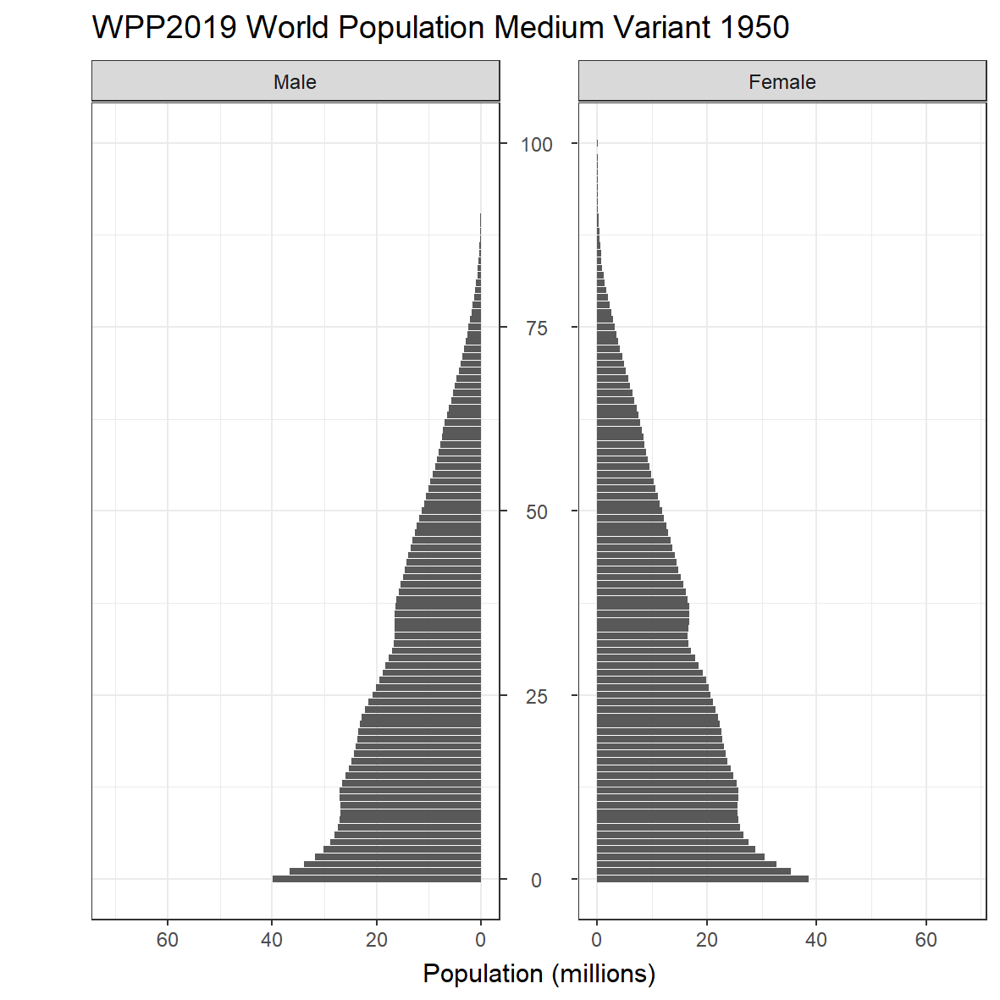

<!-- README.md is generated from README.Rmd. Please edit that file -->

# tidywpp

<!-- badges: start -->

[](https://lifecycle.r-lib.org/articles/stages.html#experimental)
[](https://CRAN.R-project.org/package=tidywpp)
<!-- badges: end -->

## Installation

<!-- You can install the released version of tidywpp from [CRAN](https://CRAN.R-project.org) with: -->
<!-- ``` r -->
<!-- install.packages("tidywpp") -->
<!-- ``` -->

Install the developmental version with:

``` r
library(devtools)
install_github("guyabel/tidywpp", ref = "main")
```

## Example

Download data based on a indicator and variant:

``` r
library(tidywpp)

# single indicator from medium variant of latest WPP
get_wpp(indicator = "TFR")
#> # A tibble: 14,940 x 7
#>    LocID Location    VarID Variant Time      MidPeriod   TFR
#>    <dbl> <chr>       <dbl> <chr>   <chr>         <dbl> <dbl>
#>  1     4 Afghanistan     2 Medium  1950-1955      1953  7.45
#>  2     4 Afghanistan     2 Medium  1955-1960      1958  7.45
#>  3     4 Afghanistan     2 Medium  1960-1965      1963  7.45
#>  4     4 Afghanistan     2 Medium  1965-1970      1968  7.45
#>  5     4 Afghanistan     2 Medium  1970-1975      1973  7.45
#>  6     4 Afghanistan     2 Medium  1975-1980      1978  7.45
#>  7     4 Afghanistan     2 Medium  1980-1985      1983  7.45
#>  8     4 Afghanistan     2 Medium  1985-1990      1988  7.47
#>  9     4 Afghanistan     2 Medium  1990-1995      1993  7.48
#> 10     4 Afghanistan     2 Medium  1995-2000      1998  7.65
#> # ... with 14,930 more rows

# single indicator from multiple variants of latest WPP
get_wpp(indicator = "TFR", variant_id = c(2, 3, 4))
#> # A tibble: 24,060 x 7
#>    LocID Location    VarID Variant Time      MidPeriod   TFR
#>    <dbl> <chr>       <dbl> <chr>   <chr>         <dbl> <dbl>
#>  1     4 Afghanistan     2 Medium  1950-1955      1953  7.45
#>  2     4 Afghanistan     2 Medium  1955-1960      1958  7.45
#>  3     4 Afghanistan     2 Medium  1960-1965      1963  7.45
#>  4     4 Afghanistan     2 Medium  1965-1970      1968  7.45
#>  5     4 Afghanistan     2 Medium  1970-1975      1973  7.45
#>  6     4 Afghanistan     2 Medium  1975-1980      1978  7.45
#>  7     4 Afghanistan     2 Medium  1980-1985      1983  7.45
#>  8     4 Afghanistan     2 Medium  1985-1990      1988  7.47
#>  9     4 Afghanistan     2 Medium  1990-1995      1993  7.48
#> 10     4 Afghanistan     2 Medium  1995-2000      1998  7.65
#> # ... with 24,050 more rows

# multiple population indicators from single variant of latest WPP
get_wpp(indicator = c("PopTotal", "PopMale", "PopFemale"))
#> Downloading from PopulationByAgeSex
#> Also available in: TotalPopulationBySex
#> Also available in: PopulationBySingleAgeSex
#> Use indicator_file_group to get alternative measures
#> # A tibble: 1,404,753 x 12
#>    LocID Location    VarID Variant  Time MidPeriod AgeGrp AgeGrpStart AgeGrpSpan
#>    <dbl> <chr>       <dbl> <chr>   <dbl>     <dbl> <fct>        <dbl>      <dbl>
#>  1     4 Afghanistan     2 Medium   1950     1950. 0-4              0          5
#>  2     4 Afghanistan     2 Medium   1950     1950. 5-9              5          5
#>  3     4 Afghanistan     2 Medium   1950     1950. 10-14           10          5
#>  4     4 Afghanistan     2 Medium   1950     1950. 15-19           15          5
#>  5     4 Afghanistan     2 Medium   1950     1950. 20-24           20          5
#>  6     4 Afghanistan     2 Medium   1950     1950. 25-29           25          5
#>  7     4 Afghanistan     2 Medium   1950     1950. 30-34           30          5
#>  8     4 Afghanistan     2 Medium   1950     1950. 35-39           35          5
#>  9     4 Afghanistan     2 Medium   1950     1950. 40-44           40          5
#> 10     4 Afghanistan     2 Medium   1950     1950. 45-49           45          5
#> # ... with 1,404,743 more rows, and 3 more variables: PopFemale <dbl>,
#> #   PopMale <dbl>, PopTotal <dbl>

# as multiple granularities of population in WPP, there are multiple population indicators.
# use indicator indicator_file_group to select version of population indicator(s)
get_wpp(indicator = c("PopTotal", "PopMale", "PopFemale"), indicator_file_group =  "TotalPopulationBySex")
#> # A tibble: 72,027 x 9
#>    LocID Location    VarID Variant  Time MidPeriod PopFemale PopMale PopTotal
#>    <dbl> <chr>       <dbl> <chr>   <dbl>     <dbl>     <dbl>   <dbl>    <dbl>
#>  1     4 Afghanistan     2 Medium   1950     1950.     3653.   4099.    7752.
#>  2     4 Afghanistan     2 Medium   1951     1952.     3705.   4135.    7840.
#>  3     4 Afghanistan     2 Medium   1952     1952.     3762.   4174.    7936.
#>  4     4 Afghanistan     2 Medium   1953     1954.     3821.   4218.    8040.
#>  5     4 Afghanistan     2 Medium   1954     1954.     3885.   4266.    8151.
#>  6     4 Afghanistan     2 Medium   1955     1956.     3952.   4319.    8271.
#>  7     4 Afghanistan     2 Medium   1956     1956.     4023.   4376.    8399.
#>  8     4 Afghanistan     2 Medium   1957     1958.     4098    4437.    8535.
#>  9     4 Afghanistan     2 Medium   1958     1958.     4177.   4503.    8680.
#> 10     4 Afghanistan     2 Medium   1959     1960.     4260.   4574.    8834.
#> # ... with 72,017 more rows

# tidy sex into a single column and drop id columns
get_wpp(indicator = c("PopMale", "PopFemale"), indicator_file_group =  "TotalPopulationBySex", tidy_pop_sex = TRUE, drop_id_cols = TRUE)
#> # A tibble: 144,054 x 5
#>    Location    Variant  Time Sex      Pop
#>    <chr>       <chr>   <dbl> <chr>  <dbl>
#>  1 Afghanistan Medium   1950 Female 3653.
#>  2 Afghanistan Medium   1950 Male   4099.
#>  3 Afghanistan Medium   1951 Female 3705.
#>  4 Afghanistan Medium   1951 Male   4135.
#>  5 Afghanistan Medium   1952 Female 3762.
#>  6 Afghanistan Medium   1952 Male   4174.
#>  7 Afghanistan Medium   1953 Female 3821.
#>  8 Afghanistan Medium   1953 Male   4218.
#>  9 Afghanistan Medium   1954 Female 3885.
#> 10 Afghanistan Medium   1954 Male   4266.
#> # ... with 144,044 more rows

# clean column names
get_wpp(indicator = c("SRB", "NetMigrations", "GrowthRate"), clean_names = TRUE, drop_id_cols = TRUE)
#> # A tibble: 14,940 x 6
#>    location    variant time      growth_rate net_migrations   srb
#>    <chr>       <chr>   <chr>           <dbl>          <dbl> <dbl>
#>  1 Afghanistan Medium  1950-1955       1.30            -20   1.06
#>  2 Afghanistan Medium  1955-1960       1.68            -20   1.06
#>  3 Afghanistan Medium  1960-1965       2.03            -20   1.06
#>  4 Afghanistan Medium  1965-1970       2.31            -20   1.06
#>  5 Afghanistan Medium  1970-1975       2.54            -20   1.06
#>  6 Afghanistan Medium  1975-1980       1.02          -1154.  1.06
#>  7 Afghanistan Medium  1980-1985      -2.24          -3345.  1.06
#>  8 Afghanistan Medium  1985-1990       0.779         -1525.  1.06
#>  9 Afghanistan Medium  1990-1995       7.56           3076.  1.06
#> 10 Afghanistan Medium  1995-2000       2.75           -868.  1.06
#> # ... with 14,930 more rows

# old life table
get_wpp(indicator = c("qx", "lx", "dx", "Lx", "Tx", "ex"), drop_id_cols = TRUE, wpp_version = 2017)
#> # A tibble: 685,080 x 11
#>    Location  Variant Time  AgeGrp Sex       dx    ex     lx     Lx     qx     Tx
#>    <chr>     <chr>   <chr> <fct>  <chr>  <dbl> <dbl>  <dbl>  <dbl>  <dbl>  <dbl>
#>  1 Afghanis~ Medium  1950~ 0      Male  29429.  27.9 1   e5 8.03e4 0.294  2.79e6
#>  2 Afghanis~ Medium  1950~ 0      Fema~ 26494.  29.4 1   e5 8.28e4 0.265  2.94e6
#>  3 Afghanis~ Medium  1950~ 0      Total 27990.  28.6 1   e5 8.15e4 0.280  2.86e6
#>  4 Afghanis~ Medium  1950~ 1-4    Male  12205.  38.4 7.06e4 2.50e5 0.173  2.71e6
#>  5 Afghanis~ Medium  1950~ 1-4    Fema~ 13026.  38.9 7.35e4 2.60e5 0.177  2.86e6
#>  6 Afghanis~ Medium  1950~ 1-4    Total 12609.  38.6 7.20e4 2.55e5 0.175  2.78e6
#>  7 Afghanis~ Medium  1950~ 5-9    Male   2706.  42.2 5.84e4 2.84e5 0.0464 2.46e6
#>  8 Afghanis~ Medium  1950~ 5-9    Fema~  3085.  43.0 6.05e4 2.93e5 0.0510 2.60e6
#>  9 Afghanis~ Medium  1950~ 5-9    Total  2892.  42.5 5.94e4 2.89e5 0.0487 2.52e6
#> 10 Afghanis~ Medium  1950~ 10-14  Male   1862.  39.2 5.57e4 2.74e5 0.0335 2.18e6
#> # ... with 685,070 more rows
```

## indicator argument

Indicators must use a character string corresponding to the `name`
column in in the `wpp_indicators` data frame. The `find_indicator()`
function can be used to look up the indicator code and availability by
variants, for example

``` r
library(tidywpp)
find_indicator(x = "life expect")
#> # A tibble: 3 x 3
#>   name      details                                             file_group      
#>   <chr>     <chr>                                               <chr>           
#> 1 LEx       Life expectancy at birth for both sexes combined (~ Period_Indicato~
#> 2 LExFemale Female life expectancy at birth (years)             Period_Indicato~
#> 3 LExMale   Male life expectancy at birth (years)               Period_Indicato~
```

There are 35 different indicators in WPP data (starting from 1998), some
with multiple levels of detail.

| name          | details                                                                                                                        | file\_group              |
|:--------------|:-------------------------------------------------------------------------------------------------------------------------------|:-------------------------|
| ASFR          | Age-specific fertility rate (births per 1,000 women)                                                                           | Fertility\_by\_Age       |
| ax            | Average number of years lived (nax) between ages x and x+n by those dying in the interval                                      | Life\_Table              |
| Births        | Number of births, both sexes combined (thousands)                                                                              | Fertility\_by\_Age       |
| Births        | Number of births, both sexes combined (thousands)                                                                              | Period\_Indicators       |
| CBR           | Crude birth rate (births per 1,000 population)                                                                                 | Period\_Indicators       |
| CDR           | Crude death rate (deaths per 1,000 population)                                                                                 | Period\_Indicators       |
| CNMR          | Net migration rate (per 1,000 population)                                                                                      | Period\_Indicators       |
| Deaths        | Number of deaths, both sexes combined (thousands)                                                                              | Period\_Indicators       |
| DeathsFemale  | Number of female deaths (thousands)                                                                                            | Period\_Indicators       |
| DeathsMale    | Number of male deaths (thousands)                                                                                              | Period\_Indicators       |
| dx            | Number of deaths, (ndx), between ages x and x+n                                                                                | Life\_Table              |
| ex            | Expectation of life (ex) at age x, i.e., average number of years lived subsequent to age x by those reaching age x             | Life\_Table              |
| GrowthRate    | Average annual rate of population change (percentage)                                                                          | Period\_Indicators       |
| IMR           | Infant mortality rate, q(1), for both sexes combined (infant deaths per 1,000 live births)                                     | Period\_Indicators       |
| LEx           | Life expectancy at birth for both sexes combined (years)                                                                       | Period\_Indicators       |
| LExFemale     | Female life expectancy at birth (years)                                                                                        | Period\_Indicators       |
| LExMale       | Male life expectancy at birth (years)                                                                                          | Period\_Indicators       |
| lx            | Number of survivors, (lx), at age (x) for 100000 births                                                                        | Life\_Table              |
| Lx            | Number of person-years lived, (nLx), between ages x and x+n                                                                    | Life\_Table              |
| MAC           | Female mean age of childbearing (years)                                                                                        | Period\_Indicators       |
| mx            | Central death rate, nmx, for the age interval (x, x+n)                                                                         | Life\_Table              |
| NatIncr       | Rate of natural increase (per 1,000 population)                                                                                | Period\_Indicators       |
| NetMigrations | Net number of migrants, both sexes combined (thousands)                                                                        | Period\_Indicators       |
| NRR           | Net reproduction rate (surviving daughters per woman)                                                                          | Period\_Indicators       |
| PASFR         | Percentage age-specific fertility rate                                                                                         | Fertility\_by\_Age       |
| PopDensity    | Population per square kilometre (thousands)                                                                                    | TotalPopulationBySex     |
| PopFemale     | Female population in the age group (thousands)                                                                                 | PopulationByAgeSex       |
| PopFemale     | Total female population (thousands)                                                                                            | TotalPopulationBySex     |
| PopFemale     | Female population for the individual age (thousands)                                                                           | PopulationBySingleAgeSex |
| PopFemale     | Female population in the age group (thousands)                                                                                 | PopulationByAgeSex\_5x5  |
| PopMale       | Male population in the age group (thousands)                                                                                   | PopulationByAgeSex       |
| PopMale       | Total male population (thousands)                                                                                              | TotalPopulationBySex     |
| PopMale       | Male population for the individual age (thousands)                                                                             | PopulationBySingleAgeSex |
| PopMale       | Male population in the age group (thousands)                                                                                   | PopulationByAgeSex\_5x5  |
| PopTotal      | Total population in the age group (thousands)                                                                                  | PopulationByAgeSex       |
| PopTotal      | Total population, both sexes (thousands)                                                                                       | TotalPopulationBySex     |
| PopTotal      | Total population for the individual age (thousands)                                                                            | PopulationBySingleAgeSex |
| PopTotal      | Total population in the age group (thousands)                                                                                  | PopulationByAgeSex\_5x5  |
| px            | Probability of surviving, (npx), for an individual of age x to age x+n                                                         | Life\_Table              |
| Q5            | Under-five mortality, 5q0, for both sexes combined (deaths under age five per 1,000 live births)                               | Period\_Indicators       |
| qx            | Probability of dying (nqx), for an individual between age x and x+n                                                            | Life\_Table              |
| SRB           | Sex ratio at birth (male births per female births)                                                                             | Period\_Indicators       |
| Sx            | Survival ratio (nSx) corresponding to proportion of the life table population in age group (x, x+n) who are alive n year later | Life\_Table              |
| TFR           | Total fertility (live births per woman)                                                                                        | Period\_Indicators       |
| Tx            | Person-years lived, (Tx), above age x                                                                                          | Life\_Table              |

## variant\_id argument

The `variant_id` argument must be one or more numbers from the `var_id`
column in the `wpp_indicators` data frame. Not all indicators are
available in all variants. Use the `find_indicator()` function to check
availability, setting `simple = FALSE`, for example

``` r
library(tidywpp)
find_indicator(x = "lx", simple = FALSE)
#> # A tibble: 12 x 7
#>    name  details        var_id variant  file_group file_group_details        wpp
#>    <chr> <chr>           <dbl> <chr>    <chr>      <chr>                   <dbl>
#>  1 lx    Number of sur~      2 Medium   Life_Table Abridged life tables b~  2019
#>  2 Lx    Number of per~      2 Medium   Life_Table Abridged life tables b~  2019
#>  3 lx    Number of sur~    202 Median ~ Life_Table Abridged life tables b~  2019
#>  4 Lx    Number of per~    202 Median ~ Life_Table Abridged life tables b~  2019
#>  5 lx    Number of sur~    203 Upper 8~ Life_Table Abridged life tables b~  2019
#>  6 Lx    Number of per~    203 Upper 8~ Life_Table Abridged life tables b~  2019
#>  7 lx    Number of sur~    204 Lower 8~ Life_Table Abridged life tables b~  2019
#>  8 Lx    Number of per~    204 Lower 8~ Life_Table Abridged life tables b~  2019
#>  9 lx    Number of sur~    206 Upper 9~ Life_Table Abridged life tables b~  2019
#> 10 Lx    Number of per~    206 Upper 9~ Life_Table Abridged life tables b~  2019
#> 11 lx    Number of sur~    207 Lower 9~ Life_Table Abridged life tables b~  2019
#> 12 Lx    Number of per~    207 Lower 9~ Life_Table Abridged life tables b~  2019
```

There are a maximum of 14 different variants in WPP data.

| var\_id | variant                           |
|--------:|:----------------------------------|
|       2 | Medium                            |
|       3 | High                              |
|       4 | Low                               |
|       5 | Constant fertility                |
|       6 | Instant replacement               |
|       7 | Zero migration                    |
|       8 | Constant mortality                |
|       9 | No change                         |
|      10 | Momentum                          |
|     202 | Median PI (BHM median in WPP2015) |
|     203 | Upper 80 PI                       |
|     204 | Lower 80 PI                       |
|     206 | Upper 95 PI                       |
|     207 | Lower 95 PI                       |

## Benefits

Data downloaded using tidywpp is in
[tidy](https://vita.had.co.nz/papers/tidy-data.pdf) form, and hence
requires none or minimal manipulations for use in popular modelling and
visualisation functions in R.

``` r
d <- get_wpp(indicator = c("PopMale", "PopFemale"), indicator_file_group = "PopulationBySingleAgeSex",
             tidy_pop_sex = TRUE, drop_id_cols = TRUE)
d
#> # A tibble: 13,512,386 x 6
#>    Location    Variant  Time AgeGrp Sex      Pop
#>    <chr>       <chr>   <dbl>  <dbl> <chr>  <dbl>
#>  1 Afghanistan Medium   1950      0 Female  155.
#>  2 Afghanistan Medium   1950      0 Male    140.
#>  3 Afghanistan Medium   1950      1 Female  142.
#>  4 Afghanistan Medium   1950      1 Male    132.
#>  5 Afghanistan Medium   1950      2 Female  131.
#>  6 Afghanistan Medium   1950      2 Male    125.
#>  7 Afghanistan Medium   1950      3 Female  121.
#>  8 Afghanistan Medium   1950      3 Male    119.
#>  9 Afghanistan Medium   1950      4 Female  113.
#> 10 Afghanistan Medium   1950      4 Male    114.
#> # ... with 13,512,376 more rows
```

``` r
library(tidyverse)
library(ggpol)
library(gganimate)
g <- d %>%
  filter(Location == "World") %>%
  mutate(pop = ifelse(Sex == "Male", -Pop/1e3, Pop/1e3),
         sex = fct_rev(Sex)) %>%
  ggplot(mapping = aes(x = pop, y = AgeGrp))+
  geom_col(orientation = "y") +
  facet_share(facets = "sex", scales = "free_x") +
  scale_x_continuous(labels = abs) +
  theme_bw() +
  transition_time(time = Time) +
  labs(x = "Population (millions)", y = "", 
       title = 'WPP2019 World Population Medium Variant {round(frame_time)}')

animate(g, width = 15, height = 15, units = "cm", res = 200, 
        renderer = gifski_renderer(), nframes = n_distinct(d$Time))

anim_save(filename = "wpp2019_med.gif")
```


